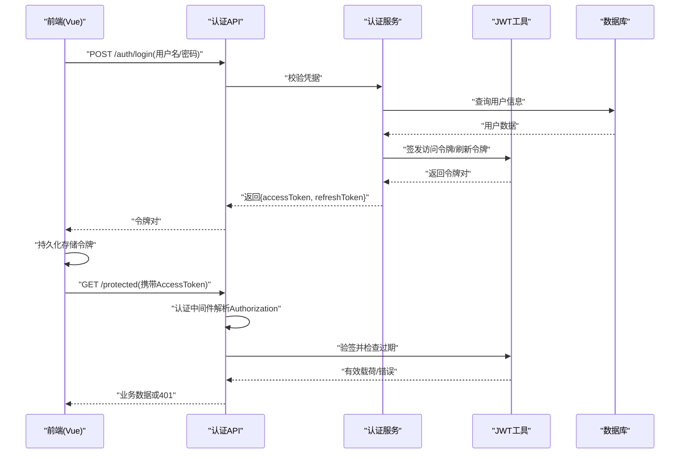
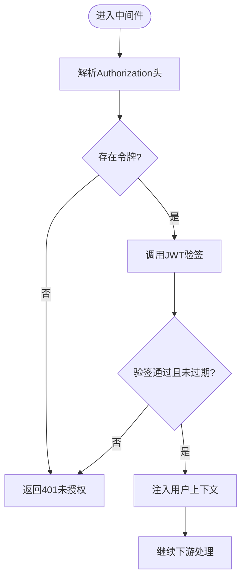
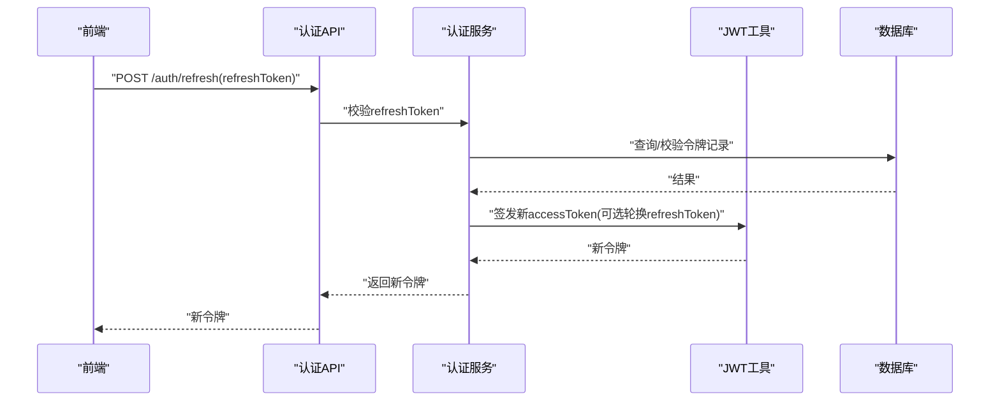
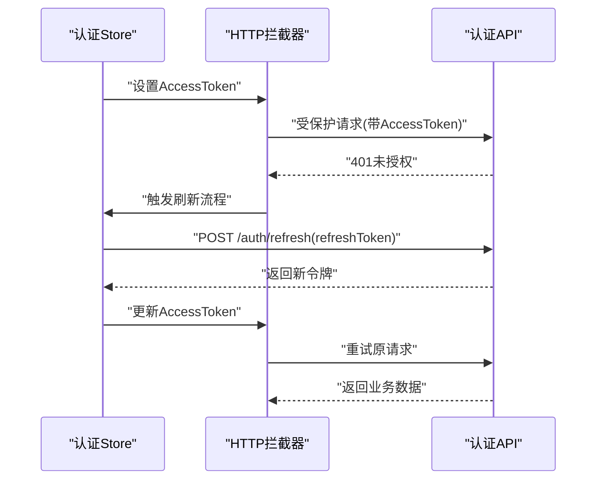
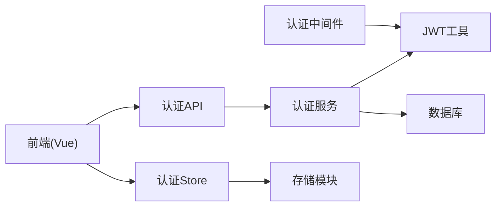

# JWT令牌认证

<cite>
**本文引用的文件**   
- [node-jinmao/utils/jwt.js](file://node-jinmao/utils/jwt.js)
- [node-jinmao/middleware/auth.js](file://node-jinmao/middleware/auth.js)
- [node-jinmao/API/auth.js](file://node-jinmao/API/auth.js)
- [node-jinmao/service/auth/index.js](file://node-jinmao/service/auth/index.js)
- [node-jinmao/service/auth/login.js](file://node-jinmao/service/auth/login.js)
- [node-jinmao/app.js](file://node-jinmao/app.js)
- [test/code/minio-crud.js](file://test/code/minio-crud.js)
- [WEB/src/stores/auth.js](file://WEB/src/stores/auth.js)
- [WEB/src/api/auth.js](file://WEB/src/api/auth.js)
- [WEB/src/utils/storage.js](file://WEB/src/utils/storage.js)
- [node-jinmao/prisma/schema.prisma](file://node-jinmao/prisma/schema.prisma)
</cite>

## 目录
1. [简介](#简介)
2. [项目结构](#项目结构)
3. [核心组件](#核心组件)
4. [架构总览](#架构总览)
5. [详细组件分析](#详细组件分析)
6. [依赖关系分析](#依赖关系分析)
7. [性能考虑](#性能考虑)
8. [故障排查指南](#故障排查指南)
9. [结论](#结论)
10. [附录](#附录)

## 简介
本文件围绕JWT（JSON Web Token）令牌认证系统，系统性说明令牌的生成、验证与刷新机制，涵盖令牌结构、过期时间管理、安全存储策略；解释中间件如何实现请求拦截与权限校验；给出加密算法选择、密钥管理与防重放攻击措施；并提供前端在Vue应用中的集成指南，包括令牌存储与自动刷新逻辑。

## 项目结构
后端采用Node.js服务，JWT相关能力集中在utils与middleware层，API路由通过service层编排业务；前端为Vue应用，负责登录交互、令牌存取与自动刷新。

```mermaid
graph TB
subgraph "前端(Vue)"
FE_API["HTTP客户端<br/>封装请求/响应拦截"]
FE_STORE["认证状态管理<br/>本地存储存取"]
end
subgraph "后端(Node.js)"
APP["应用入口<br/>注册中间件/路由"]
AUTH_MW["认证中间件<br/>解析并校验JWT"]
AUTH_API["认证API路由<br/>登录/刷新/登出"]
AUTH_SVC["认证服务<br/>业务编排"]
JWT_UTIL["JWT工具<br/>签发/验签/刷新"]
DB["数据库<br/>用户/会话等"]
end
FE_API --> AUTH_API
FE_STORE --> FE_API
AUTH_API --> AUTH_SVC
AUTH_SVC --> JWT_UTIL
AUTH_MW --> JWT_UTIL
AUTH_SVC --> DB
APP --> AUTH_MW
APP --> AUTH_API
```

**图表来源** 
- [node-jinmao/app.js](file://node-jinmao/app.js)
- [node-jinmao/middleware/auth.js](file://node-jinmao/middleware/auth.js)
- [node-jinmao/API/auth.js](file://node-jinmao/API/auth.js)
- [node-jinmao/service/auth/index.js](file://node-jinmao/service/auth/index.js)
- [node-jinmao/utils/jwt.js](file://node-jinmao/utils/jwt.js)

**章节来源**
- [node-jinmao/app.js](file://node-jinmao/app.js)
- [node-jinmao/middleware/auth.js](file://node-jinmao/middleware/auth.js)
- [node-jinmao/API/auth.js](file://node-jinmao/API/auth.js)
- [node-jinmao/service/auth/index.js](file://node-jinmao/service/auth/index.js)
- [node-jinmao/utils/jwt.js](file://node-jinmao/utils/jwt.js)

## 核心组件
- JWT工具模块：提供令牌签发、验签、刷新、过期判断等能力。
- 认证中间件：统一拦截受保护请求，解析Header中的Authorization，校验JWT有效性，并将用户上下文注入请求对象。
- 认证API与服务：处理登录、刷新、登出等业务流程，调用JWT工具完成令牌生命周期管理。
- 前端认证模块：封装HTTP请求，维护令牌状态，实现自动刷新与错误重试。

**章节来源**
- [node-jinmao/utils/jwt.js](file://node-jinmao/utils/jwt.js)
- [node-jinmao/middleware/auth.js](file://node-jinmao/middleware/auth.js)
- [node-jinmao/API/auth.js](file://node-jinmao/API/auth.js)
- [node-jinmao/service/auth/index.js](file://node-jinmao/service/auth/index.js)
- [WEB/src/stores/auth.js](file://WEB/src/stores/auth.js)
- [WEB/src/api/auth.js](file://WEB/src/api/auth.js)

## 架构总览
下图展示从前端发起登录到后端签发JWT，再到后续受保护接口访问的完整流程。

**图表来源** 
- [node-jinmao/API/auth.js](file://node-jinmao/API/auth.js)
- [node-jinmao/service/auth/index.js](file://node-jinmao/service/auth/index.js)
- [node-jinmao/utils/jwt.js](file://node-jinmao/utils/jwt.js)
- [node-jinmao/middleware/auth.js](file://node-jinmao/middleware/auth.js)

## 详细组件分析

### JWT工具模块（签发/验签/刷新）
- 功能要点
  - 签发访问令牌（短时效）与刷新令牌（长时效），包含必要声明如用户标识、角色、过期时间等。
  - 验签时校验签名、过期时间与可选的黑名单/撤销标记。
  - 刷新流程基于refresh token换取新的access token，必要时轮换refresh token。
- 数据结构建议
  - access_token：payload含sub、role、exp等；header指定alg与typ。
  - refresh_token：payload含sub、jti、exp、nbf等；可结合服务端存储进行撤销控制。
- 复杂度与性能
  - 签发/验签为O(1)，主要开销在加解密运算；应缓存公钥/密钥配置，避免频繁I/O。
- 优化点
  - 使用异步密钥加载与缓存；批量刷新时合并请求；合理设置过期时间减少网络往返。

**章节来源**
- [node-jinmao/utils/jwt.js](file://node-jinmao/utils/jwt.js)

### 认证中间件（请求拦截与权限校验）
- 职责
  - 从请求头提取Authorization Bearer令牌。
  - 调用JWT工具验签，失败则返回401。
  - 将用户上下文挂载至req.user，供后续控制器使用。
  - 支持按路由或资源维度进行权限校验（例如角色/资源ID）。
- 典型流程
  - 解析Header → 验签 → 检查过期/黑名单 → 注入上下文 → 放行或拒绝。

**图表来源** 
- [node-jinmao/middleware/auth.js](file://node-jinmao/middleware/auth.js)
- [node-jinmao/utils/jwt.js](file://node-jinmao/utils/jwt.js)

**章节来源**
- [node-jinmao/middleware/auth.js](file://node-jinmao/middleware/auth.js)

### 认证API与服务（登录/刷新/登出）
- 登录流程
  - 接收凭据 → 校验格式 → 查询用户 → 比对密码 → 签发令牌对 → 返回前端。
- 刷新流程
  - 接收refresh token → 校验有效性（含黑名单/撤销）→ 签发新access token（可选轮换refresh token）→ 返回新令牌。
- 登出流程
  - 接收token或token ID → 加入黑名单/撤销列表 → 返回成功。

**图表来源** 
- [node-jinmao/API/auth.js](file://node-jinmao/API/auth.js)
- [node-jinmao/service/auth/index.js](file://node-jinmao/service/auth/index.js)
- [node-jinmao/utils/jwt.js](file://node-jinmao/utils/jwt.js)

**章节来源**
- [node-jinmao/API/auth.js](file://node-jinmao/API/auth.js)
- [node-jinmao/service/auth/index.js](file://node-jinmao/service/auth/index.js)
- [node-jinmao/service/auth/login.js](file://node-jinmao/service/auth/login.js)

### 前端集成（Vue应用）
- 存储策略
  - 推荐将access token存于内存或短期存储，refresh token存于httpOnly Cookie或安全的本地存储。
  - 提供统一的存储读写封装，便于切换策略与审计。
- HTTP拦截器
  - 请求前附加Authorization头。
  - 响应401时尝试自动刷新令牌，成功后重试原请求。
- 自动刷新逻辑
  - 检测access token即将过期或已过期 → 调用刷新接口 → 更新本地令牌 → 重试失败请求。
  - 刷新失败则跳转登录页并清理状态。

**图表来源** 
- [WEB/src/stores/auth.js](file://WEB/src/stores/auth.js)
- [WEB/src/api/auth.js](file://WEB/src/api/auth.js)
- [WEB/src/utils/storage.js](file://WEB/src/utils/storage.js)

**章节来源**
- [WEB/src/stores/auth.js](file://WEB/src/stores/auth.js)
- [WEB/src/api/auth.js](file://WEB/src/api/auth.js)
- [WEB/src/utils/storage.js](file://WEB/src/utils/storage.js)

### 令牌结构与过期时间管理
- 访问令牌（access_token）
  - 短时效（如分钟级），用于高频接口鉴权。
  - payload包含用户标识、角色、权限范围、签发时间、过期时间等。
- 刷新令牌（refresh_token）
  - 长时效（如天级），用于换取新access token。
  - 建议配合服务端存储，支持撤销与轮换。
- 过期策略
  - 建议在客户端提前刷新（剩余阈值触发），降低并发刷新概率。
  - 服务端校验nbf/exp，确保严格的时间窗口。

**章节来源**
- [node-jinmao/utils/jwt.js](file://node-jinmao/utils/jwt.js)

### 安全存储策略
- 前端
  - 优先使用httpOnly Cookie存储refresh token，避免XSS窃取。
  - access token可存内存，页面关闭即失效；如需跨标签共享，可使用短期localStorage并设置最小权限。
- 后端
  - 密钥管理：使用环境变量或密钥管理服务，禁止硬编码；定期轮换。
  - 令牌撤销：维护黑名单或令牌版本字段，支持强制下线。

**章节来源**
- [node-jinmao/utils/jwt.js](file://node-jinmao/utils/jwt.js)

### 令牌加密算法选择与密钥管理
- 算法选择
  - HMAC系列（HS256/HS384/HS512）：对称签名，简单高效，适合单服务场景。
  - RSA/ECDSA（RS256/ES256）：非对称签名，适合多服务/微服务分发公钥的场景。
- 密钥管理
  - 生产环境使用密钥管理服务（KMS）或环境变量注入。
  - 定期轮换密钥，支持新旧密钥并行验签过渡期。

**章节来源**
- [node-jinmao/utils/jwt.js](file://node-jinmao/utils/jwt.js)

### 防重放攻击措施
- 请求唯一性
  - 引入nonce与timestamp，服务端去重缓存（TTL短）。
- 速率限制
  - 针对敏感接口实施限流与熔断，防止暴力刷新/重放。
- 令牌绑定
  - 将设备指纹或IP段纳入签名或校验逻辑，增强绑定强度。

[本节为通用安全建议，不直接分析具体文件]

## 依赖关系分析
- 中间件依赖JWT工具进行验签。
- API路由依赖认证服务编排登录/刷新/登出。
- 认证服务依赖数据库进行用户与令牌记录操作。
- 前端依赖HTTP客户端与存储模块，实现令牌存取与自动刷新。

**图表来源** 
- [node-jinmao/middleware/auth.js](file://node-jinmao/middleware/auth.js)
- [node-jinmao/API/auth.js](file://node-jinmao/API/auth.js)
- [node-jinmao/service/auth/index.js](file://node-jinmao/service/auth/index.js)
- [node-jinmao/utils/jwt.js](file://node-jinmao/utils/jwt.js)
- [node-jinmao/prisma/schema.prisma](file://node-jinmao/prisma/schema.prisma)
- [WEB/src/stores/auth.js](file://WEB/src/stores/auth.js)
- [WEB/src/utils/storage.js](file://WEB/src/utils/storage.js)

**章节来源**
- [node-jinmao/middleware/auth.js](file://node-jinmao/middleware/auth.js)
- [node-jinmao/API/auth.js](file://node-jinmao/API/auth.js)
- [node-jinmao/service/auth/index.js](file://node-jinmao/service/auth/index.js)
- [node-jinmao/utils/jwt.js](file://node-jinmao/utils/jwt.js)
- [node-jinmao/prisma/schema.prisma](file://node-jinmao/prisma/schema.prisma)
- [WEB/src/stores/auth.js](file://WEB/src/stores/auth.js)
- [WEB/src/utils/storage.js](file://WEB/src/utils/storage.js)

## 性能考虑
- 令牌验签开销低，但应避免重复I/O；缓存密钥配置与黑名单索引。
- 刷新令牌集中化处理，避免大量并发刷新导致雪崩。
- 前端采用延迟刷新与重试队列，减少无效请求。
- 数据库层面为常用查询建立索引（用户、令牌记录）。

[本节为通用性能建议，不直接分析具体文件]

## 故障排查指南
- 常见错误
  - 401未授权：检查Authorization头是否正确、令牌是否过期、签名是否匹配。
  - 刷新失败：确认refresh token有效、未被撤销；检查刷新接口参数与权限。
  - 前端循环刷新：检查自动刷新逻辑是否误判过期、重试是否无限循环。
- 定位步骤
  - 查看中间件日志输出（解析、验签结果）。
  - 核对JWT工具返回的错误码与消息。
  - 检查前端存储内容与HTTP拦截器行为。
  - 核查数据库令牌记录与黑名单状态。

**章节来源**
- [node-jinmao/middleware/auth.js](file://node-jinmao/middleware/auth.js)
- [node-jinmao/utils/jwt.js](file://node-jinmao/utils/jwt.js)
- [WEB/src/stores/auth.js](file://WEB/src/stores/auth.js)
- [WEB/src/api/auth.js](file://WEB/src/api/auth.js)

## 结论
本方案通过JWT工具、认证中间件与认证服务的协同，实现了完整的令牌签发、验证与刷新闭环。前端采用拦截器与自动刷新策略，提升用户体验与安全性。建议在生产环境中强化密钥管理、令牌撤销与防重放措施，并结合监控与日志完善可观测性。

[本节为总结性内容，不直接分析具体文件]

## 附录
- 参考实现路径
  - 后端JWT工具：[node-jinmao/utils/jwt.js](file://node-jinmao/utils/jwt.js)
  - 认证中间件：[node-jinmao/middleware/auth.js](file://node-jinmao/middleware/auth.js)
  - 认证API与服务：[node-jinmao/API/auth.js](file://node-jinmao/API/auth.js)、[node-jinmao/service/auth/index.js](file://node-jinmao/service/auth/index.js)、[node-jinmao/service/auth/login.js](file://node-jinmao/service/auth/login.js)
  - 前端认证Store与API：[WEB/src/stores/auth.js](file://WEB/src/stores/auth.js)、[WEB/src/api/auth.js](file://WEB/src/api/auth.js)、[WEB/src/utils/storage.js](file://WEB/src/utils/storage.js)
  - 数据库模型：[node-jinmao/prisma/schema.prisma](file://node-jinmao/prisma/schema.prisma)
  - 其他测试示例：[test/code/minio-crud.js](file://test/code/minio-crud.js)