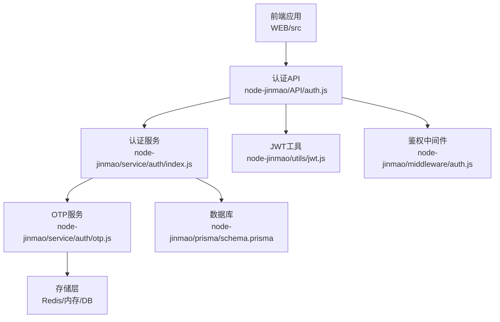
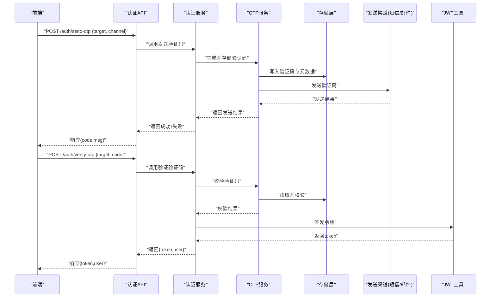
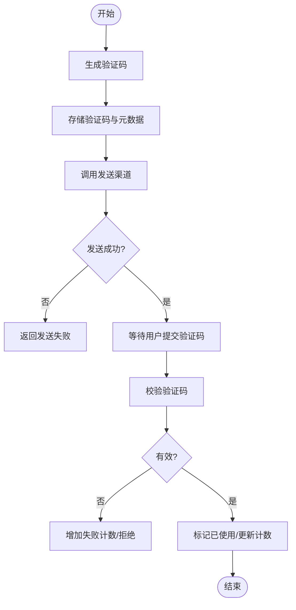
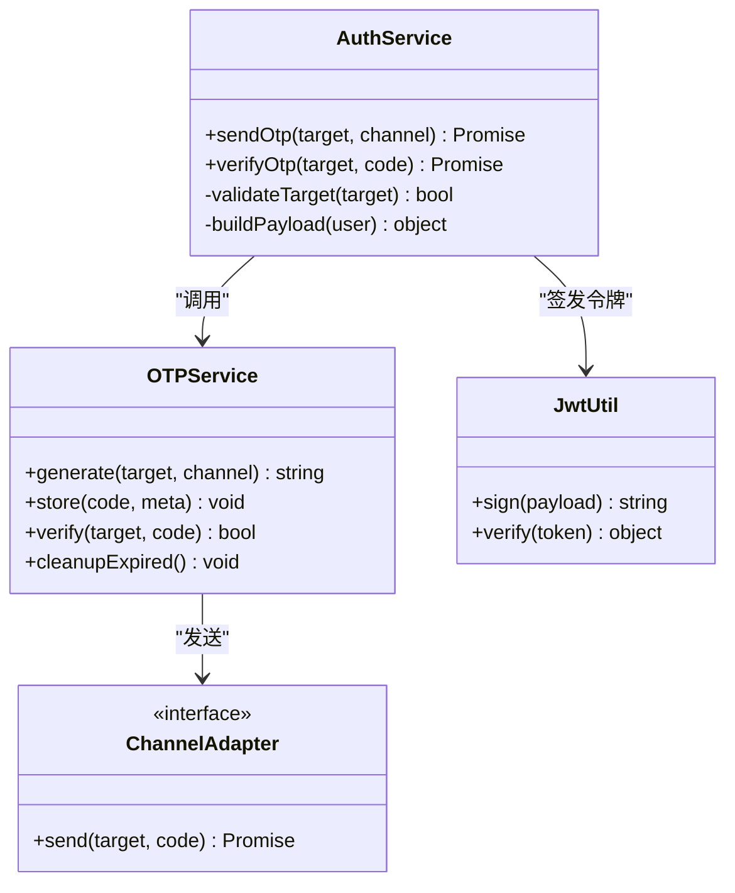
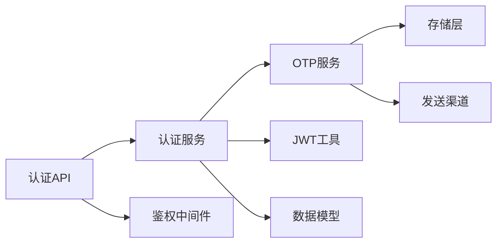

# OTP验证码系统

<cite>
**本文档引用的文件**   
- [node-jinmao/service/auth/otp.js](file://node-jinmao/service/auth/otp.js)
- [node-jinmao/service/auth/index.js](file://node-jinmao/service/auth/index.js)
- [node-jinmao/API/auth.js](file://node-jinmao/API/auth.js)
- [node-jinmao/middleware/auth.js](file://node-jinmao/middleware/auth.js)
- [node-jinmao/utils/jwt.js](file://node-jinmao/utils/jwt.js)
- [node-jinmao/prisma/schema.prisma](file://node-jinmao/prisma/schema.prisma)
- [WEB/src/api/auth.js](file://WEB/src/api/auth.js)
- [WEB/src/pages/login/script.js](file://WEB/src/pages/login/script.js)
</cite>

## 目录
1. [简介](#简介)
2. [项目结构](#项目结构)
3. [核心组件](#核心组件)
4. [架构总览](#架构总览)
5. [详细组件分析](#详细组件分析)
6. [依赖关系分析](#依赖关系分析)
7. [性能考虑](#性能考虑)
8. [故障排查指南](#故障排查指南)
9. [结论](#结论)
10. [附录：API接口与使用示例](#附录api接口与使用示例)

## 简介
本文件面向OTP（一次性验证码）验证码系统的实现与使用，覆盖以下方面：
- 验证码的生成、发送、校验流程
- 多通道发送能力（短信、邮件等可扩展）
- 安全机制（有效期控制、使用次数限制、防暴力破解策略）
- 配置方法与扩展机制
- 错误处理、重试逻辑与性能优化建议
- API接口文档与前端集成示例

## 项目结构
OTP相关代码主要位于后端服务与前端调用层：
- 后端服务层：认证服务模块包含OTP业务逻辑
- API路由层：对外暴露验证码相关的HTTP接口
- 中间件：鉴权与JWT处理
- 数据模型：Prisma Schema定义用户与验证码相关表结构
- 前端：调用认证API并驱动登录流程

**图表来源** 
- [node-jinmao/API/auth.js](file://node-jinmao/API/auth.js)
- [node-jinmao/service/auth/index.js](file://node-jinmao/service/auth/index.js)
- [node-jinmao/service/auth/otp.js](file://node-jinmao/service/auth/otp.js)
- [node-jinmao/utils/jwt.js](file://node-jinmao/utils/jwt.js)
- [node-jinmao/middleware/auth.js](file://node-jinmao/middleware/auth.js)
- [node-jinmao/prisma/schema.prisma](file://node-jinmao/prisma/schema.prisma)

**章节来源**
- [node-jinmao/service/auth/index.js](file://node-jinmao/service/auth/index.js)
- [node-jinmao/service/auth/otp.js](file://node-jinmao/service/auth/otp.js)
- [node-jinmao/API/auth.js](file://node-jinmao/API/auth.js)
- [node-jinmao/middleware/auth.js](file://node-jinmao/middleware/auth.js)
- [node-jinmao/utils/jwt.js](file://node-jinmao/utils/jwt.js)
- [node-jinmao/prisma/schema.prisma](file://node-jinmao/prisma/schema.prisma)

## 核心组件
- OTP服务：负责验证码的生成、存储、过期清理、校验与计数限制
- 认证服务：编排登录流程，协调OTP与用户信息、令牌签发
- API路由：提供发送验证码、验证验证码、获取用户信息等接口
- 中间件：统一鉴权、限流与错误处理
- 存储层：用于缓存验证码、统计失败次数、维护会话状态
- 数据模型：用户、验证码记录等持久化结构

**章节来源**
- [node-jinmao/service/auth/otp.js](file://node-jinmao/service/auth/otp.js)
- [node-jinmao/service/auth/index.js](file://node-jinmao/service/auth/index.js)
- [node-jinmao/API/auth.js](file://node-jinmao/API/auth.js)
- [node-jinmao/middleware/auth.js](file://node-jinmao/middleware/auth.js)
- [node-jinmao/prisma/schema.prisma](file://node-jinmao/prisma/schema.prisma)

## 架构总览
OTP系统采用分层架构：前端通过API调用认证服务，认证服务委托OTP服务完成验证码生命周期管理，并通过存储层进行状态与计数控制。JWT用于后续请求的鉴权。

**图表来源** 
- [node-jinmao/API/auth.js](file://node-jinmao/API/auth.js)
- [node-jinmao/service/auth/index.js](file://node-jinmao/service/auth/index.js)
- [node-jinmao/service/auth/otp.js](file://node-jinmao/service/auth/otp.js)
- [node-jinmao/utils/jwt.js](file://node-jinmao/utils/jwt.js)

## 详细组件分析

### OTP服务（验证码生命周期管理）
职责：
- 生成随机验证码（长度、字符集可配置）
- 存储验证码及元数据（目标、渠道、创建时间、过期时间、使用次数）
- 校验验证码（匹配、未过期、未超限）
- 清理过期记录与失败计数
- 支持多通道发送（短信、邮件等）

关键流程要点：
- 生成：基于安全随机源生成数字或字母数字组合
- 存储：设置TTL（过期时间），记录创建时间与使用次数上限
- 校验：逐条检查匹配性、过期状态、使用次数；通过后标记已使用
- 清理：定时任务或惰性清理过期键值，释放资源
- 扩展：新增渠道只需实现发送适配器接口

**图表来源** 
- [node-jinmao/service/auth/otp.js](file://node-jinmao/service/auth/otp.js)

**章节来源**
- [node-jinmao/service/auth/otp.js](file://node-jinmao/service/auth/otp.js)

### 认证服务（登录编排）
职责：
- 接收前端请求，参数校验
- 调用OTP服务发送验证码
- 验证成功后签发JWT并返回用户信息
- 统一错误码与消息

关键流程要点：
- 发送验证码：校验目标格式（手机号/邮箱）、渠道合法性
- 验证验证码：比对输入与存储值，成功后生成令牌
- 错误处理：区分网络异常、渠道失败、验证码无效、频率限制等

**图表来源** 
- [node-jinmao/service/auth/index.js](file://node-jinmao/service/auth/index.js)
- [node-jinmao/service/auth/otp.js](file://node-jinmao/service/auth/otp.js)
- [node-jinmao/utils/jwt.js](file://node-jinmao/utils/jwt.js)

**章节来源**
- [node-jinmao/service/auth/index.js](file://node-jinmao/service/auth/index.js)

### API路由（对外接口）
职责：
- 暴露发送验证码与验证验证码接口
- 统一入参校验、出参格式、错误码
- 结合中间件实现鉴权与限流

关键接口：
- POST /auth/send-otp：发送验证码
- POST /auth/verify-otp：验证验证码
- GET /auth/me：获取当前用户信息（需鉴权）

错误码建议：
- 400：参数错误
- 429：频率限制
- 500：内部错误
- 渠道特定错误：如短信网关不可用

**章节来源**
- [node-jinmao/API/auth.js](file://node-jinmao/API/auth.js)

### 中间件（鉴权与限流）
职责：
- 解析并校验JWT
- 对敏感接口实施访问控制
- 可选：IP/账号维度的速率限制

关键点：
- 白名单路径放行（如发送验证码）
- 黑名单路径拦截（如修改密码）
- 限流策略：滑动窗口或令牌桶

**章节来源**
- [node-jinmao/middleware/auth.js](file://node-jinmao/middleware/auth.js)

### 数据模型（用户与验证码）
职责：
- 定义用户实体与验证码记录
- 约束字段类型与索引，提升查询性能

关键字段建议：
- 用户：id、手机号、邮箱、状态、创建时间
- 验证码：id、目标、渠道、验证码、创建时间、过期时间、使用次数、是否已使用

**章节来源**
- [node-jinmao/prisma/schema.prisma](file://node-jinmao/prisma/schema.prisma)

### 前端集成（调用与交互）
职责：
- 调用发送验证码接口，展示倒计时与重试按钮
- 收集用户输入并提交验证
- 保存并携带JWT进行后续请求

关键点：
- 防抖与节流：避免重复点击导致频繁发送
- 错误提示：根据后端错误码给出友好提示
- 本地状态：验证码输入框禁用、倒计时状态管理

**章节来源**
- [WEB/src/api/auth.js](file://WEB/src/api/auth.js)
- [WEB/src/pages/login/script.js](file://WEB/src/pages/login/script.js)

## 依赖关系分析
- API路由依赖认证服务与中间件
- 认证服务依赖OTP服务与JWT工具
- OTP服务依赖存储层与发送渠道适配器
- 数据模型由Prisma管理，确保一致性

**图表来源** 
- [node-jinmao/API/auth.js](file://node-jinmao/API/auth.js)
- [node-jinmao/service/auth/index.js](file://node-jinmao/service/auth/index.js)
- [node-jinmao/service/auth/otp.js](file://node-jinmao/service/auth/otp.js)
- [node-jinmao/utils/jwt.js](file://node-jinmao/utils/jwt.js)
- [node-jinmao/middleware/auth.js](file://node-jinmao/middleware/auth.js)
- [node-jinmao/prisma/schema.prisma](file://node-jinmao/prisma/schema.prisma)

**章节来源**
- [node-jinmao/API/auth.js](file://node-jinmao/API/auth.js)
- [node-jinmao/service/auth/index.js](file://node-jinmao/service/auth/index.js)
- [node-jinmao/service/auth/otp.js](file://node-jinmao/service/auth/otp.js)
- [node-jinmao/utils/jwt.js](file://node-jinmao/utils/jwt.js)
- [node-jinmao/middleware/auth.js](file://node-jinmao/middleware/auth.js)
- [node-jinmao/prisma/schema.prisma](file://node-jinmao/prisma/schema.prisma)

## 性能考虑
- 存储选择：优先使用Redis等内存KV存储，降低延迟
- TTL与清理：合理设置过期时间，启用惰性清理与定时任务
- 并发控制：使用分布式锁或原子操作防止竞态条件
- 批量发送：高并发场景下队列化发送，削峰填谷
- 缓存热点：对频繁校验的目标进行失败计数缓存
- 连接池：外部渠道（短信/邮件）使用连接池与超时控制

[本节为通用指导，不直接分析具体文件]

## 故障排查指南
常见问题与定位方法：
- 发送失败：检查渠道配置、网络连通性与配额限制
- 验证码无效：确认未过期、未超限、输入无误
- 频繁触发限流：检查前端重试逻辑与后端速率限制策略
- 令牌失效：核对JWT签名算法、过期时间与客户端携带方式
- 性能抖动：监控存储层命中率、外部渠道响应时延

建议日志维度：
- 请求ID、目标、渠道、错误码、耗时、失败原因
- 存储读写耗时、渠道发送耗时

**章节来源**
- [node-jinmao/API/auth.js](file://node-jinmao/API/auth.js)
- [node-jinmao/service/auth/index.js](file://node-jinmao/service/auth/index.js)
- [node-jinmao/service/auth/otp.js](file://node-jinmao/service/auth/otp.js)
- [node-jinmao/middleware/auth.js](file://node-jinmao/middleware/auth.js)

## 结论
OTP系统通过清晰的分层设计与可扩展的渠道适配，实现了安全、稳定、高性能的一次性验证码服务。配合合理的有效期控制、使用次数限制与防暴力破解策略，能够有效保障账户安全。建议在生产环境引入完善的监控、告警与审计机制，持续优化性能与用户体验。

[本节为总结性内容，不直接分析具体文件]

## 附录：API接口与使用示例

### 接口定义
- POST /auth/send-otp
  - 请求体：{ target: string, channel: string }
  - 响应：{ code: number, msg: string }
- POST /auth/verify-otp
  - 请求体：{ target: string, code: string }
  - 响应：{ token: string, user: object }
- GET /auth/me
  - 头部：Authorization: Bearer <token>
  - 响应：{ user: object }

### 使用示例（前端）
- 发送验证码：调用发送接口，显示倒计时与重试按钮
- 验证验证码：收集用户输入，提交验证接口，保存token
- 后续请求：在请求头携带Authorization

**章节来源**
- [node-jinmao/API/auth.js](file://node-jinmao/API/auth.js)
- [WEB/src/api/auth.js](file://WEB/src/api/auth.js)
- [WEB/src/pages/login/script.js](file://WEB/src/pages/login/script.js)