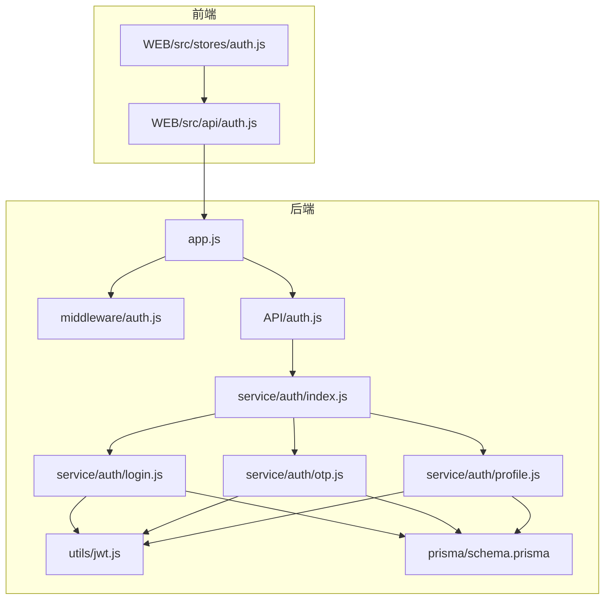
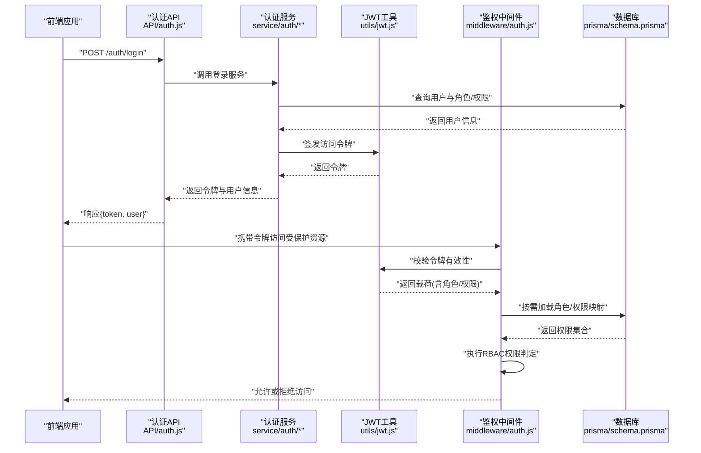
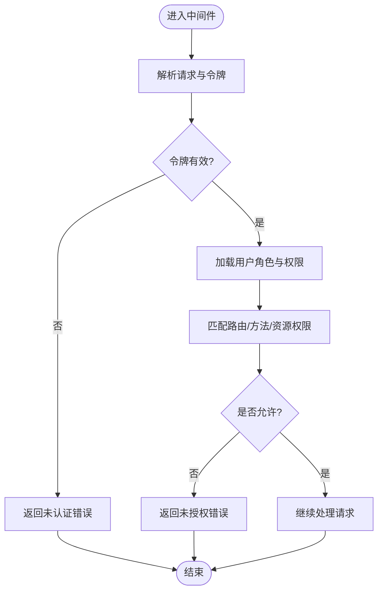
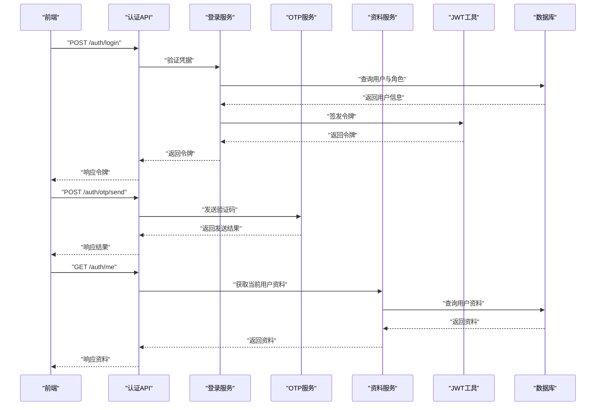
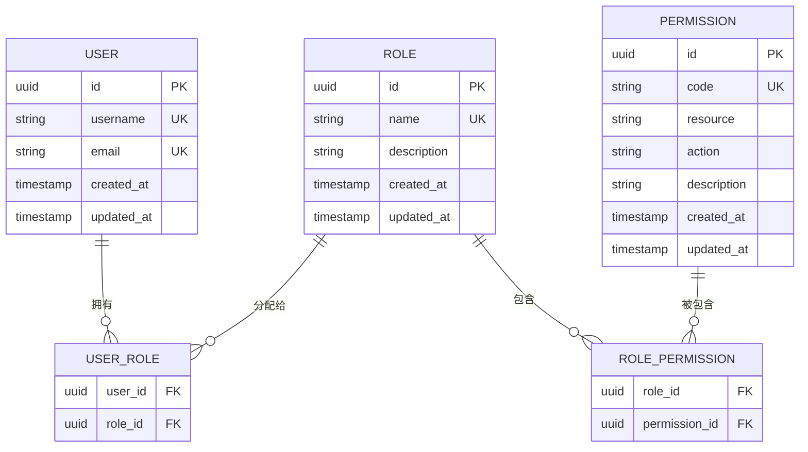
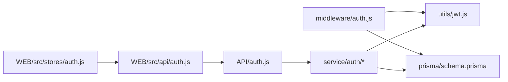

# 权限控制系统

<cite>
**本文引用的文件**   
- [node-jinmao/middleware/auth.js](file://node-jinmao/middleware/auth.js)
- [node-jinmao/API/auth.js](file://node-jinmao/API/auth.js)
- [node-jinmao/service/auth/index.js](file://node-jinmao/service/auth/index.js)
- [node-jinmao/service/auth/login.js](file://node-jinmao/service/auth/login.js)
- [node-jinmao/service/auth/otp.js](file://node-jinmao/service/auth/otp.js)
- [node-jinmao/service/auth/profile.js](file://node-jinmao/service/auth/profile.js)
- [node-jinmao/utils/jwt.js](file://node-jinmao/utils/jwt.js)
- [node-jinmao/prisma/schema.prisma](file://node-jinmao/prisma/schema.prisma)
- [node-jinmao/app.js](file://node-jinmao/app.js)
- [WEB/src/stores/auth.js](file://WEB/src/stores/auth.js)
- [WEB/src/api/auth.js](file://WEB/src/api/auth.js)
</cite>

## 目录
1. [简介](#简介)
2. [项目结构](#项目结构)
3. [核心组件](#核心组件)
4. [架构总览](#架构总览)
5. [详细组件分析](#详细组件分析)
6. [依赖关系分析](#依赖关系分析)
7. [性能考虑](#性能考虑)
8. [故障排查指南](#故障排查指南)
9. [结论](#结论)
10. [附录](#附录)

## 简介
本文件面向“基于角色的访问控制（RBAC）”的权限控制系统，围绕角色定义、权限分配与资源访问控制展开，重点说明中间件如何实现细粒度的权限验证，支持API级别的权限控制。文档同时涵盖权限检查的实现逻辑（动态权限判断、继承关系处理）、权限缓存策略与性能优化方案，并提供权限配置示例与自定义权限规则的开发指南。

## 项目结构
后端采用 Node.js + Express 风格的服务组织方式：
- 认证与鉴权入口集中在 middleware 与 API 层
- 业务服务位于 service/auth 下，负责登录、OTP、资料等流程
- JWT 工具在 utils/jwt.js 中提供令牌签发与校验能力
- 数据模型通过 Prisma schema 管理用户、角色、权限等实体
- 前端 WEB 端包含认证状态管理与 API 调用封装

图表来源
- [node-jinmao/app.js](file://node-jinmao/app.js)
- [node-jinmao/middleware/auth.js](file://node-jinmao/middleware/auth.js)
- [node-jinmao/API/auth.js](file://node-jinmao/API/auth.js)
- [node-jinmao/service/auth/index.js](file://node-jinmao/service/auth/index.js)
- [node-jinmao/service/auth/login.js](file://node-jinmao/service/auth/login.js)
- [node-jinmao/service/auth/otp.js](file://node-jinmao/service/auth/otp.js)
- [node-jinmao/service/auth/profile.js](file://node-jinmao/service/auth/profile.js)
- [node-jinmao/utils/jwt.js](file://node-jinmao/utils/jwt.js)
- [node-jinmao/prisma/schema.prisma](file://node-jinmao/prisma/schema.prisma)
- [WEB/src/stores/auth.js](file://WEB/src/stores/auth.js)
- [WEB/src/api/auth.js](file://WEB/src/api/auth.js)

章节来源
- [node-jinmao/app.js](file://node-jinmao/app.js)
- [node-jinmao/middleware/auth.js](file://node-jinmao/middleware/auth.js)
- [node-jinmao/API/auth.js](file://node-jinmao/API/auth.js)
- [node-jinmao/service/auth/index.js](file://node-jinmao/service/auth/index.js)
- [node-jinmao/service/auth/login.js](file://node-jinmao/service/auth/login.js)
- [node-jinmao/service/auth/otp.js](file://node-jinmao/service/auth/otp.js)
- [node-jinmao/service/auth/profile.js](file://node-jinmao/service/auth/profile.js)
- [node-jinmao/utils/jwt.js](file://node-jinmao/utils/jwt.js)
- [node-jinmao/prisma/schema.prisma](file://node-jinmao/prisma/schema.prisma)
- [WEB/src/stores/auth.js](file://WEB/src/stores/auth.js)
- [WEB/src/api/auth.js](file://WEB/src/api/auth.js)

## 核心组件
- 认证中间件（middleware/auth.js）：统一鉴权入口，解析请求上下文中的身份标识，执行权限判定并拦截未授权访问。
- 认证API（API/auth.js）：对外暴露登录、登出、刷新等接口，协调认证服务完成业务流程。
- 认证服务（service/auth/*）：实现登录、OTP、个人资料等业务逻辑，必要时调用JWT工具生成或校验令牌。
- JWT工具（utils/jwt.js）：提供令牌的签发、解码、校验与过期处理。
- 数据模型（prisma/schema.prisma）：定义用户、角色、权限及关联关系，支撑RBAC的数据基础。
- 前端认证状态（WEB/src/stores/auth.js）与API封装（WEB/src/api/auth.js）：维护客户端认证态，发起认证相关请求。

章节来源
- [node-jinmao/middleware/auth.js](file://node-jinmao/middleware/auth.js)
- [node-jinmao/API/auth.js](file://node-jinmao/API/auth.js)
- [node-jinmao/service/auth/index.js](file://node-jinmao/service/auth/index.js)
- [node-jinmao/service/auth/login.js](file://node-jinmao/service/auth/login.js)
- [node-jinmao/service/auth/otp.js](file://node-jinmao/service/auth/otp.js)
- [node-jinmao/service/auth/profile.js](file://node-jinmao/service/auth/profile.js)
- [node-jinmao/utils/jwt.js](file://node-jinmao/utils/jwt.js)
- [node-jinmao/prisma/schema.prisma](file://node-jinmao/prisma/schema.prisma)
- [WEB/src/stores/auth.js](file://WEB/src/stores/auth.js)
- [WEB/src/api/auth.js](file://WEB/src/api/auth.js)

## 架构总览
下图展示了从前端到后端的认证与鉴权主流程，包括登录、令牌签发、中间件鉴权与RBAC权限判定。

图表来源
- [node-jinmao/API/auth.js](file://node-jinmao/API/auth.js)
- [node-jinmao/service/auth/index.js](file://node-jinmao/service/auth/index.js)
- [node-jinmao/service/auth/login.js](file://node-jinmao/service/auth/login.js)
- [node-jinmao/service/auth/otp.js](file://node-jinmao/service/auth/otp.js)
- [node-jinmao/service/auth/profile.js](file://node-jinmao/service/auth/profile.js)
- [node-jinmao/utils/jwt.js](file://node-jinmao/utils/jwt.js)
- [node-jinmao/middleware/auth.js](file://node-jinmao/middleware/auth.js)
- [node-jinmao/prisma/schema.prisma](file://node-jinmao/prisma/schema.prisma)

## 详细组件分析

### 认证中间件（RBAC鉴权）
- 职责
  - 解析请求头中的认证信息（如Authorization），提取并校验JWT。
  - 将用户身份与角色/权限注入请求上下文，供后续控制器使用。
  - 根据路由或控制器标注的权限要求，执行RBAC判定，拒绝无权限访问。
- 关键流程
  - 令牌校验失败：直接返回未认证错误。
  - 令牌有效：加载用户角色与权限集合，进行权限匹配。
  - 权限不匹配：返回未授权错误；匹配成功：放行至控制器。
- 扩展点
  - 支持按路由路径、HTTP方法、资源ID等维度进行细粒度控制。
  - 可结合缓存减少重复权限查询。

图表来源
- [node-jinmao/middleware/auth.js](file://node-jinmao/middleware/auth.js)

章节来源
- [node-jinmao/middleware/auth.js](file://node-jinmao/middleware/auth.js)

### 认证API（登录、OTP、资料）
- 登录接口
  - 接收用户名/密码或手机号/验证码等凭据。
  - 调用登录服务验证用户身份，签发JWT并返回给前端。
- OTP接口
  - 发送一次性验证码，校验验证码并用于临时登录或敏感操作。
- 资料接口
  - 获取/更新当前用户资料，可能涉及权限校验（如仅本人可修改）。

图表来源
- [node-jinmao/API/auth.js](file://node-jinmao/API/auth.js)
- [node-jinmao/service/auth/login.js](file://node-jinmao/service/auth/login.js)
- [node-jinmao/service/auth/otp.js](file://node-jinmao/service/auth/otp.js)
- [node-jinmao/service/auth/profile.js](file://node-jinmao/service/auth/profile.js)
- [node-jinmao/utils/jwt.js](file://node-jinmao/utils/jwt.js)
- [node-jinmao/prisma/schema.prisma](file://node-jinmao/prisma/schema.prisma)

章节来源
- [node-jinmao/API/auth.js](file://node-jinmao/API/auth.js)
- [node-jinmao/service/auth/login.js](file://node-jinmao/service/auth/login.js)
- [node-jinmao/service/auth/otp.js](file://node-jinmao/service/auth/otp.js)
- [node-jinmao/service/auth/profile.js](file://node-jinmao/service/auth/profile.js)

### JWT工具（令牌签发与校验）
- 功能
  - 签发访问令牌，包含用户标识、角色、权限等必要载荷。
  - 校验令牌签名与有效期，防止伪造与过期使用。
- 安全建议
  - 使用强密钥与合理过期时间。
  - 避免在令牌中存放敏感信息。
  - 支持刷新机制以平衡安全性与用户体验。

章节来源
- [node-jinmao/utils/jwt.js](file://node-jinmao/utils/jwt.js)

### 数据模型（RBAC实体）
- 典型实体
  - 用户（User）：账号基本信息。
  - 角色（Role）：一组权限的集合。
  - 权限（Permission）：对资源与操作的抽象。
  - 用户-角色（UserRole）：多对多关系。
  - 角色-权限（RolePermission）：多对多关系。
- 设计要点
  - 支持角色继承（父角色包含子角色权限）。
  - 支持资源级权限（如特定资源ID的访问控制）。
  - 支持动态权限（运行时计算权限）。

图表来源
- [node-jinmao/prisma/schema.prisma](file://node-jinmao/prisma/schema.prisma)

章节来源
- [node-jinmao/prisma/schema.prisma](file://node-jinmao/prisma/schema.prisma)

### 前端认证状态与API封装
- 状态管理（stores/auth.js）
  - 维护登录态、令牌、用户信息与权限列表。
  - 提供登录、登出、刷新等操作。
- API封装（api/auth.js）
  - 封装认证相关请求，自动附加令牌与处理错误。

章节来源
- [WEB/src/stores/auth.js](file://WEB/src/stores/auth.js)
- [WEB/src/api/auth.js](file://WEB/src/api/auth.js)

## 依赖关系分析
- 中间件依赖JWT工具进行令牌校验，依赖数据模型进行权限查询。
- 认证API依赖认证服务完成具体业务逻辑。
- 认证服务依赖JWT工具与数据库。
- 前端依赖后端API与本地存储。

图表来源
- [node-jinmao/middleware/auth.js](file://node-jinmao/middleware/auth.js)
- [node-jinmao/utils/jwt.js](file://node-jinmao/utils/jwt.js)
- [node-jinmao/prisma/schema.prisma](file://node-jinmao/prisma/schema.prisma)
- [node-jinmao/API/auth.js](file://node-jinmao/API/auth.js)
- [node-jinmao/service/auth/index.js](file://node-jinmao/service/auth/index.js)
- [node-jinmao/service/auth/login.js](file://node-jinmao/service/auth/login.js)
- [node-jinmao/service/auth/otp.js](file://node-jinmao/service/auth/otp.js)
- [node-jinmao/service/auth/profile.js](file://node-jinmao/service/auth/profile.js)
- [WEB/src/stores/auth.js](file://WEB/src/stores/auth.js)
- [WEB/src/api/auth.js](file://WEB/src/api/auth.js)

章节来源
- [node-jinmao/middleware/auth.js](file://node-jinmao/middleware/auth.js)
- [node-jinmao/utils/jwt.js](file://node-jinmao/utils/jwt.js)
- [node-jinmao/prisma/schema.prisma](file://node-jinmao/prisma/schema.prisma)
- [node-jinmao/API/auth.js](file://node-jinmao/API/auth.js)
- [node-jinmao/service/auth/index.js](file://node-jinmao/service/auth/index.js)
- [node-jinmao/service/auth/login.js](file://node-jinmao/service/auth/login.js)
- [node-jinmao/service/auth/otp.js](file://node-jinmao/service/auth/otp.js)
- [node-jinmao/service/auth/profile.js](file://node-jinmao/service/auth/profile.js)
- [WEB/src/stores/auth.js](file://WEB/src/stores/auth.js)
- [WEB/src/api/auth.js](file://WEB/src/api/auth.js)

## 性能考虑
- 权限缓存策略
  - 用户-角色-权限映射缓存：在内存或Redis中缓存用户的权限集合，设置合理的TTL。
  - 路由级权限缓存：对高频访问的路由权限判定结果进行短期缓存。
  - JWT载荷缓存：将必要的角色/权限放入JWT载荷，减少每次鉴权的数据库查询。
- 查询优化
  - 使用预加载与批量查询，避免N+1问题。
  - 为常用查询字段建立索引（如用户ID、角色ID、权限代码）。
- 令牌策略
  - 短时效访问令牌配合刷新令牌，降低泄露风险。
  - 服务端黑名单或灰度撤销机制，支持快速失效。
- 并发与限流
  - 对认证接口实施速率限制，防止暴力破解。
  - 使用连接池与异步处理提升吞吐。

[本节为通用指导，无需列出具体文件来源]

## 故障排查指南
- 常见问题
  - 令牌无效或过期：检查JWT签发与校验逻辑、密钥配置与过期时间。
  - 权限不足：确认用户角色与权限映射是否正确，路由权限标注是否匹配。
  - 登录失败：核对凭据校验逻辑与数据库记录。
- 定位步骤
  - 查看中间件日志，确认令牌解析与权限判定过程。
  - 检查认证服务的输入输出与异常处理。
  - 验证数据模型与迁移脚本的一致性。
- 修复建议
  - 增加更详细的错误码与消息，便于前端提示。
  - 引入审计日志记录鉴权失败原因。
  - 单元测试覆盖边界条件（空令牌、非法载荷、缺失权限等）。

章节来源
- [node-jinmao/middleware/auth.js](file://node-jinmao/middleware/auth.js)
- [node-jinmao/API/auth.js](file://node-jinmao/API/auth.js)
- [node-jinmao/service/auth/login.js](file://node-jinmao/service/auth/login.js)
- [node-jinmao/service/auth/otp.js](file://node-jinmao/service/auth/otp.js)
- [node-jinmao/service/auth/profile.js](file://node-jinmao/service/auth/profile.js)
- [node-jinmao/utils/jwt.js](file://node-jinmao/utils/jwt.js)
- [node-jinmao/prisma/schema.prisma](file://node-jinmao/prisma/schema.prisma)

## 结论
本权限控制系统以RBAC为核心，通过中间件实现统一的鉴权入口，结合JWT与数据模型完成细粒度的API级别权限控制。通过合理的缓存策略与查询优化，可在保证安全性的前提下提升系统性能。建议在开发过程中遵循最小权限原则，持续完善权限配置与监控告警，确保系统的可扩展性与可维护性。

[本节为总结性内容，无需列出具体文件来源]

## 附录
- 权限配置示例
  - 角色定义：管理员、编辑者、普通用户。
  - 权限分配：管理员拥有全部权限，编辑者可编辑课程与题库，普通用户仅可学习。
  - 资源访问控制：按模块（课程、题库、报告）与方法（读、写、删）进行控制。
- 自定义权限规则开发指南
  - 在中间件中扩展权限判定逻辑，支持动态表达式或函数式判断。
  - 在控制器层添加注解或元数据，声明所需权限。
  - 提供权限测试用例，覆盖正常与异常场景。
  - 结合缓存与审计日志，持续优化性能与可观测性。

[本节为概念性内容，无需列出具体文件来源]