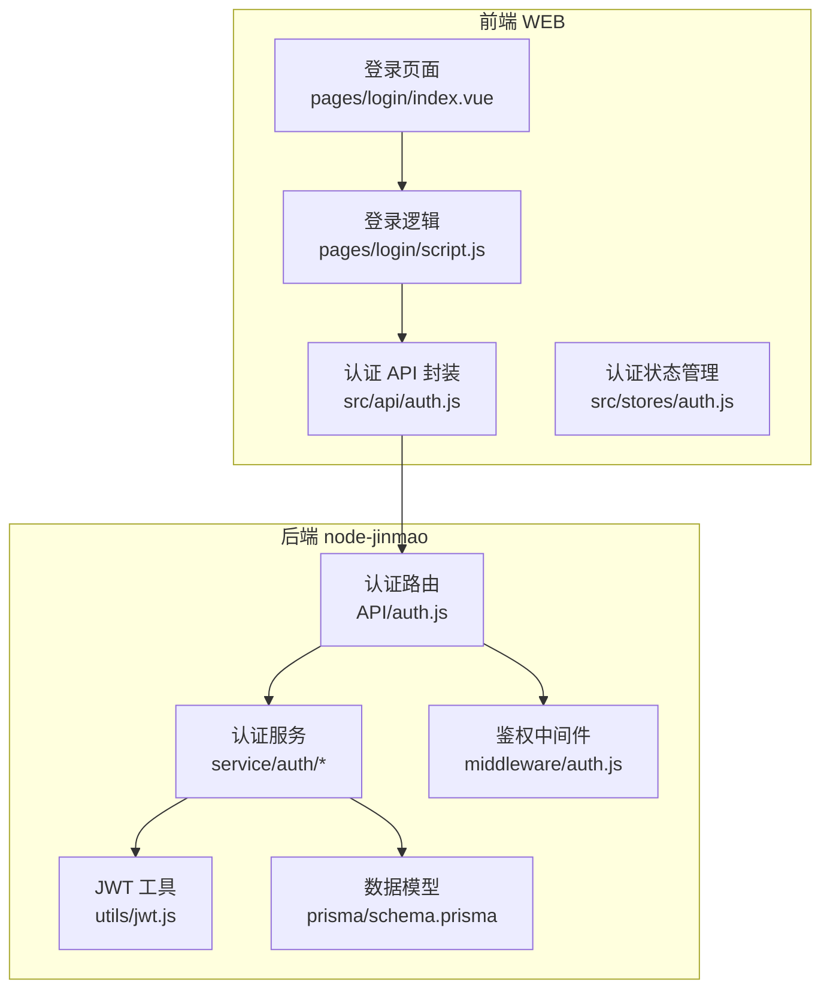
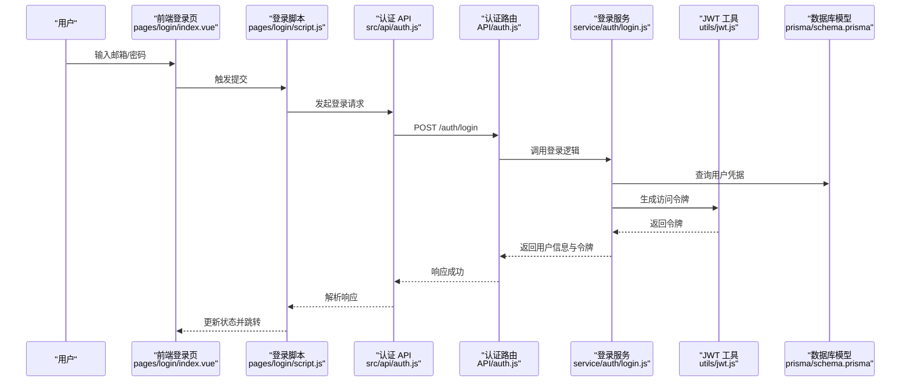
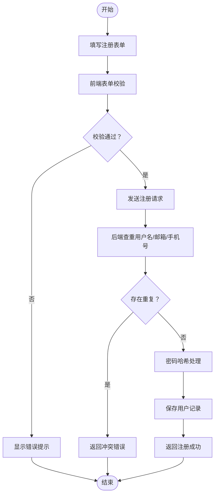
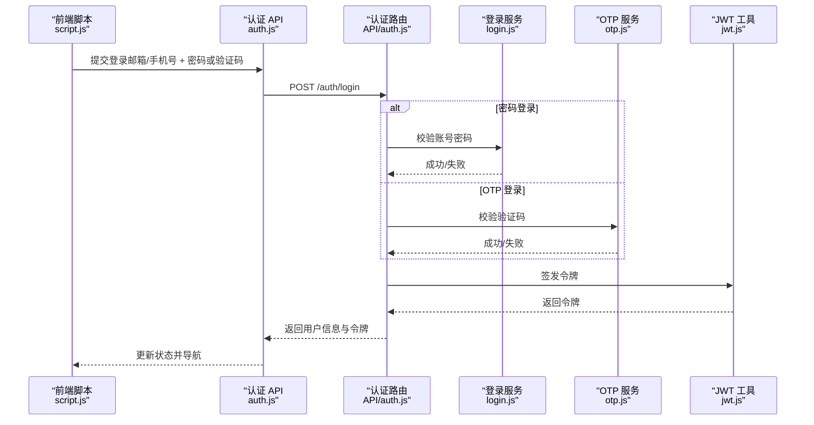
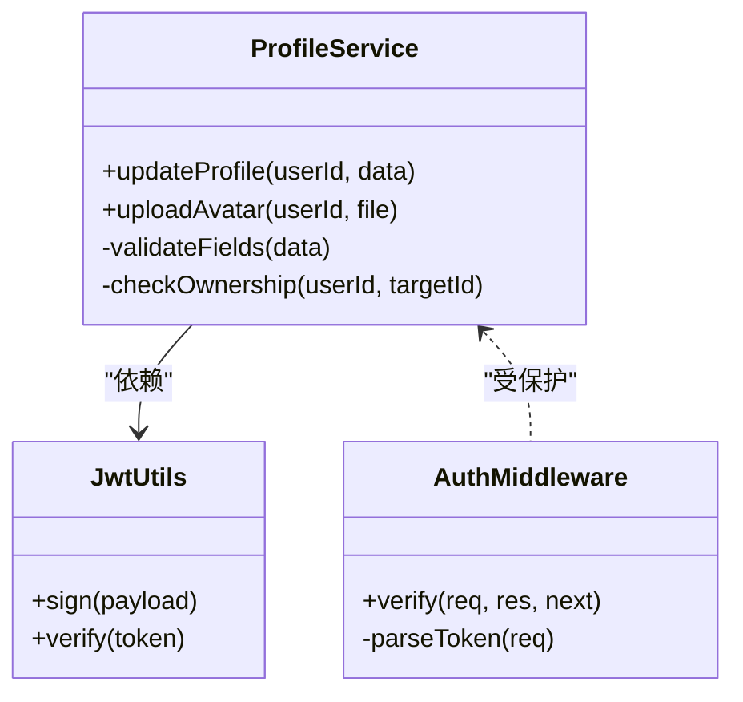
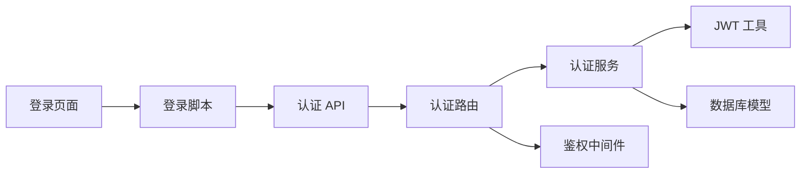

# 用户登录注册

<cite>
**本文引用的文件**   
- [node-jinmao/API/auth.js](file://node-jinmao/API/auth.js)
- [node-jinmao/service/auth/index.js](file://node-jinmao/service/auth/index.js)
- [node-jinmao/service/auth/login.js](file://node-jinmao/service/auth/login.js)
- [node-jinmao/service/auth/otp.js](file://node-jinmao/service/auth/otp.js)
- [node-jinmao/service/auth/profile.js](file://node-jinmao/service/auth/profile.js)
- [node-jinmao/middleware/auth.js](file://node-jinmao/middleware/auth.js)
- [node-jinmao/utils/jwt.js](file://node-jinmao/utils/jwt.js)
- [node-jinmao/prisma/schema.prisma](file://node-jinmao/prisma/schema.prisma)
- [WEB/src/api/auth.js](file://WEB/src/api/auth.js)
- [WEB/src/pages/login/index.vue](file://WEB/src/pages/login/index.vue)
- [WEB/src/pages/login/script.js](file://WEB/src/pages/login/script.js)
- [WEB/src/stores/auth.js](file://WEB/src/stores/auth.js)
</cite>

## 目录
1. [简介](#简介)
2. [项目结构](#项目结构)
3. [核心组件](#核心组件)
4. [架构总览](#架构总览)
5. [详细组件分析](#详细组件分析)
6. [依赖关系分析](#依赖关系分析)
7. [性能考虑](#性能考虑)
8. [故障排查指南](#故障排查指南)
9. [结论](#结论)
10. [附录：API 参考与调用示例](#附录api-参考与调用示例)

## 简介
本文件围绕“用户登录注册”功能，提供从前端到后端的完整说明。内容涵盖：
- 用户注册流程：表单校验、密码强度检查、重复用户名检测
- 登录验证机制：支持邮箱、手机号等多种登录方式
- 用户信息管理接口：个人资料修改、头像上传等
- 错误处理、用户体验优化、安全防护措施
- 前后端实现要点与 API 调用方法

## 项目结构
本项目采用前后端分离架构：
- 前端（WEB）：Vue + Vite，包含登录页面、认证状态管理、API 封装
- 后端（node-jinmao）：Express/Node.js，包含认证路由、服务层、中间件、JWT 工具、数据库模型

**图表来源** 
- [WEB/src/pages/login/index.vue](file://WEB/src/pages/login/index.vue)
- [WEB/src/pages/login/script.js](file://WEB/src/pages/login/script.js)
- [WEB/src/api/auth.js](file://WEB/src/api/auth.js)
- [node-jinmao/API/auth.js](file://node-jinmao/API/auth.js)
- [node-jinmao/service/auth/index.js](file://node-jinmao/service/auth/index.js)
- [node-jinmao/utils/jwt.js](file://node-jinmao/utils/jwt.js)
- [node-jinmao/middleware/auth.js](file://node-jinmao/middleware/auth.js)
- [node-jinmao/prisma/schema.prisma](file://node-jinmao/prisma/schema.prisma)

**章节来源**
- [node-jinmao/API/auth.js](file://node-jinmao/API/auth.js)
- [node-jinmao/service/auth/index.js](file://node-jinmao/service/auth/index.js)
- [WEB/src/api/auth.js](file://WEB/src/api/auth.js)
- [WEB/src/pages/login/index.vue](file://WEB/src/pages/login/index.vue)
- [WEB/src/pages/login/script.js](file://WEB/src/pages/login/script.js)
- [WEB/src/stores/auth.js](file://WEB/src/stores/auth.js)

## 核心组件
- 认证路由层：统一暴露注册、登录、登出、验证码、个人信息等接口
- 认证服务层：封装业务逻辑（注册校验、登录策略、OTP 短信/邮件、资料更新）
- JWT 工具：签发与校验令牌，维护会话安全
- 鉴权中间件：保护受保护资源，解析并校验请求中的令牌
- 前端认证 API：封装 HTTP 请求、错误处理、Token 注入
- 登录页面与脚本：表单渲染、实时校验、提交与跳转
- 认证状态管理：集中管理登录态、用户信息、过期刷新

**章节来源**
- [node-jinmao/API/auth.js](file://node-jinmao/API/auth.js)
- [node-jinmao/service/auth/index.js](file://node-jinmao/service/auth/index.js)
- [node-jinmao/service/auth/login.js](file://node-jinmao/service/auth/login.js)
- [node-jinmao/service/auth/otp.js](file://node-jinmao/service/auth/otp.js)
- [node-jinmao/service/auth/profile.js](file://node-jinmao/service/auth/profile.js)
- [node-jinmao/utils/jwt.js](file://node-jinmao/utils/jwt.js)
- [node-jinmao/middleware/auth.js](file://node-jinmao/middleware/auth.js)
- [WEB/src/api/auth.js](file://WEB/src/api/auth.js)
- [WEB/src/pages/login/index.vue](file://WEB/src/pages/login/index.vue)
- [WEB/src/pages/login/script.js](file://WEB/src/pages/login/script.js)
- [WEB/src/stores/auth.js](file://WEB/src/stores/auth.js)

## 架构总览
下图展示一次“邮箱+密码”登录的端到端流程，包括前端校验、后端鉴权、JWT 签发与返回。

**图表来源** 
- [WEB/src/pages/login/index.vue](file://WEB/src/pages/login/index.vue)
- [WEB/src/pages/login/script.js](file://WEB/src/pages/login/script.js)
- [WEB/src/api/auth.js](file://WEB/src/api/auth.js)
- [node-jinmao/API/auth.js](file://node-jinmao/API/auth.js)
- [node-jinmao/service/auth/login.js](file://node-jinmao/service/auth/login.js)
- [node-jinmao/utils/jwt.js](file://node-jinmao/utils/jwt.js)
- [node-jinmao/prisma/schema.prisma](file://node-jinmao/prisma/schema.prisma)

## 详细组件分析

### 注册流程（表单校验、密码强度、重复用户名检测）
- 前端表单校验
  - 必填项检查（用户名、邮箱/手机号、密码、确认密码）
  - 格式校验（邮箱、手机号正则）
  - 密码强度规则（长度、大小写、数字、特殊字符组合）
  - 确认密码一致性校验
- 后端注册逻辑
  - 参数校验与去重（用户名、邮箱、手机号唯一性）
  - 密码哈希存储（禁止明文）
  - 创建用户记录并返回基础信息
- 用户体验与安全
  - 前端即时反馈与禁用提交按钮防重复提交
  - 后端限流与异常捕获，避免暴力注册

**图表来源** 
- [WEB/src/pages/login/script.js](file://WEB/src/pages/login/script.js)
- [node-jinmao/service/auth/index.js](file://node-jinmao/service/auth/index.js)

**章节来源**
- [WEB/src/pages/login/script.js](file://WEB/src/pages/login/script.js)
- [node-jinmao/service/auth/index.js](file://node-jinmao/service/auth/index.js)

### 登录验证机制（邮箱、手机号等多方式）
- 多方式登录
  - 支持邮箱或手机号作为身份标识
  - 支持密码登录与 OTP（一次性验证码）登录
- 登录流程
  - 前端根据输入类型选择登录策略
  - 后端校验凭据或验证码有效性
  - 成功后签发 JWT，前端持久化并设置后续请求头
- 安全策略
  - 失败次数限制与冷却时间
  - 敏感字段脱敏返回
  - Token 短期有效与刷新机制

**图表来源** 
- [WEB/src/pages/login/script.js](file://WEB/src/pages/login/script.js)
- [WEB/src/api/auth.js](file://WEB/src/api/auth.js)
- [node-jinmao/API/auth.js](file://node-jinmao/API/auth.js)
- [node-jinmao/service/auth/login.js](file://node-jinmao/service/auth/login.js)
- [node-jinmao/service/auth/otp.js](file://node-jinmao/service/auth/otp.js)
- [node-jinmao/utils/jwt.js](file://node-jinmao/utils/jwt.js)

**章节来源**
- [node-jinmao/service/auth/login.js](file://node-jinmao/service/auth/login.js)
- [node-jinmao/service/auth/otp.js](file://node-jinmao/service/auth/otp.js)
- [node-jinmao/utils/jwt.js](file://node-jinmao/utils/jwt.js)
- [WEB/src/pages/login/script.js](file://WEB/src/pages/login/script.js)
- [WEB/src/api/auth.js](file://WEB/src/api/auth.js)

### 用户信息管理接口（个人资料修改、头像上传）
- 个人资料修改
  - 支持昵称、性别、生日、个人简介等字段更新
  - 字段白名单校验与长度限制
  - 仅当前登录用户可修改自身资料
- 头像上传
  - 支持图片格式与大小限制
  - 服务端存储至对象存储（如 MinIO），返回 URL
  - 前端预览与裁剪（可选）
- 权限控制
  - 使用鉴权中间件校验登录态
  - 防止越权访问他人资料

**图表来源** 
- [node-jinmao/service/auth/profile.js](file://node-jinmao/service/auth/profile.js)
- [node-jinmao/middleware/auth.js](file://node-jinmao/middleware/auth.js)
- [node-jinmao/utils/jwt.js](file://node-jinmao/utils/jwt.js)

**章节来源**
- [node-jinmao/service/auth/profile.js](file://node-jinmao/service/auth/profile.js)
- [node-jinmao/middleware/auth.js](file://node-jinmao/middleware/auth.js)

### 错误处理与用户体验优化
- 前端
  - 统一错误拦截与友好提示
  - 表单实时校验与禁用提交防抖
  - 网络异常重试与超时处理
- 后端
  - 标准化错误码与消息
  - 输入校验失败快速返回
  - 日志记录与监控告警

**章节来源**
- [WEB/src/api/auth.js](file://WEB/src/api/auth.js)
- [WEB/src/pages/login/script.js](file://WEB/src/pages/login/script.js)
- [node-jinmao/API/auth.js](file://node-jinmao/API/auth.js)

### 安全防护措施
- 传输安全：全站 HTTPS，敏感字段加密传输
- 密码安全：服务端哈希存储，禁止明文
- 令牌安全：JWT 短期有效，签名校验，黑名单/撤销机制（可选）
- 访问控制：鉴权中间件保护受保护接口
- 防刷限流：登录/注册/验证码接口限流
- 输入校验：严格白名单与长度限制，防注入与 XSS

**章节来源**
- [node-jinmao/middleware/auth.js](file://node-jinmao/middleware/auth.js)
- [node-jinmao/utils/jwt.js](file://node-jinmao/utils/jwt.js)
- [node-jinmao/service/auth/login.js](file://node-jinmao/service/auth/login.js)
- [node-jinmao/service/auth/otp.js](file://node-jinmao/service/auth/otp.js)

## 依赖关系分析
- 前端依赖
  - 登录页面依赖登录脚本进行交互与校验
  - 登录脚本依赖认证 API 封装进行网络请求
  - 认证状态管理负责全局登录态与用户信息
- 后端依赖
  - 认证路由依赖认证服务与鉴权中间件
  - 认证服务依赖 JWT 工具与数据库模型
  - 登录与 OTP 服务分别处理不同登录策略

**图表来源** 
- [WEB/src/pages/login/index.vue](file://WEB/src/pages/login/index.vue)
- [WEB/src/pages/login/script.js](file://WEB/src/pages/login/script.js)
- [WEB/src/api/auth.js](file://WEB/src/api/auth.js)
- [node-jinmao/API/auth.js](file://node-jinmao/API/auth.js)
- [node-jinmao/service/auth/index.js](file://node-jinmao/service/auth/index.js)
- [node-jinmao/utils/jwt.js](file://node-jinmao/utils/jwt.js)
- [node-jinmao/middleware/auth.js](file://node-jinmao/middleware/auth.js)
- [node-jinmao/prisma/schema.prisma](file://node-jinmao/prisma/schema.prisma)

**章节来源**
- [WEB/src/stores/auth.js](file://WEB/src/stores/auth.js)
- [node-jinmao/service/auth/index.js](file://node-jinmao/service/auth/index.js)

## 性能考虑
- 前端
  - 表单校验本地执行，减少无效请求
  - 请求合并与去抖，避免重复提交
  - 静态资源缓存与懒加载
- 后端
  - 数据库索引优化（用户名、邮箱、手机号）
  - 热点数据缓存（验证码、用户会话）
  - 异步任务与队列（短信/邮件发送）
  - 连接池与超时配置合理

[本节为通用指导，不直接分析具体文件]

## 故障排查指南
- 常见问题
  - 登录失败：检查账号是否存在、密码是否正确、验证码是否过期
  - 注册失败：检查用户名/邮箱/手机号是否重复、密码强度是否符合要求
  - 头像上传失败：检查文件格式与大小、对象存储配置与权限
  - 鉴权失败：检查 Token 是否过期、请求头是否携带 Authorization
- 定位步骤
  - 查看前端控制台错误与网络请求详情
  - 查看后端日志与错误码
  - 核对数据库记录与对象存储文件
- 修复建议
  - 完善输入校验与错误提示
  - 增加重试与降级策略
  - 补充监控与告警

**章节来源**
- [WEB/src/api/auth.js](file://WEB/src/api/auth.js)
- [node-jinmao/API/auth.js](file://node-jinmao/API/auth.js)
- [node-jinmao/middleware/auth.js](file://node-jinmao/middleware/auth.js)

## 结论
本方案实现了完整的用户登录注册与信息管理能力，覆盖前端交互、后端服务、安全与性能等方面。通过清晰的模块划分与严格的校验策略，保障了用户体验与系统安全。建议在后续迭代中持续完善限流、审计与监控能力。

[本节为总结，不直接分析具体文件]

## 附录：API 参考与调用示例
- 注册接口
  - 路径：POST /auth/register
  - 请求体：用户名、邮箱/手机号、密码、确认密码
  - 响应：用户基础信息
- 登录接口
  - 路径：POST /auth/login
  - 请求体：邮箱或手机号 + 密码；或邮箱/手机号 + 验证码
  - 响应：用户信息与访问令牌
- 登出接口
  - 路径：POST /auth/logout
  - 请求头：Authorization
  - 响应：成功
- 获取个人信息
  - 路径：GET /auth/me
  - 请求头：Authorization
  - 响应：用户详细信息
- 更新个人信息
  - 路径：PUT /auth/profile
  - 请求头：Authorization
  - 请求体：允许更新的字段（昵称、性别、生日、简介等）
  - 响应：更新后的用户信息
- 上传头像
  - 路径：POST /auth/avatar
  - 请求头：Authorization
  - 请求体：multipart/form-data，文件字段名按约定
  - 响应：头像 URL

**章节来源**
- [node-jinmao/API/auth.js](file://node-jinmao/API/auth.js)
- [node-jinmao/service/auth/index.js](file://node-jinmao/service/auth/index.js)
- [WEB/src/api/auth.js](file://WEB/src/api/auth.js)