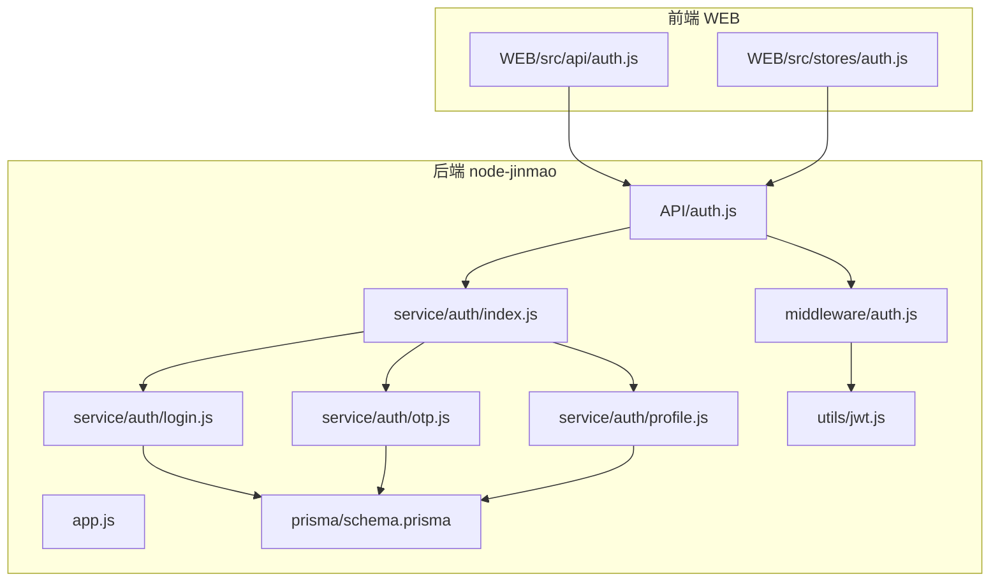
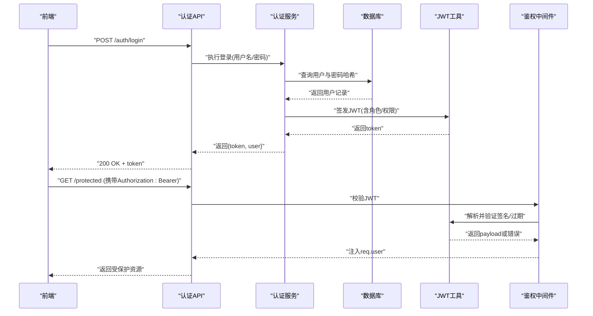
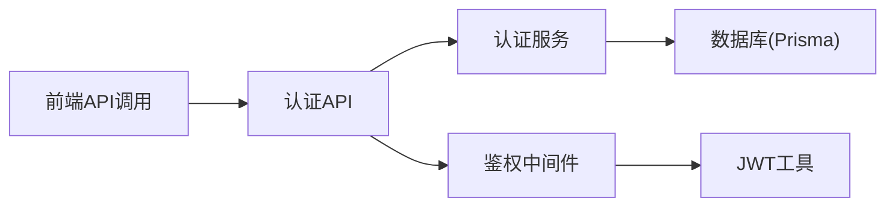
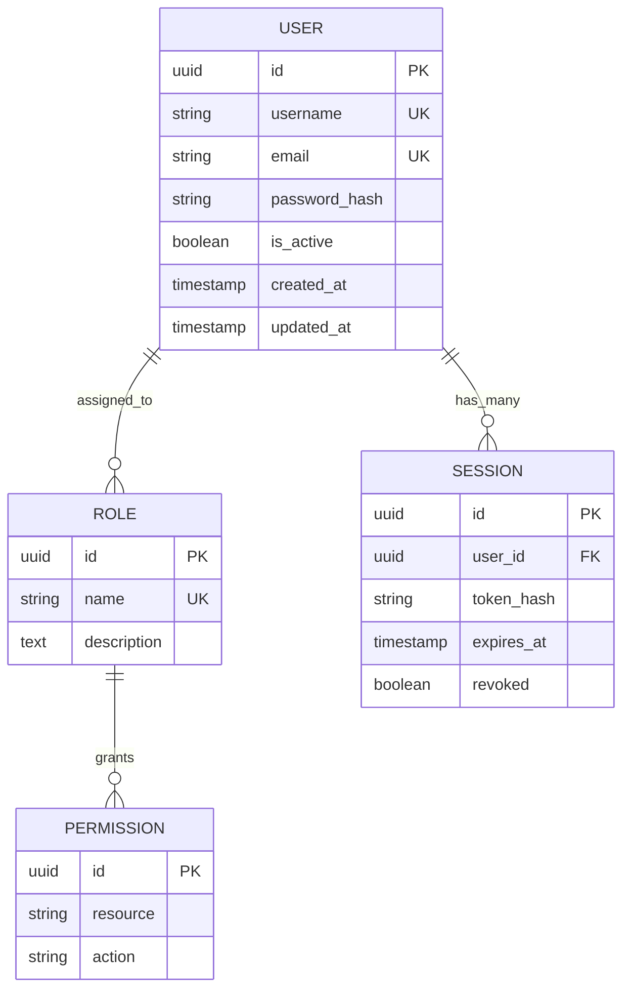
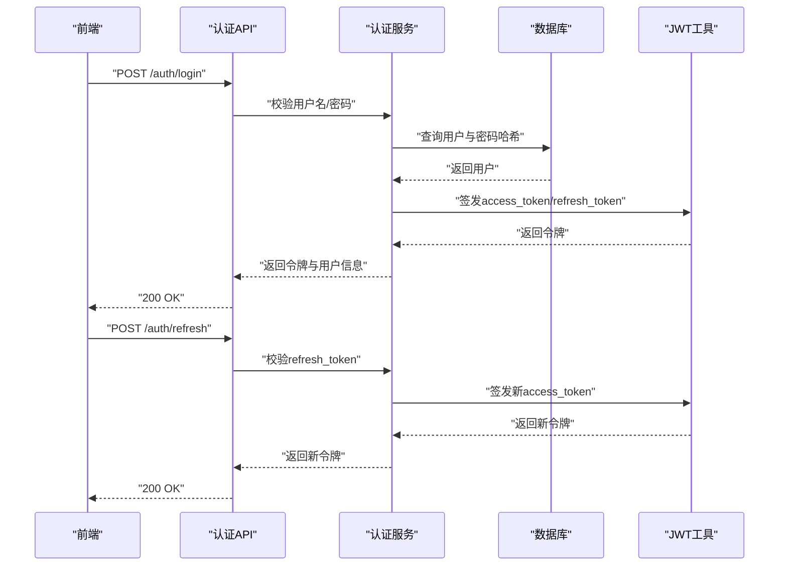
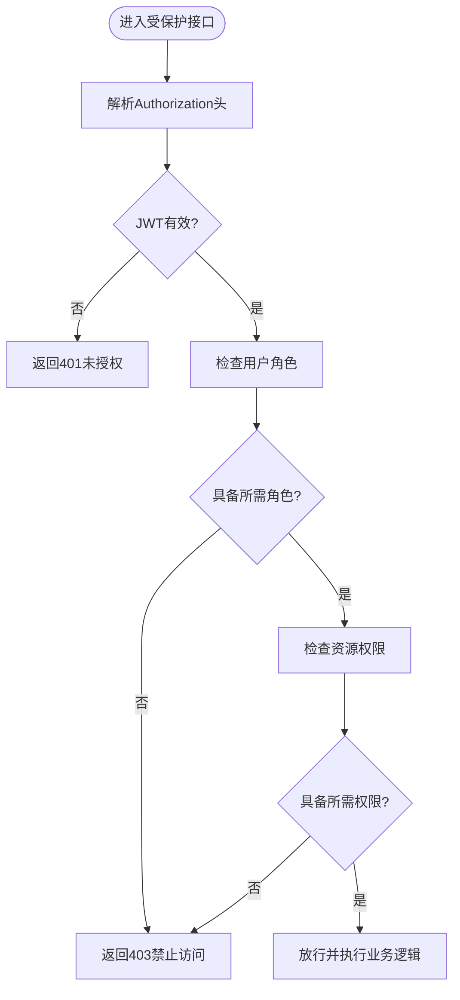

# 认证与授权

<cite>
**本文引用的文件**   
- [app.js](file://node-jinmao/app.js)
- [API/auth.js](file://node-jinmao/API/auth.js)
- [service/auth/index.js](file://node-jinmao/service/auth/index.js)
- [service/auth/login.js](file://node-jinmao/service/auth/login.js)
- [service/auth/otp.js](file://node-jinmao/service/auth/otp.js)
- [service/auth/profile.js](file://node-jinmao/service/auth/profile.js)
- [middleware/auth.js](file://node-jinmao/middleware/auth.js)
- [utils/jwt.js](file://node-jinmao/utils/jwt.js)
- [prisma/schema.prisma](file://node-jinmao/prisma/schema.prisma)
- [WEB/src/api/auth.js](file://WEB/src/api/auth.js)
- [WEB/src/stores/auth.js](file://WEB/src/stores/auth.js)
</cite>

## 目录
1. [简介](#简介)
2. [项目结构](#项目结构)
3. [核心组件](#核心组件)
4. [架构总览](#架构总览)
5. [详细组件分析](#详细组件分析)
6. [依赖关系分析](#依赖关系分析)
7. [性能考虑](#性能考虑)
8. [故障排查指南](#故障排查指南)
9. [结论](#结论)
10. [附录](#附录)

## 简介
本文件面向“认证与授权”子系统，系统性梳理并说明以下能力：
- JWT 令牌生成、验证与刷新机制
- 用户登录/注册流程
- OTP 验证码系统（短信/邮箱）
- 权限控制模型、角色与资源访问控制
- 密码加密存储与会话管理
- 多因素认证支持与第三方登录集成建议
- 安全最佳实践与常见漏洞防护

本仓库包含 Node.js 后端（Express）与 Vue 前端两部分。认证相关代码主要位于 node-jinmao 目录的 API、service、middleware、utils 以及 Prisma 数据模型中；前端在 WEB 目录提供认证 API 调用与状态管理。

## 项目结构
认证与授权相关的核心位置如下：
- API 层：统一暴露认证接口
- Service 层：封装业务逻辑（登录、OTP、资料等）
- Middleware：鉴权中间件（校验 JWT、注入用户上下文）
- Utils：JWT 工具（签发、解析、刷新策略）
- Prisma Schema：用户、会话、角色、权限等数据模型
- 前端：认证 API 客户端与状态管理

图表来源
- [app.js](file://node-jinmao/app.js)
- [API/auth.js](file://node-jinmao/API/auth.js)
- [middleware/auth.js](file://node-jinmao/middleware/auth.js)
- [service/auth/index.js](file://node-jinmao/service/auth/index.js)
- [service/auth/login.js](file://node-jinmao/service/auth/login.js)
- [service/auth/otp.js](file://node-jinmao/service/auth/otp.js)
- [service/auth/profile.js](file://node-jinmao/service/auth/profile.js)
- [utils/jwt.js](file://node-jinmao/utils/jwt.js)
- [prisma/schema.prisma](file://node-jinmao/prisma/schema.prisma)

章节来源
- [app.js](file://node-jinmao/app.js)
- [API/auth.js](file://node-jinmao/API/auth.js)
- [middleware/auth.js](file://node-jinmao/middleware/auth.js)
- [service/auth/index.js](file://node-jinmao/service/auth/index.js)
- [service/auth/login.js](file://node-jinmao/service/auth/login.js)
- [service/auth/otp.js](file://node-jinmao/service/auth/otp.js)
- [service/auth/profile.js](file://node-jinmao/service/auth/profile.js)
- [utils/jwt.js](file://node-jinmao/utils/jwt.js)
- [prisma/schema.prisma](file://node-jinmao/prisma/schema.prisma)
- [WEB/src/api/auth.js](file://WEB/src/api/auth.js)
- [WEB/src/stores/auth.js](file://WEB/src/stores/auth.js)

## 核心组件
- 认证 API：对外暴露登录、注册、发送验证码、校验验证码、获取/更新个人资料、刷新令牌等端点
- 认证服务：实现具体业务逻辑（账号密码校验、OTP 生成与校验、资料读写）
- 鉴权中间件：解析请求中的令牌，校验有效性，并将用户信息注入请求上下文
- JWT 工具：负责令牌的签发、解析、刷新策略与过期处理
- 数据模型：用户、角色、权限、会话等实体定义与关联

章节来源
- [API/auth.js](file://node-jinmao/API/auth.js)
- [service/auth/index.js](file://node-jinmao/service/auth/index.js)
- [service/auth/login.js](file://node-jinmao/service/auth/login.js)
- [service/auth/otp.js](file://node-jinmao/service/auth/otp.js)
- [service/auth/profile.js](file://node-jinmao/service/auth/profile.js)
- [middleware/auth.js](file://node-jinmao/middleware/auth.js)
- [utils/jwt.js](file://node-jinmao/utils/jwt.js)
- [prisma/schema.prisma](file://node-jinmao/prisma/schema.prisma)

## 架构总览
整体采用分层架构：前端通过 HTTP 调用后端 API，API 层路由到对应服务，服务操作数据库与外部服务（如短信/邮件），鉴权中间件对受保护接口进行统一校验。

图表来源
- [API/auth.js](file://node-jinmao/API/auth.js)
- [service/auth/login.js](file://node-jinmao/service/auth/login.js)
- [middleware/auth.js](file://node-jinmao/middleware/auth.js)
- [utils/jwt.js](file://node-jinmao/utils/jwt.js)
- [prisma/schema.prisma](file://node-jinmao/prisma/schema.prisma)

## 详细组件分析

### 认证 API（登录/注册/OTP/资料/刷新）
- 职责：接收请求参数、调用服务层、返回标准化响应
- 典型端点：
  - 登录：校验用户名/密码，成功返回 JWT
  - 注册：创建用户，密码需加密存储
  - 发送验证码：生成 OTP，写入缓存/数据库，发送渠道（短信/邮箱）
  - 校验验证码：比对 OTP，成功后允许绑定手机/邮箱或二次验证
  - 获取/更新资料：读取/修改用户资料
  - 刷新令牌：基于旧令牌签发新令牌

章节来源
- [API/auth.js](file://node-jinmao/API/auth.js)
- [service/auth/index.js](file://node-jinmao/service/auth/index.js)
- [service/auth/login.js](file://node-jinmao/service/auth/login.js)
- [service/auth/otp.js](file://node-jinmao/service/auth/otp.js)
- [service/auth/profile.js](file://node-jinmao/service/auth/profile.js)

### 鉴权中间件（JWT 校验与上下文注入）
- 职责：从请求头提取 Authorization，解析并验证 JWT，将用户信息挂载到 req.user
- 关键点：
  - 支持 Bearer Token 模式
  - 校验签名、过期时间、黑名单（可选）
  - 失败时返回 401/403 并终止后续处理

章节来源
- [middleware/auth.js](file://node-jinmao/middleware/auth.js)
- [utils/jwt.js](file://node-jinmao/utils/jwt.js)

### JWT 工具（签发、解析、刷新）
- 职责：生成 access_token、refresh_token，校验与续期
- 要点：
  - 使用强密钥与算法（如 RS256/HS256）
  - 合理设置过期时间（短生命周期 access_token）
  - refresh_token 可持久化并支持撤销
  - 支持按需扩展 payload（角色、权限、设备指纹等）

章节来源
- [utils/jwt.js](file://node-jinmao/utils/jwt.js)

### 登录服务（密码校验与安全）
- 职责：根据用户名查找用户，校验密码哈希，必要时触发 MFA
- 安全要点：
  - 密码哈希使用 bcrypt/scrypt/argon2
  - 防暴力破解：限流、锁定策略
  - 审计日志：登录成功/失败记录

章节来源
- [service/auth/login.js](file://node-jinmao/service/auth/login.js)
- [prisma/schema.prisma](file://node-jinmao/prisma/schema.prisma)

### OTP 验证码服务（生成、校验、渠道）
- 职责：生成一次性验证码，存储于缓存/数据库，支持短信/邮箱发送与校验
- 要点：
  - 验证码长度、有效期、重试次数限制
  - 防重放攻击：唯一性校验、时间窗口校验
  - 渠道配置与失败重试

章节来源
- [service/auth/otp.js](file://node-jinmao/service/auth/otp.js)

### 用户资料服务（CRUD）
- 职责：读取/更新用户基本信息、头像、联系方式等
- 要点：
  - 字段白名单校验
  - 敏感字段脱敏输出

章节来源
- [service/auth/profile.js](file://node-jinmao/service/auth/profile.js)

### 前端认证模块（API 调用与状态管理）
- 职责：封装认证 API 调用，维护登录态、Token 存储与自动刷新
- 要点：
  - 拦截器统一附加 Authorization
  - 401 时尝试 refresh_token 并重试请求
  - 本地存储安全策略（HttpOnly Cookie 优先）

章节来源
- [WEB/src/api/auth.js](file://WEB/src/api/auth.js)
- [WEB/src/stores/auth.js](file://WEB/src/stores/auth.js)

## 依赖关系分析
- API 层依赖 service 层完成业务编排
- middleware 依赖 utils/jwt 完成令牌校验
- service 层依赖 prisma schema 对应的数据模型
- 前端依赖后端 API 与本地存储

图表来源
- [API/auth.js](file://node-jinmao/API/auth.js)
- [service/auth/index.js](file://node-jinmao/service/auth/index.js)
- [middleware/auth.js](file://node-jinmao/middleware/auth.js)
- [utils/jwt.js](file://node-jinmao/utils/jwt.js)
- [prisma/schema.prisma](file://node-jinmao/prisma/schema.prisma)

章节来源
- [API/auth.js](file://node-jinmao/API/auth.js)
- [service/auth/index.js](file://node-jinmao/service/auth/index.js)
- [middleware/auth.js](file://node-jinmao/middleware/auth.js)
- [utils/jwt.js](file://node-jinmao/utils/jwt.js)
- [prisma/schema.prisma](file://node-jinmao/prisma/schema.prisma)

## 性能考虑
- JWT 无状态校验，避免每次请求查库，提升吞吐
- OTP 使用内存缓存（如 Redis）降低数据库压力
- 登录失败限流与指数退避，减少恶意请求
- 批量操作与懒加载敏感字段，减少响应体积
- 前端 Token 刷新失败快速失败，避免雪崩

[本节为通用指导，不直接分析具体文件]

## 故障排查指南
- 401 未授权：检查 Authorization 头格式、Token 是否过期、服务端密钥是否一致
- 403 禁止访问：检查用户角色/权限是否满足资源要求
- OTP 校验失败：确认验证码未过期、未被使用过、输入正确
- 登录失败：核对用户名是否存在、密码哈希是否正确、是否被锁定
- 刷新令牌失败：检查 refresh_token 是否有效、是否已被撤销

章节来源
- [middleware/auth.js](file://node-jinmao/middleware/auth.js)
- [utils/jwt.js](file://node-jinmao/utils/jwt.js)
- [service/auth/otp.js](file://node-jinmao/service/auth/otp.js)
- [service/auth/login.js](file://node-jinmao/service/auth/login.js)

## 结论
本认证与授权子系统以 JWT 为核心，结合 OTP 与中间件鉴权，形成完整的身份认证与访问控制闭环。通过分层设计与工具化封装，既保证了安全性，也兼顾了可扩展性与性能。建议在后续迭代中完善 RBAC/ABAC 模型、第三方登录集成与更细粒度的资源级权限控制。

[本节为总结，不直接分析具体文件]

## 附录

### 数据模型概览（用户/角色/权限/会话）

图表来源
- [prisma/schema.prisma](file://node-jinmao/prisma/schema.prisma)

### 登录与令牌刷新序列图

图表来源
- [API/auth.js](file://node-jinmao/API/auth.js)
- [service/auth/login.js](file://node-jinmao/service/auth/login.js)
- [utils/jwt.js](file://node-jinmao/utils/jwt.js)

### 权限控制流程图（RBAC 示例）

图表来源
- [middleware/auth.js](file://node-jinmao/middleware/auth.js)
- [prisma/schema.prisma](file://node-jinmao/prisma/schema.prisma)

### 安全最佳实践清单
- 密码存储：使用 bcrypt/scrypt/argon2，禁止明文
- 令牌安全：短过期 access_token，secure HttpOnly Cookie，CSRF 防护
- 验证码：限频、时效、唯一性、防重放
- 访问控制：最小权限原则，资源级校验
- 审计与监控：登录、权限变更、异常告警
- 传输安全：强制 HTTPS，HSTS，CSP 策略

[本节为通用指导，不直接分析具体文件]