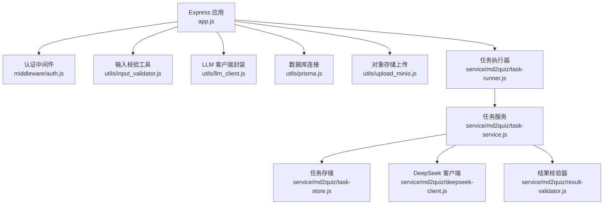
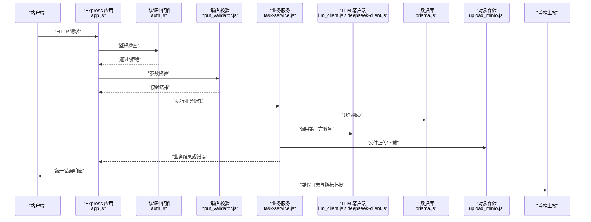
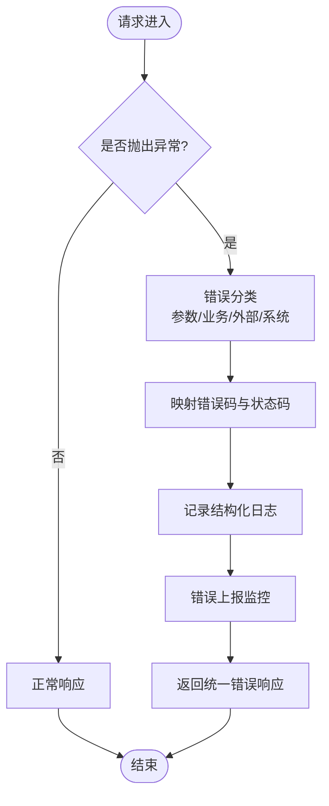
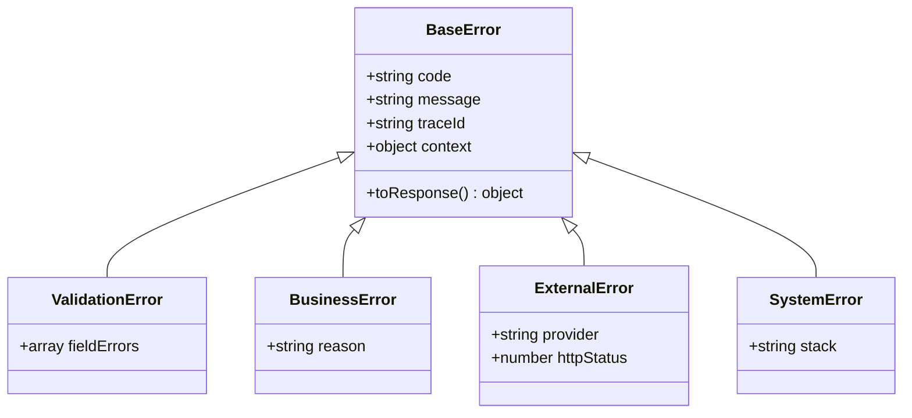
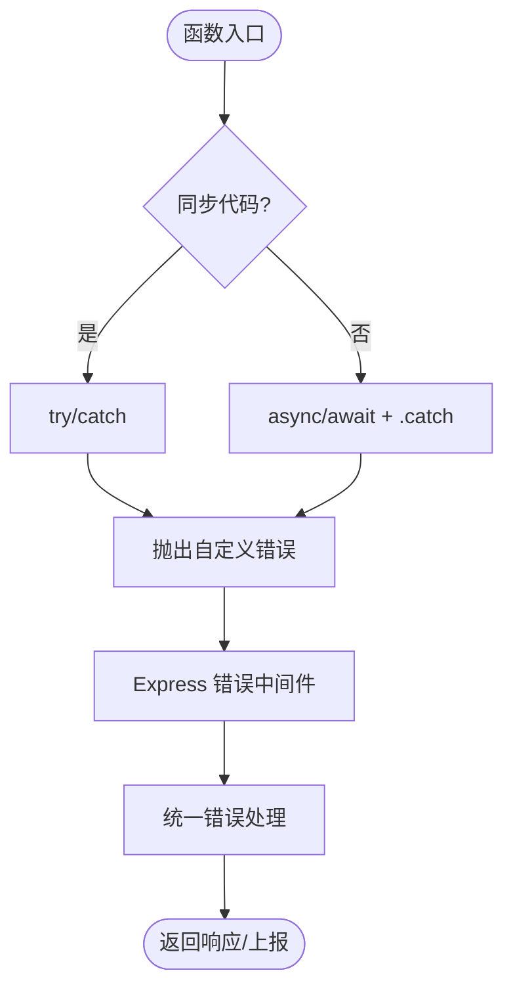
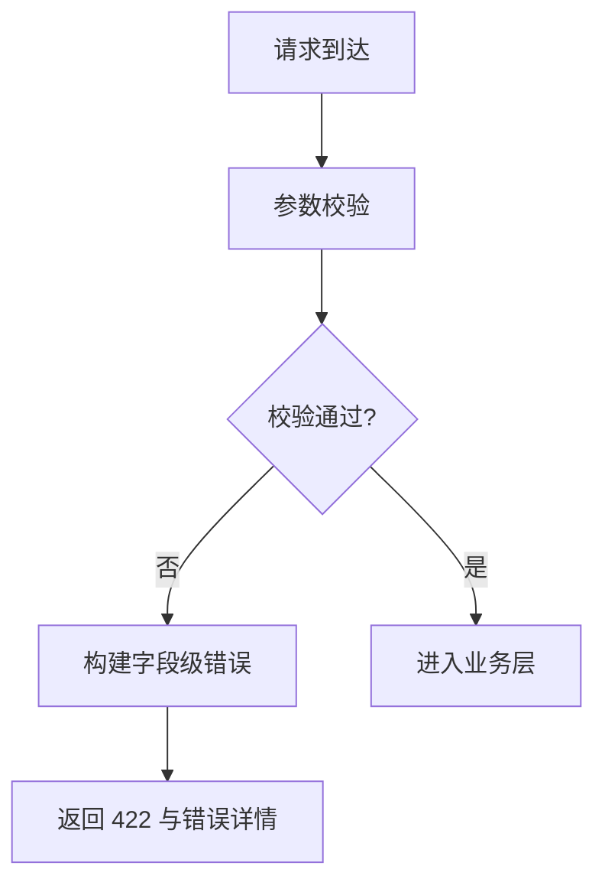
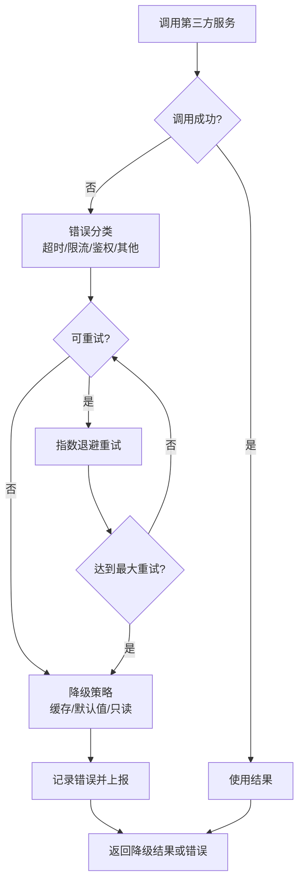
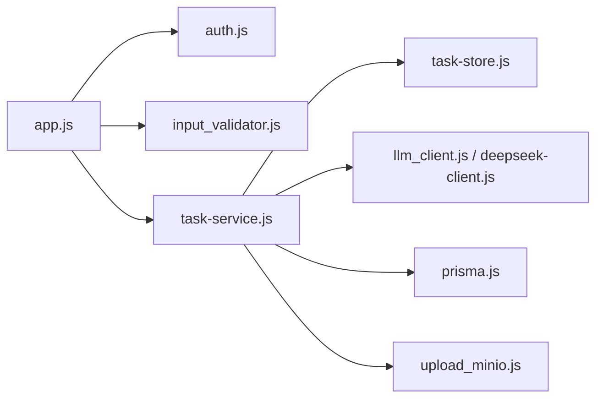

# 错误处理机制

<cite>
**本文引用的文件**   
- [app.js](file://node-jinmao/app.js)
- [auth.js](file://node-jinmao/middleware/auth.js)
- [input_validator.js](file://node-jinmao/utils/input_validator.js)
- [llm_client.js](file://node-jinmao/utils/llm_client.js)
- [prisma.js](file://node-jinmao/utils/prisma.js)
- [upload_minio.js](file://node-jinmao/utils/upload_minio.js)
- [task-runner.js](file://node-jinmao/service/md2quiz/task-runner.js)
- [task-service.js](file://node-jinmao/service/md2quiz/task-service.js)
- [task-store.js](file://node-jinmao/service/md2quiz/task-store.js)
- [deepseek-client.js](file://node-jinmao/service/md2quiz/deepseek-client.js)
- [result-validator.js](file://node-jinmao/service/md2quiz/result-validator.js)
- [auth.controller.ts](file://test/金毛刷题/backend/src/modules/auth/auth.controller.ts)
- [auth.service.ts](file://test/金毛刷题/backend/src/modules/auth/auth.service.ts)
- [http.ts](file://test/金毛刷题/frontend/src/lib/http.ts)
- [storage.ts](file://test/金毛刷题/frontend/src/lib/storage.ts)
</cite>

## 目录
1. [引言](#引言)
2. [项目结构](#项目结构)
3. [核心组件](#核心组件)
4. [架构总览](#架构总览)
5. [详细组件分析](#详细组件分析)
6. [依赖关系分析](#依赖关系分析)
7. [性能考量](#性能考量)
8. [故障排查指南](#故障排查指南)
9. [结论](#结论)
10. [附录](#附录)

## 引言
本文件面向“错误处理机制”的完整设计与实现，覆盖全局错误处理器、自定义错误类型、错误码标准化、异常捕获策略、错误日志记录、错误上报、请求验证错误、业务逻辑错误、第三方服务调用错误、统一响应格式、堆栈追踪、监控告警、恢复与降级以及故障诊断方法。文档基于仓库中的 Node.js 后端（Express）与 TypeScript 后端（测试目录）以及前端代码进行归纳与提炼，帮助读者快速理解并落地统一的错误治理方案。

## 项目结构
- 后端 Node.js（Express）：入口为 app.js，中间件 auth.js，工具层 input_validator.js、llm_client.js、prisma.js、upload_minio.js；md2quiz 任务管线包含 task-runner.js、task-service.js、task-store.js、deepseek-client.js、result-validator.js 等。
- 后端 TypeScript（测试目录）：模块 auth.controller.ts、auth.service.ts 体现控制器与服务层的错误处理模式。
- 前端：lib/http.ts、lib/storage.ts 体现客户端错误处理与本地存储容错。

**图示来源** 
- [app.js](file://node-jinmao/app.js)
- [auth.js](file://node-jinmao/middleware/auth.js)
- [input_validator.js](file://node-jinmao/utils/input_validator.js)
- [llm_client.js](file://node-jinmao/utils/llm_client.js)
- [prisma.js](file://node-jinmao/utils/prisma.js)
- [upload_minio.js](file://node-jinmao/utils/upload_minio.js)
- [task-runner.js](file://node-jinmao/service/md2quiz/task-runner.js)
- [task-service.js](file://node-jinmao/service/md2quiz/task-service.js)
- [task-store.js](file://node-jinmao/service/md2quiz/task-store.js)
- [deepseek-client.js](file://node-jinmao/service/md2quiz/deepseek-client.js)
- [result-validator.js](file://node-jinmao/service/md2quiz/result-validator.js)

**章节来源**
- [app.js](file://node-jinmao/app.js)
- [auth.js](file://node-jinmao/middleware/auth.js)
- [input_validator.js](file://node-jinmao/utils/input_validator.js)
- [llm_client.js](file://node-jinmao/utils/llm_client.js)
- [prisma.js](file://node-jinmao/utils/prisma.js)
- [upload_minio.js](file://node-jinmao/utils/upload_minio.js)
- [task-runner.js](file://node-jinmao/service/md2quiz/task-runner.js)
- [task-service.js](file://node-jinmao/service/md2quiz/task-service.js)
- [task-store.js](file://node-jinmao/service/md2quiz/task-store.js)
- [deepseek-client.js](file://node-jinmao/service/md2quiz/deepseek-client.js)
- [result-validator.js](file://node-jinmao/service/md2quiz/result-validator.js)

## 核心组件
- 全局错误处理器：在 Express 应用中集中捕获未处理异常与路由错误，输出统一错误响应，记录结构化日志，触发错误上报。
- 自定义错误类型：定义业务错误、参数错误、第三方服务错误、系统错误等类型，携带错误码与可读消息。
- 错误码标准化：按领域划分错误码前缀，保证前后端一致解析。
- 异常捕获策略：同步 try/catch、异步 Promise.catch、Express 错误中间件、未捕获异常监听。
- 错误日志记录：结构化字段（traceId、userId、endpoint、error、stack、context）。
- 错误上报机制：聚合指标、关键错误事件上报至监控系统或日志平台。
- 请求验证错误处理：输入校验失败返回明确错误码与字段级提示。
- 业务逻辑错误处理：状态机与规则校验失败返回业务错误码。
- 第三方服务调用错误处理：网络超时、限流、鉴权失败、数据不一致等场景分类处理与重试/降级。

**章节来源**
- [app.js](file://node-jinmao/app.js)
- [auth.js](file://node-jinmao/middleware/auth.js)
- [input_validator.js](file://node-jinmao/utils/input_validator.js)
- [llm_client.js](file://node-jinmao/utils/llm_client.js)
- [prisma.js](file://node-jinmao/utils/prisma.js)
- [upload_minio.js](file://node-jinmao/utils/upload_minio.js)
- [task-runner.js](file://node-jinmao/service/md2quiz/task-runner.js)
- [task-service.js](file://node-jinmao/service/md2quiz/task-service.js)
- [task-store.js](file://node-jinmao/service/md2quiz/task-store.js)
- [deepseek-client.js](file://node-jinmao/service/md2quiz/deepseek-client.js)
- [result-validator.js](file://node-jinmao/service/md2quiz/result-validator.js)

## 架构总览
下图展示从请求进入、校验、业务处理、外部调用到错误处理的端到端流程，强调统一错误响应与上报。

**图示来源** 
- [app.js](file://node-jinmao/app.js)
- [auth.js](file://node-jinmao/middleware/auth.js)
- [input_validator.js](file://node-jinmao/utils/input_validator.js)
- [task-service.js](file://node-jinmao/service/md2quiz/task-service.js)
- [llm_client.js](file://node-jinmao/utils/llm_client.js)
- [deepseek-client.js](file://node-jinmao/service/md2quiz/deepseek-client.js)
- [prisma.js](file://node-jinmao/utils/prisma.js)
- [upload_minio.js](file://node-jinmao/utils/upload_minio.js)

## 详细组件分析

### 全局错误处理器与统一响应
- 职责：集中捕获未处理异常与路由错误，生成统一错误响应体，记录结构化日志，触发错误上报。
- 关键点：
  - 区分可预期错误与未知异常，避免泄露敏感信息。
  - 统一 HTTP 状态码映射（如 400 参数错误、401 未授权、403 禁止访问、404 资源不存在、422 校验失败、500 内部错误、502/503/504 外部依赖问题）。
  - 附加 traceId、userId、endpoint、error、stack、context 等字段便于追踪。
  - 对敏感堆栈仅内部记录，对外返回脱敏消息。

**图示来源** 
- [app.js](file://node-jinmao/app.js)

**章节来源**
- [app.js](file://node-jinmao/app.js)

### 自定义错误类型与错误码标准化
- 建议的错误类型：
  - 参数错误（ValidationError）：字段级错误提示，状态码 422。
  - 业务错误（BusinessError）：业务规则不满足，状态码 400/409。
  - 第三方服务错误（ExternalError）：网络/限流/鉴权失败，状态码 502/503/504。
  - 系统错误（SystemError）：未预期异常，状态码 500。
- 错误码规范：
  - 前缀按域划分：AUTH_、VALIDATION_、BUSINESS_、EXTERNAL_、SYSTEM_。
  - 中段为子域：USER、BOOK、QUIZ、TASK、STORAGE。
  - 末段为具体原因：INVALID_INPUT、NOT_FOUND、RATE_LIMIT、TIMEOUT、INTERNAL_ERROR。
  - 示例：AUTH_USER_INVALID_INPUT、BUSINESS_TASK_NOT_FOUND、EXTERNAL_LLM_TIMEOUT。

**图示来源** 
- [input_validator.js](file://node-jinmao/utils/input_validator.js)
- [task-service.js](file://node-jinmao/service/md2quiz/task-service.js)
- [deepseek-client.js](file://node-jinmao/service/md2quiz/deepseek-client.js)
- [prisma.js](file://node-jinmao/utils/prisma.js)
- [upload_minio.js](file://node-jinmao/utils/upload_minio.js)

**章节来源**
- [input_validator.js](file://node-jinmao/utils/input_validator.js)
- [task-service.js](file://node-jinmao/service/md2quiz/task-service.js)
- [deepseek-client.js](file://node-jinmao/service/md2quiz/deepseek-client.js)
- [prisma.js](file://node-jinmao/utils/prisma.js)
- [upload_minio.js](file://node-jinmao/utils/upload_minio.js)

### 异常捕获策略
- 同步路径：try/catch 包裹关键操作，抛出自定义错误。
- 异步路径：Promise.catch 或 async/await 外层捕获，确保错误上抛至中间件。
- Express：使用错误中间件统一处理 next(err)。
- 进程级：process.on('uncaughtException') 与 process.on('unhandledRejection') 记录并安全退出或恢复。

**图示来源** 
- [task-runner.js](file://node-jinmao/service/md2quiz/task-runner.js)
- [task-service.js](file://node-jinmao/service/md2quiz/task-service.js)
- [auth.controller.ts](file://test/金毛刷题/backend/src/modules/auth/auth.controller.ts)
- [auth.service.ts](file://test/金毛刷题/backend/src/modules/auth/auth.service.ts)

**章节来源**
- [task-runner.js](file://node-jinmao/service/md2quiz/task-runner.js)
- [task-service.js](file://node-jinmao/service/md2quiz/task-service.js)
- [auth.controller.ts](file://test/金毛刷题/backend/src/modules/auth/auth.controller.ts)
- [auth.service.ts](file://test/金毛刷题/backend/src/modules/auth/auth.service.ts)

### 错误日志记录与上报
- 日志字段：traceId、userId、endpoint、method、statusCode、error.code、error.message、stack、context。
- 上报内容：关键错误事件（频率、耗时、失败率）、错误码分布、外部依赖健康度。
- 采集方式：控制台/文件日志 + 监控平台（如 Prometheus/Grafana、APM、Sentry）。

**章节来源**
- [app.js](file://node-jinmao/app.js)
- [llm_client.js](file://node-jinmao/utils/llm_client.js)
- [upload_minio.js](file://node-jinmao/utils/upload_minio.js)
- [deepseek-client.js](file://node-jinmao/service/md2quiz/deepseek-client.js)

### 请求验证错误处理
- 校验点：路径参数、查询参数、请求体、头部。
- 错误响应：字段级错误数组，包含字段名、错误码、提示信息。
- 最佳实践：尽早校验，失败即返回，避免进入业务层。

**图示来源** 
- [input_validator.js](file://node-jinmao/utils/input_validator.js)

**章节来源**
- [input_validator.js](file://node-jinmao/utils/input_validator.js)

### 业务逻辑错误处理
- 常见场景：资源不存在、权限不足、状态不合法、并发冲突。
- 处理方式：抛出 BusinessError，附带 reason 与上下文，由全局处理器映射状态码与消息。

**章节来源**
- [task-service.js](file://node-jinmao/service/md2quiz/task-service.js)
- [task-store.js](file://node-jinmao/service/md2quiz/task-store.js)
- [auth.controller.ts](file://test/金毛刷题/backend/src/modules/auth/auth.controller.ts)
- [auth.service.ts](file://test/金毛刷题/backend/src/modules/auth/auth.service.ts)

### 第三方服务调用错误处理
- 分类：网络错误、超时、限流、鉴权失败、数据不一致。
- 策略：重试（指数退避+抖动）、熔断、降级（缓存/默认值/只读模式）、快速失败。
- 上报：外部依赖错误码、耗时、成功率、熔断状态。

**图示来源** 
- [llm_client.js](file://node-jinmao/utils/llm_client.js)
- [deepseek-client.js](file://node-jinmao/service/md2quiz/deepseek-client.js)
- [upload_minio.js](file://node-jinmao/utils/upload_minio.js)
- [prisma.js](file://node-jinmao/utils/prisma.js)

**章节来源**
- [llm_client.js](file://node-jinmao/utils/llm_client.js)
- [deepseek-client.js](file://node-jinmao/service/md2quiz/deepseek-client.js)
- [upload_minio.js](file://node-jinmao/utils/upload_minio.js)
- [prisma.js](file://node-jinmao/utils/prisma.js)

### 统一错误响应格式
- 建议结构：
  - code：错误码（字符串，如 BUSINESS_TASK_NOT_FOUND）。
  - message：用户可读消息。
  - details：可选，字段级错误或上下文。
  - traceId：追踪标识。
  - timestamp：时间戳。
- 前端处理：根据 code 与 message 展示提示，details 用于表单级错误定位。

**章节来源**
- [app.js](file://node-jinmao/app.js)
- [http.ts](file://test/金毛刷题/frontend/src/lib/http.ts)

### 错误堆栈追踪
- 内部记录：保留完整堆栈，关联 traceId。
- 对外脱敏：隐藏敏感信息与内部路径。
- 链路追踪：跨服务传递 traceId，便于聚合分析。

**章节来源**
- [app.js](file://node-jinmao/app.js)
- [llm_client.js](file://node-jinmao/utils/llm_client.js)
- [deepseek-client.js](file://node-jinmao/service/md2quiz/deepseek-client.js)

### 错误监控告警
- 指标：错误率、P95/P99 延迟、外部依赖失败率、熔断开关状态。
- 告警：阈值触发（如错误率>1%、超时>5s），通知渠道（邮件、IM、短信）。
- 看板：错误码分布、Top 错误接口、外部依赖健康度。

**章节来源**
- [app.js](file://node-jinmao/app.js)
- [llm_client.js](file://node-jinmao/utils/llm_client.js)
- [upload_minio.js](file://node-jinmao/utils/upload_minio.js)

### 错误恢复策略与降级处理
- 恢复：重试（幂等接口）、补偿（事务回滚/对账）、隔离（线程池/队列）。
- 降级：缓存优先、只读模式、默认值、功能裁剪。
- 熔断：失败阈值触发熔断，半开探测恢复。

**章节来源**
- [llm_client.js](file://node-jinmao/utils/llm_client.js)
- [deepseek-client.js](file://node-jinmao/service/md2quiz/deepseek-client.js)
- [task-runner.js](file://node-jinmao/service/md2quiz/task-runner.js)

### 故障诊断方法
- 快速定位：traceId 串联日志与指标，查看错误码与堆栈。
- 根因分析：外部依赖健康度、数据库慢查询、内存/CPU 峰值。
- 复现与修复：最小化用例、单元测试、回归测试。

**章节来源**
- [app.js](file://node-jinmao/app.js)
- [prisma.js](file://node-jinmao/utils/prisma.js)
- [upload_minio.js](file://node-jinmao/utils/upload_minio.js)

## 依赖关系分析
- 耦合与内聚：
  - 输入校验与业务层解耦，错误类型集中在工具层。
  - 外部调用封装在客户端层，错误分类清晰。
  - 全局错误处理器集中处理，降低重复代码。
- 循环依赖：避免在服务与工具间相互引用，采用接口或抽象。
- 外部依赖：数据库、对象存储、LLM 服务，需健壮的错误处理与监控。

**图示来源** 
- [app.js](file://node-jinmao/app.js)
- [auth.js](file://node-jinmao/middleware/auth.js)
- [input_validator.js](file://node-jinmao/utils/input_validator.js)
- [task-service.js](file://node-jinmao/service/md2quiz/task-service.js)
- [task-store.js](file://node-jinmao/service/md2quiz/task-store.js)
- [llm_client.js](file://node-jinmao/utils/llm_client.js)
- [deepseek-client.js](file://node-jinmao/service/md2quiz/deepseek-client.js)
- [prisma.js](file://node-jinmao/utils/prisma.js)
- [upload_minio.js](file://node-jinmao/utils/upload_minio.js)

**章节来源**
- [app.js](file://node-jinmao/app.js)
- [auth.js](file://node-jinmao/middleware/auth.js)
- [input_validator.js](file://node-jinmao/utils/input_validator.js)
- [task-service.js](file://node-jinmao/service/md2quiz/task-service.js)
- [task-store.js](file://node-jinmao/service/md2quiz/task-store.js)
- [llm_client.js](file://node-jinmao/utils/llm_client.js)
- [deepseek-client.js](file://node-jinmao/service/md2quiz/deepseek-client.js)
- [prisma.js](file://node-jinmao/utils/prisma.js)
- [upload_minio.js](file://node-jinmao/utils/upload_minio.js)

## 性能考量
- 错误处理开销：避免在热路径中频繁创建大对象，尽量复用错误实例。
- 日志写入：异步落盘，限制日志级别与采样率。
- 上报频率：聚合指标，批量上报，避免阻塞主流程。
- 重试与熔断：合理设置超时与重试次数，防止雪崩。

[本节为通用指导，无需特定文件来源]

## 故障排查指南
- 常见问题：
  - 参数校验失败：检查请求结构与校验规则。
  - 第三方服务超时：查看网络状况与限流策略。
  - 数据库连接失败：检查连接池与权限。
  - 对象存储上传失败：确认凭证与桶策略。
- 排查步骤：
  - 通过 traceId 检索日志。
  - 查看错误码与堆栈。
  - 检查外部依赖健康度与指标。
  - 复现场景并逐步缩小范围。

**章节来源**
- [app.js](file://node-jinmao/app.js)
- [prisma.js](file://node-jinmao/utils/prisma.js)
- [upload_minio.js](file://node-jinmao/utils/upload_minio.js)
- [llm_client.js](file://node-jinmao/utils/llm_client.js)
- [deepseek-client.js](file://node-jinmao/service/md2quiz/deepseek-client.js)

## 结论
通过统一的全局错误处理器、清晰的错误类型与错误码规范、健壮的异常捕获与上报机制，结合重试、熔断与降级策略，可有效提升系统的稳定性与可观测性。建议在开发阶段即遵循该规范，并在生产环境持续监控与优化。

[本节为总结，无需特定文件来源]

## 附录
- 前端错误处理要点：
  - 统一拦截器处理 HTTP 错误，映射错误码与消息。
  - 本地存储容错：读写失败时降级或提示。
- 参考文件：
  - [http.ts](file://test/金毛刷题/frontend/src/lib/http.ts)
  - [storage.ts](file://test/金毛刷题/frontend/src/lib/storage.ts)

**章节来源**
- [http.ts](file://test/金毛刷题/frontend/src/lib/http.ts)
- [storage.ts](file://test/金毛刷题/frontend/src/lib/storage.ts)