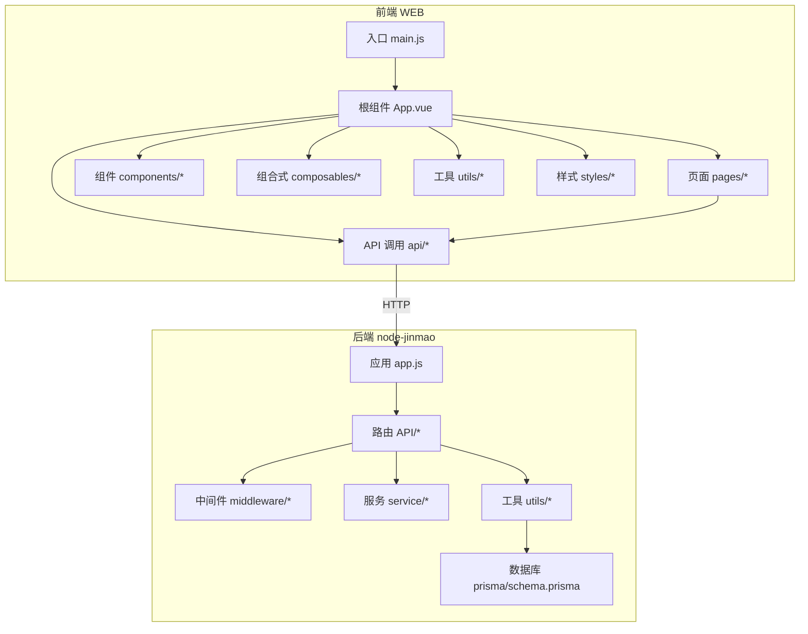
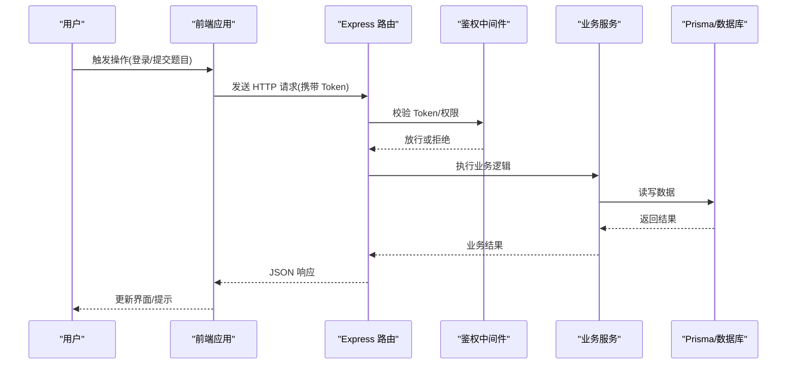
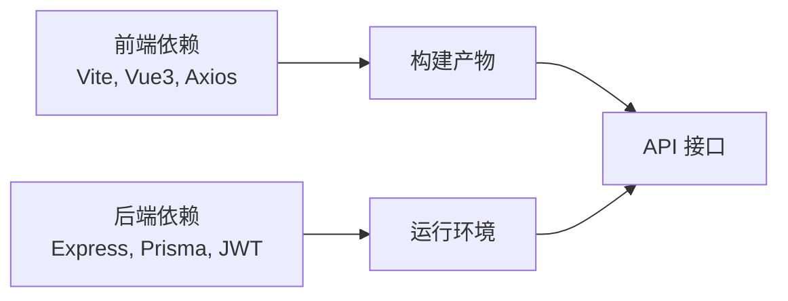

# 代码规范

<cite>
**本文档引用的文件**   
- [package.json](file://WEB/package.json)
- [vite.config.js](file://WEB/vite.config.js)
- [main.js](file://WEB/src/main.js)
- [App.vue](file://WEB/src/App.vue)
- [auth.js](file://WEB/src/api/auth.js)
- [useTheme.js](file://WEB/src/composables/useTheme.js)
- [storage.js](file://WEB/src/utils/storage.js)
- [index.vue](file://WEB/src/pages/login/index.vue)
- [script.js](file://WEB/src/pages/login/script.js)
- [app.js](file://node-jinmao/app.js)
- [package.json](file://node-jinmao/package.json)
- [auth.js](file://node-jinmao/middleware/auth.js)
- [auth.js](file://node-jinmao/API/auth.js)
- [schema.prisma](file://node-jinmao/prisma/schema.prisma)
- [jwt.js](file://node-jinmao/utils/jwt.js)
- [prisma.js](file://node-jinmao/utils/prisma.js)
</cite>

## 目录
1. [简介](#简介)
2. [项目结构](#项目结构)
3. [核心组件](#核心组件)
4. [架构总览](#架构总览)
5. [详细组件分析](#详细组件分析)
6. [依赖分析](#依赖分析)
7. [性能考虑](#性能考虑)
8. [故障排查指南](#故障排查指南)
9. [结论](#结论)
10. [附录](#附录)

## 简介
本规范面向“金毛教你学重构版”前后端工程，统一 JavaScript/TypeScript 编码风格、Vue 单文件组件开发约定、Node.js/Express 后端路由与中间件规范，并给出 ESLint/Prettier 等工具链配置建议。目标是在保证可读性与可维护性的前提下，提升团队协作效率与交付质量。

## 项目结构
前端采用 Vite + Vue 3（组合式 API），模块按功能域划分：API 层、页面级视图、通用组件、组合式函数、状态存储、样式与工具函数。后端采用 Node.js + Express，按领域划分 API 路由，使用 Prisma 进行数据访问，JWT 鉴权中间件贯穿受保护接口。

图表来源
- [main.js:1-200](file://WEB/src/main.js#L1-L200)
- [App.vue:1-200](file://WEB/src/App.vue#L1-L200)
- [app.js:1-200](file://node-jinmao/app.js#L1-L200)
- [schema.prisma:1-200](file://node-jinmao/prisma/schema.prisma#L1-L200)

章节来源
- [package.json:1-200](file://WEB/package.json#L1-L200)
- [vite.config.js:1-200](file://WEB/vite.config.js#L1-L200)
- [package.json:1-200](file://node-jinmao/package.json#L1-L200)

## 核心组件
- 前端入口与根组件
  - 入口初始化应用、挂载根组件、注册插件与全局样式。
  - 根组件负责路由容器与全局布局。
- 组合式函数
  - 将跨组件复用的响应式逻辑抽取为组合式函数，如主题切换、窗口尺寸监听等。
- API 客户端
  - 封装 HTTP 请求、错误处理、鉴权头注入与重试策略。
- 工具函数
  - 本地存储、格式化、校验等纯函数，保持无副作用与可测试性。

章节来源
- [main.js:1-200](file://WEB/src/main.js#L1-L200)
- [App.vue:1-200](file://WEB/src/App.vue#L1-L200)
- [useTheme.js:1-200](file://WEB/src/composables/useTheme.js#L1-L200)
- [auth.js:1-200](file://WEB/src/api/auth.js#L1-L200)
- [storage.js:1-200](file://WEB/src/utils/storage.js#L1-L200)

## 架构总览
前后端通过 RESTful API 交互，前端以组合式 API 组织业务逻辑，后端以 Express 路由+中间件+服务分层，数据库通过 Prisma 类型安全访问。

图表来源
- [app.js:1-200](file://node-jinmao/app.js#L1-L200)
- [auth.js:1-200](file://node-jinmao/middleware/auth.js#L1-L200)
- [auth.js:1-200](file://node-jinmao/API/auth.js#L1-L200)
- [schema.prisma:1-200](file://node-jinmao/prisma/schema.prisma#L1-L200)

## 详细组件分析

### 前端编码规范（JavaScript/TypeScript）
- 变量命名
  - 使用小驼峰命名变量与函数；常量使用全大写下划线分隔；布尔值以 is/has/can 前缀表达语义。
- 函数定义
  - 优先使用箭头函数声明表达式；复杂逻辑拆分为纯函数；避免过深嵌套，使用提前返回减少分支。
- 模块组织
  - 单一职责原则：每个模块只暴露必要接口；避免循环依赖；按需导入减少包体积。
- 异步与错误
  - 统一使用 Promise/async-await；集中错误处理；对网络请求做超时与重试策略。
- 示例参考路径
  - 组合式函数：[useTheme.js:1-200](file://WEB/src/composables/useTheme.js#L1-L200)
  - API 封装：[auth.js:1-200](file://WEB/src/api/auth.js#L1-L200)
  - 工具函数：[storage.js:1-200](file://WEB/src/utils/storage.js#L1-L200)

章节来源
- [useTheme.js:1-200](file://WEB/src/composables/useTheme.js#L1-L200)
- [auth.js:1-200](file://WEB/src/api/auth.js#L1-L200)
- [storage.js:1-200](file://WEB/src/utils/storage.js#L1-L200)

### Vue 单文件组件规范（Composition API）
- 组件结构
  - 模板、脚本、样式分离；脚本内顺序：imports → props/emits → 组合式逻辑 → 计算属性 → 方法 → 生命周期。
- Props 设计
  - 明确类型与默认值；禁止在子组件直接修改 props；通过事件向上通知变更。
- Events 设计
  - 事件名使用小写中划线；事件载荷仅包含必要字段；避免泄露内部实现细节。
- 组合式 API
  - 将复用逻辑抽离到 composables；使用 ref/reactive 管理状态；谨慎使用 provide/inject。
- 示例参考路径
  - 页面组件：[index.vue:1-200](file://WEB/src/pages/login/index.vue#L1-L200)
  - 页面脚本：[script.js:1-200](file://WEB/src/pages/login/script.js#L1-L200)

章节来源
- [index.vue:1-200](file://WEB/src/pages/login/index.vue#L1-L200)
- [script.js:1-200](file://WEB/src/pages/login/script.js#L1-L200)

### Node.js 后端规范（Express）
- 路由设计
  - 按领域拆分路由文件；RESTful 风格；统一响应格式与错误码。
- 中间件编写
  - 鉴权、日志、限流、参数校验等中间件独立成模块；遵循 next(err) 错误传递约定。
- 错误处理模式
  - 全局错误处理器捕获未处理异常；区分业务错误与系统错误；记录上下文信息。
- 示例参考路径
  - 应用入口：[app.js:1-200](file://node-jinmao/app.js#L1-L200)
  - 鉴权中间件：[auth.js:1-200](file://node-jinmao/middleware/auth.js#L1-L200)
  - 认证路由：[auth.js:1-200](file://node-jinmao/API/auth.js#L1-L200)
  - JWT 工具：[jwt.js:1-200](file://node-jinmao/utils/jwt.js#L1-L200)

章节来源
- [app.js:1-200](file://node-jinmao/app.js#L1-L200)
- [auth.js:1-200](file://node-jinmao/middleware/auth.js#L1-L200)
- [auth.js:1-200](file://node-jinmao/API/auth.js#L1-L200)
- [jwt.js:1-200](file://node-jinmao/utils/jwt.js#L1-L200)

### 数据模型与数据库访问
- 模型定义
  - 使用 Prisma schema 定义实体关系；字段命名与约束清晰；迁移版本化管理。
- 访问层
  - 通过 Prisma Client 进行类型安全的查询；封装常用 CRUD 为仓库或服务方法。
- 示例参考路径
  - 数据模型：[schema.prisma:1-200](file://node-jinmao/prisma/schema.prisma#L1-L200)
  - Prisma 客户端：[prisma.js:1-200](file://node-jinmao/utils/prisma.js#L1-L200)

章节来源
- [schema.prisma:1-200](file://node-jinmao/prisma/schema.prisma#L1-L200)
- [prisma.js:1-200](file://node-jinmao/utils/prisma.js#L1-L200)

### 工具类与配置
- 工具函数
  - 纯函数、无副作用、可单元测试；输入输出明确，边界条件完备。
- 配置管理
  - 环境变量与配置文件分离；敏感信息不入库；提供默认值与校验。
- 示例参考路径
  - 本地存储工具：[storage.js:1-200](file://WEB/src/utils/storage.js#L1-L200)
  - 构建配置：[vite.config.js:1-200](file://WEB/vite.config.js#L1-L200)

章节来源
- [storage.js:1-200](file://WEB/src/utils/storage.js#L1-L200)
- [vite.config.js:1-200](file://WEB/vite.config.js#L1-L200)

## 依赖分析
- 前端依赖
  - 构建工具：Vite；框架：Vue 3；可选：Pinia/Vuex、Axios、Day.js 等。
- 后端依赖
  - 运行时：Node.js；Web 框架：Express；ORM：Prisma；鉴权：JWT；其他第三方 SDK。
- 依赖治理
  - 锁定版本；定期审计漏洞；按需引入减少包体；公共库抽象为内部包。

图表来源
- [package.json:1-200](file://WEB/package.json#L1-L200)
- [package.json:1-200](file://node-jinmao/package.json#L1-L200)

章节来源
- [package.json:1-200](file://WEB/package.json#L1-L200)
- [package.json:1-200](file://node-jinmao/package.json#L1-L200)

## 性能考虑
- 前端
  - 懒加载路由与组件；图片与静态资源优化；合理使用缓存与虚拟列表；减少重排重绘。
- 后端
  - 接口幂等与分页；数据库索引与查询优化；连接池与缓存；异步任务队列。
- 通用
  - 监控与埋点；A/B 测试灰度发布；容量规划与弹性伸缩。

## 故障排查指南
- 常见问题定位
  - 前端：控制台报错、网络请求失败、组件渲染异常；使用浏览器开发者工具与 Source Map。
  - 后端：日志级别与链路追踪；中间件执行顺序；数据库连接与事务回滚。
- 调试技巧
  - 断点与日志打点；最小化复现用例；隔离问题模块；回归测试验证修复。
- 示例参考路径
  - 鉴权流程：[auth.js:1-200](file://node-jinmao/middleware/auth.js#L1-L200)
  - 认证路由：[auth.js:1-200](file://node-jinmao/API/auth.js#L1-L200)
  - 应用入口：[app.js:1-200](file://node-jinmao/app.js#L1-L200)

章节来源
- [auth.js:1-200](file://node-jinmao/middleware/auth.js#L1-L200)
- [auth.js:1-200](file://node-jinmao/API/auth.js#L1-L200)
- [app.js:1-200](file://node-jinmao/app.js#L1-L200)

## 结论
本规范从前端、后端、工具链三个维度统一了编码风格与工程实践，结合可视化架构图与流程图帮助团队快速对齐。建议在 CI 中集成 ESLint/Prettier/类型检查，持续改进代码质量与交付效率。

## 附录
- 工具链建议
  - ESLint：规则集与自定义规则；禁用危险语法；强制代码风格。
  - Prettier：统一格式化；编辑器保存时自动格式化。
  - TypeScript：严格模式；类型推导与显式类型标注；接口契约先行。
  - Git Hooks：pre-commit 检查；commit message 规范；自动化测试。
- 最佳实践清单
  - 命名一致、模块内聚、低耦合；错误可观测；文档与注释同步更新。