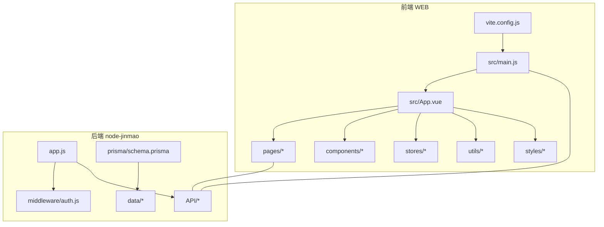
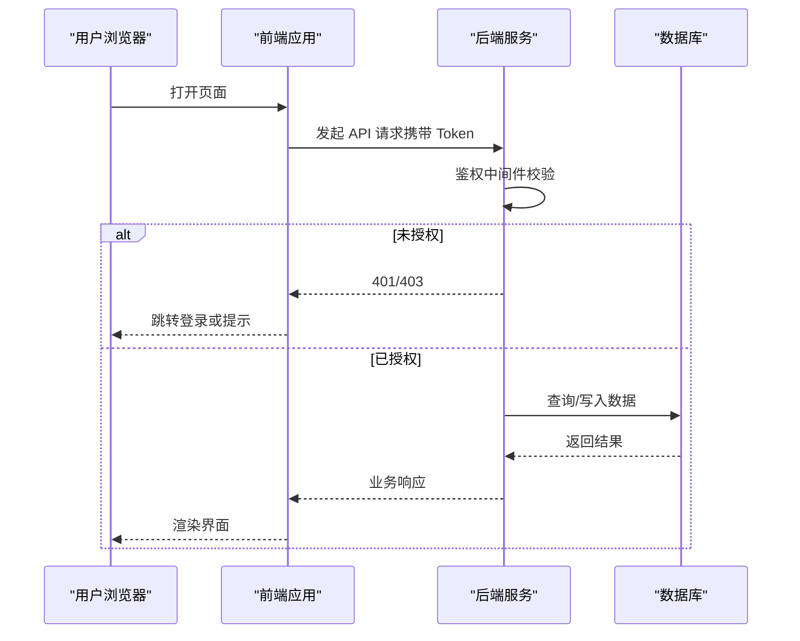
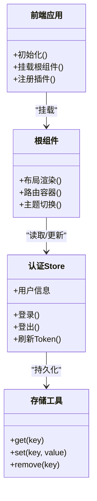
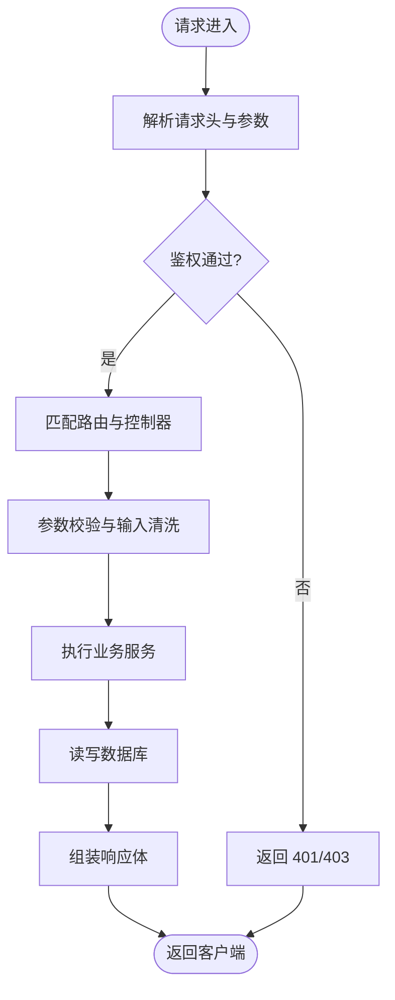
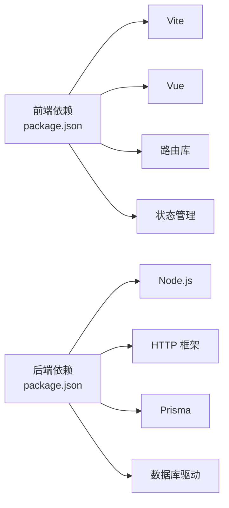

# 开发指南

<cite>
**本文引用的文件**   
- [package.json](file://node-jinmao/package.json)
- [app.js](file://node-jinmao/app.js)
- [auth.js](file://node-jinmao/middleware/auth.js)
- [schema.prisma](file://node-jinmao/prisma/schema.prisma)
- [vite.config.js](file://WEB/vite.config.js)
- [main.js](file://WEB/src/main.js)
- [App.vue](file://WEB/src/App.vue)
- [auth.js](file://WEB/src/stores/auth.js)
- [storage.js](file://WEB/src/utils/storage.js)
- [index.css](file://WEB/src/styles/index.css)
- [tokens.css](file://WEB/src/styles/tokens.css)
- [start.ps1](file://start.ps1)
- [deploy.ps1](file://deploy.ps1)
- [宝塔部署指南.md](file://宝塔部署指南.md)
- [WSL部署指南.md](file://WSL部署指南.md)
- [API文档.md](file://API文档.md)
- [数据库结构.md](file://数据库结构.md)
</cite>

## 目录
1. [简介](#简介)
2. [项目结构](#项目结构)
3. [核心组件](#核心组件)
4. [架构总览](#架构总览)
5. [详细组件分析](#详细组件分析)
6. [依赖分析](#依赖分析)
7. [性能考虑](#性能考虑)
8. [故障排查指南](#故障排查指南)
9. [结论](#结论)
10. [附录](#附录)

## 简介
本指南面向“金毛教你学重构版”项目的开发者，覆盖前后端代码规范、Vue.js 组件与 Node.js 后端约定、Git 工作流与分支策略、提交信息规范、代码审查流程、开发环境搭建与 IDE 配置、调试技巧、模块划分与命名约定、新功能开发全流程、性能优化与安全编码实践，以及代码质量检查工具的使用。目标是让新成员快速上手并高质量地参与迭代。

## 项目结构
本项目采用前后端分离的模块化结构：
- 前端（WEB）：基于 Vite + Vue 的单页应用，按功能域组织页面、组件、状态与 API 调用。
- 后端（node-jinmao）：基于 Node.js 的 REST API，使用 Prisma 管理数据模型与迁移，中间件负责鉴权等横切关注点。
- 根脚本与文档：提供启动、打包、部署脚本与部署/数据库/API 文档。

图表来源
- [vite.config.js](file://WEB/vite.config.js)
- [main.js](file://WEB/src/main.js)
- [App.vue](file://WEB/src/App.vue)
- [app.js](file://node-jinmao/app.js)
- [auth.js](file://node-jinmao/middleware/auth.js)
- [schema.prisma](file://node-jinmao/prisma/schema.prisma)

章节来源
- [package.json](file://node-jinmao/package.json)
- [vite.config.js](file://WEB/vite.config.js)
- [main.js](file://WEB/src/main.js)
- [App.vue](file://WEB/src/App.vue)
- [app.js](file://node-jinmao/app.js)
- [auth.js](file://node-jinmao/middleware/auth.js)
- [schema.prisma](file://node-jinmao/prisma/schema.prisma)

## 核心组件
- 前端入口与路由挂载
  - 入口初始化、插件注册、主题与全局样式加载由入口文件完成。
  - 根组件负责顶层布局与全局状态注入。
- 状态管理与存储
  - 认证状态集中管理，统一处理登录态、过期与刷新。
  - 本地存储封装，保证跨浏览器兼容与错误兜底。
- 后端服务与鉴权
  - 应用主进程加载中间件、路由与静态资源。
  - 鉴权中间件校验请求令牌，保护受保护接口。
- 数据模型与迁移
  - 使用 Prisma 定义实体关系与约束，配合迁移脚本演进数据库结构。

章节来源
- [main.js](file://WEB/src/main.js)
- [App.vue](file://WEB/src/App.vue)
- [auth.js](file://WEB/src/stores/auth.js)
- [storage.js](file://WEB/src/utils/storage.js)
- [app.js](file://node-jinmao/app.js)
- [auth.js](file://node-jinmao/middleware/auth.js)
- [schema.prisma](file://node-jinmao/prisma/schema.prisma)

## 架构总览
系统采用典型的前后端分离架构：前端通过 HTTP/SSE 与后端交互；后端以 Express 风格的路由组织业务，Prisma 作为 ORM 访问数据库；鉴权通过中间件在请求链路早期拦截。

图表来源
- [app.js](file://node-jinmao/app.js)
- [auth.js](file://node-jinmao/middleware/auth.js)
- [schema.prisma](file://node-jinmao/prisma/schema.prisma)

## 详细组件分析

### 前端工程化与组件规范
- 构建与开发服务器
  - 使用 Vite 进行开发与构建，配置文件集中管理代理、别名与插件。
- 入口与根组件
  - 入口文件负责初始化应用、挂载根组件与全局样式。
  - 根组件承载全局布局、路由容器与主题切换逻辑。
- 状态与存储
  - 认证 Store 统一管理登录态、用户信息与过期时间，提供统一的登录/登出方法。
  - 存储工具封装 localStorage/sessionStorage，提供类型安全与异常捕获。
- 样式与主题
  - 全局样式与 CSS 变量（tokens）集中管理，支持暗黑模式与主题切换。

图表来源
- [vite.config.js](file://WEB/vite.config.js)
- [main.js](file://WEB/src/main.js)
- [App.vue](file://WEB/src/App.vue)
- [auth.js](file://WEB/src/stores/auth.js)
- [storage.js](file://WEB/src/utils/storage.js)
- [index.css](file://WEB/src/styles/index.css)
- [tokens.css](file://WEB/src/styles/tokens.css)

章节来源
- [vite.config.js](file://WEB/vite.config.js)
- [main.js](file://WEB/src/main.js)
- [App.vue](file://WEB/src/App.vue)
- [auth.js](file://WEB/src/stores/auth.js)
- [storage.js](file://WEB/src/utils/storage.js)
- [index.css](file://WEB/src/styles/index.css)
- [tokens.css](file://WEB/src/styles/tokens.css)

### 后端服务与鉴权
- 应用主进程
  - 加载环境变量、中间件、路由与静态资源，启动 HTTP 服务。
- 鉴权中间件
  - 解析请求头中的令牌，校验签名与有效期，失败则拒绝访问。
- API 路由组织
  - 按领域划分 API 目录，每个路由文件对应一个业务模块。
- 数据层
  - 使用 Prisma Schema 定义模型与关系，迁移脚本驱动数据库变更。

图表来源
- [app.js](file://node-jinmao/app.js)
- [auth.js](file://node-jinmao/middleware/auth.js)
- [schema.prisma](file://node-jinmao/prisma/schema.prisma)

章节来源
- [app.js](file://node-jinmao/app.js)
- [auth.js](file://node-jinmao/middleware/auth.js)
- [schema.prisma](file://node-jinmao/prisma/schema.prisma)

### 数据库与迁移
- 模型设计
  - 使用 Prisma 定义用户、课程、题库、学习记录等实体及关联关系。
- 迁移管理
  - 每次结构变更生成迁移文件，确保多环境一致性。
- 连接与事务
  - 通过 Prisma Client 管理连接池与事务边界，避免并发问题。

章节来源
- [schema.prisma](file://node-jinmao/prisma/schema.prisma)

## 依赖分析
- 前端依赖
  - 构建工具与运行时框架由 package.json 声明，Vite 与 Vue 生态插件按需引入。
- 后端依赖
  - Node.js 运行时、Express 风格路由、Prisma 与数据库驱动由包管理工具维护。
- 外部集成
  - 对象存储、第三方 API（如 LLM/TTS）通过配置与客户端封装解耦。

图表来源
- [package.json](file://node-jinmao/package.json)

章节来源
- [package.json](file://node-jinmao/package.json)

## 性能考虑
- 前端
  - 按需加载与代码分割，减少首屏体积。
  - 图片与静态资源压缩与缓存策略。
  - 列表虚拟化与防抖节流，降低渲染压力。
- 后端
  - 接口幂等与缓存命中，减少重复计算。
  - 数据库查询优化（索引、分页、N+1 避免）。
  - 异步任务与队列处理耗时操作，提升吞吐。
- 网络
  - 合理设置超时与重试，避免雪崩。
  - SSE/WS 用于长连接场景，减少轮询开销。

[本节为通用指导，不直接分析具体文件]

## 故障排查指南
- 常见问题定位
  - 前端：控制台报错、网络面板查看请求/响应、路由跳转与权限拦截。
  - 后端：日志级别与结构化日志，中间件打印关键路径。
  - 数据库：慢查询分析与索引缺失。
- 调试技巧
  - 前端：断点调试、Mock 数据与本地代理。
  - 后端：单元测试与集成测试用例，Postman/Apifox 验证接口。
- 回滚与恢复
  - 迁移版本回滚与备份策略，确保可恢复性。

章节来源
- [宝塔部署指南.md](file://宝塔部署指南.md)
- [WSL部署指南.md](file://WSL部署指南.md)
- [API文档.md](file://API文档.md)
- [数据库结构.md](file://数据库结构.md)

## 结论
本指南总结了“金毛教你学重构版”的前后端开发规范、架构设计与工作流程。遵循本文档的约定，有助于团队保持一致的代码风格与交付质量，缩短新人上手周期，提升协作效率与系统稳定性。

## 附录

### 代码规范与约定
- JavaScript/TypeScript
  - 使用 ESLint + Prettier 统一格式与规则，禁止危险语法，强制类型注解。
  - 模块采用 ES Module，避免循环依赖。
- Vue.js 组件
  - 单文件组件命名 PascalCase，props 明确类型与默认值，事件命名小写短横线。
  - 组合式函数优先，保持组件职责单一。
- Node.js 后端
  - 路由按领域拆分，控制器仅做参数校验与转发，业务逻辑下沉至服务层。
  - 错误码与响应体统一封装，日志包含请求上下文。

[本节为通用指导，不直接分析具体文件]

### Git 工作流与分支策略
- 分支模型
  - main：稳定发布分支
  - develop：集成开发分支
  - feature/*：功能分支
  - hotfix/*：紧急修复分支
- 提交信息规范
  - 类型前缀：feat、fix、docs、style、refactor、test、chore
  - 描述简洁明了，必要时附 issue 编号
- 代码审查流程
  - 创建 PR 后至少一名 reviewer 审核，CI 通过后合并

[本节为通用指导，不直接分析具体文件]

### 开发环境与 IDE 配置
- 环境要求
  - Node.js LTS、数据库（MySQL/PostgreSQL）、对象存储（MinIO）
- 启动与安装
  - 前端：安装依赖后启动开发服务器
  - 后端：配置环境变量，执行数据库迁移，启动服务
- IDE 推荐
  - VS Code：ESLint、Prettier、Vue 插件、Prisma 插件
  - 调试：前端 Chrome DevTools，后端 Node Inspector

章节来源
- [start.ps1](file://start.ps1)
- [deploy.ps1](file://deploy.ps1)
- [宝塔部署指南.md](file://宝塔部署指南.md)
- [WSL部署指南.md](file://WSL部署指南.md)

### 新功能开发流程
- 需求分析
  - 明确用户故事、验收标准与非功能性需求
- 设计与评审
  - 接口契约、数据模型变更、UI 原型评审
- 实现与自测
  - 分支开发、单元测试与集成测试、联调
- 提测与上线
  - 代码审查、CI 流水线、灰度发布与监控告警

[本节为通用指导，不直接分析具体文件]

### 性能优化最佳实践
- 前端：懒加载、预取、缓存策略、动画与重排优化
- 后端：连接池、缓存层、异步任务、限流与熔断
- 数据库：索引优化、查询计划分析、分库分表规划

[本节为通用指导，不直接分析具体文件]

### 安全编码规范
- 输入校验与输出编码，防止 XSS/SQL 注入
- 敏感信息加密与密钥管理（环境变量/密钥管理服务）
- 最小权限原则与访问控制，审计日志留存

[本节为通用指导，不直接分析具体文件]

### 代码质量检查工具
- 前端：ESLint、Prettier、Vitest、Playwright
- 后端：ESLint、Jest、Supertest、Prisma 迁移校验
- 持续集成：GitHub Actions/GitLab CI，自动化 lint/test/build

[本节为通用指导，不直接分析具体文件]