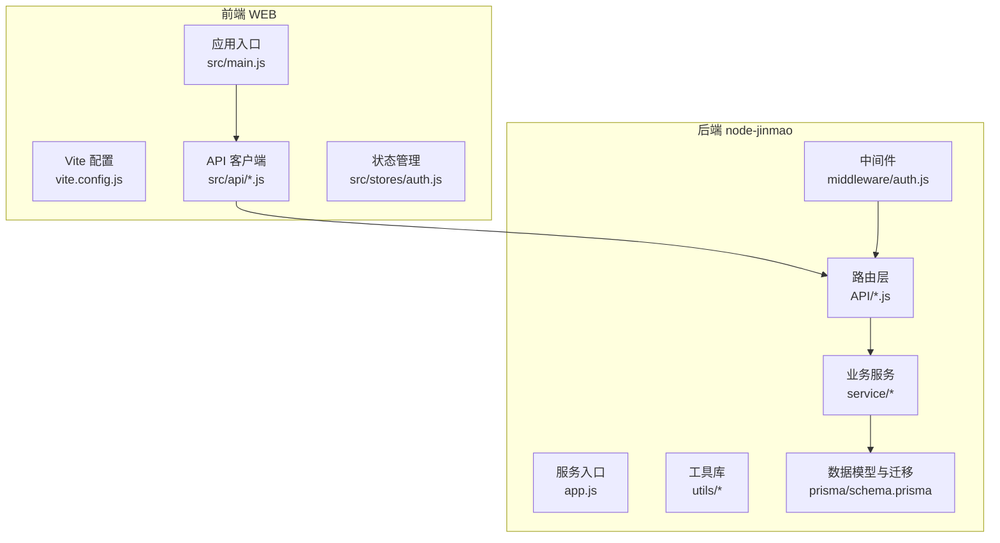
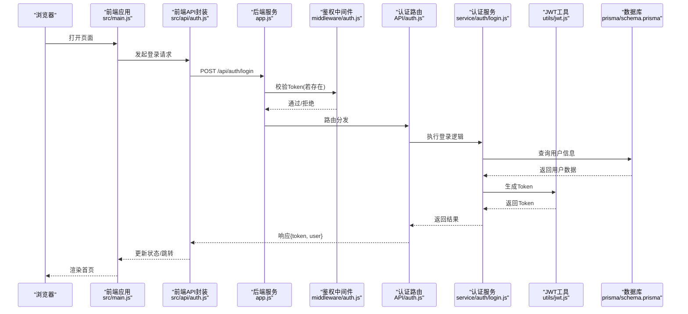
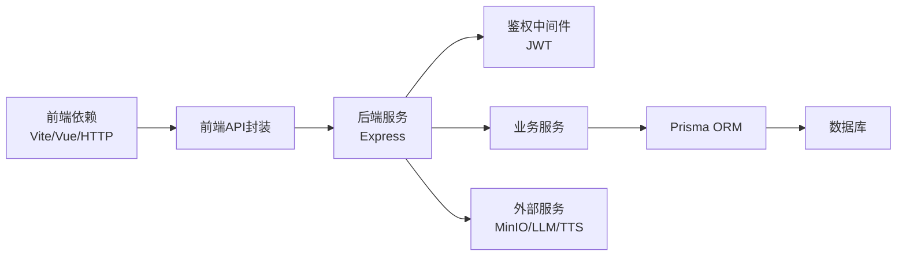

# 开发流程

<cite>
**本文引用的文件**   
- [package.json](file://node-jinmao/package.json)
- [app.js](file://node-jinmao/app.js)
- [schema.prisma](file://node-jinmao/prisma/schema.prisma)
- [auth.js](file://node-jinmao/middleware/auth.js)
- [index.js](file://node-jinmao/API/auth.js)
- [login.js](file://node-jinmao/service/auth/login.js)
- [jwt.js](file://node-jinmao/utils/jwt.js)
- [vite.config.js](file://WEB/vite.config.js)
- [main.js](file://WEB/src/main.js)
- [auth.js](file://WEB/src/api/auth.js)
- [auth.js](file://WEB/src/stores/auth.js)
- [.gitignore](file://node-jinmao/.gitignore)
- [.gitignore](file://WEB/.gitignore)
- [deploy.ps1](file://deploy.ps1)
- [start.ps1](file://start.ps1)
- [ftp_upload.ps1](file://ftp_upload.ps1)
- [pack.ps1](file://pack.ps1)
- [sync_wsl.ps1](file://sync_wsl.ps1)
- [宝塔部署指南.md](file://宝塔部署指南.md)
- [WSL部署指南.md](file://WSL部署指南.md)
- [测试命令.md](file://测试命令.md)
- [数据库结构.md](file://数据库结构.md)
- [API文档.md](file://API文档.md)
</cite>

## 目录
1. [简介](#简介)
2. [项目结构](#项目结构)
3. [核心组件](#核心组件)
4. [架构总览](#架构总览)
5. [详细组件分析](#详细组件分析)
6. [依赖分析](#依赖分析)
7. [性能考虑](#性能考虑)
8. [故障排查指南](#故障排查指南)
9. [结论](#结论)
10. [附录](#附录)

## 简介
本文件面向“金毛教你学重构版”项目的开发者与贡献者，系统化说明Git工作流、分支策略、提交规范、代码审查、新功能开发全流程、Pull Request合并、版本发布与回滚机制，以及开源协作规范。文档同时提供可执行的命令行示例与最佳实践建议，帮助团队高效协作并保证质量。

## 项目结构
本项目采用前后端分离的仓库组织：
- WEB：前端工程（Vue + Vite）
- node-jinmao：后端服务（Node.js + Express + Prisma）
- 根目录脚本：部署、打包、同步等自动化脚本
- 文档：部署指南、数据库结构、API文档等

图表来源 
- [vite.config.js](file://WEB/vite.config.js)
- [main.js](file://WEB/src/main.js)
- [auth.js](file://WEB/src/api/auth.js)
- [auth.js](file://WEB/src/stores/auth.js)
- [app.js](file://node-jinmao/app.js)
- [auth.js](file://node-jinmao/middleware/auth.js)
- [index.js](file://node-jinmao/API/auth.js)
- [login.js](file://node-jinmao/service/auth/login.js)
- [jwt.js](file://node-jinmao/utils/jwt.js)
- [schema.prisma](file://node-jinmao/prisma/schema.prisma)

章节来源
- [package.json](file://node-jinmao/package.json)
- [vite.config.js](file://WEB/vite.config.js)
- [main.js](file://WEB/src/main.js)
- [app.js](file://node-jinmao/app.js)

## 核心组件
- 前端
  - 构建与运行：Vite 作为开发与构建工具
  - API 调用：集中式 API 模块封装请求与鉴权
  - 状态管理：认证状态存储与持久化
- 后端
  - 服务入口：Express 应用初始化与中间件挂载
  - 鉴权中间件：JWT 校验与权限控制
  - 路由与服务：按领域划分 API 与业务逻辑
  - 数据访问：Prisma ORM 与数据库迁移
- 部署与自动化
  - 本地启动脚本、打包脚本、FTP 上传脚本、WSL/宝塔部署指南

章节来源
- [vite.config.js](file://WEB/vite.config.js)
- [auth.js](file://WEB/src/api/auth.js)
- [auth.js](file://WEB/src/stores/auth.js)
- [app.js](file://node-jinmao/app.js)
- [auth.js](file://node-jinmao/middleware/auth.js)
- [index.js](file://node-jinmao/API/auth.js)
- [login.js](file://node-jinmao/service/auth/login.js)
- [jwt.js](file://node-jinmao/utils/jwt.js)
- [schema.prisma](file://node-jinmao/prisma/schema.prisma)

## 架构总览
下图展示从浏览器到后端服务的典型请求链路，包括鉴权与数据库交互。

图表来源 
- [main.js](file://WEB/src/main.js)
- [auth.js](file://WEB/src/api/auth.js)
- [app.js](file://node-jinmao/app.js)
- [auth.js](file://node-jinmao/middleware/auth.js)
- [index.js](file://node-jinmao/API/auth.js)
- [login.js](file://node-jinmao/service/auth/login.js)
- [jwt.js](file://node-jinmao/utils/jwt.js)
- [schema.prisma](file://node-jinmao/prisma/schema.prisma)

## 详细组件分析

### Git 工作流与分支策略
- 主分支
  - main：稳定可发布的基线，仅接受来自 release 或 hotfix 的合并
  - develop：集成开发分支，功能特性在此聚合与验证
- 功能分支
  - feature/*：新功能开发，基于 develop 创建，完成后合并回 develop
  - bugfix/*：缺陷修复，基于 develop 或 main（视紧急程度）
  - hotfix/*：线上紧急修复，基于 main，修复后同步至 develop
- 发布分支
  - release/*：预发布准备，打标签前进行回归与冻结
- 提交信息规范（Conventional Commits）
  - feat: 新功能
  - fix: 缺陷修复
  - docs: 文档变更
  - style: 格式调整（不影响逻辑）
  - refactor: 重构（非功能变更）
  - test: 测试相关
  - chore: 构建/工具链变更
  - ci: CI/CD 变更
  - perf: 性能优化
  - revert: 回滚提交
- 分支命名约定
  - 使用小写与短横线分隔，如 feature/add-quiz-report
- 提交粒度
  - 一次提交聚焦一个变更点，避免混合改动
- 合并策略
  - 功能分支通过 Pull Request 合并至 develop；release/hotfix 合并至 main 并打标签

章节来源
- [.gitignore](file://node-jinmao/.gitignore)
- [.gitignore](file://WEB/.gitignore)

### 代码审查流程
- 提交流程
  - 在功能分支完成自测后，推送至远端并创建 Pull Request
- 审查要求
  - 至少一名维护者审查通过
  - 检查项：功能正确性、可读性、错误处理、性能影响、兼容性
- 自动化检查
  - 静态检查、单元测试、构建验证应在 PR 中通过
- 合并规则
  - 通过所有检查后由审查者合并，禁止强制合并到受保护分支

### 新功能开发全流程
- 需求分析
  - 明确目标、范围、验收标准与边界条件
- 技术设计
  - 接口定义、数据模型变更、流程图与异常路径
- 编码实现
  - 遵循代码风格与模块化原则，最小化耦合
- 测试验证
  - 单元/集成测试覆盖关键路径，端到端场景验证
- 文档更新
  - 更新 API 文档、用户手册与部署说明

### Pull Request 创建与合并流程
- 创建 PR
  - 选择源分支与目标分支，填写变更说明与关联 Issue
- 审查与讨论
  - 评论反馈、迭代修改直至通过
- 合并
  - 通过检查后合并，删除已合入的功能分支

### 版本发布策略与回滚机制
- 版本策略
  - 语义化版本：主版本.次版本.修订号
  - 发布分支 release/x.y.z 冻结变更，回归通过后打标签 v x.y.z
- 发布步骤
  - 构建产物、部署到预发环境、灰度发布、全量上线
- 回滚机制
  - 快速回滚：将 main 回退至上一个稳定标签
  - 热修复：hotfix/* 分支修复后合并至 main 并打新标签

### 开源贡献与社区协作规范
- Issue 提交
  - 清晰描述问题、复现步骤、期望行为与环境信息
- 贡献流程
  - Fork 仓库 -> 创建功能分支 -> 提交变更 -> 发起 PR
- 协作礼仪
  - 尊重审查意见、保持沟通透明、及时响应反馈

### 实际命令行操作示例与最佳实践
- 分支与提交
  - 创建功能分支：git checkout -b feature/add-quiz-report
  - 提交规范：git commit -m "feat: 添加测验报告导出功能"
  - 推送与创建PR：git push origin feature/add-quiz-report
- 合并与清理
  - 合并至develop：在平台创建PR并通过审查后合并
  - 删除远程分支：git push origin --delete feature/add-quiz-report
- 发布与回滚
  - 打标签：git tag -a v1.2.0 -m "发布 v1.2.0"
  - 回滚：git revert <commit-hash> 或 git reset --hard v1.1.9

章节来源
- [deploy.ps1](file://deploy.ps1)
- [start.ps1](file://start.ps1)
- [ftp_upload.ps1](file://ftp_upload.ps1)
- [pack.ps1](file://pack.ps1)
- [sync_wsl.ps1](file://sync_wsl.ps1)

## 依赖分析
- 前端依赖
  - Vite 构建系统、Vue 生态、HTTP 客户端与状态管理
- 后端依赖
  - Node.js 运行时、Express 框架、Prisma ORM、JWT 鉴权
- 外部集成
  - 数据库（通过 Prisma）、对象存储（MinIO）、第三方LLM/TTS接口（配置文件驱动）

图表来源 
- [package.json](file://node-jinmao/package.json)
- [vite.config.js](file://WEB/vite.config.js)
- [app.js](file://node-jinmao/app.js)
- [auth.js](file://node-jinmao/middleware/auth.js)
- [jwt.js](file://node-jinmao/utils/jwt.js)
- [schema.prisma](file://node-jinmao/prisma/schema.prisma)

章节来源
- [package.json](file://node-jinmao/package.json)
- [vite.config.js](file://WEB/vite.config.js)
- [app.js](file://node-jinmao/app.js)

## 性能考虑
- 前端
  - 按需加载与懒路由、资源压缩与缓存策略、减少重绘与重排
- 后端
  - 连接池与异步I/O、数据库查询优化与索引、缓存热点数据
- 部署
  - 水平扩展与负载均衡、CDN加速静态资源、监控与告警

## 故障排查指南
- 常见问题定位
  - 网络与鉴权：检查JWT配置、跨域设置、环境变量
  - 数据库：确认连接串、迁移状态、索引与约束
  - 构建与部署：检查脚本输出、日志与端口占用
- 调试建议
  - 启用详细日志、分阶段断点、隔离问题域
  - 使用测试命令与最小复现用例

章节来源
- [测试命令.md](file://测试命令.md)
- [宝塔部署指南.md](file://宝塔部署指南.md)
- [WSL部署指南.md](file://WSL部署指南.md)
- [数据库结构.md](file://数据库结构.md)
- [API文档.md](file://API文档.md)

## 结论
通过规范的Git工作流、严格的代码审查与清晰的版本发布策略，团队能够在保证质量的前提下高效交付。结合自动化脚本与完善的文档，降低协作成本并提升稳定性。建议在持续实践中不断优化流程与工具链，以适配业务增长与技术演进。

## 附录
- 部署与运维
  - 参考宝塔与WSL部署指南，确保环境一致性与可重复性
- 数据与接口
  - 依据数据库结构与API文档进行设计与联调
- 测试与验证
  - 使用测试命令集进行回归与冒烟测试