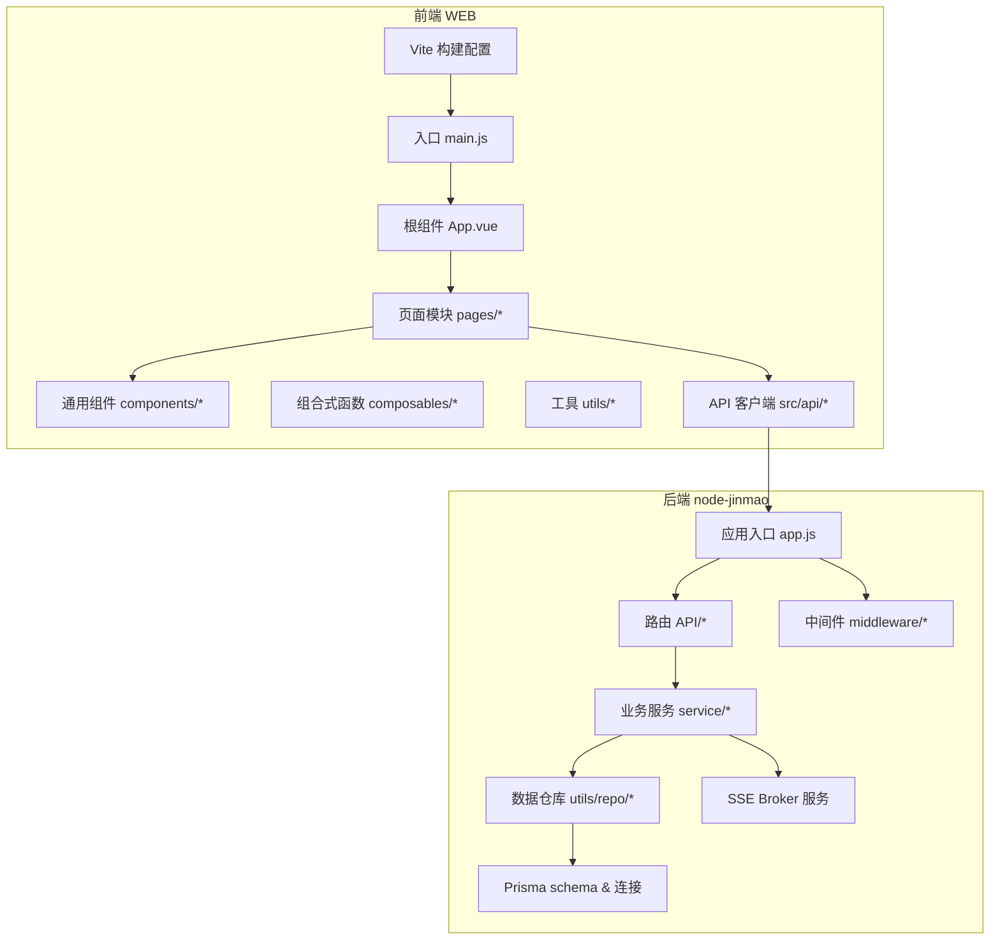
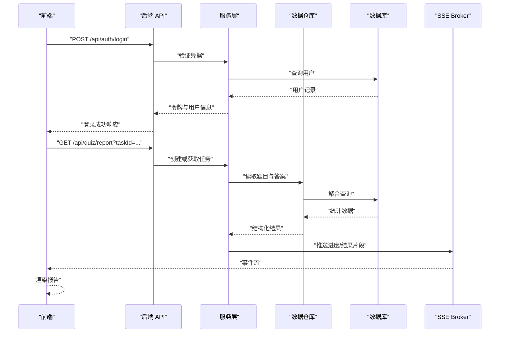
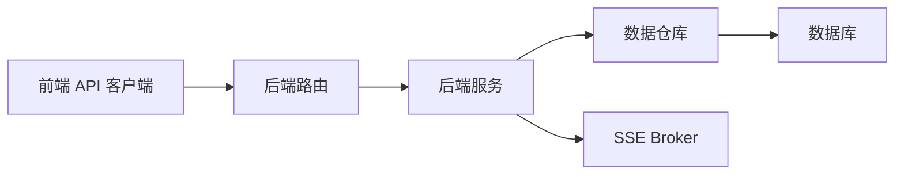

# 性能优化

<cite>
**本文引用的文件**   
- [vite.config.js](file://WEB/vite.config.js)
- [package.json](file://WEB/package.json)
- [index.html](file://WEB/index.html)
- [main.js](file://WEB/src/main.js)
- [App.vue](file://WEB/src/App.vue)
- [auth.js](file://WEB/src/api/auth.js)
- [books.js](file://WEB/src/api/books.js)
- [progress.js](file://WEB/src/api/progress.js)
- [quiz.js](file://WEB/src/api/quiz.js)
- [stats.js](file://WEB/src/api/stats.js)
- [billing.js](file://WEB/src/api/billing.js)
- [client.js](file://WEB/src/api/client.js)
- [HomeTopbar.vue](file://WEB/src/components/HomeTopbar.vue)
- [HomeSidebar.vue](file://WEB/src/components/HomeSidebar.vue)
- [CourseCard.vue](file://WEB/src/components/CourseCard.vue)
- [QuizQuestionCard.vue](file://WEB/src/components/quiz/QuizQuestionCard.vue)
- [useTheme.js](file://WEB/src/composables/useTheme.js)
- [storage.js](file://WEB/src/utils/storage.js)
- [app.js](file://node-jinmao/app.js)
- [package.json](file://node-jinmao/package.json)
- [schema.prisma](file://node-jinmao/prisma/schema.prisma)
- [prisma.js](file://node-jinmao/utils/prisma.js)
- [auth.js](file://node-jinmao/middleware/auth.js)
- [auth.js](file://node-jinmao/API/auth.js)
- [book/index.js](file://node-jinmao/API/book/index.js)
- [course/slides.js](file://node-jinmao/API/course/slides.js)
- [quiz/session.js](file://node-jinmao/API/quiz/session.js)
- [progress.js](file://node-jinmao/API/progress.js)
- [stats.js](file://node-jinmao/API/stats.js)
- [task-service.js](file://node-jinmao/service/md2quiz/task-service.js)
- [task-stream-broker.js](file://node-jinmao/service/md2quiz/task-stream-broker.js)
- [quiz_sse_broker.js](file://node-jinmao/service/quiz_sse_broker.js)
- [activity_repo.js](file://node-jinmao/utils/repo/activity_repo.js)
- [book_repo.js](file://node-jinmao/utils/repo/book_repo.js)
- [chapter_repo.js](file://node-jinmao/utils/repo/chapter_repo.js)
- [progress_repo.js](file://node-jinmao/utils/repo/progress_repo.js)
- [stats_repo.js](file://node-jinmao/utils/repo/stats_repo.js)
- [update_repo.js](file://node-jinmao/utils/repo/update_repo.js)
</cite>

## 目录
1. [简介](#简介)
2. [项目结构](#项目结构)
3. [核心组件](#核心组件)
4. [架构总览](#架构总览)
5. [详细组件分析](#详细组件分析)
6. [依赖分析](#依赖分析)
7. [性能考虑](#性能考虑)
8. [故障排查指南](#故障排查指南)
9. [结论](#结论)
10. [附录](#附录)

## 简介
本性能优化文档面向“金毛教你学重构版”前后端工程，聚焦以下目标：
- 前端性能优化：Vue.js 组件懒加载、路由分割、资源压缩与缓存策略。
- 后端性能优化：数据库查询优化、索引设计、缓存机制、异步处理。
- API 接口优化：响应数据精简、分页查询、批量操作、SSE 流式传输。
- 内存管理与垃圾回收优化建议。
- 监控与性能分析工具使用。
- 性能瓶颈定位方法与实际优化案例。

## 项目结构
本项目由两部分组成：
- 前端 WEB（Vite + Vue）：提供用户界面与交互，包含页面、组件、API 客户端、主题与存储工具等。
- 后端 node-jinmao（Node.js + Express + Prisma）：提供 REST API、任务服务、SSE 流式推送、数据库访问与中间件。

图表来源
- [vite.config.js](file://WEB/vite.config.js)
- [main.js](file://WEB/src/main.js)
- [App.vue](file://WEB/src/App.vue)
- [app.js](file://node-jinmao/app.js)
- [schema.prisma](file://node-jinmao/prisma/schema.prisma)

章节来源
- [vite.config.js](file://WEB/vite.config.js)
- [package.json](file://WEB/package.json)
- [index.html](file://WEB/index.html)
- [main.js](file://WEB/src/main.js)
- [App.vue](file://WEB/src/App.vue)
- [app.js](file://node-jinmao/app.js)
- [package.json](file://node-jinmao/package.json)

## 核心组件
- 前端构建与打包
  - Vite 构建配置用于控制开发/生产行为、插件与输出产物。
  - 入口 main.js 初始化应用与路由；根组件 App.vue 组织全局布局与状态。
- 前端 API 客户端
  - src/api/* 封装各模块请求，统一调用方式与错误处理。
- 后端应用与路由
  - app.js 启动服务并挂载路由；API/* 按领域划分控制器。
- 数据层
  - Prisma schema 定义模型与关系；utils/repo/* 实现具体查询与事务。
- 异步与流式
  - service/md2quiz/* 负责长耗时任务编排与执行；service/quiz_sse_broker.js 提供 SSE 推送。

章节来源
- [main.js](file://WEB/src/main.js)
- [App.vue](file://WEB/src/App.vue)
- [auth.js](file://WEB/src/api/auth.js)
- [books.js](file://WEB/src/api/books.js)
- [progress.js](file://WEB/src/api/progress.js)
- [quiz.js](file://WEB/src/api/quiz.js)
- [stats.js](file://WEB/src/api/stats.js)
- [billing.js](file://WEB/src/api/billing.js)
- [client.js](file://WEB/src/api/client.js)
- [app.js](file://node-jinmao/app.js)
- [schema.prisma](file://node-jinmao/prisma/schema.prisma)
- [task-service.js](file://node-jinmao/service/md2quiz/task-service.js)
- [task-stream-broker.js](file://node-jinmao/service/md2quiz/task-stream-broker.js)
- [quiz_sse_broker.js](file://node-jinmao/service/quiz_sse_broker.js)

## 架构总览
整体采用前后端分离架构：前端通过 HTTP/SSE 与后端交互，后端以 REST API 暴露能力，并通过 Prisma 访问数据库。关键流程包括：
- 登录鉴权：前端调用认证接口，后端校验并返回令牌。
- 题库与课程：前端请求列表/详情，后端从数据库读取并返回精简数据。
- 学习进度：前端上报答题结果，后端持久化并统计。
- 报告生成：前端发起任务，后端异步处理并通过 SSE 推送进度与结果。

图表来源
- [auth.js](file://node-jinmao/API/auth.js)
- [quiz/session.js](file://node-jinmao/API/quiz/session.js)
- [progress.js](file://node-jinmao/API/progress.js)
- [stats.js](file://node-jinmao/API/stats.js)
- [task-service.js](file://node-jinmao/service/md2quiz/task-service.js)
- [task-stream-broker.js](file://node-jinmao/service/md2quiz/task-stream-broker.js)
- [quiz_sse_broker.js](file://node-jinmao/service/quiz_sse_broker.js)

## 详细组件分析

### 前端性能优化
- 组件懒加载与路由分割
  - 在页面级进行按需加载，减少首屏体积。
  - 对大型组件（如测验题卡、报告视图）使用动态导入。
- 资源压缩与缓存
  - 启用 Gzip/Brotli 压缩，合理设置静态资源缓存头。
  - 利用浏览器缓存与 CDN 加速。
- 网络请求优化
  - 合并重复请求、使用防抖/节流、合理分页与增量更新。
  - 对大对象进行字段裁剪，避免冗余传输。

章节来源
- [vite.config.js](file://WEB/vite.config.js)
- [package.json](file://WEB/package.json)
- [index.html](file://WEB/index.html)
- [main.js](file://WEB/src/main.js)
- [App.vue](file://WEB/src/App.vue)
- [auth.js](file://WEB/src/api/auth.js)
- [books.js](file://WEB/src/api/books.js)
- [progress.js](file://WEB/src/api/progress.js)
- [quiz.js](file://WEB/src/api/quiz.js)
- [stats.js](file://WEB/src/api/stats.js)
- [billing.js](file://WEB/src/api/billing.js)
- [client.js](file://WEB/src/api/client.js)
- [HomeTopbar.vue](file://WEB/src/components/HomeTopbar.vue)
- [HomeSidebar.vue](file://WEB/src/components/HomeSidebar.vue)
- [CourseCard.vue](file://WEB/src/components/CourseCard.vue)
- [QuizQuestionCard.vue](file://WEB/src/components/quiz/QuizQuestionCard.vue)
- [useTheme.js](file://WEB/src/composables/useTheme.js)
- [storage.js](file://WEB/src/utils/storage.js)

### 后端性能优化
- 数据库查询优化
  - 使用 Prisma 的 select/include 精确选择字段，避免 N+1 查询。
  - 将热点查询结果缓存至内存或 Redis，降低数据库压力。
- 索引设计
  - 为高频过滤与排序字段建立复合索引，提升查询效率。
  - 定期分析慢查询日志，调整索引与查询计划。
- 缓存机制
  - 接口级缓存：对读多写少的数据使用短 TTL 缓存。
  - 会话与令牌缓存：集中管理，支持快速失效与滚动刷新。
- 异步处理
  - 长耗时任务放入队列，消费者独立扩展。
  - 使用 SSE 实时推送任务进度与结果，改善用户体验。

章节来源
- [app.js](file://node-jinmao/app.js)
- [schema.prisma](file://node-jinmao/prisma/schema.prisma)
- [prisma.js](file://node-jinmao/utils/prisma.js)
- [auth.js](file://node-jinmao/middleware/auth.js)
- [auth.js](file://node-jinmao/API/auth.js)
- [book/index.js](file://node-jinmao/API/book/index.js)
- [course/slides.js](file://node-jinmao/API/course/slides.js)
- [quiz/session.js](file://node-jinmao/API/quiz/session.js)
- [progress.js](file://node-jinmao/API/progress.js)
- [stats.js](file://node-jinmao/API/stats.js)
- [task-service.js](file://node-jinmao/service/md2quiz/task-service.js)
- [task-stream-broker.js](file://node-jinmao/service/md2quiz/task-stream-broker.js)
- [quiz_sse_broker.js](file://node-jinmao/service/quiz_sse_broker.js)
- [activity_repo.js](file://node-jinmao/utils/repo/activity_repo.js)
- [book_repo.js](file://node-jinmao/utils/repo/book_repo.js)
- [chapter_repo.js](file://node-jinmao/utils/repo/chapter_repo.js)
- [progress_repo.js](file://node-jinmao/utils/repo/progress_repo.js)
- [stats_repo.js](file://node-jinmao/utils/repo/stats_repo.js)
- [update_repo.js](file://node-jinmao/utils/repo/update_repo.js)

### API 接口优化
- 响应数据精简
  - 明确返回字段，避免携带无关数据。
  - 对列表接口默认只返回摘要字段，详情接口再展开。
- 分页查询
  - 统一分页参数与返回结构，支持游标或页码分页。
  - 对大数据集使用流式读取与分批返回。
- 批量操作
  - 合并多次写入为一次事务，减少锁竞争与往返开销。
  - 对批量读取使用 IN 查询或批量 JOIN。
- SSE 流式传输
  - 对长耗时任务使用 SSE 推送进度与增量结果。
  - 客户端断线重连与幂等处理，保证稳定性。

章节来源
- [auth.js](file://node-jinmao/API/auth.js)
- [book/index.js](file://node-jinmao/API/book/index.js)
- [course/slides.js](file://node-jinmao/API/course/slides.js)
- [quiz/session.js](file://node-jinmao/API/quiz/session.js)
- [progress.js](file://node-jinmao/API/progress.js)
- [stats.js](file://node-jinmao/API/stats.js)
- [task-service.js](file://node-jinmao/service/md2quiz/task-service.js)
- [task-stream-broker.js](file://node-jinmao/service/md2quiz/task-stream-broker.js)
- [quiz_sse_broker.js](file://node-jinmao/service/quiz_sse_broker.js)

### 内存管理与垃圾回收优化建议
- 前端
  - 及时销毁监听器与定时器，避免内存泄漏。
  - 大对象使用弱引用或分片渲染，降低主线程压力。
  - 合理使用虚拟列表与懒加载，减少 DOM 节点数量。
- 后端
  - 避免在循环中创建大对象，复用缓冲区与连接池。
  - 合理设置 Node.js 堆大小与 GC 策略，监控堆增长。
  - 对临时文件与上传内容及时清理，防止磁盘与内存占用。

章节来源
- [storage.js](file://WEB/src/utils/storage.js)
- [prisma.js](file://node-jinmao/utils/prisma.js)
- [task-service.js](file://node-jinmao/service/md2quiz/task-service.js)
- [task-stream-broker.js](file://node-jinmao/service/md2quiz/task-stream-broker.js)

### 监控与性能分析工具使用
- 前端
  - 使用浏览器开发者工具的 Performance 面板录制关键路径。
  - 使用 Lighthouse 评估首屏与可访问性指标。
  - 接入性能埋点，收集用户真实体验数据。
- 后端
  - 使用 APM 工具（如 PM2、OpenTelemetry）采集请求时延与错误率。
  - 开启数据库慢查询日志，结合 EXPLAIN 分析执行计划。
  - 监控 CPU、内存、I/O 与连接池使用情况。

章节来源
- [vite.config.js](file://WEB/vite.config.js)
- [package.json](file://WEB/package.json)
- [app.js](file://node-jinmao/app.js)
- [package.json](file://node-jinmao/package.json)

## 依赖分析
- 前端依赖
  - Vite 作为构建工具，Vue 作为框架，配合路由与状态管理。
  - API 客户端统一封装，便于维护与扩展。
- 后端依赖
  - Express 作为 Web 框架，Prisma 作为 ORM，中间件处理鉴权与日志。
  - 任务服务与 SSE Broker 解耦，支持水平扩展。

图表来源
- [client.js](file://WEB/src/api/client.js)
- [app.js](file://node-jinmao/app.js)
- [task-service.js](file://node-jinmao/service/md2quiz/task-service.js)
- [quiz_sse_broker.js](file://node-jinmao/service/quiz_sse_broker.js)

章节来源
- [client.js](file://WEB/src/api/client.js)
- [app.js](file://node-jinmao/app.js)
- [task-service.js](file://node-jinmao/service/md2quiz/task-service.js)
- [quiz_sse_broker.js](file://node-jinmao/service/quiz_sse_broker.js)

## 性能考虑
- 前端
  - 首屏优化：路由分割、组件懒加载、资源压缩与缓存。
  - 运行时优化：减少重排重绘、使用虚拟列表、避免阻塞主线程。
- 后端
  - 查询优化：精准字段选择、索引设计与慢查询治理。
  - 并发与扩展：无状态服务、连接池与队列消费并行化。
  - 缓存策略：多级缓存（内存、Redis、CDN），合理 TTL 与失效策略。
- API
  - 精简响应、分页与批量操作、SSE 流式传输提升交互体验。
- 监控与调优
  - 全链路追踪、指标采集与告警，持续迭代优化。

[本节为通用指导，不直接分析具体文件]

## 故障排查指南
- 常见问题定位
  - 前端：检查网络请求是否超时或失败，查看控制台错误与性能面板。
  - 后端：查看日志与 APM 指标，定位慢接口与异常堆栈。
- 数据库问题
  - 分析慢查询日志，使用 EXPLAIN 查看执行计划，补充或调整索引。
- 缓存问题
  - 检查缓存命中率与过期策略，避免脏数据与雪崩效应。
- 内存问题
  - 前端：检测未释放的监听器与闭包引用。
  - 后端：监控堆内存与 GC 频率，定位大对象与泄漏点。

章节来源
- [auth.js](file://node-jinmao/middleware/auth.js)
- [prisma.js](file://node-jinmao/utils/prisma.js)
- [task-service.js](file://node-jinmao/service/md2quiz/task-service.js)
- [task-stream-broker.js](file://node-jinmao/service/md2quiz/task-stream-broker.js)

## 结论
通过对前端构建与运行期、后端查询与缓存、API 设计与流式传输的系统性优化，可以显著提升“金毛教你学重构版”的性能与用户体验。建议结合监控与压测持续迭代，确保在高并发与大数据量场景下的稳定表现。

[本节为总结性内容，不直接分析具体文件]

## 附录
- 优化清单
  - 前端：路由分割、组件懒加载、资源压缩、缓存策略、请求去重与分页。
  - 后端：索引设计、查询优化、缓存机制、异步处理、SSE 流式传输。
  - 监控：APM、慢查询日志、性能埋点与告警。
- 实践建议
  - 小步快跑，先测量后优化，避免盲目改动。
  - 建立性能基线与回归测试，保障优化效果。

[本节为补充说明，不直接分析具体文件]