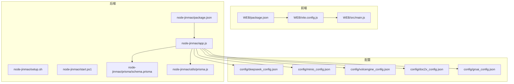
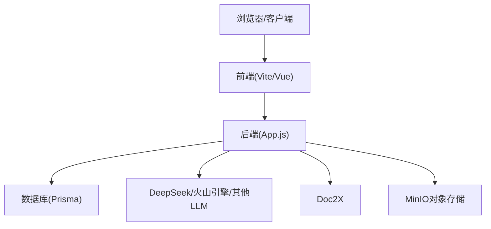
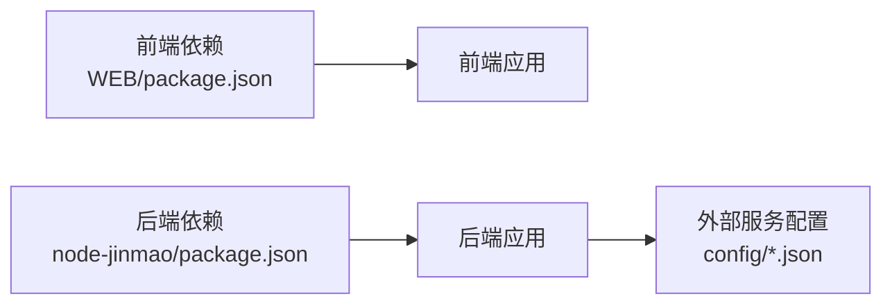

# 环境配置

<cite>
**本文引用的文件**   
- [package.json](file://node-jinmao/package.json)
- [app.js](file://node-jinmao/app.js)
- [setup.sh](file://node-jinmao/setup.sh)
- [start.ps1](file://node-jinmao/start.ps1)
- [schema.prisma](file://node-jinmao/prisma/schema.prisma)
- [prisma.js](file://node-jinmao/utils/prisma.js)
- [deepseek_config.json](file://node-jinmao/config/deepseek_config.json)
- [minio_config.json](file://node-jinmao/config/minio_config.json)
- [volcengine_config.json](file://node-jinmao/config/volcengine_config.json)
- [doc2x_config.json](file://node-jinmao/config/doc2x_config.json)
- [grsai_config.json](file://node-jinmao/config/grsai_config.json)
- [vite.config.js](file://WEB/vite.config.js)
- [package.json](file://WEB/package.json)
- [.gitignore](file://node-jinmao/.gitignore)
- [WSL部署指南.md](file://WSL部署指南.md)
- [宝塔部署指南.md](file://宝塔部署指南.md)
</cite>

## 目录
1. [简介](#简介)
2. [项目结构](#项目结构)
3. [核心组件](#核心组件)
4. [架构总览](#架构总览)
5. [详细组件分析](#详细组件分析)
6. [依赖分析](#依赖分析)
7. [性能考虑](#性能考虑)
8. [故障排查指南](#故障排查指南)
9. [结论](#结论)
10. [附录](#附录)

## 简介
本环境配置文档面向“金毛教你学重构版”项目的开发与本地运行，覆盖以下目标：
- Node.js 版本与包管理器（npm/yarn）要求与安装指引
- 数据库安装与初始化（Prisma + SQLite/MySQL）
- IDE 推荐配置（VS Code 插件、调试器、代码片段）
- 环境变量与配置文件（数据库连接、第三方 API 密钥、MinIO 存储等）
- Docker 容器化部署说明（如适用）
- 不同操作系统差异处理（Windows/WSL/macOS/Linux）
- 常见环境问题排查与解决方案

本项目包含前端（WEB）与后端（node-jinmao）两个子工程，后端使用 Prisma 管理数据库迁移与模型，并通过多个外部服务（DeepSeek、火山引擎、Doc2X、MinIO 等）提供能力。

## 项目结构
- 前端工程位于 WEB 目录，基于 Vite + Vue，开发服务器与构建脚本由 Vite 驱动。
- 后端工程位于 node-jinmao 目录，Express 风格路由与服务，Prisma 数据层，外部服务通过 JSON 配置加载。
- 根目录包含跨平台启动脚本与部署指南（WSL、宝塔）。

图表来源
- [package.json](file://WEB/package.json)
- [vite.config.js](file://WEB/vite.config.js)
- [package.json](file://node-jinmao/package.json)
- [app.js](file://node-jinmao/app.js)
- [schema.prisma](file://node-jinmao/prisma/schema.prisma)
- [prisma.js](file://node-jinmao/utils/prisma.js)
- [deepseek_config.json](file://node-jinmao/config/deepseek_config.json)
- [minio_config.json](file://node-jinmao/config/minio_config.json)
- [volcengine_config.json](file://node-jinmao/config/volcengine_config.json)
- [doc2x_config.json](file://node-jinmao/config/doc2x_config.json)
- [grsai_config.json](file://node-jinmao/config/grsai_config.json)

章节来源
- [package.json](file://WEB/package.json)
- [vite.config.js](file://WEB/vite.config.js)
- [package.json](file://node-jinmao/package.json)
- [app.js](file://node-jinmao/app.js)
- [setup.sh](file://node-jinmao/setup.sh)
- [start.ps1](file://node-jinmao/start.ps1)
- [schema.prisma](file://node-jinmao/prisma/schema.prisma)
- [prisma.js](file://node-jinmao/utils/prisma.js)

## 核心组件
- 前端（WEB）
  - 构建工具：Vite（入口配置见 vite.config.js）
  - 包管理：npm/yarn（依赖定义见 package.json）
- 后端（node-jinmao）
  - 运行时：Node.js（依赖定义见 package.json）
  - 应用入口：app.js
  - 数据库：Prisma 模型与迁移（schema.prisma），运行时初始化（utils/prisma.js）
  - 外部服务配置：config/*.json（DeepSeek、MinIO、火山引擎、Doc2X、GrsAI 等）
  - 初始化脚本：setup.sh（Linux/macOS）、start.ps1（Windows）

章节来源
- [package.json](file://WEB/package.json)
- [vite.config.js](file://WEB/vite.config.js)
- [package.json](file://node-jinmao/package.json)
- [app.js](file://node-jinmao/app.js)
- [schema.prisma](file://node-jinmao/prisma/schema.prisma)
- [prisma.js](file://node-jinmao/utils/prisma.js)
- [setup.sh](file://node-jinmao/setup.sh)
- [start.ps1](file://node-jinmao/start.ps1)

## 架构总览
整体采用前后端分离架构：
- 前端通过 Vite 提供开发服务器与静态资源构建
- 后端暴露 REST API，统一鉴权中间件与业务路由
- 数据持久化由 Prisma 抽象，底层支持 SQLite/MySQL 等
- 外部能力通过 HTTP 调用第三方服务（LLM、TTS、OCR、对象存储等）

图表来源
- [app.js](file://node-jinmao/app.js)
- [schema.prisma](file://node-jinmao/prisma/schema.prisma)
- [deepseek_config.json](file://node-jinmao/config/deepseek_config.json)
- [volcengine_config.json](file://node-jinmao/config/volcengine_config.json)
- [doc2x_config.json](file://node-jinmao/config/doc2x_config.json)
- [minio_config.json](file://node-jinmao/config/minio_config.json)

## 详细组件分析

### 前端环境搭建（WEB）
- Node.js 版本要求
  - 建议与仓库中 package.json 的 engines 字段保持一致（若存在）；若无，建议使用 LTS 版本（如 18.x/20.x）
- 包管理器
  - npm：默认随 Node.js 安装
  - yarn：可选，需全局安装后使用
- 安装与启动
  - 进入 WEB 目录执行依赖安装
  - 使用 Vite 启动开发服务器或构建产物
- 代理与端口
  - 在 vite.config.js 中可配置开发代理与端口，确保与后端地址一致

章节来源
- [package.json](file://WEB/package.json)
- [vite.config.js](file://WEB/vite.config.js)

### 后端环境搭建（node-jinmao）
- Node.js 版本要求
  - 参考 package.json 中的 engines 字段（若存在）；推荐使用 LTS 版本
- 依赖安装
  - 使用 npm 或 yarn 安装依赖
- 数据库准备
  - 使用 Prisma 管理模型与迁移，先执行迁移命令生成/更新数据库
  - 根据 schema.prisma 选择 SQLite 或 MySQL 等驱动
- 启动服务
  - Windows：使用 start.ps1
  - Linux/macOS：使用 setup.sh（或按脚本提示执行）
- 外部服务配置
  - config/*.json 中填写各服务的访问信息（详见下文“环境变量与配置文件”）

章节来源
- [package.json](file://node-jinmao/package.json)
- [schema.prisma](file://node-jinmao/prisma/schema.prisma)
- [setup.sh](file://node-jinmao/setup.sh)
- [start.ps1](file://node-jinmao/start.ps1)

### 数据库与 Prisma
- 模型与迁移
  - schema.prisma 定义数据模型与关系
  - 首次运行需执行迁移以创建表结构
- 运行时连接
  - utils/prisma.js 负责连接与实例化
- 常见操作
  - 生成客户端、执行迁移、回滚、查看状态等

章节来源
- [schema.prisma](file://node-jinmao/prisma/schema.prisma)
- [prisma.js](file://node-jinmao/utils/prisma.js)

### 外部服务配置（API 密钥与存储）
- DeepSeek（大模型）
  - 配置项位于 config/deepseek_config.json
- 火山引擎（语音/图像等）
  - 配置项位于 config/volcengine_config.json
- Doc2X（文档解析）
  - 配置项位于 config/doc2x_config.json
- GrsAI（其他能力）
  - 配置项位于 config/grsai_config.json
- MinIO（对象存储）
  - 配置项位于 config/minio_config.json

章节来源
- [deepseek_config.json](file://node-jinmao/config/deepseek_config.json)
- [volcengine_config.json](file://node-jinmao/config/volcengine_config.json)
- [doc2x_config.json](file://node-jinmao/config/doc2x_config.json)
- [grsai_config.json](file://node-jinmao/config/grsai_config.json)
- [minio_config.json](file://node-jinmao/config/minio_config.json)

### 环境变量与配置文件
- 环境变量
  - 建议在项目根目录创建 .env 文件（不提交到版本库，参见 .gitignore）
  - 常用变量包括：数据库连接串、JWT 密钥、第三方 API Key、MinIO 端点与凭据等
- 配置文件
  - 将敏感信息放入 config/*.json，并在后端启动前确保路径正确
- 读取策略
  - 后端可通过 process.env 读取环境变量，或通过 JSON 配置加载

章节来源
- [.gitignore](file://node-jinmao/.gitignore)
- [app.js](file://node-jinmao/app.js)

### IDE 推荐配置（VS Code）
- 插件推荐
  - ESLint、Prettier、Vue 官方扩展、DotENV、Prisma VSCode Extension
- 调试器设置
  - 为 Node.js 添加 launch 配置，指向后端入口 app.js
  - 前端可使用 Chrome DevTools 或 VS Code 内置调试
- 代码片段
  - 为常用模板（路由、控制器、Prisma 查询）添加 snippets 提升效率

[本节为通用指导，不直接分析具体文件]

### Docker 容器化部署（如适用）
- 镜像构建
  - 分别构建前端与后端镜像，或使用多阶段构建优化体积
- 服务编排
  - 使用 docker-compose 编排后端、数据库与对象存储（MinIO）
- 环境变量注入
  - 通过 compose 的 environment 或 .env 文件注入敏感配置
- 卷挂载
  - 将数据库文件、上传目录挂载至宿主机持久化

[本节为通用指导，不直接分析具体文件]

### 跨操作系统差异处理
- Windows
  - 使用 PowerShell 脚本 start.ps1 进行初始化与启动
  - 注意路径分隔符与权限问题
- WSL（Ubuntu）
  - 参考 WSL 部署指南，确保 Node.js、Prisma CLI 可用
- macOS/Linux
  - 使用 setup.sh 脚本进行初始化与启动
  - 注意 shell 权限与可执行位

章节来源
- [start.ps1](file://node-jinmao/start.ps1)
- [setup.sh](file://node-jinmao/setup.sh)
- [WSL部署指南.md](file://WSL部署指南.md)

## 依赖分析
- 前端依赖
  - 由 WEB/package.json 管理，包含框架、构建工具与运行时依赖
- 后端依赖
  - 由 node-jinmao/package.json 管理，包含 Web 框架、Prisma、HTTP 客户端、工具库等
- 外部依赖
  - 通过 config/*.json 注入第三方服务参数，避免硬编码

图表来源
- [package.json](file://WEB/package.json)
- [package.json](file://node-jinmao/package.json)
- [deepseek_config.json](file://node-jinmao/config/deepseek_config.json)
- [minio_config.json](file://node-jinmao/config/minio_config.json)
- [volcengine_config.json](file://node-jinmao/config/volcengine_config.json)
- [doc2x_config.json](file://node-jinmao/config/doc2x_config.json)
- [grsai_config.json](file://node-jinmao/config/grsai_config.json)

章节来源
- [package.json](file://WEB/package.json)
- [package.json](file://node-jinmao/package.json)

## 性能考虑
- 前端
  - 合理使用懒加载与代码分割，减少首屏体积
  - 开启 Vite 生产构建优化（压缩、Tree-shaking）
- 后端
  - 数据库连接池与慢查询优化
  - 外部 API 调用增加超时与重试策略
  - 静态资源与缓存策略（CDN、ETag）
- 存储
  - MinIO 分片上传与并发控制
  - 合理划分桶与目录，避免单目录过大

[本节为通用指导，不直接分析具体文件]

## 故障排查指南
- Node.js 版本不匹配
  - 检查 package.json 的 engines 字段，使用 nvm 切换版本
- 依赖安装失败
  - 清理 node_modules 与锁文件后重试，检查网络代理
- 数据库迁移失败
  - 确认数据库连接串与权限，检查 schema.prisma 与迁移历史
- 外部服务调用失败
  - 校验 config/*.json 中的密钥与端点，检查网络连通性与限流
- 端口冲突
  - 修改 vite.config.js 或后端监听端口，避免占用
- 权限问题（Linux/macOS）
  - 确保脚本可执行位，检查文件读写权限

章节来源
- [package.json](file://node-jinmao/package.json)
- [schema.prisma](file://node-jinmao/prisma/schema.prisma)
- [deepseek_config.json](file://node-jinmao/config/deepseek_config.json)
- [minio_config.json](file://node-jinmao/config/minio_config.json)
- [vite.config.js](file://WEB/vite.config.js)

## 结论
按照本指南完成 Node.js、包管理器、数据库与外部服务的配置后，即可在本地顺利运行前后端服务。建议将敏感配置纳入环境变量或受控配置文件，并结合 IDE 与调试器提升开发效率。遇到常见问题时，优先检查版本、依赖、连接串与权限。

[本节为总结性内容，不直接分析具体文件]

## 附录
- 部署参考
  - WSL 部署指南：WSL部署指南.md
  - 宝塔部署指南：宝塔部署指南.md

章节来源
- [WSL部署指南.md](file://WSL部署指南.md)
- [宝塔部署指南.md](file://宝塔部署指南.md)