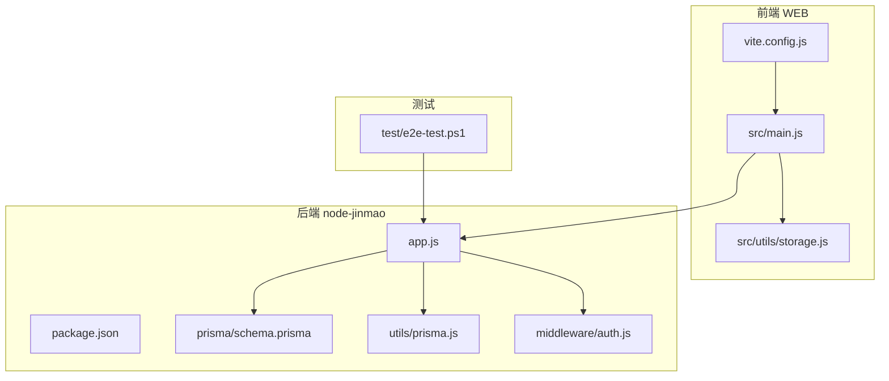
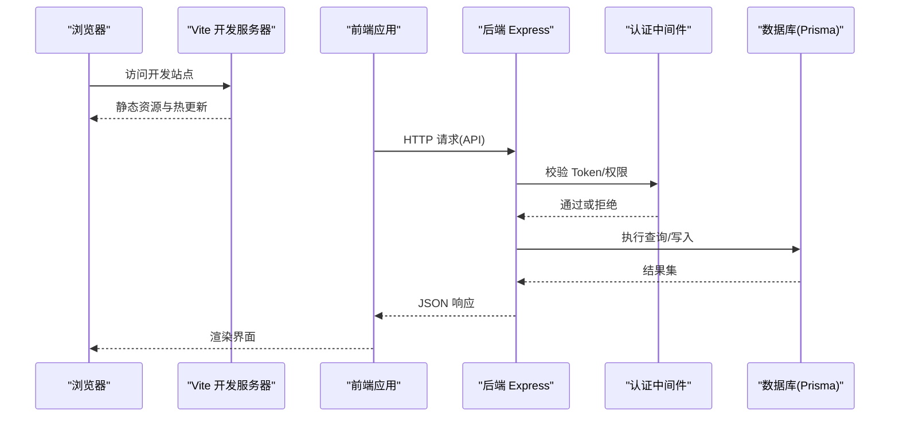
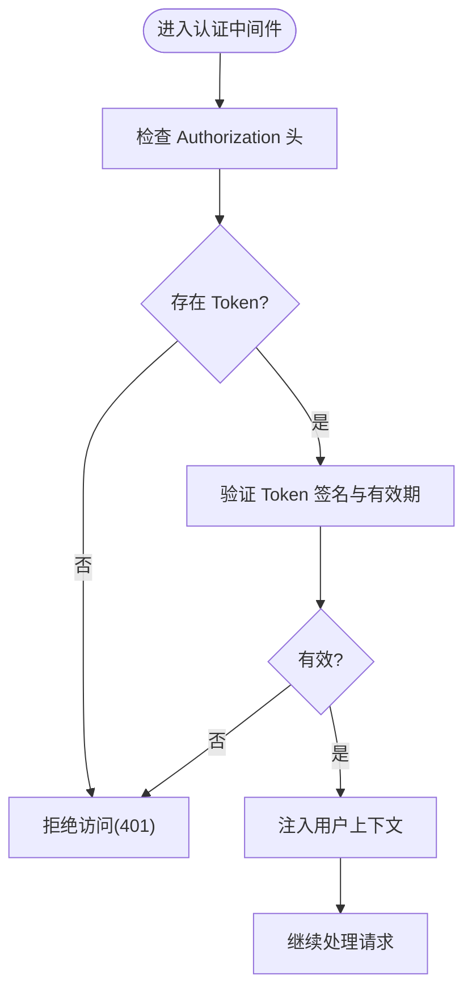
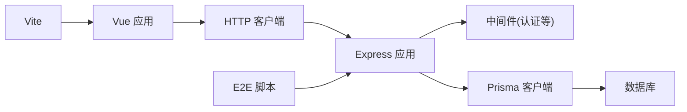

# 调试指南

<cite>
**本文引用的文件**   
- [app.js](file://node-jinmao/app.js)
- [package.json](file://node-jinmao/package.json)
- [schema.prisma](file://node-jinmao/prisma/schema.prisma)
- [prisma.js](file://node-jinmao/utils/prisma.js)
- [auth.js](file://node-jinmao/middleware/auth.js)
- [vite.config.js](file://WEB/vite.config.js)
- [main.js](file://WEB/src/main.js)
- [storage.js](file://WEB/src/utils/storage.js)
- [e2e-test.ps1](file://test/e2e-test.ps1)
</cite>

## 目录
1. [简介](#简介)
2. [项目结构](#项目结构)
3. [核心组件](#核心组件)
4. [架构总览](#架构总览)
5. [详细组件分析](#详细组件分析)
6. [依赖分析](#依赖分析)
7. [性能考虑](#性能考虑)
8. [故障排查指南](#故障排查指南)
9. [结论](#结论)
10. [附录](#附录)

## 简介
本调试指南面向“金毛教你学重构版”前后端一体化项目，覆盖前端、后端、数据库与测试的完整调试方法。内容包括：
- 前端调试：浏览器开发者工具、Vue DevTools、网络请求调试、性能分析
- 后端调试：Node.js 调试器、日志规范、错误追踪
- 数据库调试：Prisma Studio、SQL 优化、慢查询分析
- 集成与端到端测试：Mock 数据、测试环境搭建、常见问题定位
- 常见调试场景与性能优化技巧

## 项目结构
本项目采用前后端分离结构：
- WEB：前端（Vite + Vue），包含页面、组件、API 调用、主题与存储工具
- node-jinmao：后端（Express/Node.js），包含路由、中间件、服务层、工具库、Prisma 配置与迁移
- test：端到端测试脚本与示例数据

**图表来源** 
- [vite.config.js](file://WEB/vite.config.js)
- [main.js](file://WEB/src/main.js)
- [storage.js](file://WEB/src/utils/storage.js)
- [app.js](file://node-jinmao/app.js)
- [package.json](file://node-jinmao/package.json)
- [schema.prisma](file://node-jinmao/prisma/schema.prisma)
- [prisma.js](file://node-jinmao/utils/prisma.js)
- [auth.js](file://node-jinmao/middleware/auth.js)
- [e2e-test.ps1](file://test/e2e-test.ps1)

**章节来源**
- [vite.config.js](file://WEB/vite.config.js)
- [main.js](file://WEB/src/main.js)
- [app.js](file://node-jinmao/app.js)
- [package.json](file://node-jinmao/package.json)
- [schema.prisma](file://node-jinmao/prisma/schema.prisma)
- [prisma.js](file://node-jinmao/utils/prisma.js)
- [auth.js](file://node-jinmao/middleware/auth.js)
- [e2e-test.ps1](file://test/e2e-test.ps1)

## 核心组件
- 前端入口与构建配置：Vite 开发服务器、代理与插件配置，影响本地联调与跨域行为
- 后端主应用：Express 应用初始化、中间件挂载、路由注册、错误处理
- Prisma 数据层：数据库连接、Schema 定义、迁移与客户端封装
- 认证中间件：鉴权流程、Token 校验与错误返回
- 端到端测试：PowerShell 脚本驱动自动化测试流程

**章节来源**
- [vite.config.js](file://WEB/vite.config.js)
- [main.js](file://WEB/src/main.js)
- [app.js](file://node-jinmao/app.js)
- [schema.prisma](file://node-jinmao/prisma/schema.prisma)
- [prisma.js](file://node-jinmao/utils/prisma.js)
- [auth.js](file://node-jinmao/middleware/auth.js)
- [e2e-test.ps1](file://test/e2e-test.ps1)

## 架构总览
下图展示从浏览器到后端 API 再到数据库的关键交互路径，以及调试切入点。

**图表来源** 
- [vite.config.js](file://WEB/vite.config.js)
- [main.js](file://WEB/src/main.js)
- [app.js](file://node-jinmao/app.js)
- [auth.js](file://node-jinmao/middleware/auth.js)
- [schema.prisma](file://node-jinmao/prisma/schema.prisma)
- [prisma.js](file://node-jinmao/utils/prisma.js)

## 详细组件分析

### 前端调试要点
- 浏览器开发者工具
  - Network：查看请求 URL、状态码、请求头/响应体、缓存策略；过滤 XHR/Fetch；录制回放
  - Sources：设置断点、单步执行、查看调用栈与作用域变量
  - Performance：录制性能面板，识别长任务、重排重绘、内存增长
  - Application：检查 LocalStorage/SessionStorage、Cookies、Service Worker
- Vue DevTools
  - 安装并启用 Vue 扩展，查看组件树、Props/State、事件触发顺序
  - 在 Components 面板中实时修改状态验证 UI 表现
- 网络请求调试
  - 使用 Vite 代理将 /api 转发至后端，避免跨域问题
  - 在浏览器拦截响应进行 Mock，快速验证前端逻辑
- 性能分析
  - 使用 Performance 面板定位瓶颈函数与渲染热点
  - 结合 Lighthouse 评估加载与可访问性指标

**章节来源**
- [vite.config.js](file://WEB/vite.config.js)
- [main.js](file://WEB/src/main.js)
- [storage.js](file://WEB/src/utils/storage.js)

### 后端调试要点
- Node.js 调试器
  - 使用 --inspect 启动应用，Chrome DevTools 或 VS Code 附加调试
  - 设置断点于路由处理器、中间件与服务层，逐步排查
- 日志记录规范
  - 统一日志格式：时间戳、级别、模块、消息、上下文（如 userId、requestId）
  - 区分 info/warn/error，避免在生产打印敏感信息
  - 结构化日志便于聚合与分析
- 错误追踪
  - 捕获未处理异常与 Promise 拒绝，输出堆栈与上下文
  - 对第三方 API 调用增加超时与重试策略，记录失败原因

**章节来源**
- [app.js](file://node-jinmao/app.js)
- [package.json](file://node-jinmao/package.json)

### 数据库调试要点
- Prisma Studio
  - 启动可视化界面，浏览表数据、编辑记录、执行简单查询
  - 用于快速验证 Schema 变更与数据一致性
- SQL 查询优化
  - 使用 EXPLAIN 分析执行计划，关注全表扫描与索引缺失
  - 合理设计索引、避免 N+1 查询，使用分页与字段裁剪
- 慢查询分析
  - 开启慢查询日志，定位耗时高的语句
  - 结合业务场景优化 JOIN 与子查询，必要时引入缓存

**章节来源**
- [schema.prisma](file://node-jinmao/prisma/schema.prisma)
- [prisma.js](file://node-jinmao/utils/prisma.js)

### 认证中间件调试
- 登录流程
  - 校验用户名/密码或 OTP，生成 Token 并返回
  - 在后续请求中携带 Authorization 头
- 鉴权流程
  - 解析 Token，校验有效期与签名
  - 根据角色/权限决定放行或拒绝
- 常见错误
  - Token 过期、签名无效、缺少必要字段
  - 记录失败原因与来源 IP，便于审计

**图表来源** 
- [auth.js](file://node-jinmao/middleware/auth.js)

**章节来源**
- [auth.js](file://node-jinmao/middleware/auth.js)

### 端到端测试调试
- 测试脚本
  - PowerShell 脚本驱动浏览器或 API 调用，模拟用户操作
  - 支持批量用例执行与结果汇总
- 调试技巧
  - 在关键步骤插入等待与断言，确保稳定性
  - 使用环境变量切换测试数据与后端地址
  - 录制视频或截图辅助定位问题

**章节来源**
- [e2e-test.ps1](file://test/e2e-test.ps1)

## 依赖分析
- 前端依赖
  - Vite 作为开发与构建工具，提供热更新与代理能力
  - Vue 生态组件与状态管理，配合 DevTools 提升调试效率
- 后端依赖
  - Express 框架与中间件体系，承载路由与鉴权
  - Prisma ORM 与数据库驱动，简化数据访问与迁移
- 测试依赖
  - PowerShell 脚本与可选的浏览器/HTTP 客户端，支撑 E2E 流程

**图表来源** 
- [vite.config.js](file://WEB/vite.config.js)
- [main.js](file://WEB/src/main.js)
- [app.js](file://node-jinmao/app.js)
- [schema.prisma](file://node-jinmao/prisma/schema.prisma)
- [prisma.js](file://node-jinmao/utils/prisma.js)
- [e2e-test.ps1](file://test/e2e-test.ps1)

**章节来源**
- [package.json](file://node-jinmao/package.json)
- [vite.config.js](file://WEB/vite.config.js)

## 性能考虑
- 前端性能
  - 减少不必要的重渲染，合理使用计算属性与懒加载
  - 利用浏览器缓存与 CDN，压缩资源与图片
  - 使用 Performance 面板定位长任务与内存泄漏
- 后端性能
  - 接口幂等与缓存策略，降低重复计算与 IO 压力
  - 异步处理与队列化，避免阻塞主线程
  - 数据库查询优化，合理使用索引与分页
- 监控与度量
  - 埋点关键路径耗时，建立告警阈值
  - 定期复盘慢接口与热点代码，持续优化

[本节为通用指导，不直接分析具体文件]

## 故障排查指南
- 前端常见问题
  - 跨域失败：检查 Vite 代理配置与后端 CORS
  - 状态不同步：使用 Vue DevTools 检查 Store 与 Props
  - 资源加载失败：Network 面板查看 404/5xx，确认路径与权限
- 后端常见问题
  - 端口占用：检查进程占用与防火墙规则
  - 数据库连接失败：核对连接串、权限与迁移状态
  - 认证失败：检查 Token 生成与校验逻辑，查看日志上下文
- 数据库常见问题
  - 迁移冲突：回滚或重新应用迁移，核对 schema 版本
  - 慢查询：EXPLAIN 分析，补充索引或改写 SQL
  - 死锁与锁竞争：缩短事务，拆分大事务
- 测试环境问题
  - 环境变量不一致：统一 .env 与 CI 配置
  - Mock 数据缺失：准备种子数据与固定用例
  - 浏览器/驱动版本差异：锁定版本并记录

**章节来源**
- [vite.config.js](file://WEB/vite.config.js)
- [app.js](file://node-jinmao/app.js)
- [schema.prisma](file://node-jinmao/prisma/schema.prisma)
- [prisma.js](file://node-jinmao/utils/prisma.js)
- [auth.js](file://node-jinmao/middleware/auth.js)
- [e2e-test.ps1](file://test/e2e-test.ps1)

## 结论
通过系统化的前端、后端、数据库与测试调试方法，可以快速定位并解决大多数问题。建议团队建立统一的调试规范与工具链，配合日志与监控，持续提升交付质量与稳定性。

[本节为总结性内容，不直接分析具体文件]

## 附录
- 常用命令与快捷键
  - 浏览器：F12 打开开发者工具，Ctrl+Shift+C 选择元素
  - Vue DevTools：在组件面板中搜索与过滤组件
  - Node.js：--inspect 启动调试，VS Code 添加 launch 配置
  - Prisma：npx prisma studio 启动可视化，npx prisma migrate dev 应用迁移
- 参考文档
  - Vite 官方文档：代理、插件与构建优化
  - Vue DevTools：组件调试与状态检查
  - Chrome Performance：性能面板使用指南
  - Prisma 文档：Schema、迁移与 Studio

[本节为参考资料，不直接分析具体文件]