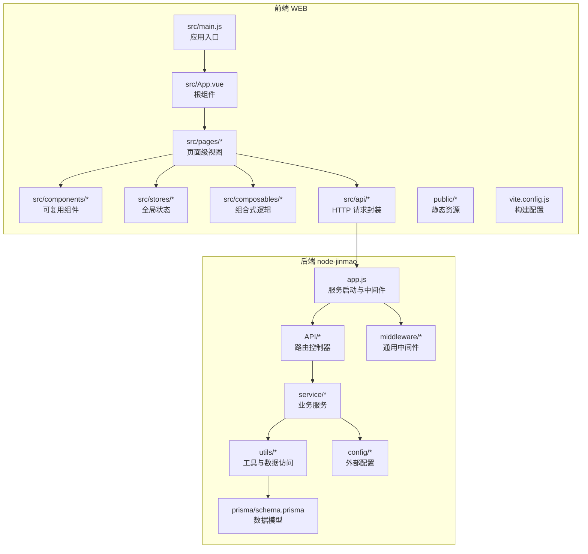
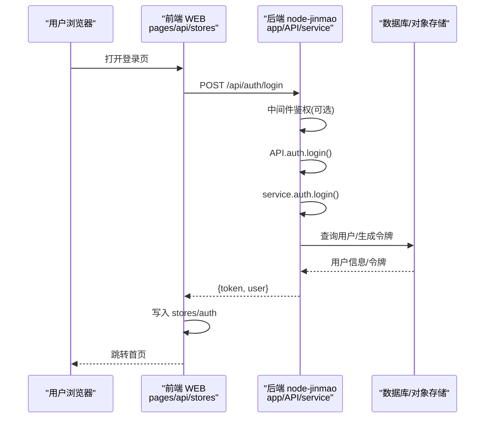
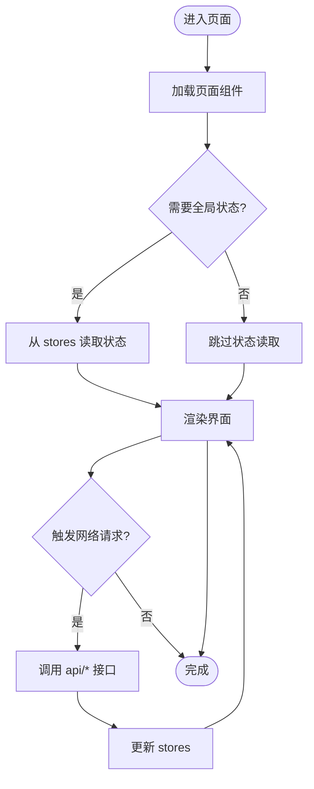
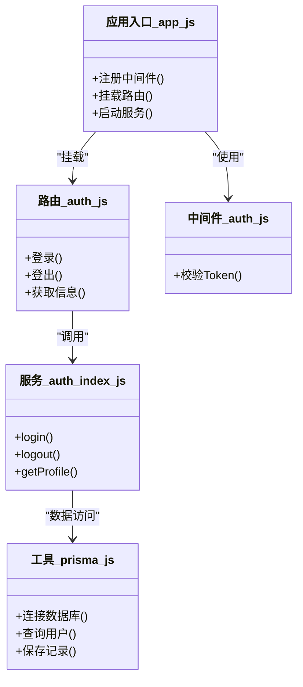
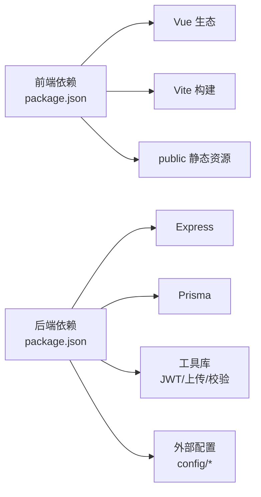

# 项目结构

<cite>
**本文引用的文件**   
- [WEB/package.json](file://WEB/package.json)
- [WEB/vite.config.js](file://WEB/vite.config.js)
- [WEB/src/main.js](file://WEB/src/main.js)
- [WEB/src/App.vue](file://WEB/src/App.vue)
- [WEB/src/api/auth.js](file://WEB/src/api/auth.js)
- [WEB/src/components/CourseCard.vue](file://WEB/src/components/CourseCard.vue)
- [WEB/src/composables/useTheme.js](file://WEB/src/composables/useTheme.js)
- [WEB/src/stores/auth.js](file://WEB/src/stores/auth.js)
- [WEB/src/pages/login/index.vue](file://WEB/src/pages/login/index.vue)
- [node-jinmao/app.js](file://node-jinmao/app.js)
- [node-jinmao/package.json](file://node-jinmao/package.json)
- [node-jinmao/middleware/auth.js](file://node-jinmao/middleware/auth.js)
- [node-jinmao/API/auth.js](file://node-jinmao/API/auth.js)
- [node-jinmao/service/auth/index.js](file://node-jinmao/service/auth/index.js)
- [node-jinmao/utils/prisma.js](file://node-jinmao/utils/prisma.js)
- [node-jinmao/config/deepseek_config.json](file://node-jinmao/config/deepseek_config.json)
</cite>

## 目录
1. [简介](#简介)
2. [项目结构](#项目结构)
3. [核心组件](#核心组件)
4. [架构总览](#架构总览)
5. [详细组件分析](#详细组件分析)
6. [依赖分析](#依赖分析)
7. [性能考虑](#性能考虑)
8. [故障排查指南](#故障排查指南)
9. [结论](#结论)
10. [附录](#附录)

## 简介
本文件面向“金毛教你学重构版”的前后端分离架构，系统性梳理 WEB 前端（Vue 3 + Vite）与 node-jinmao 后端（Express + Prisma）的目录组织、职责划分与交互方式。文档同时给出配置管理策略、静态资源组织规范、第三方库引入约定，以及新增模块的最佳实践与扩展设计原则，帮助开发者快速理解并高效扩展项目。

## 项目结构
整体采用前后端分离：
- WEB：基于 Vue 3 + Vite 的单页应用，按功能域与职责分层组织源码。
- node-jinmao：基于 Express 的后端服务，采用类 MVC 的分层结构（API 路由 → 服务层 → 数据访问/工具层），配合 Prisma 进行数据库操作。

图表来源
- [WEB/src/main.js:1-50](file://WEB/src/main.js#L1-L50)
- [WEB/src/App.vue:1-50](file://WEB/src/App.vue#L1-L50)
- [WEB/vite.config.js:1-50](file://WEB/vite.config.js#L1-L50)
- [node-jinmao/app.js:1-50](file://node-jinmao/app.js#L1-L50)
- [node-jinmao/API/auth.js:1-50](file://node-jinmao/API/auth.js#L1-L50)
- [node-jinmao/service/auth/index.js:1-50](file://node-jinmao/service/auth/index.js#L1-L50)
- [node-jinmao/utils/prisma.js:1-50](file://node-jinmao/utils/prisma.js#L1-L50)
- [node-jinmao/config/deepseek_config.json:1-50](file://node-jinmao/config/deepseek_config.json#L1-L50)

章节来源
- [WEB/package.json:1-50](file://WEB/package.json#L1-L50)
- [WEB/vite.config.js:1-50](file://WEB/vite.config.js#L1-L50)
- [node-jinmao/package.json:1-50](file://node-jinmao/package.json#L1-L50)
- [node-jinmao/app.js:1-50](file://node-jinmao/app.js#L1-L50)

## 核心组件
- 前端入口与根组件
  - main.js：初始化 Vue 应用、挂载插件与样式、注册全局能力。
  - App.vue：顶层布局与路由容器，承载全局主题与基础 UI。
- 页面与组件
  - pages：按路由划分的页面级视图，聚焦用户流程与页面状态。
  - components：跨页面复用的 UI 组件，保持无副作用与纯展示为主。
- 状态与逻辑
  - stores：集中式状态（如认证态），提供读写方法与持久化策略。
  - composables：可复用的组合式函数（如主题切换、窗口尺寸监听）。
- API 层
  - api：统一封装 HTTP 请求、错误处理与鉴权头注入。
- 后端服务
  - app.js：Express 应用装配、中间件注册、端口与静态资源托管。
  - middleware：通用中间件（如鉴权校验）。
  - API：路由控制器，负责参数校验、调用服务层、返回响应。
  - service：业务编排与领域逻辑，聚合工具与外部服务调用。
  - utils：数据访问与工具方法（Prisma 客户端、JWT、上传等）。
  - config：外部服务与提示词等配置项。

章节来源
- [WEB/src/main.js:1-50](file://WEB/src/main.js#L1-L50)
- [WEB/src/App.vue:1-50](file://WEB/src/App.vue#L1-L50)
- [WEB/src/stores/auth.js:1-50](file://WEB/src/stores/auth.js#L1-L50)
- [WEB/src/composables/useTheme.js:1-50](file://WEB/src/composables/useTheme.js#L1-L50)
- [WEB/src/api/auth.js:1-50](file://WEB/src/api/auth.js#L1-L50)
- [node-jinmao/app.js:1-50](file://node-jinmao/app.js#L1-L50)
- [node-jinmao/middleware/auth.js:1-50](file://node-jinmao/middleware/auth.js#L1-L50)
- [node-jinmao/API/auth.js:1-50](file://node-jinmao/API/auth.js#L1-L50)
- [node-jinmao/service/auth/index.js:1-50](file://node-jinmao/service/auth/index.js#L1-L50)
- [node-jinmao/utils/prisma.js:1-50](file://node-jinmao/utils/prisma.js#L1-L50)

## 架构总览
前后端通过 RESTful API 解耦，前端以模块化组织页面与状态，后端以 MVC 风格分层实现业务。

图表来源
- [WEB/src/pages/login/index.vue:1-50](file://WEB/src/pages/login/index.vue#L1-L50)
- [WEB/src/api/auth.js:1-50](file://WEB/src/api/auth.js#L1-L50)
- [WEB/src/stores/auth.js:1-50](file://WEB/src/stores/auth.js#L1-L50)
- [node-jinmao/app.js:1-50](file://node-jinmao/app.js#L1-L50)
- [node-jinmao/API/auth.js:1-50](file://node-jinmao/API/auth.js#L1-L50)
- [node-jinmao/service/auth/index.js:1-50](file://node-jinmao/service/auth/index.js#L1-L50)

## 详细组件分析

### 前端模块化设计（Vue 3 + Vite）
- 目录职责
  - src/pages：页面级视图，每个子目录对应一个路由页面，包含模板与脚本。
  - src/components：UI 组件，强调可复用性与低耦合。
  - src/stores：全局状态（如认证），提供状态读写与持久化。
  - src/composables：组合式函数，封装跨组件逻辑（主题、尺寸等）。
  - src/api：HTTP 请求封装，统一拦截器、错误处理与鉴权头。
  - public：静态资源（图标、字体等），由 Vite 直接暴露。
- 构建与开发
  - vite.config.js：定义代理、别名、插件与生产优化。
  - package.json：声明依赖、脚本命令与构建目标。

图表来源
- [WEB/src/pages/login/index.vue:1-50](file://WEB/src/pages/login/index.vue#L1-L50)
- [WEB/src/stores/auth.js:1-50](file://WEB/src/stores/auth.js#L1-L50)
- [WEB/src/api/auth.js:1-50](file://WEB/src/api/auth.js#L1-L50)
- [WEB/vite.config.js:1-50](file://WEB/vite.config.js#L1-L50)

章节来源
- [WEB/src/main.js:1-50](file://WEB/src/main.js#L1-L50)
- [WEB/src/App.vue:1-50](file://WEB/src/App.vue#L1-L50)
- [WEB/src/pages/login/index.vue:1-50](file://WEB/src/pages/login/index.vue#L1-L50)
- [WEB/src/components/CourseCard.vue:1-50](file://WEB/src/components/CourseCard.vue#L1-L50)
- [WEB/src/composables/useTheme.js:1-50](file://WEB/src/composables/useTheme.js#L1-L50)
- [WEB/src/stores/auth.js:1-50](file://WEB/src/stores/auth.js#L1-L50)
- [WEB/src/api/auth.js:1-50](file://WEB/src/api/auth.js#L1-L50)
- [WEB/vite.config.js:1-50](file://WEB/vite.config.js#L1-L50)

### 后端 MVC 架构（Express + Prisma）
- 路由层（API）
  - 按领域划分目录（如 auth、book、quiz），每个文件暴露路由处理器，负责参数校验、调用服务层、返回响应。
- 服务层（service）
  - 封装业务编排与领域逻辑，聚合工具与外部服务调用（如 LLM、MinIO、PDF 转换等）。
- 数据访问层（utils）
  - 封装 Prisma 客户端、JWT、上传、校验等通用能力，避免在 API 与服务层重复实现。
- 中间件（middleware）
  - 鉴权、日志、限流等横切关注点。
- 配置（config）
  - 外部服务密钥、提示词模板、定价策略等，便于环境隔离与热更新。

图表来源
- [node-jinmao/app.js:1-50](file://node-jinmao/app.js#L1-L50)
- [node-jinmao/API/auth.js:1-50](file://node-jinmao/API/auth.js#L1-L50)
- [node-jinmao/service/auth/index.js:1-50](file://node-jinmao/service/auth/index.js#L1-L50)
- [node-jinmao/utils/prisma.js:1-50](file://node-jinmao/utils/prisma.js#L1-L50)
- [node-jinmao/middleware/auth.js:1-50](file://node-jinmao/middleware/auth.js#L1-L50)

章节来源
- [node-jinmao/app.js:1-50](file://node-jinmao/app.js#L1-L50)
- [node-jinmao/API/auth.js:1-50](file://node-jinmao/API/auth.js#L1-L50)
- [node-jinmao/service/auth/index.js:1-50](file://node-jinmao/service/auth/index.js#L1-L50)
- [node-jinmao/utils/prisma.js:1-50](file://node-jinmao/utils/prisma.js#L1-L50)
- [node-jinmao/middleware/auth.js:1-50](file://node-jinmao/middleware/auth.js#L1-L50)

### 配置管理与静态资源组织
- 前端配置
  - vite.config.js：代理后端接口、路径别名、构建优化。
  - package.json：依赖与脚本管理。
  - public：静态资源（图片、字体等），按需引用。
- 后端配置
  - config/*：外部服务配置（如 deepseek_config.json）、提示词模板、定价策略等。
  - prisma/schema.prisma：数据模型与迁移管理。
  - .env/.migration_version/.schema_hash：版本与环境控制。

章节来源
- [WEB/vite.config.js:1-50](file://WEB/vite.config.js#L1-L50)
- [WEB/package.json:1-50](file://WEB/package.json#L1-L50)
- [node-jinmao/config/deepseek_config.json:1-50](file://node-jinmao/config/deepseek_config.json#L1-L50)
- [node-jinmao/package.json:1-50](file://node-jinmao/package.json#L1-L50)

### 第三方库引入规范
- 前端
  - 优先在 package.json 中声明依赖，通过 Vite 按需引入；避免全局污染。
  - 公共工具函数放入 utils 或 composables，组件样式尽量局部化。
- 后端
  - 在 package.json 声明依赖，按模块拆分导入；敏感配置放 config 或环境变量。
  - 对外部服务（LLM、对象存储）封装为独立模块，便于替换与测试。

章节来源
- [WEB/package.json:1-50](file://WEB/package.json#L1-L50)
- [node-jinmao/package.json:1-50](file://node-jinmao/package.json#L1-L50)

## 依赖分析
- 前端依赖
  - Vue 生态（Vue 3、Vite、Router、Pinia/Vuex 等）与业务库（HTTP、UI 框架）。
  - 构建产物通过 Vite 打包，静态资源由 public 目录提供。
- 后端依赖
  - Express、Prisma、JWT、文件上传、外部 LLM/对象存储 SDK。
  - 中间件与工具模块被 API 与服务层复用。

图表来源
- [WEB/package.json:1-50](file://WEB/package.json#L1-L50)
- [node-jinmao/package.json:1-50](file://node-jinmao/package.json#L1-L50)

章节来源
- [WEB/package.json:1-50](file://WEB/package.json#L1-L50)
- [node-jinmao/package.json:1-50](file://node-jinmao/package.json#L1-L50)

## 性能考虑
- 前端
  - 使用 Vite 按需加载与代码分割，减少首屏体积。
  - 组件懒加载与路由级分包，避免一次性加载全部页面。
  - 图片与字体等资源压缩与缓存策略。
- 后端
  - 数据库查询优化（索引、分页、字段投影）。
  - 外部服务调用异步化与重试机制，避免阻塞主线程。
  - 静态资源与中间件缓存策略，降低重复计算。

[本节为通用指导，不直接分析具体文件]

## 故障排查指南
- 前端常见问题
  - 接口跨域：检查 vite.config.js 代理配置与后端 CORS。
  - 状态异常：查看 stores 初始化与持久化逻辑。
  - 组件未渲染：确认路由与组件路径是否正确。
- 后端常见问题
  - 鉴权失败：检查 middleware 与 JWT 配置。
  - 数据库连接失败：核对 Prisma 连接字符串与迁移状态。
  - 外部服务超时：查看 config 配置与重试策略。

章节来源
- [WEB/vite.config.js:1-50](file://WEB/vite.config.js#L1-L50)
- [WEB/src/stores/auth.js:1-50](file://WEB/src/stores/auth.js#L1-L50)
- [node-jinmao/middleware/auth.js:1-50](file://node-jinmao/middleware/auth.js#L1-L50)
- [node-jinmao/utils/prisma.js:1-50](file://node-jinmao/utils/prisma.js#L1-L50)
- [node-jinmao/config/deepseek_config.json:1-50](file://node-jinmao/config/deepseek_config.json#L1-L50)

## 结论
本项目采用清晰的前后端分离与模块化设计：前端以 Vue 3 + Vite 为核心，按页面、组件、状态与组合式逻辑分层；后端以 Express + Prisma 为基础，遵循 API → service → utils 的分层模式。通过统一的配置管理与静态资源组织，结合规范的第三方库引入策略，项目具备良好的可扩展性与可维护性。建议新增模块时遵循现有目录结构与职责边界，确保高内聚、低耦合。

[本节为总结性内容，不直接分析具体文件]

## 附录
- 新增模块最佳实践
  - 前端
    - 新增页面：在 src/pages 下创建目录与 index.vue，并在路由中注册。
    - 新增组件：放入 src/components，保持单一职责与可复用性。
    - 新增状态：在 src/stores 中定义，并在页面中订阅与更新。
    - 新增逻辑：封装为 composables，供多组件复用。
    - 新增接口：在 src/api 中定义，统一错误处理与鉴权头注入。
  - 后端
    - 新增路由：在 API 下按领域创建文件，注册到 app.js。
    - 新增服务：在 service 下实现业务逻辑，避免在 API 中写复杂逻辑。
    - 新增工具：在 utils 中封装通用能力，保持 API 与服务层简洁。
    - 新增配置：放入 config，并通过环境变量区分环境。
- 扩展设计原则
  - 单一职责与高内聚：每个模块只负责一个领域。
  - 低耦合与可替换：通过接口与抽象隔离变化。
  - 可观测与可测试：增加日志、指标与单元测试覆盖。
  - 安全与合规：输入校验、权限控制、敏感信息保护。

[本节为通用指导，不直接分析具体文件]