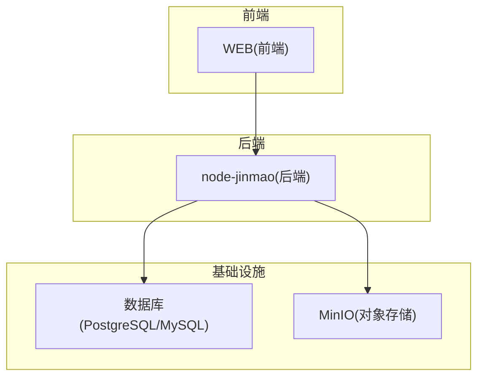
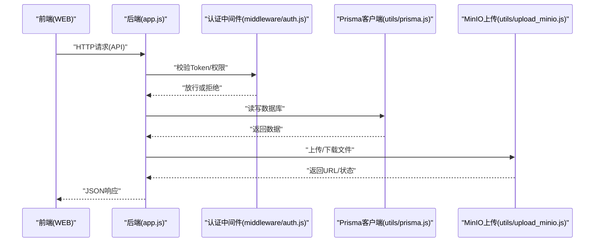
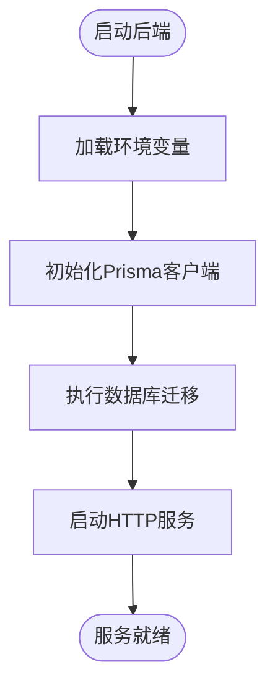
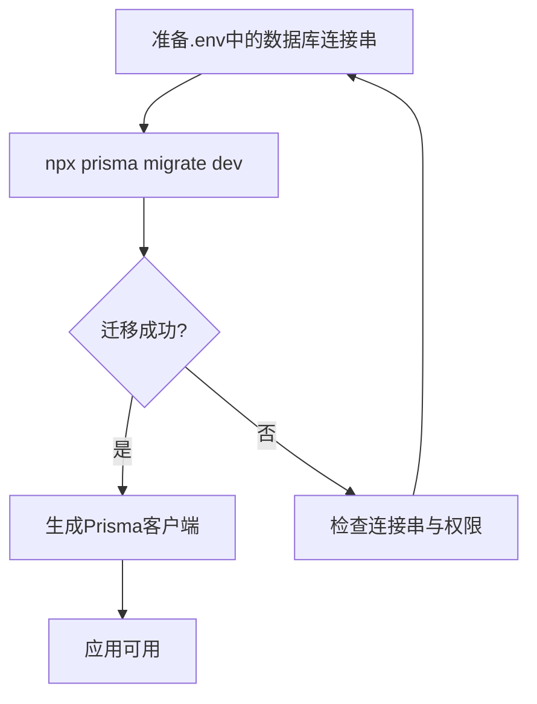
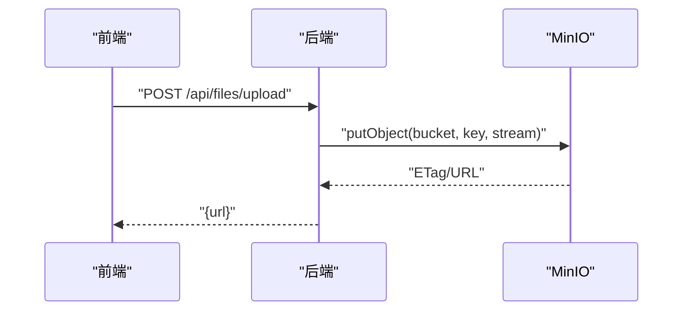
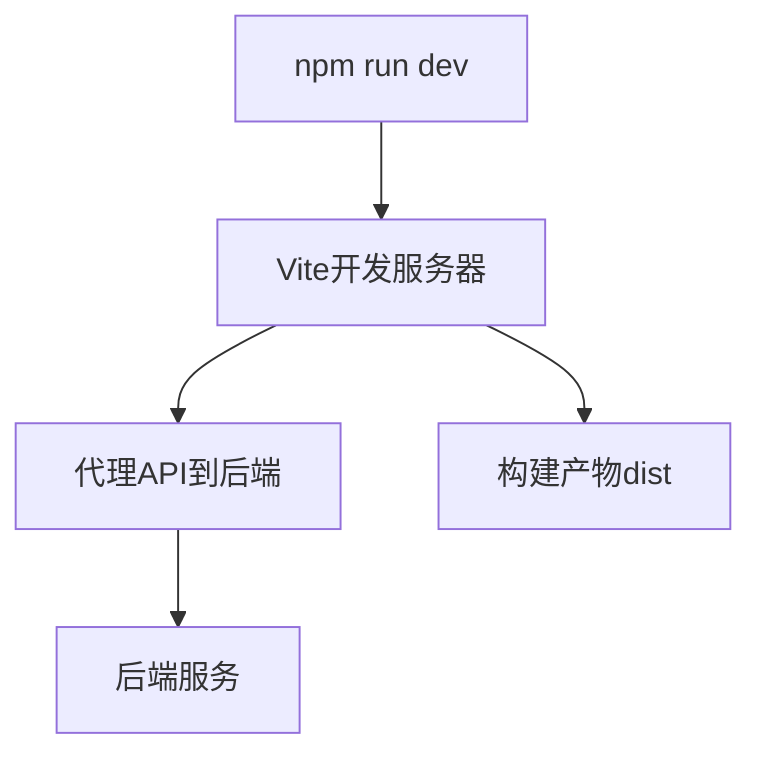
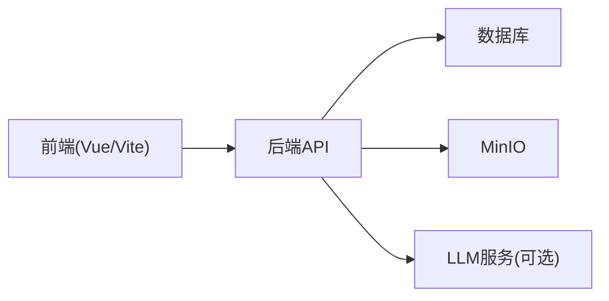

# 快速开始

<cite>
**本文引用的文件**   
- [package.json](file://node-jinmao/package.json)
- [app.js](file://node-jinmao/app.js)
- [start.ps1](file://node-jinmao/start.ps1)
- [setup.sh](file://node-jinmao/setup.sh)
- [schema.prisma](file://node-jinmao/prisma/schema.prisma)
- [minio_config.json](file://node-jinmao/config/minio_config.json)
- [prisma.js](file://node-jinmao/utils/prisma.js)
- [upload_minio.js](file://node-jinmao/utils/upload_minio.js)
- [vite.config.js](file://WEB/vite.config.js)
- [package.json](file://WEB/package.json)
- [WSL部署指南.md](file://WSL部署指南.md)
- [宝塔部署指南.md](file://宝塔部署指南.md)
- [API文档.md](file://API文档.md)
</cite>

## 目录
1. [简介](#简介)
2. [项目结构](#项目结构)
3. [核心组件](#核心组件)
4. [架构总览](#架构总览)
5. [详细组件分析](#详细组件分析)
6. [依赖关系分析](#依赖关系分析)
7. [性能注意事项](#性能注意事项)
8. [故障排除指南](#故障排除指南)
9. [结论](#结论)
10. [附录](#附录)

## 简介
本快速开始指南面向“金毛教你学重构版”项目的初次使用者，目标是帮助你在最短时间内完成环境准备、安装部署与首次启动验证。内容覆盖：
- 环境要求：Node.js 版本、数据库（PostgreSQL/MySQL）、MinIO 对象存储等
- 多方式部署：本地开发、生产环境、WSL、宝塔面板
- 环境变量与配置：数据库连接、MinIO、JWT、LLM 等
- 数据库初始化：Prisma 迁移与种子数据
- 最小化运行示例：确保系统可正常响应
- 常见问题与排错：端口冲突、权限、网络、跨域等

## 项目结构
本项目采用前后端分离架构：
- 后端服务位于 node-jinmao 目录，基于 Node.js + Express，使用 Prisma 管理数据库，MinIO 作为对象存储
- 前端应用位于 WEB 目录，基于 Vite + Vue 构建
- 根目录包含部署脚本与说明文档（WSL、宝塔等）

[本图为概念性结构示意，不直接映射具体源码文件]

## 核心组件
- 后端入口与路由：Express 应用入口统一在 app.js，API 路由按模块划分于 API 目录
- 数据库访问：通过 Prisma 客户端封装 utils/prisma.js，迁移定义在 prisma/schema.prisma
- 对象存储：MinIO 上传封装 utils/upload_minio.js，配置在 config/minio_config.json
- 认证与鉴权：中间件 middleware/auth.js，JWT 工具 utils/jwt.js
- 任务与异步处理：md2quiz 相关服务 service/md2quiz/* 提供题库生成任务流
- 前端构建：Vite 配置 vite.config.js，依赖管理 package.json

**章节来源**
- [app.js](file://node-jinmao/app.js)
- [schema.prisma](file://node-jinmao/prisma/schema.prisma)
- [prisma.js](file://node-jinmao/utils/prisma.js)
- [upload_minio.js](file://node-jinmao/utils/upload_minio.js)
- [minio_config.json](file://node-jinmao/config/minio_config.json)
- [vite.config.js](file://WEB/vite.config.js)

## 架构总览
下图展示请求从前端到后端、再到数据库与对象存储的完整链路，以及关键中间件与服务的交互。

**图表来源**
- [app.js](file://node-jinmao/app.js)
- [middleware/auth.js](file://node-jinmao/middleware/auth.js)
- [utils/prisma.js](file://node-jinmao/utils/prisma.js)
- [utils/upload_minio.js](file://node-jinmao/utils/upload_minio.js)

## 详细组件分析

### 后端服务启动与配置
- 启动脚本：Windows 使用 start.ps1，Linux/macOS 可使用 setup.sh
- 应用入口：app.js 加载路由、中间件、静态资源与错误处理
- 环境变量：建议通过 .env 或进程环境变量注入（数据库连接串、MinIO、JWT密钥等）

**图表来源**
- [start.ps1](file://node-jinmao/start.ps1)
- [setup.sh](file://node-jinmao/setup.sh)
- [app.js](file://node-jinmao/app.js)
- [utils/prisma.js](file://node-jinmao/utils/prisma.js)

**章节来源**
- [start.ps1](file://node-jinmao/start.ps1)
- [setup.sh](file://node-jinmao/setup.sh)
- [app.js](file://node-jinmao/app.js)

### 数据库与迁移
- 数据模型：prisma/schema.prisma 定义实体与关系
- 迁移管理：通过 Prisma CLI 执行迁移与回滚
- 连接配置：由环境变量控制数据库类型与连接串

**图表来源**
- [schema.prisma](file://node-jinmao/prisma/schema.prisma)
- [utils/prisma.js](file://node-jinmao/utils/prisma.js)

**章节来源**
- [schema.prisma](file://node-jinmao/prisma/schema.prisma)
- [utils/prisma.js](file://node-jinmao/utils/prisma.js)

### MinIO 对象存储集成
- 配置项：config/minio_config.json 中设置 endpoint、accessKey、secretKey、bucket 等
- 上传封装：utils/upload_minio.js 提供统一的上传接口
- 典型流程：前端上传至后端，后端调用 MinIO 并返回文件 URL

**图表来源**
- [minio_config.json](file://node-jinmao/config/minio_config.json)
- [upload_minio.js](file://node-jinmao/utils/upload_minio.js)

**章节来源**
- [minio_config.json](file://node-jinmao/config/minio_config.json)
- [upload_minio.js](file://node-jinmao/utils/upload_minio.js)

### 前端构建与代理
- 构建工具：Vite 配置文件 vite.config.js 定义开发服务器、代理与输出目录
- 依赖管理：WEB/package.json 列出前端依赖与脚本
- 开发模式：通常通过 npm run dev 启动，并代理到后端 API

**图表来源**
- [vite.config.js](file://WEB/vite.config.js)
- [package.json](file://WEB/package.json)

**章节来源**
- [vite.config.js](file://WEB/vite.config.js)
- [package.json](file://WEB/package.json)

## 依赖关系分析
- 后端依赖：Express、Prisma、MinIO SDK、JWT、业务库（如 LLM 客户端）
- 前端依赖：Vue、Vite、Axios、UI库等
- 外部依赖：数据库（PostgreSQL/MySQL）、MinIO、可选的第三方 LLM API

[本图为概念性依赖示意，不直接映射具体源码文件]

## 性能注意事项
- 数据库连接池：合理配置连接数与超时，避免连接耗尽
- 文件上传：大文件建议使用分片上传与断点续传，MinIO 开启压缩与缓存
- 异步任务：题库生成等耗时操作应走队列与SSE推送，避免阻塞请求
- 前端缓存：合理使用浏览器缓存与CDN加速静态资源

[本节为通用指导，无需引用具体文件]

## 故障排除指南
- 端口冲突：修改后端或前端的监听端口，确保未被占用
- 数据库连接失败：检查连接串、用户名密码、防火墙与白名单
- MinIO 无法访问：确认 endpoint、端口、凭证与 bucket 存在且可写
- 跨域问题：前端代理或后端 CORS 配置需匹配域名与端口
- 权限不足：Linux 下对目录与文件的读写权限；Windows 管理员权限
- 环境变量未生效：确认 .env 路径与加载顺序，重启服务后重试

**章节来源**
- [app.js](file://node-jinmao/app.js)
- [minio_config.json](file://node-jinmao/config/minio_config.json)
- [utils/prisma.js](file://node-jinmao/utils/prisma.js)

## 结论
通过本指南，你已完成环境准备、安装部署与首次启动验证。建议在生产环境中启用 HTTPS、反向代理与日志监控，并对敏感配置进行安全加固。如遇问题，优先检查环境变量、网络连接与服务依赖。

[本节为总结性内容，无需引用具体文件]

## 附录

### 环境准备清单
- Node.js：建议使用 LTS 版本（参考后端与前端 package.json 的 engines 或脚本）
- 数据库：PostgreSQL 或 MySQL（根据 schema.prisma 与连接串决定）
- MinIO：独立部署或云服务，确保 endpoint、端口、凭证与 bucket 正确
- 可选：LLM API（如 DeepSeek、豆包等），在对应配置文件中设置密钥

**章节来源**
- [package.json](file://node-jinmao/package.json)
- [package.json](file://WEB/package.json)
- [minio_config.json](file://node-jinmao/config/minio_config.json)

### 安装与部署步骤（本地开发）
- 克隆仓库并进入后端目录
- 安装依赖：npm install
- 配置环境变量：数据库连接串、MinIO、JWT 等
- 执行数据库迁移：npx prisma migrate dev
- 启动后端：Windows 使用 start.ps1，Linux/macOS 使用 setup.sh
- 进入前端目录并安装依赖：npm install
- 启动前端开发服务器：npm run dev
- 打开浏览器访问前端地址，验证登录与基本功能

**章节来源**
- [start.ps1](file://node-jinmao/start.ps1)
- [setup.sh](file://node-jinmao/setup.sh)
- [app.js](file://node-jinmao/app.js)
- [vite.config.js](file://WEB/vite.config.js)

### 生产环境部署要点
- 使用 PM2 或 systemd 管理进程，设置自动重启与日志轮转
- 配置反向代理（Nginx/Caddy）并启用 HTTPS
- 关闭调试信息，启用生产级日志与监控
- 数据库与 MinIO 使用独立实例与高可用配置

[本节为通用指导，无需引用具体文件]

### WSL 环境配置
- 安装 WSL 与 Linux 发行版
- 在 WSL 内安装 Node.js、数据库与 MinIO
- 将 Windows 代码目录挂载到 WSL 或通过同步脚本保持同步
- 在 WSL 内执行迁移与启动脚本

**章节来源**
- [WSL部署指南.md](file://WSL部署指南.md)

### 宝塔面板部署
- 安装宝塔面板并创建站点与数据库
- 上传后端与前端构建产物
- 配置反向代理与 SSL
- 设置定时任务与日志路径

**章节来源**
- [宝塔部署指南.md](file://宝塔部署指南.md)

### 环境变量设置建议
- DATABASE_URL：数据库连接串（含驱动、主机、端口、用户、密码、库名）
- MINIO_ENDPOINT/MINIO_ACCESS_KEY/MINIO_SECRET_KEY/MINIO_BUCKET：MinIO 配置
- JWT_SECRET：JWT 签名密钥
- 其他：LLM API 密钥、端口号、日志级别等

**章节来源**
- [minio_config.json](file://node-jinmao/config/minio_config.json)
- [utils/prisma.js](file://node-jinmao/utils/prisma.js)

### 数据库初始化与种子数据
- 执行迁移：npx prisma migrate dev
- 如需种子数据：编写 seed 脚本并通过 Prisma CLI 执行
- 验证表结构与初始数据是否就绪

**章节来源**
- [schema.prisma](file://node-jinmao/prisma/schema.prisma)

### 首次启动验证
- 访问后端健康检查接口（如有）或登录接口
- 尝试上传文件并获取 URL
- 在前端页面执行一次题库导入或学习记录提交

**章节来源**
- [app.js](file://node-jinmao/app.js)
- [upload_minio.js](file://node-jinmao/utils/upload_minio.js)

### 最小化运行示例
- 仅启动后端服务，不调用复杂功能
- 使用 curl 或 Postman 调用基础 API（如登录、列表）
- 确认返回状态码与数据结构符合预期

**章节来源**
- [API文档.md](file://API文档.md)

### 常见问题解答
- 为什么前端无法访问后端？检查代理配置与跨域设置
- 为什么数据库迁移失败？核对连接串与权限
- 为什么文件上传失败？确认 MinIO 凭证与 bucket 权限
- 为什么服务启动后立即退出？查看日志定位异常堆栈

[本节为通用指导，无需引用具体文件]