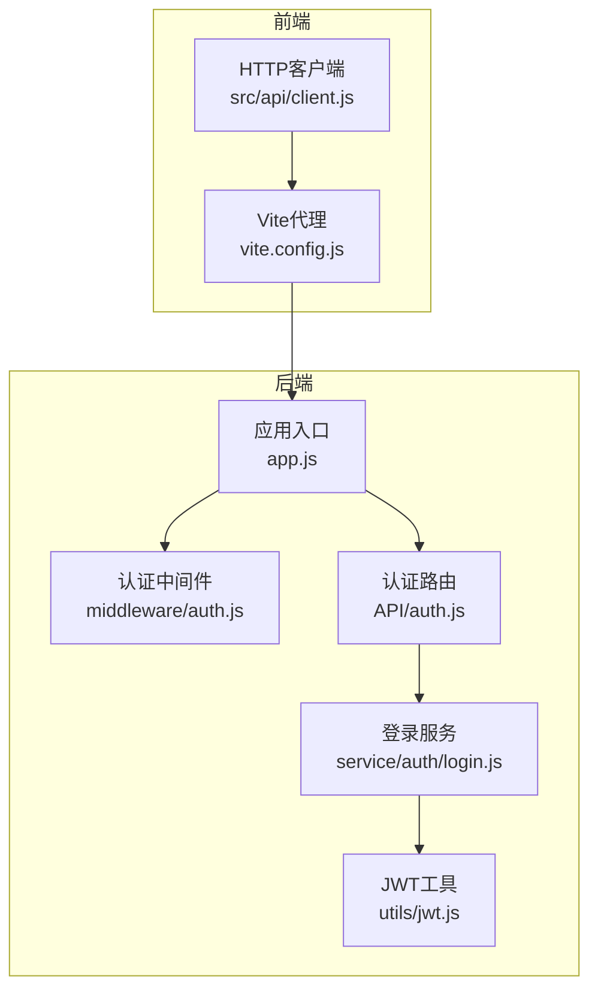
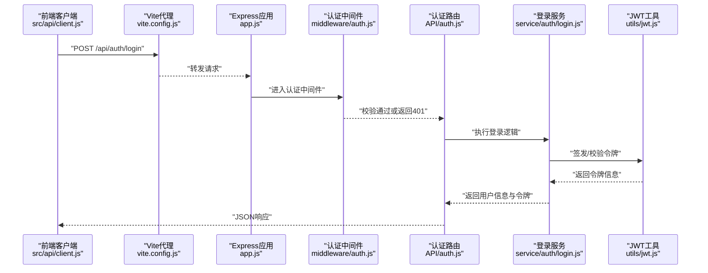
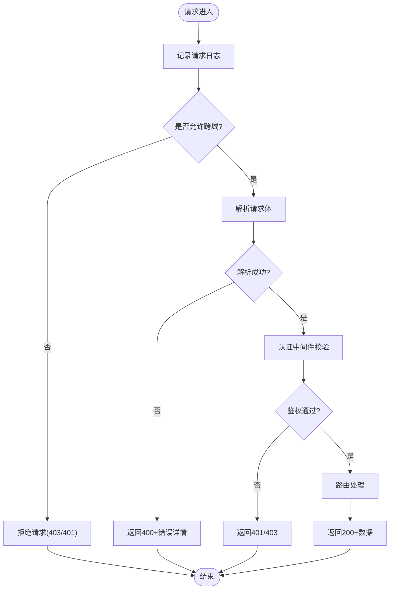
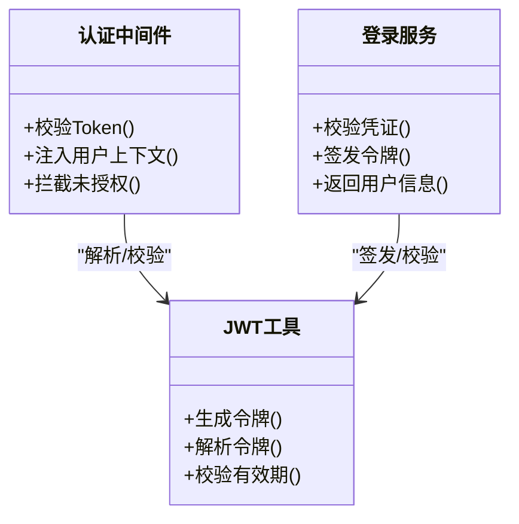
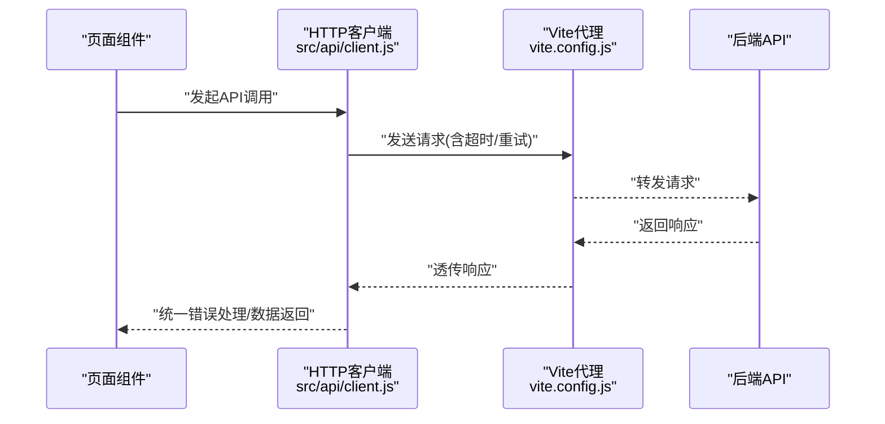
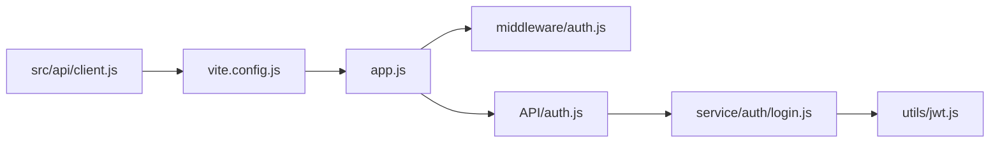

# API接口问题排查

<cite>
**本文引用的文件**   
- [app.js](file://node-jinmao/app.js)
- [middleware/auth.js](file://node-jinmao/middleware/auth.js)
- [API/auth.js](file://node-jinmao/API/auth.js)
- [service/auth/login.js](file://node-jinmao/service/auth/login.js)
- [utils/jwt.js](file://node-jinmao/utils/jwt.js)
- [package.json](file://node-jinmao/package.json)
- [start.ps1](file://node-jinmao/start.ps1)
- [src/api/client.js](file://WEB/src/api/client.js)
- [vite.config.js](file://WEB/vite.config.js)
</cite>

## 目录
1. [简介](#简介)
2. [项目结构](#项目结构)
3. [核心组件](#核心组件)
4. [架构总览](#架构总览)
5. [详细组件分析](#详细组件分析)
6. [依赖关系分析](#依赖关系分析)
7. [性能考量](#性能考量)
8. [故障排查指南](#故障排查指南)
9. [结论](#结论)
10. [附录](#附录)

## 简介
本文件面向后端与前端开发者，系统化梳理API接口常见问题与排查方法，覆盖HTTP请求失败、响应超时、参数验证错误、认证授权异常、CORS跨域、请求体解析失败、文件上传异常等典型场景。文档结合本项目Express中间件、错误处理机制、日志记录规范，提供从调用链路分析到性能瓶颈定位的实操指南，并给出Postman与网络抓包等调试技巧。

## 项目结构
本项目采用前后端分离：
- 后端（Node.js/Express）位于 node-jinmao 目录，包含路由、中间件、服务层、工具库与配置。
- 前端（Vue/Vite）位于 WEB 目录，通过HTTP客户端调用后端API。

图表来源 
- [app.js](file://node-jinmao/app.js)
- [middleware/auth.js](file://node-jinmao/middleware/auth.js)
- [API/auth.js](file://node-jinmao/API/auth.js)
- [service/auth/login.js](file://node-jinmao/service/auth/login.js)
- [utils/jwt.js](file://node-jinmao/utils/jwt.js)
- [src/api/client.js](file://WEB/src/api/client.js)
- [vite.config.js](file://WEB/vite.config.js)

章节来源
- [app.js](file://node-jinmao/app.js)
- [package.json](file://node-jinmao/package.json)
- [start.ps1](file://node-jinmao/start.ps1)

## 核心组件
- Express应用入口：统一注册中间件、路由、全局错误处理与日志。
- 认证中间件：校验Token、注入用户上下文、拦截未授权访问。
- 认证路由与服务：处理登录、令牌签发与校验流程。
- JWT工具：生成、解析、刷新令牌。
- 前端HTTP客户端：封装请求、响应拦截、错误处理与重试策略。
- Vite开发代理：解决本地开发跨域问题。

章节来源
- [app.js](file://node-jinmao/app.js)
- [middleware/auth.js](file://node-jinmao/middleware/auth.js)
- [API/auth.js](file://node-jinmao/API/auth.js)
- [service/auth/login.js](file://node-jinmao/service/auth/login.js)
- [utils/jwt.js](file://node-jinmao/utils/jwt.js)
- [src/api/client.js](file://WEB/src/api/client.js)
- [vite.config.js](file://WEB/vite.config.js)

## 架构总览
下图展示一次典型的登录请求在前后端的完整调用链路与关键节点。

图表来源 
- [src/api/client.js](file://WEB/src/api/client.js)
- [vite.config.js](file://WEB/vite.config.js)
- [app.js](file://node-jinmao/app.js)
- [middleware/auth.js](file://node-jinmao/middleware/auth.js)
- [API/auth.js](file://node-jinmao/API/auth.js)
- [service/auth/login.js](file://node-jinmao/service/auth/login.js)
- [utils/jwt.js](file://node-jinmao/utils/jwt.js)

## 详细组件分析

### Express应用与中间件栈
- 中间件顺序决定请求处理路径：日志→CORS→请求体解析→认证→业务路由→错误处理。
- 全局错误处理应捕获所有未处理异常，输出结构化日志并返回统一错误格式。
- CORS需允许必要的方法、头与凭据；生产环境建议严格白名单。

图表来源 
- [app.js](file://node-jinmao/app.js)
- [middleware/auth.js](file://node-jinmao/middleware/auth.js)

章节来源
- [app.js](file://node-jinmao/app.js)
- [middleware/auth.js](file://node-jinmao/middleware/auth.js)

### 认证与授权（JWT）
- 登录流程：校验凭证→签发令牌→返回前端存储。
- 受保护接口：中间件解析Authorization头→校验签名与过期→注入用户上下文。
- 常见错误：令牌缺失、签名无效、已过期、权限不足。

图表来源 
- [middleware/auth.js](file://node-jinmao/middleware/auth.js)
- [service/auth/login.js](file://node-jinmao/service/auth/login.js)
- [utils/jwt.js](file://node-jinmao/utils/jwt.js)

章节来源
- [middleware/auth.js](file://node-jinmao/middleware/auth.js)
- [API/auth.js](file://node-jinmao/API/auth.js)
- [service/auth/login.js](file://node-jinmao/service/auth/login.js)
- [utils/jwt.js](file://node-jinmao/utils/jwt.js)

### 前端HTTP客户端与Vite代理
- 客户端应统一设置超时、重试、错误码映射与请求/响应拦截。
- 开发期通过Vite代理将相对路径转发至后端，避免跨域。
- 生产部署需确保代理关闭且域名/CORS正确配置。

图表来源 
- [src/api/client.js](file://WEB/src/api/client.js)
- [vite.config.js](file://WEB/vite.config.js)

章节来源
- [src/api/client.js](file://WEB/src/api/client.js)
- [vite.config.js](file://WEB/vite.config.js)

## 依赖关系分析
- 后端依赖Express生态：中间件、路由、错误处理、CORS、请求体解析。
- 认证依赖JWT库与配置（密钥、过期时间）。
- 前端依赖HTTP客户端库与Vite代理配置。

图表来源 
- [app.js](file://node-jinmao/app.js)
- [middleware/auth.js](file://node-jinmao/middleware/auth.js)
- [API/auth.js](file://node-jinmao/API/auth.js)
- [service/auth/login.js](file://node-jinmao/service/auth/login.js)
- [utils/jwt.js](file://node-jinmao/utils/jwt.js)
- [src/api/client.js](file://WEB/src/api/client.js)
- [vite.config.js](file://WEB/vite.config.js)

章节来源
- [package.json](file://node-jinmao/package.json)

## 性能考量
- 连接池与数据库查询：避免N+1查询，使用索引与分页。
- 外部依赖延迟：对第三方API调用增加超时与熔断，必要时缓存结果。
- 序列化开销：减少大对象传输，按需返回字段。
- 中间件链过长：精简不必要的中间件，合并重复逻辑。
- 前端重试与退避：合理设置指数退避与最大重试次数，避免雪崩。

[本节为通用指导，不直接分析具体文件]

## 故障排查指南

### HTTP请求失败
- 现象：状态码非2xx、网络错误、DNS解析失败。
- 排查要点：
  - 检查URL与端口是否正确，代理是否生效。
  - 查看服务端日志与错误堆栈。
  - 确认防火墙与安全组放行。
- 前端建议：统一错误分类（网络/超时/业务），提示用户重试。

章节来源
- [src/api/client.js](file://WEB/src/api/client.js)
- [app.js](file://node-jinmao/app.js)

### 响应超时
- 现象：请求长时间无响应被客户端中断。
- 排查要点：
  - 服务端耗时统计（中间件计时、慢查询定位）。
  - 外部依赖超时配置与重试策略。
  - 数据库锁与事务时长。
- 优化建议：异步任务、流式响应、缓存热点数据。

章节来源
- [app.js](file://node-jinmao/app.js)
- [src/api/client.js](file://WEB/src/api/client.js)

### 参数验证错误
- 现象：400错误，字段缺失或类型不符。
- 排查要点：
  - 校验规则是否完备（必填、范围、格式）。
  - 前端表单校验与后端校验一致性。
  - 错误消息是否明确可操作。
- 改进建议：集中化校验中间件，统一错误响应格式。

章节来源
- [app.js](file://node-jinmao/app.js)

### 认证授权问题
- 现象：401/403，Token无效或缺失，权限不足。
- 排查要点：
  - Authorization头是否携带，格式是否正确。
  - Token签名与过期时间配置。
  - 角色/权限模型与路由守卫。
- 修复建议：刷新令牌机制、清晰的错误码与提示。

章节来源
- [middleware/auth.js](file://node-jinmao/middleware/auth.js)
- [utils/jwt.js](file://node-jinmao/utils/jwt.js)
- [API/auth.js](file://node-jinmao/API/auth.js)

### CORS跨域问题
- 现象：浏览器控制台报CORS错误，预检请求失败。
- 排查要点：
  - Origin白名单、Methods与Headers配置。
  - 是否允许凭据（Cookie/Authorization）。
  - 生产域名与证书配置。
- 修复建议：最小化开放策略，区分开发与生产环境。

章节来源
- [app.js](file://node-jinmao/app.js)
- [vite.config.js](file://WEB/vite.config.js)

### 请求体解析失败
- 现象：req.body为空或解析报错。
- 排查要点：
  - Content-Type是否匹配（application/json、multipart/form-data）。
  - 请求体大小限制配置。
  - 中间件顺序（解析必须在路由之前）。
- 修复建议：统一解析中间件，错误时返回400与字段级错误。

章节来源
- [app.js](file://node-jinmao/app.js)

### 文件上传异常
- 现象：上传失败、文件大小超限、类型不被接受。
- 排查要点：
  - 分片/直传策略（如MinIO）与回调处理。
  - 安全校验（MIME类型、病毒扫描）。
  - 临时目录与磁盘空间。
- 修复建议：限流与配额控制，失败重试与断点续传。

章节来源
- [app.js](file://node-jinmao/app.js)

### 日志记录规范化
- 建议：
  - 统一日志格式（时间、级别、模块、请求ID、耗时、IP、UA）。
  - 敏感信息脱敏（密码、Token、手机号）。
  - 分级输出（info/warn/error），错误附带堆栈。
- 工具：winston/pino等日志库，集中收集与检索。

章节来源
- [app.js](file://node-jinmao/app.js)

### 调用链路分析与性能瓶颈定位
- 步骤：
  - 添加请求ID贯穿全链路（前端→网关→后端→DB/外部API）。
  - 埋点关键节点耗时（中间件、服务、缓存、DB）。
  - 使用APM或分布式追踪工具（如OpenTelemetry）。
- 指标：P95/P99延迟、错误率、吞吐、资源利用率。

章节来源
- [app.js](file://node-jinmao/app.js)

### 测试工具与调试技巧
- Postman：
  - 环境变量管理（dev/prod）、集合与脚本、断言与监控。
  - 批量测试与Mock服务。
- 网络抓包：
  - 使用Wireshark/Charles/Fiddler抓取HTTP/HTTPS流量。
  - 关注握手、重定向、压缩与缓存头。
- 前端调试：
  - 浏览器开发者工具Network面板，查看请求/响应与错误。
  - 控制台日志与Source断点调试。

[本节为通用指导，不直接分析具体文件]

## 结论
通过规范的中间件栈、完善的错误处理与日志体系，配合前后端一致的超时与重试策略，可以显著提升API稳定性与可观测性。针对常见故障建立标准化排查流程，结合Postman与抓包工具快速定位问题，持续优化关键路径性能，保障用户体验。

## 附录
- 启动与运行：参考 start.ps1 与 package.json 脚本。
- 环境变量：按环境区分CORS、JWT密钥、超时与限流配置。
- 健康检查：提供/health端点用于探针与告警。

章节来源
- [start.ps1](file://node-jinmao/start.ps1)
- [package.json](file://node-jinmao/package.json)