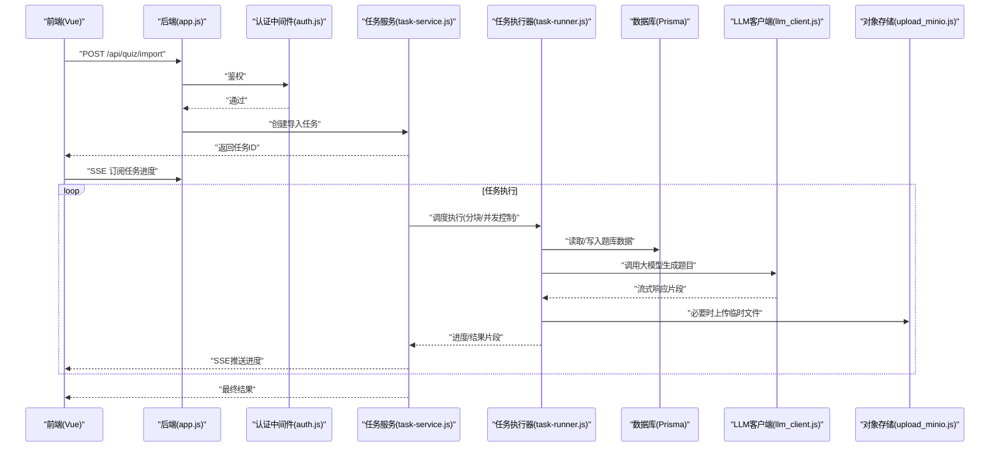
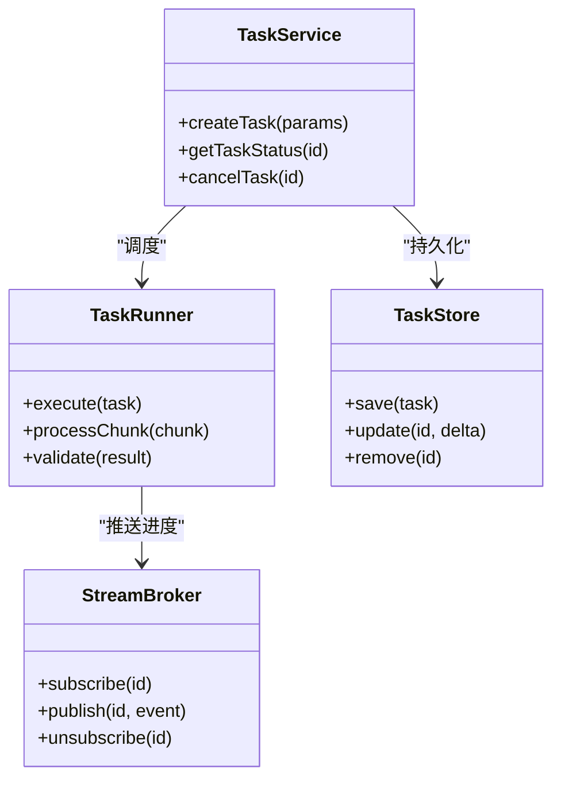
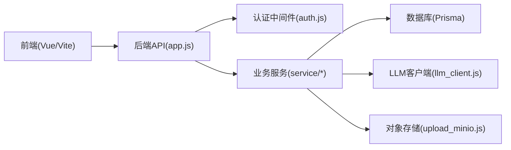

# 性能问题排查

<cite>
**本文引用的文件**   
- [app.js](file://node-jinmao/app.js)
- [package.json](file://node-jinmao/package.json)
- [prisma.js](file://node-jinmao/utils/prisma.js)
- [schema.prisma](file://node-jinmao/prisma/schema.prisma)
- [task-service.js](file://node-jinmao/service/md2quiz/task-service.js)
- [task-runner.js](file://node-jinmao/service/md2quiz/task-runner.js)
- [task-store.js](file://node-jinmao/service/md2quiz/task-store.js)
- [task-stream-broker.js](file://node-jinmao/service/md2quiz/task-stream-broker.js)
- [deepseek-client.js](file://node-jinmao/service/md2quiz/deepseek-client.js)
- [llm_client.js](file://node-jinmao/utils/llm_client.js)
- [upload_minio.js](file://node-jinmao/utils/upload_minio.js)
- [auth.js](file://node-jinmao/middleware/auth.js)
- [index.html](file://WEB/index.html)
- [main.js](file://WEB/src/main.js)
- [App.vue](file://WEB/src/App.vue)
- [CourseCard.vue](file://WEB/src/components/CourseCard.vue)
- [QuizQuestionCard.vue](file://WEB/src/components/quiz/QuizQuestionCard.vue)
- [useTheme.js](file://WEB/src/composables/useTheme.js)
- [vite.config.js](file://WEB/vite.config.js)
- [package.json](file://WEB/package.json)
</cite>

## 目录
1. [简介](#简介)
2. [项目结构](#项目结构)
3. [核心组件](#核心组件)
4. [架构总览](#架构总览)
5. [详细组件分析](#详细组件分析)
6. [依赖关系分析](#依赖关系分析)
7. [性能注意事项](#性能注意事项)
8. [故障排查指南](#故障排查指南)
9. [结论](#结论)
10. [附录](#附录)

## 简介
本指南面向Node.js与Vue前端混合项目的性能问题排查，覆盖内存泄漏检测、CPU使用率分析、事件循环阻塞识别；异步任务处理优化（队列积压、背压控制）、缓存策略调优；前端渲染优化（组件级重渲染、资源加载、内存管理）；系统资源监控、数据库查询性能分析与文件I/O优化；以及常用性能监控工具的集成与使用方法。内容结合仓库中的后端服务、任务处理管线与前端构建配置进行落地说明。

## 项目结构
本项目由两部分组成：
- 后端：基于Node.js的Express服务，包含API路由、中间件、Prisma数据访问、外部LLM客户端、MinIO上传、以及md2quiz任务流水线（分块、校验、流式推送等）。
- 前端：基于Vite + Vue的单页应用，包含页面、组件、组合式函数、状态管理与静态资源。

```mermaid
graph TB
subgraph "前端 WEB"
A["index.html"] --> B["main.js"]
B --> C["App.vue"]
C --> D["components/*"]
C --> E["composables/*"]
F["vite.config.js"] --> G["package.json"]
end
subgraph "后端 node-jinmao"
H["app.js"] --> I["middleware/auth.js"]
H --> J["API/*"]
J --> K["service/*"]
K --> L["utils/*"]
L --> M["utils/prisma.js"]
M --> N["prisma/schema.prisma"]
K --> O["service/md2quiz/*"]
O --> P["utils/llm_client.js"]
O --> Q["utils/upload_minio.js"]
end
A -.HTTP/WebSocket/SSE.-> H
```

图表来源 
- [app.js](file://node-jinmao/app.js)
- [package.json](file://node-jinmao/package.json)
- [prisma.js](file://node-jinmao/utils/prisma.js)
- [schema.prisma](file://node-jinmao/prisma/schema.prisma)
- [task-service.js](file://node-jinmao/service/md2quiz/task-service.js)
- [task-runner.js](file://node-jinmao/service/md2quiz/task-runner.js)
- [task-store.js](file://node-jinmao/service/md2quiz/task-store.js)
- [task-stream-broker.js](file://node-jinmao/service/md2quiz/task-stream-broker.js)
- [deepseek-client.js](file://node-jinmao/service/md2quiz/deepseek-client.js)
- [llm_client.js](file://node-jinmao/utils/llm_client.js)
- [upload_minio.js](file://node-jinmao/utils/upload_minio.js)
- [index.html](file://WEB/index.html)
- [main.js](file://WEB/src/main.js)
- [App.vue](file://WEB/src/App.vue)
- [CourseCard.vue](file://WEB/src/components/CourseCard.vue)
- [QuizQuestionCard.vue](file://WEB/src/components/quiz/QuizQuestionCard.vue)
- [useTheme.js](file://WEB/src/composables/useTheme.js)
- [vite.config.js](file://WEB/vite/config.js)
- [package.json](file://WEB/package.json)

章节来源
- [app.js](file://node-jinmao/app.js)
- [package.json](file://node-jinmao/package.json)
- [index.html](file://WEB/index.html)
- [main.js](file://WEB/src/main.js)
- [App.vue](file://WEB/src/App.vue)
- [vite.config.js](file://WEB/vite.config.js)
- [package.json](file://WEB/package.json)

## 核心组件
- 后端入口与路由：Express应用初始化、中间件挂载、API路由注册。
- 认证中间件：鉴权逻辑与请求上下文注入。
- Prisma数据层：连接池、事务、慢查询日志。
- md2quiz任务流水线：任务创建、分块、调度执行、结果校验、SSE流式推送。
- 外部服务客户端：LLM调用封装、MinIO对象存储上传。
- 前端构建与运行：Vite开发/生产构建、按需打包、资源优化。

章节来源
- [app.js](file://node-jinmao/app.js)
- [auth.js](file://node-jinmao/middleware/auth.js)
- [prisma.js](file://node-jinmao/utils/prisma.js)
- [schema.prisma](file://node-jinmao/prisma/schema.prisma)
- [task-service.js](file://node-jinmao/service/md2quiz/task-service.js)
- [task-runner.js](file://node-jinmao/service/md2quiz/task-runner.js)
- [task-store.js](file://node-jinmao/service/md2quiz/task-store.js)
- [task-stream-broker.js](file://node-jinmao/service/md2quiz/task-stream-broker.js)
- [deepseek-client.js](file://node-jinmao/service/md2quiz/deepseek-client.js)
- [llm_client.js](file://node-jinmao/utils/llm_client.js)
- [upload_minio.js](file://node-jinmao/utils/upload_minio.js)
- [vite.config.js](file://WEB/vite.config.js)
- [package.json](file://WEB/package.json)

## 架构总览
后端通过Express暴露REST API，认证中间件保护敏感接口；业务服务调用Prisma读写数据库，或通过LLM客户端调用大模型生成内容；长耗时任务采用任务队列+流式输出（SSE），避免同步阻塞；MinIO用于文件存储。前端通过Vite构建，按需加载组件与路由，减少首屏体积。

图表来源 
- [app.js](file://node-jinmao/app.js)
- [auth.js](file://node-jinmao/middleware/auth.js)
- [task-service.js](file://node-jinmao/service/md2quiz/task-service.js)
- [task-runner.js](file://node-jinmao/service/md2quiz/task-runner.js)
- [task-store.js](file://node-jinmao/service/md2quiz/task-store.js)
- [task-stream-broker.js](file://node-jinmao/service/md2quiz/task-stream-broker.js)
- [llm_client.js](file://node-jinmao/utils/llm_client.js)
- [upload_minio.js](file://node-jinmao/utils/upload_minio.js)
- [prisma.js](file://node-jinmao/utils/prisma.js)

## 详细组件分析

### 后端入口与中间件
- Express应用启动、监听端口、挂载全局中间件与路由。
- 认证中间件对请求进行签名校验、Token解析与用户信息注入。
- 建议开启请求耗时统计与错误上报，便于定位热点接口。

章节来源
- [app.js](file://node-jinmao/app.js)
- [auth.js](file://node-jinmao/middleware/auth.js)

### 数据访问层（Prisma）
- 连接池大小、超时、重试策略直接影响吞吐与延迟。
- 慢查询日志与索引优化是数据库性能优化的关键。
- 事务边界要尽量小，避免长时间持有锁。

章节来源
- [prisma.js](file://node-jinmao/utils/prisma.js)
- [schema.prisma](file://node-jinmao/prisma/schema.prisma)

### md2quiz任务流水线
- 任务生命周期：创建→入队→调度→执行→结果持久化→SSE推送。
- 分块与校验：将大文档切分为块，逐块处理并校验结果，降低单次失败成本。
- 流式推送：SSE逐步回传进度，提升用户体验与可观测性。
- 并发与背压：限制并发度，防止OOM与下游限流。

图表来源 
- [task-service.js](file://node-jinmao/service/md2quiz/task-service.js)
- [task-runner.js](file://node-jinmao/service/md2quiz/task-runner.js)
- [task-store.js](file://node-jinmao/service/md2quiz/task-store.js)
- [task-stream-broker.js](file://node-jinmao/service/md2quiz/task-stream-broker.js)

章节来源
- [task-service.js](file://node-jinmao/service/md2quiz/task-service.js)
- [task-runner.js](file://node-jinmao/service/md2quiz/task-runner.js)
- [task-store.js](file://node-jinmao/service/md2quiz/task-store.js)
- [task-stream-broker.js](file://node-jinmao/service/md2quiz/task-stream-broker.js)

### 外部服务客户端（LLM与MinIO）
- LLM客户端需实现超时、重试、退避与流式消费，避免阻塞事件循环。
- MinIO上传应使用流式传输、分片上传与断点续传，减少内存峰值。

章节来源
- [llm_client.js](file://node-jinmao/utils/llm_client.js)
- [upload_minio.js](file://node-jinmao/utils/upload_minio.js)
- [deepseek-client.js](file://node-jinmao/service/md2quiz/deepseek-client.js)

### 前端构建与组件
- Vite按需打包、代码分割、压缩与缓存策略影响首屏与交互性能。
- Vue组件应避免不必要的重渲染，合理使用计算属性与组合式函数。
- 图片与字体等资源应懒加载与CDN加速。

章节来源
- [vite.config.js](file://WEB/vite.config.js)
- [package.json](file://WEB/package.json)
- [App.vue](file://WEB/src/App.vue)
- [CourseCard.vue](file://WEB/src/components/CourseCard.vue)
- [QuizQuestionCard.vue](file://WEB/src/components/quiz/QuizQuestionCard.vue)
- [useTheme.js](file://WEB/src/composables/useTheme.js)

## 依赖关系分析
- 后端模块间耦合：API路由依赖服务层，服务层依赖数据层与外部客户端。
- 前端依赖：Vue生态、Vite构建工具链、第三方库按需引入。
- 外部依赖：数据库、LLM服务、对象存储。

图表来源 
- [app.js](file://node-jinmao/app.js)
- [auth.js](file://node-jinmao/middleware/auth.js)
- [llm_client.js](file://node-jinmao/utils/llm_client.js)
- [upload_minio.js](file://node-jinmao/utils/upload_minio.js)
- [prisma.js](file://node-jinmao/utils/prisma.js)

章节来源
- [app.js](file://node-jinmao/app.js)
- [package.json](file://node-jinmao/package.json)
- [package.json](file://WEB/package.json)

## 性能注意事项
- Node.js运行时
  - 内存泄漏：关注闭包引用、全局变量、未释放定时器/监听器、Buffer/字符串拼接导致的堆增长。
  - CPU使用率：热点路径集中在JSON解析、正则匹配、加密哈希、序列化/反序列化。
  - 事件循环阻塞：避免在回调中执行同步阻塞操作（如fs.readFileSync、同步加密）。
- 异步任务与队列
  - 队列积压：监控队列长度、消费者速率、下游限流；设置最大并发与丢弃策略。
  - 背压控制：SSE/WS流式输出时，根据客户端消费能力动态调整发送速率。
- 缓存策略
  - 多级缓存：浏览器缓存、CDN、服务端内存缓存（LRU/TTL）、数据库查询缓存。
  - 缓存一致性：版本号或时间戳失效，避免脏读。
- 前端性能
  - 组件渲染：拆分大组件、使用v-memo/计算属性、避免深层响应式对象。
  - 资源加载：懒加载路由与组件、图片懒加载与WebP、字体子集化。
  - 内存管理：及时解绑事件、清理定时器、销毁实例、避免全局污染。
- 数据库与I/O
  - 查询优化：索引、分页、避免N+1、批量写入。
  - 文件I/O：使用流式读写、合理缓冲大小、避免频繁小文件操作。

[本节为通用指导，不直接分析具体文件]

## 故障排查指南

### Node.js内存泄漏检测
- 使用进程快照对比定位增长对象：
  - 启动时与负载后各采集一次堆快照，比较差异。
  - 关注未释放的闭包、事件监听器、定时器、缓存键未过期。
- 常见泄漏模式：
  - 全局Map/Set无限增长。
  - 未移除的事件监听器。
  - 大对象数组累积（如日志、消息队列）。
- 建议实践：
  - 为缓存设置TTL与上限。
  - 统一在组件/请求生命周期结束时清理资源。

章节来源
- [task-store.js](file://node-jinmao/service/md2quiz/task-store.js)
- [task-stream-broker.js](file://node-jinmao/service/md2quiz/task-stream-broker.js)

### CPU使用率分析
- 采样热点：
  - 使用CPU Profiler抓取火焰图，定位热点函数。
  - 关注JSON解析、正则、加密、序列化等密集计算。
- 优化方向：
  - 预编译正则、缓存解析结果。
  - 批处理与并行化（注意线程池与内存）。
  - 将CPU密集型任务下沉到Worker或独立服务。

章节来源
- [llm_client.js](file://node-jinmao/utils/llm_client.js)
- [task-runner.js](file://node-jinmao/service/md2quiz/task-runner.js)

### 事件循环阻塞识别
- 症状：请求延迟突增、心跳超时、SSE卡顿。
- 定位方法：
  - 使用Event Loop Latency监控（如prom-client指标）。
  - 检查是否有同步阻塞调用（fs、crypto、正则回溯）。
- 修复建议：
  - 替换为异步版本（如fs.readFile）。
  - 拆分长任务，使用setImmediate/process.nextTick让出控制权。

章节来源
- [task-stream-broker.js](file://node-jinmao/service/md2quiz/task-stream-broker.js)
- [upload_minio.js](file://node-jinmao/utils/upload_minio.js)

### 异步任务队列积压解决
- 监控指标：队列长度、平均处理时长、失败率、下游限流。
- 扩容与限流：
  - 水平扩展消费者实例。
  - 设置最大并发、重试次数与退避策略。
- 背压与降级：
  - SSE按客户端能力限速。
  - 过载时拒绝新任务或排队等待。

章节来源
- [task-service.js](file://node-jinmao/service/md2quiz/task-service.js)
- [task-runner.js](file://node-jinmao/service/md2quiz/task-runner.js)
- [task-store.js](file://node-jinmao/service/md2quiz/task-store.js)

### 缓存策略调优
- 分层缓存：
  - 浏览器/CDN：静态资源强缓存。
  - 服务端：热点数据内存缓存（TTL+LRU）。
  - 数据库：查询结果缓存（谨慎使用，保证一致性）。
- 失效策略：
  - 版本号/时间戳失效。
  - 写扩散或读扩散更新。

章节来源
- [vite.config.js](file://WEB/vite.config.js)
- [task-store.js](file://node-jinmao/service/md2quiz/task-store.js)

### 前端性能优化
- 组件渲染：
  - 拆分大组件，减少响应式层级。
  - 使用计算属性与v-memo避免重复渲染。
- 资源加载：
  - 路由懒加载、组件按需加载。
  - 图片懒加载、WebP格式、CDN加速。
- 内存管理：
  - 组件卸载时清理定时器与事件监听。
  - 避免全局状态过大。

章节来源
- [App.vue](file://WEB/src/App.vue)
- [CourseCard.vue](file://WEB/src/components/CourseCard.vue)
- [QuizQuestionCard.vue](file://WEB/src/components/quiz/QuizQuestionCard.vue)
- [useTheme.js](file://WEB/src/composables/useTheme.js)
- [vite.config.js](file://WEB/vite.config.js)

### 系统资源监控
- 指标采集：
  - 进程：CPU、内存、句柄数、事件循环延迟。
  - 应用：QPS、延迟分布、错误率、队列长度。
- 可视化与告警：
  - 使用Prometheus+Grafana展示趋势与阈值告警。
  - 关键链路埋点（请求ID贯穿前后端）。

[本节为通用指导，不直接分析具体文件]

### 数据库查询性能分析
- 慢查询定位：
  - 开启慢查询日志，收集TOP SQL。
  - 使用EXPLAIN分析执行计划。
- 优化手段：
  - 添加合适索引、覆盖索引。
  - 分页与分批查询，避免一次性拉取大量数据。
  - 合并多次查询为JOIN或批量写入。

章节来源
- [prisma.js](file://node-jinmao/utils/prisma.js)
- [schema.prisma](file://node-jinmao/prisma/schema.prisma)

### 文件I/O优化
- 使用流式读写，避免一次性加载大文件。
- 合理设置缓冲区大小，减少系统调用次数。
- 对频繁小文件操作进行合并或改用对象存储。

章节来源
- [upload_minio.js](file://node-jinmao/utils/upload_minio.js)

### 性能监控工具集成与使用
- 后端：
  - 接入Prometheus指标导出，采集进程与应用指标。
  - 使用APM工具（如OpenTelemetry）进行分布式追踪。
- 前端：
  - 使用Performance API与Lighthouse采集首屏与交互指标。
  - 错误上报与用户行为埋点。

[本节为通用指导，不直接分析具体文件]

## 结论
通过系统化的性能分析方法与工具链，结合本项目的任务流水线与前后端架构，可以有效定位并解决内存泄漏、CPU热点、事件循环阻塞、队列积压与缓存不一致等问题。建议在开发阶段即引入监控与基准测试，持续优化关键路径，确保在高负载下的稳定性与用户体验。

[本节为总结性内容，不直接分析具体文件]

## 附录
- 常用命令与脚本：
  - 启动后端服务、前端开发服务器。
  - 构建与部署脚本。
- 参考文档：
  - 数据库结构与迁移说明。
  - 外部服务接入指南（LLM、MinIO）。

[本节为补充信息，不直接分析具体文件]