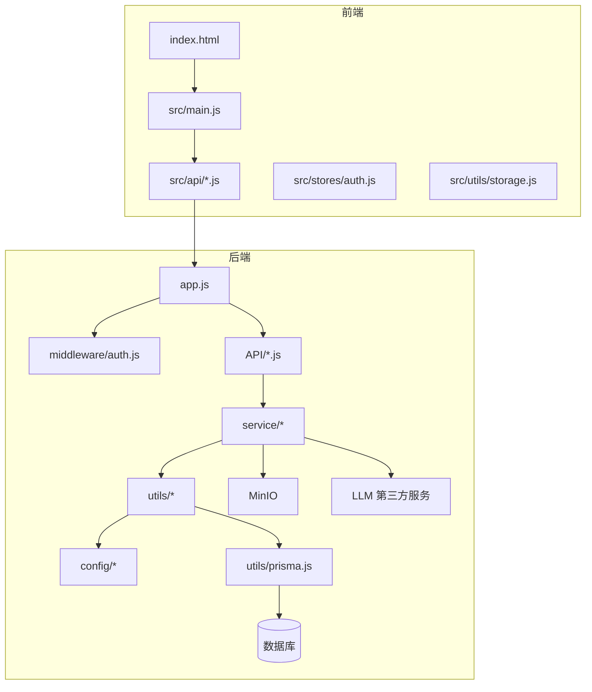
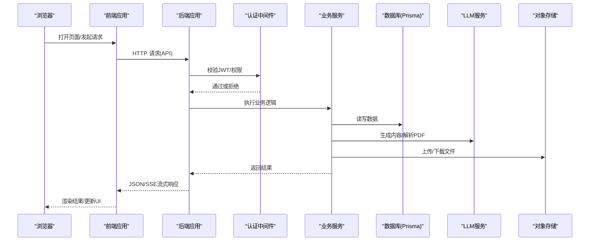
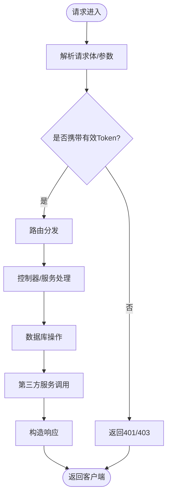
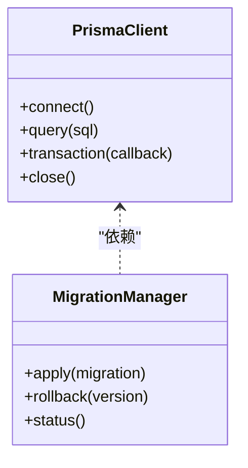
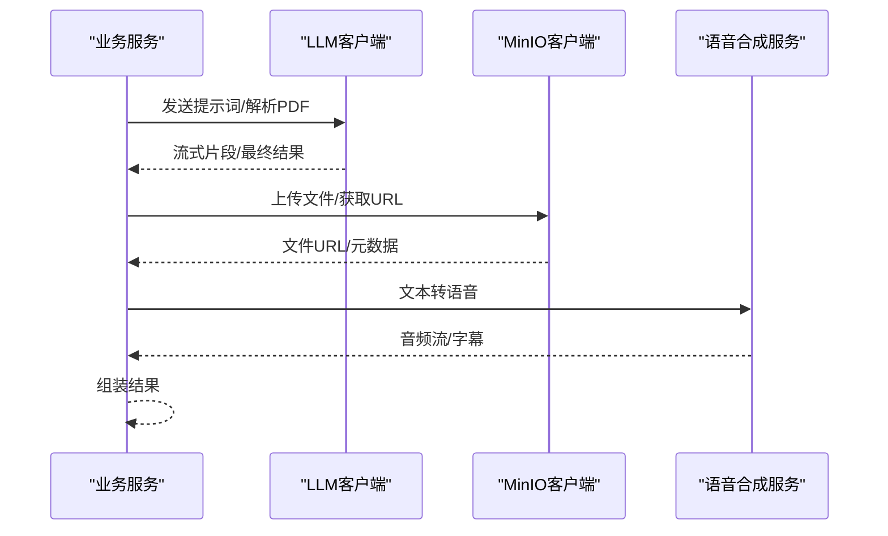
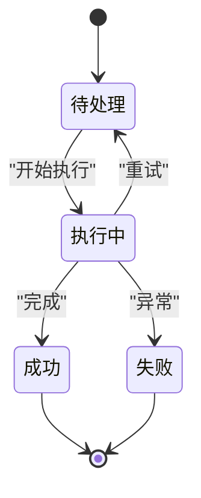
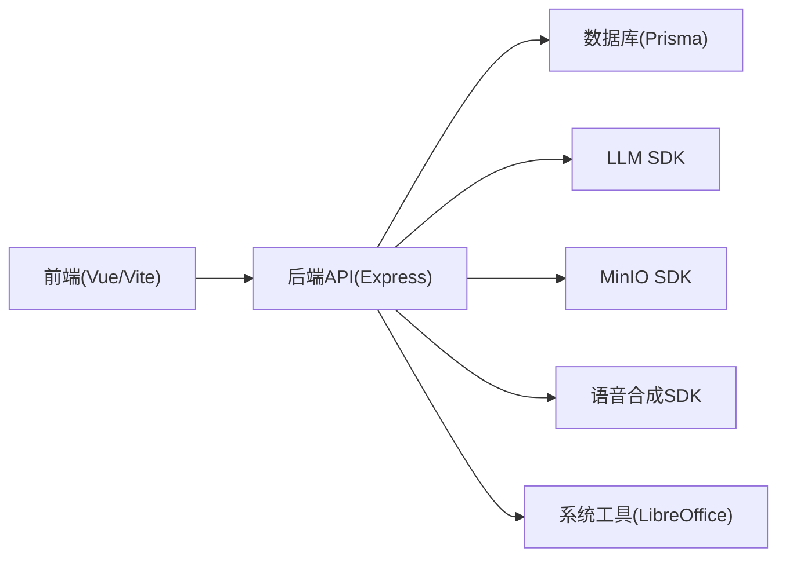

# 故障排除

<cite>
**本文引用的文件**   
- [app.js](file://node-jinmao/app.js)
- [package.json](file://node-jinmao/package.json)
- [schema.prisma](file://node-jinmao/prisma/schema.prisma)
- [prisma.js](file://node-jinmao/utils/prisma.js)
- [auth.js](file://node-jinmao/middleware/auth.js)
- [auth.js](file://node-jinmao/API/auth.js)
- [login.js](file://node-jinmao/service/auth/login.js)
- [llm_client.js](file://node-jinmao/utils/llm_client.js)
- [deepseek-client.js](file://node-jinmao/service/md2quiz/deepseek-client.js)
- [task-service.js](file://node-jinmao/service/md2quiz/task-service.js)
- [task-runner.js](file://node-jinmao/service/md2quiz/task-runner.js)
- [task-store.js](file://node-jinmao/service/md2quiz/task-store.js)
- [task-stream-broker.js](file://node-jinmao/service/md2quiz/task-stream-broker.js)
- [upload_minio.js](file://node-jinmao/utils/upload_minio.js)
- [minio_config.json](file://node-jinmao/config/minio_config.json)
- [deepseek_config.json](file://node-jinmao/config/deepseek_config.json)
- [volcengine_config.json](file://node-jinmao/config/volcengine_config.json)
- [doc2x_config.json](file://node-jinmao/config/doc2x_config.json)
- [billing_pricing.json](file://node-jinmao/config/billing_pricing.json)
- [start.ps1](file://node-jinmao/start.ps1)
- [setup.sh](file://node-jinmao/setup.sh)
- [index.html](file://WEB/index.html)
- [vite.config.js](file://WEB/vite.config.js)
- [main.js](file://WEB/src/main.js)
- [auth.js](file://WEB/src/api/auth.js)
- [storage.js](file://WEB/src/utils/storage.js)
- [API文档.md](file://API文档.md)
- [数据库结构.md](file://数据库结构.md)
- [测试命令.md](file://测试命令.md)
</cite>

## 目录
1. [简介](#简介)
2. [项目结构](#项目结构)
3. [核心组件](#核心组件)
4. [架构总览](#架构总览)
5. [详细组件分析](#详细组件分析)
6. [依赖关系分析](#依赖关系分析)
7. [性能注意事项](#性能注意事项)
8. [故障排除指南](#故障排除指南)
9. [结论](#结论)
10. [附录](#附录)

## 简介
本故障排除文档面向“金毛教你学重构版”项目的运维与开发人员，覆盖环境问题、配置问题、数据库连接问题、API调用失败、日志分析方法、错误信息解读、调试工具使用技巧、性能诊断（内存泄漏检测、CPU使用率分析）、网络问题排查、第三方服务异常处理、系统资源监控、问题收集与复现、根因定位、紧急处理流程、回滚策略以及问题预防最佳实践。目标是帮助读者快速定位并解决问题，降低停机时间，提升系统稳定性。

## 项目结构
本项目采用前后端分离架构：
- 前端位于 WEB 目录，基于 Vite + Vue 构建，提供用户界面与 API 客户端。
- 后端位于 node-jinmao 目录，基于 Node.js 与 Express，提供 RESTful API、任务调度、SSE 流式推送、第三方服务集成等能力。
- 数据库通过 Prisma ORM 管理，迁移脚本位于 prisma/migrations。
- 配置文件集中于 config 目录，包含 MinIO、DeepSeek、火山引擎、Doc2X 等第三方服务的配置。
- 启动脚本与部署脚本位于根目录与 node-jinmao 目录中。

**图示来源** 
- [app.js](file://node-jinmao/app.js)
- [vite.config.js](file://WEB/vite.config.js)
- [main.js](file://WEB/src/main.js)
- [auth.js](file://node-jinmao/middleware/auth.js)
- [prisma.js](file://node-jinmao/utils/prisma.js)

**章节来源**
- [package.json](file://node-jinmao/package.json)
- [API文档.md](file://API文档.md)
- [数据库结构.md](file://数据库结构.md)

## 核心组件
- 应用入口与路由挂载：Express 应用初始化、中间件注册、静态资源与 API 路由挂载。
- 认证中间件：JWT 校验、权限控制、请求上下文注入。
- 数据库访问层：Prisma 客户端封装、事务与连接池管理。
- 第三方服务客户端：LLM（DeepSeek）、对象存储（MinIO）、语音合成（火山引擎）、文档转换（Doc2X）。
- 任务系统与 SSE：异步任务编排、状态持久化、流式结果推送。
- 计费与统计：按用量计费、活动记录与统计聚合。

**章节来源**
- [app.js](file://node-jinmao/app.js)
- [auth.js](file://node-jinmao/middleware/auth.js)
- [prisma.js](file://node-jinmao/utils/prisma.js)
- [llm_client.js](file://node-jinmao/utils/llm_client.js)
- [deepseek-client.js](file://node-jinmao/service/md2quiz/deepseek-client.js)
- [task-service.js](file://node-jinmao/service/md2quiz/task-service.js)
- [task-runner.js](file://node-jinmao/service/md2quiz/task-runner.js)
- [task-store.js](file://node-jinmao/service/md2quiz/task-store.js)
- [task-stream-broker.js](file://node-jinmao/service/md2quiz/task-stream-broker.js)
- [upload_minio.js](file://node-jinmao/utils/upload_minio.js)

## 架构总览
下图展示了从前端到后端的请求链路，包括认证、业务服务、数据库与第三方服务交互，以及 SSE 流式返回。

**图示来源** 
- [app.js](file://node-jinmao/app.js)
- [auth.js](file://node-jinmao/middleware/auth.js)
- [task-stream-broker.js](file://node-jinmao/service/md2quiz/task-stream-broker.js)
- [deepseek-client.js](file://node-jinmao/service/md2quiz/deepseek-client.js)
- [upload_minio.js](file://node-jinmao/utils/upload_minio.js)

## 详细组件分析

### 应用入口与中间件
- 应用初始化：加载环境变量、注册中间件（CORS、JSON解析、认证）、挂载静态资源与API路由。
- 认证中间件：解析Authorization头、验证JWT、注入用户上下文、限制未授权访问。
- 错误处理：统一捕获异常、格式化错误响应、记录结构化日志。

**图示来源** 
- [app.js](file://node-jinmao/app.js)
- [auth.js](file://node-jinmao/middleware/auth.js)

**章节来源**
- [app.js](file://node-jinmao/app.js)
- [auth.js](file://node-jinmao/middleware/auth.js)

### 数据库连接与迁移
- Prisma 客户端封装：连接字符串、连接池大小、超时与重试策略。
- 迁移管理：执行迁移脚本、版本锁定、回滚策略。
- 常见问题：连接失败、迁移冲突、查询超时。

**图示来源** 
- [prisma.js](file://node-jinmao/utils/prisma.js)
- [schema.prisma](file://node-jinmao/prisma/schema.prisma)

**章节来源**
- [prisma.js](file://node-jinmao/utils/prisma.js)
- [schema.prisma](file://node-jinmao/prisma/schema.prisma)

### 第三方服务集成
- LLM 客户端：请求封装、重试与退避、流式输出、错误码映射。
- MinIO 上传：分块上传、断点续传、桶权限校验。
- 语音合成：流式传输、字幕生成、音频格式转换。
- 文档转换：Markdown转Word、PDF解析、文本提取。

**图示来源** 
- [llm_client.js](file://node-jinmao/utils/llm_client.js)
- [deepseek-client.js](file://node-jinmao/service/md2quiz/deepseek-client.js)
- [upload_minio.js](file://node-jinmao/utils/upload_minio.js)

**章节来源**
- [llm_client.js](file://node-jinmao/utils/llm_client.js)
- [deepseek-client.js](file://node-jinmao/service/md2quiz/deepseek-client.js)
- [upload_minio.js](file://node-jinmao/utils/upload_minio.js)

### 任务系统与SSE
- 任务编排：创建任务、分配执行器、状态机流转。
- 任务持久化：任务状态、进度、错误信息存储。
- SSE 流式推送：实时进度、结果片段推送、连接保活。

**图示来源** 
- [task-service.js](file://node-jinmao/service/md2quiz/task-service.js)
- [task-runner.js](file://node-jinmao/service/md2quiz/task-runner.js)
- [task-store.js](file://node-jinmao/service/md2quiz/task-store.js)
- [task-stream-broker.js](file://node-jinmao/service/md2quiz/task-stream-broker.js)

**章节来源**
- [task-service.js](file://node-jinmao/service/md2quiz/task-service.js)
- [task-runner.js](file://node-jinmao/service/md2quiz/task-runner.js)
- [task-store.js](file://node-jinmao/service/md2quiz/task-store.js)
- [task-stream-broker.js](file://node-jinmao/service/md2quiz/task-stream-broker.js)

## 依赖关系分析
- 前端依赖：Vite、Vue、Axios、状态管理库。
- 后端依赖：Express、Prisma、JWT、第三方SDK（MinIO、LLM、TTS）。
- 运行时依赖：Node.js 版本、操作系统库（如 LibreOffice 用于文档转换）。

**图示来源** 
- [package.json](file://node-jinmao/package.json)
- [vite.config.js](file://WEB/vite.config.js)

**章节来源**
- [package.json](file://node-jinmao/package.json)
- [vite.config.js](file://WEB/vite.config.js)

## 性能注意事项
- 数据库查询优化：索引设计、避免N+1查询、分页与限流。
- 连接池配置：合理设置最大连接数、超时与空闲回收。
- 缓存策略：热点数据缓存、CDN加速静态资源。
- 异步处理：长耗时任务放入队列、SSE实时反馈。
- 资源监控：CPU、内存、I/O、网络指标采集与告警。

[本节为通用指导，不直接分析具体文件]

## 故障排除指南

### 环境问题
- Node.js 版本不匹配：检查 package.json 的 engines 字段与本地版本。
- 系统依赖缺失：LibreOffice、7z 等工具未安装或路径错误。
- 端口占用：修改启动脚本中的端口或释放占用进程。

**章节来源**
- [package.json](file://node-jinmao/package.json)
- [start.ps1](file://node-jinmao/start.ps1)
- [setup.sh](file://node-jinmao/setup.sh)

### 配置问题
- 环境变量未加载：确认 .env 文件存在且被正确读取。
- 第三方服务密钥错误：检查 deepseek_config.json、volcengine_config.json、minio_config.json 中的凭据。
- CORS 配置不当：确保前端域名与后端允许源一致。

**章节来源**
- [deepseek_config.json](file://node-jinmao/config/deepseek_config.json)
- [volcengine_config.json](file://node-jinmao/config/volcengine_config.json)
- [minio_config.json](file://node-jinmao/config/minio_config.json)
- [vite.config.js](file://WEB/vite.config.js)

### 数据库连接问题
- 连接失败：检查数据库地址、端口、用户名密码、SSL 配置。
- 迁移失败：查看迁移日志，回滚至稳定版本后重试。
- 查询超时：优化慢查询、增加超时阈值或拆分大事务。

**章节来源**
- [prisma.js](file://node-jinmao/utils/prisma.js)
- [schema.prisma](file://node-jinmao/prisma/schema.prisma)

### API调用失败
- 认证失败：检查 JWT 令牌有效期、签名算法、请求头格式。
- 参数校验错误：参考 API 文档，确保必填字段与类型正确。
- 服务端异常：查看后端日志，定位具体错误堆栈。

**章节来源**
- [auth.js](file://node-jinmao/middleware/auth.js)
- [auth.js](file://node-jinmao/API/auth.js)
- [API文档.md](file://API文档.md)

### 日志分析方法
- 后端日志：集中输出到文件或日志服务，包含请求ID、用户ID、耗时、错误码。
- 前端日志：使用浏览器开发者工具的 Network 与 Console 面板。
- 结构化日志：便于检索与分析，推荐 JSON 格式。

[本节为通用指导，不直接分析具体文件]

### 错误信息解读
- HTTP 状态码：4xx 客户端错误，5xx 服务端错误。
- 业务错误码：自定义错误码映射到用户友好提示。
- 堆栈跟踪：定位代码行号与调用链。

[本节为通用指导，不直接分析具体文件]

### 调试工具使用技巧
- 后端：Node.js Inspector、console.log、日志聚合平台。
- 前端：Chrome DevTools、Vue Devtools、网络抓包。
- 数据库：Prisma Studio、数据库客户端直连查询。

[本节为通用指导，不直接分析具体文件]

### 性能问题诊断
- CPU 使用率高：使用 --prof 采样、火焰图分析热点函数。
- 内存泄漏：heapdump 快照对比、追踪未释放引用。
- I/O 瓶颈：监控磁盘与网络 I/O，优化批量操作。

[本节为通用指导，不直接分析具体文件]

### 网络问题排查
- DNS 解析失败：检查 hosts 文件与 DNS 服务器。
- 连接超时：防火墙规则、代理配置、负载均衡健康检查。
- SSL/TLS 错误：证书过期、协议版本不匹配。

[本节为通用指导，不直接分析具体文件]

### 第三方服务异常处理
- LLM 服务限流：实现指数退避重试、降级策略。
- MinIO 上传失败：检查桶权限、网络连通性、分块大小。
- 语音合成失败：重试机制、备用提供商切换。

**章节来源**
- [llm_client.js](file://node-jinmao/utils/llm_client.js)
- [upload_minio.js](file://node-jinmao/utils/upload_minio.js)

### 系统资源监控
- 进程监控：PM2、systemd 管理进程存活与重启。
- 指标采集：Prometheus + Grafana 可视化。
- 告警规则：CPU、内存、错误率阈值触发通知。

[本节为通用指导，不直接分析具体文件]

### 问题收集与复现
- 收集信息：环境版本、操作步骤、日志片段、错误截图。
- 复现步骤：最小化用例、隔离变量、自动化脚本。
- 根因定位：二分法缩小范围、代码审查、变更回溯。

[本节为通用指导，不直接分析具体文件]

### 紧急情况处理流程
- 立即止损：回滚版本、关闭故障功能、扩容资源。
- 沟通同步：对内通报、对外公告、客户支持跟进。
- 事后复盘：根因分析、改进措施、演练预案。

[本节为通用指导，不直接分析具体文件]

### 回滚策略
- 数据库回滚：执行反向迁移、数据修复脚本。
- 应用回滚：快速切换到上一稳定版本镜像或代码分支。
- 配置回滚：恢复旧版配置文件与环境变量。

**章节来源**
- [schema.prisma](file://node-jinmao/prisma/schema.prisma)
- [start.ps1](file://node-jinmao/start.ps1)

### 问题预防最佳实践
- 代码审查：强制 PR 审核、单元测试覆盖率。
- 灰度发布：逐步放量、监控关键指标。
- 混沌工程：模拟故障、验证系统韧性。

[本节为通用指导，不直接分析具体文件]

## 结论
通过系统化故障排除方法，结合日志分析、性能诊断与第三方服务治理，可显著提升系统稳定性与可维护性。建议建立标准化排障流程与知识库，持续优化监控与告警体系，减少平均修复时间（MTTR）。

[本节为总结性内容，不直接分析具体文件]

## 附录
- 常用命令：参考测试命令文档进行接口测试与回归验证。
- 数据库结构：了解表结构与关系，辅助 SQL 调试。
- API 文档：明确接口规范与错误码定义。

**章节来源**
- [测试命令.md](file://测试命令.md)
- [数据库结构.md](file://数据库结构.md)
- [API文档.md](file://API文档.md)