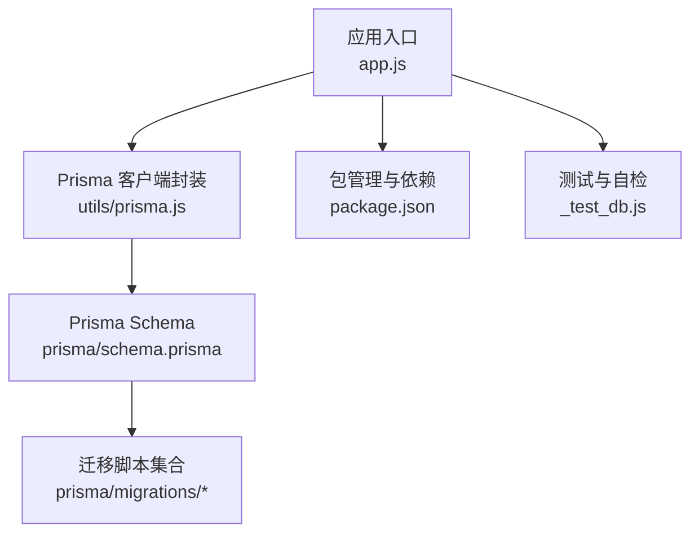
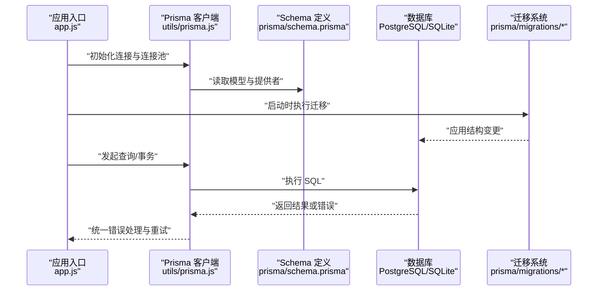
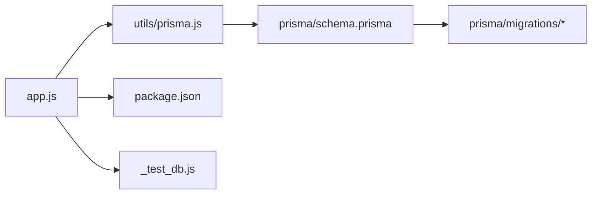

# 数据库问题排查

<cite>
**本文引用的文件**   
- [node-jinmao/prisma/schema.prisma](file://node-jinmao/prisma/schema.prisma)
- [node-jinmao/utils/prisma.js](file://node-jinmao/utils/prisma.js)
- [node-jinmao/app.js](file://node-jinmao/app.js)
- [node-jinmao/package.json](file://node-jinmao/package.json)
- [node-jinmao/prisma/migrations/20260704072148_init/migration.sql](file://node-jinmao/prisma/migrations/20260704072148_init/migration.sql)
- [node-jinmao/prisma/migrations/20260709105504_add_course_and_chapter/migration.sql](file://node-jinmao/prisma/migrations/20260709105504_add_course_and_chapter/migration.sql)
- [node-jinmao/prisma/migrations/20260709_add_subtitle_to_course/migration.sql](file://node-jinmao/prisma/migrations/20260709_add_subtitle_to_course/migration.sql)
- [node-jinmao/prisma/migrations/20260724_add_user_study_record/migration.sql](file://node-jinmao/prisma/migrations/20260724_add_user_study_record/migration.sql)
- [node-jinmao/prisma/migrations/20260725_add_chapter_generation_progress/migration.sql](file://node-jinmao/prisma/migrations/20260725_add_chapter_generation_progress/migration.sql)
- [node-jinmao/prisma/migrations/20260729_add_quiz_generating_task_id/migration.sql](file://node-jinmao/prisma/migrations/20260729_add_quiz_generating_task_id/migration.sql)
- [node-jinmao/prisma/migrations/20260729_add_user_billing_fields/migration.sql](file://node-jinmao/prisma/migrations/20260729_add_user_billing_fields/migration.sql)
- [node-jinmao/prisma/migrations/20260729_add_user_daily_activity/migration.sql](file://node-jinmao/prisma/migrations/20260729_add_user_daily_activity/migration.sql)
- [node-jinmao/prisma/migrations/migration_lock.toml](file://node-jinmao/prisma/migrations/migration_lock.toml)
- [node-jinmao/_test_db.js](file://node-jinmao/_test_db.js)
- [node-jinmao/.schema_hash](file://node-jinmao/.schema_hash)
- [node-jinmao/.migration_version](file://node-jinmao/.migration_version)
</cite>

## 目录
1. [简介](#简介)
2. [项目结构](#项目结构)
3. [核心组件](#核心组件)
4. [架构总览](#架构总览)
5. [详细组件分析](#详细组件分析)
6. [依赖关系分析](#依赖关系分析)
7. [性能考量](#性能考量)
8. [故障排查指南](#故障排查指南)
9. [结论](#结论)
10. [附录](#附录)

## 简介
本指南面向使用 Prisma ORM 的 Node.js 后端，聚焦数据库相关问题排查与优化。内容覆盖连接池耗尽、迁移失败、数据模型不匹配、SQLite 与 PostgreSQL 的特殊问题（文件锁、并发限制、性能瓶颈）、备份恢复、索引优化、慢查询分析与监控、死锁处理以及数据一致性检查与修复工具的使用建议。读者可据此快速定位并解决常见数据库问题，提升系统稳定性与性能。

## 项目结构
本项目在后端模块 node-jinmao 中集成 Prisma，通过 schema 定义数据模型，并通过迁移管理数据库结构变更。应用入口加载配置并初始化 Prisma 客户端，服务层通过统一的 Prisma 实例访问数据库。

图表来源
- [node-jinmao/app.js](file://node-jinmao/app.js)
- [node-jinmao/utils/prisma.js](file://node-jinmao/utils/prisma.js)
- [node-jinmao/prisma/schema.prisma](file://node-jinmao/prisma/schema.prisma)
- [node-jinmao/package.json](file://node-jinmao/package.json)
- [node-jinmao/_test_db.js](file://node-jinmao/_test_db.js)

章节来源
- [node-jinmao/app.js](file://node-jinmao/app.js)
- [node-jinmao/utils/prisma.js](file://node-jinmao/utils/prisma.js)
- [node-jinmao/prisma/schema.prisma](file://node-jinmao/prisma/schema.prisma)
- [node-jinmao/package.json](file://node-jinmao/package.json)

## 核心组件
- Prisma Schema：集中定义数据模型、关系与数据库提供者，是迁移与类型生成的依据。
- Prisma 客户端封装：提供连接参数、连接池配置、错误处理与重试策略。
- 迁移脚本：按版本组织，记录数据库结构变更，确保环境一致性。
- 应用入口：加载环境变量、初始化 Prisma、注册路由与服务。
- 包管理：声明 Prisma CLI、驱动与运行时依赖，影响构建与运行行为。
- 测试与自检：用于验证数据库连通性与基本读写能力。

章节来源
- [node-jinmao/prisma/schema.prisma](file://node-jinmao/prisma/schema.prisma)
- [node-jinmao/utils/prisma.js](file://node-jinmao/utils/prisma.js)
- [node-jinmao/app.js](file://node-jinmao/app.js)
- [node-jinmao/package.json](file://node-jinmao/package.json)
- [node-jinmao/_test_db.js](file://node-jinmao/_test_db.js)

## 架构总览
下图展示从应用请求到数据库操作的典型流程，包括 Prisma 客户端初始化、迁移执行与查询路径。

图表来源
- [node-jinmao/app.js](file://node-jinmao/app.js)
- [node-jinmao/utils/prisma.js](file://node-jinmao/utils/prisma.js)
- [node-jinmao/prisma/schema.prisma](file://node-jinmao/prisma/schema.prisma)
- [node-jinmao/prisma/migrations/20260704072148_init/migration.sql](file://node-jinmao/prisma/migrations/20260704072148_init/migration.sql)

## 详细组件分析

### Prisma Schema 与数据模型
- 作用：定义表结构、字段类型、唯一约束、外键关系与索引；决定迁移生成内容与类型安全。
- 常见问题：
  - 模型字段与数据库实际不一致导致迁移失败或运行时错误。
  - 未正确设置主键或唯一约束引发重复数据。
  - 关系建模不当造成 N+1 查询或性能问题。
- 排查要点：
  - 对比 schema 与现有数据库结构，必要时重新生成迁移或回滚。
  - 检查必填字段默认值与空值约束是否合理。
  - 对高频查询字段添加合适索引。

章节来源
- [node-jinmao/prisma/schema.prisma](file://node-jinmao/prisma/schema.prisma)

### Prisma 客户端封装与连接池
- 作用：管理数据库连接、连接池大小、超时与重试策略，统一错误处理。
- 常见问题：
  - 连接池耗尽：高并发下连接数不足，导致请求排队或超时。
  - 连接泄漏：未正确关闭事务或客户端，导致连接无法回收。
  - 超时与重试配置不当：网络抖动或数据库负载高时频繁失败。
- 排查要点：
  - 监控连接池使用率与活跃连接数。
  - 检查事务生命周期，确保在异常分支也能释放资源。
  - 调整连接池大小与超时阈值，结合压测确定合理值。

章节来源
- [node-jinmao/utils/prisma.js](file://node-jinmao/utils/prisma.js)

### 迁移系统与版本控制
- 作用：以增量方式维护数据库结构，保证多环境一致。
- 常见问题：
  - 迁移冲突：多人并行修改导致迁移顺序或依赖冲突。
  - 数据不兼容变更：如删除列但未处理历史数据。
  - 迁移锁文件不同步：锁定机制阻止迁移执行。
- 排查要点：
  - 查看迁移日志与错误堆栈，定位具体失败的 SQL。
  - 校验 migration_lock 与目标数据库状态一致。
  - 对破坏性变更编写数据迁移脚本，避免直接删改。

章节来源
- [node-jinmao/prisma/migrations/20260704072148_init/migration.sql](file://node-jinmao/prisma/migrations/20260704072148_init/migration.sql)
- [node-jinmao/prisma/migrations/20260709105504_add_course_and_chapter/migration.sql](file://node-jinmao/prisma/migrations/20260709105504_add_course_and_chapter/migration.sql)
- [node-jinmao/prisma/migrations/20260709_add_subtitle_to_course/migration.sql](file://node-jinmao/prisma/migrations/20260709_add_subtitle_to_course/migration.sql)
- [node-jinmao/prisma/migrations/20260724_add_user_study_record/migration.sql](file://node-jinmao/prisma/migrations/20260724_add_user_study_record/migration.sql)
- [node-jinmao/prisma/migrations/20260725_add_chapter_generation_progress/migration.sql](file://node-jinmao/prisma/migrations/20260725_add_chapter_generation_progress/migration.sql)
- [node-jinmao/prisma/migrations/20260729_add_quiz_generating_task_id/migration.sql](file://node-jinmao/prisma/migrations/20260729_add_quiz_generating_task_id/migration.sql)
- [node-jinmao/prisma/migrations/20260729_add_user_billing_fields/migration.sql](file://node-jinmao/prisma/migrations/20260729_add_user_billing_fields/migration.sql)
- [node-jinmao/prisma/migrations/20260729_add_user_daily_activity/migration.sql](file://node-jinmao/prisma/migrations/20260729_add_user_daily_activity/migration.sql)
- [node-jinmao/prisma/migrations/migration_lock.toml](file://node-jinmao/prisma/migrations/migration_lock.toml)

### 应用入口与初始化流程
- 作用：加载环境变量、初始化 Prisma、注册中间件与路由、启动服务。
- 常见问题：
  - 环境变量缺失或格式错误导致连接失败。
  - 启动顺序错误：迁移未执行即开始处理请求。
  - 进程退出未优雅关闭 Prisma 客户端，导致连接泄漏。
- 排查要点：
  - 校验环境变量完整性与有效性。
  - 确保启动阶段执行迁移与预热连接。
  - 监听进程信号，关闭客户端并释放资源。

章节来源
- [node-jinmao/app.js](file://node-jinmao/app.js)

### 包管理与依赖
- 作用：声明 Prisma CLI、驱动与运行时库，影响构建产物与运行行为。
- 常见问题：
  - 版本不兼容导致迁移或类型生成失败。
  - 缺少必要依赖导致运行时错误。
- 排查要点：
  - 固定依赖版本，避免隐式升级。
  - 安装后验证 Prisma 命令可用且驱动正常。

章节来源
- [node-jinmao/package.json](file://node-jinmao/package.json)

### 测试与自检
- 作用：验证数据库连通性与基本读写能力，辅助定位环境问题。
- 常见问题：
  - 测试用例未覆盖连接池与事务场景。
  - 测试数据清理不彻底影响后续测试。
- 排查要点：
  - 增加连接池与事务的自动化测试。
  - 使用独立测试数据库与隔离数据。

章节来源
- [node-jinmao/_test_db.js](file://node-jinmao/_test_db.js)

## 依赖关系分析
Prisma 客户端依赖 schema 定义与迁移脚本，应用入口负责初始化与生命周期管理，包管理确保依赖一致性。

图表来源
- [node-jinmao/app.js](file://node-jinmao/app.js)
- [node-jinmao/utils/prisma.js](file://node-jinmao/utils/prisma.js)
- [node-jinmao/prisma/schema.prisma](file://node-jinmao/prisma/schema.prisma)
- [node-jinmao/package.json](file://node-jinmao/package.json)
- [node-jinmao/_test_db.js](file://node-jinmao/_test_db.js)

章节来源
- [node-jinmao/app.js](file://node-jinmao/app.js)
- [node-jinmao/utils/prisma.js](file://node-jinmao/utils/prisma.js)
- [node-jinmao/prisma/schema.prisma](file://node-jinmao/prisma/schema.prisma)
- [node-jinmao/package.json](file://node-jinmao/package.json)

## 性能考量
- 连接池调优：根据并发量与平均响应时间调整最大连接数，避免过多连接导致上下文切换开销。
- 查询优化：为高频过滤与排序字段建立索引，避免全表扫描；合理使用分页与投影减少数据传输。
- 事务边界：缩短事务持续时间，避免长事务持有锁；拆分大事务为多个小事务。
- 缓存策略：对读多写少的热点数据引入缓存层，降低数据库压力。
- 监控指标：关注连接池使用率、慢查询数量、锁等待时间与磁盘 I/O。

[本节为通用指导，无需特定文件来源]

## 故障排查指南

### Prisma ORM 常见问题
- 连接池耗尽
  - 现象：请求排队、超时、连接拒绝。
  - 排查：检查连接池上限、活跃连接数、是否存在未关闭的事务或客户端。
  - 处理：增大连接池、修复资源泄漏、增加重试与退避策略。
- 迁移失败
  - 现象：启动时报错、迁移锁冲突、SQL 语法错误。
  - 排查：查看迁移日志、确认 migration_lock 与数据库状态一致、检查破坏性变更。
  - 处理：修正迁移脚本、执行数据迁移、同步锁定文件。
- 数据模型不匹配
  - 现象：类型错误、字段缺失、关系断裂。
  - 排查：对比 schema 与数据库结构、检查默认值与约束。
  - 处理：更新 schema 并生成新迁移、回填或清理历史数据。

章节来源
- [node-jinmao/utils/prisma.js](file://node-jinmao/utils/prisma.js)
- [node-jinmao/prisma/schema.prisma](file://node-jinmao/prisma/schema.prisma)
- [node-jinmao/prisma/migrations/migration_lock.toml](file://node-jinmao/prisma/migrations/migration_lock.toml)

### SQLite 特殊问题
- 文件锁与并发限制
  - 现象：写入阻塞、锁等待、并发插入失败。
  - 原因：SQLite 基于文件级锁，不支持高并发写入。
  - 处理：改用 WAL 模式、合并批量写入、降低并发写操作、考虑分库或迁移至 PostgreSQL。
- 性能瓶颈
  - 现象：复杂查询慢、索引失效。
  - 处理：优化 SQL、重建索引、避免函数包裹索引列。

章节来源
- [node-jinmao/prisma/schema.prisma](file://node-jinmao/prisma/schema.prisma)

### PostgreSQL 特殊问题
- 连接与内存
  - 现象：连接数过高、内存占用大。
  - 处理：调整 max_connections、work_mem、shared_buffers，监控会话与临时文件。
- 锁与死锁
  - 现象：事务阻塞、死锁检测触发。
  - 处理：缩短事务、规范锁顺序、启用死锁日志与分析。
- 索引与查询
  - 现象：全表扫描、索引未命中。
  - 处理：使用 EXPLAIN 分析、创建合适索引、统计信息更新。

章节来源
- [node-jinmao/prisma/schema.prisma](file://node-jinmao/prisma/schema.prisma)

### 备份与恢复
- 备份策略
  - PostgreSQL：使用 pg_dump 逻辑备份或物理备份工具，定期快照与异地存储。
  - SQLite：直接复制数据库文件（建议在只读或低峰期），或使用 sqlite3 导出 SQL。
- 恢复流程
  - 先停止写入服务，再恢复数据，最后重启服务并验证一致性。
- 注意事项
  - 备份前记录迁移版本与 schema 哈希，确保恢复后可用。

章节来源
- [node-jinmao/.schema_hash](file://node-jinmao/.schema_hash)
- [node-jinmao/.migration_version](file://node-jinmao/.migration_version)

### 索引优化建议
- 识别热点查询：通过慢查询日志与 EXPLAIN 分析。
- 选择合适索引：等值查询建单列索引，范围与排序建复合索引。
- 避免过度索引：写入性能下降与维护成本上升。
- 定期维护：重建碎片、更新统计信息。

章节来源
- [node-jinmao/prisma/schema.prisma](file://node-jinmao/prisma/schema.prisma)

### 查询性能分析与慢查询日志
- PostgreSQL
  - 启用 log_min_duration_statement，收集慢查询。
  - 使用 EXPLAIN ANALYZE 分析执行计划。
- SQLite
  - 启用 PRAGMA 相关日志选项，分析查询计划。
- 处理步骤
  - 定位慢查询、优化 SQL 与索引、拆分复杂查询。

章节来源
- [node-jinmao/prisma/schema.prisma](file://node-jinmao/prisma/schema.prisma)

### 死锁问题诊断与解决
- 诊断方法
  - 查看锁等待图、事务持有者与等待者。
  - 分析事务边界与锁顺序。
- 解决策略
  - 缩短事务、统一加锁顺序、避免跨表大范围更新。
  - 增加重试与退避机制。

章节来源
- [node-jinmao/utils/prisma.js](file://node-jinmao/utils/prisma.js)

### 数据一致性检查与修复工具
- 一致性检查
  - 对比 schema 与数据库结构，校验外键与唯一约束。
  - 扫描重复数据与空值违规。
- 修复工具
  - 编写数据迁移脚本进行增量修复。
  - 使用 Prisma 迁移回滚与重放功能。

章节来源
- [node-jinmao/prisma/migrations/migration_lock.toml](file://node-jinmao/prisma/migrations/migration_lock.toml)
- [node-jinmao/_test_db.js](file://node-jinmao/_test_db.js)

## 结论
通过系统化排查 Prisma ORM 与数据库问题，结合连接池调优、迁移治理、索引优化与监控告警，可显著提升系统稳定性与性能。建议在生产环境建立完善的备份恢复流程与数据一致性校验机制，持续优化查询与事务设计，降低锁竞争与死锁风险。

[本节为总结性内容，无需特定文件来源]

## 附录
- 常用命令与脚本
  - 迁移执行与回滚：参考迁移脚本与锁定文件。
  - 连接测试：使用测试脚本验证连通性与基本读写。
- 监控指标清单
  - 连接池使用率、慢查询数量、锁等待时间、磁盘 I/O 与内存占用。

章节来源
- [node-jinmao/prisma/migrations/migration_lock.toml](file://node-jinmao/prisma/migrations/migration_lock.toml)
- [node-jinmao/_test_db.js](file://node-jinmao/_test_db.js)