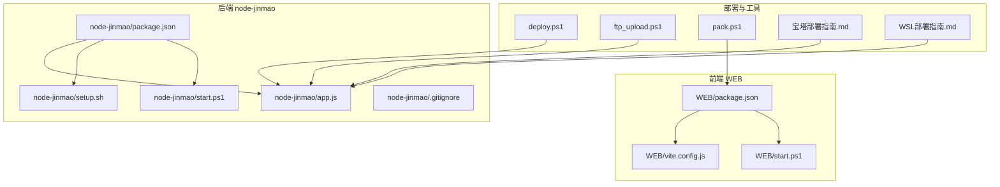
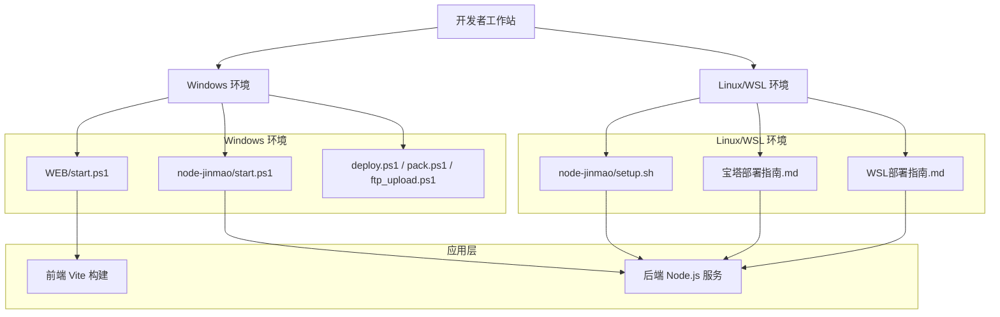
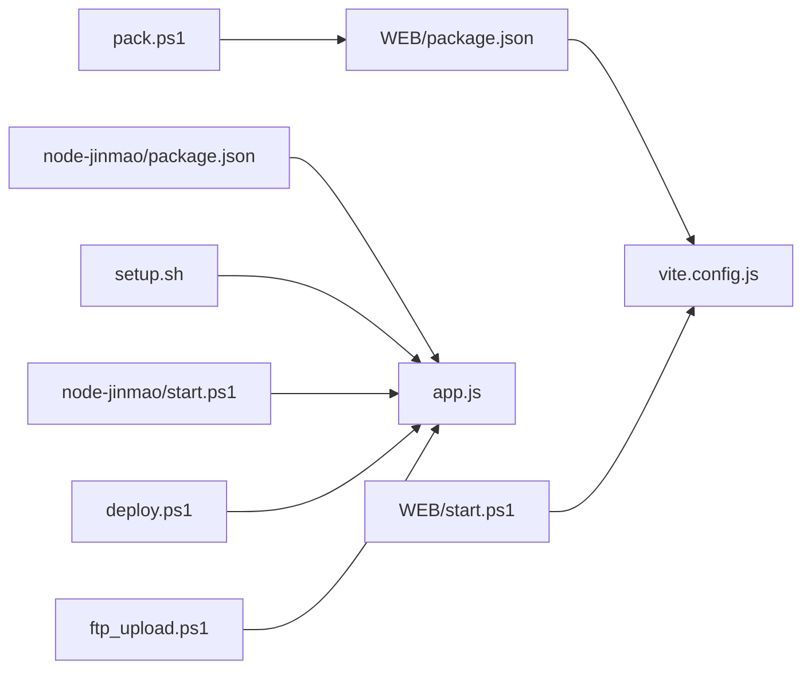
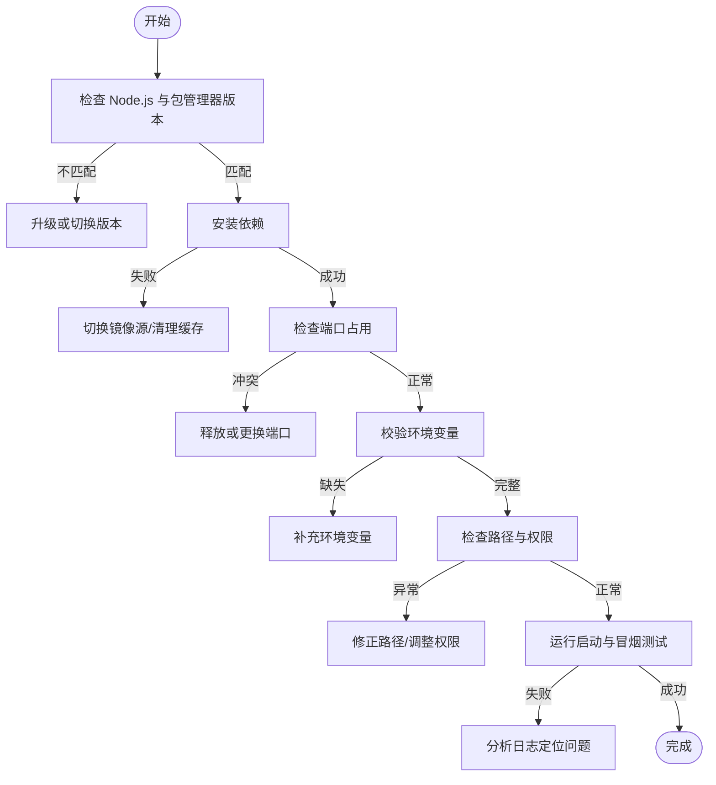

# 环境问题排查

<cite>
**本文引用的文件**   
- [package.json](file://node-jinmao/package.json)
- [app.js](file://node-jinmao/app.js)
- [setup.sh](file://node-jinmao/setup.sh)
- [start.ps1](file://node-jinmao/start.ps1)
- [vite.config.js](file://WEB/vite.config.js)
- [package.json](file://WEB/package.json)
- [start.ps1](file://WEB/start.ps1)
- [宝塔部署指南.md](file://宝塔部署指南.md)
- [WSL部署指南.md](file://WSL部署指南.md)
- [deploy.ps1](file://deploy.ps1)
- [ftp_upload.ps1](file://ftp_upload.ps1)
- [pack.ps1](file://pack.ps1)
- [.gitignore](file://node-jinmao/.gitignore)
</cite>

## 目录
1. [简介](#简介)
2. [项目结构](#项目结构)
3. [核心组件](#核心组件)
4. [架构总览](#架构总览)
5. [详细组件分析](#详细组件分析)
6. [依赖关系分析](#依赖关系分析)
7. [性能注意事项](#性能注意事项)
8. [故障排查指南](#故障排查指南)
9. [结论](#结论)
10. [附录](#附录)

## 简介
本文件面向开发与运维人员，系统化梳理本项目在本地与服务器环境中的常见问题及解决方案。重点覆盖：
- Node.js 版本兼容性与包管理器选择
- 依赖安装失败、缓存与网络问题
- 端口冲突与服务启动失败
- Windows/Linux 路径分隔符差异与权限问题
- 环境变量配置与校验
- Docker 容器化部署的环境问题
- 云服务（如宝塔面板）特殊配置需求
- 环境诊断脚本与自动化检测工具使用方法

## 项目结构
本项目包含前端 WEB 与后端 node-jinmao 两个主要子工程，以及若干部署与打包脚本。关键入口与配置文件如下：
- 后端主应用：node-jinmao/app.js
- 后端依赖与脚本：node-jinmao/package.json、node-jinmao/setup.sh、node-jinmao/start.ps1
- 前端构建配置：WEB/vite.config.js、WEB/package.json、WEB/start.ps1
- 部署与打包脚本：deploy.ps1、ftp_upload.ps1、pack.ps1
- 平台部署指南：宝塔部署指南.md、WSL部署指南.md
- 忽略规则：node-jinmao/.gitignore

图表来源
- [package.json](file://node-jinmao/package.json)
- [app.js](file://node-jinmao/app.js)
- [setup.sh](file://node-jinmao/setup.sh)
- [start.ps1](file://node-jinmao/start.ps1)
- [vite.config.js](file://WEB/vite.config.js)
- [package.json](file://WEB/package.json)
- [start.ps1](file://WEB/start.ps1)
- [宝塔部署指南.md](file://宝塔部署指南.md)
- [WSL部署指南.md](file://WSL部署指南.md)
- [deploy.ps1](file://deploy.ps1)
- [ftp_upload.ps1](file://ftp_upload.ps1)
- [pack.ps1](file://pack.ps1)
- [.gitignore](file://node-jinmao/.gitignore)

章节来源
- [package.json](file://node-jinmao/package.json)
- [app.js](file://node-jinmao/app.js)
- [setup.sh](file://node-jinmao/setup.sh)
- [start.ps1](file://node-jinmao/start.ps1)
- [vite.config.js](file://WEB/vite.config.js)
- [package.json](file://WEB/package.json)
- [start.ps1](file://WEB/start.ps1)
- [宝塔部署指南.md](file://宝塔部署指南.md)
- [WSL部署指南.md](file://WSL部署指南.md)
- [deploy.ps1](file://deploy.ps1)
- [ftp_upload.ps1](file://ftp_upload.ps1)
- [pack.ps1](file://pack.ps1)
- [.gitignore](file://node-jinmao/.gitignore)

## 核心组件
- 后端服务（Node.js）
  - 入口文件：app.js
  - 依赖管理：package.json
  - 初始化脚本：setup.sh（Linux/WSL）、start.ps1（Windows）
- 前端构建（Vite）
  - 构建配置：vite.config.js
  - 依赖管理：package.json
  - 启动脚本：start.ps1（Windows）
- 部署与打包
  - 部署脚本：deploy.ps1、ftp_upload.ps1、pack.ps1
  - 平台指南：宝塔部署指南.md、WSL部署指南.md

章节来源
- [app.js](file://node-jinmao/app.js)
- [package.json](file://node-jinmao/package.json)
- [setup.sh](file://node-jinmao/setup.sh)
- [start.ps1](file://node-jinmao/start.ps1)
- [vite.config.js](file://WEB/vite.config.js)
- [package.json](file://WEB/package.json)
- [start.ps1](file://WEB/start.ps1)
- [deploy.ps1](file://deploy.ps1)
- [ftp_upload.ps1](file://ftp_upload.ps1)
- [pack.ps1](file://pack.ps1)
- [宝塔部署指南.md](file://宝塔部署指南.md)
- [WSL部署指南.md](file://WSL部署指南.md)

## 架构总览
下图展示前后端与环境脚本的交互关系，便于定位环境问题的影响面。

图表来源
- [start.ps1](file://WEB/start.ps1)
- [start.ps1](file://node-jinmao/start.ps1)
- [setup.sh](file://node-jinmao/setup.sh)
- [宝塔部署指南.md](file://宝塔部署指南.md)
- [WSL部署指南.md](file://WSL部署指南.md)
- [deploy.ps1](file://deploy.ps1)
- [pack.ps1](file://pack.ps1)
- [ftp_upload.ps1](file://ftp_upload.ps1)

## 详细组件分析

### Node.js 版本与包管理器兼容性
- 版本要求
  - 检查 Node.js 与 npm/yarn/pnpm 版本是否与 package.json 中声明一致。
  - 若存在引擎限制或锁文件不匹配，优先使用与锁文件匹配的包管理器。
- 常见症状
  - 安装时报“不支持的 Node.js 版本”或“引擎不满足”。
  - 不同包管理器混用导致 lock 文件不一致。
- 处理建议
  - 统一团队使用的包管理器与 Node 版本，必要时通过版本管理工具切换。
  - 清理缓存后重试安装；必要时删除依赖目录重新安装。

章节来源
- [package.json](file://node-jinmao/package.json)
- [package.json](file://WEB/package.json)

### 依赖安装失败与网络问题
- 可能原因
  - 网络受限或镜像源不可达。
  - 缓存损坏或权限不足。
  - 原生模块编译失败（缺少系统依赖）。
- 排查步骤
  - 切换至稳定镜像源并启用缓存。
  - 清理缓存与临时文件后重试。
  - 确认系统级依赖已安装（例如 C/C++ 编译工具链）。
- 预防建议
  - 在 CI/CD 中固定镜像源与缓存策略。
  - 对原生模块提供预编译二进制或替代方案。

章节来源
- [package.json](file://node-jinmao/package.json)
- [package.json](file://WEB/package.json)

### 端口冲突与服务启动失败
- 常见现象
  - 启动时报端口占用错误。
  - 前端代理无法连接后端。
- 排查步骤
  - 检查当前进程占用的端口，释放冲突端口。
  - 核对前端代理配置与后端监听端口是否一致。
- 处理建议
  - 为不同环境分配独立端口。
  - 在启动前自动检测端口可用性。

章节来源
- [vite.config.js](file://WEB/vite.config.js)
- [app.js](file://node-jinmao/app.js)

### 路径分隔符差异（Windows vs Linux/WSL）
- 差异点
  - Windows 使用反斜杠，Linux/WSL 使用正斜杠。
  - 大小写敏感文件系统差异。
- 常见问题
  - 路径拼接错误导致找不到文件或资源。
  - 跨平台脚本执行异常。
- 处理建议
  - 使用跨平台路径库进行拼接。
  - 避免硬编码分隔符，统一使用标准 API。
  - 在 Windows 上注意大小写不敏感导致的误判。

章节来源
- [start.ps1](file://node-jinmao/start.ps1)
- [start.ps1](file://WEB/start.ps1)
- [setup.sh](file://node-jinmao/setup.sh)

### 文件权限问题
- 常见场景
  - 写入数据目录失败。
  - 读取配置文件被拒绝。
  - 脚本无执行权限。
- 排查步骤
  - 检查目标目录与文件的读写权限。
  - 确认运行用户具备所需权限。
- 处理建议
  - 最小权限原则下授予必要权限。
  - 将数据目录与可执行脚本分离，便于权限控制。

章节来源
- [.gitignore](file://node-jinmao/.gitignore)
- [setup.sh](file://node-jinmao/setup.sh)

### 环境变量配置与校验
- 关键点
  - 确保环境变量在运行时可用且值正确。
  - 区分开发、测试、生产环境的变量。
- 排查步骤
  - 打印并校验关键变量是否存在与格式是否正确。
  - 检查进程环境与脚本加载顺序。
- 处理建议
  - 集中管理环境变量，提供默认值与校验逻辑。
  - 在启动时输出缺失变量的告警。

章节来源
- [app.js](file://node-jinmao/app.js)
- [setup.sh](file://node-jinmao/setup.sh)
- [start.ps1](file://node-jinmao/start.ps1)

### Docker 容器化部署的环境问题
- 常见问题
  - 基础镜像 Node 版本不匹配。
  - 卷挂载路径与权限问题。
  - 环境变量未注入或覆盖。
- 排查步骤
  - 检查镜像版本与依赖安装日志。
  - 验证卷挂载路径与读写权限。
  - 确认环境变量注入方式与优先级。
- 处理建议
  - 使用多阶段构建减小镜像体积。
  - 明确环境变量来源与默认值。
  - 在容器内以非 root 用户运行。

章节来源
- [setup.sh](file://node-jinmao/setup.sh)
- [start.ps1](file://node-jinmao/start.ps1)

### 云服务环境（宝塔面板）特殊配置
- 关键点
  - 站点根目录与反向代理端口。
  - 防火墙与安全组放行。
  - 定时任务与日志轮转。
- 排查步骤
  - 核对站点配置与域名解析。
  - 检查端口开放与证书配置。
  - 查看面板日志与应用日志定位问题。
- 处理建议
  - 使用面板的一键部署与监控能力。
  - 定期备份与回滚策略。

章节来源
- [宝塔部署指南.md](file://宝塔部署指南.md)

### WSL 环境特殊配置
- 关键点
  - 文件系统性能与路径映射。
  - 网络访问与端口转发。
  - 与 Windows 宿主机共享目录权限。
- 排查步骤
  - 检查 WSL 内核与发行版版本。
  - 验证网络连通性与端口映射。
  - 调整共享目录挂载选项。
- 处理建议
  - 将代码放在 WSL 文件系统内以提升 I/O。
  - 合理配置代理与 DNS。

章节来源
- [WSL部署指南.md](file://WSL部署指南.md)

### 部署与打包脚本的使用
- 部署脚本
  - deploy.ps1：用于自动化部署流程。
  - ftp_upload.ps1：上传产物到远程服务器。
  - pack.ps1：打包前端与后端产物。
- 使用建议
  - 在执行前校验环境变量与依赖完整性。
  - 记录执行日志以便回溯问题。
  - 失败时快速回滚与重试机制。

章节来源
- [deploy.ps1](file://deploy.ps1)
- [ftp_upload.ps1](file://ftp_upload.ps1)
- [pack.ps1](file://pack.ps1)

## 依赖关系分析
- 前端依赖
  - 由 WEB/package.json 定义，构建由 vite.config.js 驱动。
- 后端依赖
  - 由 node-jinmao/package.json 定义，服务入口 app.js。
- 脚本依赖
  - setup.sh 负责 Linux/WSL 初始化。
  - start.ps1 负责 Windows 启动。
  - 部署脚本协调前后端构建与发布。

图表来源
- [package.json](file://WEB/package.json)
- [vite.config.js](file://WEB/vite.config.js)
- [package.json](file://node-jinmao/package.json)
- [app.js](file://node-jinmao/app.js)
- [setup.sh](file://node-jinmao/setup.sh)
- [start.ps1](file://WEB/start.ps1)
- [start.ps1](file://node-jinmao/start.ps1)
- [deploy.ps1](file://deploy.ps1)
- [ftp_upload.ps1](file://ftp_upload.ps1)
- [pack.ps1](file://pack.ps1)

章节来源
- [package.json](file://WEB/package.json)
- [vite.config.js](file://WEB/vite.config.js)
- [package.json](file://node-jinmao/package.json)
- [app.js](file://node-jinmao/app.js)
- [setup.sh](file://node-jinmao/setup.sh)
- [start.ps1](file://WEB/start.ps1)
- [start.ps1](file://node-jinmao/start.ps1)
- [deploy.ps1](file://deploy.ps1)
- [ftp_upload.ps1](file://ftp_upload.ps1)
- [pack.ps1](file://pack.ps1)

## 性能注意事项
- 依赖安装
  - 使用并行安装与缓存加速。
  - 锁定版本减少解析时间。
- 构建优化
  - 按需引入与代码分割。
  - 静态资源压缩与缓存。
- 运行时
  - 合理设置线程池与连接池。
  - 监控内存与 CPU 使用率。

[本节为通用指导，无需特定文件引用]

## 故障排查指南

### 环境诊断清单
- Node.js 与包管理器
  - 检查版本是否符合要求。
  - 确认锁文件与包管理器一致。
- 依赖安装
  - 切换镜像源并清理缓存。
  - 检查系统级依赖是否齐全。
- 端口与网络
  - 检查端口占用与防火墙规则。
  - 验证代理与 DNS 配置。
- 路径与权限
  - 使用跨平台路径 API。
  - 校验目录与文件权限。
- 环境变量
  - 打印并校验关键变量。
  - 区分环境并设置默认值。
- 容器与云服务
  - 检查镜像版本与卷挂载。
  - 核对站点与反向代理配置。

章节来源
- [package.json](file://node-jinmao/package.json)
- [package.json](file://WEB/package.json)
- [app.js](file://node-jinmao/app.js)
- [setup.sh](file://node-jinmao/setup.sh)
- [start.ps1](file://node-jinmao/start.ps1)
- [宝塔部署指南.md](file://宝塔部署指南.md)
- [WSL部署指南.md](file://WSL部署指南.md)

### 自动化检测工具使用方法
- 前置准备
  - 准备诊断脚本与依赖检查命令。
  - 确保具备执行权限与日志输出。
- 执行步骤
  - 运行环境自检脚本，收集版本与依赖信息。
  - 检查端口占用与网络连通性。
  - 校验环境变量与路径有效性。
- 结果分析
  - 根据输出定位问题根因。
  - 生成修复建议与操作指引。

章节来源
- [setup.sh](file://node-jinmao/setup.sh)
- [start.ps1](file://node-jinmao/start.ps1)
- [deploy.ps1](file://deploy.ps1)
- [ftp_upload.ps1](file://ftp_upload.ps1)
- [pack.ps1](file://pack.ps1)

### 典型问题流程图

图表来源
- [setup.sh](file://node-jinmao/setup.sh)
- [start.ps1](file://node-jinmao/start.ps1)
- [app.js](file://node-jinmao/app.js)

## 结论
通过统一环境基线、规范依赖管理与脚本执行、完善环境变量与权限控制，并结合容器化与云平台最佳实践，可显著降低环境问题的发生概率。建议在团队内推广标准化诊断流程与自动化检测工具，提升排障效率与稳定性。

[本节为总结性内容，无需特定文件引用]

## 附录
- 参考文档
  - 宝塔部署指南：宝塔部署指南.md
  - WSL 部署指南：WSL部署指南.md
- 常用命令
  - 检查 Node.js 版本与包管理器版本。
  - 清理缓存与重新安装依赖。
  - 检查端口占用与进程信息。
  - 校验环境变量与路径有效性。

[本节为补充信息，无需特定文件引用]