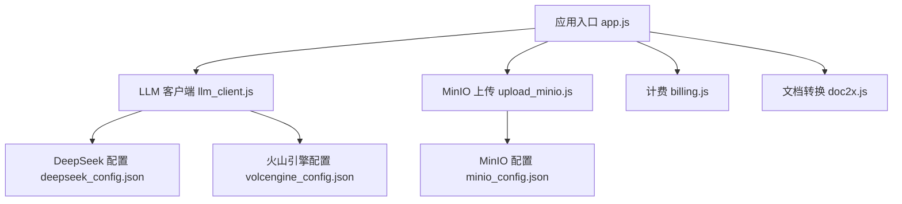
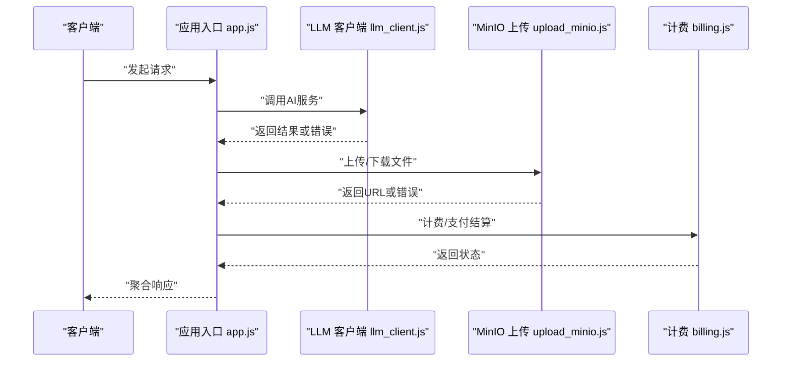
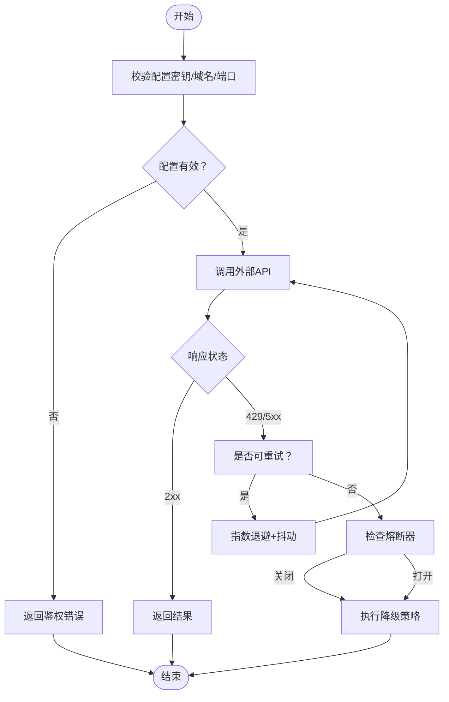
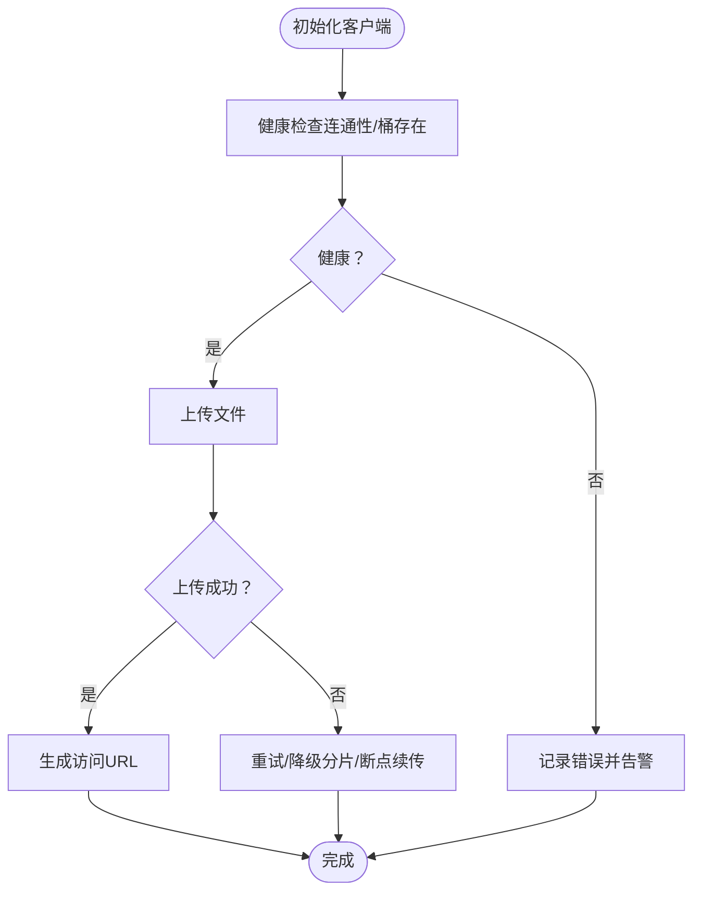
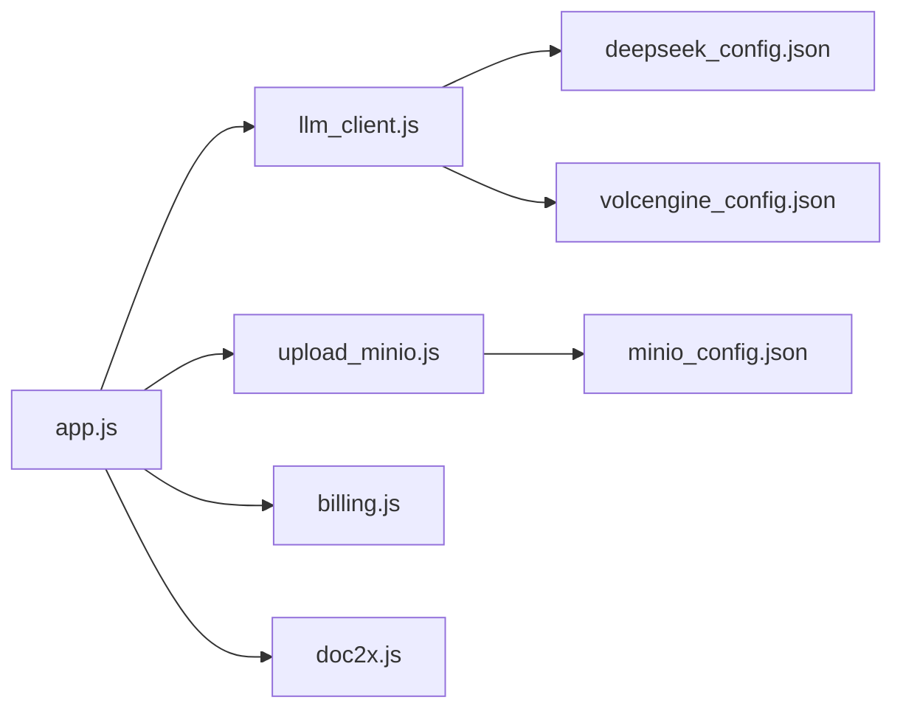

# 第三方服务问题排查文档

<cite>
**本文档引用的文件**
- [deepseek_config.json](file://node-jinmao/config/deepseek_config.json)
- [volcengine_config.json](file://node-jinmao/config/volcengine_config.json)
- [minio_config.json](file://node-jinmao/config/minio_config.json)
- [llm_client.js](file://node-jinmao/utils/llm_client.js)
- [upload_minio.js](file://node-jinmao/utils/upload_minio.js)
- [billing.js](file://node-jinmao/utils/billing.js)
- [doc2x.js](file://node-jinmao/utils/doc2x.js)
- [app.js](file://node-jinmao/app.js)
- [package.json](file://node-jinmao/package.json)
</cite>

## 目录
1. [简介](#简介)
2. [项目结构](#项目结构)
3. [核心组件](#核心组件)
4. [架构总览](#架构总览)
5. [详细组件分析](#详细组件分析)
6. [依赖关系分析](#依赖关系分析)
7. [性能与稳定性考虑](#性能与稳定性考虑)
8. [故障排查指南](#故障排查指南)
9. [结论](#结论)
10. [附录](#附录)

## 简介
本文件面向“第三方服务集成”的问题排查，覆盖以下场景：
- AI 服务（DeepSeek、豆包TTS）调用失败：API 密钥配置错误、网络超时、限流降级等
- MinIO 对象存储连接与上传下载失败
- 邮件、短信、支付等外部集成的故障排除
- 重试机制配置、熔断与降级策略实现
- 监控告警配置与备用方案切换逻辑

目标是帮助开发者快速定位问题根因，提供可操作的修复步骤与最佳实践。

## 项目结构
后端 Node.js 服务位于 node-jinmao 目录，关键第三方集成点包括：
- LLM 客户端封装与配置
- MinIO 上传工具
- 计费与外部服务桥接
- 应用入口与中间件

图表来源
- [app.js](file://node-jinmao/app.js)
- [llm_client.js](file://node-jinmao/utils/llm_client.js)
- [upload_minio.js](file://node-jinmao/utils/upload_minio.js)
- [billing.js](file://node-jinmao/utils/billing.js)
- [doc2x.js](file://node-jinmao/utils/doc2x.js)
- [deepseek_config.json](file://node-jinmao/config/deepseek_config.json)
- [volcengine_config.json](file://node-jinmao/config/volcengine_config.json)
- [minio_config.json](file://node-jinmao/config/minio_config.json)

章节来源
- [app.js](file://node-jinmao/app.js)
- [package.json](file://node-jinmao/package.json)

## 核心组件
- LLM 客户端（llm_client.js）：统一封装对外部大模型 API 的调用，包含鉴权、请求构造、响应解析、错误处理与重试/熔断扩展点。
- MinIO 上传（upload_minio.js）：封装 MinIO 客户端初始化、桶校验、上传/下载、分片与断点续传能力。
- 计费（billing.js）：对接计费或支付相关的外部服务，负责扣费、对账、幂等与异常回滚。
- 文档转换（doc2x.js）：封装文档格式转换（如 PDF/Word）的外部工具或服务调用。
- 配置文件：集中管理 DeepSeek、火山引擎（豆包TTS）、MinIO 的连接参数与密钥。

章节来源
- [llm_client.js](file://node-jinmao/utils/llm_client.js)
- [upload_minio.js](file://node-jinmao/utils/upload_minio.js)
- [billing.js](file://node-jinmao/utils/billing.js)
- [doc2x.js](file://node-jinmao/utils/doc2x.js)
- [deepseek_config.json](file://node-jinmao/config/deepseek_config.json)
- [volcengine_config.json](file://node-jinmao/config/volcengine_config.json)
- [minio_config.json](file://node-jinmao/config/minio_config.json)

## 架构总览
系统通过应用入口加载各服务模块，按业务路由调用第三方服务。关键流程如下：
- 请求进入 app.js，根据路由分发到具体业务模块
- 业务模块调用 LLM 客户端进行文本生成/语音合成
- 业务模块调用 MinIO 上传/下载资源
- 计费模块在需要时调用支付/计费服务
- 所有外部调用均建议具备重试、熔断、降级与监控埋点

图表来源
- [app.js](file://node-jinmao/app.js)
- [llm_client.js](file://node-jinmao/utils/llm_client.js)
- [upload_minio.js](file://node-jinmao/utils/upload_minio.js)
- [billing.js](file://node-jinmao/utils/billing.js)

## 详细组件分析

### LLM 客户端（DeepSeek、豆包TTS）
- 职责：统一封装外部大模型 API 调用，处理鉴权、请求体构建、流式/非流式响应、错误分类与重试。
- 常见失败原因：
  - API 密钥配置错误：密钥缺失、过期、权限不足
  - 网络超时：DNS 解析失败、TLS 握手失败、远端不可达
  - 限流降级：429/5xx、并发过高触发服务端限流
- 建议实现：
  - 重试机制：指数退避 + 抖动；区分可重试错误（网络/限流）与不可重试错误（鉴权/参数）
  - 熔断器：基于错误率/延迟阈值自动熔断，半开探测恢复
  - 降级策略：缓存最近成功结果、返回兜底模板、队列异步处理
  - 监控埋点：成功率、P95/P99 延迟、错误码分布、熔断开关状态

图表来源
- [llm_client.js](file://node-jinmao/utils/llm_client.js)
- [deepseek_config.json](file://node-jinmao/config/deepseek_config.json)
- [volcengine_config.json](file://node-jinmao/config/volcengine_config.json)

章节来源
- [llm_client.js](file://node-jinmao/utils/llm_client.js)
- [deepseek_config.json](file://node-jinmao/config/deepseek_config.json)
- [volcengine_config.json](file://node-jinmao/config/volcengine_config.json)

### MinIO 对象存储
- 职责：初始化客户端、校验桶存在性、上传/下载、分片与断点续传、访问控制。
- 常见失败原因：
  - 连接失败：地址/端口/协议错误、SSL/TLS 证书问题
  - 鉴权失败：AccessKey/SecretKey 错误或权限不足
  - 上传失败：文件大小超限、命名冲突、网络中断
  - 下载失败：路径不存在、权限不足、跨域限制
- 建议实现：
  - 连接健康检查：启动时探测连通性与桶可用性
  - 重试与分片：大文件分片上传，失败重试并支持断点续传
  - 错误分类：区分网络错误、鉴权错误、业务错误（配额/大小）
  - 监控埋点：上传/下载成功率、耗时、错误码分布

图表来源
- [upload_minio.js](file://node-jinmao/utils/upload_minio.js)
- [minio_config.json](file://node-jinmao/config/minio_config.json)

章节来源
- [upload_minio.js](file://node-jinmao/utils/upload_minio.js)
- [minio_config.json](file://node-jinmao/config/minio_config.json)

### 计费与支付服务
- 职责：对接计费/支付外部服务，完成扣费、退款、对账、幂等控制。
- 常见失败原因：
  - 签名/鉴权失败：密钥不匹配、时间戳过期
  - 网络异常：超时、连接重置
  - 业务异常：余额不足、订单重复、风控拦截
- 建议实现：
  - 幂等键：确保同一请求只生效一次
  - 重试与补偿：失败重试 + 对账补偿任务
  - 降级策略：先放行后补扣（白名单），或排队异步处理
  - 监控告警：交易成功率、失败原因分布、延迟指标

章节来源
- [billing.js](file://node-jinmao/utils/billing.js)

### 文档转换服务（Doc2X）
- 职责：封装文档格式转换（PDF/Word）的外部工具或服务调用。
- 常见失败原因：
  - 外部工具未安装或路径错误
  - 输入文件格式不支持或损坏
  - 转换超时或内存溢出
- 建议实现：
  - 前置校验：文件格式、大小、编码
  - 超时控制与资源隔离：进程池/容器化
  - 降级：返回原始文件或提示用户稍后重试

章节来源
- [doc2x.js](file://node-jinmao/utils/doc2x.js)

## 依赖关系分析
- 外部依赖：
  - DeepSeek API：鉴权、限流、速率限制
  - 火山引擎（豆包TTS）：音频合成、流式输出、字幕生成
  - MinIO：对象存储、分片上传、访问控制
  - 计费/支付：签名、幂等、对账
- 内部依赖：
  - app.js 作为入口，协调各服务模块
  - 配置中心化管理，避免硬编码

图表来源
- [app.js](file://node-jinmao/app.js)
- [llm_client.js](file://node-jinmao/utils/llm_client.js)
- [upload_minio.js](file://node-jinmao/utils/upload_minio.js)
- [billing.js](file://node-jinmao/utils/billing.js)
- [doc2x.js](file://node-jinmao/utils/doc2x.js)
- [deepseek_config.json](file://node-jinmao/config/deepseek_config.json)
- [volcengine_config.json](file://node-jinmao/config/volcengine_config.json)
- [minio_config.json](file://node-jinmao/config/minio_config.json)

章节来源
- [app.js](file://node-jinmao/app.js)
- [package.json](file://node-jinmao/package.json)

## 性能与稳定性考虑
- 重试策略：指数退避 + 随机抖动，限制最大重试次数与总时长
- 熔断器：基于错误率/延迟阈值自动熔断，半开探测逐步恢复
- 降级策略：缓存、兜底模板、异步队列、限流保护
- 监控告警：成功率、延迟分位、错误码分布、熔断开关、队列堆积
- 资源隔离：不同外部服务使用独立连接池/线程池，避免雪崩

[本节为通用指导，无需特定文件引用]

## 故障排查指南

### AI 服务（DeepSeek、豆包TTS）调用失败
- 现象：返回鉴权错误、超时、限流或空响应
- 排查步骤：
  - 检查配置：密钥、域名、端口、协议是否正确
  - 网络连通性：DNS、防火墙、代理、TLS 证书
  - 限流与配额：查看服务端返回码与配额使用情况
  - 重试与熔断：确认重试策略是否合理，熔断是否误触发
  - 日志与监控：收集请求ID、错误码、耗时、堆栈
- 修复建议：
  - 修正配置项，重启服务或热更新
  - 调整超时与重试参数，增加抖动
  - 启用降级策略，优先保障核心功能

章节来源
- [llm_client.js](file://node-jinmao/utils/llm_client.js)
- [deepseek_config.json](file://node-jinmao/config/deepseek_config.json)
- [volcengine_config.json](file://node-jinmao/config/volcengine_config.json)

### MinIO 对象存储连接与上传下载失败
- 现象：连接失败、上传失败、下载返回 404/403
- 排查步骤：
  - 验证连接参数：地址、端口、协议、SSL
  - 校验 AccessKey/SecretKey 与桶权限
  - 检查文件大小与命名规则是否符合限制
  - 查看网络与代理设置，确认跨域策略
- 修复建议：
  - 修正配置，重启客户端
  - 启用分片上传与断点续传
  - 增加健康检查与告警

章节来源
- [upload_minio.js](file://node-jinmao/utils/upload_minio.js)
- [minio_config.json](file://node-jinmao/config/minio_config.json)

### 邮件、短信、支付等外部集成故障排除
- 现象：发送失败、回调丢失、支付状态不一致
- 排查步骤：
  - 鉴权与签名：密钥、时间戳、签名算法
  - 网络与超时：DNS、代理、TLS、超时配置
  - 业务规则：限额、风控、黑名单
  - 幂等与补偿：重复请求处理、对账任务
- 修复建议：
  - 修正配置与签名逻辑
  - 增加重试与补偿任务
  - 启用降级与异步队列

章节来源
- [billing.js](file://node-jinmao/utils/billing.js)

### 重试机制配置
- 适用场景：网络抖动、临时限流、外部服务抖动
- 推荐策略：
  - 指数退避 + 抖动
  - 区分可重试与不可重试错误
  - 限制最大重试次数与总时长
  - 记录重试日志与指标

章节来源
- [llm_client.js](file://node-jinmao/utils/llm_client.js)

### 熔断与降级策略
- 熔断条件：错误率超过阈值、延迟超过阈值
- 降级策略：缓存、兜底模板、异步队列、限流
- 恢复策略：半开探测，逐步放量

章节来源
- [llm_client.js](file://node-jinmao/utils/llm_client.js)

### 监控告警配置
- 指标采集：成功率、延迟分位、错误码分布、熔断开关、队列堆积
- 告警规则：错误率突增、延迟飙升、熔断开启、队列积压
- 可视化：仪表盘展示关键指标与趋势

章节来源
- [app.js](file://node-jinmao/app.js)

### 备用方案切换逻辑
- 多供应商切换：按地域/成本/质量选择主备供应商
- 动态切换：基于健康检查与指标自动切换
- 数据一致性：切换前后数据校验与回滚

章节来源
- [llm_client.js](file://node-jinmao/utils/llm_client.js)

## 结论
通过统一的客户端封装、完善的配置管理、健壮的重试/熔断/降级策略以及全面的监控告警，可以有效提升第三方服务的稳定性与可观测性。建议在上线前完成健康检查、压测与演练，确保在异常情况下能够快速恢复与切换。

[本节为总结，无需特定文件引用]

## 附录
- 常用命令与脚本：参考 start.ps1、setup.sh 等部署脚本
- 依赖版本：查看 package.json 锁定第三方库版本

章节来源
- [package.json](file://node-jinmao/package.json)