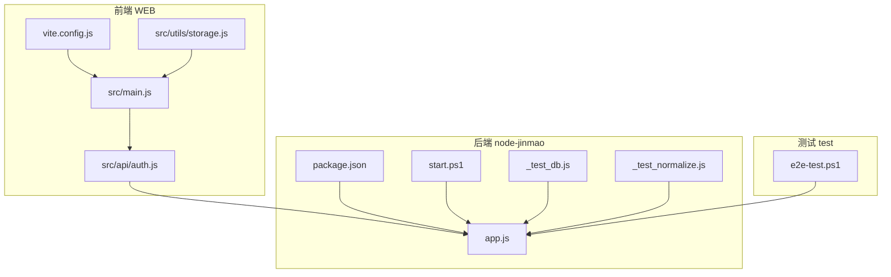
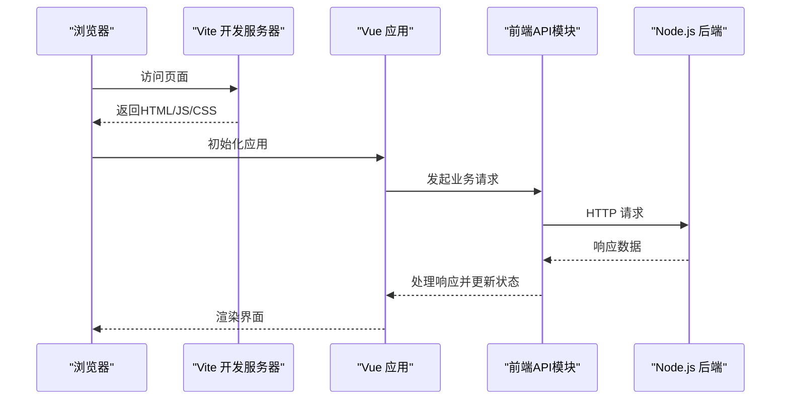
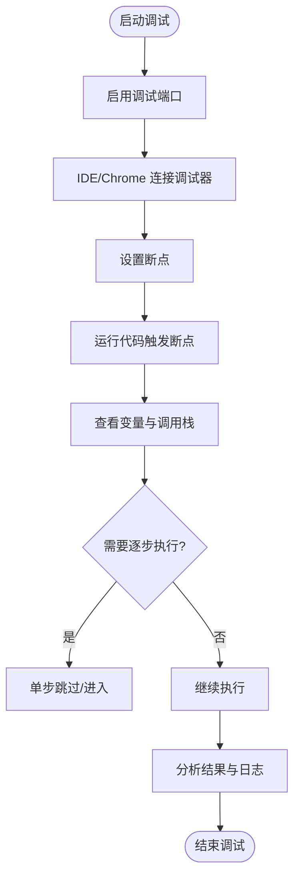
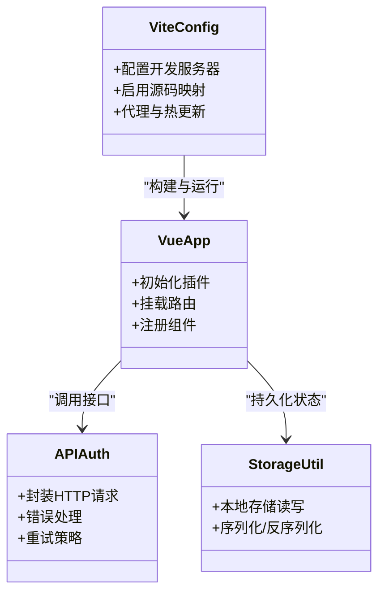
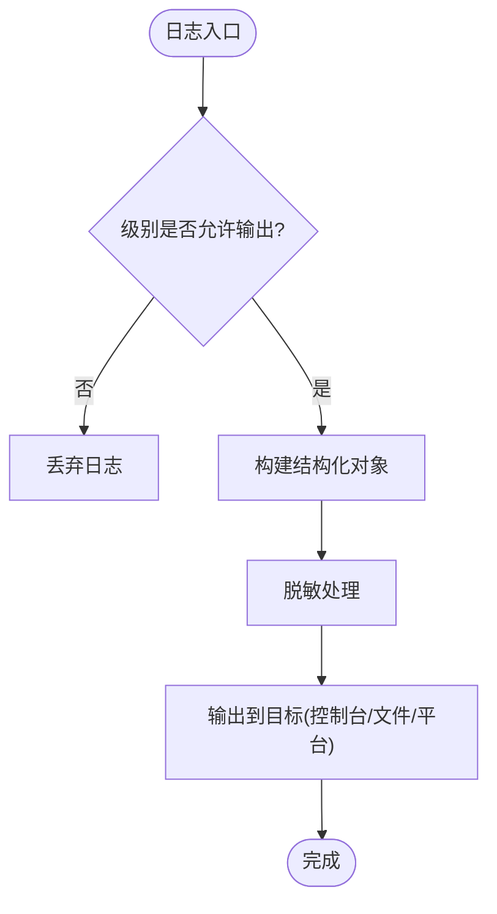
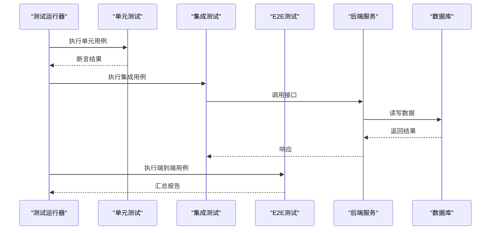
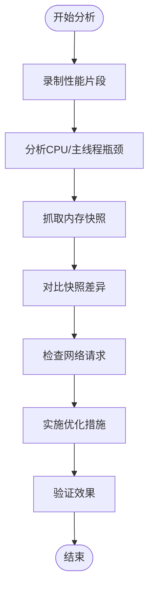
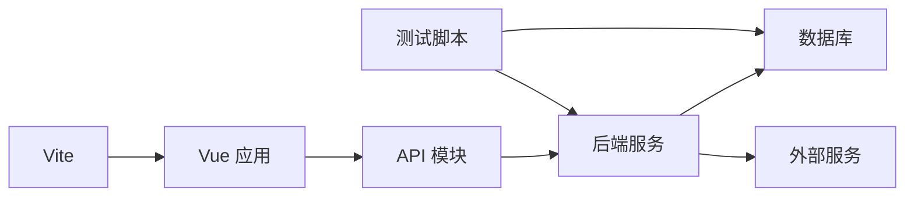

# 调试工具和技巧

<cite>
**本文档引用的文件**   
- [package.json](file://node-jinmao/package.json)
- [app.js](file://node-jinmao/app.js)
- [vite.config.js](file://WEB/vite.config.js)
- [main.js](file://WEB/src/main.js)
- [auth.js](file://WEB/src/api/auth.js)
- [storage.js](file://WEB/src/utils/storage.js)
- [start.ps1](file://node-jinmao/start.ps1)
- [_test_db.js](file://node-jinmao/_test_db.js)
- [_test_normalize.js](file://node-jinmao/_test_normalize.js)
- [e2e-test.ps1](file://test/e2e-test.ps1)
</cite>

## 目录
1. [简介](#简介)
2. [项目结构](#项目结构)
3. [核心组件](#核心组件)
4. [架构总览](#架构总览)
5. [详细组件分析](#详细组件分析)
6. [依赖关系分析](#依赖关系分析)
7. [性能注意事项](#性能注意事项)
8. [故障排查指南](#故障排查指南)
9. [结论](#结论)
10. [附录](#附录)

## 简介
本指南面向Node.js与Vue前端项目的调试实践，覆盖断点调试、变量查看、调用栈分析、Vue DevTools使用、浏览器开发者工具高级功能、日志收集与分析（结构化日志与级别管理）、测试用例编写与调试（单元/集成/E2E），以及性能分析与内存快照、网络请求监控等。内容结合仓库中的前后端入口与配置，提供可操作的步骤与最佳实践。

## 项目结构
本项目包含：
- 后端服务：node-jinmao（Express/Node.js）
- 前端应用：WEB（Vite + Vue）
- 测试脚本：test（含E2E脚本）
- 根级启动与部署脚本

图表来源
- [vite.config.js:1-200](file://WEB/vite.config.js#L1-L200)
- [main.js:1-200](file://WEB/src/main.js#L1-L200)
- [auth.js:1-200](file://WEB/src/api/auth.js#L1-L200)
- [storage.js:1-200](file://WEB/src/utils/storage.js#L1-L200)
- [package.json:1-200](file://node-jinmao/package.json#L1-L200)
- [app.js:1-200](file://node-jinmao/app.js#L1-L200)
- [start.ps1:1-200](file://node-jinmao/start.ps1#L1-L200)
- [_test_db.js:1-200](file://node-jinmao/_test_db.js#L1-L200)
- [_test_normalize.js:1-200](file://node-jinmao/_test_normalize.js#L1-L200)
- [e2e-test.ps1:1-200](file://test/e2e-test.ps1#L1-L200)

章节来源
- [package.json:1-200](file://node-jinmao/package.json#L1-L200)
- [app.js:1-200](file://node-jinmao/app.js#L1-L200)
- [vite.config.js:1-200](file://WEB/vite.config.js#L1-L200)
- [main.js:1-200](file://WEB/src/main.js#L1-L200)
- [auth.js:1-200](file://WEB/src/api/auth.js#L1-L200)
- [storage.js:1-200](file://WEB/src/utils/storage.js#L1-L200)
- [start.ps1:1-200](file://node-jinmao/start.ps1#L1-L200)
- [_test_db.js:1-200](file://node-jinmao/_test_db.js#L1-L200)
- [_test_normalize.js:1-200](file://node-jinmao/_test_normalize.js#L1-L200)
- [e2e-test.ps1:1-200](file://test/e2e-test.ps1#L1-L200)

## 核心组件
- Node.js 调试器（内置）：通过启动参数启用调试端口，配合IDE或Chrome DevTools进行断点、变量查看、调用栈分析。
- Vite 开发服务器：支持热更新与源码映射，便于前端断点调试。
- Vue DevTools：用于检查组件状态、事件流、路由与网络请求。
- 浏览器开发者工具：Network、Performance、Memory、Console、Sources等面板。
- 日志系统：建议采用结构化日志（JSON）并分级管理（debug/info/warn/error）。
- 测试框架与脚本：单元测试、集成测试与E2E脚本的调试方法。

章节来源
- [package.json:1-200](file://node-jinmao/package.json#L1-L200)
- [vite.config.js:1-200](file://WEB/vite.config.js#L1-L200)
- [main.js:1-200](file://WEB/src/main.js#L1-L200)

## 架构总览
下图展示前端到后端的典型请求链路，以及调试切入点（断点、日志、网络面板）。

图表来源
- [main.js:1-200](file://WEB/src/main.js#L1-L200)
- [auth.js:1-200](file://WEB/src/api/auth.js#L1-L200)
- [app.js:1-200](file://node-jinmao/app.js#L1-L200)

## 详细组件分析

### Node.js 调试器使用指南
- 启用调试模式：通过启动脚本或命令行参数开启调试端口，以便在IDE或Chrome中连接。
- 设置断点：在关键函数、中间件、路由处理器处设置断点，观察执行路径。
- 变量查看：在断点暂停时查看局部变量、全局对象与闭包上下文。
- 调用栈分析：利用调用栈回溯定位问题源头，关注异步回调链。
- 条件断点与日志断点：针对特定条件触发，减少干扰。
- 远程调试：在容器或远端环境通过IP+端口连接。

章节来源
- [package.json:1-200](file://node-jinmao/package.json#L1-L200)
- [app.js:1-200](file://node-jinmao/app.js#L1-L200)
- [start.ps1:1-200](file://node-jinmao/start.ps1#L1-L200)

### Vite 与 Vue 前端调试
- Vite 开发服务器：确保启用源码映射，便于断点命中源码而非打包产物。
- Vue DevTools：安装并启用，用于查看组件树、状态、事件、路由与网络请求。
- 浏览器开发者工具：
  - Sources：设置断点、查看作用域、步进执行。
  - Network：过滤请求、查看请求/响应体、重放失败请求。
  - Performance：录制性能片段，识别长任务与阻塞。
  - Memory：堆快照对比，定位内存泄漏。
  - Console：结构化日志输出与过滤。
- 常见问题：跨域、缓存、环境变量加载顺序。

图表来源
- [vite.config.js:1-200](file://WEB/vite.config.js#L1-L200)
- [main.js:1-200](file://WEB/src/main.js#L1-L200)
- [auth.js:1-200](file://WEB/src/api/auth.js#L1-L200)
- [storage.js:1-200](file://WEB/src/utils/storage.js#L1-L200)

章节来源
- [vite.config.js:1-200](file://WEB/vite.config.js#L1-L200)
- [main.js:1-200](file://WEB/src/main.js#L1-L200)
- [auth.js:1-200](file://WEB/src/api/auth.js#L1-L200)
- [storage.js:1-200](file://WEB/src/utils/storage.js#L1-L200)

### 日志收集与分析
- 结构化日志格式：每条日志为JSON对象，包含时间戳、级别、消息、上下文键值对。
- 日志级别管理：debug（开发）、info（常规）、warn（警告）、error（错误），按环境控制输出。
- 采集与聚合：统一入口记录，避免分散打印；生产环境写入文件或集中式日志平台。
- 敏感信息脱敏：避免泄露密码、令牌、个人信息。
- 查询与分析：基于字段索引快速检索，关联请求ID追踪全链路。

章节来源
- [package.json:1-200](file://node-jinmao/package.json#L1-L200)
- [app.js:1-200](file://node-jinmao/app.js#L1-L200)

### 测试用例编写与调试
- 单元测试：聚焦最小单元行为，模拟外部依赖，断言输入输出。
- 集成测试：验证模块间协作，如数据库交互、API调用。
- E2E测试：端到端流程验证，模拟用户操作。
- 调试技巧：
  - 在测试中插入断点或打印关键状态。
  - 使用隔离环境与固定数据。
  - 失败用例复现与最小化重现。
- 脚本示例：数据库测试、规范化逻辑测试、E2E自动化。

章节来源
- [_test_db.js:1-200](file://node-jinmao/_test_db.js#L1-L200)
- [_test_normalize.js:1-200](file://node-jinmao/_test_normalize.js#L1-L200)
- [e2e-test.ps1:1-200](file://test/e2e-test.ps1#L1-L200)

### 性能分析与内存快照
- 性能分析：使用浏览器Performance面板录制，识别长任务、布局抖动、重复计算。
- 内存快照：对比两次快照，查找未释放引用与增长趋势。
- 网络监控：筛选慢请求、大响应、频繁小请求，优化缓存与合并。
- Node.js侧：使用CPU Profiler与Heap Snapshot定位热点与内存占用。

章节来源
- [vite.config.js:1-200](file://WEB/vite.config.js#L1-L200)
- [package.json:1-200](file://node-jinmao/package.json#L1-L200)

## 依赖关系分析
- 前端依赖：Vite构建、Vue运行时、API客户端、存储工具。
- 后端依赖：Express/Node运行时、数据库驱动、第三方服务（如MinIO、LLM）。
- 测试依赖：测试框架、脚本工具。
- 耦合与内聚：API层与视图解耦，工具函数独立，便于替换与测试。

图表来源
- [package.json:1-200](file://node-jinmao/package.json#L1-L200)
- [vite.config.js:1-200](file://WEB/vite.config.js#L1-L200)
- [app.js:1-200](file://node-jinmao/app.js#L1-L200)

章节来源
- [package.json:1-200](file://node-jinmao/package.json#L1-L200)
- [vite.config.js:1-200](file://WEB/vite.config.js#L1-L200)
- [app.js:1-200](file://node-jinmao/app.js#L1-L200)

## 性能注意事项
- 前端：减少重绘重排、懒加载组件、缓存静态资源、压缩与分包。
- 后端：避免阻塞I/O、合理使用连接池、分页与限流、缓存热点数据。
- 日志：控制级别与频率，避免高频打印影响性能。
- 测试：并行执行、数据隔离、Mock外部依赖。

## 故障排查指南
- 启动失败：检查端口占用、环境变量、依赖安装。
- 跨域问题：配置CORS、代理转发、同源策略。
- 接口异常：查看Network面板、后端日志、数据库状态。
- 内存泄漏：对比Heap快照、检查定时器与事件监听。
- 性能瓶颈：Profile热点函数、优化算法与数据结构。

章节来源
- [app.js:1-200](file://node-jinmao/app.js#L1-L200)
- [auth.js:1-200](file://WEB/src/api/auth.js#L1-L200)
- [storage.js:1-200](file://WEB/src/utils/storage.js#L1-L200)

## 结论
通过系统化地使用Node.js调试器、浏览器开发者工具与Vue DevTools，结合结构化日志与完善的测试体系，可以高效定位问题、提升稳定性与性能。建议在开发阶段即建立调试与观测习惯，在生产环境保留必要的可观测性能力。

## 附录
- 常用命令与快捷键：断点切换、步进执行、条件断点、日志过滤。
- 推荐扩展：Vue DevTools、ESLint/Prettier、Prettier for JSON。
- 参考文档：MDN开发者工具、Node.js调试文档、Vite官方文档。