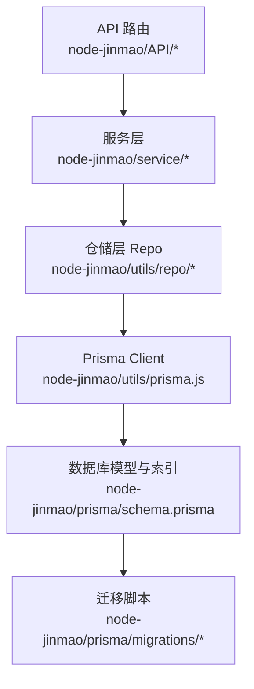
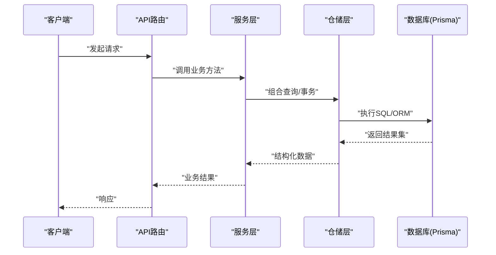

# 性能优化与索引设计

<cite>
**本文引用的文件**   
- [数据库结构.md](file://数据库结构.md)
- [prisma/schema.prisma](file://node-jinmao/prisma/schema.prisma)
- [prisma/migrations/20260704072148_init/migration.sql](file://node-jinmao/prisma/migrations/20260704072148_init/migration.sql)
- [prisma/migrations/20260709105504_add_course_and_chapter/migration.sql](file://node-jinmao/prisma/migrations/20260709105504_add_course_and_chapter/migration.sql)
- [prisma/migrations/20260709_add_subtitle_to_course/migration.sql](file://node-jinmao/prisma/migrations/20260709_add_subtitle_to_course/migration.sql)
- [prisma/migrations/20260724_add_user_study_record/migration.sql](file://node-jinmao/prisma/migrations/20260724_add_user_study_record/migration.sql)
- [prisma/migrations/20260725_add_chapter_generation_progress/migration.sql](file://node-jinmao/prisma/migrations/20260725_add_chapter_generation_progress/migration.sql)
- [prisma/migrations/20260729_add_quiz_generating_task_id/migration.sql](file://node-jinmao/prisma/migrations/20260729_add_quiz_generating_task_id/migration.sql)
- [prisma/migrations/20260729_add_user_billing_fields/migration.sql](file://node-jinmao/prisma/migrations/20260729_add_user_billing_fields/migration.sql)
- [prisma/migrations/20260729_add_user_daily_activity/migration.sql](file://node-jinmao/prisma/migrations/20260729_add_user_daily_activity/migration.sql)
- [utils/prisma.js](file://node-jinmao/utils/prisma.js)
- [API/book/list.js](file://node-jinmao/API/book/list.js)
- [API/quiz/report.js](file://node-jinmao/API/quiz/report.js)
- [service/quiz_report_service.js](file://node-jinmao/service/quiz_report_service.js)
- [repo/quiz_repo.js](file://node-jinmao/repo/quiz_repo.js)
- [utils/repo/activity_repo.js](file://node-jinmao/utils/repo/activity_repo.js)
- [utils/repo/book_repo.js](file://node-jinmao/utils/repo/book_repo.js)
- [utils/repo/chapter_repo.js](file://node-jinmao/utils/repo/chapter_repo.js)
- [utils/repo/progress_repo.js](file://node-jinmao/utils/repo/progress_repo.js)
- [utils/repo/stats_repo.js](file://node-jinmao/utils/repo/stats_repo.js)
- [API/billing.js](file://node-jinmao/API/billing.js)
</cite>

## 目录
1. [引言](#引言)
2. [项目结构](#项目结构)
3. [核心组件](#核心组件)
4. [架构总览](#架构总览)
5. [详细组件分析](#详细组件分析)
6. [依赖关系分析](#依赖关系分析)
7. [性能考量](#性能考量)
8. [故障排查指南](#故障排查指南)
9. [结论](#结论)
10. [附录](#附录)

## 引言
本文件面向“金毛教你学重构版”项目的数据库性能优化，聚焦以下目标：
- 索引设计原则与复合索引策略
- 慢查询识别与优化技巧、EXPLAIN执行计划解读
- 连接池配置、查询缓存策略、读写分离方案
- 大数据量分页优化、全文搜索实现、聚合查询优化
- 监控指标、瓶颈定位与容量规划建议
- 内存使用、磁盘I/O、网络传输优化最佳实践

文档以仓库中的Prisma Schema、迁移脚本、数据访问层（Repo）与服务层代码为依据，给出可落地的优化路径与实践清单。

## 项目结构
本项目后端采用Node.js + Prisma ORM，数据库模型定义在schema.prisma中，并通过多版本迁移脚本演进。数据访问通过utils/repo下的仓储模块封装，业务服务位于service目录，API路由位于API目录。

图表来源
- [utils/prisma.js](file://node-jinmao/utils/prisma.js)
- [prisma/schema.prisma](file://node-jinmao/prisma/schema.prisma)
- [prisma/migrations/20260704072148_init/migration.sql](file://node-jinmao/prisma/migrations/20260704072148_init/migration.sql)

章节来源
- [数据库结构.md](file://数据库结构.md)
- [prisma/schema.prisma](file://node-jinmao/prisma/schema.prisma)

## 核心组件
- 数据模型与索引：集中在Prisma Schema与迁移脚本中，涵盖课程、章节、题库、用户学习记录、账单与活动统计等实体。
- 数据访问层：按领域拆分仓储（book_repo、chapter_repo、activity_repo、stats_repo、progress_repo），统一封装查询与事务。
- 服务层：聚合多个仓储调用，完成复杂业务逻辑（如报告生成、计费统计）。
- API层：对外暴露REST接口，串联服务层并返回结果。

章节来源
- [prisma/schema.prisma](file://node-jinmao/prisma/schema.prisma)
- [utils/repo/book_repo.js](file://node-jinmao/utils/repo/book_repo.js)
- [utils/repo/chapter_repo.js](file://node-jinmao/utils/repo/chapter_repo.js)
- [utils/repo/activity_repo.js](file://node-jinmao/utils/repo/activity_repo.js)
- [utils/repo/stats_repo.js](file://node-jinmao/utils/repo/stats_repo.js)
- [utils/repo/progress_repo.js](file://node-jinmao/utils/repo/progress_repo.js)
- [service/quiz_report_service.js](file://node-jinmao/service/quiz_report_service.js)
- [API/book/list.js](file://node-jinmao/API/book/list.js)
- [API/quiz/report.js](file://node-jinmao/API/quiz/report.js)

## 架构总览
下图展示从请求到数据库的完整链路，以及关键的性能关注点（索引、分页、聚合、缓存）。

图表来源
- [API/book/list.js](file://node-jinmao/API/book/list.js)
- [service/quiz_report_service.js](file://node-jinmao/service/quiz_report_service.js)
- [utils/prisma.js](file://node-jinmao/utils/prisma.js)

## 详细组件分析

### 数据模型与索引设计
- 主键与唯一约束：确保实体唯一性与关联完整性，避免重复写入与冲突。
- 外键与关联索引：为频繁JOIN的字段建立索引，降低关联扫描成本。
- 查询热点字段索引：针对WHERE、ORDER BY、GROUP BY常用列创建单列或复合索引。
- 复合索引策略：遵循最左前缀原则，将高选择性列放在前面；覆盖常见过滤+排序组合。
- 全文搜索：对文本字段启用全文索引或使用外部搜索引擎（如Elasticsearch），避免LIKE模糊匹配。
- 分区与归档：对超大表按时间或范围分区，历史数据归档以降低在线库压力。

章节来源
- [prisma/schema.prisma](file://node-jinmao/prisma/schema.prisma)
- [prisma/migrations/20260704072148_init/migration.sql](file://node-jinmao/prisma/migrations/20260704072148_init/migration.sql)
- [prisma/migrations/20260709105504_add_course_and_chapter/migration.sql](file://node-jinmao/prisma/migrations/20260709105504_add_course_and_chapter/migration.sql)
- [prisma/migrations/20260709_add_subtitle_to_course/migration.sql](file://node-jinmao/prisma/migrations/20260709_add_subtitle_to_course/migration.sql)
- [prisma/migrations/20260724_add_user_study_record/migration.sql](file://node-jinmao/prisma/migrations/20260724_add_user_study_record/migration.sql)
- [prisma/migrations/20260725_add_chapter_generation_progress/migration.sql](file://node-jinmao/prisma/migrations/20260725_add_chapter_generation_progress/migration.sql)
- [prisma/migrations/20260729_add_quiz_generating_task_id/migration.sql](file://node-jinmao/prisma/migrations/20260729_add_quiz_generating_task_id/migration.sql)
- [prisma/migrations/20260729_add_user_billing_fields/migration.sql](file://node-jinmao/prisma/migrations/20260729_add_user_billing_fields/migration.sql)
- [prisma/migrations/20260729_add_user_daily_activity/migration.sql](file://node-jinmao/prisma/migrations/20260729_add_user_daily_activity/migration.sql)

### 仓储层与查询模式
- 列表查询：优先使用分页（limit/offset或游标）、必要字段投影、合适索引覆盖过滤与排序。
- 聚合统计：尽量在数据库侧完成SUM/COUNT/GROUP BY，减少数据传输与内存占用。
- 事务与并发：批量写入使用事务，控制锁粒度，避免长事务阻塞。
- 读写分离：读多写少场景下，将报表类查询路由至只读副本，减轻主库压力。

章节来源
- [utils/repo/book_repo.js](file://node-jinmao/utils/repo/book_repo.js)
- [utils/repo/chapter_repo.js](file://node-jinmao/utils/repo/chapter_repo.js)
- [utils/repo/activity_repo.js](file://node-jinmao/utils/repo/activity_repo.js)
- [utils/repo/stats_repo.js](file://node-jinmao/utils/repo/stats_repo.js)
- [utils/repo/progress_repo.js](file://node-jinmao/utils/repo/progress_repo.js)

### 服务层与复杂查询
- 报告生成：聚合多表数据，建议预计算或物化视图，结合定时任务更新。
- 计费统计：高频聚合，考虑增量更新与缓存，避免每次全量计算。
- 任务流：异步任务与状态持久化，避免同步阻塞。

章节来源
- [service/quiz_report_service.js](file://node-jinmao/service/quiz_report_service.js)
- [API/quiz/report.js](file://node-jinmao/API/quiz/report.js)
- [repo/quiz_repo.js](file://node-jinmao/repo/quiz_repo.js)

### API层与性能要点
- 列表接口：强制分页、限制返回字段、缓存热点数据。
- 统计接口：异步化与限流，避免瞬时高峰拖垮数据库。
- 错误处理：超时与重试策略，保护下游资源。

章节来源
- [API/book/list.js](file://node-jinmao/API/book/list.js)
- [API/billing.js](file://node-jinmao/API/billing.js)

## 依赖关系分析
仓储层依赖Prisma Client，服务层依赖仓储层，API层依赖服务层。清晰的层次边界有助于定位性能瓶颈与优化点。

图表来源
- [utils/prisma.js](file://node-jinmao/utils/prisma.js)
- [prisma/schema.prisma](file://node-jinmao/prisma/schema.prisma)

章节来源
- [utils/prisma.js](file://node-jinmao/utils/prisma.js)
- [prisma/schema.prisma](file://node-jinmao/prisma/schema.prisma)

## 性能考量

### 索引设计原则
- 选择性优先：高区分度列优先建索引（如ID、唯一编码）。
- 覆盖索引：将WHERE、ORDER BY、SELECT字段纳入索引，减少回表。
- 复合索引顺序：过滤条件在前，排序在后；避免过度索引导致写入放大。
- 函数与表达式：谨慎使用，必要时引入生成列或冗余字段。

章节来源
- [prisma/schema.prisma](file://node-jinmao/prisma/schema.prisma)
- [prisma/migrations/20260704072148_init/migration.sql](file://node-jinmao/prisma/migrations/20260704072148_init/migration.sql)

### 复合索引创建策略
- 典型模式：user_id + created_at用于按用户时间线分页。
- 典型模式：course_id + status用于课程任务筛选。
- 典型模式：topic + difficulty用于题库检索。

章节来源
- [prisma/migrations/20260724_add_user_study_record/migration.sql](file://node-jinmao/prisma/migrations/20260724_add_user_study_record/migration.sql)
- [prisma/migrations/20260729_add_quiz_generating_task_id/migration.sql](file://node-jinmao/prisma/migrations/20260729_add_quiz_generating_task_id/migration.sql)

### 慢查询识别与优化技巧
- 识别方式：开启慢查询日志、监控平均耗时与P95/P99延迟。
- 优化手段：添加/调整索引、改写SQL（避免SELECT *、减少子查询）、分页优化（游标替代offset）。
- 执行计划：使用EXPLAIN分析扫描类型、索引选择、临时表与文件排序。

章节来源
- [utils/prisma.js](file://node-jinmao/utils/prisma.js)
- [service/quiz_report_service.js](file://node-jinmao/service/quiz_report_service.js)

### EXPLAIN分析结果解读
- 关注点：type（ALL/INDEX/RANGE/REF/const）、rows、Extra（Using where/Using index/Using temporary/Using filesort）。
- 优化方向：让查询走ref/range，避免全表扫描与文件排序；尽量使用覆盖索引。

章节来源
- [prisma/schema.prisma](file://node-jinmao/prisma/schema.prisma)

### 执行计划优化
- 避免隐式转换导致索引失效。
- 合理使用LIMIT与OFFSET，或改用基于游标的分页。
- 将大对象与热数据分离，减少行宽。

章节来源
- [utils/repo/book_repo.js](file://node-jinmao/utils/repo/book_repo.js)
- [utils/repo/chapter_repo.js](file://node-jinmao/utils/repo/chapter_repo.js)

### 数据库连接池配置
- 合理设置最大连接数与空闲回收时间，避免连接泄漏与耗尽。
- 根据CPU核数与IO特性调优，观察连接等待与队列长度。

章节来源
- [utils/prisma.js](file://node-jinmao/utils/prisma.js)

### 查询缓存策略
- 应用层缓存：Redis缓存热点查询结果，设置合理的TTL与失效策略。
- 数据库层缓存：调整缓冲池大小，减少磁盘读取。
- 结果缓存：对报表类接口做定时刷新与增量更新。

章节来源
- [service/quiz_report_service.js](file://node-jinmao/service/quiz_report_service.js)
- [API/billing.js](file://node-jinmao/API/billing.js)

### 读写分离方案
- 读多写少：报表与统计走只读副本，主库专注事务写入。
- 一致性：强一致场景避免直接读副本，必要时使用主库或事件同步。

章节来源
- [utils/prisma.js](file://node-jinmao/utils/prisma.js)

### 大数据量分页优化
- 游标分页：基于唯一键（如created_at + id）进行高效翻页。
- 延迟关联：先查ID再关联详情，减少回表开销。

章节来源
- [utils/repo/activity_repo.js](file://node-jinmao/utils/repo/activity_repo.js)
- [utils/repo/progress_repo.js](file://node-jinmao/utils/repo/progress_repo.js)

### 全文搜索实现
- 数据库内置全文索引：适用于中等规模文本检索。
- 外部搜索引擎：Elasticsearch提供高性能全文检索与聚合能力。

章节来源
- [prisma/schema.prisma](file://node-jinmao/prisma/schema.prisma)

### 聚合查询优化
- 预计算与物化视图：定时任务更新汇总数据，查询时直接读取。
- 增量更新：仅变更部分数据，避免全量重算。

章节来源
- [service/quiz_report_service.js](file://node-jinmao/service/quiz_report_service.js)
- [utils/repo/stats_repo.js](file://node-jinmao/utils/repo/stats_repo.js)

### 监控指标与瓶颈定位
- 关键指标：QPS、延迟分布、连接数、锁等待、慢查询数量、缓存命中率。
- 工具：数据库慢查询日志、APM、系统监控（CPU、内存、磁盘I/O、网络）。

章节来源
- [utils/prisma.js](file://node-jinmao/utils/prisma.js)
- [service/quiz_report_service.js](file://node-jinmao/service/quiz_report_service.js)

### 容量规划建议
- 评估增长趋势：按日增数据量与峰值QPS规划存储与实例规格。
- 分库分表：热点表按用户或时间维度拆分，提升扩展性。
- 冷热分层：热数据放SSD，冷数据归档至低成本存储。

章节来源
- [prisma/migrations/20260729_add_user_daily_activity/migration.sql](file://node-jinmao/prisma/migrations/20260729_add_user_daily_activity/migration.sql)

### 内存使用优化
- 控制结果集大小：限制返回字段与行数，避免大对象加载。
- 批处理：分批写入与读取，降低内存峰值。

章节来源
- [utils/repo/book_repo.js](file://node-jinmao/utils/repo/book_repo.js)
- [utils/repo/chapter_repo.js](file://node-jinmao/utils/repo/chapter_repo.js)

### 磁盘I/O优化
- 索引适度：过多索引会增大写入放大与空间占用。
- 表结构优化：避免过大VARCHAR/BLOB，拆分大字段。

章节来源
- [prisma/schema.prisma](file://node-jinmao/prisma/schema.prisma)

### 网络传输优化
- 压缩与协议：启用HTTP压缩，使用gRPC或GraphQL按需取字段。
- 连接复用：保持长连接，减少握手开销。

章节来源
- [API/book/list.js](file://node-jinmao/API/book/list.js)
- [API/billing.js](file://node-jinmao/API/billing.js)

## 故障排查指南
- 慢查询定位：查看慢查询日志与执行计划，确认是否缺少索引或索引未命中。
- 连接池问题：检查连接泄漏、超时与最大连接数配置，观察连接等待队列。
- 锁与死锁：分析锁等待链，缩短事务，避免跨表长事务。
- 缓存失效风暴：设置随机TTL与预热机制，避免集中失效。

章节来源
- [utils/prisma.js](file://node-jinmao/utils/prisma.js)
- [service/quiz_report_service.js](file://node-jinmao/service/quiz_report_service.js)

## 结论
通过合理的索引设计、查询改写与缓存策略，配合连接池与读写分离，可以显著提升数据库性能与稳定性。持续监控与容量规划是长期保障的关键。

## 附录
- 常用优化清单：
  - 为WHERE/ORDER BY/GROUP BY高频列建立索引
  - 使用覆盖索引减少回表
  - 分页采用游标或延迟关联
  - 报表类查询异步化与预计算
  - 热点数据缓存与失效策略
  - 监控慢查询与执行计划，定期复盘

[无章节来源：本节为通用实践总结]