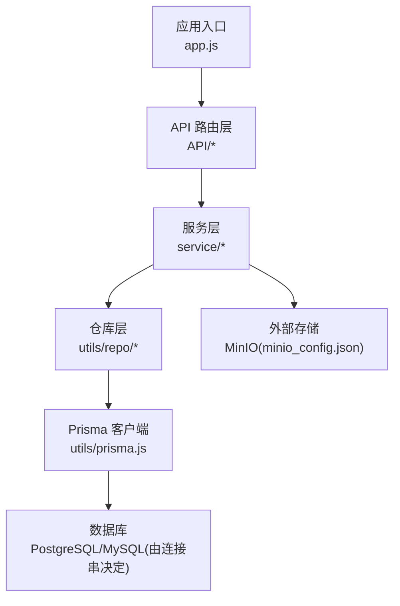
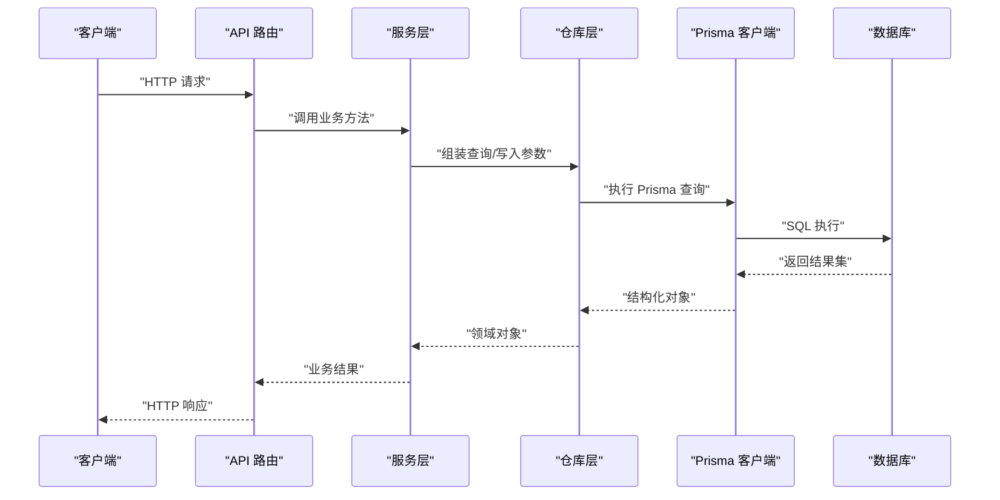
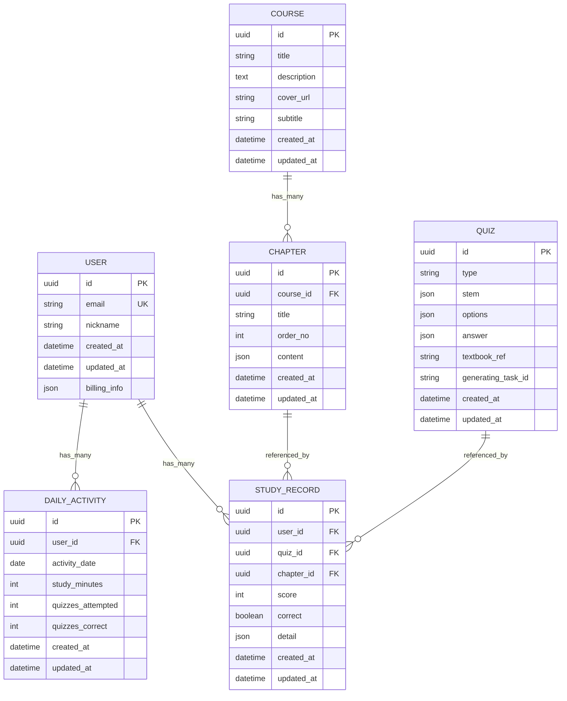
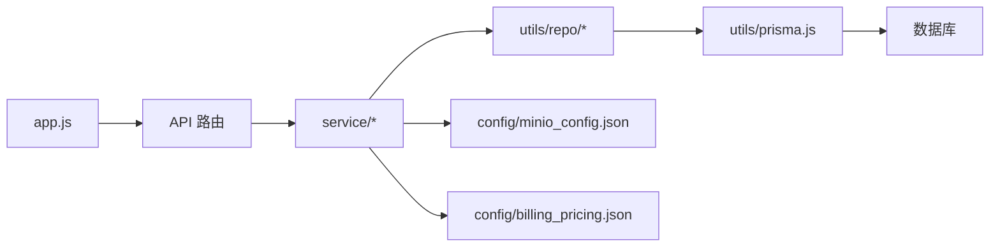

# 数据库设计

<cite>
**本文引用的文件**   
- [schema.prisma](file://node-jinmao/prisma/schema.prisma)
- [20260704072148_init/migration.sql](file://node-jinmao/prisma/migrations/20260704072148_init/migration.sql)
- [20260709105504_add_course_and_chapter/migration.sql](file://node-jinmao/prisma/migrations/20260709105504_add_course_and_chapter/migration.sql)
- [20260709_add_subtitle_to_course/migration.sql](file://node-jinmao/prisma/migrations/20260709_add_subtitle_to_course/migration.sql)
- [20260724_add_user_study_record/migration.sql](file://node-jinmao/prisma/migrations/20260724_add_user_study_record/migration.sql)
- [20260725_add_chapter_generation_progress/migration.sql](file://node-jinmao/prisma/migrations/20260725_add_chapter_generation进度/migration.sql)
- [20260729_add_quiz_generating_task_id/migration.sql](file://node-jinmao/prisma/migrations/20260729_add_quiz_generating_task_id/migration.sql)
- [20260729_add_user_billing_fields/migration.sql](file://node-jinmao/prisma/migrations/20260729_add_user_billing_fields/migration.sql)
- [20260729_add_user_daily_activity/migration.sql](file://node-jinmao/prisma/migrations/20260729_add_user_daily_activity/migration.sql)
- [migration_lock.toml](file://node-jinmao/prisma/migrations/migration_lock.toml)
- [prisma.js](file://node-jinmao/utils/prisma.js)
- [progress_repo.js](file://node-jinmao/utils/repo/progress_repo.js)
- [activity_repo.js](file://node-jinmao/utils/repo/activity_repo.js)
- [book_repo.js](file://node-jinmao/utils/repo/book_repo.js)
- [chapter_repo.js](file://node-jinmao/utils/repo/chapter_repo.js)
- [stats_repo.js](file://node-jinmao/utils/repo/stats_repo.js)
- [update_repo.js](file://node-jinmao/utils/repo/update_repo.js)
- [quiz_service.js](file://node-jinmao/service/quiz_service.js)
- [course_pipeline.js](file://node-jinmao/service/course_pipeline.js)
- [auth/login.js](file://node-jinmao/service/auth/login.js)
- [billing_pricing.json](file://node-jinmao/config/billing_pricing.json)
- [minio_config.json](file://node-jinmao/config/minio_config.json)
- [app.js](file://node-jinmao/app.js)
</cite>

## 目录
1. [引言](#引言)
2. [项目结构](#项目结构)
3. [核心组件](#核心组件)
4. [架构总览](#架构总览)
5. [详细组件分析](#详细组件分析)
6. [依赖关系分析](#依赖关系分析)
7. [性能考虑](#性能考虑)
8. [故障排查指南](#故障排查指南)
9. [结论](#结论)
10. [附录](#附录)

## 引言
本文件面向“金毛教你学重构版”的数据库设计与数据访问实践，基于 Prisma ORM 对模型、关系、约束与迁移进行系统化说明。文档覆盖用户表、题目表、课程表、学习记录表等核心数据模型的结构设计、字段类型选择与约束策略；给出迁移管理、版本控制、备份恢复方案；并提供查询优化、索引设计、事务与批量操作、分页查询等最佳实践与安全策略建议。

## 项目结构
后端采用 Node.js + Express（或类似框架）+ Prisma ORM 的架构。Prisma 的 schema 定义位于 prisma/schema.prisma，所有数据库变更通过 migrations 目录下的 SQL 脚本演进，应用层通过 utils/prisma.js 获取 PrismaClient 实例，业务服务通过 repo 层封装数据访问。

图表来源
- [app.js](file://node-jinmao/app.js)
- [prisma.js](file://node-jinmao/utils/prisma.js)
- [minio_config.json](file://node-jinmao/config/minio_config.json)

章节来源
- [app.js](file://node-jinmao/app.js)
- [prisma.js](file://node-jinmao/utils/prisma.js)

## 核心组件
- 数据模型定义：集中在 Prisma Schema，描述实体、字段、关系与约束。
- 迁移管理：migrations 目录按时间戳命名，包含增量 SQL 与锁定文件。
- 数据访问：repo 层封装 CRUD、聚合统计、分页与批量操作。
- 服务编排：service 层组合多个 repo 调用，处理业务流程与事务边界。
- 配置与集成：环境变量与配置文件（如 MinIO、计费定价）。

章节来源
- [schema.prisma](file://node-jinmao/prisma/schema.prisma)
- [migration_lock.toml](file://node-jinmao/prisma/migrations/migration_lock.toml)
- [prisma.js](file://node-jinmao/utils/prisma.js)
- [progress_repo.js](file://node-jinmao/utils/repo/progress_repo.js)
- [activity_repo.js](file://node-jinmao/utils/repo/activity_repo.js)
- [book_repo.js](file://node-jinmao/utils/repo/book_repo.js)
- [chapter_repo.js](file://node-jinmao/utils/repo/chapter_repo.js)
- [stats_repo.js](file://node-jinmao/utils/repo/stats_repo.js)
- [update_repo.js](file://node-jinmao/utils/repo/update_repo.js)
- [quiz_service.js](file://node-jinmao/service/quiz_service.js)
- [course_pipeline.js](file://node-jinmao/service/course_pipeline.js)
- [billing_pricing.json](file://node-jinmao/config/billing_pricing.json)
- [minio_config.json](file://node-jinmao/config/minio_config.json)

## 架构总览
下图展示从请求到数据落库的关键路径，以及 Prisma 在其中的角色。

图表来源
- [app.js](file://node-jinmao/app.js)
- [quiz_service.js](file://node-jinmao/service/quiz_service.js)
- [progress_repo.js](file://node-jinmao/utils/repo/progress_repo.js)
- [prisma.js](file://node-jinmao/utils/prisma.js)

## 详细组件分析

### 数据模型与实体关系（ER 图）
以下 ER 图概括了用户、课程、章节、题目、学习记录、每日活动、计费字段等核心实体的关系。实际字段以 schema.prisma 为准。

图表来源
- [schema.prisma](file://node-jinmao/prisma/schema.prisma)
- [20260704072148_init/migration.sql](file://node-jinmao/prisma/migrations/20260704072148_init/migration.sql)
- [20260709105504_add_course_and_chapter/migration.sql](file://node-jinmao/prisma/migrations/20260709105504_add_course_and_chapter/migration.sql)
- [20260709_add_subtitle_to_course/migration.sql](file://node-jinmao/prisma/migrations/20260709_add_subtitle_to_course/migration.sql)
- [20260724_add_user_study_record/migration.sql](file://node-jinmao/prisma/migrations/20260724_add_user_study_record/migration.sql)
- [20260729_add_quiz_generating_task_id/migration.sql](file://node-jinmao/prisma/migrations/20260729_add_quiz_generating_task_id/migration.sql)
- [20260729_add_user_billing_fields/migration.sql](file://node-jinmao/prisma/migrations/20260729_add_user_billing_fields/migration.sql)
- [20260729_add_user_daily_activity/migration.sql](file://node-jinmao/prisma/migrations/20260729_add_user_daily_activity/migration.sql)

章节来源
- [schema.prisma](file://node-jinmao/prisma/schema.prisma)

### 用户表（User）
- 主键：uuid
- 唯一性：邮箱唯一
- 扩展字段：昵称、创建/更新时间
- 计费信息：JSON 字段用于存储订阅/配额等动态信息
- 关联：一对多学习记录、一对多每日活动

章节来源
- [schema.prisma](file://node-jinmao/prisma/schema.prisma)
- [20260729_add_user_billing_fields/migration.sql](file://node-jinmao/prisma/migrations/20260729_add_user_billing_fields/migration.sql)

### 课程表（Course）与章节表（Chapter）
- Course 包含标题、描述、封面 URL、字幕字段（后续迁移添加）、时间戳
- Chapter 属于 Course，有序号、内容（JSON），便于富文本/多媒体嵌入
- 关系：一个课程对应多个章节

章节来源
- [schema.prisma](file://node-jinmao/prisma/schema.prisma)
- [20260709105504_add_course_and_chapter/migration.sql](file://node-jinmao/prisma/migrations/20260709105504_add_course_and_chapter/migration.sql)
- [20260709_add_subtitle_to_course/migration.sql](file://node-jinmao/prisma/migrations/20260709_add_subtitle_to_course/migration.sql)

### 题目表（Quiz）
- 题型：选择题、判断题、填空题、作文题等（type）
- 题干与选项：使用 JSON 灵活存储不同题型的结构
- 答案：JSON 存储标准答案或评分规则
- 生成任务 ID：用于异步生成题目的任务追踪
- 关联：被学习记录引用

章节来源
- [schema.prisma](file://node-jinmao/prisma/schema.prisma)
- [20260729_add_quiz_generating_task_id/migration.sql](file://node-jinmao/prisma/migrations/20260729_add_quiz_generating_task_id/migration.sql)

### 学习记录表（StudyRecord）
- 维度：用户、题目、章节
- 指标：得分、是否正确、详情（JSON）
- 用途：错题本、报告、统计

章节来源
- [schema.prisma](file://node-jinmao/prisma/schema.prisma)
- [20260724_add_user_study_record/migration.sql](file://node-jinmao/prisma/migrations/20260724_add_user_study_record/migration.sql)

### 每日活动表（DailyActivity）
- 按天聚合用户学习行为：学习时长、答题次数、正确次数
- 用途：活跃度统计、激励体系

章节来源
- [schema.prisma](file://node-jinmao/prisma/schema.prisma)
- [20260729_add_user_daily_activity/migration.sql](file://node-jinmao/prisma/migrations/20260729_add_user_daily_activity/migration.sql)

### 章节生成进度（ChapterGenerationProgress）
- 用于章节内容生成的中间状态跟踪（迁移存在但名称可能因空格导致路径差异，请以实际文件名为准）

章节来源
- [20260725_add_chapter_generation_progress/migration.sql](file://node-jinmao/prisma/migrations/20260725_add_chapter_generation_progress/migration.sql)

### 数据访问模式与仓库层
- progress_repo.js：学习记录的读写、聚合统计、分页
- activity_repo.js：每日活动的写入与查询
- book_repo.js / chapter_repo.js：书籍与章节的 CRUD
- stats_repo.js：跨表统计（如正确率、学习时长）
- update_repo.js：批量更新与幂等更新

章节来源
- [progress_repo.js](file://node-jinmao/utils/repo/progress_repo.js)
- [activity_repo.js](file://node-jinmao/utils/repo/activity_repo.js)
- [book_repo.js](file://node-jinmao/utils/repo/book_repo.js)
- [chapter_repo.js](file://node-jinmao/utils/repo/chapter_repo.js)
- [stats_repo.js](file://node-jinmao/utils/repo/stats_repo.js)
- [update_repo.js](file://node-jinmao/utils/repo/update_repo.js)

### 服务层与事务
- quiz_service.js：题目导入、判分、报告生成等流程，常涉及多步写入与回滚
- course_pipeline.js：课程与章节生成流水线，协调 LLM 与存储

章节来源
- [quiz_service.js](file://node-jinmao/service/quiz_service.js)
- [course_pipeline.js](file://node-jinmao/service/course_pipeline.js)

### 认证与权限
- auth/login.js：登录流程，结合 JWT 鉴权
- 权限控制：基于角色的接口保护与资源隔离（如用户仅能访问自己的学习记录）

章节来源
- [auth/login.js](file://node-jinmao/service/auth/login.js)

## 依赖关系分析
- 应用入口 app.js 挂载路由与服务
- 服务层依赖仓库层，仓库层通过 Prisma 客户端访问数据库
- 配置驱动外部存储（MinIO）与计费策略（billing_pricing.json）

图表来源
- [app.js](file://node-jinmao/app.js)
- [prisma.js](file://node-jinmao/utils/prisma.js)
- [minio_config.json](file://node-jinmao/config/minio_config.json)
- [billing_pricing.json](file://node-jinmao/config/billing_pricing.json)

章节来源
- [app.js](file://node-jinmao/app.js)
- [prisma.js](file://node-jinmao/utils/prisma.js)

## 性能考虑
- 索引设计原则
  - 高频过滤字段加索引：如 StudyRecord.user_id、StudyRecord.quiz_id、DailyActivity.user_id + activity_date 复合索引
  - 外键字段建立索引以提升 JOIN 性能
  - 避免过度索引，权衡写入开销
- 查询优化技巧
  - 只取必要字段，减少网络与序列化开销
  - 使用分页（limit/offset 或游标）避免大结果集
  - 聚合查询尽量在数据库侧完成（COUNT/SUM/AVG）
- 批量操作
  - 使用 Prisma 的批量写入（createMany/upsertMany）降低往返
  - 分批提交，控制事务大小
- 缓存与异步
  - 热点数据缓存（Redis）
  - 长任务异步化（题目生成、章节生成）

[本节为通用指导，不直接分析具体文件]

## 故障排查指南
- 迁移失败
  - 检查 migration_lock.toml 与当前迁移顺序
  - 查看对应 migration.sql 是否可逆
- 连接异常
  - 校验 prisma.js 中的连接串与环境变量
- 数据不一致
  - 检查事务边界与回滚逻辑
  - 核对外键约束与级联删除策略
- 性能问题
  - 使用 EXPLAIN 分析慢查询
  - 检查缺失索引与 N+1 查询

章节来源
- [migration_lock.toml](file://node-jinmao/prisma/migrations/migration_lock.toml)
- [prisma.js](file://node-jinmao/utils/prisma.js)

## 结论
本项目以 Prisma Schema 为核心，配合迁移与仓库层实现清晰的数据模型与数据访问边界。通过合理的索引、事务与批量策略，可在保证一致性的同时提升性能。建议在后续迭代中持续完善监控与审计，强化数据安全与权限控制。

[本节为总结，不直接分析具体文件]

## 附录

### 迁移管理与版本控制
- 迁移策略
  - 每次变更生成独立迁移目录，命名含时间戳
  - 保持向后兼容，避免破坏性变更
  - 使用 migration_lock 锁定已应用的迁移
- 版本控制
  - 将 migrations 目录纳入版本控制
  - 发布前执行 dry-run 验证迁移
- 回滚与升级
  - 生产环境谨慎回滚，优先新增字段而非删除
  - 灰度发布与双写过渡

章节来源
- [20260704072148_init/migration.sql](file://node-jinmao/prisma/migrations/20260704072148_init/migration.sql)
- [20260709105504_add_course_and_chapter/migration.sql](file://node-jinmao/prisma/migrations/20260709105504_add_course_and_chapter/migration.sql)
- [20260709_add_subtitle_to_course/migration.sql](file://node-jinmao/prisma/migrations/20260709_add_subtitle_to_course/migration.sql)
- [20260724_add_user_study_record/migration.sql](file://node-jinmao/prisma/migrations/20260724_add_user_study_record/migration.sql)
- [20260725_add_chapter_generation_progress/migration.sql](file://node-jinmao/prisma/migrations/20260725_add_chapter_generation_progress/migration.sql)
- [20260729_add_quiz_generating_task_id/migration.sql](file://node-jinmao/prisma/migrations/20260729_add_quiz_generating_task_id/migration.sql)
- [20260729_add_user_billing_fields/migration.sql](file://node-jinmao/prisma/migrations/20260729_add_user_billing_fields/migration.sql)
- [20260729_add_user_daily_activity/migration.sql](file://node-jinmao/prisma/migrations/20260729_add_user_daily_activity/migration.sql)
- [migration_lock.toml](file://node-jinmao/prisma/migrations/migration_lock.toml)

### 数据备份与恢复
- 全量备份：定期导出数据库快照
- 增量备份：开启 WAL 日志（PostgreSQL）或 binlog（MySQL）
- 恢复演练：定期演练恢复流程，确保 RTO/RPO 达标
- 敏感数据脱敏：备份前对个人信息进行脱敏

[本节为通用指导，不直接分析具体文件]

### 数据安全与权限控制
- 敏感信息加密
  - 密码哈希存储（bcrypt/argon2）
  - 令牌与密钥使用环境变量与密钥管理服务
- 访问权限控制
  - 接口级鉴权（JWT）
  - 行级权限（用户仅访问自身数据）
- 审计与合规
  - 关键操作留痕
  - 数据最小化采集

[本节为通用指导，不直接分析具体文件]

### 样例数据（示例结构）
以下为典型记录的结构示意（非真实数据）：
- 用户：id、email、nickname、created_at、updated_at、billing_info
- 课程：id、title、description、cover_url、subtitle、created_at、updated_at
- 章节：id、course_id、title、order_no、content、created_at、updated_at
- 题目：id、type、stem、options、answer、textbook_ref、generating_task_id、created_at、updated_at
- 学习记录：id、user_id、quiz_id、chapter_id、score、correct、detail、created_at、updated_at
- 每日活动：id、user_id、activity_date、study_minutes、quizzes_attempted、quizzes_correct、created_at、updated_at

[本节为概念性说明，不直接分析具体文件]