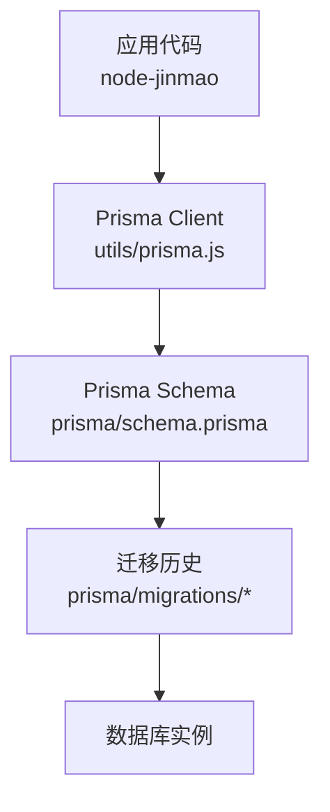
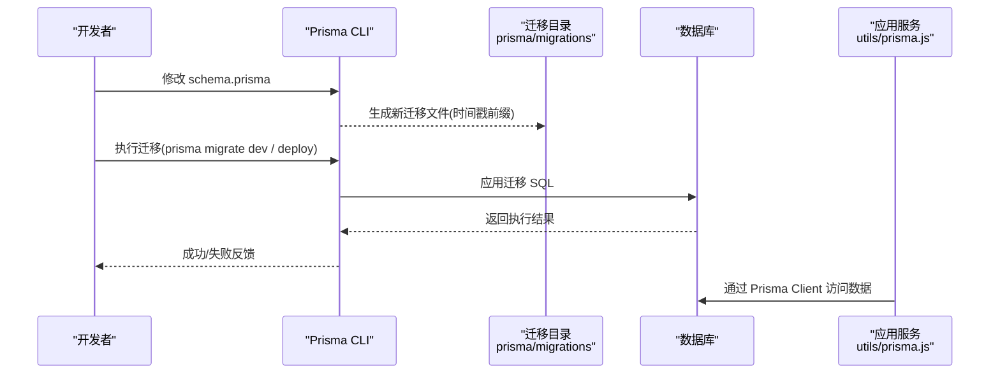
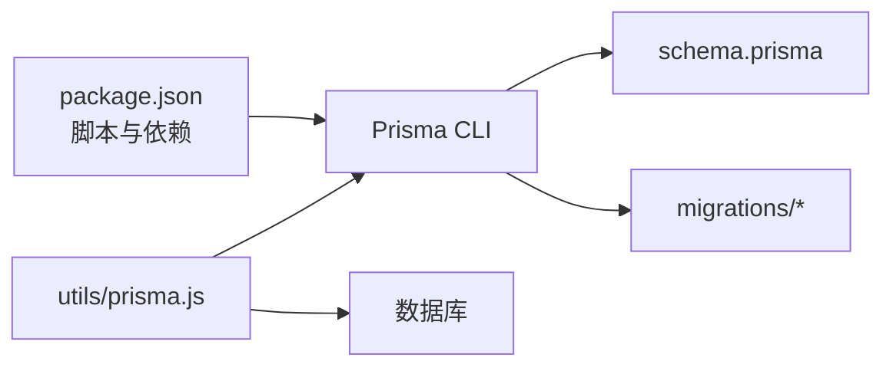

# 数据库迁移管理

<cite>
**本文引用的文件**   
- [schema.prisma](file://node-jinmao/prisma/schema.prisma)
- [migration_lock.toml](file://node-jinmao/prisma/migrations/migration_lock.toml)
- [20260704072148_init/migration.sql](file://node-jinmao/prisma/migrations/20260704072148_init/migration.sql)
- [20260709105504_add_course_and_chapter/migration.sql](file://node-jinmao/prisma/migrations/20260709105504_add_course_and_chapter/migration.sql)
- [20260709_add_subtitle_to_course/migration.sql](file://node-jinmao/prisma/migrations/20260709_add_subtitle_to_course/migration.sql)
- [20260724_add_user_study_record/migration.sql](file://node-jinmao/prisma/migrations/20260724_add_user_study_record/migration.sql)
- [20260725_add_chapter_generation_progress/migration.sql](file://node-jinmao/prisma/migrations/20260725_add_chapter_generation_progress/migration.sql)
- [20260729_add_quiz_generating_task_id/migration.sql](file://node-jinmao/prisma/migrations/20260729_add_quiz_generating_task_id/migration.sql)
- [20260729_add_user_billing_fields/migration.sql](file://node-jinmao/prisma/migrations/20260729_add_user_billing_fields/migration.sql)
- [20260729_add_user_daily_activity/migration.sql](file://node-jinmao/prisma/migrations/20260729_add_user_daily_activity/migration.sql)
- [prisma.js](file://node-jinmao/utils/prisma.js)
- [.migration_version](file://node-jinmao/.migration_version)
- [.schema_hash](file://node-jinmao/.schema_hash)
- [package.json](file://node-jinmao/package.json)
</cite>

## 目录
1. [简介](#简介)
2. [项目结构](#项目结构)
3. [核心组件](#核心组件)
4. [架构总览](#架构总览)
5. [详细组件分析](#详细组件分析)
6. [依赖分析](#依赖分析)
7. [性能考虑](#性能考虑)
8. [故障排查指南](#故障排查指南)
9. [结论](#结论)
10. [附录](#附录)

## 简介
本文件面向“金毛教你学重构版”项目的数据库迁移管理，聚焦于基于 Prisma Migrate 的版本控制策略、迁移文件命名规范、创建与回滚流程、生产环境部署策略、数据备份与恢复、数据安全注意事项、命令使用指南、常见问题解决方案以及团队协作规范。文档同时给出如何编写可逆的迁移脚本和处理复杂数据转换逻辑的实践建议。

## 项目结构
本项目后端位于 node-jinmao 目录，Prisma 相关配置与迁移文件集中在 prisma 子目录：
- schema.prisma：模型与数据库连接等核心定义
- migrations：按时间戳命名的迁移目录，每个目录包含一个 migration.sql 与版本锁定文件
- utils/prisma.js：运行时 Prisma Client 初始化与连接管理
- .migration_version 与 .schema_hash：本地迁移状态与模式哈希记录
- package.json：包含 Prisma CLI 与常用脚本入口

图表来源 
- [prisma.js](file://node-jinmao/utils/prisma.js)
- [schema.prisma](file://node-jinmao/prisma/schema.prisma)
- [migration_lock.toml](file://node-jinmao/prisma/migrations/migration_lock.toml)

章节来源
- [schema.prisma](file://node-jinmao/prisma/schema.prisma)
- [prisma.js](file://node-jinmao/utils/prisma.js)
- [package.json](file://node-jinmao/package.json)

## 核心组件
- Prisma Schema（schema.prisma）：声明式数据模型、关系与约束，是生成迁移文件的唯一权威来源。
- 迁移目录（migrations）：每个迁移对应一次不可变的数据变更，文件名以时间戳开头，便于排序与审计。
- 运行期客户端（utils/prisma.js）：封装 Prisma Client 的创建、连接池与错误处理，供业务模块调用。
- 版本与哈希（.migration_version, .schema_hash）：用于本地快速判断是否需要重新生成迁移或校验一致性。
- 包脚本（package.json）：集中定义 prisma 相关命令，统一团队执行入口。

章节来源
- [schema.prisma](file://node-jinmao/prisma/schema.prisma)
- [prisma.js](file://node-jinmao/utils/prisma.js)
- [.migration_version](file://node-jinmao/.migration_version)
- [.schema_hash](file://node-jinmao/.schema_hash)
- [package.json](file://node-jinmao/package.json)

## 架构总览
下图展示了从开发者修改 schema 到数据库落地的完整链路，包括迁移生成、校验、应用与回滚路径。

图表来源 
- [schema.prisma](file://node-jinmao/prisma/schema.prisma)
- [migration_lock.toml](file://node-jinmao/prisma/migrations/migration_lock.toml)
- [prisma.js](file://node-jinmao/utils/prisma.js)

## 详细组件分析

### 迁移文件与命名规范
- 目录命名：采用“YYYYMMDDHHmmss_简短描述”的时间戳前缀，保证全局有序且可读。
- 文件内容：每个迁移目录内仅包含一个 migration.sql，描述该次变更的全部 DDL/DML。
- 版本锁定：migration_lock.toml 由 Prisma 维护，确保迁移顺序与完整性。

章节来源
- [20260704072148_init/migration.sql](file://node-jinmao/prisma/migrations/20260704072148_init/migration.sql)
- [20260709105504_add_course_and_chapter/migration.sql](file://node-jinmao/prisma/migrations/20260709105504_add_course_and_chapter/migration.sql)
- [20260709_add_subtitle_to_course/migration.sql](file://node-jinmao/prisma/migrations/20260709_add_subtitle_to_course/migration.sql)
- [20260724_add_user_study_record/migration.sql](file://node-jinmao/prisma/migrations/20260724_add_user_study_record/migration.sql)
- [20260725_add_chapter_generation_progress/migration.sql](file://node-jinmao/prisma/migrations/20260725_add_chapter_generation_progress/migration.sql)
- [20260729_add_quiz_generating_task_id/migration.sql](file://node-jinmao/prisma/migrations/20260729_add_quiz_generating_task_id/migration.sql)
- [20260729_add_user_billing_fields/migration.sql](file://node-jinmao/prisma/migrations/20260729_add_user_billing_fields/migration.sql)
- [20260729_add_user_daily_activity/migration.sql](file://node-jinmao/prisma/migrations/20260729_add_user_daily_activity/migration.sql)
- [migration_lock.toml](file://node-jinmao/prisma/migrations/migration_lock.toml)

### 创建新迁移的最佳实践
- 先改 schema：所有变更从 schema.prisma 开始，保持单一事实源。
- 生成并审查：生成迁移后仔细审查 SQL，避免破坏性操作。
- 本地验证：在开发库上先行验证，确保无锁表、无长事务阻塞。
- 提交与评审：将 schema 与 migration.sql 一起提交，走代码评审流程。
- 预演与回滚演练：在预发环境模拟上线流程，准备回滚方案。

章节来源
- [schema.prisma](file://node-jinmao/prisma/schema.prisma)
- [package.json](file://node-jinmao/package.json)

### 迁移冲突处理
- 多人协作时，若出现迁移顺序不一致，优先合并 schema 变更，再重新生成迁移。
- 若已存在线上未应用的迁移，禁止直接编辑历史迁移；应新增迁移解决差异。
- 使用 Prisma 提供的 diff/resolve 能力对齐本地与远程状态。

章节来源
- [migration_lock.toml](file://node-jinmao/prisma/migrations/migration_lock.toml)

### 回滚操作
- 开发环境：可使用回滚命令回到上一个稳定状态，注意检查数据丢失风险。
- 生产环境：不建议直接回滚；优先设计可向前修复的增量迁移，必要时配合数据备份与热修复。
- 回滚前务必备份关键表与索引，评估外键与触发器影响。

章节来源
- [package.json](file://node-jinmao/package.json)

### 生产环境部署策略
- 零停机策略：优先采用“只增不改”的 DDL（如新增列默认 NULL），分阶段推进。
- 灰度发布：先在单节点或副本库验证迁移，再全量滚动。
- 幂等与重试：对可能重复执行的步骤增加幂等保护，失败自动重试。
- 监控告警：迁移期间开启慢查询与锁等待监控，异常立即告警。

章节来源
- [package.json](file://node-jinmao/package.json)

### 数据备份与恢复
- 备份时机：迁移前全量备份，迁移后校验一致性。
- 备份范围：核心表、索引、视图、存储过程与权限。
- 恢复演练：定期在隔离环境演练恢复流程，确保 RTO/RPO 达标。

章节来源
- [package.json](file://node-jinmao/package.json)

### 迁移过程中的数据安全
- 最小权限：部署账号仅授予迁移所需权限。
- 敏感字段：加密或脱敏后再写入日志与备份。
- 审计追踪：记录每次迁移的执行者、时间与结果。

章节来源
- [package.json](file://node-jinmao/package.json)

### 可逆迁移与复杂数据转换
- 可逆原则：为每个迁移提供反向逻辑（新增列需支持删除，新增索引需支持重建）。
- 分批处理：大表更新采用分批与限流，避免长事务与锁竞争。
- 双写过渡：复杂逻辑可采用“旧字段→新字段→清理旧字段”的多阶段迁移。
- 校验与补偿：每步完成后进行数据校验，失败则补偿回滚。

章节来源
- [package.json](file://node-jinmao/package.json)

### 运行时客户端与连接管理
- 连接池：合理设置最大连接数与超时，避免连接泄漏。
- 错误处理：捕获连接失败、SQL 错误与超时，统一上报与重试。
- 健康检查：启动时进行连通性检测，失败快速失败。

章节来源
- [prisma.js](file://node-jinmao/utils/prisma.js)

## 依赖分析
Prisma 生态在本项目中的依赖关系如下：

图表来源 
- [package.json](file://node-jinmao/package.json)
- [schema.prisma](file://node-jinmao/prisma/schema.prisma)
- [prisma.js](file://node-jinmao/utils/prisma.js)

章节来源
- [package.json](file://node-jinmao/package.json)
- [schema.prisma](file://node-jinmao/prisma/schema.prisma)
- [prisma.js](file://node-jinmao/utils/prisma.js)

## 性能考虑
- 大表变更：优先使用在线 DDL（如 MySQL 8+ 的 ALGORITHM=INPLACE），减少锁表时间。
- 批量更新：分批次提交，控制事务大小，避免长事务导致锁膨胀。
- 索引优化：新增索引选择合适时机（低峰期），并评估查询收益。
- 监控指标：关注锁等待、慢查询、复制延迟与磁盘 IO。

[本节为通用指导，不直接分析具体文件]

## 故障排查指南
- 常见错误
  - 迁移顺序不一致：核对 migration_lock.toml 与远程状态，重新生成并同步。
  - 外键约束失败：检查依赖表是否存在数据，必要时先插入或禁用约束再恢复。
  - 长事务阻塞：拆分大事务，缩短单次提交粒度。
  - 连接池耗尽：调整连接参数，排查连接泄漏。
- 定位方法
  - 查看 Prisma 日志与数据库慢查询日志。
  - 使用数据库工具查看锁等待与活跃会话。
  - 对比 schema 与现有数据库结构差异。
- 恢复步骤
  - 停止流量或切换到只读。
  - 回滚到最近稳定版本或恢复到备份点。
  - 修复问题后重新执行迁移并验证。

章节来源
- [package.json](file://node-jinmao/package.json)

## 结论
通过统一的 schema 驱动与严格的迁移规范，结合完善的备份与回滚策略，可以在保障数据安全的前提下高效演进数据库结构。建议在团队内固化流程，持续演练与复盘，确保迁移过程可控、可观测、可恢复。

[本节为总结性内容，不直接分析具体文件]

## 附录

### 迁移命令使用指南（示例）
- 生成迁移：根据 schema 变更生成新的迁移文件
- 应用迁移：在开发或生产环境应用迁移
- 回滚迁移：回退到上一个稳定状态（谨慎使用）
- 校验一致性：比较本地与远程迁移状态

章节来源
- [package.json](file://node-jinmao/package.json)

### 团队协作规范
- 分支策略：功能分支独立开发，合并主干前完成迁移评审。
- 评审要点：变更影响面、是否可逆、是否引入锁表风险、是否有数据迁移脚本。
- 发布节奏：小步快跑，频繁发布，降低单次变更风险。
- 文档沉淀：变更记录、回滚预案与故障复盘归档。

章节来源
- [package.json](file://node-jinmao/package.json)