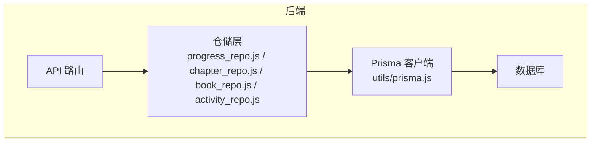
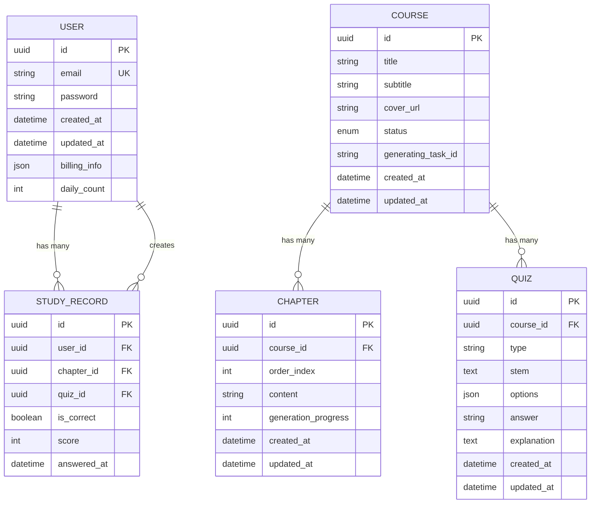
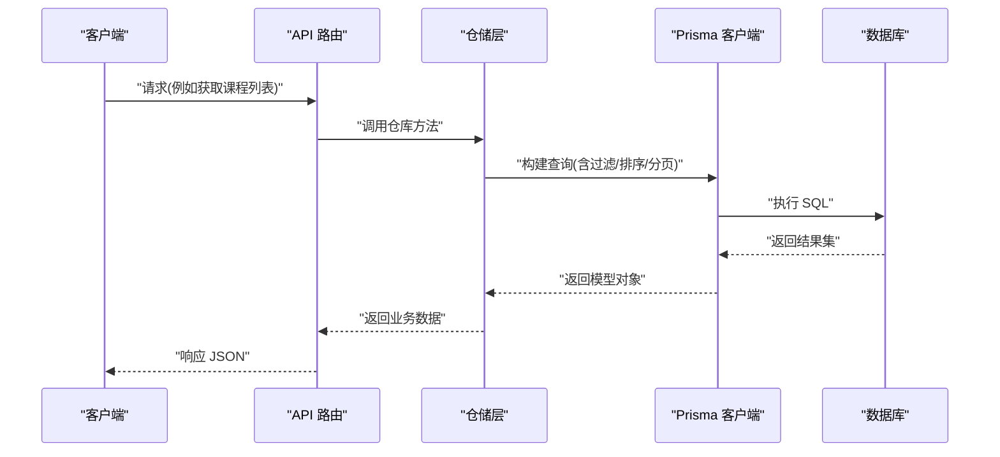
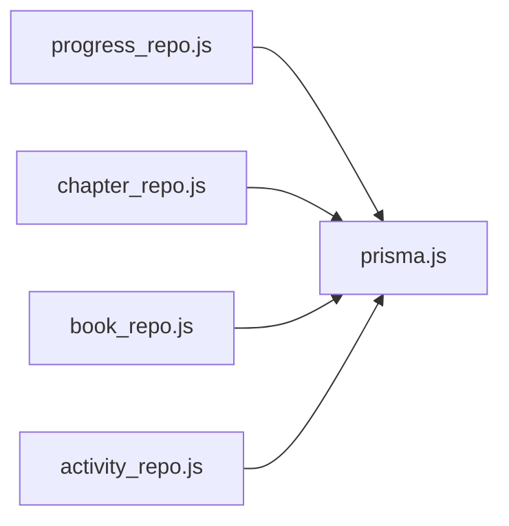

# 数据模型定义

<cite>
**本文引用的文件**
- [schema.prisma](file://node-jinmao/prisma/schema.prisma)
- [20260704072148_init/migration.sql](file://node-jinmao/prisma/migrations/20260704072148_init/migration.sql)
- [20260709105504_add_course_and_chapter/migration.sql](file://node-jinmao/prisma/migrations/20260709105504_add_course_and_chapter/migration.sql)
- [20260709_add_subtitle_to_course/migration.sql](file://node-jinmao/prisma/migrations/20260709_add_subtitle_to_course/migration.sql)
- [20260724_add_user_study_record/migration.sql](file://node-jinmao/prisma/migrations/20260724_add_user_study_record/migration.sql)
- [20260725_add_chapter_generation_progress/migration.sql](file://node-jinmao/prisma/migrations/20260725_add_chapter_generation_progress/migration.sql)
- [20260729_add_quiz_generating_task_id/migration.sql](file://node-jinmao/prisma/migrations/20260729_add_quiz_generating_task_id/migration.sql)
- [20260729_add_user_billing_fields/migration.sql](file://node-jinmao/prisma/migrations/20260729_add_user_billing_fields/migration.sql)
- [20260729_add_user_daily_activity/migration.sql](file://node-jinmao/prisma/migrations/20260729_add_user_daily_activity/migration.sql)
- [prisma.js](file://node-jinmao/utils/prisma.js)
- [progress_repo.js](file://node-jinmao/utils/repo/progress_repo.js)
- [chapter_repo.js](file://node-jinmao/utils/repo/chapter_repo.js)
- [book_repo.js](file://node-jinmao/utils/repo/book_repo.js)
- [activity_repo.js](file://node-jinmao/utils/repo/activity_repo.js)
</cite>

## 目录
1. [简介](#简介)
2. [项目结构](#项目结构)
3. [核心组件](#核心组件)
4. [架构总览](#架构总览)
5. [详细组件分析](#详细组件分析)
6. [依赖关系分析](#依赖关系分析)
7. [性能考虑](#性能考虑)
8. [故障排查指南](#故障排查指南)
9. [结论](#结论)
10. [附录](#附录)

## 简介
本文件面向“金毛教你学重构版”项目的数据模型定义，聚焦基于 Prisma ORM 的数据库模型。内容涵盖用户、题目、课程、章节、学习记录等核心实体的字段定义、数据类型选择与约束；实体间一对一、一对多、多对多的关系设计；Prisma Schema 语法要点、字段验证与默认值；并提供 ER 图、字段含义说明与实际使用示例。同时给出扩展新数据模型的设计规范与最佳实践，帮助开发者快速理解并安全演进数据层。

## 项目结构
本项目采用前后端分离架构，后端 Node.js 服务通过 Prisma 管理数据库模型与迁移。关键路径：
- Prisma 模型与迁移位于 node-jinmao/prisma 目录
- Prisma 客户端初始化在 node-jinmao/utils/prisma.js
- 仓储层（Repository）封装具体查询逻辑，如进度、章节、书籍、活动统计等

图表来源
- [prisma.js](file://node-jinmao/utils/prisma.js)
- [progress_repo.js](file://node-jinmao/utils/repo/progress_repo.js)
- [chapter_repo.js](file://node-jinmao/utils/repo/chapter_repo.js)
- [book_repo.js](file://node-jinmao/utils/repo/book_repo.js)
- [activity_repo.js](file://node-jinmao/utils/repo/activity_repo.js)

章节来源
- [schema.prisma](file://node-jinmao/prisma/schema.prisma)
- [prisma.js](file://node-jinmao/utils/prisma.js)

## 核心组件
本节概述核心数据模型及其职责：
- 用户（User）：账户信息、认证相关字段、计费与日常活动统计
- 课程（Course）：课程标题、副标题、封面、状态、生成任务标识等
- 章节（Chapter）：归属课程、顺序、内容、生成进度
- 题目（Quiz）：题型、题干、选项、答案、解析、关联文本教材等
- 学习记录（StudyRecord）：用户与章节/题目的交互、答题结果、时间戳
- 其他辅助表：如每日活动统计、计费信息等

为便于理解，以下给出概念性 ER 图（以实际迁移与仓储使用为依据进行抽象）：

图表来源
- [20260704072148_init/migration.sql](file://node-jinmao/prisma/migrations/20260704072148_init/migration.sql)
- [20260709105504_add_course_and_chapter/migration.sql](file://node-jinmao/prisma/migrations/20260709105504_add_course_and_chapter/migration.sql)
- [20260709_add_subtitle_to_course/migration.sql](file://node-jinmao/prisma/migrations/20260709_add_subtitle_to_course/migration.sql)
- [20260724_add_user_study_record/migration.sql](file://node-jinmao/prisma/migrations/20260724_add_user_study_record/migration.sql)
- [20260725_add_chapter_generation_progress/migration.sql](file://node-jinmao/prisma/migrations/20260725_add_chapter_generation_progress/migration.sql)
- [20260729_add_quiz_generating_task_id/migration.sql](file://node-jinmao/prisma/migrations/20260729_add_quiz_generating_task_id/migration.sql)
- [20260729_add_user_billing_fields/migration.sql](file://node-jinmao/prisma/migrations/20260729_add_user_billing_fields/migration.sql)
- [20260729_add_user_daily_activity/migration.sql](file://node-jinmao/prisma/migrations/20260729_add_user_daily_activity/migration.sql)

章节来源
- [schema.prisma](file://node-jinmao/prisma/schema.prisma)

## 架构总览
Prisma 作为 ORM，提供类型安全的数据库访问。后端通过仓储层封装业务查询，API 路由调用仓储方法，最终由 Prisma 客户端执行 SQL。整体流程如下：

图表来源
- [prisma.js](file://node-jinmao/utils/prisma.js)
- [progress_repo.js](file://node-jinmao/utils/repo/progress_repo.js)
- [chapter_repo.js](file://node-jinmao/utils/repo/chapter_repo.js)
- [book_repo.js](file://node-jinmao/utils/repo/book_repo.js)
- [activity_repo.js](file://node-jinmao/utils/repo/activity_repo.js)

## 详细组件分析

### 用户模型（User）
- 字段说明
  - id：主键，唯一标识用户
  - email：邮箱，唯一约束，用于登录与通知
  - password：密码哈希，存储加密后的字符串
  - created_at/updated_at：审计时间戳
  - billing_info：计费信息（JSON），包含套餐、订阅状态、用量等
  - daily_count：每日活动计数，用于统计与分析
- 约束与默认值
  - email 唯一约束，避免重复注册
  - created_at/updated_at 默认当前时间
  - billing_info 默认空对象或空 JSON
- 关系
  - 与学习记录为一对多：一个用户可有多条学习记录

章节来源
- [20260704072148_init/migration.sql](file://node-jinmao/prisma/migrations/20260704072148_init/migration.sql)
- [20260729_add_user_billing_fields/migration.sql](file://node-jinmao/prisma/migrations/20260729_add_user_billing_fields/migration.sql)
- [20260729_add_user_daily_activity/migration.sql](file://node-jinmao/prisma/migrations/20260729_add_user_daily_activity/migration.sql)

### 课程模型（Course）
- 字段说明
  - id：主键
  - title：课程标题
  - subtitle：课程副标题（可选）
  - cover_url：封面图片链接
  - status：课程状态（如草稿、已发布、归档）
  - generating_task_id：AI 生成任务 ID，用于异步生成章节或题目
  - created_at/updated_at：审计时间戳
- 约束与默认值
  - status 枚举约束，限制取值范围
  - generated_task_id 可为空，表示未开始生成
- 关系
  - 与章节为一对多：一个课程包含多个章节
  - 与题目为一对多：一个课程包含多个题目

章节来源
- [20260709105504_add_course_and_chapter/migration.sql](file://node-jinmao/prisma/migrations/20260709105504_add_course_and_chapter/migration.sql)
- [20260709_add_subtitle_to_course/migration.sql](file://node-jinmao/prisma/migrations/20260709_add_subtitle_to_course/migration.sql)
- [20260729_add_quiz_generating_task_id/migration.sql](file://node-jinmao/prisma/migrations/20260729_add_quiz_generating_task_id/migration.sql)

### 章节模型（Chapter）
- 字段说明
  - id：主键
  - course_id：外键，关联课程
  - order_index：章节顺序索引，用于排序展示
  - content：章节内容（Markdown 或结构化文本）
  - generation_progress：生成进度百分比
  - created_at/updated_at：审计时间戳
- 约束与默认值
  - order_index 非负整数，保证顺序正确
  - generation_progress 默认 0，范围 0-100
- 关系
  - 与课程为多对一：多个章节属于同一课程

章节来源
- [20260709105504_add_course_and_chapter/migration.sql](file://node-jinmao/prisma/migrations/20260709105504_add_course_and_chapter/migration.sql)
- [20260725_add_chapter_generation_progress/migration.sql](file://node-jinmao/prisma/migrations/20260725_add_chapter_generation_progress/migration.sql)

### 题目模型（Quiz）
- 字段说明
  - id：主键
  - course_id：外键，关联课程
  - type：题型（选择题、填空题、判断题、作文题等）
  - stem：题干文本
  - options：选项（JSON 数组，适用于选择题）
  - answer：正确答案（字符串或结构化）
  - explanation：解析说明
  - created_at/updated_at：审计时间戳
- 约束与默认值
  - type 枚举约束，限定题型集合
  - options 可为空，针对非选择题
- 关系
  - 与课程为多对一：多个题目属于同一课程
  - 与学习记录为多对一：一条学习记录对应一道题目

章节来源
- [20260704072148_init/migration.sql](file://node-jinmao/prisma/migrations/20260704072148_init/migration.sql)

### 学习记录模型（StudyRecord）
- 字段说明
  - id：主键
  - user_id：外键，关联用户
  - chapter_id：外键，关联章节（可选）
  - quiz_id：外键，关联题目（可选）
  - is_correct：是否正确
  - score：得分
  - answered_at：作答时间
- 约束与默认值
  - is_correct 布尔值
  - score 非负整数
  - answered_at 默认当前时间
- 关系
  - 与用户为多对一：多条记录属于同一用户
  - 与章节为多对一：多条记录可指向同一章节
  - 与题目为多对一：多条记录可指向同一题目

章节来源
- [20260724_add_user_study_record/migration.sql](file://node-jinmao/prisma/migrations/20260724_add_user_study_record/migration.sql)

### 其他辅助模型
- 每日活动统计（DailyActivity）
  - 字段：user_id、date、count 等，用于按日统计用户活跃度
- 计费信息（BillingInfo）
  - 字段：user_id、plan、status、usage、renewal_date 等，用于订阅与计费

章节来源
- [20260729_add_user_daily_activity/migration.sql](file://node-jinmao/prisma/migrations/20260729_add_user_daily_activity/migration.sql)
- [20260729_add_user_billing_fields/migration.sql](file://node-jinmao/prisma/migrations/20260729_add_user_billing_fields/migration.sql)

## 依赖关系分析
仓储层与 Prisma 客户端的依赖关系清晰，各仓储模块专注于特定实体的 CRUD 与复杂查询：

图表来源
- [progress_repo.js](file://node-jinmao/utils/repo/progress_repo.js)
- [chapter_repo.js](file://node-jinmao/utils/repo/chapter_repo.js)
- [book_repo.js](file://node-jinmao/utils/repo/book_repo.js)
- [activity_repo.js](file://node-jinmao/utils/repo/activity_repo.js)
- [prisma.js](file://node-jinmao/utils/prisma.js)

章节来源
- [progress_repo.js](file://node-jinmao/utils/repo/progress_repo.js)
- [chapter_repo.js](file://node-jinmao/utils/repo/chapter_repo.js)
- [book_repo.js](file://node-jinmao/utils/repo/book_repo.js)
- [activity_repo.js](file://node-jinmao/utils/repo/activity_repo.js)
- [prisma.js](file://node-jinmao/utils/prisma.js)

## 性能考虑
- 索引策略
  - 对高频查询字段建立索引，如 user.email、course.status、quiz.type、study_record.user_id、study_record.chapter_id、study_record.quiz_id
- 分页与投影
  - 使用分页减少大结果集传输；仅选择必要字段降低内存占用
- 连接池与事务
  - 合理配置 Prisma 连接池大小；批量写入时使用事务保证一致性
- 缓存热点
  - 对课程列表、章节树等热点数据引入缓存层（Redis）减轻数据库压力
- 异步生成任务
  - 课程/章节/题目的 AI 生成长耗时操作应异步化，并通过 generating_task_id 跟踪状态

[本节为通用指导，不直接分析具体文件]

## 故障排查指南
- 常见错误
  - 唯一约束冲突：email 重复注册导致插入失败
  - 外键约束失败：删除课程前未清理章节与题目
  - 类型不匹配：JSON 字段结构变更导致解析异常
- 定位步骤
  - 检查迁移历史与 schema 是否一致
  - 查看仓储层查询条件与参数绑定
  - 启用 Prisma 日志输出，捕获 SQL 与错误堆栈
- 修复建议
  - 增加前置校验与幂等处理
  - 对外键删除设置级联策略或业务层保护
  - 对 JSON 字段增加版本控制与兼容性处理

章节来源
- [20260704072148_init/migration.sql](file://node-jinmao/prisma/migrations/20260704072148_init/migration.sql)
- [20260709105504_add_course_and_chapter/migration.sql](file://node-jinmao/prisma/migrations/20260709105504_add_course_and_chapter/migration.sql)
- [20260724_add_user_study_record/migration.sql](file://node-jinmao/prisma/migrations/20260724_add_user_study_record/migration.sql)

## 结论
本数据模型围绕用户、课程、章节、题目、学习记录等核心实体展开，采用 Prisma 进行类型安全的数据访问。通过清晰的 ER 设计与合理的约束与默认值，支撑了课程生成、刷题练习、学习统计等关键业务场景。后续扩展应遵循现有命名与分层规范，谨慎维护迁移与索引，确保系统稳定与高性能。

[本节为总结性内容，不直接分析具体文件]

## 附录

### Prisma Schema 语法要点
- 模型定义：model 名称 { 字段... }
- 字段类型：String、Int、Float、Boolean、DateTime、Json、Enum、Uuid
- 约束：@id、@unique、@default、@relation、@map
- 关系：一对一、一对多、多对多通过 @relation 与外键字段实现
- 验证：可使用自定义验证器或在应用层校验

[本节为概念性说明，不直接分析具体文件]

### 字段含义与默认值速查
- User
  - email：唯一，必填
  - password：必填，存储哈希
  - billing_info：默认空对象
  - daily_count：默认 0
- Course
  - title：必填
  - subtitle：可选
  - status：枚举，默认草稿
  - generating_task_id：可选
- Chapter
  - course_id：必填外键
  - order_index：非负整数
  - generation_progress：默认 0
- Quiz
  - course_id：必填外键
  - type：枚举
  - options：可选 JSON
  - answer/explanation：根据题型决定
- StudyRecord
  - user_id/chapter_id/quiz_id：至少一个存在
  - is_correct：布尔
  - score：非负整数
  - answered_at：默认当前时间

[本节为概念性说明，不直接分析具体文件]

### 实际使用示例（仓储层）
- 获取用户学习进度
  - 调用 progress_repo 中的方法，按用户与课程维度聚合答题正确率与次数
- 列出课程章节树
  - 调用 chapter_repo 中的方法，按课程 id 与 order_index 排序返回章节列表
- 导入题库
  - 调用 book_repo 中的方法，批量插入题目并更新课程统计
- 统计每日活跃
  - 调用 activity_repo 中的方法，按日期与用户维度计数

章节来源
- [progress_repo.js](file://node-jinmao/utils/repo/progress_repo.js)
- [chapter_repo.js](file://node-jinmao/utils/repo/chapter_repo.js)
- [book_repo.js](file://node-jinmao/utils/repo/book_repo.js)
- [activity_repo.js](file://node-jinmao/utils/repo/activity_repo.js)

### 扩展新数据模型的最佳实践
- 命名规范
  - 模型名使用单数名词，字段名小写下划线
  - 外键字段以 _id 结尾，如 course_id、user_id
- 关系设计
  - 优先一对多，必要时引入中间表实现多对多
  - 明确级联删除与更新策略，避免孤儿数据
- 约束与验证
  - 使用 @unique/@enum/@default 等内置约束
  - 复杂规则在应用层补充校验
- 迁移与回滚
  - 每次变更提交独立迁移，保持可追溯
  - 对破坏性变更提供回滚脚本
- 性能优化
  - 为高频查询字段添加索引
  - 合理使用分页与投影，避免全表扫描

[本节为概念性说明，不直接分析具体文件]