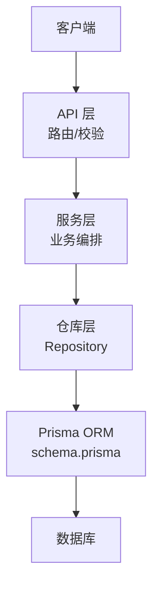
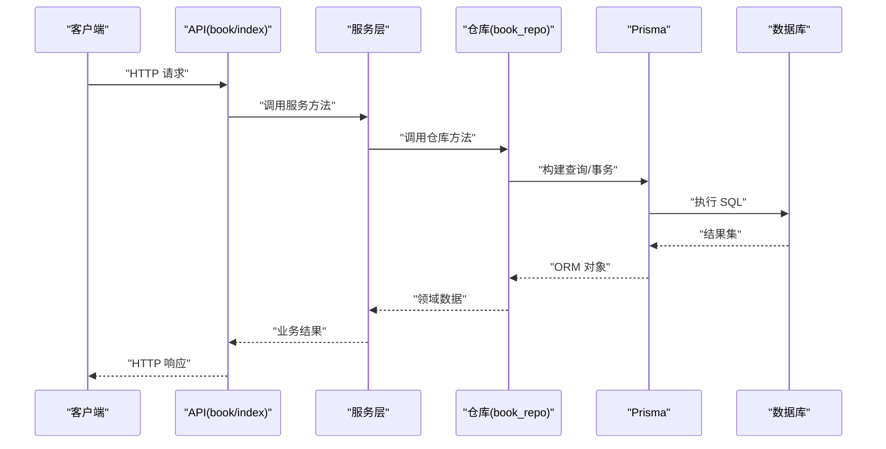
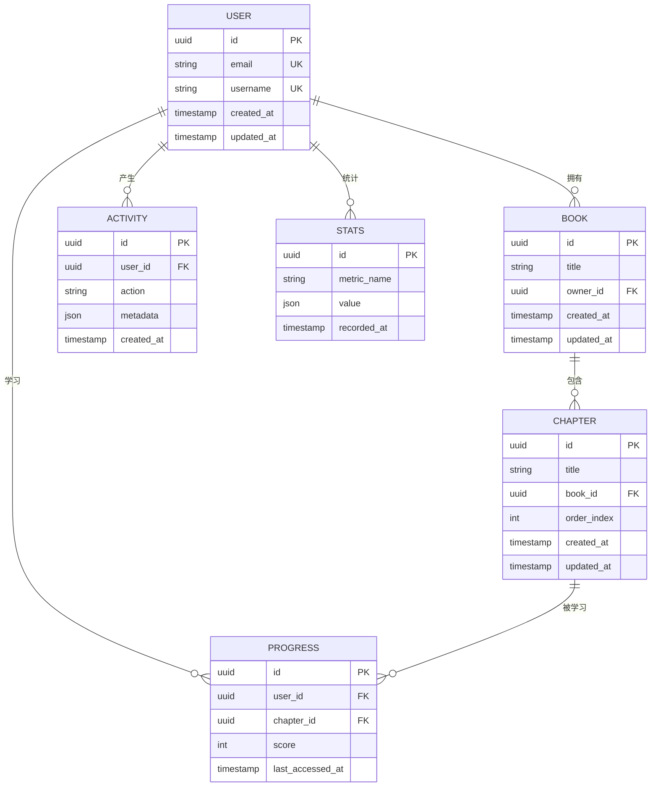
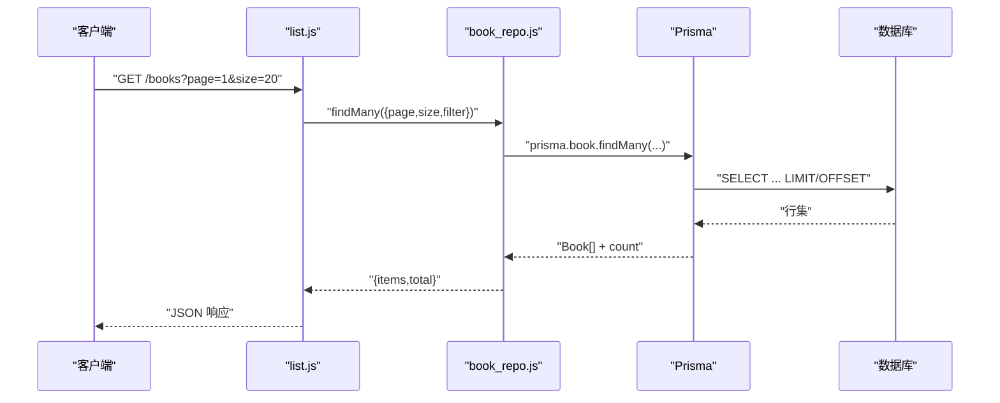
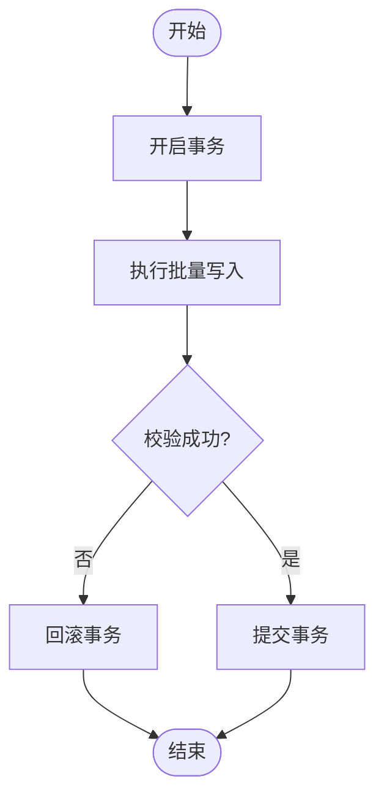
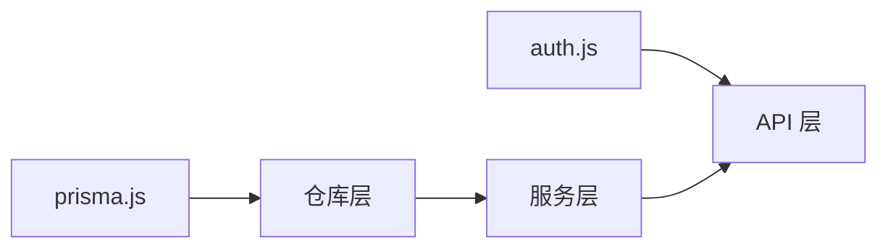

# 数据访问模式

<cite>
**本文档引用的文件**   
- [node-jinmao/prisma/schema.prisma](file://node-jinmao/prisma/schema.prisma)
- [node-jinmao/utils/prisma.js](file://node-jinmao/utils/prisma.js)
- [node-jinmao/utils/repo/book_repo.js](file://node-jinmao/utils/repo/book_repo.js)
- [node-jinmao/utils/repo/chapter_repo.js](file://node-jinmao/utils/repo/chapter_repo.js)
- [node-jinmao/utils/repo/progress_repo.js](file://node-jinmao/utils/repo/progress_repo.js)
- [node-jinmao/utils/repo/activity_repo.js](file://node-jinmao/utils/repo/activity_repo.js)
- [node-jinmao/utils/repo/stats_repo.js](file://node-jinmao/utils/repo/stats_repo.js)
- [node-jinmao/utils/repo/update_repo.js](file://node-jinmao/utils/repo/update_repo.js)
- [node-jinmao/repo/quiz_repo.js](file://node-jinmao/repo/quiz_repo.js)
- [node-jinmao/API/book/index.js](file://node-jinmao/API/book/index.js)
- [node-jinmao/API/book/list.js](file://node-jinmao/API/book/list.js)
- [node-jinmao/API/book/detail.js](file://node-jinmao/API/book/detail.js)
- [node-jinmao/API/book/update.js](file://node-jinmao/API/book/update.js)
- [node-jinmao/API/book/delete.js](file://node-jinmao/API/book/delete.js)
- [node-jinmao/service/auth/login.js](file://node-jinmao/service/auth/login.js)
- [node-jinmao/middleware/auth.js](file://node-jinmao/middleware/auth.js)
</cite>

## 目录
1. [简介](#简介)
2. [项目结构](#项目结构)
3. [核心组件](#核心组件)
4. [架构总览](#架构总览)
5. [详细组件分析](#详细组件分析)
6. [依赖关系分析](#依赖关系分析)
7. [性能考量](#性能考量)
8. [故障排查指南](#故障排查指南)
9. [结论](#结论)
10. [附录](#附录)

## 简介
本文件面向“金毛教你学重构版”后端的数据访问层，系统性阐述基于 Prisma ORM 的 Repository 模式设计与实现。内容涵盖：
- 数据模型与连接管理
- Repository 封装与 CRUD 操作
- 复杂查询、分页与关联加载策略
- 事务处理与批量操作优化
- 错误处理、日志记录规范
- 索引策略与 N+1 问题规避
- 缓存策略、数据一致性与并发访问方案

## 项目结构
后端采用分层设计：API 层负责路由与参数校验，Service 层编排业务逻辑，Repository 层统一数据访问，Prisma 作为 ORM 提供类型安全与迁移能力。

**图示来源** 
- [node-jinmao/API/book/index.js](file://node-jinmao/API/book/index.js)
- [node-jinmao/utils/repo/book_repo.js](file://node-jinmao/utils/repo/book_repo.js)
- [node-jinmao/prisma/schema.prisma](file://node-jinmao/prisma/schema.prisma)

**章节来源**
- [node-jinmao/API/book/index.js](file://node-jinmao/API/book/index.js)
- [node-jinmao/utils/repo/book_repo.js](file://node-jinmao/utils/repo/book_repo.js)
- [node-jinmao/prisma/schema.prisma](file://node-jinmao/prisma/schema.prisma)

## 核心组件
- Prisma 客户端与连接池配置：集中管理数据库连接、超时与重试策略
- Repository 抽象：对增删改查进行统一封装，屏蔽底层 SQL 细节
- 领域仓库：按实体划分（book、chapter、progress、activity、stats、update、quiz）
- API 控制器：接收请求、调用服务层，返回标准化响应

**章节来源**
- [node-jinmao/utils/prisma.js](file://node-jinmao/utils/prisma.js)
- [node-jinmao/utils/repo/book_repo.js](file://node-jinmao/utils/repo/book_repo.js)
- [node-jinmao/utils/repo/chapter_repo.js](file://node-jinmao/utils/repo/chapter_repo.js)
- [node-jinmao/utils/repo/progress_repo.js](file://node-jinmao/utils/repo/progress_repo.js)
- [node-jinmao/utils/repo/activity_repo.js](file://node-jinmao/utils/repo/activity_repo.js)
- [node-jinmao/utils/repo/stats_repo.js](file://node-jinmao/utils/repo/stats_repo.js)
- [node-jinmao/utils/repo/update_repo.js](file://node-jinmao/utils/repo/update_repo.js)
- [node-jinmao/repo/quiz_repo.js](file://node-jinmao/repo/quiz_repo.js)

## 架构总览
数据访问流从 API 到 Repository，再到 Prisma 生成并执行 SQL，最终返回结构化数据。

**图示来源** 
- [node-jinmao/API/book/index.js](file://node-jinmao/API/book/index.js)
- [node-jinmao/utils/repo/book_repo.js](file://node-jinmao/utils/repo/book_repo.js)
- [node-jinmao/utils/prisma.js](file://node-jinmao/utils/prisma.js)

## 详细组件分析

### Prisma 客户端与连接池
- 单例客户端：确保连接复用与资源释放
- 连接池参数：最大连接数、空闲超时、连接超时、查询超时
- 环境隔离：通过环境变量区分开发/生产连接串
- 健康检查：启动时验证连接可用性

**章节来源**
- [node-jinmao/utils/prisma.js](file://node-jinmao/utils/prisma.js)

### Repository 模式与 CRUD 封装
- 统一接口：find/create/update/delete/findMany
- 条件构建：支持过滤、排序、分页、字段投影
- 关联加载：按需 include/select，避免 N+1
- 事务包装：多步写操作原子性保证

示例仓库职责映射：
- book_repo：图书 CRUD、列表分页、详情聚合
- chapter_repo：章节增删改查、顺序维护
- progress_repo：学习进度读写、统计聚合
- activity_repo：活动日志写入、时间窗口统计
- stats_repo：报表计算、聚合查询
- update_repo：版本更新记录、增量同步
- quiz_repo：题库导入、解析、报告统计

**章节来源**
- [node-jinmao/utils/repo/book_repo.js](file://node-jinmao/utils/repo/book_repo.js)
- [node-jinmao/utils/repo/chapter_repo.js](file://node-jinmao/utils/repo/chapter_repo.js)
- [node-jinmao/utils/repo/progress_repo.js](file://node-jinmao/utils/repo/progress_repo.js)
- [node-jinmao/utils/repo/activity_repo.js](file://node-jinmao/utils/repo/activity_repo.js)
- [node-jinmao/utils/repo/stats_repo.js](file://node-jinmao/utils/repo/stats_repo.js)
- [node-jinmao/utils/repo/update_repo.js](file://node-jinmao/utils/repo/update_repo.js)
- [node-jinmao/repo/quiz_repo.js](file://node-jinmao/repo/quiz_repo.js)

### 数据模型与关系
- 实体定义：用户、课程、章节、图书、题目、学习记录、活动、统计等
- 关系建模：一对多、多对多、自引用（章节顺序）
- 约束与索引：主键、唯一键、外键、常用查询列索引

**图示来源** 
- [node-jinmao/prisma/schema.prisma](file://node-jinmao/prisma/schema.prisma)

**章节来源**
- [node-jinmao/prisma/schema.prisma](file://node-jinmao/prisma/schema.prisma)

### API 层与仓库协作（以图书为例）

**图示来源** 
- [node-jinmao/API/book/list.js](file://node-jinmao/API/book/list.js)
- [node-jinmao/utils/repo/book_repo.js](file://node-jinmao/utils/repo/book_repo.js)
- [node-jinmao/utils/prisma.js](file://node-jinmao/utils/prisma.js)

**章节来源**
- [node-jinmao/API/book/list.js](file://node-jinmao/API/book/list.js)
- [node-jinmao/utils/repo/book_repo.js](file://node-jinmao/utils/repo/book_repo.js)

### 复杂查询与关联加载策略
- 使用 include/select 精确加载关联，避免全量拉取
- 分批加载：大集合分片查询，降低内存峰值
- 预聚合：在仓库层完成 groupBy、sum/count，减少应用层计算
- 视图/物化视图：热点报表走只读副本或物化视图

**章节来源**
- [node-jinmao/utils/repo/stats_repo.js](file://node-jinmao/utils/repo/stats_repo.js)
- [node-jinmao/utils/repo/activity_repo.js](file://node-jinmao/utils/repo/activity_repo.js)

### 事务处理与批量操作
- 事务边界：写操作集中在事务内，失败回滚
- 批量写入：使用 prisma.$transaction 包裹多条写入
- 幂等控制：结合唯一键与去重逻辑，防止重复提交
- 长事务规避：拆分任务，避免锁竞争

**图示来源** 
- [node-jinmao/utils/repo/update_repo.js](file://node-jinmao/utils/repo/update_repo.js)
- [node-jinmao/utils/prisma.js](file://node-jinmao/utils/prisma.js)

**章节来源**
- [node-jinmao/utils/repo/update_repo.js](file://node-jinmao/utils/repo/update_repo.js)
- [node-jinmao/utils/prisma.js](file://node-jinmao/utils/prisma.js)

### 分页查询实现方案
- 游标分页：基于有序字段（如 created_at/id）提升稳定性
- 偏移分页：适用于小数据集与简单场景
- 计数优化：count 与查询分离，必要时缓存总数

**章节来源**
- [node-jinmao/API/book/list.js](file://node-jinmao/API/book/list.js)
- [node-jinmao/utils/repo/book_repo.js](file://node-jinmao/utils/repo/book_repo.js)

### 错误处理机制与日志记录规范
- 统一异常捕获：API 层捕获并转换为标准错误码
- 分类错误：参数错误、业务错误、数据库错误
- 日志分级：info/warn/error，记录关键上下文（用户ID、请求ID）
- 敏感信息脱敏：不记录密码、令牌等

**章节来源**
- [node-jinmao/middleware/auth.js](file://node-jinmao/middleware/auth.js)
- [node-jinmao/service/auth/login.js](file://node-jinmao/service/auth/login.js)

### 索引策略与 N+1 问题规避
- 高频查询列建索引：外键、过滤字段、排序字段
- 复合索引：覆盖常见查询组合
- N+1 规避：使用 include 一次性加载关联；避免循环中逐条查询
- 慢查询监控：定期导出慢查询日志并优化

**章节来源**
- [node-jinmao/prisma/schema.prisma](file://node-jinmao/prisma/schema.prisma)

### 缓存策略与数据一致性
- 多级缓存：本地内存缓存 + Redis 分布式缓存
- 缓存失效：写后删除或延迟双删，保证最终一致
- 热点保护：限流与降级，避免雪崩
- 一致性权衡：读多写少场景可接受短暂不一致

[本节为通用指导，不直接分析具体文件]

### 并发访问处理方案
- 乐观锁：版本号字段，冲突重试
- 悲观锁：select for update，短事务内加锁
- 队列削峰：异步任务解耦高并发写入
- 连接池调优：根据 CPU/IO 调整最大连接数

**章节来源**
- [node-jinmao/utils/prisma.js](file://node-jinmao/utils/prisma.js)

## 依赖关系分析
- API 层依赖服务层，服务层依赖仓库层
- 仓库层仅依赖 Prisma 客户端，无外部副作用
- 中间件与工具模块横向支撑认证、上传、LLM 调用等

**图示来源** 
- [node-jinmao/middleware/auth.js](file://node-jinmao/middleware/auth.js)
- [node-jinmao/utils/prisma.js](file://node-jinmao/utils/prisma.js)
- [node-jinmao/utils/repo/book_repo.js](file://node-jinmao/utils/repo/book_repo.js)

**章节来源**
- [node-jinmao/middleware/auth.js](file://node-jinmao/middleware/auth.js)
- [node-jinmao/utils/prisma.js](file://node-jinmao/utils/prisma.js)
- [node-jinmao/utils/repo/book_repo.js](file://node-jinmao/utils/repo/book_repo.js)

## 性能考量
- 连接池大小：根据并发与数据库容量设定
- 查询裁剪：只 select 必要字段，减少网络传输
- 批量操作：合并写入，降低事务开销
- 分页策略：优先游标分页，避免深度偏移
- 索引命中：通过 EXPLAIN 验证索引使用
- 缓存命中率：热点数据缓存，冷数据直连 DB

[本节为通用指导，不直接分析具体文件]

## 故障排查指南
- 连接失败：检查连接串、权限、防火墙
- 慢查询：定位未命中索引或全表扫描
- 死锁：缩短事务、统一加锁顺序
- 内存溢出：限制单次查询规模，启用流式读取
- 鉴权失败：核对 JWT 签名、过期时间与角色权限

**章节来源**
- [node-jinmao/middleware/auth.js](file://node-jinmao/middleware/auth.js)
- [node-jinmao/service/auth/login.js](file://node-jinmao/service/auth/login.js)

## 结论
通过 Prisma + Repository 的分层设计，本项目实现了清晰的数据访问边界、统一的 CRUD 封装与高效的查询策略。配合合理的索引、事务与缓存策略，可在保证一致性的同时获得良好的性能表现。后续建议持续引入慢查询监控、缓存命中率分析与自动化索引推荐，进一步提升系统稳定性与可维护性。

[本节为总结性内容，不直接分析具体文件]

## 附录
- 最佳实践清单
  - 所有写操作进入事务，失败回滚
  - 使用 include/select 精准加载关联
  - 分页优先游标，避免深度偏移
  - 高频查询列建立合适索引
  - 统一错误码与日志格式
  - 敏感信息脱敏，最小化日志输出
  - 连接池参数按负载调优
  - 热点数据多级缓存，写后失效

[本节为补充说明，不直接分析具体文件]