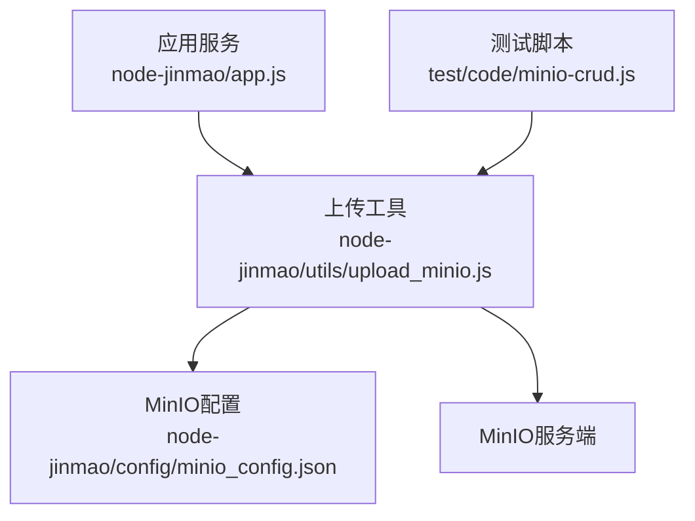
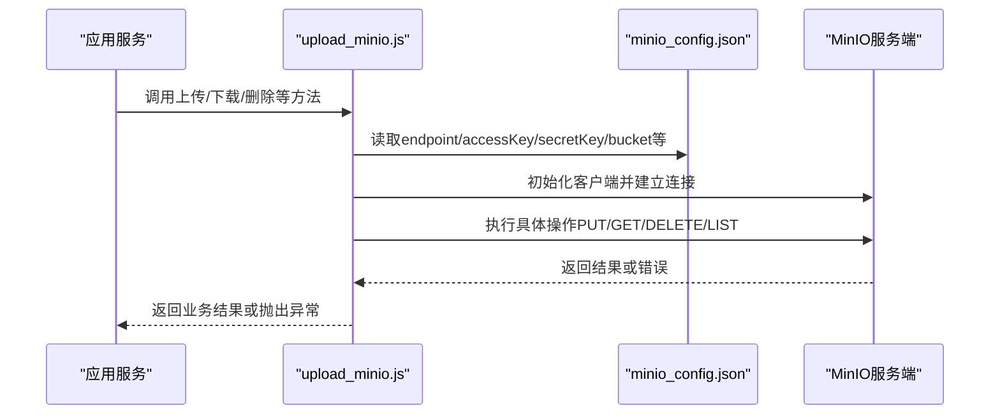
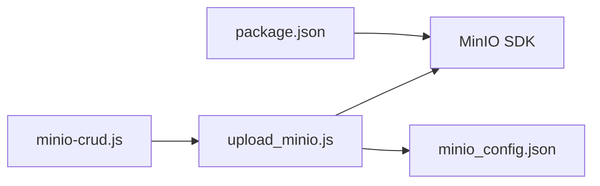

# MinIO集成配置

<cite>
**本文引用的文件**   
- [minio_config.json](file://node-jinmao/config/minio_config.json)
- [upload_minio.js](file://node-jinmao/utils/upload_minio.js)
- [minio-crud.js](file://test/code/minio-crud.js)
- [package.json](file://node-jinmao/package.json)
</cite>

## 目录
1. [简介](#简介)
2. [项目结构](#项目结构)
3. [核心组件](#核心组件)
4. [架构总览](#架构总览)
5. [详细组件分析](#详细组件分析)
6. [依赖分析](#依赖分析)
7. [性能考虑](#性能考虑)
8. [故障排查指南](#故障排查指南)
9. [结论](#结论)
10. [附录](#附录)

## 简介
本文件面向在项目中集成MinIO对象存储的开发者与运维人员，系统说明MinIO服务的安装与配置、连接参数设置、认证机制、配置文件结构与字段含义、不同环境的配置示例、连接池与超时/重试策略、SSL/TLS安全连接与代理配置，以及连接测试方法与常见问题排查。文档内容基于仓库中现有的MinIO相关代码与配置进行梳理与总结，确保与实际实现一致。

## 项目结构
与MinIO集成相关的核心位置如下：
- 配置中心：node-jinmao/config/minio_config.json（集中存放MinIO连接与桶等配置）
- 上传工具：node-jinmao/utils/upload_minio.js（封装MinIO客户端初始化、上传、删除等操作）
- 测试用例：test/code/minio-crud.js（提供CRUD操作示例脚本）
- 依赖声明：node-jinmao/package.json（包含MinIO SDK等依赖）

图表来源
- [upload_minio.js](file://node-jinmao/utils/upload_minio.js)
- [minio_config.json](file://node-jinmao/config/minio_config.json)
- [minio-crud.js](file://test/code/minio-crud.js)

章节来源
- [minio_config.json](file://node-jinmao/config/minio_config.json)
- [upload_minio.js](file://node-jinmao/utils/upload_minio.js)
- [minio-crud.js](file://test/code/minio-crud.js)

## 核心组件
- 配置模块（minio_config.json）
  - 作用：集中管理MinIO端点、访问密钥、密钥、桶名、协议、端口、路径风格、是否启用SSL、代理等关键参数。
  - 关键字段建议：endpoint、accessKey、secretKey、bucket、secure、port、pathStyle、region、ssl、proxy等（具体以实际配置文件为准）。
- 上传工具（upload_minio.js）
  - 作用：加载配置、初始化MinIO客户端、封装put/get/delete/list等常用操作，统一错误处理与日志输出。
  - 典型能力：创建或校验桶、分片/流式上传、生成签名URL、异常捕获与重试（如实现）。
- 测试脚本（minio-crud.js）
  - 作用：演示如何调用上传工具完成基本CRUD操作，便于本地验证连通性与权限。

章节来源
- [minio_config.json](file://node-jinmao/config/minio_config.json)
- [upload_minio.js](file://node-jinmao/utils/upload_minio.js)
- [minio-crud.js](file://test/code/minio-crud.js)

## 架构总览
MinIO集成在应用中通过“配置 + 工具类”的方式解耦，业务层仅依赖工具方法，不直接感知底层SDK细节。

图表来源
- [upload_minio.js](file://node-jinmao/utils/upload_minio.js)
- [minio_config.json](file://node-jinmao/config/minio_config.json)

## 详细组件分析

### 配置文件结构（minio_config.json）
- 目的：集中化配置MinIO连接与行为参数，便于多环境切换与统一管理。
- 关键字段说明（结合常见用法归纳，具体以实际文件为准）：
  - endpoint：MinIO服务地址，支持域名或IP，可包含端口。
  - accessKey / secretKey：用于鉴权的访问密钥对。
  - bucket：默认桶名，若未指定则使用默认值。
  - secure / ssl：是否启用HTTPS；生产环境建议开启。
  - port：显式端口覆盖（当endpoint未包含端口时生效）。
  - pathStyle：是否使用路径风格访问（某些部署需要true）。
  - region：区域信息（部分场景需要）。
  - proxy：代理服务器配置（http/https代理），适用于受限网络。
- 多环境示例思路：
  - 开发：指向本地或内网MinIO，关闭严格校验，便于调试。
  - 测试：指向测试集群，开启必要日志，限制桶大小与权限。
  - 生产：强制HTTPS、最小权限原则、独立账号与桶、开启审计。

章节来源
- [minio_config.json](file://node-jinmao/config/minio_config.json)

### 上传工具（upload_minio.js）
- 职责：
  - 读取配置并初始化MinIO客户端。
  - 封装常用操作：创建桶、上传文件、下载文件、删除对象、列举对象、生成签名URL等。
  - 统一错误处理：区分网络错误、权限错误、对象不存在等，并提供重试策略（如实现）。
- 设计要点：
  - 将敏感配置与逻辑分离，避免硬编码。
  - 对外暴露简洁API，隐藏SDK差异。
  - 记录关键日志，便于问题定位。
- 典型调用流程（概念示意）：
  - 接收请求 -> 校验参数 -> 初始化客户端（必要时复用）-> 执行操作 -> 返回结果/错误。

章节来源
- [upload_minio.js](file://node-jinmao/utils/upload_minio.js)

### 测试脚本（minio-crud.js）
- 用途：快速验证MinIO连通性、权限与基本功能。
- 建议步骤：
  - 检查配置是否正确（endpoint、accessKey、secretKey、bucket、secure等）。
  - 执行创建桶、上传小文件、列出对象、下载文件、删除对象等操作。
  - 观察日志与错误码，确认网络、证书、代理、权限等问题。

章节来源
- [minio-crud.js](file://test/code/minio-crud.js)

## 依赖分析
- 运行时依赖：MinIO SDK由package.json声明，确保版本稳定且与Node.js版本兼容。
- 模块耦合：
  - upload_minio.js依赖minio_config.json的配置。
  - 业务模块仅依赖upload_minio.js提供的接口，降低耦合度。
- 外部依赖：
  - MinIO服务端（HTTP/HTTPS）。
  - 可选：代理服务器、TLS证书颁发机构。

图表来源
- [package.json](file://node-jinmao/package.json)
- [upload_minio.js](file://node-jinmao/utils/upload_minio.js)
- [minio_config.json](file://node-jinmao/config/minio_config.json)
- [minio-crud.js](file://test/code/minio-crud.js)

章节来源
- [package.json](file://node-jinmao/package.json)

## 性能考虑
- 连接池与复用：
  - 合理复用MinIO客户端实例，避免频繁创建销毁带来的开销。
  - 在高并发场景下，关注底层HTTP连接池参数（如最大连接数、空闲超时）。
- 超时与重试：
  - 设置合理的连接超时、读写超时，避免阻塞。
  - 对幂等操作（如上传相同对象）可考虑有限次重试，非幂等需谨慎。
- 传输优化：
  - 大文件建议使用分块上传或流式上传，减少内存占用。
  - 启用压缩与缓存（CDN/边缘缓存）提升读取性能。
- 资源隔离：
  - 按环境或租户划分桶与命名空间，避免相互影响。

[本节为通用指导，不直接分析具体文件]

## 故障排查指南
- 连接失败
  - 检查endpoint/port/secure配置是否与MinIO一致。
  - 确认防火墙/安全组/代理规则允许出站访问。
  - 若启用HTTPS，检查证书链与主机名匹配。
- 权限不足
  - 核对accessKey/secretKey权限策略，确保具备对应桶的读写权限。
  - 检查桶策略与ACL是否限制了访问。
- 超时与重试
  - 调整超时阈值，观察是否因网络抖动导致频繁重试。
  - 对非幂等操作避免自动重试，防止重复写入。
- 代理问题
  - 确认代理地址、端口、认证方式正确。
  - 在受限网络中，优先使用白名单放行MinIO域名/IP。
- 快速验证
  - 使用test/code/minio-crud.js执行基础CRUD，定位是配置问题还是网络/权限问题。

章节来源
- [minio-crud.js](file://test/code/minio-crud.js)
- [upload_minio.js](file://node-jinmao/utils/upload_minio.js)

## 结论
通过集中化的配置与封装良好的上传工具，MinIO集成在项目中具备良好的可维护性与扩展性。建议在开发与测试阶段充分验证连通性与权限，在生产环境强化安全配置（HTTPS、最小权限、独立账号与桶），并结合监控与日志完善可观测性。

[本节为总结性内容，不直接分析具体文件]

## 附录
- 安装与部署MinIO
  - 参考官方文档选择合适的部署方式（二进制/Docker/Kubernetes），并确保服务可达。
- 配置项速查
  - endpoint：服务地址（含端口）
  - accessKey/secretKey：鉴权密钥
  - bucket：默认桶名
  - secure/ssl：是否HTTPS
  - port：端口覆盖
  - pathStyle：路径风格访问
  - region：区域
  - proxy：代理配置
- 连接测试命令
  - 使用test/code/minio-crud.js执行基础操作，观察输出与错误信息。

[本节为补充信息，不直接分析具体文件]