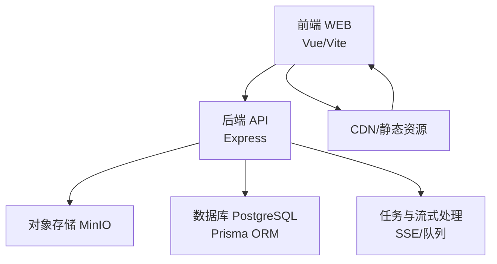
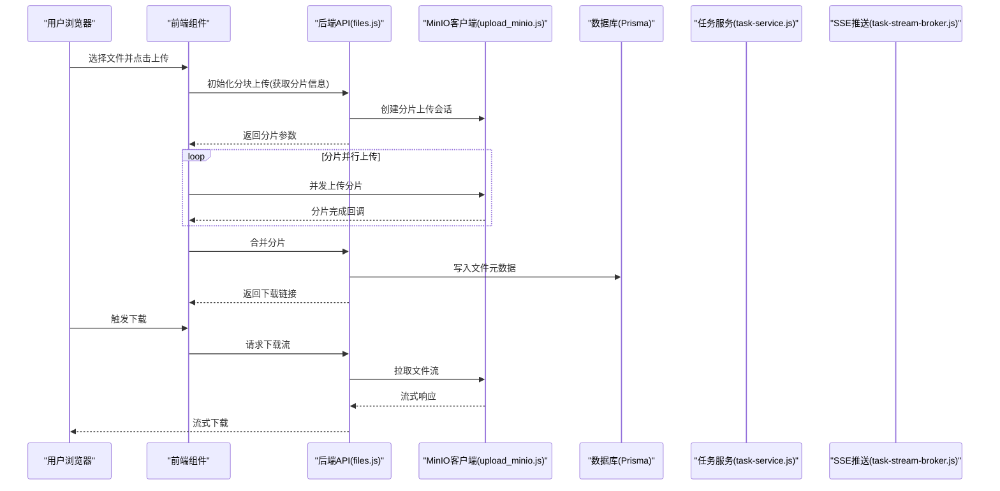
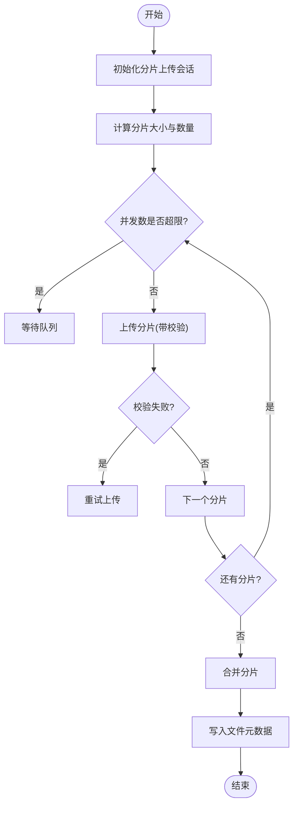
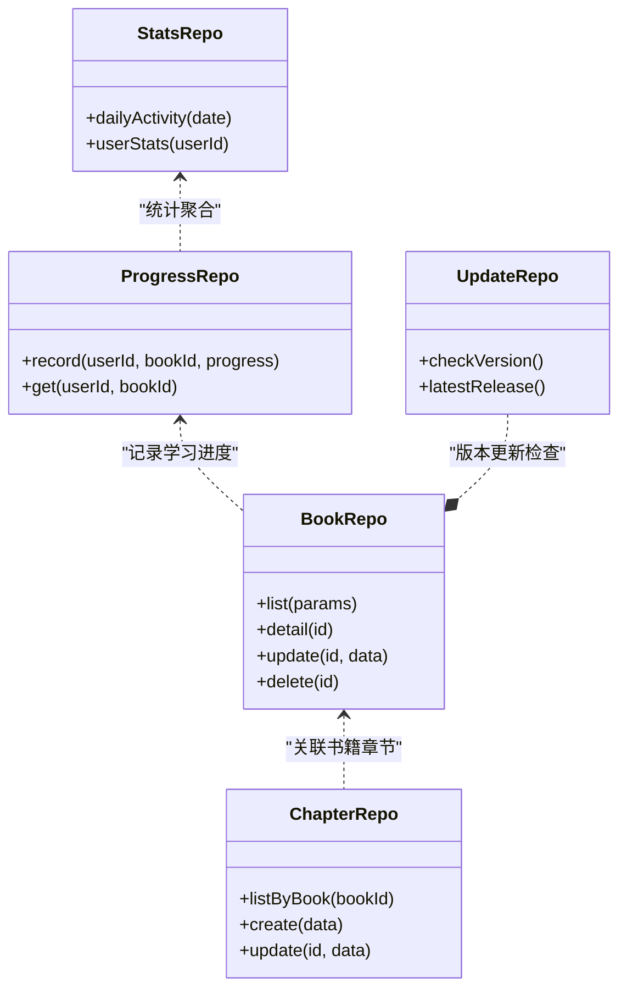
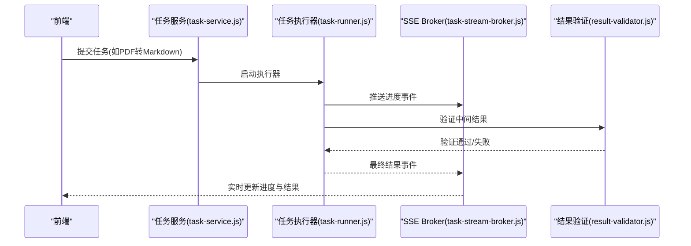
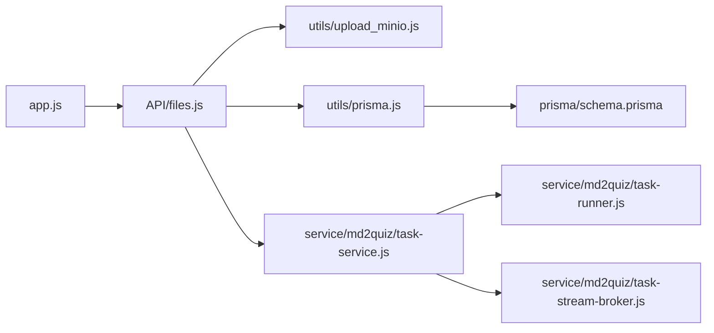

# 性能优化与监控

<cite>
**本文引用的文件**   
- [app.js](file://node-jinmao/app.js)
- [files.js](file://node-jinmao/API/files.js)
- [upload_minio.js](file://node-jinmao/utils/upload_minio.js)
- [minio_config.json](file://node-jinmao/config/minio_config.json)
- [prisma.js](file://node-jinmao/utils/prisma.js)
- [schema.prisma](file://node-jinmao/prisma/schema.prisma)
- [20260704072148_init/migration.sql](file://node-jinmao/prisma/migrations/20260704072148_init/migration.sql)
- [20260709105504_add_course_and_chapter/migration.sql](file://node-jinmao/prisma/migrations/20260709105504_add_course_and_chapter/migration.sql)
- [20260724_add_user_study_record/migration.sql](file://node-jinmao/prisma/migrations/20260724_add_user_study_record/migration.sql)
- [20260725_add_chapter_generation_progress/migration.sql](file://node-jinmao/prisma/migrations/20260725_add_chapter_generation_progress/migration.sql)
- [20260729_add_quiz_generating_task_id/migration.sql](file://node-jinmao/prisma/migrations/20260729_add_quiz_generating_task_id/migration.sql)
- [20260729_add_user_billing_fields/migration.sql](file://node-jinmao/prisma/migrations/20260729_add_user_billing_fields/migration.sql)
- [20260729_add_user_daily_activity/migration.sql](file://node-jinmao/prisma/migrations/20260729_add_user_daily_activity/migration.sql)
- [package.json](file://node-jinmao/package.json)
- [vite.config.js](file://WEB/vite.config.js)
- [auth.js](file://WEB/src/api/auth.js)
- [books.js](file://WEB/src/api/books.js)
- [progress.js](file://WEB/src/api/progress.js)
- [stats.js](file://WEB/src/api/stats.js)
- [CourseFilesDialog.vue](file://WEB/src/components/CourseFilesDialog.vue)
- [UploadBookDialog.vue](file://WEB/src/components/UploadBookDialog.vue)
- [storage.js](file://WEB/src/utils/storage.js)
- [book_repo.js](file://node-jinmao/repo/book_repo.js)
- [chapter_repo.js](file://node-jinmao/utils/repo/chapter_repo.js)
- [progress_repo.js](file://node-jinmao/utils/repo/progress_repo.js)
- [stats_repo.js](file://node-jinmao/utils/repo/stats_repo.js)
- [activity_repo.js](file://node-jinmao/utils/repo/activity_repo.js)
- [update_repo.js](file://node-jinmao/utils/repo/update_repo.js)
- [task-service.js](file://node-jinmao/service/md2quiz/task-service.js)
- [task-store.js](file://node-jinmao/service/md2quiz/task-store.js)
- [task-stream-broker.js](file://node-jinmao/service/md2quiz/task-stream-broker.js)
- [task-runner.js](file://node-jinmao/service/md2quiz/task-runner.js)
- [chunker.js](file://node-jinmao/service/md2quiz/chunker.js)
- [quiz-chunk-processor.js](file://node-jinmao/service/md2quiz/quiz-chunk-processor.js)
- [result-validator.js](file://node-jinmao/service/md2quiz/result-validator.js)
- [deepseek-client.js](file://node-jinmao/service/md2quiz/deepseek-client.js)
- [pdf-to-md.js](file://node-jinmao/service/md2quiz/pdf-to-md.js)
- [quiz_splitter.js](file://node-jinmao/service/md2quiz/quiz-splitter.js)
- [POSTbook.js](file://node-jinmao/service/POSTbook.js)
- [course_pipeline.js](file://node-jinmao/service/course_pipeline.js)
- [create_cover_image.js](file://node-jinmao/service/create_cover_image.js)
- [create_title.js](file://node-jinmao/service/create_title.js)
- [quiz_import.js](file://node-jinmao/service/quiz_import.js)
- [quiz_judge.js](file://node-jinmao/service/quiz_judge.js)
- [quiz_report_service.js](file://node-jinmao/service/quiz_report_service.js)
- [quiz_sse_broker.js](file://node-jinmao/service/quiz_sse_broker.js)
</cite>

## 目录
1. [简介](#简介)
2. [项目结构](#项目结构)
3. [核心组件](#核心组件)
4. [架构总览](#架构总览)
5. [详细组件分析](#详细组件分析)
6. [依赖关系分析](#依赖关系分析)
7. [性能考量](#性能考量)
8. [故障排查指南](#故障排查指南)
9. [结论](#结论)
10. [附录](#附录)

## 简介
本文件围绕“文件存储系统性能优化”展开，结合仓库中的后端服务、对象存储（MinIO）、数据库（Prisma/PostgreSQL）以及前端上传下载流程，系统性阐述以下主题：
- 文件上传/下载的性能优化策略：并发控制、分块传输、缓存机制
- CDN加速配置与静态资源分发、边缘节点部署建议
- 数据库查询优化、索引设计与分页优化
- 内存管理、垃圾回收优化、连接池调优
- 性能监控指标、日志记录、错误追踪与APM集成
- 容量规划、存储成本优化、冷热数据分离策略
- 压力测试方法、基准测试、瓶颈分析与调优建议

## 项目结构
本项目采用前后端分离架构：
- 前端（WEB）：基于Vue/Vite，提供上传下载交互、进度展示、缓存与重试逻辑。
- 后端（node-jinmao）：Express应用，API路由、业务服务层、仓储层、任务队列与流式处理、对象存储客户端、数据库访问。
- 对象存储：MinIO用于大文件分块上传与下载。
- 数据库：Prisma ORM + PostgreSQL，承载元数据、用户学习记录、统计等。

**图表来源** 
- [app.js](file://node-jinmao/app.js)
- [files.js](file://node-jinmao/API/files.js)
- [upload_minio.js](file://node-jinmao/utils/upload_minio.js)
- [prisma.js](file://node-jinmao/utils/prisma.js)
- [vite.config.js](file://WEB/vite.config.js)

**章节来源**
- [app.js](file://node-jinmao/app.js)
- [files.js](file://node-jinmao/API/files.js)
- [upload_minio.js](file://node-jinmao/utils/upload_minio.js)
- [prisma.js](file://node-jinmao/utils/prisma.js)
- [vite.config.js](file://WEB/vite.config.js)

## 核心组件
- 文件上传/下载接口：统一入口在API层，调用对象存储客户端实现分块上传与断点续传。
- 对象存储客户端：封装MinIO SDK，支持并发分块、校验、重试、限速。
- 数据库访问层：Prisma模型与仓储函数，负责元数据读写、统计聚合、分页查询。
- 任务与流式处理：长耗时任务（如PDF转Markdown、题目生成）通过任务服务与SSE推送进度。
- 前端上传组件：分片、并发、进度、失败重试、缓存命中。

**章节来源**
- [files.js](file://node-jinmao/API/files.js)
- [upload_minio.js](file://node-jinmao/utils/upload_minio.js)
- [prisma.js](file://node-jinmao/utils/prisma.js)
- [task-service.js](file://node-jinmao/service/md2quiz/task-service.js)
- [task-stream-broker.js](file://node-jinmao/service/md2quiz/task-stream-broker.js)
- [CourseFilesDialog.vue](file://WEB/src/components/CourseFilesDialog.vue)
- [UploadBookDialog.vue](file://WEB/src/components/UploadBookDialog.vue)

## 架构总览
后端以Express为入口，API路由将请求分发至服务层；服务层协调对象存储与数据库；任务模块异步处理长耗时操作并通过SSE向前端推送事件。前端通过Vite构建静态资源，可接入CDN加速。

**图表来源** 
- [files.js](file://node-jinmao/API/files.js)
- [upload_minio.js](file://node-jinmao/utils/upload_minio.js)
- [task-service.js](file://node-jinmao/service/md2quiz/task-service.js)
- [task-stream-broker.js](file://node-jinmao/service/md2quiz/task-stream-broker.js)

## 详细组件分析

### 文件上传/下载接口与对象存储客户端
- 上传流程：前端按分片大小切分文件，并发上传各分片；服务端创建分片会话，校验分片完整性后合并。
- 下载流程：服务端从对象存储拉取流并转发给前端，支持Range请求以实现断点续传。
- 关键优化点：
  - 并发控制：限制同时上传的分片数量，避免网络拥塞与服务器过载。
  - 分块大小：根据文件大小与网络状况动态调整分片大小。
  - 校验与重试：对每个分片进行MD5/SHA校验，失败自动重试。
  - 缓存命中：重复文件通过哈希去重，减少冗余存储。

**图表来源** 
- [files.js](file://node-jinmao/API/files.js)
- [upload_minio.js](file://node-jinmao/utils/upload_minio.js)

**章节来源**
- [files.js](file://node-jinmao/API/files.js)
- [upload_minio.js](file://node-jinmao/utils/upload_minio.js)
- [minio_config.json](file://node-jinmao/config/minio_config.json)

### 数据库访问与仓储层
- Prisma模型定义表结构与关系，仓储层封装CRUD与复杂查询。
- 针对高频查询设计复合索引，避免全表扫描。
- 分页查询使用游标或键集分页，提升大数据量下的稳定性。

**图表来源** 
- [book_repo.js](file://node-jinmao/repo/book_repo.js)
- [chapter_repo.js](file://node-jinmao/utils/repo/chapter_repo.js)
- [progress_repo.js](file://node-jinmao/utils/repo/progress_repo.js)
- [stats_repo.js](file://node-jinmao/utils/repo/stats_repo.js)
- [activity_repo.js](file://node-jinmao/utils/repo/activity_repo.js)
- [update_repo.js](file://node-jinmao/utils/repo/update_repo.js)

**章节来源**
- [prisma.js](file://node-jinmao/utils/prisma.js)
- [schema.prisma](file://node-jinmao/prisma/schema.prisma)
- [20260704072148_init/migration.sql](file://node-jinmao/prisma/migrations/20260704072148_init/migration.sql)
- [20260709105504_add_course_and_chapter/migration.sql](file://node-jinmao/prisma/migrations/20260709105504_add_course_and_chapter/migration.sql)
- [20260724_add_user_study_record/migration.sql](file://node-jinmao/prisma/migrations/20260724_add_user_study_record/migration.sql)
- [20260725_add_chapter_generation_progress/migration.sql](file://node-jinmao/prisma/migrations/20260725_add_chapter_generation_progress/migration.sql)
- [20260729_add_quiz_generating_task_id/migration.sql](file://node-jinmao/prisma/migrations/20260729_add_quiz_generating_task_id/migration.sql)
- [20260729_add_user_billing_fields/migration.sql](file://node-jinmao/prisma/migrations/20260729_add_user_billing_fields/migration.sql)
- [20260729_add_user_daily_activity/migration.sql](file://node-jinmao/prisma/migrations/20260729_add_user_daily_activity/migration.sql)

### 任务与流式处理（长耗时任务）
- 任务服务负责调度、持久化与状态管理。
- 流式Broker通过SSE向客户端推送实时进度。
- 分块处理器与结果验证器确保中间产物质量。

**图表来源** 
- [task-service.js](file://node-jinmao/service/md2quiz/task-service.js)
- [task-runner.js](file://node-jinmao/service/md2quiz/task-runner.js)
- [task-stream-broker.js](file://node-jinmao/service/md2quiz/task-stream-broker.js)
- [result-validator.js](file://node-jinmao/service/md2quiz/result-validator.js)

**章节来源**
- [task-service.js](file://node-jinmao/service/md2quiz/task-service.js)
- [task-store.js](file://node-jinmao/service/md2quiz/task-store.js)
- [task-stream-broker.js](file://node-jinmao/service/md2quiz/task-stream-broker.js)
- [task-runner.js](file://node-jinmao/service/md2quiz/task-runner.js)
- [chunker.js](file://node-jinmao/service/md2quiz/chunker.js)
- [quiz-chunk-processor.js](file://node-jinmao/service/md2quiz/quiz-chunk-processor.js)
- [result-validator.js](file://node-jinmao/service/md2quiz/result-validator.js)
- [deepseek-client.js](file://node-jinmao/service/md2quiz/deepseek-client.js)
- [pdf-to-md.js](file://node-jinmao/service/md2quiz/pdf-to-md.js)
- [quiz_splitter.js](file://node-jinmao/service/md2quiz/quiz-splitter.js)

### 前端上传组件与缓存机制
- 分片上传：按固定大小切分，支持并发与重试。
- 缓存策略：利用浏览器缓存与本地存储记录已上传分片，避免重复传输。
- 进度反馈：实时显示上传/下载进度，提升用户体验。

**章节来源**
- [CourseFilesDialog.vue](file://WEB/src/components/CourseFilesDialog.vue)
- [UploadBookDialog.vue](file://WEB/src/components/UploadBookDialog.vue)
- [storage.js](file://WEB/src/utils/storage.js)
- [auth.js](file://WEB/src/api/auth.js)
- [books.js](file://WEB/src/api/books.js)
- [progress.js](file://WEB/src/api/progress.js)
- [stats.js](file://WEB/src/api/stats.js)

## 依赖关系分析
- Express应用入口注册路由与中间件。
- API层依赖服务层与仓储层。
- 服务层依赖对象存储客户端与数据库访问。
- 任务模块依赖SSE Broker与外部AI/转换工具。

**图表来源** 
- [app.js](file://node-jinmao/app.js)
- [files.js](file://node-jinmao/API/files.js)
- [upload_minio.js](file://node-jinmao/utils/upload_minio.js)
- [prisma.js](file://node-jinmao/utils/prisma.js)
- [task-service.js](file://node-jinmao/service/md2quiz/task-service.js)
- [task-runner.js](file://node-jinmao/service/md2quiz/task-runner.js)
- [task-stream-broker.js](file://node-jinmao/service/md2quiz/task-stream-broker.js)
- [schema.prisma](file://node-jinmao/prisma/schema.prisma)

**章节来源**
- [app.js](file://node-jinmao/app.js)
- [files.js](file://node-jinmao/API/files.js)
- [upload_minio.js](file://node-jinmao/utils/upload_minio.js)
- [prisma.js](file://node-jinmao/utils/prisma.js)
- [task-service.js](file://node-jinmao/service/md2quiz/task-service.js)
- [task-runner.js](file://node-jinmao/service/md2quiz/task-runner.js)
- [task-stream-broker.js](file://node-jinmao/service/md2quiz/task-stream-broker.js)
- [schema.prisma](file://node-jinmao/prisma/schema.prisma)

## 性能考量

### 文件上传/下载优化
- 并发控制：限制分片上传的并发数，避免TCP拥塞与服务器CPU飙升。
- 分块大小：根据文件大小与网络带宽动态调整，通常1MB~10MB为宜。
- 缓存机制：前端缓存分片哈希，后端去重存储，减少重复传输与存储成本。
- 断点续传：支持Range请求，恢复中断的下载。

### CDN加速与静态资源分发
- 静态资源（JS/CSS/图片）通过CDN缓存，降低源站压力。
- 配置缓存头（Cache-Control、ETag），提升命中率。
- 边缘节点就近分发，降低延迟。

### 数据库查询优化
- 索引设计：为高频查询字段建立单列/复合索引，避免回表。
- 分页优化：使用键集分页替代偏移分页，提升大数据量性能。
- 查询计划：定期分析慢查询，优化JOIN与子查询。

### 内存管理与GC优化
- Node.js堆大小设置：根据实例内存合理调整--max-old-space-size。
- 流式处理：避免一次性加载大文件到内存，使用Readable Stream。
- 对象引用：及时释放不再使用的引用，避免内存泄漏。

### 连接池调优
- 数据库连接池：根据并发量调整最大连接数与空闲超时。
- HTTP连接复用：启用Keep-Alive，减少握手开销。
- 对象存储连接：合理设置超时与重试策略。

### 监控与可观测性
- 指标采集：QPS、延迟、错误率、吞吐、GC停顿时间、连接池使用率。
- 日志记录：结构化日志，包含请求ID、用户ID、操作类型、耗时。
- 错误追踪：集中上报异常，关联上下文信息。
- APM集成：使用APM工具（如Prometheus+Grafana、OpenTelemetry）可视化性能。

### 容量规划与成本优化
- 冷热数据分离：热数据存高速存储，冷数据归档到低成本存储。
- 生命周期策略：自动清理临时文件与过期分片。
- 压缩与去重：对文本类文件压缩，重复内容去重。

### 压力测试与基准测试
- 工具选择：wrk、ab、k6、JMeter等。
- 场景设计：模拟多用户并发上传/下载、混合读写负载。
- 瓶颈分析：定位CPU、内存、I/O、网络瓶颈，针对性调优。

## 故障排查指南
- 上传失败：检查分片校验、网络超时、对象存储权限。
- 下载缓慢：确认CDN命中率、源站带宽、Range请求支持。
- 数据库慢查询：查看执行计划、索引缺失、锁竞争。
- 内存溢出：分析堆快照、定位大对象与循环引用。
- 任务卡住：检查任务队列堆积、外部依赖超时、SSE连接断开。

**章节来源**
- [files.js](file://node-jinmao/API/files.js)
- [upload_minio.js](file://node-jinmao/utils/upload_minio.js)
- [task-service.js](file://node-jinmao/service/md2quiz/task-service.js)
- [task-stream-broker.js](file://node-jinmao/service/md2quiz/task-stream-broker.js)

## 结论
通过分块上传、并发控制、缓存与CDN加速，结合数据库索引优化与连接池调优，可显著提升文件存储系统的吞吐与稳定性。配合完善的监控、日志与APM体系，能够及时发现并解决性能瓶颈，保障系统在大规模用户与高并发场景下的稳定运行。

## 附录
- 相关配置文件路径参考：
  - MinIO配置：[minio_config.json](file://node-jinmao/config/minio_config.json)
  - 前端构建配置：[vite.config.js](file://WEB/vite.config.js)
  - 数据库迁移脚本：见[prisma/migrations](file://node-jinmao/prisma/migrations)
  - 包依赖与脚本：[package.json](file://node-jinmao/package.json)