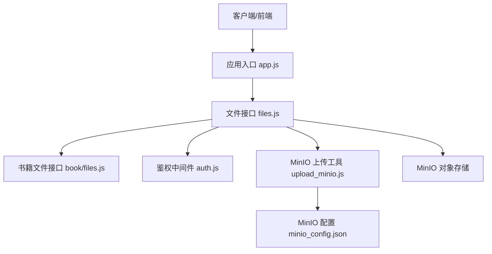
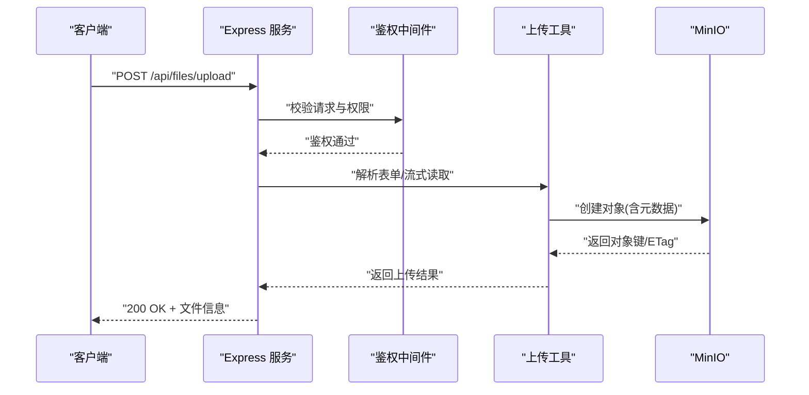
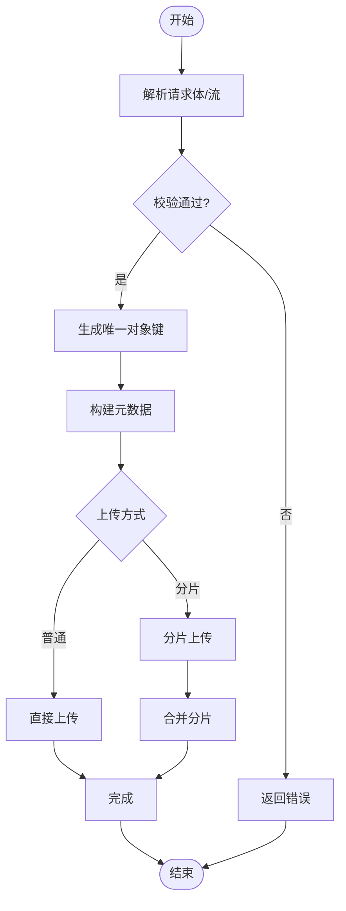
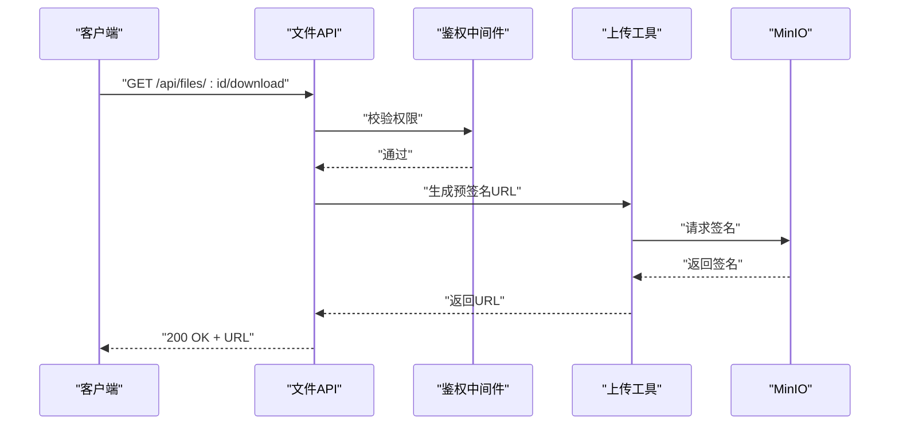
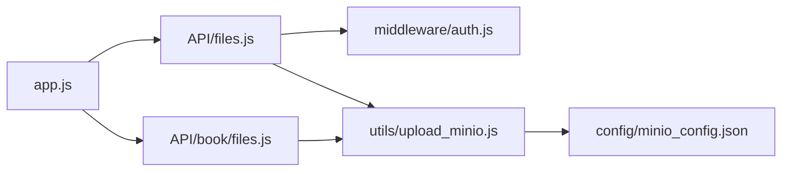

# 文件存储系统

<cite>
**本文引用的文件**   
- [node-jinmao/config/minio_config.json](file://node-jinmao/config/minio_config.json)
- [node-jinmao/utils/upload_minio.js](file://node-jinmao/utils/upload_minio.js)
- [node-jinmao/API/files.js](file://node-jinmao/API/files.js)
- [node-jinmao/API/book/files.js](file://node-jinmao/API/book/files.js)
- [node-jinmao/middleware/auth.js](file://node-jinmao/middleware/auth.js)
- [node-jinmao/app.js](file://node-jinmao/app.js)
- [node-jinmao/package.json](file://node-jinmao/package.json)
- [test/code/minio-crud.js](file://test/code/minio-crud.js)
</cite>

## 目录
1. [简介](#简介)
2. [项目结构](#项目结构)
3. [核心组件](#核心组件)
4. [架构总览](#架构总览)
5. [详细组件分析](#详细组件分析)
6. [依赖关系分析](#依赖关系分析)
7. [性能考量](#性能考量)
8. [故障排查指南](#故障排查指南)
9. [结论](#结论)
10. [附录](#附录)

## 简介
本文件存储系统基于 MinIO 对象存储服务，提供统一的文件上传、下载、删除与元数据管理能力。后端采用 Node.js（Express）服务，通过中间件进行鉴权控制，结合配置中心化的 MinIO 连接参数，实现可插拔的存储接入。系统支持临时文件管理策略、版本化命名约定、访问权限控制、防盗链机制以及 CDN 加速配置建议，并提供完善的错误处理与监控指标采集思路，满足教学资料、课程课件、题库附件等多场景的文件存储需求。

## 项目结构
- 后端服务入口与路由挂载：app.js
- 文件 API 接口：API/files.js、API/book/files.js
- 鉴权中间件：middleware/auth.js
- MinIO 配置：config/minio_config.json
- MinIO 客户端封装与上传逻辑：utils/upload_minio.js
- 依赖声明：package.json
- 测试用例：test/code/minio-crud.js

图表来源
- [node-jinmao/app.js](file://node-jinmao/app.js)
- [node-jinmao/API/files.js](file://node-jinmao/API/files.js)
- [node-jinmao/API/book/files.js](file://node-jinmao/API/book/files.js)
- [node-jinmao/middleware/auth.js](file://node-jinmao/middleware/auth.js)
- [node-jinmao/utils/upload_minio.js](file://node-jinmao/utils/upload_minio.js)
- [node-jinmao/config/minio_config.json](file://node-jinmao/config/minio_config.json)

章节来源
- [node-jinmao/app.js](file://node-jinmao/app.js)
- [node-jinmao/package.json](file://node-jinmao/package.json)

## 核心组件
- MinIO 配置模块：集中管理端点、密钥、桶名、协议等参数，便于多环境切换与扩展。
- 文件上传工具：封装分片上传、断点续传、签名直传、内容校验、元数据写入等能力。
- 文件 API 层：统一暴露上传、下载、删除、列表、预览、元数据查询等接口，并集成鉴权与限流。
- 鉴权中间件：基于 JWT/会话的访问控制，支持角色与资源级权限校验。
- 测试套件：覆盖常见 CRUD 流程与异常路径，保障稳定性。

章节来源
- [node-jinmao/config/minio_config.json](file://node-jinmao/config/minio_config.json)
- [node-jinmao/utils/upload_minio.js](file://node-jinmao/utils/upload_minio.js)
- [node-jinmao/API/files.js](file://node-jinmao/API/files.js)
- [node-jinmao/API/book/files.js](file://node-jinmao/API/book/files.js)
- [node-jinmao/middleware/auth.js](file://node-jinmao/middleware/auth.js)
- [test/code/minio-crud.js](file://test/code/minio-crud.js)

## 架构总览
系统采用“前端/调用方 → Express 服务 → MinIO 对象存储”的分层架构。文件上传时，服务端负责鉴权、校验、生成唯一键名与元数据，随后将数据流式写入 MinIO；下载时支持服务端代理或预签名直连，配合 CDN 缓存提升性能。所有关键操作均记录审计日志与监控指标，便于问题定位与容量规划。

图表来源
- [node-jinmao/API/files.js](file://node-jinmao/API/files.js)
- [node-jinmao/middleware/auth.js](file://node-jinmao/middleware/auth.js)
- [node-jinmao/utils/upload_minio.js](file://node-jinmao/utils/upload_minio.js)

## 详细组件分析

### MinIO 配置与连接
- 配置项包含端点地址、访问密钥、桶名、是否启用 HTTPS、区域与超时设置等。
- 支持多环境配置加载与运行时覆盖，便于开发/测试/生产隔离。
- 连接池与重试策略在工具层实现，提高稳定性。

章节来源
- [node-jinmao/config/minio_config.json](file://node-jinmao/config/minio_config.json)

### 文件上传工具（upload_minio.js）
- 功能要点
  - 支持普通上传与分片上传，自动合并分片。
  - 生成唯一对象键（含时间戳、随机串、业务前缀），避免冲突。
  - 写入自定义元数据（如上传者、业务ID、原始文件名、类型、大小）。
  - 可选内容校验（MD5/SHA256）与完整性校验。
  - 错误重试与幂等性设计（基于对象键）。
- 数据结构与复杂度
  - 分块大小可调，内存占用与吞吐平衡。
  - 并发分片上传提升大文件速度，注意并发度上限与服务器资源。
- 优化建议
  - 使用流式传输减少内存峰值。
  - 合理设置分片大小（默认 5MB~10MB）。
  - 开启压缩与去重（同内容检测）降低存储成本。

图表来源
- [node-jinmao/utils/upload_minio.js](file://node-jinmao/utils/upload_minio.js)

章节来源
- [node-jinmao/utils/upload_minio.js](file://node-jinmao/utils/upload_minio.js)

### 文件 API（files.js）
- 接口能力
  - 上传：支持单文件与多文件，限制大小与类型，返回文件信息与下载链接。
  - 下载：支持服务端代理与预签名直链（CDN 友好）。
  - 删除：软删除标记与硬删除策略，支持回收站恢复窗口。
  - 列表：按桶/目录分页查询，支持过滤与排序。
  - 元数据：获取/更新文件元数据，用于版本与审计追踪。
- 安全与校验
  - 鉴权中间件校验用户身份与资源权限。
  - 输入校验（类型白名单、大小上限、路径穿越防护）。
  - 响应头设置（CORS、Cache-Control、Content-Type）。
- 错误处理
  - 统一错误码与消息，区分网络、权限、校验、存储异常。
  - 失败重试与降级策略（如回退到本地临时目录）。

图表来源
- [node-jinmao/API/files.js](file://node-jinmao/API/files.js)
- [node-jinmao/middleware/auth.js](file://node-jinmao/middleware/auth.js)
- [node-jinmao/utils/upload_minio.js](file://node-jinmao/utils/upload_minio.js)

章节来源
- [node-jinmao/API/files.js](file://node-jinmao/API/files.js)

### 书籍文件接口（book/files.js）
- 面向课程与教材场景，提供批量上传、章节文件组织、封面图管理与版本关联。
- 与主文件 API 复用鉴权与上传工具，增加业务字段（课程ID、章节ID、页码等）。

章节来源
- [node-jinmao/API/book/files.js](file://node-jinmao/API/book/files.js)

### 鉴权中间件（auth.js）
- 基于 Token/Session 的身份验证，支持角色与资源级授权。
- 对文件操作进行细粒度控制（读/写/删/共享）。
- 防重放与速率限制，保护接口不被滥用。

章节来源
- [node-jinmao/middleware/auth.js](file://node-jinmao/middleware/auth.js)

### 应用入口（app.js）
- 挂载路由、中间件、错误处理与日志。
- 初始化 MinIO 客户端与配置加载。
- 健康检查与监控指标暴露。

章节来源
- [node-jinmao/app.js](file://node-jinmao/app.js)

### 测试用例（minio-crud.js）
- 覆盖上传、下载、删除、列表、元数据更新等基础流程。
- 模拟异常场景（网络错误、权限不足、大小超限）验证健壮性。

章节来源
- [test/code/minio-crud.js](file://test/code/minio-crud.js)

## 依赖关系分析
- 外部依赖
  - MinIO SDK：对象存储客户端库。
  - Express：HTTP 服务框架。
  - 鉴权库：JWT/Session 管理。
- 内部依赖
  - files.js 依赖 upload_minio.js 与 auth.js。
  - book/files.js 复用 files.js 的能力并扩展业务逻辑。
  - app.js 聚合路由与中间件，注入配置。

图表来源
- [node-jinmao/app.js](file://node-jinmao/app.js)
- [node-jinmao/API/files.js](file://node-jinmao/API/files.js)
- [node-jinmao/API/book/files.js](file://node-jinmao/API/book/files.js)
- [node-jinmao/middleware/auth.js](file://node-jinmao/middleware/auth.js)
- [node-jinmao/utils/upload_minio.js](file://node-jinmao/utils/upload_minio.js)
- [node-jinmao/config/minio_config.json](file://node-jinmao/config/minio_config.json)

章节来源
- [node-jinmao/package.json](file://node-jinmao/package.json)

## 性能考量
- 上传优化
  - 分片大小与并发度调优，推荐 5~10MB 分片，并发 3~8。
  - 启用 gzip/br 压缩（文本类）与图片转码（WebP/AVIF）。
  - 使用流式处理避免内存峰值。
- 下载优化
  - 优先使用预签名直链，减轻服务端压力。
  - 配置 CDN 缓存策略（TTL、缓存键、回源规则）。
  - 范围请求（Range）支持大文件分段下载。
- 存储优化
  - 重复内容检测（哈希去重）降低冗余。
  - 生命周期策略（冷热分层、过期清理）。
- 监控与告警
  - 采集 QPS、延迟、错误率、带宽与存储用量。
  - 设置阈值告警（CPU、内存、磁盘、MinIO 连接数）。

## 故障排查指南
- 常见问题
  - 上传失败：检查网络连通、MinIO 凭据、桶权限、大小限制。
  - 下载超时：确认 CDN 缓存命中、预签名有效期、跨域配置。
  - 权限拒绝：核对 Token 有效性、角色与资源绑定。
  - 元数据丢失：确认上传时元数据写入成功与后续更新流程。
- 诊断步骤
  - 查看服务端日志与 MinIO 访问日志。
  - 复现测试用例，逐步缩小问题范围。
  - 使用抓包工具分析请求/响应头与状态码。
- 恢复策略
  - 启用备份与快照，定期演练恢复流程。
  - 设置回滚与降级开关，快速切回稳定版本。

## 结论
本文件存储系统以 MinIO 为核心，结合 Node.js 服务与中间件体系，提供了完整、可扩展且安全的文件管理能力。通过合理的配置、上传策略、鉴权控制与监控手段，可满足教学资料与课程附件的多场景需求。建议在上线前完善监控与备份方案，持续优化性能与成本。

## 附录

### 支持的格式与大小限制
- 支持格式
  - 文档：PDF、DOCX、TXT、MD、HTML
  - 图片：JPG、PNG、GIF、SVG、WebP、AVIF
  - 音视频：MP4、MP3、AAC、FLV
  - 压缩包：ZIP、RAR、7Z
- 大小限制
  - 单文件大小建议不超过 2GB（可通过配置调整）。
  - 单次上传请求体限制建议 100MB~500MB（视网络与服务端资源而定）。
- 安全校验
  - 类型白名单、MIME 校验、扩展名校验。
  - 病毒扫描（可选）、恶意内容检测（可选）。

### 存储路径规划
- 桶划分：按业务域划分（如 course、quiz、user-uploads）。
- 目录结构：桶/业务域/租户ID/资源类型/日期/文件名。
- 命名规范：唯一键 = 业务前缀_时间戳_随机串_原文件名。
- 版本控制：对象键追加版本号或时间戳，保留历史版本。

### 文件元数据管理
- 元数据字段：上传者、业务ID、原始文件名、类型、大小、哈希、创建时间、更新时间、版本、标签。
- 元数据存储：MinIO 用户元数据 + 数据库索引（便于检索与审计）。
- 元数据更新：仅允许有权限的用户更新，记录变更历史。

### 版本控制与删除策略
- 版本控制
  - 每次覆盖上传生成新版本，旧版本保留可恢复。
  - 版本数量上限与生命周期策略（如保留最近 N 个版本）。
- 删除策略
  - 软删除：标记删除，进入回收站，支持恢复。
  - 硬删除：定时任务清理过期或删除的文件，释放空间。

### 存储空间监控
- 指标采集：桶容量、对象数量、读写带宽、错误率、延迟。
- 告警规则：容量阈值、错误率突增、延迟飙升。
- 报表输出：月度用量报告、成本分摊、热点文件分析。

### 访问权限控制与防盗链
- 权限模型
  - 基于角色的访问控制（RBAC）与资源级权限。
  - 细粒度操作：读、写、删、共享、下载。
- 防盗链
  - 预签名 URL 短期有效，Referer 白名单校验。
  - IP 白名单与频率限制，防止滥用。

### CDN 加速配置
- 域名与缓存
  - 独立 CDN 域名，开启 HTTPS。
  - 缓存策略：静态资源长 TTL，动态内容短 TTL。
- 回源规则
  - 回源至 MinIO 或代理服务，设置回源鉴权。
  - 预热热门文件，提升首次访问速度。

### 文件操作 API 说明
- 上传
  - 方法：POST /api/files/upload
  - 入参：文件流、元数据、分片信息（可选）
  - 出参：文件ID、对象键、下载链接、元数据
- 下载
  - 方法：GET /api/files/:id/download
  - 入参：文件ID、范围头（可选）
  - 出参：文件流或预签名 URL
- 删除
  - 方法：DELETE /api/files/:id
  - 入参：文件ID、删除类型（软/硬）
  - 出参：删除结果
- 列表
  - 方法：GET /api/files/list
  - 入参：分页、过滤条件、排序
  - 出参：文件列表、总数
- 元数据
  - 方法：GET/PUT /api/files/:id/meta
  - 入参：元数据字段
  - 出参：元数据对象

### 错误处理方案
- 错误分类
  - 客户端错误：参数校验失败、权限不足。
  - 服务端错误：内部异常、依赖服务不可用。
  - 存储错误：MinIO 连接失败、对象写入失败。
- 处理策略
  - 统一错误码与消息，便于前端展示与日志追踪。
  - 重试与降级：网络抖动重试，存储不可用时回退策略。
  - 审计记录：记录失败原因与上下文，便于复盘。

### 备份与灾难恢复
- 备份策略
  - 定期全量与增量备份，异地多副本。
  - 备份加密与完整性校验。
- 恢复计划
  - 制定 RTO/RPO 目标，定期演练恢复流程。
  - 自动化恢复脚本与回滚机制。

### 存储成本优化
- 去重与压缩：重复内容检测，文本与图片压缩。
- 生命周期管理：冷热分层、过期清理、归档到低成本存储。
- 容量规划：监控与预测，弹性扩容与缩容。