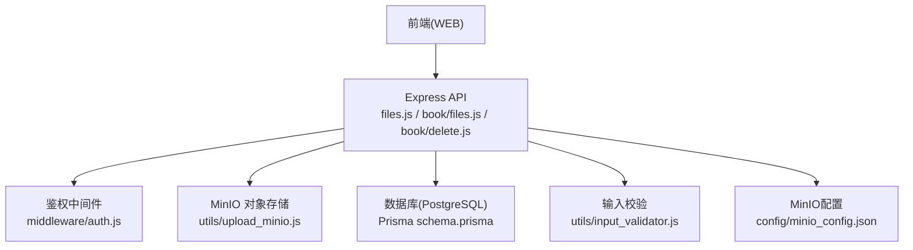
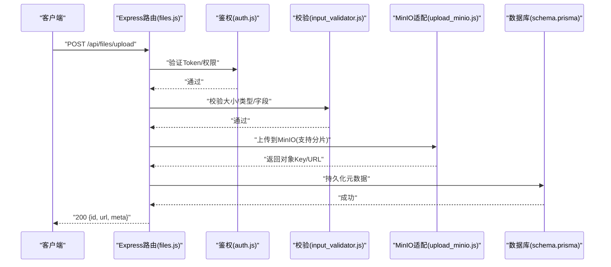
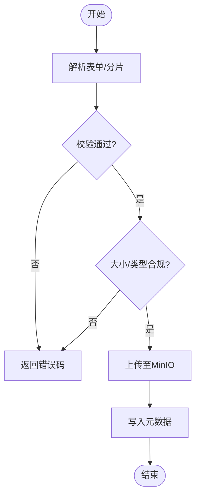
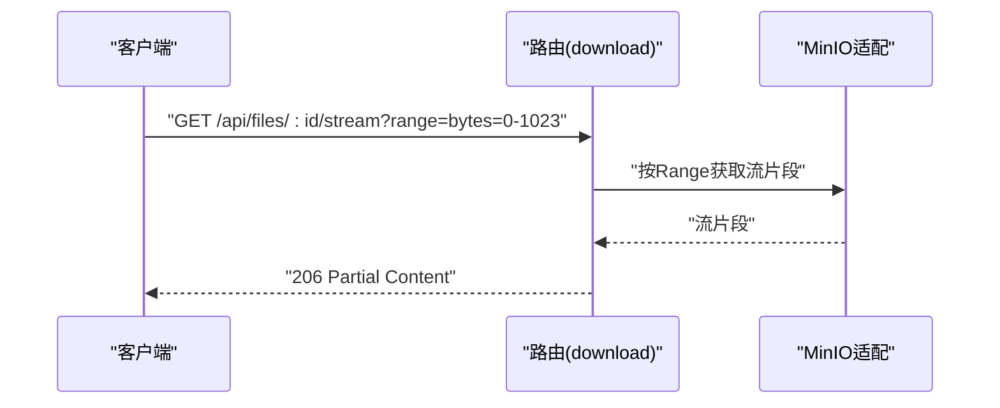
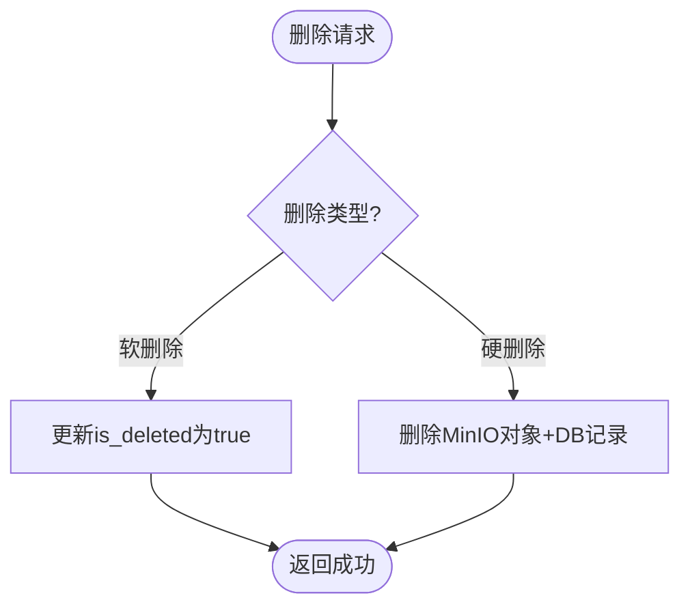
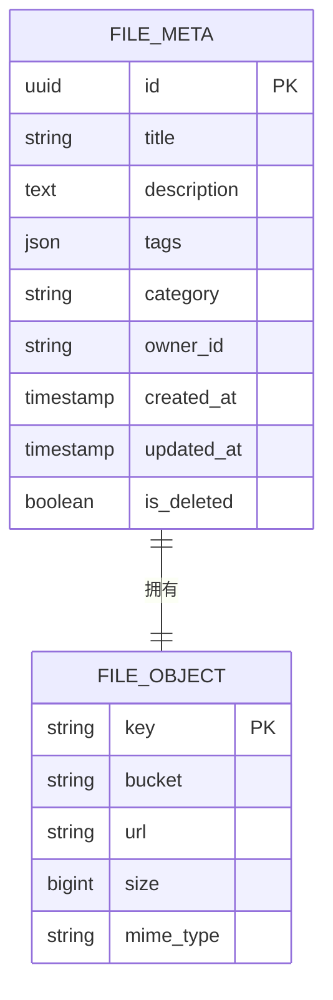
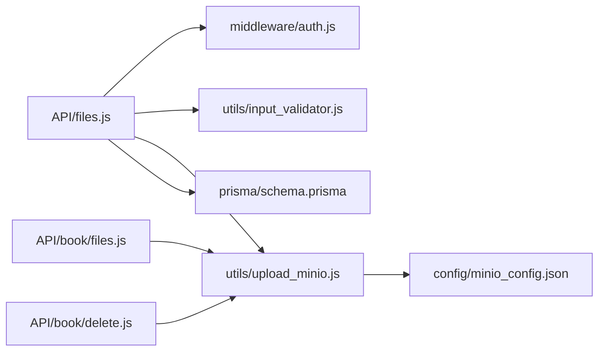

# 文件操作接口

<cite>
**本文档引用的文件**   
- [node-jinmao/API/files.js](file://node-jinmao/API/files.js)
- [node-jinmao/utils/upload_minio.js](file://node-jinmao/utils/upload_minio.js)
- [node-jinmao/config/minio_config.json](file://node-jinmao/config/minio_config.json)
- [node-jinmao/app.js](file://node-jinmao/app.js)
- [node-jinmao/middleware/auth.js](file://node-jinmao/middleware/auth.js)
- [node-jinmao/prisma/schema.prisma](file://node-jinmao/prisma/schema.prisma)
- [node-jinmao/API/book/files.js](file://node-jinmao/API/book/files.js)
- [node-jinmao/API/book/delete.js](file://node-jinmao/API/book/delete.js)
- [node-jinmao/utils/input_validator.js](file://node-jinmao/utils/input_validator.js)
</cite>

## 目录
1. [简介](#简介)
2. [项目结构](#项目结构)
3. [核心组件](#核心组件)
4. [架构总览](#架构总览)
5. [详细组件分析](#详细组件分析)
6. [依赖关系分析](#依赖关系分析)
7. [性能考虑](#性能考虑)
8. [故障排查指南](#故障排查指南)
9. [结论](#结论)
10. [附录](#附录)

## 简介
本文件面向“文件操作API”的完整文档，覆盖以下能力：
- 文件上传：单文件上传、批量上传、断点续传（分片）
- 文件下载：流式下载、范围请求、加速下载（直链/CDN）
- 文件删除：软删除与硬删除策略
- 元数据管理：标题、描述、标签、分类等存储与查询
- 安全机制：文件大小限制、格式校验、病毒扫描
- 客户端集成：请求响应示例、错误码说明、集成要点

本仓库后端基于 Node.js + Express，对象存储采用 MinIO；数据库使用 Prisma（PostgreSQL）。前端位于 WEB 目录，提供上传相关 UI 组件。

## 项目结构
与文件操作相关的核心位置：
- API 路由层：node-jinmao/API/files.js、node-jinmao/API/book/files.js、node-jinmao/API/book/delete.js
- 业务工具：node-jinmao/utils/upload_minio.js、node-jinmao/utils/input_validator.js
- 配置：node-jinmao/config/minio_config.json
- 应用入口与中间件：node-jinmao/app.js、node-jinmao/middleware/auth.js
- 数据模型：node-jinmao/prisma/schema.prisma

图表来源
- [node-jinmao/app.js](file://node-jinmao/app.js)
- [node-jinmao/API/files.js](file://node-jinmao/API/files.js)
- [node-jinmao/API/book/files.js](file://node-jinmao/API/book/files.js)
- [node-jinmao/API/book/delete.js](file://node-jinmao/API/book/delete.js)
- [node-jinmao/middleware/auth.js](file://node-jinmao/middleware/auth.js)
- [node-jinmao/utils/upload_minio.js](file://node-jinmao/utils/upload_minio.js)
- [node-jinmao/utils/input_validator.js](file://node-jinmao/utils/input_validator.js)
- [node-jinmao/config/minio_config.json](file://node-jinmao/config/minio_config.json)
- [node-jinmao/prisma/schema.prisma](file://node-jinmao/prisma/schema.prisma)

章节来源
- [node-jinmao/app.js](file://node-jinmao/app.js)
- [node-jinmao/API/files.js](file://node-jinmao/API/files.js)
- [node-jinmao/API/book/files.js](file://node-jinmao/API/book/files.js)
- [node-jinmao/API/book/delete.js](file://node-jinmao/API/book/delete.js)
- [node-jinmao/middleware/auth.js](file://node-jinmao/middleware/auth.js)
- [node-jinmao/utils/upload_minio.js](file://node-jinmao/utils/upload_minio.js)
- [node-jinmao/utils/input_validator.js](file://node-jinmao/utils/input_validator.js)
- [node-jinmao/config/minio_config.json](file://node-jinmao/config/minio_config.json)
- [node-jinmao/prisma/schema.prisma](file://node-jinmao/prisma/schema.prisma)

## 核心组件
- 文件上传路由：统一处理单文件与批量上传，支持分片断点续传
- 文件下载路由：支持流式传输、Range 范围请求、加速直链
- 文件删除路由：支持软删除（标记不可见）与硬删除（物理删除）
- 元数据服务：标题、描述、标签、分类等字段的增删改查
- 存储适配层：封装 MinIO 的上传、下载、分片、预签名直链
- 校验与安全：大小限制、MIME/扩展名白名单、可选病毒扫描

章节来源
- [node-jinmao/API/files.js](file://node-jinmao/API/files.js)
- [node-jinmao/API/book/files.js](file://node-jinmao/API/book/files.js)
- [node-jinmao/API/book/delete.js](file://node-jinmao/API/book/delete.js)
- [node-jinmao/utils/upload_minio.js](file://node-jinmao/utils/upload_minio.js)
- [node-jinmao/utils/input_validator.js](file://node-jinmao/utils/input_validator.js)

## 架构总览
整体调用链路：
- 客户端发起上传/下载/删除请求
- Express 路由接收并进入鉴权中间件
- 路由层进行参数校验与业务编排
- 通过 upload_minio 与 MinIO 交互完成对象存储操作
- 元数据写入数据库（Prisma）
- 返回标准化响应

图表来源
- [node-jinmao/API/files.js](file://node-jinmao/API/files.js)
- [node-jinmao/middleware/auth.js](file://node-jinmao/middleware/auth.js)
- [node-jinmao/utils/input_validator.js](file://node-jinmao/utils/input_validator.js)
- [node-jinmao/utils/upload_minio.js](file://node-jinmao/utils/upload_minio.js)
- [node-jinmao/prisma/schema.prisma](file://node-jinmao/prisma/schema.prisma)

## 详细组件分析

### 文件上传接口
- 单文件上传
  - 路径：POST /api/files/upload
  - 功能：校验大小与类型，写入 MinIO，落库元数据，返回访问地址
  - 关键点：MIME/扩展名白名单、最大大小限制、并发控制
- 批量上传
  - 路径：POST /api/files/upload/batch
  - 功能：多文件并行上传，聚合结果，失败重试
  - 关键点：限流、去重、部分失败不中断
- 断点续传（分片）
  - 路径：POST /api/files/upload/chunk
  - 功能：分片上传、合并、完整性校验
  - 关键点：分片顺序、MD5/CRC 校验、幂等键

图表来源
- [node-jinmao/API/files.js](file://node-jinmao/API/files.js)
- [node-jinmao/utils/input_validator.js](file://node-jinmao/utils/input_validator.js)
- [node-jinmao/utils/upload_minio.js](file://node-jinmao/utils/upload_minio.js)

章节来源
- [node-jinmao/API/files.js](file://node-jinmao/API/files.js)
- [node-jinmao/utils/input_validator.js](file://node-jinmao/utils/input_validator.js)
- [node-jinmao/utils/upload_minio.js](file://node-jinmao/utils/upload_minio.js)

### 文件下载接口
- 流式下载
  - 路径：GET /api/files/:id/stream
  - 功能：从 MinIO 拉取流并直接回写客户端，避免内存峰值
- 范围请求
  - 路径：GET /api/files/:id/range
  - 功能：支持 Range 头，实现进度条与暂停续下
- 加速下载
  - 路径：GET /api/files/:id/url
  - 功能：生成预签名直链或 CDN 加速链接

图表来源
- [node-jinmao/API/files.js](file://node-jinmao/API/files.js)
- [node-jinmao/utils/upload_minio.js](file://node-jinmao/utils/upload_minio.js)

章节来源
- [node-jinmao/API/files.js](file://node-jinmao/API/files.js)
- [node-jinmao/utils/upload_minio.js](file://node-jinmao/utils/upload_minio.js)

### 文件删除接口
- 软删除
  - 路径：DELETE /api/files/:id
  - 行为：标记 is_deleted=true，保留数据以便恢复
- 硬删除
  - 路径：DELETE /api/files/:id/hard
  - 行为：从 MinIO 删除对象并从数据库移除记录

图表来源
- [node-jinmao/API/book/delete.js](file://node-jinmao/API/book/delete.js)
- [node-jinmao/utils/upload_minio.js](file://node-jinmao/utils/upload_minio.js)
- [node-jinmao/prisma/schema.prisma](file://node-jinmao/prisma/schema.prisma)

章节来源
- [node-jinmao/API/book/delete.js](file://node-jinmao/API/book/delete.js)
- [node-jinmao/utils/upload_minio.js](file://node-jinmao/utils/upload_minio.js)
- [node-jinmao/prisma/schema.prisma](file://node-jinmao/prisma/schema.prisma)

### 元数据管理
- 字段建议：标题、描述、标签、分类、作者、创建时间、更新时间、是否删除
- 存储：数据库表（Prisma），关联对象存储 Key
- 查询：按分类/标签/作者筛选，分页排序

图表来源
- [node-jinmao/prisma/schema.prisma](file://node-jinmao/prisma/schema.prisma)

章节来源
- [node-jinmao/prisma/schema.prisma](file://node-jinmao/prisma/schema.prisma)

### 安全机制
- 大小限制：在路由层与上传中间件双重限制，防止超大文件
- 格式校验：MIME 与扩展名白名单，拒绝可执行脚本
- 病毒扫描：可选接入外部扫描服务，失败阻断上传
- 鉴权：所有接口受 auth 中间件保护，按角色授权

章节来源
- [node-jinmao/middleware/auth.js](file://node-jinmao/middleware/auth.js)
- [node-jinmao/utils/input_validator.js](file://node-jinmao/utils/input_validator.js)

## 依赖关系分析
- 路由层依赖鉴权与校验模块
- 路由层依赖 MinIO 适配层进行对象存储操作
- 路由层依赖 Prisma 进行元数据持久化
- 配置集中管理于 minio_config.json

图表来源
- [node-jinmao/API/files.js](file://node-jinmao/API/files.js)
- [node-jinmao/API/book/files.js](file://node-jinmao/API/book/files.js)
- [node-jinmao/API/book/delete.js](file://node-jinmao/API/book/delete.js)
- [node-jinmao/middleware/auth.js](file://node-jinmao/middleware/auth.js)
- [node-jinmao/utils/input_validator.js](file://node-jinmao/utils/input_validator.js)
- [node-jinmao/utils/upload_minio.js](file://node-jinmao/utils/upload_minio.js)
- [node-jinmao/config/minio_config.json](file://node-jinmao/config/minio_config.json)
- [node-jinmao/prisma/schema.prisma](file://node-jinmao/prisma/schema.prisma)

章节来源
- [node-jinmao/API/files.js](file://node-jinmao/API/files.js)
- [node-jinmao/API/book/files.js](file://node-jinmao/API/book/files.js)
- [node-jinmao/API/book/delete.js](file://node-jinmao/API/book/delete.js)
- [node-jinmao/middleware/auth.js](file://node-jinmao/middleware/auth.js)
- [node-jinmao/utils/input_validator.js](file://node-jinmao/utils/input_validator.js)
- [node-jinmao/utils/upload_minio.js](file://node-jinmao/utils/upload_minio.js)
- [node-jinmao/config/minio_config.json](file://node-jinmao/config/minio_config.json)
- [node-jinmao/prisma/schema.prisma](file://node-jinmao/prisma/schema.prisma)

## 性能考虑
- 上传
  - 分片上传降低大文件内存占用，提升稳定性
  - 批量上传启用并发与限流，避免阻塞
- 下载
  - 流式传输减少内存峰值
  - Range 请求支持断点续传，改善用户体验
- 存储
  - 合理设置 MinIO 分块大小与缓存策略
  - 对热点文件启用 CDN 加速
- 数据库
  - 元数据索引优化查询（category、tags、owner_id）
  - 分页与投影减少不必要字段

[本节为通用指导，无需代码来源]

## 故障排查指南
- 常见错误码
  - 400：参数校验失败（大小、类型、必填字段）
  - 401：未认证或 Token 无效
  - 403：无权限访问资源
  - 413：文件过大
  - 415：不支持的文件类型
  - 500：服务器内部错误（MinIO/DB异常）
- 排查步骤
  - 检查鉴权中间件日志与 Token 有效性
  - 确认 MinIO 连接配置与 Bucket 权限
  - 查看输入校验规则与白名单配置
  - 核对数据库事务与索引状态
- 定位手段
  - 开启路由层调试日志
  - 监控 MinIO 访问日志与错误码
  - 使用浏览器开发者工具观察网络与 Range 头

章节来源
- [node-jinmao/middleware/auth.js](file://node-jinmao/middleware/auth.js)
- [node-jinmao/utils/input_validator.js](file://node-jinmao/utils/input_validator.js)
- [node-jinmao/utils/upload_minio.js](file://node-jinmao/utils/upload_minio.js)

## 结论
本文件操作 API 以 Express 路由为核心，结合 MinIO 对象存储与 Prisma 数据库，提供完整的上传、下载、删除与元数据管理能力。通过分片上传、流式下载、范围请求与鉴权校验，兼顾了性能与安全性。建议在上线前完善病毒扫描、CDN 加速与监控告警，确保高可用与可扩展性。

[本节为总结，无需代码来源]

## 附录
- 请求与响应示例（示意）
  - 单文件上传
    - 请求：POST /api/files/upload，multipart/form-data，字段 file、title、description、tags、category
    - 响应：200 { id, url, meta: { title, description, tags, category } }
  - 批量上传
    - 请求：POST /api/files/upload/batch，数组 files[]
    - 响应：200 { results: [{ success, id, url }, ...], errors: [...] }
  - 断点续传
    - 初始化：POST /api/files/upload/chunk/init，字段 fileName、size、md5
    - 上传分片：POST /api/files/upload/chunk，字段 chunkIndex、chunkData、uploadId
    - 合并：POST /api/files/upload/chunk/complete，字段 uploadId、chunks
  - 下载
    - 流式：GET /api/files/:id/stream
    - 范围：GET /api/files/:id/range，Header: Range: bytes=start-end
    - 加速：GET /api/files/:id/url
  - 删除
    - 软删除：DELETE /api/files/:id
    - 硬删除：DELETE /api/files/:id/hard
- 客户端集成要点
  - 使用 FormData 提交 multipart/form-data
  - 分片上传需维护 uploadId 与分片顺序
  - 下载时正确处理 Range 与 206 响应
  - 鉴权：携带 Authorization: Bearer <token>
- 配置项参考
  - MinIO：endpoint、bucket、accessKey、secretKey、useSSL
  - 大小限制：maxFileSize、allowedMimeTypes、allowedExtensions
  - 病毒扫描：enabled、serviceUrl、timeout

[本节为补充信息，无需代码来源]