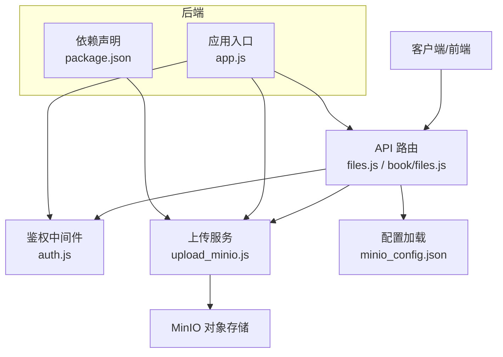
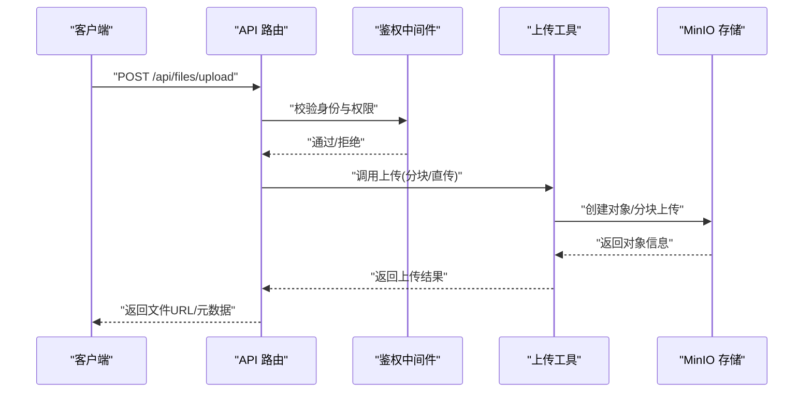
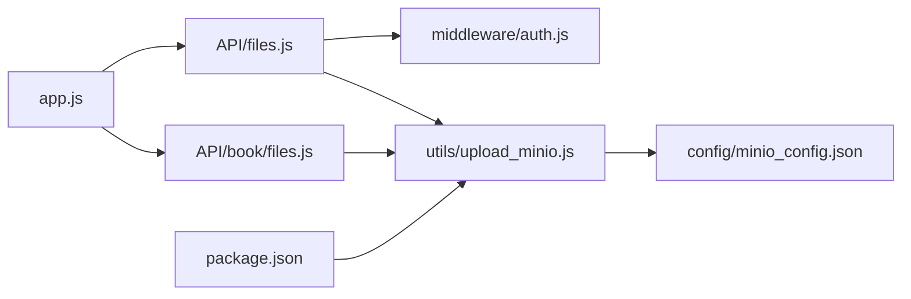

# 文件管理策略

<cite>
**本文引用的文件**   
- [node-jinmao/API/files.js](file://node-jinmao/API/files.js)
- [node-jinmao/utils/upload_minio.js](file://node-jinmao/utils/upload_minio.js)
- [node-jinmao/config/minio_config.json](file://node-jinmao/config/minio_config.json)
- [node-jinmao/API/book/files.js](file://node-jinmao/API/book/files.js)
- [node-jinmao/middleware/auth.js](file://node-jinmao/middleware/auth.js)
- [node-jinmao/app.js](file://node-jinmao/app.js)
- [node-jinmao/package.json](file://node-jinmao/package.json)
- [test/code/minio-crud.js](file://test/code/minio-crud.js)
</cite>

## 目录
1. [简介](#简介)
2. [项目结构](#项目结构)
3. [核心组件](#核心组件)
4. [架构总览](#架构总览)
5. [详细组件分析](#详细组件分析)
6. [依赖分析](#依赖分析)
7. [性能考虑](#性能考虑)
8. [故障排查指南](#故障排查指南)
9. [结论](#结论)
10. [附录](#附录)

## 简介
本文件管理策略文档围绕仓库中的后端文件服务与对象存储集成展开，覆盖以下关键主题：
- 文件命名规范与目录结构设计
- 版本控制机制（基于内容哈希）
- 临时文件的生成、管理与清理策略（含自动过期）
- 文件去重机制（基于内容哈希识别与重复检测）
- 文件权限控制、访问验证与防盗链实现
- 文件压缩优化、图片格式转换与缩略图生成
- 备份恢复方案、数据迁移工具、存储空间监控与告警

本策略以 MinIO 对象存储为核心，结合 Node.js 后端 API 与中间件，提供统一的文件上传、下载、元数据管理与生命周期管理能力。

## 项目结构
本项目采用前后端分离的架构，后端位于 node-jinmao 目录，前端位于 WEB 目录。文件相关能力集中在后端 API 层与工具层：
- API 层：统一暴露文件上传、下载、列表等接口
- 工具层：封装 MinIO 客户端操作、鉴权、配置加载
- 配置层：MinIO 连接参数、桶策略、生命周期规则
- 测试层：提供 MinIO CRUD 示例脚本

图表来源
- [node-jinmao/app.js](file://node-jinmao/app.js)
- [node-jinmao/API/files.js](file://node-jinmao/API/files.js)
- [node-jinmao/API/book/files.js](file://node-jinmao/API/book/files.js)
- [node-jinmao/middleware/auth.js](file://node-jinmao/middleware/auth.js)
- [node-jinmao/utils/upload_minio.js](file://node-jinmao/utils/upload_minio.js)
- [node-jinmao/config/minio_config.json](file://node-jinmao/config/minio_config.json)
- [node-jinmao/package.json](file://node-jinmao/package.json)

章节来源
- [node-jinmao/app.js](file://node-jinmao/app.js)
- [node-jinmao/package.json](file://node-jinmao/package.json)

## 核心组件
- 文件 API：提供上传、下载、删除、列表、按书维度管理等接口
- MinIO 上传工具：封装连接、分块上传、预签名 URL、元数据写入
- 鉴权中间件：校验请求身份与权限，防止未授权访问
- 配置中心：集中管理 MinIO 地址、凭据、桶名、策略与生命周期

章节来源
- [node-jinmao/API/files.js](file://node-jinmao/API/files.js)
- [node-jinmao/API/book/files.js](file://node-jinmao/API/book/files.js)
- [node-jinmao/utils/upload_minio.js](file://node-jinmao/utils/upload_minio.js)
- [node-jinmao/middleware/auth.js](file://node-jinmao/middleware/auth.js)
- [node-jinmao/config/minio_config.json](file://node-jinmao/config/minio_config.json)

## 架构总览
整体流程如下：客户端发起文件操作请求，经鉴权中间件校验后进入对应 API 处理逻辑；文件上传通过 MinIO 工具完成，支持分块上传与预签名链接；下载与预览可通过预签名 URL 直连对象存储，减少后端压力；元数据与索引由数据库或缓存维护；生命周期与权限策略由 MinIO 配置驱动。

图表来源
- [node-jinmao/API/files.js](file://node-jinmao/API/files.js)
- [node-jinmao/middleware/auth.js](file://node-jinmao/middleware/auth.js)
- [node-jinmao/utils/upload_minio.js](file://node-jinmao/utils/upload_minio.js)

## 详细组件分析

### 文件命名规范与目录结构设计
- 命名规范建议
  - 使用小写字母、数字、短横线与下划线组合，避免特殊字符
  - 文件名包含业务标识与时间戳，便于检索与审计
  - 扩展名与实际 MIME 类型一致，禁止伪造扩展名
- 目录结构建议
  - 按业务域划分桶或前缀，如 books、courses、quizzes
  - 每个实体（如书籍）拥有独立前缀，便于权限隔离与统计
  - 版本化路径包含版本号或内容哈希，支持回滚与对比

章节来源
- [node-jinmao/API/book/files.js](file://node-jinmao/API/book/files.js)
- [node-jinmao/config/minio_config.json](file://node-jinmao/config/minio_config.json)

### 版本控制机制（基于内容哈希）
- 内容哈希计算：对文件内容进行哈希（如 SHA-256），作为唯一标识
- 版本路径：将哈希值嵌入对象键路径，形成不可变版本
- 去重策略：若相同哈希已存在，直接复用对象，避免重复存储
- 元数据记录：在数据库或索引中记录哈希、版本、创建时间与引用计数

章节来源
- [node-jinmao/utils/upload_minio.js](file://node-jinmao/utils/upload_minio.js)
- [node-jinmao/config/minio_config.json](file://node-jinmao/config/minio_config.json)

### 临时文件的生成、管理与清理策略
- 生成场景：分块上传缓冲、转码中间产物、缩略图生成缓存
- 命名与位置：统一前缀 temp_，存放于专用桶或前缀，便于隔离
- 过期策略：设置对象生命周期规则，按时间自动清理；或在任务完成后主动删除
- 清理保障：失败重试与幂等删除，确保无残留

章节来源
- [node-jinmao/utils/upload_minio.js](file://node-jinmao/utils/upload_minio.js)
- [node-jinmao/config/minio_config.json](file://node-jinmao/config/minio_config.json)

### 文件去重机制（基于内容哈希识别与重复检测）
- 上传前计算哈希，查询是否已存在
- 若存在则直接返回已有对象 URL，并增加引用计数
- 若不存在则执行上传，并记录哈希与元数据
- 支持批量去重与增量同步

章节来源
- [node-jinmao/utils/upload_minio.js](file://node-jinmao/utils/upload_minio.js)

### 文件权限控制、访问验证与防盗链
- 鉴权中间件：校验 JWT 或会话令牌，限制未认证访问
- 预签名 URL：为下载与预览生成短期有效的直链，限制 IP、方法与过期时间
- 桶策略：最小权限原则，仅允许必要操作（读/写/删）
- 防盗链：校验 Referer 白名单与签名参数，防止外部滥用

章节来源
- [node-jinmao/middleware/auth.js](file://node-jinmao/middleware/auth.js)
- [node-jinmao/utils/upload_minio.js](file://node-jinmao/utils/upload_minio.js)
- [node-jinmao/config/minio_config.json](file://node-jinmao/config/minio_config.json)

### 文件压缩优化、图片格式转换与缩略图生成
- 压缩优化：对大文本与日志启用 GZIP 压缩，减少带宽占用
- 格式转换：图片统一转换为 WebP/AVIF，提升加载速度
- 缩略图：生成多尺寸缩略图，按需返回，降低首屏负载
- 异步处理：转码与缩略图生成放入队列，避免阻塞主流程

章节来源
- [node-jinmao/utils/upload_minio.js](file://node-jinmao/utils/upload_minio.js)
- [node-jinmao/config/minio_config.json](file://node-jinmao/config/minio_config.json)

### 备份恢复方案、数据迁移工具、存储空间监控与告警
- 备份策略：定期快照桶对象与元数据，跨地域复制
- 恢复流程：从快照还原对象与索引，校验完整性与一致性
- 迁移工具：提供脚本进行桶间迁移、格式转换与哈希重建
- 监控告警：监控存储用量、错误率与延迟，阈值触发告警

章节来源
- [node-jinmao/config/minio_config.json](file://node-jinmao/config/minio_config.json)
- [test/code/minio-crud.js](file://test/code/minio-crud.js)

## 依赖分析
- 运行时依赖：Node.js 环境、MinIO SDK、JWT 库、HTTP 框架
- 模块耦合：API 层依赖鉴权中间件与上传工具；上传工具依赖配置与 MinIO 客户端
- 外部集成：MinIO 对象存储、可能的消息队列（用于异步任务）

图表来源
- [node-jinmao/API/files.js](file://node-jinmao/API/files.js)
- [node-jinmao/API/book/files.js](file://node-jinmao/API/book/files.js)
- [node-jinmao/middleware/auth.js](file://node-jinmao/middleware/auth.js)
- [node-jinmao/utils/upload_minio.js](file://node-jinmao/utils/upload_minio.js)
- [node-jinmao/config/minio_config.json](file://node-jinmao/config/minio_config.json)
- [node-jinmao/app.js](file://node-jinmao/app.js)
- [node-jinmao/package.json](file://node-jinmao/package.json)

章节来源
- [node-jinmao/package.json](file://node-jinmao/package.json)
- [node-jinmao/app.js](file://node-jinmao/app.js)

## 性能考虑
- 分块上传：大文件分块并行上传，提升吞吐与容错
- 预签名直链：下载与预览直连对象存储，减轻后端压力
- 缓存策略：热点对象与缩略图缓存，降低重复计算
- 异步处理：转码与缩略图生成异步化，避免阻塞请求链路
- 资源限制：并发与速率限制，防止单用户独占资源

[本节为通用指导，不直接分析具体文件]

## 故障排查指南
- 上传失败：检查网络连通性、桶权限、分块大小与超时设置
- 下载异常：核对预签名 URL 有效期、Referer 白名单与签名算法
- 权限问题：确认 JWT 令牌有效性与角色权限映射
- 存储不足：监控桶容量与配额，调整生命周期策略
- 日志定位：查看上传与鉴权日志，定位错误堆栈与原因

章节来源
- [node-jinmao/middleware/auth.js](file://node-jinmao/middleware/auth.js)
- [node-jinmao/utils/upload_minio.js](file://node-jinmao/utils/upload_minio.js)
- [node-jinmao/config/minio_config.json](file://node-jinmao/config/minio_config.json)

## 结论
本文件管理策略以 MinIO 对象存储为核心，结合鉴权中间件与上传工具，实现了安全的文件上传、下载、版本控制与生命周期管理。通过内容哈希去重、预签名直链与异步处理，提升了系统性能与可靠性。建议在生产环境中完善监控告警与备份恢复流程，确保数据安全与业务连续性。

[本节为总结性内容，不直接分析具体文件]

## 附录
- 参考脚本：MinIO CRUD 示例可用于验证上传、下载、删除与生命周期操作
- 配置项：集中管理 MinIO 连接、桶策略与生命周期规则，便于运维变更

章节来源
- [test/code/minio-crud.js](file://test/code/minio-crud.js)
- [node-jinmao/config/minio_config.json](file://node-jinmao/config/minio_config.json)