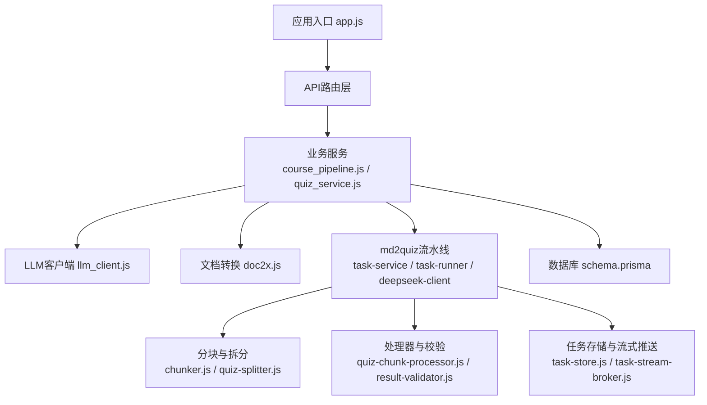
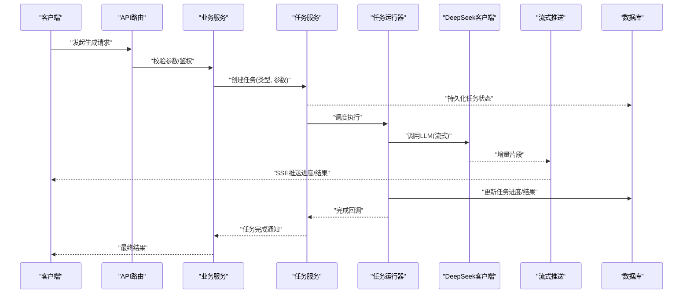
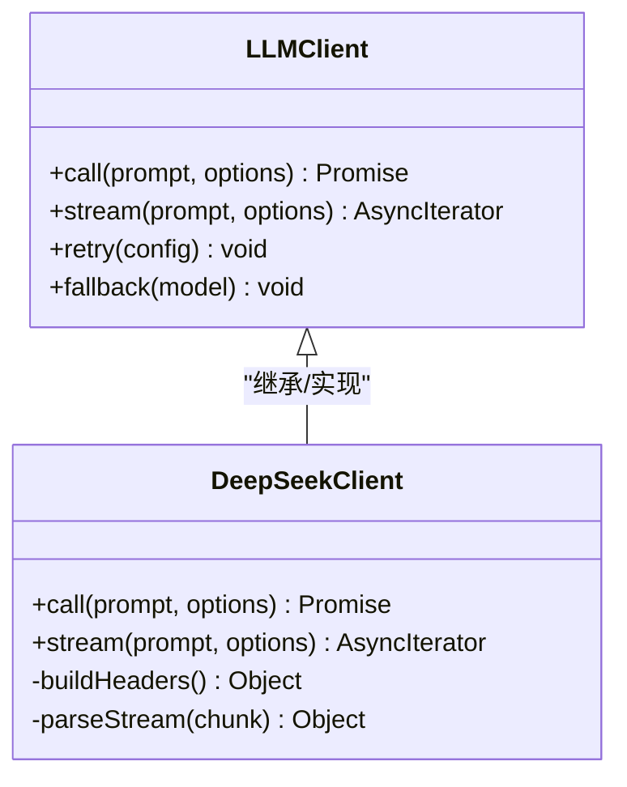
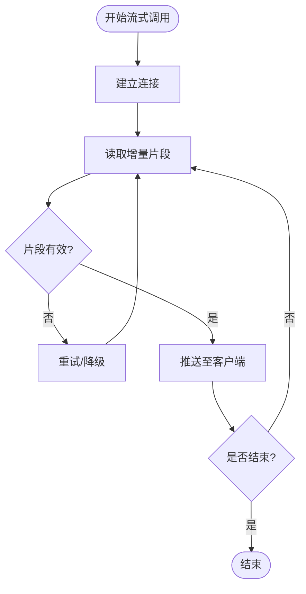
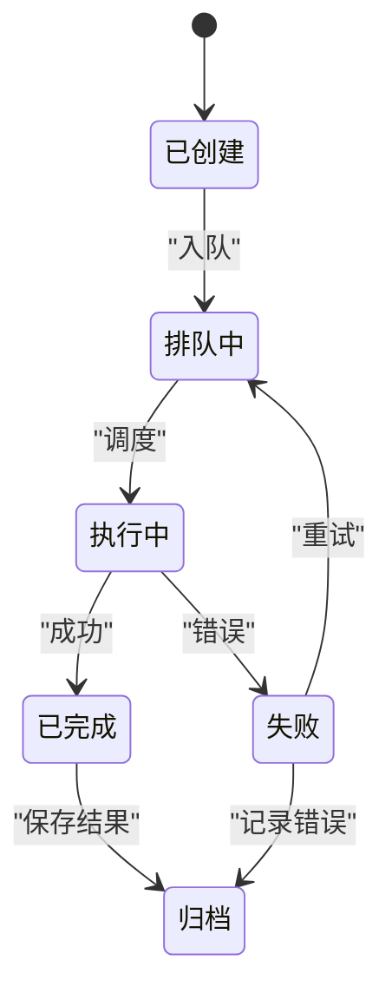
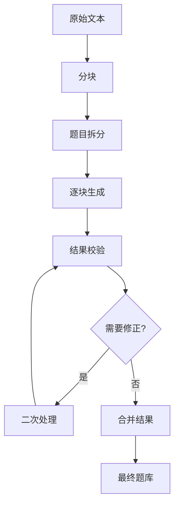
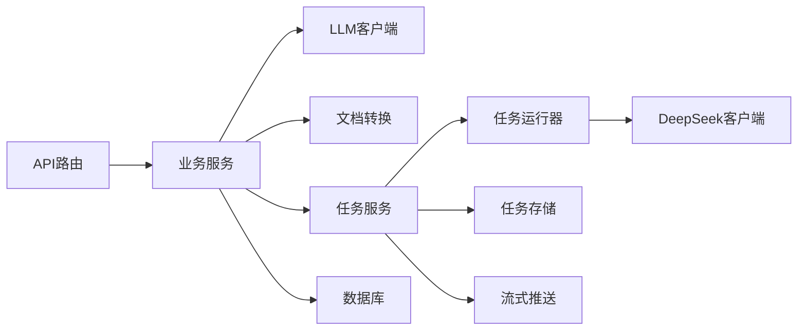

# AI内容生成

<cite>
**本文引用的文件**   
- [app.js](file://node-jinmao/app.js)
- [package.json](file://node-jinmao/package.json)
- [deepseek_config.json](file://node-jinmao/config/deepseek_config.json)
- [prompt.json](file://node-jinmao/config/prompt.json)
- [md2quiz_prompt.md](file://node-jinmao/config/md2quiz_prompt.md)
- [quiz-format-prompt.md](file://node-jinmao/config/quiz-format-prompt.md)
- [quiz-split-prompt.md](file://node-jinmao/config/quiz-split-prompt.md)
- [title_prompt.txt](file://node-jinmao/config/title_prompt.txt)
- [elaboration_prompt_first.txt](file://node-jinmao/config/elaboration_prompt_first.txt)
- [html_ppt_prompt.txt](file://node-jinmao/config/html_ppt_prompt.txt)
- [cover_prompt.txt](file://node-jinmao/config/cover_prompt.txt)
- [llm_client.js](file://node-jinmao/utils/llm_client.js)
- [doc2x.js](file://node-jinmao/utils/doc2x.js)
- [course_pipeline.js](file://node-jinmao/service/course_pipeline.js)
- [create_title.js](file://node-jinmao/service/create_title.js)
- [create_cover_image.js](file://node-jinmao/service/create_cover_image.js)
- [POSTbook.js](file://node-jinmao/service/POSTbook.js)
- [chunker.js](file://node-jinmao/service/md2quiz/chunker.js)
- [deepseek-client.js](file://node-jinmao/service/md2quiz/deepseek-client.js)
- [pdf-to-md.js](file://node-jinmao/service/md2quiz/pdf-to-md.js)
- [quiz-chunk-processor.js](file://node-jinmao/service/md2quiz/quiz-chunk-processor.js)
- [quiz-splitter.js](file://node-jinmao/service/md2quiz/quiz-splitter.js)
- [result-validator.js](file://node-jinmao/service/md2quiz/result-validator.js)
- [task-runner.js](file://node-jinmao/service/md2quiz/task-runner.js)
- [task-service.js](file://node-jinmao/service/md2quiz/task-service.js)
- [task-store.js](file://node-jinmao/service/md2quiz/task-store.js)
- [task-stream-broker.js](file://node-jinmao/service/md2quiz/task-stream-broker.js)
- [types.js](file://node-jinmao/service/md2quiz/types.js)
- [quiz_service.js](file://node-jinmao/service/quiz_service.js)
- [quiz_sse_broker.js](file://node-jinmao/service/quiz_sse_broker.js)
- [schema.prisma](file://node-jinmao/prisma/schema.prisma)
</cite>

## 目录
1. [简介](#简介)
2. [项目结构](#项目结构)
3. [核心组件](#核心组件)
4. [架构总览](#架构总览)
5. [详细组件分析](#详细组件分析)
6. [依赖关系分析](#依赖关系分析)
7. [性能考虑](#性能考虑)
8. [故障排查指南](#故障排查指南)
9. [结论](#结论)
10. [附录](#附录)

## 简介
本文件面向AI内容生成系统，系统性说明大语言模型（LLM）集成方式、DeepSeek API调用机制与流式响应处理、任务调度与异步处理、结果验证与质量控制、配置与提示词管理、错误重试与降级策略，以及与题库生成、课程内容的结合方式。同时给出扩展新AI服务提供商与自定义内容生成规则的方法，并总结性能优化与成本控制方案。

## 项目结构
后端服务基于Node.js，采用模块化组织：
- 入口与路由：应用启动、API路由挂载
- 配置与提示词：外部化配置与模板管理
- LLM客户端：统一抽象的模型调用封装
- 业务服务：课程生成、标题生成、封面图生成、题库导入等
- md2quiz流水线：分块、拆分、处理器、任务编排、流式推送、结果校验
- 数据库：Prisma Schema定义实体与迁移

图表来源
- [app.js](file://node-jinmao/app.js)
- [course_pipeline.js](file://node-jinmao/service/course_pipeline.js)
- [quiz_service.js](file://node-jinmao/service/quiz_service.js)
- [llm_client.js](file://node-jinmao/utils/llm_client.js)
- [doc2x.js](file://node-jinmao/utils/doc2x.js)
- [task-service.js](file://node-jinmao/service/md2quiz/task-service.js)
- [task-runner.js](file://node-jinmao/service/md2quiz/task-runner.js)
- [deepseek-client.js](file://node-jinmao/service/md2quiz/deepseek-client.js)
- [chunker.js](file://node-jinmao/service/md2quiz/chunker.js)
- [quiz-splitter.js](file://node-jinmao/service/md2quiz/quiz-splitter.js)
- [quiz-chunk-processor.js](file://node-jinmao/service/md2quiz/quiz-chunk-processor.js)
- [result-validator.js](file://node-jinmao/service/md2quiz/result-validator.js)
- [task-store.js](file://node-jinmao/service/md2quiz/task-store.js)
- [task-stream-broker.js](file://node-jinmao/service/md2quiz/task-stream-broker.js)
- [schema.prisma](file://node-jinmao/prisma/schema.prisma)

章节来源
- [app.js](file://node-jinmao/app.js)
- [package.json](file://node-jinmao/package.json)

## 核心组件
- LLM客户端封装：统一对外暴露调用接口，屏蔽不同提供商差异，支持超时、重试、降级与流式输出。
- DeepSeek客户端：实现DeepSeek API调用，包括请求构造、鉴权、流式读取与错误处理。
- 任务服务与运行器：将长耗时生成任务拆分为可追踪的任务单元，支持并发控制、状态持久化与进度上报。
- 分块与拆分器：对输入文本进行智能分块与题目拆分，保证上下文长度与质量。
- 处理器与校验器：对LLM返回结果进行结构化解析、格式校验与二次修正。
- 流式推送：通过SSE或WebSocket将增量结果实时推送到前端。
- 配置与提示词管理：集中化管理模型参数、API密钥、温度、最大Token数及提示词模板。

章节来源
- [llm_client.js](file://node-jinmao/utils/llm_client.js)
- [deepseek-client.js](file://node-jinmao/service/md2quiz/deepseek-client.js)
- [task-service.js](file://node-jinmao/service/md2quiz/task-service.js)
- [task-runner.js](file://node-jinmao/service/md2quiz/task-runner.js)
- [chunker.js](file://node-jinmao/service/md2quiz/chunker.js)
- [quiz-splitter.js](file://node-jinmao/service/md2quiz/quiz-splitter.js)
- [quiz-chunk-processor.js](file://node-jinmao/service/md2quiz/quiz-chunk-processor.js)
- [result-validator.js](file://node-jinmao/service/md2quiz/result-validator.js)
- [task-stream-broker.js](file://node-jinmao/service/md2quiz/task-stream-broker.js)
- [deepseek_config.json](file://node-jinmao/config/deepseek_config.json)
- [prompt.json](file://node-jinmao/config/prompt.json)

## 架构总览
系统以“服务层 + 流水线”为核心，将LLM能力嵌入到题库生成与课程内容生产流程中。关键数据流如下：

图表来源
- [app.js](file://node-jinmao/app.js)
- [task-service.js](file://node-jinmao/service/md2quiz/task-service.js)
- [task-runner.js](file://node-jinmao/service/md2quiz/task-runner.js)
- [deepseek-client.js](file://node-jinmao/service/md2quiz/deepseek-client.js)
- [task-stream-broker.js](file://node-jinmao/service/md2quiz/task-stream-broker.js)
- [schema.prisma](file://node-jinmao/prisma/schema.prisma)

## 详细组件分析

### LLM客户端与DeepSeek集成
- 统一客户端：提供标准化接口，包含请求构建、重试、超时、降级、日志与指标收集。
- DeepSeek客户端：实现具体协议，支持流式响应；失败时自动重试并回退到备用模型或缓存结果。
- 配置项：API密钥、Base URL、模型名、温度、TopP、最大Token、超时时间、重试次数等。

图表来源
- [llm_client.js](file://node-jinmao/utils/llm_client.js)
- [deepseek-client.js](file://node-jinmao/service/md2quiz/deepseek-client.js)
- [deepseek_config.json](file://node-jinmao/config/deepseek_config.json)

章节来源
- [llm_client.js](file://node-jinmao/utils/llm_client.js)
- [deepseek-client.js](file://node-jinmao/service/md2quiz/deepseek-client.js)
- [deepseek_config.json](file://node-jinmao/config/deepseek_config.json)

### 流式响应处理
- 服务端侧：使用流式读取LLM输出，按片段组装并广播给连接方。
- 前端侧：订阅SSE事件，渲染增量内容，支持中断与重连。
- 错误处理：网络异常、速率限制、模型不可用等场景下，触发重试或降级。

图表来源
- [task-stream-broker.js](file://node-jinmao/service/md2quiz/task-stream-broker.js)
- [deepseek-client.js](file://node-jinmao/service/md2quiz/deepseek-client.js)

章节来源
- [task-stream-broker.js](file://node-jinmao/service/md2quiz/task-stream-broker.js)
- [deepseek-client.js](file://node-jinmao/service/md2quiz/deepseek-client.js)

### 任务调度与异步处理
- 任务生命周期：创建、排队、执行、完成、失败、重试、归档。
- 并发控制：限制并行度，避免资源耗尽。
- 状态持久化：记录任务ID、类型、输入、进度、结果、错误信息。
- 进度上报：定时或事件驱动更新任务状态。

图表来源
- [task-service.js](file://node-jinmao/service/md2quiz/task-service.js)
- [task-runner.js](file://node-jinmao/service/md2quiz/task-runner.js)
- [task-store.js](file://node-jinmao/service/md2quiz/task-store.js)

章节来源
- [task-service.js](file://node-jinmao/service/md2quiz/task-service.js)
- [task-runner.js](file://node-jinmao/service/md2quiz/task-runner.js)
- [task-store.js](file://node-jinmao/service/md2quiz/task-store.js)

### 分块与拆分、处理器与校验
- 分块：按语义边界切分，控制上下文长度，提升稳定性。
- 拆分：将长文本拆分为题目集合，便于逐题生成与校验。
- 处理器：对每个分块执行生成逻辑，合并结果。
- 校验器：校验JSON结构、字段完整性、题型一致性，必要时二次修正。

图表来源
- [chunker.js](file://node-jinmao/service/md2quiz/chunker.js)
- [quiz-splitter.js](file://node-jinmao/service/md2quiz/quiz-splitter.js)
- [quiz-chunk-processor.js](file://node-jinmao/service/md2quiz/quiz-chunk-processor.js)
- [result-validator.js](file://node-jinmao/service/md2quiz/result-validator.js)

章节来源
- [chunker.js](file://node-jinmao/service/md2quiz/chunker.js)
- [quiz-splitter.js](file://node-jinmao/service/md2quiz/quiz-splitter.js)
- [quiz-chunk-processor.js](file://node-jinmao/service/md2quiz/quiz-chunk-processor.js)
- [result-validator.js](file://node-jinmao/service/md2quiz/result-validator.js)

### 配置与提示词管理
- 模型配置：DeepSeek API密钥、端点、模型名、温度、TopP、最大Token、超时、重试策略。
- 提示词模板：题库生成、格式约束、拆分规则、标题与封面生成、PPT生成等。
- 动态加载：运行时读取模板，支持环境变量覆盖。

章节来源
- [deepseek_config.json](file://node-jinmao/config/deepseek_config.json)
- [prompt.json](file://node-jinmao/config/prompt.json)
- [md2quiz_prompt.md](file://node-jinmao/config/md2quiz_prompt.md)
- [quiz-format-prompt.md](file://node-jinmao/config/quiz-format-prompt.md)
- [quiz-split-prompt.md](file://node-jinmao/config/quiz-split-prompt.md)
- [title_prompt.txt](file://node-jinmao/config/title_prompt.txt)
- [elaboration_prompt_first.txt](file://node-jinmao/config/elaboration_prompt_first.txt)
- [html_ppt_prompt.txt](file://node-jinmao/config/html_ppt_prompt.txt)
- [cover_prompt.txt](file://node-jinmao/config/cover_prompt.txt)

### 与题库生成、课程内容的结合
- 题库生成：从PDF/Markdown提取内容，经分块与拆分后调用LLM生成题目，校验后入库。
- 课程内容：根据大纲生成章节内容、标题、封面图、PPT等，串联多步流水线。
- 进度与报告：前端展示生成进度、错误详情与质量评分。

章节来源
- [pdf-to-md.js](file://node-jinmao/service/md2quiz/pdf-to-md.js)
- [course_pipeline.js](file://node-jinmao/service/course_pipeline.js)
- [create_title.js](file://node-jinmao/service/create_title.js)
- [create_cover_image.js](file://node-jinmao/service/create_cover_image.js)
- [POSTbook.js](file://node-jinmao/service/POSTbook.js)
- [quiz_service.js](file://node-jinmao/service/quiz_service.js)

### 错误重试与降级策略
- 重试：指数退避、最大重试次数、区分可重试与不可重试错误。
- 降级：切换备用模型、返回缓存结果、部分成功合并。
- 监控：记录错误码、延迟、成功率，告警阈值。

章节来源
- [llm_client.js](file://node-jinmao/utils/llm_client.js)
- [deepseek-client.js](file://node-jinmao/service/md2quiz/deepseek-client.js)

### 扩展新的AI服务提供商
- 步骤概览：
  - 新增客户端类，实现统一接口（call/stream）。
  - 在配置中心注册提供商参数。
  - 在服务层选择提供商（按优先级或A/B测试）。
  - 增加对应提示词模板与校验规则。
- 示例路径参考：
  - 客户端实现：[deepseek-client.js](file://node-jinmao/service/md2quiz/deepseek-client.js)
  - 统一接口：[llm_client.js](file://node-jinmao/utils/llm_client.js)
  - 配置：[deepseek_config.json](file://node-jinmao/config/deepseek_config.json)
  - 提示词：[md2quiz_prompt.md](file://node-jinmao/config/md2quiz_prompt.md)

章节来源
- [llm_client.js](file://node-jinmao/utils/llm_client.js)
- [deepseek-client.js](file://node-jinmao/service/md2quiz/deepseek-client.js)
- [deepseek_config.json](file://node-jinmao/config/deepseek_config.json)
- [md2quiz_prompt.md](file://node-jinmao/config/md2quiz_prompt.md)

### 自定义内容生成规则
- 规则位置：处理器与校验器中定义生成逻辑与约束。
- 方法：
  - 调整分块策略与拆分粒度。
  - 修改提示词模板，强化格式与质量要求。
  - 增加二次校验与修正步骤。
- 示例路径参考：
  - 处理器：[quiz-chunk-processor.js](file://node-jinmao/service/md2quiz/quiz-chunk-processor.js)
  - 校验器：[result-validator.js](file://node-jinmao/service/md2quiz/result-validator.js)
  - 提示词：[quiz-format-prompt.md](file://node-jinmao/config/quiz-format-prompt.md), [quiz-split-prompt.md](file://node-jinmao/config/quiz-split-prompt.md)

章节来源
- [quiz-chunk-processor.js](file://node-jinmao/service/md2quiz/quiz-chunk-processor.js)
- [result-validator.js](file://node-jinmao/service/md2quiz/result-validator.js)
- [quiz-format-prompt.md](file://node-jinmao/config/quiz-format-prompt.md)
- [quiz-split-prompt.md](file://node-jinmao/config/quiz-split-prompt.md)

## 依赖关系分析
- 模块耦合：服务层依赖LLM客户端与任务服务；任务服务依赖运行器、存储与流式推送。
- 外部依赖：数据库（Prisma）、对象存储（MinIO）、文档转换工具。
- 潜在循环：确保服务间单向依赖，避免循环引用。

图表来源
- [app.js](file://node-jinmao/app.js)
- [course_pipeline.js](file://node-jinmao/service/course_pipeline.js)
- [quiz_service.js](file://node-jinmao/service/quiz_service.js)
- [llm_client.js](file://node-jinmao/utils/llm_client.js)
- [doc2x.js](file://node-jinmao/utils/doc2x.js)
- [task-service.js](file://node-jinmao/service/md2quiz/task-service.js)
- [task-runner.js](file://node-jinmao/service/md2quiz/task-runner.js)
- [deepseek-client.js](file://node-jinmao/service/md2quiz/deepseek-client.js)
- [task-store.js](file://node-jinmao/service/md2quiz/task-store.js)
- [task-stream-broker.js](file://node-jinmao/service/md2quiz/task-stream-broker.js)
- [schema.prisma](file://node-jinmao/prisma/schema.prisma)

章节来源
- [app.js](file://node-jinmao/app.js)
- [schema.prisma](file://node-jinmao/prisma/schema.prisma)

## 性能考虑
- 并发与限流：限制LLM调用并发度，避免配额超限与服务器过载。
- 缓存与复用：缓存热点提示词与中间结果，减少重复计算。
- 流式传输：降低首字节延迟，提升用户体验。
- 批处理：批量提交请求，提高吞吐。
- 资源隔离：为不同任务类型分配独立队列与线程池。

## 故障排查指南
- 常见问题：
  - API鉴权失败：检查密钥与端点配置。
  - 流式中断：检查网络与代理设置，启用重连。
  - 结果格式错误：查看校验器日志，调整提示词。
  - 任务卡住：检查队列堆积与运行器状态。
- 定位手段：
  - 查看任务状态与错误堆栈。
  - 抓取SSE事件日志。
  - 监控LLM调用延迟与错误码。

章节来源
- [task-store.js](file://node-jinmao/service/md2quiz/task-store.js)
- [task-stream-broker.js](file://node-jinmao/service/md2quiz/task-stream-broker.js)
- [result-validator.js](file://node-jinmao/service/md2quiz/result-validator.js)

## 结论
本系统通过统一的LLM客户端、完善的任务调度与流式推送机制，实现了稳定高效的AI内容生成。借助分块与校验、重试与降级策略，保障了生成质量与可用性。建议在生产环境中加强监控与成本核算，持续优化提示词与流水线，以提升整体效果与经济性。

## 附录
- 成本控制方案：
  - 模型选择：优先低成本模型，复杂任务再切换高配模型。
  - Token预算：限制最大Token数，避免超长输出。
  - 缓存命中：复用历史结果，减少重复调用。
  - 用量统计：按用户与任务维度统计消耗，设置阈值告警。
- 性能优化清单：
  - 预热连接与模型加载。
  - 合理分块大小与并行度。
  - 压缩传输与增量更新。
  - 数据库索引与查询优化。