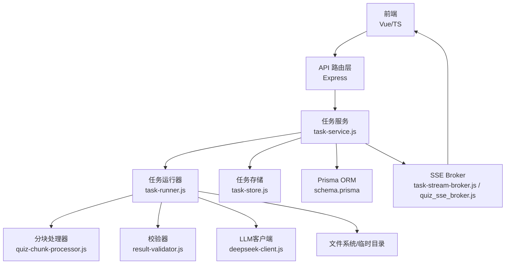
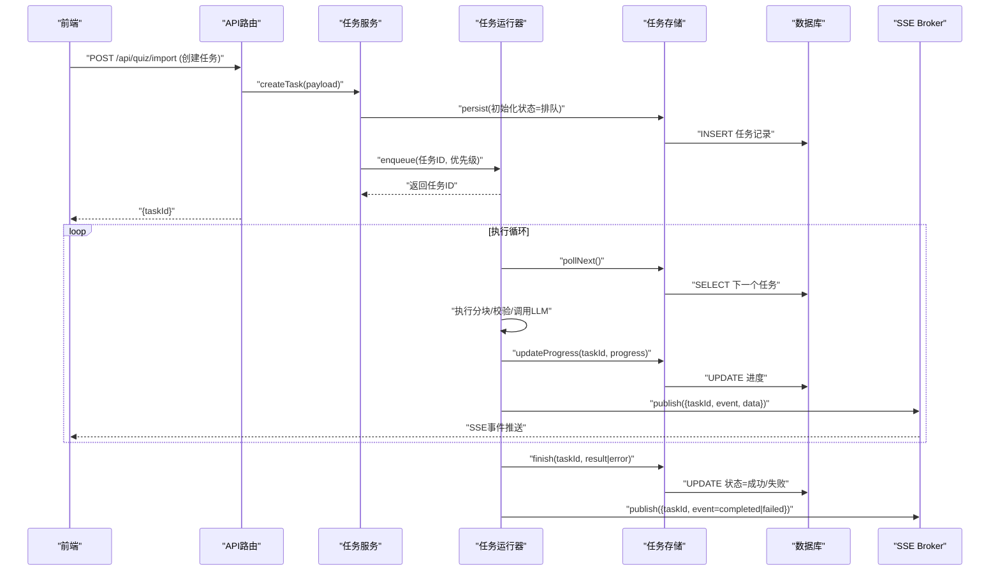
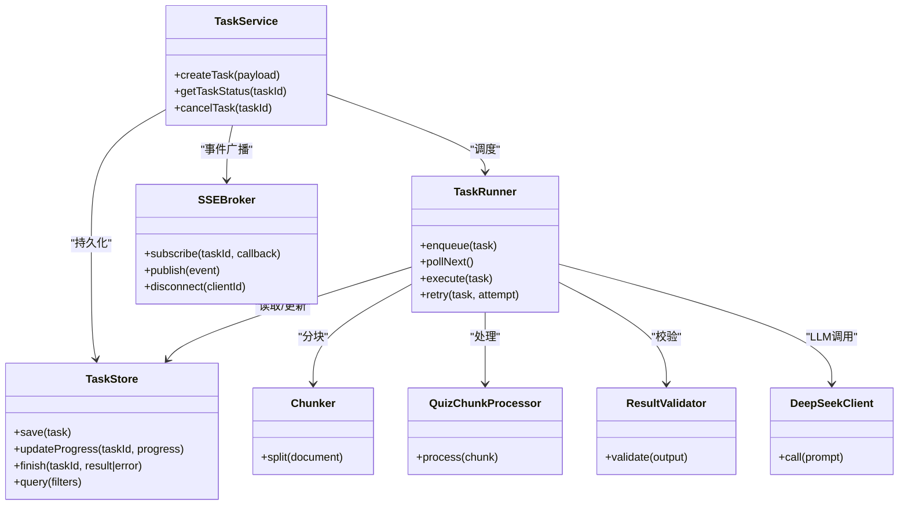

# 任务调度系统

<cite>
**本文档引用的文件**   
- [app.js](file://node-jinmao/app.js)
- [task-service.js](file://node-jinmao/service/md2quiz/task-service.js)
- [task-runner.js](file://node-jinmao/service/md2quiz/task-runner.js)
- [task-store.js](file://node-jinmao/service/md2quiz/task-store.js)
- [task-stream-broker.js](file://node-jinmao/service/md2quiz/task-stream-broker.js)
- [types.js](file://node-jinmao/service/md2quiz/types.js)
- [quiz_sse_broker.js](file://node-jinmao/service/quiz_sse_broker.js)
- [progress.js](file://node-jinmao/API/progress.js)
- [schema.prisma](file://node-jinmao/prisma/schema.prisma)
- [20260725_add_chapter_generation_progress.migration.sql](file://node-jinmao/prisma/migrations/20260725_add_chapter_generation_progress/migration.sql)
- [20260729_add_quiz_generating_task_id.migration.sql](file://node-jinmao/prisma/migrations/20260729_add_quiz_generating_task_id/migration.sql)
- [chunker.js](file://node-jinmao/service/md2quiz/chunker.js)
- [quiz-chunk-processor.js](file://node-jinmao/service/md2quiz/quiz-chunk-processor.js)
- [result-validator.js](file://node-jinmao/service/md2quiz/result-validator.js)
- [deepseek-client.js](file://node-jinmao/service/md2quiz/deepseek-client.js)
- [md2quiz.js](file://node-jinmao/API/quiz/md2json.js)
- [import.js](file://node-jinmao/API/quiz/import.js)
- [report.js](file://node-jinmao/API/quiz/report.js)
- [useMarkdownQuestionImport.ts](file://test/金毛刷题/backend/src/modules/textbooks/composables/useMarkdownQuestionImport.ts)
- [markdownJsonTask.api.ts](file://test/金毛刷题/backend/src/modules/textbooks/api/markdownJsonTask.api.ts)
- [markdownJsonTask.types.ts](file://test/金毛刷题/backend/src/modules/textbooks/types/markdownJsonTask.types.ts)
</cite>

## 目录
1. [简介](#简介)
2. [项目结构](#项目结构)
3. [核心组件](#核心组件)
4. [架构总览](#架构总览)
5. [详细组件分析](#详细组件分析)
6. [依赖关系分析](#依赖关系分析)
7. [性能考量](#性能考量)
8. [故障排查指南](#故障排查指南)
9. [结论](#结论)
10. [附录](#附录)

## 简介
本文件面向“任务调度系统”的完整设计与实现，聚焦异步任务的创建、调度与执行机制；解释任务队列管理（优先级、并发控制、资源分配）；说明任务状态跟踪、进度更新与结果存储的实现细节；提供自定义任务类型的示例路径与失败重试策略；阐述与SSE实时通信的集成方式及前端订阅流程；并给出监控、日志与性能优化建议。

## 项目结构
后端采用 Node.js + Express 架构，任务子系统集中在 service/md2quiz 目录，通过 API 层暴露接口，数据库使用 Prisma + SQLite/PostgreSQL，SSE 用于实时推送。前端位于 test/金毛刷题/frontend，包含任务中心与 SSE 订阅逻辑。

图表来源
- [app.js:1-200](file://node-jinmao/app.js#L1-L200)
- [task-service.js:1-200](file://node-jinmao/service/md2quiz/task-service.js#L1-L200)
- [task-runner.js:1-200](file://node-jinmao/service/md2quiz/task-runner.js#L1-L200)
- [task-store.js:1-200](file://node-jinmao/service/md2quiz/task-store.js#L1-L200)
- [task-stream-broker.js:1-200](file://node-jinmao/service/md2quiz/task-stream-broker.js#L1-L200)
- [quiz_sse_broker.js:1-200](file://node-jinmao/service/quiz_sse_broker.js#L1-L200)
- [schema.prisma:1-200](file://node-jinmao/prisma/schema.prisma#L1-L200)

章节来源
- [app.js:1-200](file://node-jinmao/app.js#L1-L200)
- [package.json:1-100](file://node-jinmao/package.json#L1-L100)

## 核心组件
- 任务服务（task-service.js）：对外提供任务创建、查询、取消等能力，协调运行器、存储与SSE。
- 任务运行器（task-runner.js）：负责从队列取任务、按优先级与并发限制调度执行，处理重试与错误。
- 任务存储（task-store.js）：持久化任务元数据、进度与结果，支持按用户/类型检索。
- SSE Broker（task-stream-broker.js, quiz_sse_broker.js）：维护连接、广播事件、过滤与限流。
- 类型定义（types.js）：统一任务类型、状态、进度与结果的类型约束。
- 业务处理器（chunker.js, quiz-chunk-processor.js, result-validator.js, deepseek-client.js）：具体任务执行的子步骤。

章节来源
- [task-service.js:1-200](file://node-jinmao/service/md2quiz/task-service.js#L1-L200)
- [task-runner.js:1-200](file://node-jinmao/service/md2quiz/task-runner.js#L1-L200)
- [task-store.js:1-200](file://node-jinmao/service/md2quiz/task-store.js#L1-L200)
- [task-stream-broker.js:1-200](file://node-jinmao/service/md2quiz/task-stream-broker.js#L1-L200)
- [quiz_sse_broker.js:1-200](file://node-jinmao/service/quiz_sse_broker.js#L1-L200)
- [types.js:1-200](file://node-jinmao/service/md2quiz/types.js#L1-L200)

## 架构总览
任务生命周期包括：创建 -> 入队 -> 调度 -> 执行 -> 进度上报 -> 完成/失败 -> 结果落库 -> SSE 推送。

图表来源
- [task-service.js:1-200](file://node-jinmao/service/md2quiz/task-service.js#L1-L200)
- [task-runner.js:1-200](file://node-jinmao/service/md2quiz/task-runner.js#L1-L200)
- [task-store.js:1-200](file://node-jinmao/service/md2quiz/task-store.js#L1-L200)
- [task-stream-broker.js:1-200](file://node-jinmao/service/md2quiz/task-stream-broker.js#L1-L200)
- [quiz_sse_broker.js:1-200](file://node-jinmao/service/quiz_sse_broker.js#L1-L200)
- [schema.prisma:1-200](file://node-jinmao/prisma/schema.prisma#L1-L200)

## 详细组件分析

### 任务服务（task-service.js）
职责
- 接收外部请求，构造任务上下文，写入初始状态。
- 将任务提交给运行器进行调度。
- 提供查询任务状态/进度的接口。
- 与SSE Broker协作，确保关键事件广播。

关键点
- 任务创建需校验输入参数与权限。
- 支持为不同任务类型设置默认优先级。
- 失败时回滚已写状态或标记为可重试。

章节来源
- [task-service.js:1-200](file://node-jinmao/service/md2quiz/task-service.js#L1-L200)

### 任务运行器（task-runner.js）
职责
- 维护内部队列与消费者池，实现并发控制。
- 按优先级选择下一个任务执行。
- 执行分块、校验、外部调用等步骤。
- 处理重试、退避与失败降级。

关键点
- 并发度可通过配置限制，避免资源争用。
- 重试策略支持指数退避与最大重试次数。
- 执行过程中持续上报进度到存储与SSE。

章节来源
- [task-runner.js:1-200](file://node-jinmao/service/md2quiz/task-runner.js#L1-L200)

### 任务存储（task-store.js）
职责
- 持久化任务元数据、进度、结果与错误信息。
- 提供按用户、类型、状态的查询能力。
- 保证读写一致性与幂等性。

关键点
- 使用事务保障状态更新的原子性。
- 对高频更新字段（如进度）做索引优化。
- 支持软删除与归档策略。

章节来源
- [task-store.js:1-200](file://node-jinmao/service/md2quiz/task-store.js#L1-L200)

### SSE Broker（task-stream-broker.js, quiz_sse_broker.js）
职责
- 管理SSE连接生命周期（建立、心跳、断开）。
- 按任务ID或用户维度广播事件。
- 提供事件过滤与速率限制。

关键点
- 断线自动重连提示与消息补发策略。
- 多连接场景下的内存占用控制。
- 与任务状态机联动，避免重复推送。

章节来源
- [task-stream-broker.js:1-200](file://node-jinmao/service/md2quiz/task-stream-broker.js#L1-L200)
- [quiz_sse_broker.js:1-200](file://node-jinmao/service/quiz_sse_broker.js#L1-L200)

### 类型定义（types.js）
职责
- 统一定义任务类型、状态枚举、进度结构与结果模型。
- 作为前后端契约，减少歧义。

关键点
- 新增任务类型需在类型定义中扩展。
- 状态迁移需保持向后兼容。

章节来源
- [types.js:1-200](file://node-jinmao/service/md2quiz/types.js#L1-L200)

### 业务处理器（chunker.js, quiz-chunk-processor.js, result-validator.js, deepseek-client.js）
职责
- chunker：将大文档切分为可并行处理的块。
- quiz-chunk-processor：对每个块执行生成/转换逻辑。
- result-validator：校验输出格式与内容质量。
- deepseek-client：封装LLM调用，处理超时与重试。

关键点
- 分块大小影响吞吐与内存峰值。
- 校验失败触发局部重试或人工复核。
- LLM调用需具备熔断与降级策略。

章节来源
- [chunker.js:1-200](file://node-jinmao/service/md2quiz/chunker.js#L1-L200)
- [quiz-chunk-processor.js:1-200](file://node-jinmao/service/md2quiz/quiz-chunk-processor.js#L1-L200)
- [result-validator.js:1-200](file://node-jinmao/service/md2quiz/result-validator.js#L1-L200)
- [deepseek-client.js:1-200](file://node-jinmao/service/md2quiz/deepseek-client.js#L1-L200)

### API 入口与集成（md2json.js, import.js, report.js, progress.js）
职责
- md2json.js：Markdown转JSON的任务入口。
- import.js：题库导入任务入口。
- report.js：报告生成任务入口。
- progress.js：进度查询与聚合接口。

关键点
- 统一鉴权与参数校验。
- 返回任务ID供前端轮询或订阅SSE。
- 进度接口支持增量更新与分页。

章节来源
- [md2json.js:1-200](file://node-jinmao/API/quiz/md2json.js#L1-L200)
- [import.js:1-200](file://node-jinmao/API/quiz/import.js#L1-L200)
- [report.js:1-200](file://node-jinmao/API/quiz/report.js#L1-L200)
- [progress.js:1-200](file://node-jinmao/API/progress.js#L1-L200)

### 数据库模型与迁移（schema.prisma, migrations）
职责
- 定义任务表、进度表、结果表等实体。
- 通过迁移脚本演进数据结构。

关键点
- 任务状态字段需加索引以加速查询。
- 进度字段设计支持增量更新。
- 结果字段支持大文本或对象序列化。

章节来源
- [schema.prisma:1-200](file://node-jinmao/prisma/schema.prisma#L1-L200)
- [20260725_add_chapter_generation_progress.migration.sql:1-200](file://node-jinmao/prisma/migrations/20260725_add_chapter_generation_progress/migration.sql#L1-L200)
- [20260729_add_quiz_generating_task_id.migration.sql:1-200](file://node-jinmao/prisma/migrations/20260729_add_quiz_generating_task_id/migration.sql#L1-L200)

### 前端集成与SSE订阅（useMarkdownQuestionImport.ts, markdownJsonTask.api.ts, markdownJsonTask.types.ts）
职责
- useMarkdownQuestionImport：封装任务创建与进度订阅逻辑。
- markdownJsonTask.api：HTTP调用与SSE连接管理。
- markdownJsonTask.types：前后端类型对齐。

关键点
- 前端建立SSE后按任务ID订阅事件。
- 断线重连与错误提示。
- 进度条与状态展示与后端事件映射。

章节来源
- [useMarkdownQuestionImport.ts:1-200](file://test/金毛刷题/backend/src/modules/textbooks/composables/useMarkdownQuestionImport.ts#L1-L200)
- [markdownJsonTask.api.ts:1-200](file://test/金毛刷题/backend/src/modules/textbooks/api/markdownJsonTask.api.ts#L1-L200)
- [markdownJsonTask.types.ts:1-200](file://test/金毛刷题/backend/src/modules/textbooks/types/markdownJsonTask.types.ts#L1-L200)

## 依赖关系分析

图表来源
- [task-service.js:1-200](file://node-jinmao/service/md2quiz/task-service.js#L1-L200)
- [task-runner.js:1-200](file://node-jinmao/service/md2quiz/task-runner.js#L1-L200)
- [task-store.js:1-200](file://node-jinmao/service/md2quiz/task-store.js#L1-L200)
- [task-stream-broker.js:1-200](file://node-jinmao/service/md2quiz/task-stream-broker.js#L1-L200)
- [chunker.js:1-200](file://node-jinmao/service/md2quiz/chunker.js#L1-L200)
- [quiz-chunk-processor.js:1-200](file://node-jinmao/service/md2quiz/quiz-chunk-processor.js#L1-L200)
- [result-validator.js:1-200](file://node-jinmao/service/md2quiz/result-validator.js#L1-L200)
- [deepseek-client.js:1-200](file://node-jinmao/service/md2quiz/deepseek-client.js#L1-L200)

章节来源
- [task-service.js:1-200](file://node-jinmao/service/md2quiz/task-service.js#L1-L200)
- [task-runner.js:1-200](file://node-jinmao/service/md2quiz/task-runner.js#L1-L200)
- [task-store.js:1-200](file://node-jinmao/service/md2quiz/task-store.js#L1-L200)
- [task-stream-broker.js:1-200](file://node-jinmao/service/md2quiz/task-stream-broker.js#L1-L200)

## 性能考量
- 并发控制：根据CPU核数与I/O特性调整消费者数量，避免过度竞争。
- 分块策略：合理设置分块大小，平衡吞吐与内存占用。
- 重试与退避：指数退避降低瞬时压力，设置最大重试次数防止雪崩。
- 数据库索引：对任务状态、用户ID、类型等常用查询字段建立索引。
- SSE限流：对热点任务的事件进行合并与节流，减少带宽消耗。
- 缓存中间结果：对可复用的计算结果进行短期缓存，提升二次执行效率。
- 资源隔离：不同任务类型可使用独立队列与消费者池，避免相互干扰。

[本节为通用指导，不直接分析具体文件]

## 故障排查指南
常见问题与定位方法
- 任务卡住：检查队列消费是否阻塞、是否存在死锁或未释放的资源。
- 进度不更新：确认进度写入是否成功、SSE发布是否被拦截。
- 结果缺失：查看结果落库事务是否提交、是否有异常分支未处理。
- SSE断连：检查网络稳定性、服务端心跳与重连逻辑。
- LLM调用失败：查看客户端重试与熔断配置，核对密钥与配额。

排查步骤
- 查看任务状态与最近一次进度快照。
- 检查SSE连接列表与事件分发日志。
- 核对数据库事务日志与慢查询。
- 验证外部依赖（LLM、存储）健康状态。

章节来源
- [task-runner.js:1-200](file://node-jinmao/service/md2quiz/task-runner.js#L1-L200)
- [task-store.js:1-200](file://node-jinmao/service/md2quiz/task-store.js#L1-L200)
- [task-stream-broker.js:1-200](file://node-jinmao/service/md2quiz/task-stream-broker.js#L1-L200)
- [quiz_sse_broker.js:1-200](file://node-jinmao/service/quiz_sse_broker.js#L1-L200)

## 结论
该任务调度系统通过清晰的分层与模块化设计，实现了高内聚、低耦合的异步任务处理能力。借助优先级队列、并发控制与SSE实时推送，能够稳定支撑大规模任务处理与前端实时反馈。建议在后续迭代中进一步完善监控告警、指标采集与自动化扩缩容，以提升系统的可观测性与弹性。

[本节为总结性内容，不直接分析具体文件]

## 附录

### 自定义任务类型示例（路径指引）
- 在类型定义中扩展新任务类型与状态。
- 在任务服务中增加创建入口与参数校验。
- 在运行器中注册新的执行处理器与重试策略。
- 在SSE Broker中定义新事件类型。
- 在前端类型与API中同步新增类型与接口。

参考路径
- [types.js:1-200](file://node-jinmao/service/md2quiz/types.js#L1-L200)
- [task-service.js:1-200](file://node-jinmao/service/md2quiz/task-service.js#L1-L200)
- [task-runner.js:1-200](file://node-jinmao/service/md2quiz/task-runner.js#L1-L200)
- [task-stream-broker.js:1-200](file://node-jinmao/service/md2quiz/task-stream-broker.js#L1-L200)
- [markdownJsonTask.types.ts:1-200](file://test/金毛刷题/backend/src/modules/textbooks/types/markdownJsonTask.types.ts#L1-L200)
- [markdownJsonTask.api.ts:1-200](file://test/金毛刷题/backend/src/modules/textbooks/api/markdownJsonTask.api.ts#L1-L200)

### 失败与重试逻辑（路径指引）
- 在运行器中实现指数退避与最大重试次数。
- 在存储中标记失败原因与重试次数。
- 在SSE中推送失败与重试事件。
- 在前端展示失败信息与重试按钮。

参考路径
- [task-runner.js:1-200](file://node-jinmao/service/md2quiz/task-runner.js#L1-L200)
- [task-store.js:1-200](file://node-jinmao/service/md2quiz/task-store.js#L1-L200)
- [task-stream-broker.js:1-200](file://node-jinmao/service/md2quiz/task-stream-broker.js#L1-L200)
- [useMarkdownQuestionImport.ts:1-200](file://test/金毛刷题/backend/src/modules/textbooks/composables/useMarkdownQuestionImport.ts#L1-L200)

### 任务监控与日志（路径指引）
- 在运行器中记录关键步骤耗时与错误堆栈。
- 在SSE Broker中统计连接数与事件量。
- 在API层暴露监控指标接口。
- 在前端展示任务中心与进度面板。

参考路径
- [task-runner.js:1-200](file://node-jinmao/service/md2quiz/task-runner.js#L1-L200)
- [task-stream-broker.js:1-200](file://node-jinmao/service/md2quiz/task-stream-broker.js#L1-L200)
- [progress.js:1-200](file://node-jinmao/API/progress.js#L1-L200)
- [useMarkdownQuestionImport.ts:1-200](file://test/金毛刷题/backend/src/modules/textbooks/composables/useMarkdownQuestionImport.ts#L1-L200)