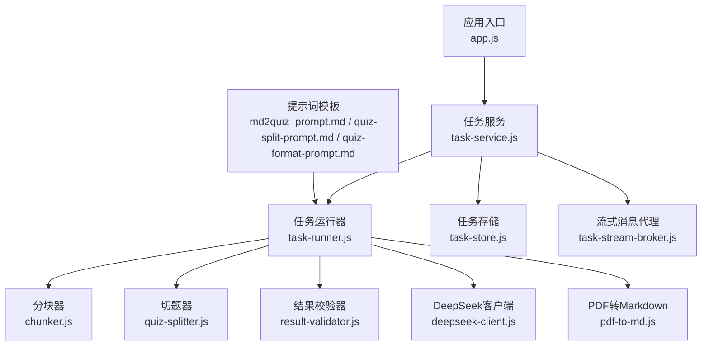
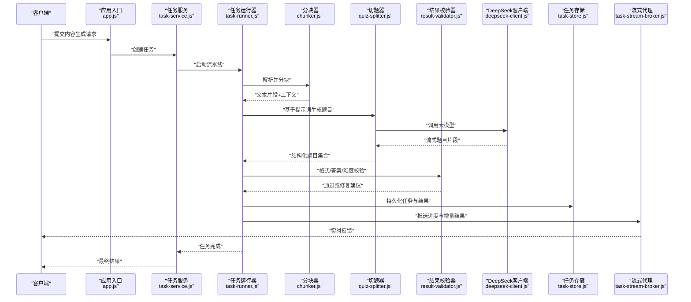
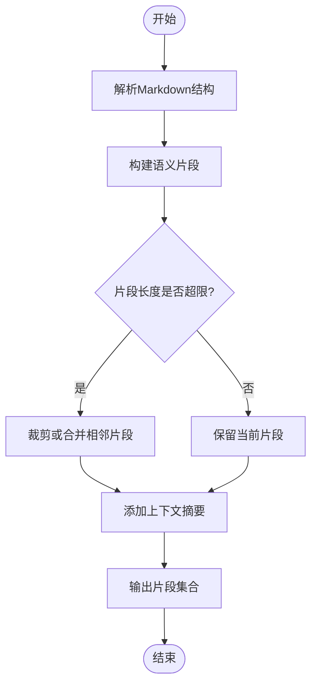
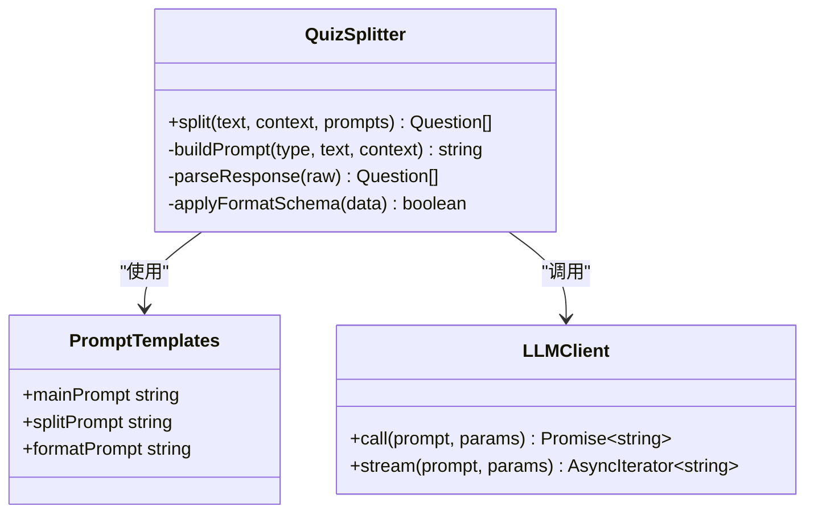
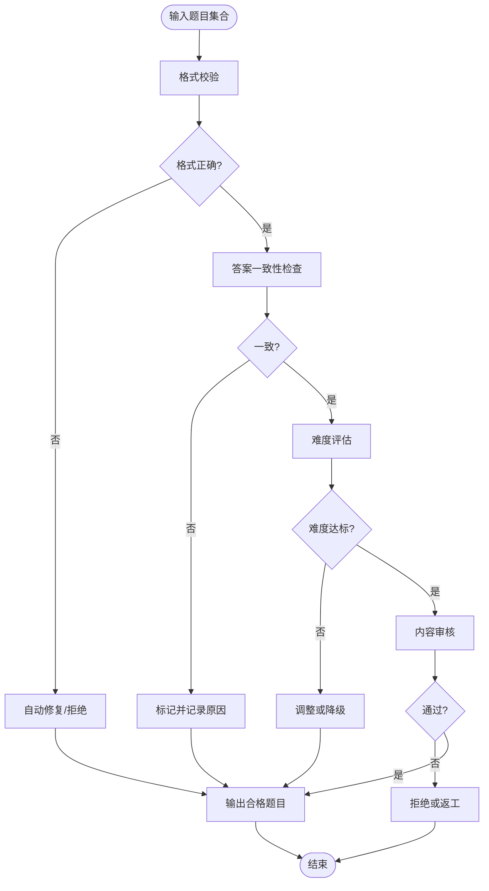
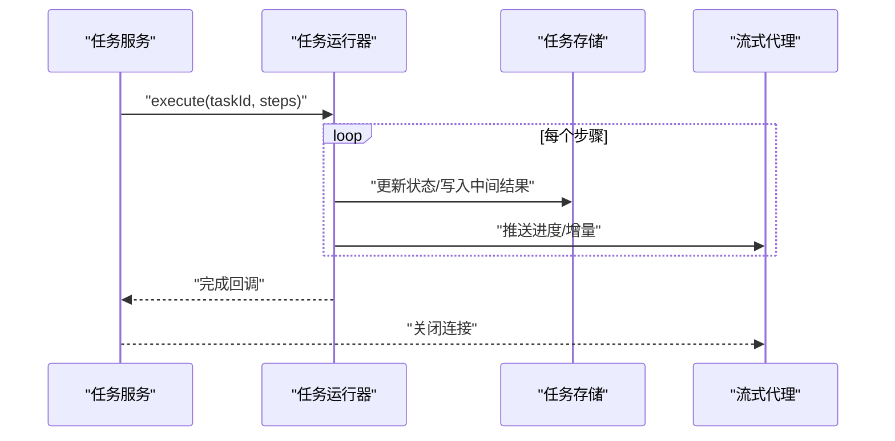
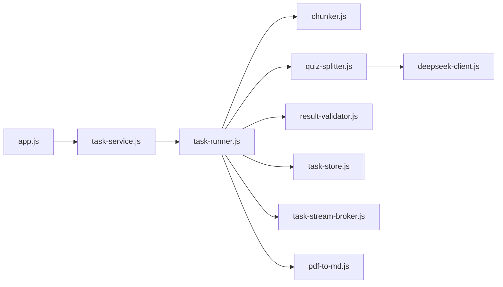

# 内容生成流水线

<cite>
**本文档引用的文件**   
- [chunker.js](file://node-jinmao/service/md2quiz/chunker.js)
- [quiz-splitter.js](file://node-jinmao/service/md2quiz/quiz-splitter.js)
- [result-validator.js](file://node-jinmao/service/md2quiz/result-validator.js)
- [task-runner.js](file://node-jinmao/service/md2quiz/task-runner.js)
- [task-service.js](file://node-jinmao/service/md2quiz/task-service.js)
- [task-store.js](file://node-jinmao/service/md2quiz/task-store.js)
- [task-stream-broker.js](file://node-jinmao/service/md2quiz/task-stream-broker.js)
- [deepseek-client.js](file://node-jinmao/service/md2quiz/deepseek-client.js)
- [pdf-to-md.js](file://node-jinmao/service/md2quiz/pdf-to-md.js)
- [md2quiz_prompt.md](file://node-jinmao/config/md2quiz_prompt.md)
- [quiz-split-prompt.md](file://node-jinmao/config/quiz-split-prompt.md)
- [quiz-format-prompt.md](file://node-jinmao/config/quiz-format-prompt.md)
- [app.js](file://node-jinmao/app.js)
- [API文档.md](file://API文档.md)
</cite>

## 目录
1. [简介](#简介)
2. [项目结构](#项目结构)
3. [核心组件](#核心组件)
4. [架构总览](#架构总览)
5. [详细组件分析](#详细组件分析)
6. [依赖关系分析](#依赖关系分析)
7. [性能考虑](#性能考虑)
8. [故障排查指南](#故障排查指南)
9. [结论](#结论)
10. [附录](#附录)

## 简介
本文件面向“内容生成流水线”的完整实现，聚焦从原始内容（PDF/Markdown）到结构化题目的端到端处理流程。文档涵盖：
- 内容分块算法：Markdown解析、文本分割与上下文保持策略
- 题目生成质量控制：答案验证、难度评估、内容审核
- 提示词模板集成：动态调整生成参数
- 批量处理优化、内存管理与错误恢复机制
- 自定义扩展点：新增题目类型与处理规则

该流水线以Node.js服务为核心，结合LLM能力完成内容理解与题目生成，并通过任务编排、流式输出与持久化保障高可用与可观测性。

## 项目结构
内容生成流水线主要位于 node-jinmao/service/md2quiz 目录，配套提示词在 node-jinmao/config 目录，入口服务在 app.js，对外接口定义见 API文档.md。

图表来源
- [app.js](file://node-jinmao/app.js)
- [task-service.js](file://node-jinmao/service/md2quiz/task-service.js)
- [task-runner.js](file://node-jinmao/service/md2quiz/task-runner.js)
- [chunker.js](file://node-jinmao/service/md2quiz/chunker.js)
- [quiz-splitter.js](file://node-jinmao/service/md2quiz/quiz-splitter.js)
- [result-validator.js](file://node-jinmao/service/md2quiz/result-validator.js)
- [deepseek-client.js](file://node-jinmao/service/md2quiz/deepseek-client.js)
- [pdf-to-md.js](file://node-jinmao/service/md2quiz/pdf-to-md.js)
- [md2quiz_prompt.md](file://node-jinmao/config/md2quiz_prompt.md)
- [quiz-split-prompt.md](file://node-jinmao/config/quiz-split-prompt.md)
- [quiz-format-prompt.md](file://node-jinmao/config/quiz-format-prompt.md)

章节来源
- [app.js](file://node-jinmao/app.js)
- [API文档.md](file://API文档.md)

## 核心组件
- 任务服务（task-service.js）：接收外部请求，创建并调度任务，协调流式输出与状态更新
- 任务运行器（task-runner.js）：执行具体流水线步骤（解析、分块、切题、校验、持久化）
- 分块器（chunker.js）：将长文本按语义边界切分为可处理的片段，维护上下文窗口
- 切题器（quiz-splitter.js）：基于提示词模板将文本片段转换为结构化题目集合
- 结果校验器（result-validator.js）：对生成的题目进行格式、答案一致性、难度与质量校验
- DeepSeek客户端（deepseek-client.js）：封装LLM调用，支持流式响应与重试
- PDF转Markdown（pdf-to-md.js）：将PDF转为Markdown以便统一处理
- 任务存储（task-store.js）：任务元数据与中间结果的持久化
- 流式消息代理（task-stream-broker.js）：将处理进度与增量结果推送给前端

章节来源
- [task-service.js](file://node-jinmao/service/md2quiz/task-service.js)
- [task-runner.js](file://node-jinmao/service/md2quiz/task-runner.js)
- [chunker.js](file://node-jinmao/service/md2quiz/chunker.js)
- [quiz-splitter.js](file://node-jinmao/service/md2quiz/quiz-splitter.js)
- [result-validator.js](file://node-jinmao/service/md2quiz/result-validator.js)
- [deepseek-client.js](file://node-jinmao/service/md2quiz/deepseek-client.js)
- [pdf-to-md.js](file://node-jinmao/service/md2quiz/pdf-to-md.js)
- [task-store.js](file://node-jinmao/service/md2quiz/task-store.js)
- [task-stream-broker.js](file://node-jinmao/service/md2quiz/task-stream-broker.js)

## 架构总览
整体采用“任务驱动 + 流式输出”的架构。外部请求进入后，由任务服务创建任务并分配至运行器；运行器依次调用分块、切题、校验等模块，期间通过流式代理向前端推送进度与增量结果；最终结果落库并返回。

图表来源
- [app.js](file://node-jinmao/app.js)
- [task-service.js](file://node-jinmao/service/md2quiz/task-service.js)
- [task-runner.js](file://node-jinmao/service/md2quiz/task-runner.js)
- [chunker.js](file://node-jinmao/service/md2quiz/chunker.js)
- [quiz-splitter.js](file://node-jinmao/service/md2quiz/quiz-splitter.js)
- [result-validator.js](file://node-jinmao/service/md2quiz/result-validator.js)
- [deepseek-client.js](file://node-jinmao/service/md2quiz/deepseek-client.js)
- [task-store.js](file://node-jinmao/service/md2quiz/task-store.js)
- [task-stream-broker.js](file://node-jinmao/service/md2quiz/task-stream-broker.js)

## 详细组件分析

### 内容分块算法（chunker.js）
- 目标：将长文本切分为语义连贯的片段，避免跨段落破坏题意
- 关键策略：
  - Markdown解析：识别标题层级、列表、代码块与图片引用，保留结构信息
  - 文本分割：按标题、段落、句子边界切分，控制每片长度与重叠度
  - 上下文保持：为每个片段附加前后文摘要，确保题目生成时具备必要背景
- 复杂度与内存：线性扫描为主，切片缓存控制在阈值内，避免OOM

图表来源
- [chunker.js](file://node-jinmao/service/md2quiz/chunker.js)

章节来源
- [chunker.js](file://node-jinmao/service/md2quiz/chunker.js)

### 切题器与提示词模板（quiz-splitter.js + md2quiz_prompt.md / quiz-split-prompt.md / quiz-format-prompt.md）
- 目标：将文本片段转换为结构化题目（选择、判断、填空、简答等）
- 提示词集成：
  - 主提示词：定义题目类型、字段约束、难度等级与评分标准
  - 切题提示词：指导如何根据上下文拆分知识点为独立题目
  - 格式提示词：强制JSON Schema，便于后续校验与入库
- 动态参数：温度、最大令牌数、重试次数、超时时间可通过配置注入

图表来源
- [quiz-splitter.js](file://node-jinmao/service/md2quiz/quiz-splitter.js)
- [md2quiz_prompt.md](file://node-jinmao/config/md2quiz_prompt.md)
- [quiz-split-prompt.md](file://node-jinmao/config/quiz-split-prompt.md)
- [quiz-format-prompt.md](file://node-jinmao/config/quiz-format-prompt.md)
- [deepseek-client.js](file://node-jinmao/service/md2quiz/deepseek-client.js)

章节来源
- [quiz-splitter.js](file://node-jinmao/service/md2quiz/quiz-splitter.js)
- [md2quiz_prompt.md](file://node-jinmao/config/md2quiz_prompt.md)
- [quiz-split-prompt.md](file://node-jinmao/config/quiz-split-prompt.md)
- [quiz-format-prompt.md](file://node-jinmao/config/quiz-format-prompt.md)

### 结果校验与质量控制（result-validator.js）
- 校验维度：
  - 格式校验：严格遵循JSON Schema，缺失字段自动修复或拒绝
  - 答案一致性：题干与选项/答案逻辑自洽，无矛盾
  - 难度评估：依据知识点深度、推理步骤与干扰项设计打分
  - 内容审核：敏感词过滤、重复检测、知识准确性抽检
- 修复策略：对轻微问题尝试自动修复，严重问题退回重生成

图表来源
- [result-validator.js](file://node-jinmao/service/md2quiz/result-validator.js)

章节来源
- [result-validator.js](file://node-jinmao/service/md2quiz/result-validator.js)

### 任务编排与流式输出（task-service.js / task-runner.js / task-store.js / task-stream-broker.js）
- 任务服务：创建任务、分配资源、管理生命周期
- 任务运行器：串联分块、切题、校验、持久化步骤，支持断点续跑
- 任务存储：保存任务状态、中间结果与最终产物
- 流式代理：将处理进度与增量结果推送到前端，提升用户体验

图表来源
- [task-service.js](file://node-jinmao/service/md2quiz/task-service.js)
- [task-runner.js](file://node-jinmao/service/md2quiz/task-runner.js)
- [task-store.js](file://node-jinmao/service/md2quiz/task-store.js)
- [task-stream-broker.js](file://node-jinmao/service/md2quiz/task-stream-broker.js)

章节来源
- [task-service.js](file://node-jinmao/service/md2quiz/task-service.js)
- [task-runner.js](file://node-jinmao/service/md2quiz/task-runner.js)
- [task-store.js](file://node-jinmao/service/md2quiz/task-store.js)
- [task-stream-broker.js](file://node-jinmao/service/md2quiz/task-stream-broker.js)

### PDF到Markdown转换（pdf-to-md.js）
- 目标：将PDF统一转换为Markdown，便于后续分块与切题
- 关键点：保留标题层级、表格、列表与图片占位符，清理噪声文本

章节来源
- [pdf-to-md.js](file://node-jinmao/service/md2quiz/pdf-to-md.js)

### 大模型客户端（deepseek-client.js）
- 功能：封装HTTP调用、流式读取、重试与超时控制
- 参数：temperature、top_p、max_tokens、timeout、retry策略
- 错误处理：网络异常、限流、模型返回格式错误的回退与重试

章节来源
- [deepseek-client.js](file://node-jinmao/service/md2quiz/deepseek-client.js)

## 依赖关系分析
- 低耦合模块化：各组件职责单一，通过接口组合
- 外部依赖：LLM服务（DeepSeek）、文件系统（PDF/Markdown）、数据库（任务与结果持久化）
- 潜在循环依赖：应避免在分块器中直接调用切题器，保持单向依赖链

图表来源
- [app.js](file://node-jinmao/app.js)
- [task-service.js](file://node-jinmao/service/md2quiz/task-service.js)
- [task-runner.js](file://node-jinmao/service/md2quiz/task-runner.js)
- [chunker.js](file://node-jinmao/service/md2quiz/chunker.js)
- [quiz-splitter.js](file://node-jinmao/service/md2quiz/quiz-splitter.js)
- [result-validator.js](file://node-jinmao/service/md2quiz/result-validator.js)
- [deepseek-client.js](file://node-jinmao/service/md2quiz/deepseek-client.js)
- [task-store.js](file://node-jinmao/service/md2quiz/task-store.js)
- [task-stream-broker.js](file://node-jinmao/service/md2quiz/task-stream-broker.js)
- [pdf-to-md.js](file://node-jinmao/service/md2quiz/pdf-to-md.js)

章节来源
- [app.js](file://node-jinmao/app.js)
- [API文档.md](file://API文档.md)

## 性能考虑
- 分块策略：控制片段大小与重叠率，减少LLM调用次数与上下文冗余
- 流式处理：边生成边推送，降低首屏延迟
- 批处理：合并多个小片段为批次，提高吞吐
- 内存管理：限制中间结果缓存大小，及时释放临时对象
- 并发控制：限制并行任务数，避免资源争用
- 缓存与去重：对相同内容的分块与题目结果进行缓存

[本节为通用指导，不直接分析具体文件]

## 故障排查指南
- 常见问题：
  - LLM调用失败：检查网络、配额、超时与重试策略
  - 格式错误：确认提示词中的JSON Schema与校验规则
  - 内容质量差：调整难度阈值、增加上下文、优化提示词
  - 内存溢出：降低批次大小、启用流式处理、监控堆内存
- 定位方法：
  - 查看任务状态与中间结果
  - 检查流式日志与错误码
  - 复现最小用例并逐步隔离问题

章节来源
- [task-store.js](file://node-jinmao/service/md2quiz/task-store.js)
- [task-stream-broker.js](file://node-jinmao/service/md2quiz/task-stream-broker.js)
- [deepseek-client.js](file://node-jinmao/service/md2quiz/deepseek-client.js)
- [result-validator.js](file://node-jinmao/service/md2quiz/result-validator.js)

## 结论
本流水线通过模块化设计与流式输出，实现了从原始内容到结构化题目的自动化生成。借助提示词模板与校验机制，保障了题目质量与一致性。未来可扩展更多题目类型与审核规则，进一步提升生成效果与系统稳定性。

[本节为总结，不直接分析具体文件]

## 附录
- 自定义扩展点：
  - 新增题目类型：在切题器中添加对应提示词与解析逻辑
  - 自定义分块规则：修改分块器的边界判定与上下文策略
  - 接入新LLM：替换客户端实现，保持接口一致
- 动态参数调整：
  - 通过配置注入温度、最大令牌数、重试次数等
  - 按内容复杂度自适应调整参数

[本节为补充说明，不直接分析具体文件]