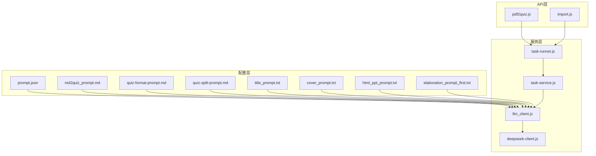
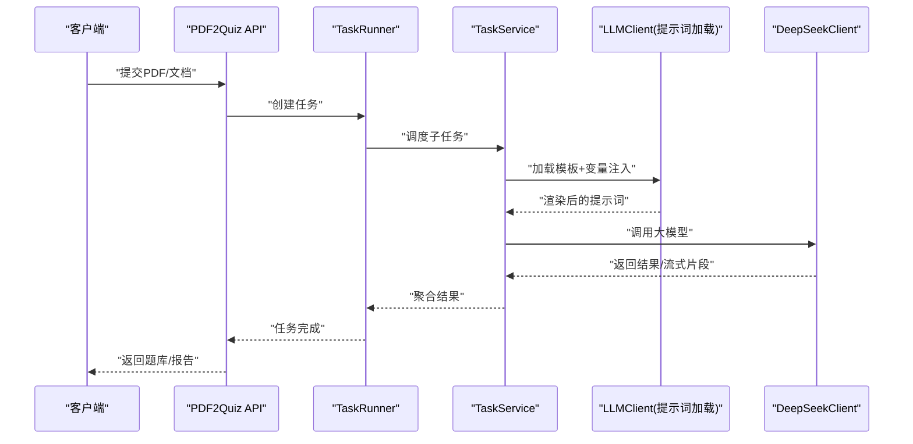
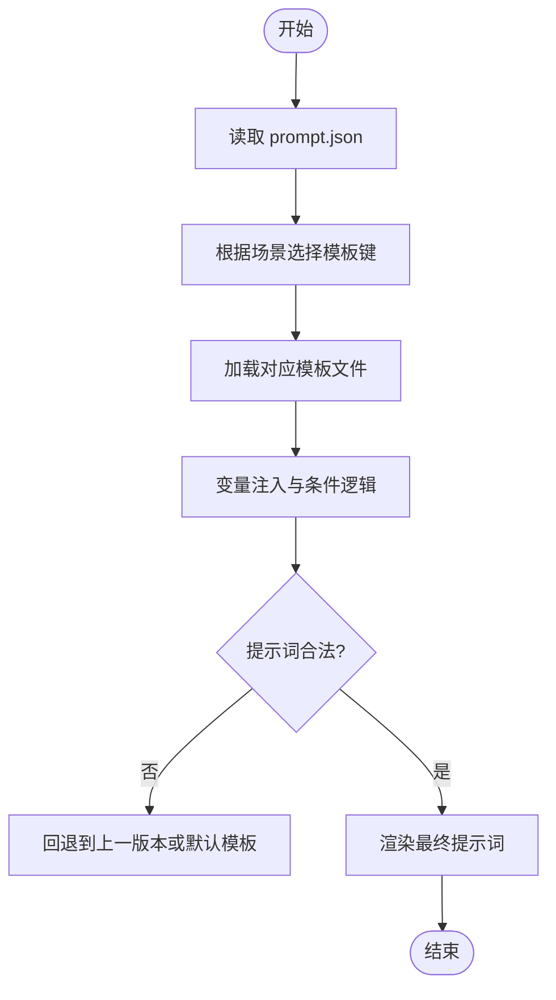
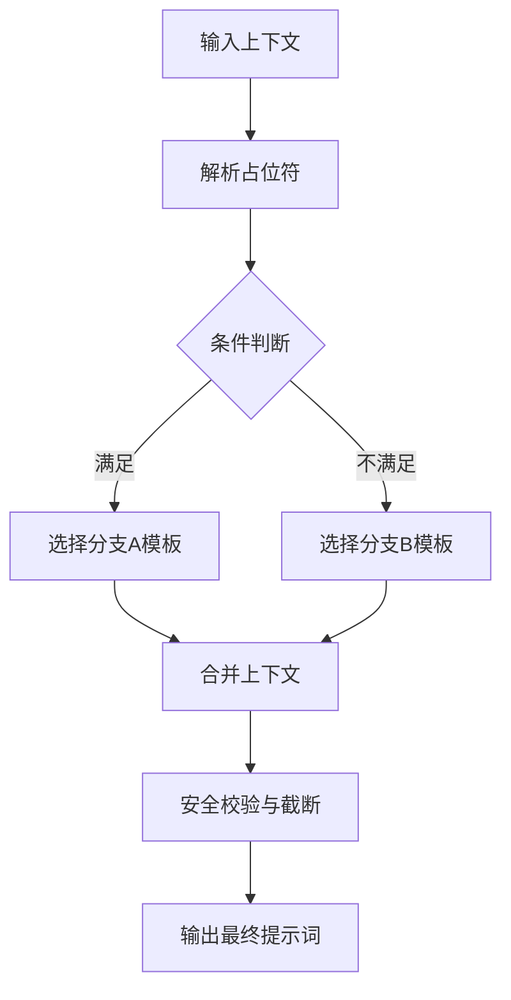
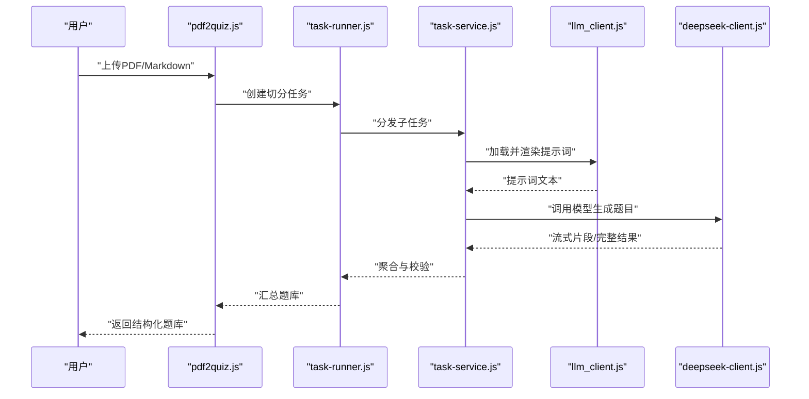
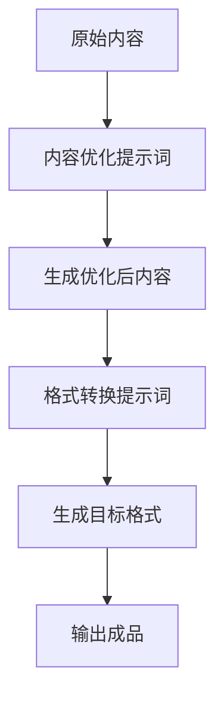
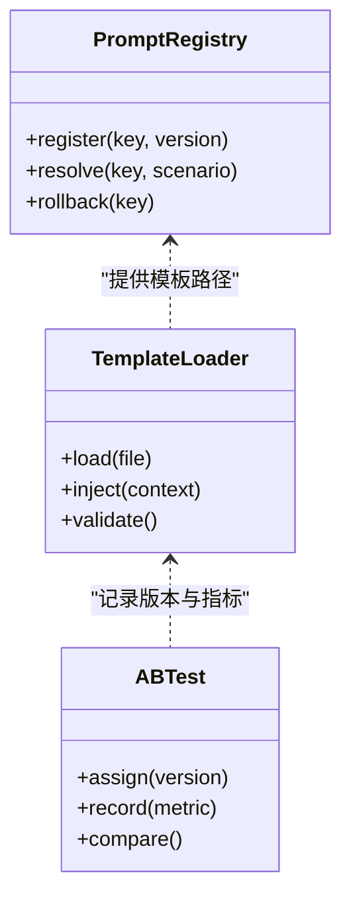
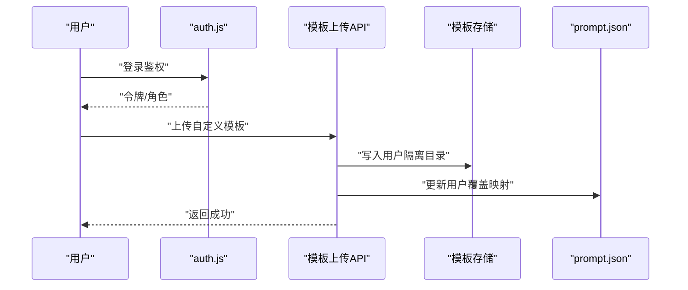
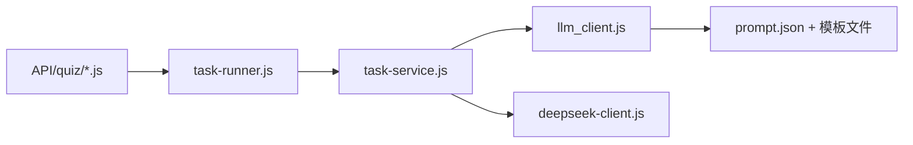

# 提示词管理系统

<cite>
**本文引用的文件**   
- [node-jinmao/config/prompt.json](file://node-jinmao/config/prompt.json)
- [node-jinmao/config/md2quiz_prompt.md](file://node-jinmao/config/md2quiz_prompt.md)
- [node-jinmao/config/quiz-format-prompt.md](file://node-jinmao/config/quiz-format-prompt.md)
- [node-jinmao/config/quiz-split-prompt.md](file://node-jinmao/config/quiz-split-prompt.md)
- [node-jinmao/config/elaboration_prompt_first.txt](file://node-jinmao/config/elaboration_prompt_first.txt)
- [node-jinmao/config/title_prompt.txt](file://node-jinmao/config/title_prompt.txt)
- [node-jinmao/config/cover_prompt.txt](file://node-jinmao/config/cover_prompt.txt)
- [node-jinmao/config/html_ppt_prompt.txt](file://node-jinmao/config/html_ppt_prompt.txt)
- [node-jinmao/service/md2quiz/deepseek-client.js](file://node-jinmao/service/md2quiz/deepseek-client.js)
- [node-jinmao/service/md2quiz/task-runner.js](file://node-jinmao/service/md2quiz/task-runner.js)
- [node-jinmao/service/md2quiz/task-service.js](file://node-jinmao/service/md2quiz/task-service.js)
- [node-jinmao/utils/llm_client.js](file://node-jinmao/utils/llm_client.js)
- [node-jinmao/API/quiz/pdf2quiz.js](file://node-jinmao/API/quiz/pdf2quiz.js)
- [node-jinmao/API/quiz/import.js](file://node-jinmao/API/quiz/import.js)
- [node-jinmao/service/create_title.js](file://node-jinmao/service/create_title.js)
- [node-jinmao/service/create_cover_image.js](file://node-jinmao/service/create_cover_image.js)
- [node-jinmao/middleware/auth.js](file://node-jinmao/middleware/auth.js)
- [node-jinmao/package.json](file://node-jinmao/package.json)
</cite>

## 目录
1. [简介](#简介)
2. [项目结构](#项目结构)
3. [核心组件](#核心组件)
4. [架构总览](#架构总览)
5. [详细组件分析](#详细组件分析)
6. [依赖关系分析](#依赖关系分析)
7. [性能考量](#性能考量)
8. [故障排查指南](#故障排查指南)
9. [结论](#结论)
10. [附录](#附录)

## 简介
本文件系统性地梳理“提示词管理系统”的设计与实现，聚焦以下目标：
- 提示词模板的组织结构与版本管理机制
- 不同场景下的提示词设计原则（题库生成、内容优化、格式转换）
- 动态替换机制、变量注入与条件逻辑处理
- 创建新模板、A/B测试与效果评估的实践方法
- 用户自定义提示词的集成方式、权限控制与安全考虑
- 优化建议、最佳实践与常见问题解决方案

该系统以集中式配置管理提示词模板，通过服务层进行加载、渲染与调用大模型接口，形成从“模板定义 → 参数注入 → 模型调用 → 结果校验”的闭环。

## 项目结构
提示词相关资源主要位于后端 node-jinmao 模块中：
- 模板存储：config 目录下集中存放各类提示词模板（Markdown、TXT、JSON）
- 模板加载与渲染：service/md2quiz 与 utils/llm_client.js 负责读取、拼接与调用
- 业务入口：API/quiz 下 pdf2quiz、import 等将业务输入转化为提示词并驱动任务执行
- 其他用途：create_title.js、create_cover_image.js 使用标题与封面提示词模板



图表来源
- [node-jinmao/config/prompt.json](file://node-jinmao/config/prompt.json)
- [node-jinmao/config/md2quiz_prompt.md](file://node-jinmao/config/md2quiz_prompt.md)
- [node-jinmao/config/quiz-format-prompt.md](file://node-jinmao/config/quiz-format-prompt.md)
- [node-jinmao/config/quiz-split-prompt.md](file://node-jinmao/config/quiz-split-prompt.md)
- [node-jinmao/config/title_prompt.txt](file://node-jinmao/config/title_prompt.txt)
- [node-jinmao/config/cover_prompt.txt](file://node-jinmao/config/cover_prompt.txt)
- [node-jinmao/config/html_ppt_prompt.txt](file://node-jinmao/config/html_ppt_prompt.txt)
- [node-jinmao/config/elaboration_prompt_first.txt](file://node-jinmao/config/elaboration_prompt_first.txt)
- [node-jinmao/utils/llm_client.js](file://node-jinmao/utils/llm_client.js)
- [node-jinmao/service/md2quiz/deepseek-client.js](file://node-jinmao/service/md2quiz/deepseek-client.js)
- [node-jinmao/service/md2quiz/task-runner.js](file://node-jinmao/service/md2quiz/task-runner.js)
- [node-jinmao/service/md2quiz/task-service.js](file://node-jinmao/service/md2quiz/task-service.js)
- [node-jinmao/API/quiz/pdf2quiz.js](file://node-jinmao/API/quiz/pdf2quiz.js)
- [node-jinmao/API/quiz/import.js](file://node-jinmao/API/quiz/import.js)

章节来源
- [node-jinmao/package.json](file://node-jinmao/package.json)

## 核心组件
- 提示词模板库（config/*）
  - 按功能域划分：题库生成（md2quiz_prompt.md、quiz-format-prompt.md、quiz-split-prompt.md）、内容优化（elaboration_prompt_first.txt）、格式转换（html_ppt_prompt.txt）、标题与封面（title_prompt.txt、cover_prompt.txt）
  - 统一索引（prompt.json）用于集中管理与版本标记
- 提示词加载与渲染（utils/llm_client.js）
  - 负责读取模板、变量注入、条件分支与上下文拼装
- 任务编排（service/md2quiz/task-runner.js、task-service.js）
  - 将业务请求拆分为可重试、可追踪的任务单元，串联提示词渲染与大模型调用
- 大模型客户端（service/md2quiz/deepseek-client.js）
  - 封装具体模型调用、流式输出与错误重试策略
- API 入口（API/quiz/pdf2quiz.js、API/quiz/import.js）
  - 接收外部请求，组装输入数据，触发任务流水线

章节来源
- [node-jinmao/config/prompt.json](file://node-jinmao/config/prompt.json)
- [node-jinmao/utils/llm_client.js](file://node-jinmao/utils/llm_client.js)
- [node-jinmao/service/md2quiz/task-runner.js](file://node-jinmao/service/md2quiz/task-runner.js)
- [node-jinmao/service/md2quiz/task-service.js](file://node-jinmao/service/md2quiz/task-service.js)
- [node-jinmao/service/md2quiz/deepseek-client.js](file://node-jinmao/service/md2quiz/deepseek-client.js)
- [node-jinmao/API/quiz/pdf2quiz.js](file://node-jinmao/API/quiz/pdf2quiz.js)
- [node-jinmao/API/quiz/import.js](file://node-jinmao/API/quiz/import.js)

## 架构总览
系统采用“配置中心 + 服务编排 + 模型客户端”的分层架构：
- 配置层：集中管理提示词模板与版本元数据
- 服务层：任务拆分、状态跟踪、重试与熔断
- 客户端层：对接大模型 API，处理流式响应与错误恢复



图表来源
- [node-jinmao/API/quiz/pdf2quiz.js](file://node-jinmao/API/quiz/pdf2quiz.js)
- [node-jinmao/service/md2quiz/task-runner.js](file://node-jinmao/service/md2quiz/task-runner.js)
- [node-jinmao/service/md2quiz/task-service.js](file://node-jinmao/service/md2quiz/task-service.js)
- [node-jinmao/utils/llm_client.js](file://node-jinmao/utils/llm_client.js)
- [node-jinmao/service/md2quiz/deepseek-client.js](file://node-jinmao/service/md2quiz/deepseek-client.js)

## 详细组件分析

### 提示词模板组织与版本管理
- 模板分类
  - 题库生成：md2quiz_prompt.md、quiz-format-prompt.md、quiz-split-prompt.md
  - 内容优化：elaboration_prompt_first.txt
  - 格式转换：html_ppt_prompt.txt
  - 标题与封面：title_prompt.txt、cover_prompt.txt
- 版本管理
  - 通过 prompt.json 维护模板键名、版本标识与默认选择
  - 建议在变更时递增版本号，并提供回滚策略



图表来源
- [node-jinmao/config/prompt.json](file://node-jinmao/config/prompt.json)
- [node-jinmao/utils/llm_client.js](file://node-jinmao/utils/llm_client.js)

章节来源
- [node-jinmao/config/prompt.json](file://node-jinmao/config/prompt.json)
- [node-jinmao/config/md2quiz_prompt.md](file://node-jinmao/config/md2quiz_prompt.md)
- [node-jinmao/config/quiz-format-prompt.md](file://node-jinmao/config/quiz-format-prompt.md)
- [node-jinmao/config/quiz-split-prompt.md](file://node-jinmao/config/quiz-split-prompt.md)
- [node-jinmao/config/elaboration_prompt_first.txt](file://node-jinmao/config/elaboration_prompt_first.txt)
- [node-jinmao/config/html_ppt_prompt.txt](file://node-jinmao/config/html_ppt_prompt.txt)
- [node-jinmao/config/title_prompt.txt](file://node-jinmao/config/title_prompt.txt)
- [node-jinmao/config/cover_prompt.txt](file://node-jinmao/config/cover_prompt.txt)

### 动态替换机制、变量注入与条件逻辑
- 变量注入
  - 支持在模板中使用占位符，运行时由 llm_client.js 注入上下文（如题型、难度、主题、示例等）
- 条件逻辑
  - 基于输入特征（如题型、长度阈值）选择不同分支模板或指令
- 安全过滤
  - 对注入值进行白名单校验与长度限制，防止提示词注入攻击



图表来源
- [node-jinmao/utils/llm_client.js](file://node-jinmao/utils/llm_client.js)

章节来源
- [node-jinmao/utils/llm_client.js](file://node-jinmao/utils/llm_client.js)

### 题库生成流程（PDF/Markdown → 题库）
- 入口：API/quiz/pdf2quiz.js 接收文档，启动任务
- 任务编排：task-runner.js 将长文档切分、并行处理、聚合结果
- 提示词渲染：使用 md2quiz_prompt.md、quiz-format-prompt.md、quiz-split-prompt.md
- 模型调用：deepseek-client.js 负责实际推理与流式返回



图表来源
- [node-jinmao/API/quiz/pdf2quiz.js](file://node-jinmao/API/quiz/pdf2quiz.js)
- [node-jinmao/service/md2quiz/task-runner.js](file://node-jinmao/service/md2quiz/task-runner.js)
- [node-jinmao/service/md2quiz/task-service.js](file://node-jinmao/service/md2quiz/task-service.js)
- [node-jinmao/utils/llm_client.js](file://node-jinmao/utils/llm_client.js)
- [node-jinmao/service/md2quiz/deepseek-client.js](file://node-jinmao/service/md2quiz/deepseek-client.js)

章节来源
- [node-jinmao/API/quiz/pdf2quiz.js](file://node-jinmao/API/quiz/pdf2quiz.js)
- [node-jinmao/service/md2quiz/task-runner.js](file://node-jinmao/service/md2quiz/task-runner.js)
- [node-jinmao/service/md2quiz/task-service.js](file://node-jinmao/service/md2quiz/task-service.js)
- [node-jinmao/service/md2quiz/deepseek-client.js](file://node-jinmao/service/md2quiz/deepseek-client.js)

### 内容优化与格式转换
- 内容优化：使用 elaboration_prompt_first.txt 对已有内容进行扩写、润色与结构化
- 格式转换：使用 html_ppt_prompt.txt 将内容转换为演示文稿结构
- 标题与封面：title_prompt.txt、cover_prompt.txt 分别生成标题与封面描述



图表来源
- [node-jinmao/config/elaboration_prompt_first.txt](file://node-jinmao/config/elaboration_prompt_first.txt)
- [node-jinmao/config/html_ppt_prompt.txt](file://node-jinmao/config/html_ppt_prompt.txt)

章节来源
- [node-jinmao/config/elaboration_prompt_first.txt](file://node-jinmao/config/elaboration_prompt_first.txt)
- [node-jinmao/config/html_ppt_prompt.txt](file://node-jinmao/config/html_ppt_prompt.txt)

### 创建新提示词模板与A/B测试
- 新增模板步骤
  - 在 config 目录新增模板文件（如 new_scenario_prompt.md）
  - 在 prompt.json 中注册键名与版本信息
  - 在 llm_client.js 中增加变量映射与条件分支
- A/B测试方案
  - 通过 prompt.json 的版本字段切换不同模板版本
  - 在 task-service.js 中记录每次调用的模板版本与指标
  - 对比成功率、耗时、成本与质量评分



图表来源
- [node-jinmao/config/prompt.json](file://node-jinmao/config/prompt.json)
- [node-jinmao/utils/llm_client.js](file://node-jinmao/utils/llm_client.js)
- [node-jinmao/service/md2quiz/task-service.js](file://node-jinmao/service/md2quiz/task-service.js)

章节来源
- [node-jinmao/config/prompt.json](file://node-jinmao/config/prompt.json)
- [node-jinmao/utils/llm_client.js](file://node-jinmao/utils/llm_client.js)
- [node-jinmao/service/md2quiz/task-service.js](file://node-jinmao/service/md2quiz/task-service.js)

### 用户自定义提示词集成、权限控制与安全
- 集成方式
  - 允许用户上传自定义模板，存入隔离目录并按用户ID命名
  - 通过 prompt.json 的用户级覆盖表启用自定义模板
- 权限控制
  - 使用 middleware/auth.js 校验用户身份与角色
  - 仅授权用户访问其自有模板，禁止越权读取他人模板
- 安全考虑
  - 模板大小限制、字符集白名单、禁止危险函数注入
  - 对注入变量进行严格校验与转义



图表来源
- [node-jinmao/middleware/auth.js](file://node-jinmao/middleware/auth.js)
- [node-jinmao/config/prompt.json](file://node-jinmao/config/prompt.json)

章节来源
- [node-jinmao/middleware/auth.js](file://node-jinmao/middleware/auth.js)
- [node-jinmao/config/prompt.json](file://node-jinmao/config/prompt.json)

### 标题与封面生成（示例）
- 标题生成：create_title.js 调用 title_prompt.txt 生成标题
- 封面生成：create_cover_image.js 调用 cover_prompt.txt 生成封面描述

```mermaid
sequenceDiagram
participant S as "业务服务"
participant Title as "create_title.js"
participant Cover as "create_cover_image.js"
participant LLM as "llm_client.js"
participant Model as "deepseek-client.js"
S->>Title : "生成标题"
Title->>LLM : "加载 title_prompt.txt + 注入上下文"
LLM->>Model : "调用模型"
Model-->>Title : "返回标题"
S->>Cover : "生成封面描述"
Cover->>LLM : "加载 cover_prompt.txt + 注入上下文"
LLM->>Model : "调用模型"
Model-->>Cover : "返回封面描述"
```

图表来源
- [node-jinmao/service/create_title.js](file://node-jinmao/service/create_title.js)
- [node-jinmao/service/create_cover_image.js](file://node-jinmao/service/create_cover_image.js)
- [node-jinmao/utils/llm_client.js](file://node-jinmao/utils/llm_client.js)
- [node-jinmao/service/md2quiz/deepseek-client.js](file://node-jinmao/service/md2quiz/deepseek-client.js)

章节来源
- [node-jinmao/service/create_title.js](file://node-jinmao/service/create_title.js)
- [node-jinmao/service/create_cover_image.js](file://node-jinmao/service/create_cover_image.js)
- [node-jinmao/utils/llm_client.js](file://node-jinmao/utils/llm_client.js)
- [node-jinmao/service/md2quiz/deepseek-client.js](file://node-jinmao/service/md2quiz/deepseek-client.js)

## 依赖关系分析
- 模块耦合
  - API 层依赖任务编排；任务编排依赖提示词加载与模型客户端
  - 提示词加载依赖配置中心（prompt.json）与模板文件
- 外部依赖
  - 大模型客户端（deepseek-client.js）为关键外部依赖
- 潜在循环依赖
  - 当前分层清晰，未见明显循环依赖



图表来源
- [node-jinmao/API/quiz/pdf2quiz.js](file://node-jinmao/API/quiz/pdf2quiz.js)
- [node-jinmao/API/quiz/import.js](file://node-jinmao/API/quiz/import.js)
- [node-jinmao/service/md2quiz/task-runner.js](file://node-jinmao/service/md2quiz/task-runner.js)
- [node-jinmao/service/md2quiz/task-service.js](file://node-jinmao/service/md2quiz/task-service.js)
- [node-jinmao/utils/llm_client.js](file://node-jinmao/utils/llm_client.js)
- [node-jinmao/service/md2quiz/deepseek-client.js](file://node-jinmao/service/md2quiz/deepseek-client.js)
- [node-jinmao/config/prompt.json](file://node-jinmao/config/prompt.json)

章节来源
- [node-jinmao/API/quiz/pdf2quiz.js](file://node-jinmao/API/quiz/pdf2quiz.js)
- [node-jinmao/API/quiz/import.js](file://node-jinmao/API/quiz/import.js)
- [node-jinmao/service/md2quiz/task-runner.js](file://node-jinmao/service/md2quiz/task-runner.js)
- [node-jinmao/service/md2quiz/task-service.js](file://node-jinmao/service/md2quiz/task-service.js)
- [node-jinmao/utils/llm_client.js](file://node-jinmao/utils/llm_client.js)
- [node-jinmao/service/md2quiz/deepseek-client.js](file://node-jinmao/service/md2quiz/deepseek-client.js)
- [node-jinmao/config/prompt.json](file://node-jinmao/config/prompt.json)

## 性能考量
- 模板缓存
  - 对常用模板进行内存缓存，减少IO开销
- 并发与限流
  - 任务并行度可控，避免模型端限流触发
- 流式处理
  - 使用 deepseek-client.js 的流式能力降低首字节延迟
- 失败重试与熔断
  - 指数退避重试，达到阈值后快速失败

[本节为通用指导，无需特定文件引用]

## 故障排查指南
- 模板加载失败
  - 检查 prompt.json 中的键名与版本是否匹配
  - 确认模板文件存在且编码正确
- 变量注入异常
  - 核对上下文字段是否与模板占位符一致
  - 检查长度限制与字符集白名单
- 模型调用失败
  - 查看 deepseek-client.js 的错误码与重试策略
  - 检查网络与密钥配置
- 权限问题
  - 确认 middleware/auth.js 的鉴权逻辑与用户角色

章节来源
- [node-jinmao/config/prompt.json](file://node-jinmao/config/prompt.json)
- [node-jinmao/utils/llm_client.js](file://node-jinmao/utils/llm_client.js)
- [node-jinmao/service/md2quiz/deepseek-client.js](file://node-jinmao/service/md2quiz/deepseek-client.js)
- [node-jinmao/middleware/auth.js](file://node-jinmao/middleware/auth.js)

## 结论
本提示词管理系统通过集中化模板管理、灵活变量注入与条件逻辑、以及稳健的任务编排与模型客户端，实现了从模板到产出的全链路可控。建议持续完善版本治理、A/B测试与质量评估体系，以提升提示词工程的可维护性与产出稳定性。

[本节为总结性内容，无需特定文件引用]

## 附录
- 最佳实践
  - 模板职责单一、命名清晰、版本可追溯
  - 变量注入前进行严格校验与脱敏
  - 关键路径增加日志与指标埋点
- 常见问题
  - 模板过长导致超时：拆分任务或精简提示词
  - 模型输出不稳定：增加约束与示例，强化格式要求
  - 权限越权：最小权限原则与隔离存储

[本节为通用指导，无需特定文件引用]