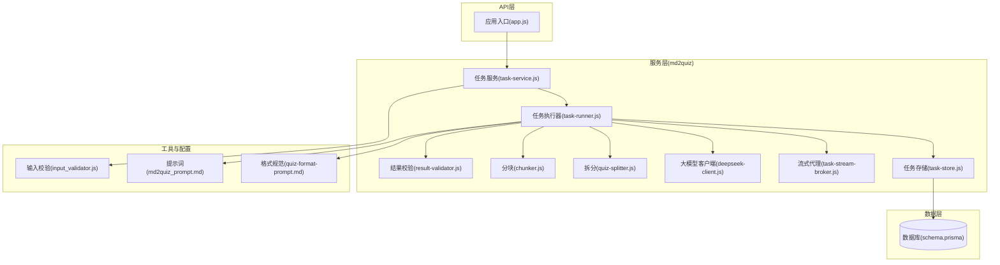
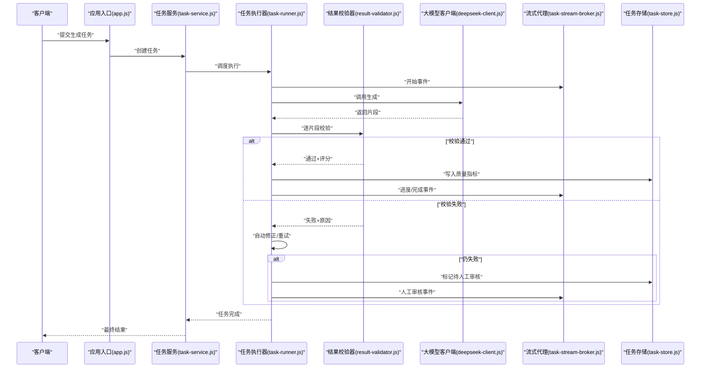
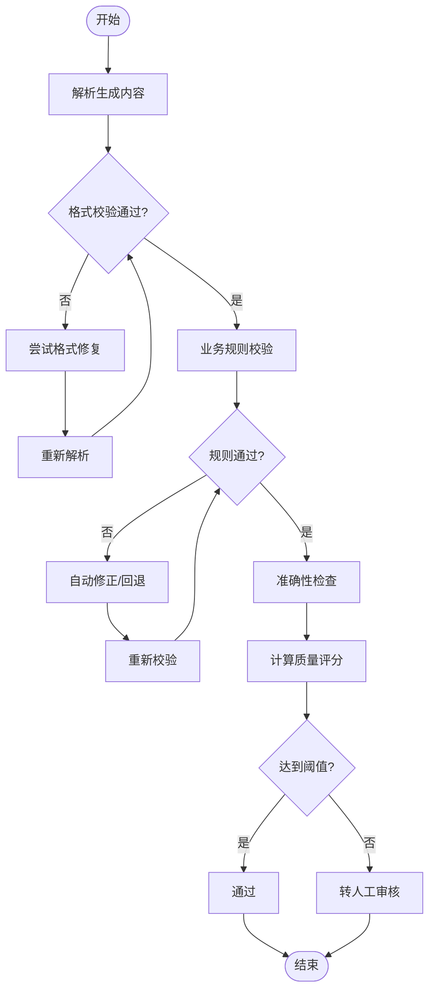
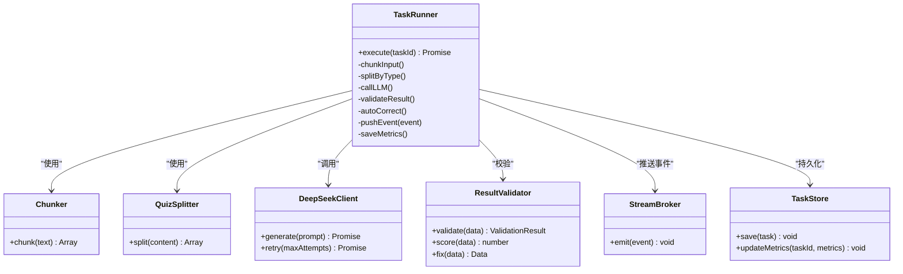
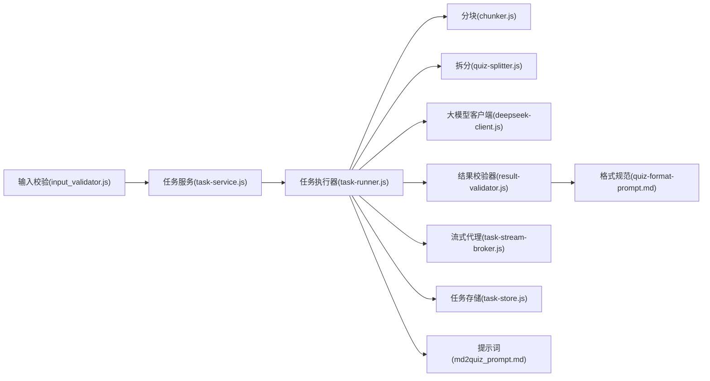

# 质量控制机制

<cite>
**本文档引用的文件**   
- [result-validator.js](file://node-jinmao/service/md2quiz/result-validator.js)
- [task-runner.js](file://node-jinmao/service/md2quiz/task-runner.js)
- [task-service.js](file://node-jinmao/service/md2quiz/task-service.js)
- [task-store.js](file://node-jinmao/service/md2quiz/task-store.js)
- [task-stream-broker.js](file://node-jinmao/service/md2quiz/task-stream-broker.js)
- [input_validator.js](file://node-jinmao/utils/input_validator.js)
- [md2quiz_prompt.md](file://node-jinmao/config/md2quiz_prompt.md)
- [quiz-format-prompt.md](file://node-jinmao/config/quiz-format-prompt.md)
- [quiz_splitter.js](file://node-jinmao/service/md2quiz/quiz-splitter.js)
- [chunker.js](file://node-jinmao/service/md2quiz/chunker.js)
- [deepseek-client.js](file://node-jinmao/service/md2quiz/deepseek-client.js)
- [schema.prisma](file://node-jinmao/prisma/schema.prisma)
- [app.js](file://node-jinmao/app.js)
</cite>

## 目录
1. [简介](#简介)
2. [项目结构](#项目结构)
3. [核心组件](#核心组件)
4. [架构总览](#架构总览)
5. [详细组件分析](#详细组件分析)
6. [依赖关系分析](#依赖关系分析)
7. [性能考虑](#性能考虑)
8. [故障排查指南](#故障排查指南)
9. [结论](#结论)
10. [附录](#附录)

## 简介
本文件面向AI生成内容的质量控制机制，覆盖准确性检查、格式验证与业务规则校验，构建从基础语法到语义合理性的多级验证流程。文档同时说明人工审核接口、质量评分系统、反馈收集机制，以及自定义验证规则的扩展方式、低质量内容的自动修正策略、用户反馈集成与持续改进的数据驱动优化方法，并给出性能监控、异常检测与自动化测试方案建议。

## 项目结构
本项目在Node后端中围绕“题库生成”流水线实现质量控制，关键目录与职责如下：
- service/md2quiz：题库生成的核心服务，包含任务编排、流式输出、结果校验、分块与拆分等模块
- utils：通用工具，包括输入校验、LLM客户端封装等
- config：提示词与配置，定义题目格式规范与生成约束
- prisma：数据库模型与迁移，用于持久化任务、质量指标与反馈数据
- app：应用入口与路由挂载

图表来源
- [app.js](file://node-jinmao/app.js)
- [task-service.js](file://node-jinmao/service/md2quiz/task-service.js)
- [task-runner.js](file://node-jinmao/service/md2quiz/task-runner.js)
- [result-validator.js](file://node-jinmao/service/md2quiz/result-validator.js)
- [chunker.js](file://node-jinmao/service/md2quiz/chunker.js)
- [quiz_splitter.js](file://node-jinmao/service/md2quiz/quiz-splitter.js)
- [deepseek-client.js](file://node-jinmao/service/md2quiz/deepseek-client.js)
- [task-stream-broker.js](file://node-jinmao/service/md2quiz/task-stream-broker.js)
- [task-store.js](file://node-jinmao/service/md2quiz/task-store.js)
- [input_validator.js](file://node-jinmao/utils/input_validator.js)
- [md2quiz_prompt.md](file://node-jinmao/config/md2quiz_prompt.md)
- [quiz-format-prompt.md](file://node-jinmao/config/quiz-format-prompt.md)
- [schema.prisma](file://node-jinmao/prisma/schema.prisma)

章节来源
- [app.js](file://node-jinmao/app.js)
- [task-service.js](file://node-jinmao/service/md2quiz/task-service.js)
- [task-runner.js](file://node-jinmao/service/md2quiz/task-runner.js)
- [result-validator.js](file://node-jinmao/service/md2quiz/result-validator.js)
- [chunker.js](file://node-jinmao/service/md2quiz/chunker.js)
- [quiz_splitter.js](file://node-jinmao/service/md2quiz/quiz-splitter.js)
- [deepseek-client.js](file://node-jinmao/service/md2quiz/deepseek-client.js)
- [task-stream-broker.js](file://node-jinmao/service/md2quiz/task-stream-broker.js)
- [task-store.js](file://node-jinmao/service/md2quiz/task-store.js)
- [input_validator.js](file://node-jinmao/utils/input_validator.js)
- [md2quiz_prompt.md](file://node-jinmao/config/md2quiz_prompt.md)
- [quiz-format-prompt.md](file://node-jinmao/config/quiz-format-prompt.md)
- [schema.prisma](file://node-jinmao/prisma/schema.prisma)

## 核心组件
- 输入校验器（input_validator.js）：对请求参数进行类型、长度、必填项等基础校验，确保进入流水线的输入合法
- 任务服务（task-service.js）：对外暴露任务创建、查询、取消等能力，协调校验、调度与存储
- 任务执行器（task-runner.js）：编排分块、拆分、调用大模型、结果校验、流式推送与重试逻辑
- 结果校验器（result-validator.js）：基于格式规范与业务规则对生成内容进行结构化校验与评分
- 分块与拆分（chunker.js, quiz-splitter.js）：将长文本切分为可处理片段，并按题型模板拆分
- 大模型客户端（deepseek-client.js）：封装LLM调用、超时与重试、错误码映射
- 流式代理（task-stream-broker.js）：将生成过程以事件形式推送到前端，支持进度与中间结果
- 任务存储（task-store.js）：持久化任务状态、质量指标、反馈与审计日志
- 提示词与格式规范（md2quiz_prompt.md, quiz-format-prompt.md）：定义生成约束、字段要求与评分维度

章节来源
- [input_validator.js](file://node-jinmao/utils/input_validator.js)
- [task-service.js](file://node-jinmao/service/md2quiz/task-service.js)
- [task-runner.js](file://node-jinmao/service/md2quiz/task-runner.js)
- [result-validator.js](file://node-jinmao/service/md2quiz/result-validator.js)
- [chunker.js](file://node-jinmao/service/md2quiz/chunker.js)
- [quiz_splitter.js](file://node-jinmao/service/md2quiz/quiz-splitter.js)
- [deepseek-client.js](file://node-jinmao/service/md2quiz/deepseek-client.js)
- [task-stream-broker.js](file://node-jinmao/service/md2quiz/task-stream-broker.js)
- [task-store.js](file://node-jinmao/service/md2quiz/task-store.js)
- [md2quiz_prompt.md](file://node-jinmao/config/md2quiz_prompt.md)
- [quiz-format-prompt.md](file://node-jinmao/config/quiz-format-prompt.md)

## 架构总览
质量控制贯穿“输入—生成—校验—反馈—优化”的闭环。任务执行器按阶段组织流水线，每个阶段均可插入校验与评分；结果校验器依据格式规范与业务规则判定是否通过，未通过则触发自动修正或人工审核；流式代理实时回传进度与诊断信息；任务存储记录质量指标与反馈，支撑数据驱动的持续优化。

图表来源
- [app.js](file://node-jinmao/app.js)
- [task-service.js](file://node-jinmao/service/md2quiz/task-service.js)
- [task-runner.js](file://node-jinmao/service/md2quiz/task-runner.js)
- [result-validator.js](file://node-jinmao/service/md2quiz/result-validator.js)
- [deepseek-client.js](file://node-jinmao/service/md2quiz/deepseek-client.js)
- [task-stream-broker.js](file://node-jinmao/service/md2quiz/task-stream-broker.js)
- [task-store.js](file://node-jinmao/service/md2quiz/task-store.js)

## 详细组件分析

### 结果校验器（准确性、格式与业务规则）
- 功能要点
  - 格式验证：依据quiz-format-prompt.md定义的JSON结构与字段约束进行解析与校验
  - 业务规则：题型一致性、选项数量、答案有效性、难度与知识点标签匹配
  - 准确性检查：关键词覆盖率、术语一致性、逻辑自洽性（如题干与答案对应）
  - 评分体系：多维度加权评分（格式、业务规则、准确性），阈值判定是否通过
- 扩展点
  - 新增校验规则：在校验器中注册新的规则函数，返回布尔值与诊断信息
  - 权重调整：根据业务场景动态调整评分权重，影响通过率与自动修正策略

图表来源
- [result-validator.js](file://node-jinmao/service/md2quiz/result-validator.js)
- [quiz-format-prompt.md](file://node-jinmao/config/quiz-format-prompt.md)

章节来源
- [result-validator.js](file://node-jinmao/service/md2quiz/result-validator.js)
- [quiz-format-prompt.md](file://node-jinmao/config/quiz-format-prompt.md)

### 任务执行器（多级验证流程编排）
- 功能要点
  - 分块与拆分：使用chunker.js与quiz-splitter.js将输入切分并按题型模板拆分
  - 调用大模型：通过deepseek-client.js发起生成，处理超时、重试与降级
  - 多级验证：先语法与格式，再业务规则，最后准确性与评分
  - 自动修正：针对常见错误进行模板填充、字段补全、选项标准化
  - 流式推进：通过task-stream-broker.js推送进度、中间结果与诊断信息
  - 任务存储：持久化任务状态、质量指标、失败原因与人工审核标记

图表来源
- [task-runner.js](file://node-jinmao/service/md2quiz/task-runner.js)
- [chunker.js](file://node-jinmao/service/md2quiz/chunker.js)
- [quiz_splitter.js](file://node-jinmao/service/md2quiz/quiz-splitter.js)
- [deepseek-client.js](file://node-jinmao/service/md2quiz/deepseek-client.js)
- [result-validator.js](file://node-jinmao/service/md2quiz/result-validator.js)
- [task-stream-broker.js](file://node-jinmao/service/md2quiz/task-stream-broker.js)
- [task-store.js](file://node-jinmao/service/md2quiz/task-store.js)

章节来源
- [task-runner.js](file://node-jinmao/service/md2quiz/task-runner.js)
- [chunker.js](file://node-jinmao/service/md2quiz/chunker.js)
- [quiz_splitter.js](file://node-jinmao/service/md2quiz/quiz-splitter.js)
- [deepseek-client.js](file://node-jinmao/service/md2quiz/deepseek-client.js)
- [result-validator.js](file://node-jinmao/service/md2quiz/result-validator.js)
- [task-stream-broker.js](file://node-jinmao/service/md2quiz/task-stream-broker.js)
- [task-store.js](file://node-jinmao/service/md2quiz/task-store.js)

### 输入校验器（基础语法与边界条件）
- 功能要点
  - 必填字段校验、类型检查、长度限制、枚举值约束
  - 非法输入快速失败，减少无效任务进入流水线
  - 提供清晰的错误消息，便于前端提示与调试

章节来源
- [input_validator.js](file://node-jinmao/utils/input_validator.js)

### 提示词与格式规范（质量基线）
- md2quiz_prompt.md：定义生成目标、上下文约束、输出风格与评分维度
- quiz-format-prompt.md：定义题目JSON结构、字段含义、必填项与取值范围

章节来源
- [md2quiz_prompt.md](file://node-jinmao/config/md2quiz_prompt.md)
- [quiz-format-prompt.md](file://node-jinmao/config/quiz-format-prompt.md)

### 人工审核接口与反馈收集
- 人工审核接口
  - 任务状态标记为“待审核”，流式事件通知前端展示审核面板
  - 审核操作包括通过、拒绝、修改建议与备注
  - 审核结果写回任务存储，并触发后续流程（发布、回滚或二次生成）
- 反馈收集机制
  - 用户可对题目进行点赞、踩、评论与纠错
  - 反馈数据与任务ID关联，形成质量改进数据集
  - 定期聚合反馈，更新评分权重与自动修正规则

章节来源
- [task-stream-broker.js](file://node-jinmao/service/md2quiz/task-stream-broker.js)
- [task-store.js](file://node-jinmao/service/md2quiz/task-store.js)

### 质量评分系统与阈值策略
- 评分维度
  - 格式合规度、业务规则满足度、准确性得分、可读性与一致性
- 阈值策略
  - 不同题型设置差异化阈值，平衡通过率与质量
  - 低于阈值的任务进入自动修正或人工审核通道

章节来源
- [result-validator.js](file://node-jinmao/service/md2quiz/result-validator.js)

### 自动修正与低质量内容处理
- 自动修正策略
  - 缺失字段补全、选项标准化、答案格式修正、重复内容去重
  - 基于模板的回填与最小改动原则，避免破坏语义
- 低质量内容处理
  - 多次修正失败后降级为大模型二次生成或转人工审核
  - 记录失败原因与修正轨迹，用于后续规则优化

章节来源
- [task-runner.js](file://node-jinmao/service/md2quiz/task-runner.js)
- [result-validator.js](file://node-jinmao/service/md2quiz/result-validator.js)

### 与用户反馈的集成与持续改进
- 数据驱动优化
  - 将用户反馈与质量指标关联，统计各题型的缺陷分布
  - 定期训练或更新提示词与校验规则，提升通过率
- 版本化管理
  - 提示词与规则变更需版本化，支持回滚与A/B对比

章节来源
- [task-store.js](file://node-jinmao/service/md2quiz/task-store.js)
- [md2quiz_prompt.md](file://node-jinmao/config/md2quiz_prompt.md)
- [quiz-format-prompt.md](file://node-jinmao/config/quiz-format-prompt.md)

## 依赖关系分析
- 组件耦合
  - 任务执行器高度依赖分块、拆分、大模型客户端、校验器、流式代理与任务存储
  - 校验器依赖格式规范与业务规则配置
- 外部依赖
  - 大模型客户端对接外部LLM服务，需关注超时、限流与错误码映射
- 潜在循环依赖
  - 当前设计无直接循环依赖，但需注意任务存储与流式代理的事件顺序

图表来源
- [input_validator.js](file://node-jinmao/utils/input_validator.js)
- [task-service.js](file://node-jinmao/service/md2quiz/task-service.js)
- [task-runner.js](file://node-jinmao/service/md2quiz/task-runner.js)
- [chunker.js](file://node-jinmao/service/md2quiz/chunker.js)
- [quiz_splitter.js](file://node-jinmao/service/md2quiz/quiz-splitter.js)
- [deepseek-client.js](file://node-jinmao/service/md2quiz/deepseek-client.js)
- [result-validator.js](file://node-jinmao/service/md2quiz/result-validator.js)
- [task-stream-broker.js](file://node-jinmao/service/md2quiz/task-stream-broker.js)
- [task-store.js](file://node-jinmao/service/md2quiz/task-store.js)
- [md2quiz_prompt.md](file://node-jinmao/config/md2quiz_prompt.md)
- [quiz-format-prompt.md](file://node-jinmao/config/quiz-format-prompt.md)

章节来源
- [task-runner.js](file://node-jinmao/service/md2quiz/task-runner.js)
- [result-validator.js](file://node-jinmao/service/md2quiz/result-validator.js)
- [task-store.js](file://node-jinmao/service/md2quiz/task-store.js)

## 性能考虑
- 分块与并行
  - 合理设置分块大小，避免过大导致内存压力；对独立片段可并行处理
- 重试与降级
  - 大模型调用设置指数退避重试，失败时降级为缓存或默认模板
- 流式输出
  - 使用SSE或WebSocket推送中间结果，降低前端等待时间
- 存储与索引
  - 任务与质量指标表建立必要索引，提高查询与聚合效率
- 监控与告警
  - 记录关键指标（成功率、平均耗时、错误率），设置阈值告警

章节来源
- [task-runner.js](file://node-jinmao/service/md2quiz/task-runner.js)
- [task-stream-broker.js](file://node-jinmao/service/md2quiz/task-stream-broker.js)
- [task-store.js](file://node-jinmao/service/md2quiz/task-store.js)

## 故障排查指南
- 常见问题定位
  - 输入校验失败：检查必填字段与类型约束
  - 格式解析失败：核对quiz-format-prompt.md的结构定义
  - 业务规则不通过：查看校验器返回的诊断信息
  - 大模型调用失败：检查网络、限流与错误码映射
- 日志与追踪
  - 任务ID贯穿全流程，结合流式事件与存储日志定位问题
- 恢复策略
  - 自动修正失败后转人工审核；必要时回滚到上一版本提示词或规则

章节来源
- [input_validator.js](file://node-jinmao/utils/input_validator.js)
- [result-validator.js](file://node-jinmao/service/md2quiz/result-validator.js)
- [task-stream-broker.js](file://node-jinmao/service/md2quiz/task-stream-broker.js)
- [task-store.js](file://node-jinmao/service/md2quiz/task-store.js)

## 结论
本质量控制机制通过多级验证、自动修正与人工审核相结合，构建了从输入到输出的完整质量保障闭环。借助评分系统与反馈收集，持续优化提示词与校验规则，提升生成内容的准确性与可用性。配合性能监控与异常检测，确保系统在大规模任务下的稳定性与可维护性。

## 附录
- 自定义验证规则添加步骤
  - 在结果校验器中注册新规则函数，定义校验逻辑与诊断信息
  - 在评分系统中加入该规则的权重，参与总分计算
  - 在任务执行器中启用该规则，观察通过率变化
- 自动化测试方案
  - 单元测试：覆盖输入校验、格式解析、业务规则与评分计算
  - 集成测试：模拟大模型响应，端到端验证任务流程
  - 回归测试：提示词与规则变更后，批量回放历史任务，评估影响

章节来源
- [result-validator.js](file://node-jinmao/service/md2quiz/result-validator.js)
- [task-runner.js](file://node-jinmao/service/md2quiz/task-runner.js)
- [md2quiz_prompt.md](file://node-jinmao/config/md2quiz_prompt.md)
- [quiz-format-prompt.md](file://node-jinmao/config/quiz-format-prompt.md)