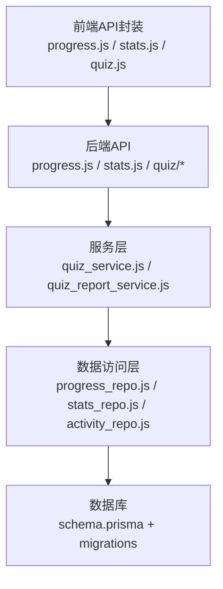
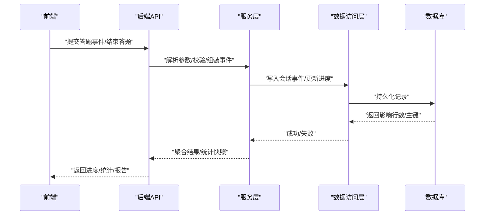
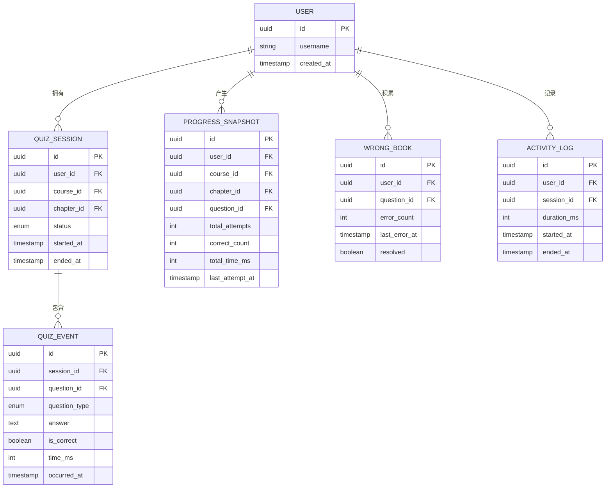
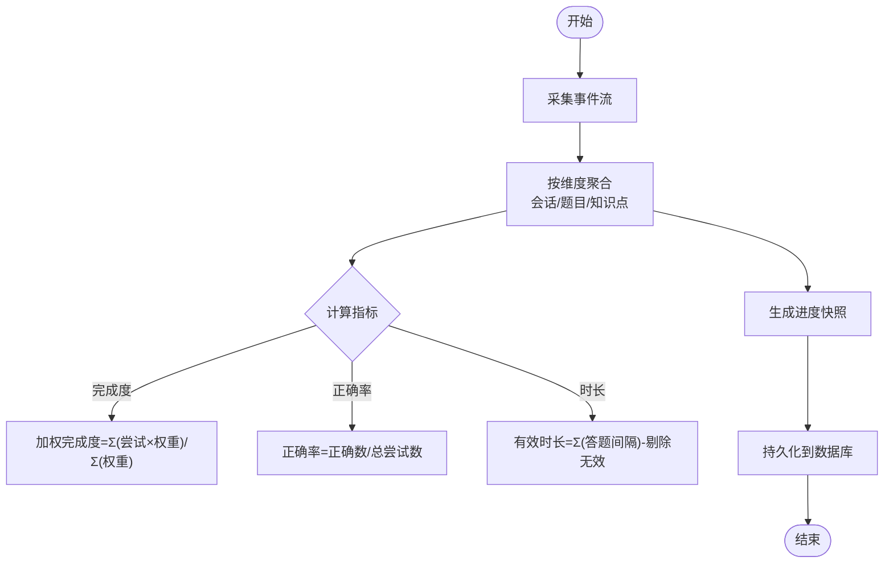
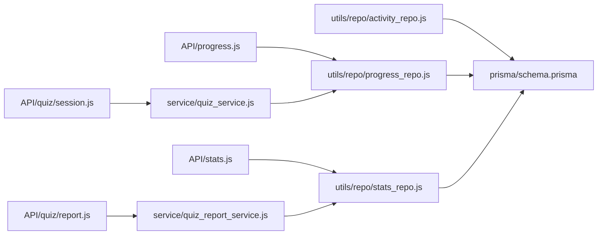

# 学习进度追踪系统详细文档

<cite>
**本文档引用的文件**
- [progress.js](file://node-jinmao/API/progress.js)
- [stats.js](file://node-jinmao/API/stats.js)
- [quiz/session.js](file://node-jinmao/API/quiz/session.js)
- [quiz/report.js](file://node-jinmao/API/quiz/report.js)
- [quiz/wrongbook.js](file://node-jinmao/API/quiz/wrongbook.js)
- [schema.prisma](file://node-jinmao/prisma/schema.prisma)
- [progress_repo.js](file://node-jinmao/utils/repo/progress_repo.js)
- [stats_repo.js](file://node-jinmao/utils/repo/stats_repo.js)
- [activity_repo.js](file://node-jinmao/utils/repo/activity_repo.js)
- [quiz_service.js](file://node-jinmao/service/quiz_service.js)
- [quiz_report_service.js](file://node-jinmao/service/quiz_report_service.js)
- [progress.vue](file://WEB/src/api/progress.js)
- [stats.vue](file://WEB/src/api/stats.js)
- [quiz.vue](file://WEB/src/api/quiz.js)
</cite>

## 目录
1. [简介](#简介)
2. [项目结构](#项目结构)
3. [核心组件](#核心组件)
4. [架构总览](#架构总览)
5. [详细组件分析](#详细组件分析)
6. [依赖关系分析](#依赖关系分析)
7. [性能考量](#性能考量)
8. [故障排查指南](#故障排查指南)
9. [结论](#结论)
10. [附录](#附录)

## 简介
本文件系统性地梳理“学习进度追踪”模块，覆盖答题记录数据结构、学习行为采集与存储、进度计算算法、正确率统计、学习时长分析、错题本机制、API接口设计、统计数据计算方法、扩展新指标的方法、自定义报告格式、与题库系统集成、实时进度更新以及个性化学习建议生成等关键主题。目标是帮助开发者快速理解并扩展该模块，同时为产品与运营提供可操作的度量与洞察。

## 项目结构
学习进度追踪涉及前端（Vue）、后端（Node.js）、数据库（Prisma）与服务层（业务逻辑）。整体分层如下：
- 前端 API 封装：对进度、统计、答题会话等接口进行调用与状态管理
- 后端 API：暴露 REST 接口，负责鉴权、参数校验、事务处理与结果返回
- 服务层：封装复杂业务逻辑（如报告生成、统计聚合、错题本维护）
- 数据访问层：通过 Prisma 仓库模式统一读写数据库
- 数据库：使用 Prisma Schema 定义实体与关系，迁移脚本保证一致性

图表来源
- [progress.js](file://node-jinmao/API/progress.js)
- [stats.js](file://node-jinmao/API/stats.js)
- [quiz/session.js](file://node-jinmao/API/quiz/session.js)
- [quiz/report.js](file://node-jinmao/API/quiz/report.js)
- [quiz/wrongbook.js](file://node-jinmao/API/quiz/wrongbook.js)
- [quiz_service.js](file://node-jinmao/service/quiz_service.js)
- [quiz_report_service.js](file://node-jinmao/service/quiz_report_service.js)
- [progress_repo.js](file://node-jinmao/utils/repo/progress_repo.js)
- [stats_repo.js](file://node-jinmao/utils/repo/stats_repo.js)
- [activity_repo.js](file://node-jinmao/utils/repo/activity_repo.js)
- [schema.prisma](file://node-jinmao/prisma/schema.prisma)

章节来源
- [progress.js](file://node-jinmao/API/progress.js)
- [stats.js](file://node-jinmao/API/stats.js)
- [quiz/session.js](file://node-jinmao/API/quiz/session.js)
- [quiz/report.js](file://node-jinmao/API/quiz/report.js)
- [quiz/wrongbook.js](file://node-jinmao/API/quiz/wrongbook.js)
- [quiz_service.js](file://node-jinmao/service/quiz_service.js)
- [quiz_report_service.js](file://node-jinmao/service/quiz_report_service.js)
- [progress_repo.js](file://node-jinmao/utils/repo/progress_repo.js)
- [stats_repo.js](file://node-jinmao/utils/repo/stats_repo.js)
- [activity_repo.js](file://node-jinmao/utils/repo/activity_repo.js)
- [schema.prisma](file://node-jinmao/prisma/schema.prisma)

## 核心组件
- 答题会话与会话事件：记录用户开始答题、逐题作答、提交答案、结束答题等行为，形成时间序列
- 进度聚合：按课程/章节/题目维度汇总完成度、正确率、用时等指标
- 统计服务：计算正确率、错误分布、知识点掌握度、学习时长趋势
- 错题本：收集错题、标记薄弱点、支持复习与重练
- 报告生成：将多维统计结果组织成结构化报告，便于前端渲染或导出

章节来源
- [quiz/session.js](file://node-jinmao/API/quiz/session.js)
- [quiz/report.js](file://node-jinmao/API/quiz/report.js)
- [quiz/wrongbook.js](file://node-jinmao/API/quiz/wrongbook.js)
- [quiz_service.js](file://node-jinmao/service/quiz_service.js)
- [quiz_report_service.js](file://node-jinmao/service/quiz_report_service.js)

## 架构总览
从请求到落库的端到端流程如下：

图表来源
- [quiz/session.js](file://node-jinmao/API/quiz/session.js)
- [quiz/report.js](file://node-jinmao/API/quiz/report.js)
- [quiz_service.js](file://node-jinmao/service/quiz_service.js)
- [quiz_report_service.js](file://node-jinmao/service/quiz_report_service.js)
- [progress_repo.js](file://node-jinmao/utils/repo/progress_repo.js)
- [stats_repo.js](file://node-jinmao/utils/repo/stats_repo.js)
- [activity_repo.js](file://node-jinmao/utils/repo/activity_repo.js)
- [schema.prisma](file://node-jinmao/prisma/schema.prisma)

## 详细组件分析

### 数据结构设计（答题记录与学习行为）
- 答题会话：包含会话ID、用户ID、课程/章节标识、开始/结束时间、状态（进行中/已完成/已取消）
- 答题事件：包含会话ID、题目ID、题型、选项/答案、是否正确、耗时、时间戳
- 进度快照：按用户+课程/章节/题目维度的完成数、正确数、总用时、最近答题时间
- 错题记录：用户ID、题目ID、错误次数、最近错误时间、是否已解决
- 活动日志：用于学习时长分析，记录每次答题起止时间与上下文信息

图表来源
- [schema.prisma](file://node-jinmao/prisma/schema.prisma)

章节来源
- [schema.prisma](file://node-jinmao/prisma/schema.prisma)

### 学习行为采集与存储机制
- 采集时机：进入答题页初始化会话；每道题作答时记录事件；提交后更新正确性与耗时；退出或完成时关闭会话
- 存储策略：事件采用批量写入与幂等键（如session_id+question_id+occurred_at）避免重复；进度快照在事件聚合后异步更新
- 容错与重试：网络异常时本地缓存事件，恢复后批量上报；服务端去重确保一致性

章节来源
- [quiz/session.js](file://node-jinmao/API/quiz/session.js)
- [activity_repo.js](file://node-jinmao/utils/repo/activity_repo.js)
- [progress_repo.js](file://node-jinmao/utils/repo/progress_repo.js)

### 进度计算算法
- 完成度：按题目维度统计尝试次数与正确次数，结合权重（如题型难度）计算加权完成度
- 正确率：按会话或时间段聚合正确数/总尝试数，支持滑动窗口（近N题/近N分钟）
- 学习时长：基于活动日志累计有效答题时长，剔除无效交互（如频繁切换页面）

图表来源
- [progress_repo.js](file://node-jinmao/utils/repo/progress_repo.js)
- [stats_repo.js](file://node-jinmao/utils/repo/stats_repo.js)
- [activity_repo.js](file://node-jinmao/utils/repo/activity_repo.js)

章节来源
- [progress_repo.js](file://node-jinmao/utils/repo/progress_repo.js)
- [stats_repo.js](file://node-jinmao/utils/repo/stats_repo.js)
- [activity_repo.js](file://node-jinmao/utils/repo/activity_repo.js)

### 正确率统计方法
- 全局正确率：用户所有题目的正确数/总尝试数
- 分题型正确率：选择题、填空题、判断题分别统计
- 分知识点正确率：按题目标签/知识点分组聚合
- 趋势分析：按天/周/月绘制正确率曲线，识别进步或退步阶段

章节来源
- [stats.js](file://node-jinmao/API/stats.js)
- [stats_repo.js](file://node-jinmao/utils/repo/stats_repo.js)

### 学习时长分析功能
- 单次会话时长：从开始到结束的毫秒差，过滤非答题时段
- 日/周/月时长：聚合活动日志，输出柱状图数据
- 峰值时段：统计一天内答题高峰，辅助制定学习计划

章节来源
- [activity_repo.js](file://node-jinmao/utils/repo/activity_repo.js)
- [stats.js](file://node-jinmao/API/stats.js)

### 错题本功能的实现原理
- 收集规则：当is_correct为false时，写入错题记录，增加错误计数与最近错误时间
- 复习策略：按错误频率与最近错误时间排序，优先推荐高频错题
- 解决标记：用户重新做对后标记为已解决，降低推荐优先级

章节来源
- [quiz/wrongbook.js](file://node-jinmao/API/quiz/wrongbook.js)
- [quiz_service.js](file://node-jinmao/service/quiz_service.js)

### 学习记录的API接口
- 进度相关：获取/更新用户进度快照、按维度查询完成度与正确率
- 统计相关：获取全局/分题型/分知识点正确率、时长趋势
- 答题会话：创建/提交/结束会话，批量上报答题事件
- 错题本：列出错题、标记解决、导出错题集

章节来源
- [progress.js](file://node-jinmao/API/progress.js)
- [stats.js](file://node-jinmao/API/stats.js)
- [quiz/session.js](file://node-jinmao/API/quiz/session.js)
- [quiz/report.js](file://node-jinmao/API/quiz/report.js)
- [quiz/wrongbook.js](file://node-jinmao/API/quiz/wrongbook.js)

### 统计数据的计算方法
- 基础指标：尝试数、正确数、错误数、平均耗时、标准差
- 复合指标：知识掌握度（结合正确率与稳定性）、学习强度（单位时间尝试数）
- 可视化数据：折线（趋势）、饼图（题型分布）、热力图（时间段活跃度）

章节来源
- [stats.js](file://node-jinmao/API/stats.js)
- [stats_repo.js](file://node-jinmao/utils/repo/stats_repo.js)
- [quiz_report_service.js](file://node-jinmao/service/quiz_report_service.js)

### 扩展新的统计指标
- 新增指标步骤：
  - 在数据访问层添加聚合查询（如按知识点正确率）
  - 在服务层封装计算逻辑（如加入稳定性因子）
  - 在后端API暴露新字段
  - 在前端适配展示组件
- 示例路径参考：
  - 新增聚合查询：[stats_repo.js](file://node-jinmao/utils/repo/stats_repo.js)
  - 封装计算逻辑：[quiz_report_service.js](file://node-jinmao/service/quiz_report_service.js)
  - 暴露接口：[stats.js](file://node-jinmao/API/stats.js)
  - 前端调用：[stats.vue](file://WEB/src/api/stats.js)

章节来源
- [stats_repo.js](file://node-jinmao/utils/repo/stats_repo.js)
- [quiz_report_service.js](file://node-jinmao/service/quiz_report_service.js)
- [stats.js](file://node-jinmao/API/stats.js)
- [stats.vue](file://WEB/src/api/stats.js)

### 自定义学习报告格式
- 报告模板：支持JSON/YAML模板，定义指标、图表类型、布局
- 渲染引擎：根据模板生成HTML/PDF，支持分页与样式定制
- 扩展方式：新增模板文件并在报告服务中注册

章节来源
- [quiz/report.js](file://node-jinmao/API/quiz/report.js)
- [quiz_report_service.js](file://node-jinmao/service/quiz_report_service.js)

### 与题库系统的集成方式
- 题目导入：支持Markdown/PDF转JSON，标准化题目结构
- 题目校验：题型、选项、答案完整性检查
- 动态加载：按需加载题目与解析，减少首屏压力

章节来源
- [quiz/import.js](file://node-jinmao/API/quiz/import.js)
- [quiz/pdf2quiz.js](file://node-jinmao/API/quiz/pdf2quiz.js)
- [quiz/md2json.js](file://node-jinmao/API/quiz/md2json.js)

### 实时进度更新的实现
- 事件驱动：前端每道答题事件触发即上报，后端立即聚合并推送进度
- SSE/WebSocket：服务端主动推送进度变化，前端实时更新UI
- 离线支持：网络断开时本地缓存，恢复后同步

章节来源
- [quiz/session.js](file://node-jinmao/API/quiz/session.js)
- [quiz_service.js](file://node-jinmao/service/quiz_service.js)

### 个性化学习建议的生成机制
- 规则引擎：基于错题频率、正确率趋势、学习时长生成建议
- LLM增强：结合大模型生成自然语言建议，提升可读性
- 反馈闭环：用户采纳建议后记录效果，优化推荐策略

章节来源
- [quiz_report_service.js](file://node-jinmao/service/quiz_report_service.js)
- [quiz_service.js](file://node-jinmao/service/quiz_service.js)

## 依赖关系分析

图表来源
- [progress.js](file://node-jinmao/API/progress.js)
- [stats.js](file://node-jinmao/API/stats.js)
- [quiz/session.js](file://node-jinmao/API/quiz/session.js)
- [quiz/report.js](file://node-jinmao/API/quiz/report.js)
- [progress_repo.js](file://node-jinmao/utils/repo/progress_repo.js)
- [stats_repo.js](file://node-jinmao/utils/repo/stats_repo.js)
- [activity_repo.js](file://node-jinmao/utils/repo/activity_repo.js)
- [quiz_service.js](file://node-jinmao/service/quiz_service.js)
- [quiz_report_service.js](file://node-jinmao/service/quiz_report_service.js)
- [schema.prisma](file://node-jinmao/prisma/schema.prisma)

章节来源
- [progress.js](file://node-jinmao/API/progress.js)
- [stats.js](file://node-jinmao/API/stats.js)
- [quiz/session.js](file://node-jinmao/API/quiz/session.js)
- [quiz/report.js](file://node-jinmao/API/quiz/report.js)
- [progress_repo.js](file://node-jinmao/utils/repo/progress_repo.js)
- [stats_repo.js](file://node-jinmao/utils/repo/stats_repo.js)
- [activity_repo.js](file://node-jinmao/utils/repo/activity_repo.js)
- [quiz_service.js](file://node-jinmao/service/quiz_service.js)
- [quiz_report_service.js](file://node-jinmao/service/quiz_report_service.js)
- [schema.prisma](file://node-jinmao/prisma/schema.prisma)

## 性能考量
- 批量写入：答题事件合并为批次，减少数据库往返
- 索引优化：为user_id、session_id、question_id建立索引，加速聚合查询
- 缓存策略：热点进度快照使用Redis缓存，降低读放大
- 异步处理：报告生成与统计聚合采用任务队列，避免阻塞请求

## 故障排查指南
- 常见问题：
  - 事件丢失：检查本地缓存与上报重试逻辑
  - 进度不一致：核对去重键与幂等写入
  - 统计偏差：确认时间窗口与过滤条件
- 调试工具：
  - 查看活动日志与事件流水
  - 打印聚合SQL与执行计划
  - 监控接口延迟与错误率

章节来源
- [activity_repo.js](file://node-jinmao/utils/repo/activity_repo.js)
- [progress_repo.js](file://node-jinmao/utils/repo/progress_repo.js)
- [stats_repo.js](file://node-jinmao/utils/repo/stats_repo.js)

## 结论
本系统通过清晰的分层架构与完善的数据结构，实现了学习进度的全链路追踪。从行为采集、存储、聚合到报告生成，各环节职责明确，易于扩展与维护。建议在生产环境加强监控与告警，持续优化性能与准确性。

## 附录
- 术语表：
  - 会话：一次答题过程的抽象
  - 事件：用户与题目交互的最小单元
  - 快照：进度指标的阶段性汇总
- 最佳实践：
  - 保持事件幂等，避免重复计算
  - 定期清理过期活动日志
  - 模板化报告，便于多端适配