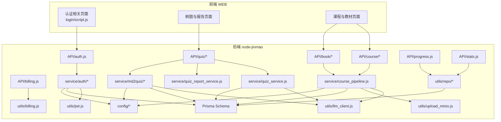
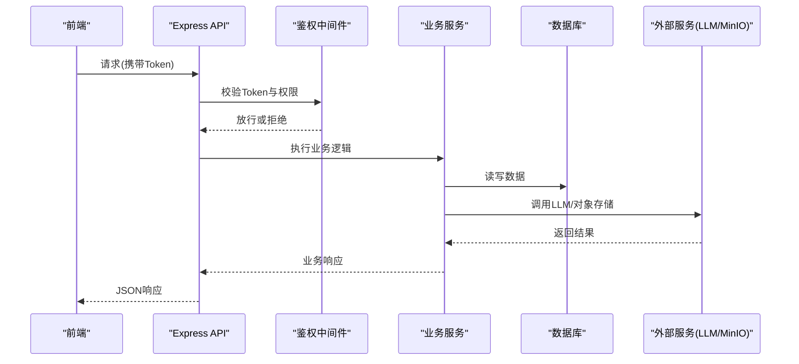
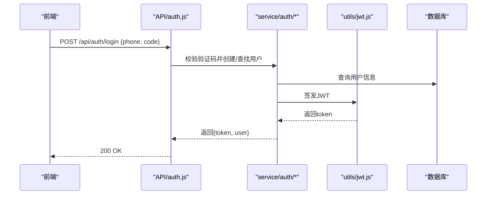
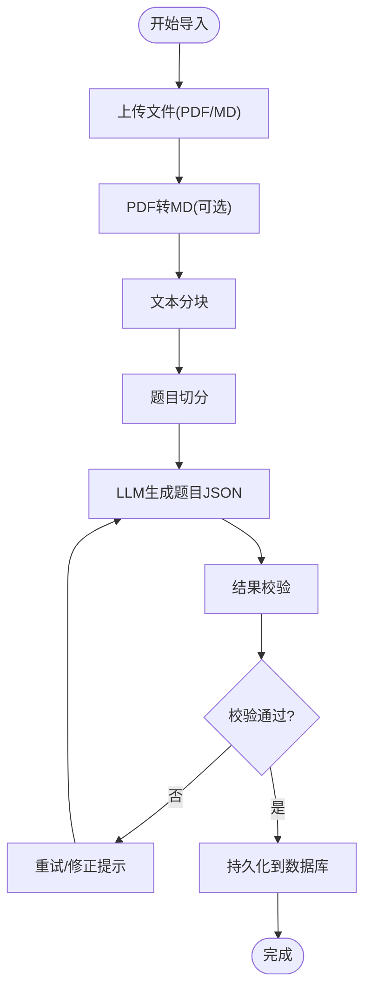
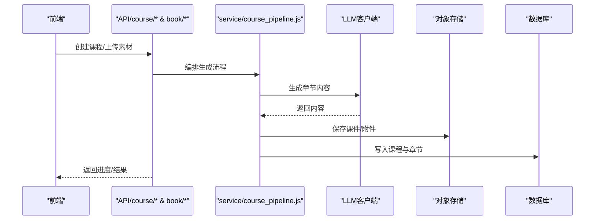
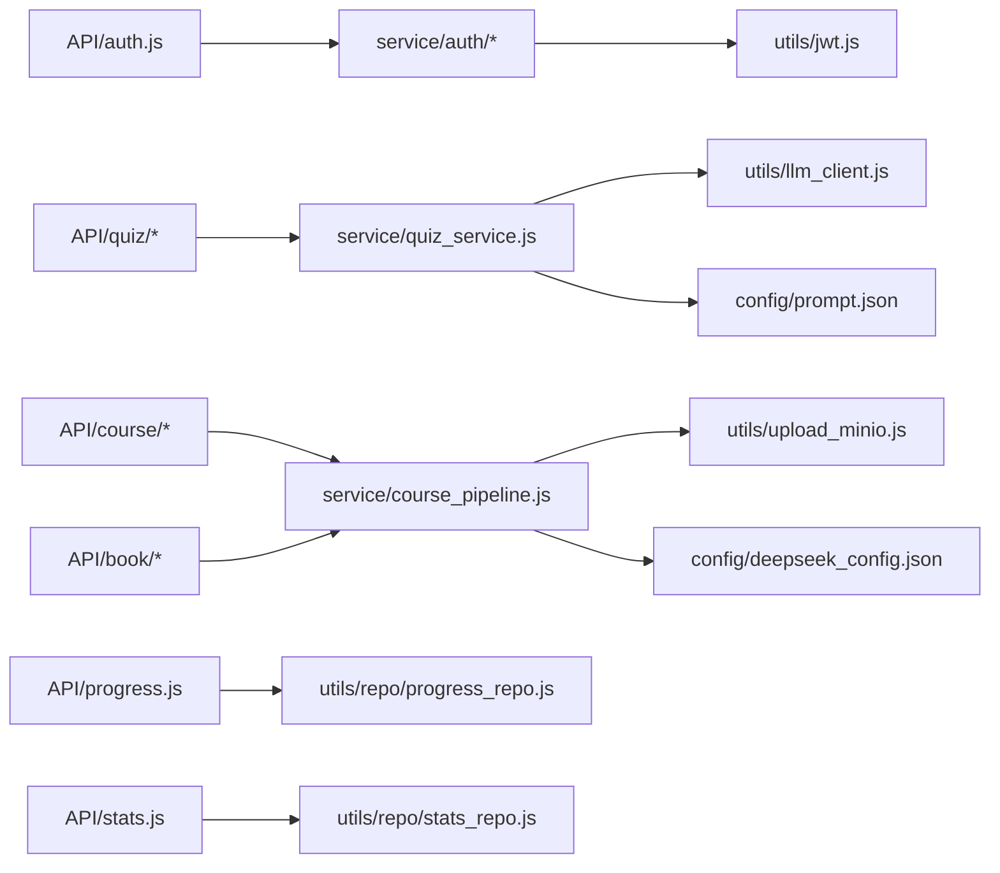

# 核心功能模块

<cite>
**本文引用的文件**   
- [app.js](file://node-jinmao/app.js)
- [API/auth.js](file://node-jinmao/API/auth.js)
- [service/auth/index.js](file://node-jinmao/service/auth/index.js)
- [service/auth/login.js](file://node-jinmao/service/auth/login.js)
- [service/auth/otp.js](file://node-jinmao/service/auth/otp.js)
- [service/auth/profile.js](file://node-jinmao/service/auth/profile.js)
- [middleware/auth.js](file://node-jinmao/middleware/auth.js)
- [utils/jwt.js](file://node-jinmao/utils/jwt.js)
- [API/course/index.js](file://node-jinmao/API/course/index.js)
- [API/course/slides.js](file://node-jinmao/API/course/slides.js)
- [service/course_pipeline.js](file://node-jinmao/service/course_pipeline.js)
- [API/book/index.js](file://node-jinmao/API/book/index.js)
- [API/book/list.js](file://node-jinmao/API/book/list.js)
- [API/book/detail.js](file://node-jinmao/API/book/detail.js)
- [API/book/files.js](file://node-jinmao/API/book/files.js)
- [API/book/update.js](file://node-jinmao/API/book/update.js)
- [API/book/delete.js](file://node-jinmao/API/book/delete.js)
- [API/book/generate-next-chapter.js](file://node-jinmao/API/book/generate-next-chapter.js)
- [API/quiz/import.js](file://node-jinmao/API/quiz/import.js)
- [API/quiz/textbooks.js](file://node-jinmao/API/quiz/textbooks.js)
- [API/quiz/session.js](file://node-jinmao/API/quiz/session.js)
- [API/quiz/report.js](file://node-jinmao/API/quiz/report.js)
- [service/quiz_service.js](file://node-jinmao/service/quiz_service.js)
- [service/quiz_report_service.js](file://node-jinmao/service/quiz_report_service.js)
- [service/md2quiz/task-service.js](file://node-jinmao/service/md2quiz/task-service.js)
- [service/md2quiz/task-runner.js](file://node-jinmao/service/md2quiz/task-runner.js)
- [service/md2quiz/task-store.js](file://node-jinmao/service/md2quiz/task-store.js)
- [service/md2quiz/task-stream-broker.js](file://node-jinmao/service/md2quiz/task-stream-broker.js)
- [service/md2quiz/chunker.js](file://node-jinmao/service/md2quiz/chunker.js)
- [service/md2quiz/pdf-to-md.js](file://node-jinmao/service/md2quiz/pdf-to-md.js)
- [service/md2quiz/quiz-splitter.js](file://node-jinmao/service/md2quiz/quiz-splitter.js)
- [service/md2quiz/result-validator.js](file://node-jinmao/service/md2quiz/result-validator.js)
- [service/md2quiz/deepseek-client.js](file://node-jinmao/service/md2quiz/deepseek-client.js)
- [API/progress.js](file://node-jinmao/API/progress.js)
- [utils/repo/progress_repo.js](file://node-jinmao/utils/repo/progress_repo.js)
- [API/stats.js](file://node-jinmao/API/stats.js)
- [prisma/schema.prisma](file://node-jinmao/prisma/schema.prisma)
- [config/prompt.json](file://node-jinmao/config/prompt.json)
- [config/deepseek_config.json](file://node-jinmao/config/deepseek_config.json)
- [config/minio_config.json](file://node-jinmao/config/minio_config.json)
- [config/billing_pricing.json](file://node-jinmao/config/billing_pricing.json)
- [API/billing.js](file://node-jinmao/API/billing.js)
- [utils/billing.js](file://node-jinmao/utils/billing.js)
- [WEB/src/api/auth.js](file://WEB/src/api/auth.js)
- [WEB/src/stores/auth.js](file://WEB/src/stores/auth.js)
- [WEB/src/pages/login/script.js](file://WEB/src/pages/login/script.js)
</cite>

## 目录
1. [简介](#简介)
2. [项目结构](#项目结构)
3. [核心组件](#核心组件)
4. [架构总览](#架构总览)
5. [详细组件分析](#详细组件分析)
6. [依赖关系分析](#依赖关系分析)
7. [性能考量](#性能考量)
8. [故障排查指南](#故障排查指南)
9. [结论](#结论)
10. [附录](#附录)

## 简介
本文件面向“金毛教你学重构版”的核心功能模块，系统性阐述用户认证、题库管理、课程管理、学习进度追踪与AI内容生成等关键能力的设计与实现。文档覆盖职责边界、数据流转、外部服务集成、配置项与参数说明、返回值格式、错误处理机制，并提供使用示例、最佳实践、扩展方法与第三方集成建议，帮助读者快速理解并高效使用系统。

## 项目结构
后端采用 Node.js + Express 的模块化分层：
- API 层：按业务域划分（auth、book、course、quiz、progress、stats、billing）
- Service 层：封装领域逻辑与流程编排
- Repo 层：数据访问抽象（Prisma）
- Utils 层：通用工具（JWT、LLM 客户端、MinIO 上传、计费、校验等）
- Config 层：外部服务与提示词配置
- Prisma：数据库模型与迁移

前端为 Vue 3 + Vite，提供登录、刷题、报告、账单等页面，并通过统一的 API 客户端调用后端接口。

图表来源
- [app.js:1-200](file://node-jinmao/app.js#L1-L200)
- [API/auth.js:1-200](file://node-jinmao/API/auth.js#L1-L200)
- [API/course/index.js:1-200](file://node-jinmao/API/course/index.js#L1-L200)
- [API/book/index.js:1-200](file://node-jinmao/API/book/index.js#L1-L200)
- [API/quiz/import.js:1-200](file://node-jinmao/API/quiz/import.js#L1-L200)
- [API/progress.js:1-200](file://node-jinmao/API/progress.js#L1-L200)
- [API/stats.js:1-200](file://node-jinmao/API/stats.js#L1-L200)
- [API/billing.js:1-200](file://node-jinmao/API/billing.js#L1-L200)

章节来源
- [app.js:1-200](file://node-jinmao/app.js#L1-L200)

## 核心组件
- 用户认证系统：支持手机号+验证码登录、会话管理与权限校验，统一鉴权中间件保障安全。
- 题库管理系统：支持导入 Markdown/PDF、拆分与校验、任务流执行与结果回写，提供答题会话与报告统计。
- 课程管理系统：教材章节生成、幻灯片导出、封面与标题生成，结合 LLM 与对象存储。
- 学习进度追踪：记录用户答题行为、正确率与学习时长，支撑个性化推荐与报表。
- AI 内容生成：基于 DeepSeek 等大模型的文本生成、题目解析、章节扩写与格式化输出。

章节来源
- [service/auth/index.js:1-200](file://node-jinmao/service/auth/index.js#L1-L200)
- [service/quiz_service.js:1-200](file://node-jinmao/service/quiz_service.js#L1-L200)
- [service/course_pipeline.js:1-200](file://node-jinmao/service/course_pipeline.js#L1-L200)
- [API/progress.js:1-200](file://node-jinmao/API/progress.js#L1-L200)
- [service/md2quiz/task-service.js:1-200](file://node-jinmao/service/md2quiz/task-service.js#L1-L200)

## 架构总览
系统遵循“API 层薄、Service 层厚、Repo 层专一”的分层设计，通过中间件进行鉴权，借助配置中心管理外部服务，利用 Prisma 统一数据访问。

图表来源
- [app.js:1-200](file://node-jinmao/app.js#L1-L200)
- [middleware/auth.js:1-200](file://node-jinmao/middleware/auth.js#L1-L200)
- [utils/jwt.js:1-200](file://node-jinmao/utils/jwt.js#L1-L200)

## 详细组件分析

### 用户认证系统
- 职责边界
  - 登录与注册：手机号+验证码登录、密码重置、个人信息查询与更新。
  - 鉴权：统一中间件校验 JWT，注入用户上下文。
  - 会话：令牌签发、刷新与过期策略。
- 数据流转
  - 前端提交手机号与验证码 → 后端 OTP 校验 → 签发 JWT → 后续请求携带 Token → 中间件校验 → 业务服务处理。
- 外部集成
  - 短信验证码服务（由 OTP 模块负责）。
  - 数据库用户表与活动记录。
- 配置与参数
  - JWT 密钥、过期时间、签名算法在配置中定义。
  - 登录接口需手机号、验证码；返回 token、用户基本信息。
- 错误处理
  - 验证码错误、账号不存在、Token 失效等统一错误码与消息。
- 使用示例
  - 登录：POST /api/auth/login，body 包含手机号与验证码，返回 token。
  - 获取信息：GET /api/auth/me，携带 Authorization: Bearer <token>。
- 最佳实践
  - 前端安全存储 token，避免 XSS；服务端严格校验输入与权限。
  - 对敏感操作增加二次验证。

图表来源
- [API/auth.js:1-200](file://node-jinmao/API/auth.js#L1-L200)
- [service/auth/login.js:1-200](file://node-jinmao/service/auth/login.js#L1-L200)
- [service/auth/otp.js:1-200](file://node-jinmao/service/auth/otp.js#L1-L200)
- [utils/jwt.js:1-200](file://node-jinmao/utils/jwt.js#L1-L200)

章节来源
- [API/auth.js:1-200](file://node-jinmao/API/auth.js#L1-L200)
- [service/auth/index.js:1-200](file://node-jinmao/service/auth/index.js#L1-L200)
- [service/auth/login.js:1-200](file://node-jinmao/service/auth/login.js#L1-L200)
- [service/auth/otp.js:1-200](file://node-jinmao/service/auth/otp.js#L1-L200)
- [service/auth/profile.js:1-200](file://node-jinmao/service/auth/profile.js#L1-L200)
- [middleware/auth.js:1-200](file://node-jinmao/middleware/auth.js#L1-L200)
- [utils/jwt.js:1-200](file://node-jinmao/utils/jwt.js#L1-L200)

### 题库管理系统
- 职责边界
  - 导入与转换：Markdown/PDF 转题目 JSON，分块、切题、校验与持久化。
  - 答题会话：创建会话、提交答案、实时评分与反馈。
  - 报告统计：错题集、正确率、知识点掌握度。
- 数据流转
  - 导入：文件上传 → PDF转MD → 分块 → LLM生成题目 → 校验 → 入库。
  - 答题：创建会话 → 拉取题目 → 提交答案 → 评分 → 更新进度与报告。
- 外部集成
  - LLM（DeepSeek）用于题目生成与解析。
  - MinIO 用于文件存储。
- 配置与参数
  - md2quiz 任务参数：chunkSize、splitStrategy、prompt 模板、校验规则。
  - 会话参数：题目数量、难度、题型分布。
- 错误处理
  - 文件格式不支持、LLM 超时、JSON 校验失败、会话状态不一致等。
- 使用示例
  - 导入题库：POST /api/quiz/import，multipart/form-data 上传文件，返回 taskId。
  - 查看进度：GET /api/quiz/task/{taskId}，轮询或 SSE 推送。
  - 开始答题：POST /api/quiz/session，返回 session 与题目列表。
  - 提交答案：POST /api/quiz/session/{id}/answer，返回评分与解析。
  - 查看报告：GET /api/quiz/report?sessionId=...，返回统计与错题详情。
- 最佳实践
  - 大文件分块处理，避免内存溢出。
  - 使用任务队列与重试机制，保证可靠性。
  - 前端展示进度条与错误提示，提升用户体验。

图表来源
- [API/quiz/import.js:1-200](file://node-jinmao/API/quiz/import.js#L1-L200)
- [service/md2quiz/pdf-to-md.js:1-200](file://node-jinmao/service/md2quiz/pdf-to-md.js#L1-L200)
- [service/md2quiz/chunker.js:1-200](file://node-jinmao/service/md2quiz/chunker.js#L1-L200)
- [service/md2quiz/quiz-splitter.js:1-200](file://node-jinmao/service/md2quiz/quiz-splitter.js#L1-L200)
- [service/md2quiz/result-validator.js:1-200](file://node-jinmao/service/md2quiz/result-validator.js#L1-L200)
- [service/md2quiz/task-service.js:1-200](file://node-jinmao/service/md2quiz/task-service.js#L1-L200)
- [service/md2quiz/task-runner.js:1-200](file://node-jinmao/service/md2quiz/task-runner.js#L1-L200)
- [service/md2quiz/task-store.js:1-200](file://node-jinmao/service/md2quiz/task-store.js#L1-L200)
- [service/md2quiz/task-stream-broker.js:1-200](file://node-jinmao/service/md2quiz/task-stream-broker.js#L1-L200)

章节来源
- [API/quiz/import.js:1-200](file://node-jinmao/API/quiz/import.js#L1-L200)
- [API/quiz/textbooks.js:1-200](file://node-jinmao/API/quiz/textbooks.js#L1-L200)
- [API/quiz/session.js:1-200](file://node-jinmao/API/quiz/session.js#L1-L200)
- [API/quiz/report.js:1-200](file://node-jinmao/API/quiz/report.js#L1-L200)
- [service/quiz_service.js:1-200](file://node-jinmao/service/quiz_service.js#L1-L200)
- [service/quiz_report_service.js:1-200](file://node-jinmao/service/quiz_report_service.js#L1-L200)
- [service/md2quiz/task-service.js:1-200](file://node-jinmao/service/md2quiz/task-service.js#L1-L200)
- [service/md2quiz/task-runner.js:1-200](file://node-jinmao/service/md2quiz/task-runner.js#L1-L200)
- [service/md2quiz/task-store.js:1-200](file://node-jinmao/service/md2quiz/task-store.js#L1-L200)
- [service/md2quiz/task-stream-broker.js:1-200](file://node-jinmao/service/md2quiz/task-stream-broker.js#L1-L200)
- [service/md2quiz/chunker.js:1-200](file://node-jinmao/service/md2quiz/chunker.js#L1-L200)
- [service/md2quiz/pdf-to-md.js:1-200](file://node-jinmao/service/md2quiz/pdf-to-md.js#L1-L200)
- [service/md2quiz/quiz-splitter.js:1-200](file://node-jinmao/service/md2quiz/quiz-splitter.js#L1-L200)
- [service/md2quiz/result-validator.js:1-200](file://node-jinmao/service/md2quiz/result-validator.js#L1-L200)
- [service/md2quiz/deepseek-client.js:1-200](file://node-jinmao/service/md2quiz/deepseek-client.js#L1-L200)

### 课程管理系统
- 职责边界
  - 教材管理：章节列表、详情、文件管理、更新与删除。
  - 章节生成：基于大纲与提示词，调用 LLM 生成下一章节内容。
  - 幻灯片导出：将章节内容转换为 PPT/HTML 课件。
- 数据流转
  - 创建课程 → 生成大纲 → 逐章生成内容 → 保存至数据库与对象存储 → 导出课件。
- 外部集成
  - LLM 用于内容生成与优化。
  - MinIO 用于课件与附件存储。
- 配置与参数
  - 提示词模板、章节长度、风格设定、导出格式。
- 错误处理
  - LLM 调用失败、内容校验不通过、文件上传失败等。
- 使用示例
  - 创建课程：POST /api/course，返回课程ID。
  - 生成章节：POST /api/book/{id}/next-chapter，返回章节内容与进度。
  - 导出课件：GET /api/course/{id}/slides，返回下载链接。
- 最佳实践
  - 异步生成章节，前端轮询进度。
  - 内容版本化管理，便于回溯与回滚。

图表来源
- [API/course/index.js:1-200](file://node-jinmao/API/course/index.js#L1-L200)
- [API/course/slides.js:1-200](file://node-jinmao/API/course/slides.js#L1-L200)
- [API/book/index.js:1-200](file://node-jinmao/API/book/index.js#L1-L200)
- [API/book/generate-next-chapter.js:1-200](file://node-jinmao/API/book/generate-next-chapter.js#L1-L200)
- [service/course_pipeline.js:1-200](file://node-jinmao/service/course_pipeline.js#L1-L200)

章节来源
- [API/course/index.js:1-200](file://node-jinmao/API/course/index.js#L1-L200)
- [API/course/slides.js:1-200](file://node-jinmao/API/course/slides.js#L1-L200)
- [API/book/index.js:1-200](file://node-jinmao/API/book/index.js#L1-L200)
- [API/book/list.js:1-200](file://node-jinmao/API/book/list.js#L1-L200)
- [API/book/detail.js:1-200](file://node-jinmao/API/book/detail.js#L1-L200)
- [API/book/files.js:1-200](file://node-jinmao/API/book/files.js#L1-L200)
- [API/book/update.js:1-200](file://node-jinmao/API/book/update.js#L1-L200)
- [API/book/delete.js:1-200](file://node-jinmao/API/book/delete.js#L1-L200)
- [API/book/generate-next-chapter.js:1-200](file://node-jinmao/API/book/generate-next-chapter.js#L1-L200)
- [service/course_pipeline.js:1-200](file://node-jinmao/service/course_pipeline.js#L1-L200)

### 学习进度追踪
- 职责边界
  - 记录用户答题行为、正确率、学习时长与知识点掌握情况。
  - 提供统计接口供前端展示学习曲线与报告。
- 数据流转
  - 答题提交 → 计算正确率 → 更新用户学习记录 → 聚合统计。
- 外部集成
  - 数据库持久化，支持按用户、课程、知识点维度查询。
- 配置与参数
  - 统计粒度（日/周/月）、指标定义（正确率、用时、错题数）。
- 错误处理
  - 数据一致性校验、并发更新冲突处理。
- 使用示例
  - 提交答题：POST /api/progress/submit，返回更新后的统计。
  - 查询进度：GET /api/progress?userId=&courseId=...，返回趋势数据。
- 最佳实践
  - 批量更新与缓存热点数据，降低数据库压力。
  - 增量统计，避免全量重算。

章节来源
- [API/progress.js:1-200](file://node-jinmao/API/progress.js#L1-L200)
- [utils/repo/progress_repo.js:1-200](file://node-jinmao/utils/repo/progress_repo.js#L1-L200)

### AI 内容生成
- 职责边界
  - 统一 LLM 客户端封装，支持多种模型与提示词模板。
  - 任务编排：分块、切题、校验、重试与流式输出。
- 数据流转
  - 接收原始文本 → 分块 → 调用 LLM → 解析与校验 → 持久化。
- 外部集成
  - DeepSeek 等 LLM 服务，MinIO 文件存储。
- 配置与参数
  - 模型选择、温度、最大长度、超时、重试次数。
- 错误处理
  - 网络异常、模型限流、输出格式错误、内容安全过滤。
- 使用示例
  - 生成章节：POST /api/book/{id}/next-chapter，传入主题与要求。
  - 生成题目：POST /api/quiz/import，上传材料并指定 prompt。
- 最佳实践
  - 设置合理的超时与重试策略，避免阻塞。
  - 对输出进行结构化校验，确保下游可用性。

章节来源
- [service/md2quiz/deepseek-client.js:1-200](file://node-jinmao/service/md2quiz/deepseek-client.js#L1-L200)
- [service/md2quiz/task-service.js:1-200](file://node-jinmao/service/md2quiz/task-service.js#L1-L200)
- [service/md2quiz/task-runner.js:1-200](file://node-jinmao/service/md2quiz/task-runner.js#L1-L200)
- [service/md2quiz/task-store.js:1-200](file://node-jinmao/service/md2quiz/task-store.js#L1-L200)
- [service/md2quiz/task-stream-broker.js:1-200](file://node-jinmao/service/md2quiz/task-stream-broker.js#L1-L200)
- [config/prompt.json:1-200](file://node-jinmao/config/prompt.json#L1-L200)
- [config/deepseek_config.json:1-200](file://node-jinmao/config/deepseek_config.json#L1-L200)

## 依赖关系分析
- 模块耦合
  - API 层仅负责路由与参数校验，业务逻辑下沉至 Service。
  - Service 依赖 Repo 进行数据访问，依赖 Utils 进行外部服务调用。
  - 配置集中管理，便于切换与灰度发布。
- 循环依赖
  - 通过接口与事件解耦，避免直接循环引用。
- 外部依赖
  - LLM、MinIO、短信服务等通过配置与客户端封装隔离。

图表来源
- [API/auth.js:1-200](file://node-jinmao/API/auth.js#L1-L200)
- [API/quiz/import.js:1-200](file://node-jinmao/API/quiz/import.js#L1-L200)
- [API/course/index.js:1-200](file://node-jinmao/API/course/index.js#L1-L200)
- [API/book/index.js:1-200](file://node-jinmao/API/book/index.js#L1-L200)
- [API/progress.js:1-200](file://node-jinmao/API/progress.js#L1-L200)
- [API/stats.js:1-200](file://node-jinmao/API/stats.js#L1-L200)
- [service/quiz_service.js:1-200](file://node-jinmao/service/quiz_service.js#L1-L200)
- [service/course_pipeline.js:1-200](file://node-jinmao/service/course_pipeline.js#L1-L200)
- [utils/repo/progress_repo.js:1-200](file://node-jinmao/utils/repo/progress_repo.js#L1-L200)
- [utils/repo/stats_repo.js:1-200](file://node-jinmao/utils/repo/stats_repo.js#L1-L200)
- [utils/llm_client.js:1-200](file://node-jinmao/utils/llm_client.js#L1-L200)
- [utils/upload_minio.js:1-200](file://node-jinmao/utils/upload_minio.js#L1-L200)
- [utils/jwt.js:1-200](file://node-jinmao/utils/jwt.js#L1-L200)
- [config/prompt.json:1-200](file://node-jinmao/config/prompt.json#L1-L200)
- [config/deepseek_config.json:1-200](file://node-jinmao/config/deepseek_config.json#L1-L200)

章节来源
- [prisma/schema.prisma:1-200](file://node-jinmao/prisma/schema.prisma#L1-L200)

## 性能考量
- 异步与批处理
  - 大文件导入与 LLM 调用采用异步任务与批处理，减少阻塞。
- 缓存与索引
  - 热点数据缓存（如课程列表、报告摘要），数据库索引优化查询。
- 连接池与限流
  - 数据库连接池、LLM 调用限流与重试退避。
- 流式传输
  - 长任务进度与结果通过 SSE 或 WebSocket 推送，提升体验。
- 资源管理
  - 对象存储分片上传与断点续传，避免内存峰值。

[本节为通用指导，无需特定文件来源]

## 故障排查指南
- 常见问题
  - 登录失败：检查手机号与验证码是否匹配、短信服务是否正常。
  - 题库导入失败：确认文件格式、分块大小、LLM 输出是否符合校验规则。
  - 章节生成卡顿：检查 LLM 超时与重试策略，适当调整并发。
  - 进度不更新：确认任务状态同步与 SSE 连接稳定性。
- 定位方法
  - 查看接口日志与错误码，核对请求参数与响应体。
  - 检查数据库事务与锁竞争，必要时回滚并重试。
  - 监控外部服务健康状态与配额限制。
- 恢复策略
  - 任务幂等设计，支持重复提交与补偿。
  - 失败任务入队重试，告警通知运维。

章节来源
- [middleware/auth.js:1-200](file://node-jinmao/middleware/auth.js#L1-L200)
- [service/md2quiz/result-validator.js:1-200](file://node-jinmao/service/md2quiz/result-validator.js#L1-L200)
- [service/md2quiz/task-runner.js:1-200](file://node-jinmao/service/md2quiz/task-runner.js#L1-L200)

## 结论
本系统以清晰的分层架构与模块化设计，实现了用户认证、题库管理、课程管理、学习进度追踪与 AI 内容生成等核心能力。通过配置中心与外部服务封装，具备良好的可扩展性与可维护性。建议在生产环境加强监控与告警，持续优化性能与稳定性，并逐步引入更多 AI 能力以提升内容质量与学习效率。

[本节为总结，无需特定文件来源]

## 附录
- 配置项说明
  - deepseek_config.json：LLM 模型、密钥、超时与重试策略。
  - minio_config.json：对象存储端点、桶名与访问凭证。
  - prompt.json：各场景提示词模板与参数。
  - billing_pricing.json：计费规则与套餐配置。
- 扩展建议
  - 新增业务模块：在 API 与 service 下新建目录，遵循现有命名与分层规范。
  - 接入新 LLM：在 utils/llm_client.js 中扩展客户端，并在 config 中新增配置。
  - 第三方服务集成：封装独立客户端，统一错误与重试策略。

章节来源
- [config/deepseek_config.json:1-200](file://node-jinmao/config/deepseek_config.json#L1-L200)
- [config/minio_config.json:1-200](file://node-jinmao/config/minio_config.json#L1-L200)
- [config/prompt.json:1-200](file://node-jinmao/config/prompt.json#L1-L200)
- [config/billing_pricing.json:1-200](file://node-jinmao/config/billing_pricing.json#L1-L200)
- [API/billing.js:1-200](file://node-jinmao/API/billing.js#L1-L200)
- [utils/billing.js:1-200](file://node-jinmao/utils/billing.js#L1-L200)