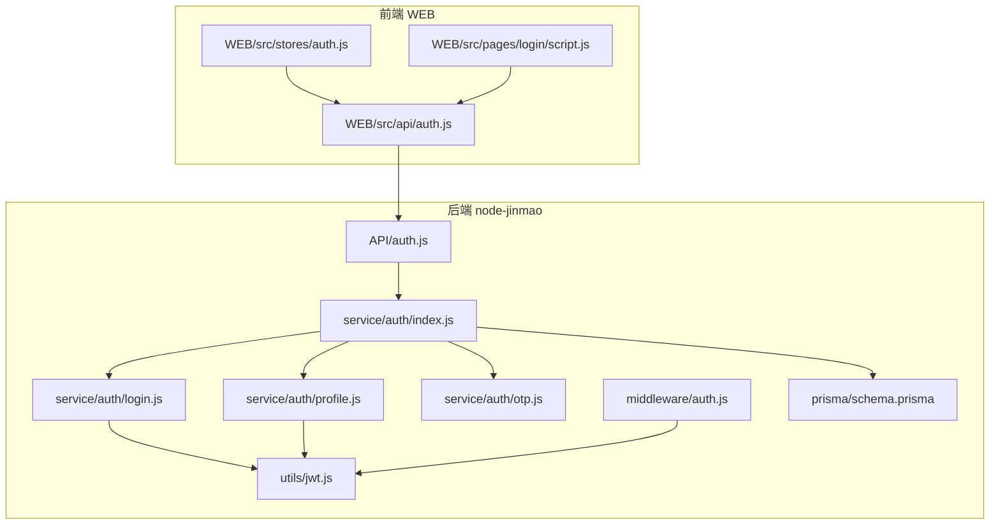
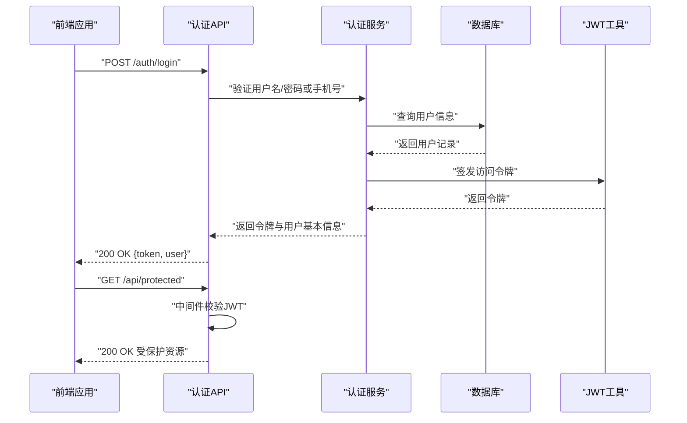
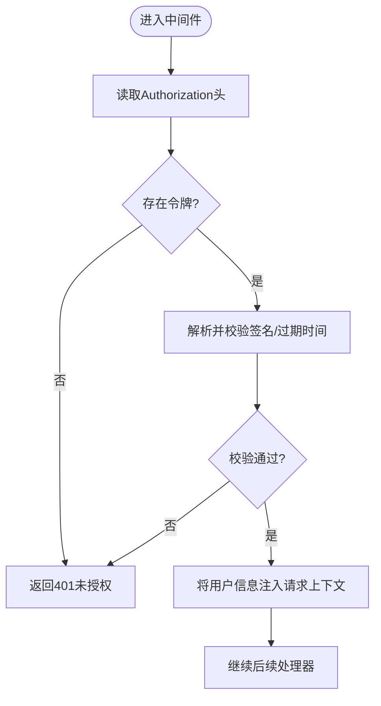
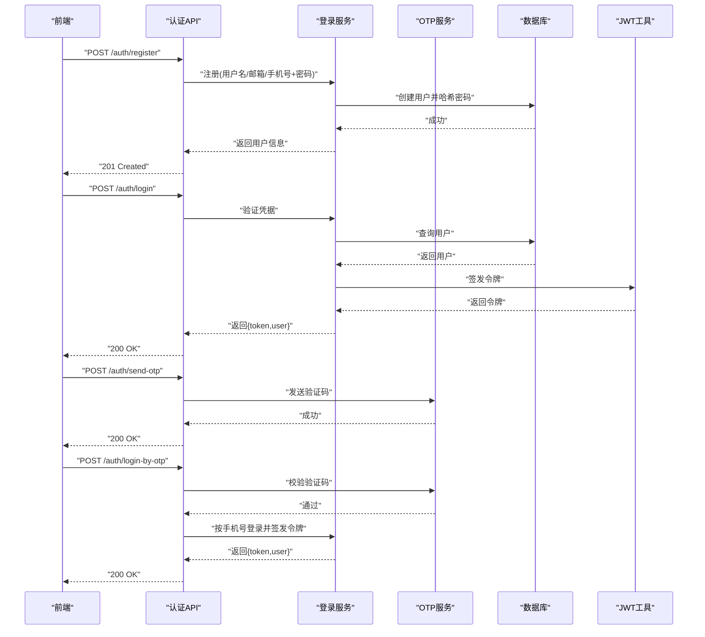
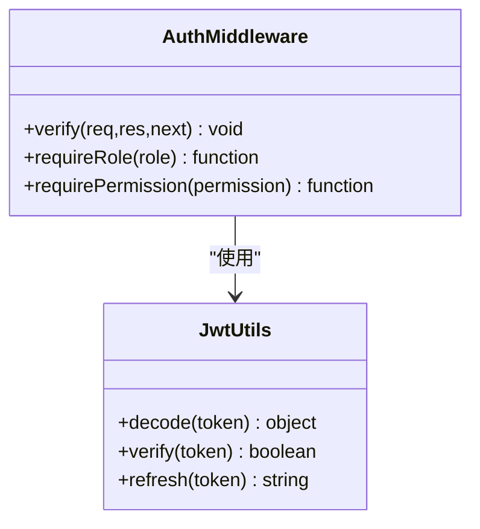
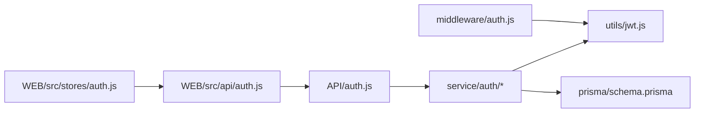

# 用户认证系统

<cite>
**本文档引用的文件**   
- [node-jinmao/API/auth.js](file://node-jinmao/API/auth.js)
- [node-jinmao/middleware/auth.js](file://node-jinmao/middleware/auth.js)
- [node-jinmao/service/auth/index.js](file://node-jinmao/service/auth/index.js)
- [node-jinmao/service/auth/login.js](file://node-jinmao/service/auth/login.js)
- [node-jinmao/service/auth/otp.js](file://node-jinmao/service/auth/otp.js)
- [node-jinmao/service/auth/profile.js](file://node-jinmao/service/auth/profile.js)
- [node-jinmao/utils/jwt.js](file://node-jinmao/utils/jwt.js)
- [node-jinmao/prisma/schema.prisma](file://node-jinmao/prisma/schema.prisma)
- [WEB/src/api/auth.js](file://WEB/src/api/auth.js)
- [WEB/src/stores/auth.js](file://WEB/src/stores/auth.js)
- [WEB/src/pages/login/script.js](file://WEB/src/pages/login/script.js)
- [test/node-jinmao/src/modules/auth/auth.controller.ts](file://test/node-jinmao/src/modules/auth/auth.controller.ts)
- [test/node-jinmao/src/modules/auth/auth.middleware.ts](file://test/node-jinmao/src/modules/auth/auth.middleware.ts)
- [test/node-jinmao/src/modules/auth/auth.routes.ts](file://test/node-jinmao/src/modules/auth/auth.routes.ts)
- [test/node-jinmao/src/modules/auth/auth.service.ts](file://test/node-jinmao/src/modules/auth/auth.service.ts)
- [test/node-jinmao/src/lib/jwt.ts](file://test/node-jinmao/src/lib/jwt.ts)
- [test/node-jinmao/src/lib/password.ts](file://test/node-jinmao/src/lib/password.ts)
</cite>

## 目录
1. [简介](#简介)
2. [项目结构](#项目结构)
3. [核心组件](#核心组件)
4. [架构总览](#架构总览)
5. [详细组件分析](#详细组件分析)
6. [依赖关系分析](#依赖关系分析)
7. [性能考虑](#性能考虑)
8. [故障排查指南](#故障排查指南)
9. [结论](#结论)
10. [附录](#附录)

## 简介
本文件面向“用户认证系统”的完整设计与实现，覆盖JWT令牌生成与校验、用户登录注册流程、权限控制中间件原理、会话管理策略、密码加密存储方式与安全加固措施。同时提供认证API接口说明（请求/响应格式、错误处理）、自定义认证逻辑示例、第三方登录集成建议，以及前端状态管理与令牌刷新机制、跨域认证配置要点。

## 项目结构
后端采用Node.js分层设计：API层路由、服务层业务逻辑、中间件鉴权、工具库JWT封装、数据库模型定义；前端基于Vue组织认证API调用、本地状态与页面交互。

图表来源 
- [node-jinmao/API/auth.js](file://node-jinmao/API/auth.js)
- [node-jinmao/middleware/auth.js](file://node-jinmao/middleware/auth.js)
- [node-jinmao/service/auth/index.js](file://node-jinmao/service/auth/index.js)
- [node-jinmao/service/auth/login.js](file://node-jinmao/service/auth/login.js)
- [node-jinmao/service/auth/otp.js](file://node-jinmao/service/auth/otp.js)
- [node-jinmao/service/auth/profile.js](file://node-jinmao/service/auth/profile.js)
- [node-jinmao/utils/jwt.js](file://node-jinmao/utils/jwt.js)
- [node-jinmao/prisma/schema.prisma](file://node-jinmao/prisma/schema.prisma)
- [WEB/src/api/auth.js](file://WEB/src/api/auth.js)
- [WEB/src/stores/auth.js](file://WEB/src/stores/auth.js)
- [WEB/src/pages/login/script.js](file://WEB/src/pages/login/script.js)

章节来源
- [node-jinmao/API/auth.js](file://node-jinmao/API/auth.js)
- [node-jinmao/middleware/auth.js](file://node-jinmao/middleware/auth.js)
- [node-jinmao/service/auth/index.js](file://node-jinmao/service/auth/index.js)
- [node-jinmao/service/auth/login.js](file://node-jinmao/service/auth/login.js)
- [node-jinmao/service/auth/otp.js](file://node-jinmao/service/auth/otp.js)
- [node-jinmao/service/auth/profile.js](file://node-jinmao/service/auth/profile.js)
- [node-jinmao/utils/jwt.js](file://node-jinmao/utils/jwt.js)
- [node-jinmao/prisma/schema.prisma](file://node-jinmao/prisma/schema.prisma)
- [WEB/src/api/auth.js](file://WEB/src/api/auth.js)
- [WEB/src/stores/auth.js](file://WEB/src/stores/auth.js)
- [WEB/src/pages/login/script.js](file://WEB/src/pages/login/script.js)

## 核心组件
- JWT工具库：负责令牌的签发、解析、校验与过期处理。
- 认证服务：封装登录、注册、OTP验证码、个人资料等业务流程。
- 认证中间件：在请求到达控制器前完成身份校验与权限判断。
- API路由：对外暴露认证相关HTTP端点。
- 前端认证模块：封装API调用、维护登录态与令牌刷新。

章节来源
- [node-jinmao/utils/jwt.js](file://node-jinmao/utils/jwt.js)
- [node-jinmao/service/auth/index.js](file://node-jinmao/service/auth/index.js)
- [node-jinmao/service/auth/login.js](file://node-jinmao/service/auth/login.js)
- [node-jinmao/service/auth/otp.js](file://node-jinmao/service/auth/otp.js)
- [node-jinmao/service/auth/profile.js](file://node-jinmao/service/auth/profile.js)
- [node-jinmao/middleware/auth.js](file://node-jinmao/middleware/auth.js)
- [node-jinmao/API/auth.js](file://node-jinmao/API/auth.js)
- [WEB/src/api/auth.js](file://WEB/src/api/auth.js)
- [WEB/src/stores/auth.js](file://WEB/src/stores/auth.js)

## 架构总览
认证系统采用“无状态JWT + 可选OTP”的组合方案。前端登录后保存访问令牌，后续请求通过中间件校验令牌有效性并注入用户上下文；敏感操作可结合角色/权限进行细粒度控制。

图表来源 
- [node-jinmao/API/auth.js](file://node-jinmao/API/auth.js)
- [node-jinmao/service/auth/login.js](file://node-jinmao/service/auth/login.js)
- [node-jinmao/utils/jwt.js](file://node-jinmao/utils/jwt.js)
- [node-jinmao/middleware/auth.js](file://node-jinmao/middleware/auth.js)

## 详细组件分析

### JWT令牌生成与验证
- 签发：使用固定密钥与算法生成短期访问令牌，包含用户标识与必要声明。
- 校验：中间件解析请求头中的令牌，验证签名与有效期，失败则拒绝访问。
- 扩展：支持刷新令牌机制（可选），用于无感续期。

图表来源 
- [node-jinmao/middleware/auth.js](file://node-jinmao/middleware/auth.js)
- [node-jinmao/utils/jwt.js](file://node-jinmao/utils/jwt.js)

章节来源
- [node-jinmao/utils/jwt.js](file://node-jinmao/utils/jwt.js)
- [node-jinmao/middleware/auth.js](file://node-jinmao/middleware/auth.js)

### 用户登录与注册流程
- 登录：支持账号密码或短信验证码登录；成功后签发访问令牌。
- 注册：校验唯一性、密码强度，写入用户表并返回基础信息。
- OTP：发送验证码、校验验证码时效与次数限制。

图表来源 
- [node-jinmao/service/auth/login.js](file://node-jinmao/service/auth/login.js)
- [node-jinmao/service/auth/otp.js](file://node-jinmao/service/auth/otp.js)
- [node-jinmao/utils/jwt.js](file://node-jinmao/utils/jwt.js)

章节来源
- [node-jinmao/service/auth/login.js](file://node-jinmao/service/auth/login.js)
- [node-jinmao/service/auth/otp.js](file://node-jinmao/service/auth/otp.js)
- [node-jinmao/service/auth/index.js](file://node-jinmao/service/auth/index.js)

### 权限控制中间件
- 职责：校验JWT、提取用户上下文、可选的角色/权限检查。
- 行为：未携带令牌或令牌无效时返回401；权限不足返回403。
- 扩展：可按路由或资源维度附加细粒度权限校验。

图表来源 
- [node-jinmao/middleware/auth.js](file://node-jinmao/middleware/auth.js)
- [node-jinmao/utils/jwt.js](file://node-jinmao/utils/jwt.js)

章节来源
- [node-jinmao/middleware/auth.js](file://node-jinmao/middleware/auth.js)
- [node-jinmao/utils/jwt.js](file://node-jinmao/utils/jwt.js)

### 会话管理策略
- 无状态会话：服务端不持久化会话，所有状态由客户端持有（访问令牌）。
- 令牌生命周期：短效访问令牌降低泄露风险；可选刷新令牌延长体验。
- 安全存储：前端建议使用内存或安全的存储位置，避免XSS窃取。

章节来源
- [node-jinmao/utils/jwt.js](file://node-jinmao/utils/jwt.js)
- [WEB/src/stores/auth.js](file://WEB/src/stores/auth.js)

### 密码加密存储方式
- 哈希算法：采用不可逆哈希（如bcrypt/argon2）对密码进行加盐哈希。
- 比较方法：登录时仅比较哈希值，不存储明文。
- 最佳实践：定期升级哈希参数，确保抗暴力破解能力。

章节来源
- [node-jinmao/service/auth/login.js](file://node-jinmao/service/auth/login.js)
- [test/node-jinmao/src/lib/password.ts](file://test/node-jinmao/src/lib/password.ts)

### 安全防护措施
- 输入校验：严格校验请求体字段类型与长度。
- 速率限制：对登录与验证码接口限流，防止滥用。
- 传输安全：强制HTTPS，设置Cookie安全属性（若使用Cookie）。
- 最小权限：默认拒绝访问，按需放行。

章节来源
- [node-jinmao/middleware/auth.js](file://node-jinmao/middleware/auth.js)
- [node-jinmao/service/auth/otp.js](file://node-jinmao/service/auth/otp.js)

### 认证API接口说明
以下为常见认证端点的通用规范（具体字段以实际实现为准）：
- POST /auth/register
  - 请求体：用户名/邮箱/手机号、密码、可选昵称
  - 响应：201 Created，返回用户基础信息
  - 错误：400 参数校验失败，409 用户已存在
- POST /auth/login
  - 请求体：用户名/邮箱/手机号、密码
  - 响应：200 OK，返回访问令牌与用户信息
  - 错误：401 凭据错误
- POST /auth/send-otp
  - 请求体：手机号
  - 响应：200 OK，提示已发送
  - 错误：429 频率限制
- POST /auth/login-by-otp
  - 请求体：手机号、验证码
  - 响应：200 OK，返回访问令牌与用户信息
  - 错误：400 验证码错误/过期，401 用户不存在
- GET /auth/me
  - 头部：Authorization: Bearer <token>
  - 响应：200 OK，返回当前用户信息
  - 错误：401 未授权，403 权限不足

章节来源
- [node-jinmao/API/auth.js](file://node-jinmao/API/auth.js)
- [node-jinmao/service/auth/login.js](file://node-jinmao/service/auth/login.js)
- [node-jinmao/service/auth/otp.js](file://node-jinmao/service/auth/otp.js)
- [node-jinmao/service/auth/profile.js](file://node-jinmao/service/auth/profile.js)

### 自定义认证逻辑与第三方登录集成
- 自定义逻辑：在服务层增加新的认证渠道（如企业LDAP、内部IDP），保持统一返回结构。
- 第三方登录：接入OAuth2/OIDC，回调后签发访问令牌；注意state校验与nonce防重放。
- 示例参考：测试目录中提供了TypeScript版本的控制器、服务、中间件与JWT封装，可作为模板扩展。

章节来源
- [test/node-jinmao/src/modules/auth/auth.controller.ts](file://test/node-jinmao/src/modules/auth/auth.controller.ts)
- [test/node-jinmao/src/modules/auth/auth.service.ts](file://test/node-jinmao/src/modules/auth/auth.service.ts)
- [test/node-jinmao/src/modules/auth/auth.middleware.ts](file://test/node-jinmao/src/modules/auth/auth.middleware.ts)
- [test/node-jinmao/src/lib/jwt.ts](file://test/node-jinmao/src/lib/jwt.ts)

### 前端状态管理与令牌刷新
- 状态管理：登录后将令牌存入store，并在请求拦截器中自动附加到Authorization头。
- 刷新机制：访问令牌过期时，使用刷新令牌换取新令牌，失败则跳转登录页。
- 安全建议：避免将敏感信息存入localStorage；优先使用内存存储或HttpOnly Cookie。

章节来源
- [WEB/src/api/auth.js](file://WEB/src/api/auth.js)
- [WEB/src/stores/auth.js](file://WEB/src/stores/auth.js)
- [WEB/src/pages/login/script.js](file://WEB/src/pages/login/script.js)

### 跨域认证配置
- CORS：允许前端域名、方法与头；谨慎开启通配符。
- Cookie模式：如需使用Cookie，需启用withCredentials并配置SameSite与Secure。
- 令牌传递：推荐Authorization头方式，避免Cookie带来的CSRF风险。

章节来源
- [node-jinmao/API/auth.js](file://node-jinmao/API/auth.js)
- [WEB/src/api/auth.js](file://WEB/src/api/auth.js)

## 依赖关系分析
- 组件耦合：API层依赖服务层，服务层依赖JWT工具与数据库模型；中间件独立于业务逻辑，仅关注鉴权。
- 外部依赖：数据库（Prisma模型）、可能的短信服务（OTP）、第三方登录提供商（OAuth2/OIDC）。
- 循环依赖：应避免服务层反向依赖API层；中间件不应直接访问业务数据。

图表来源 
- [node-jinmao/API/auth.js](file://node-jinmao/API/auth.js)
- [node-jinmao/service/auth/index.js](file://node-jinmao/service/auth/index.js)
- [node-jinmao/utils/jwt.js](file://node-jinmao/utils/jwt.js)
- [node-jinmao/prisma/schema.prisma](file://node-jinmao/prisma/schema.prisma)
- [node-jinmao/middleware/auth.js](file://node-jinmao/middleware/auth.js)
- [WEB/src/api/auth.js](file://WEB/src/api/auth.js)
- [WEB/src/stores/auth.js](file://WEB/src/stores/auth.js)

章节来源
- [node-jinmao/API/auth.js](file://node-jinmao/API/auth.js)
- [node-jinmao/service/auth/index.js](file://node-jinmao/service/auth/index.js)
- [node-jinmao/utils/jwt.js](file://node-jinmao/utils/jwt.js)
- [node-jinmao/prisma/schema.prisma](file://node-jinmao/prisma/schema.prisma)
- [node-jinmao/middleware/auth.js](file://node-jinmao/middleware/auth.js)
- [WEB/src/api/auth.js](file://WEB/src/api/auth.js)
- [WEB/src/stores/auth.js](file://WEB/src/stores/auth.js)

## 性能考虑
- 令牌校验开销低，适合高并发场景。
- 数据库查询应索引用户唯一键（邮箱/手机号），减少登录耗时。
- OTP发送需缓存与限流，避免重复与滥用。
- 前端批量请求合并与重试策略可降低网络抖动影响。

[本节为通用指导，无需代码来源]

## 故障排查指南
- 401未授权：检查Authorization头是否正确、令牌是否过期、中间件是否生效。
- 403权限不足：确认用户角色/权限是否满足路由要求。
- 登录失败：核对凭据、数据库连接、密码哈希比对逻辑。
- OTP异常：检查短信网关、验证码缓存、频率限制配置。

章节来源
- [node-jinmao/middleware/auth.js](file://node-jinmao/middleware/auth.js)
- [node-jinmao/service/auth/login.js](file://node-jinmao/service/auth/login.js)
- [node-jinmao/service/auth/otp.js](file://node-jinmao/service/auth/otp.js)

## 结论
本认证系统以JWT为核心，结合OTP与严格的中间件校验，实现了安全、可扩展的无状态认证方案。前端通过集中式状态管理与拦截器简化了令牌维护。建议在现有基础上完善刷新令牌、细粒度权限与审计日志，进一步提升安全性与可观测性。

[本节为总结，无需代码来源]

## 附录
- 数据库模型：用户表字段、索引与约束建议（邮箱/手机号唯一）。
- 安全清单：HTTPS、CORS、输入校验、速率限制、最小权限原则。
- 扩展项：多租户、设备指纹、风控策略、单点登录（SSO）。

[本节为补充信息，无需代码来源]