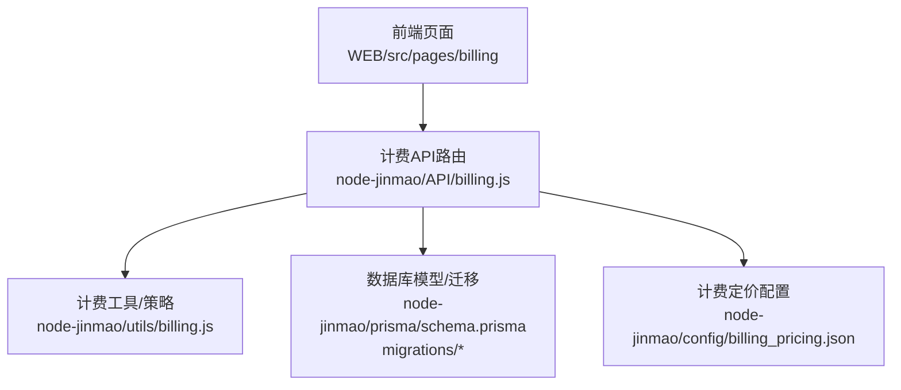
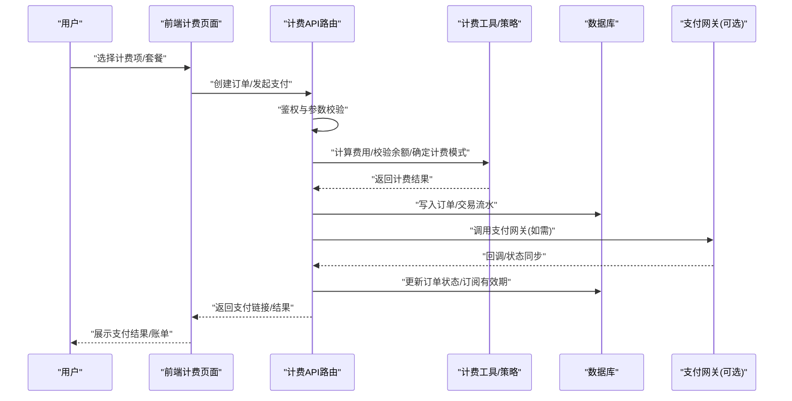
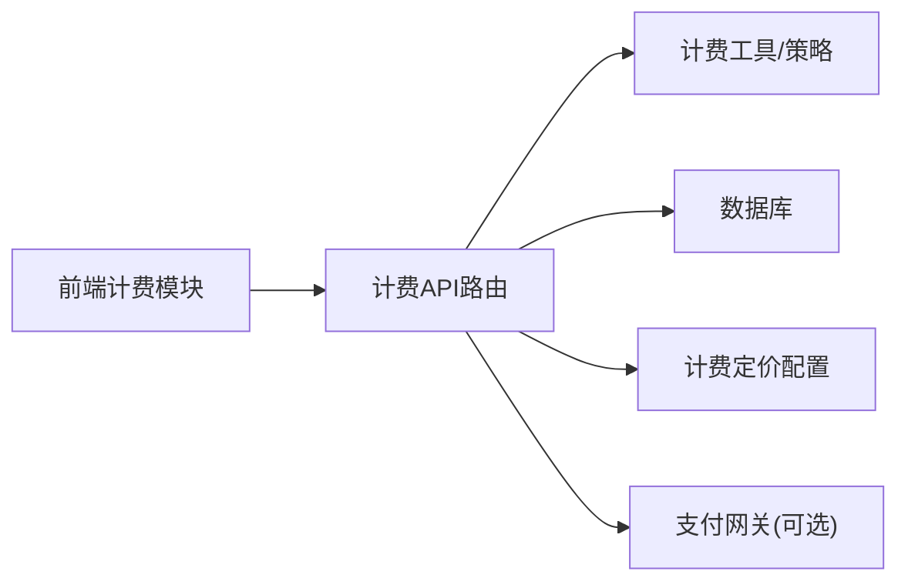

# 计费支付系统

<cite>
**本文引用的文件**   
- [API/billing.js](file://node-jinmao/API/billing.js)
- [config/billing_pricing.json](file://node-jinmao/config/billing_pricing.json)
- [utils/billing.js](file://node-jinmao/utils/billing.js)
- [prisma/schema.prisma](file://node-jinmao/prisma/schema.prisma)
- [prisma/migrations/20260729_add_user_billing_fields/migration.sql](file://node-jinmao/prisma/migrations/20260729_add_user_billing_fields/migration.sql)
- [WEB/src/api/billing.js](file://WEB/src/api/billing.js)
- [WEB/src/pages/billing/index.vue](file://WEB/src/pages/billing/index.vue)
- [WEB/src/pages/billing/script.js](file://WEB/src/pages/billing/script.js)
</cite>

## 目录
1. [简介](#简介)
2. [项目结构](#项目结构)
3. [核心组件](#核心组件)
4. [架构总览](#架构总览)
5. [详细组件分析](#详细组件分析)
6. [依赖关系分析](#依赖关系分析)
7. [性能考虑](#性能考虑)
8. [故障排查指南](#故障排查指南)
9. [结论](#结论)
10. [附录](#附录)

## 简介
本文件面向“计费与支付”子系统，系统性梳理计费规则配置、用户余额管理、支付流程实现、计费模式（按次计费、包月订阅等）、账单生成与查询、支付状态同步机制、与用户系统集成与安全验证、以及财务审计与报表能力。文档以仓库现有代码为依据，提供可操作的扩展指引（新增支付方式、自定义计费规则）和最佳实践建议。

## 项目结构
计费相关的前后端关键位置如下：
- 后端 API 路由层：node-jinmao/API/billing.js
- 计费工具与策略：node-jinmao/utils/billing.js
- 计费定价配置：node-jinmao/config/billing_pricing.json
- 数据库模型与迁移：node-jinmao/prisma/schema.prisma、node-jinmao/prisma/migrations/...
- 前端计费页面与接口调用：WEB/src/pages/billing/*、WEB/src/api/billing.js

**图示来源** 
- [API/billing.js](file://node-jinmao/API/billing.js)
- [utils/billing.js](file://node-jinmao/utils/billing.js)
- [config/billing_pricing.json](file://node-jinmao/config/billing_pricing.json)
- [prisma/schema.prisma](file://node-jinmao/prisma/schema.prisma)
- [prisma/migrations/20260729_add_user_billing_fields/migration.sql](file://node-jinmao/prisma/migrations/20260729_add_user_billing_fields/migration.sql)

**章节来源**
- [API/billing.js](file://node-jinmao/API/billing.js)
- [utils/billing.js](file://node-jinmao/utils/billing.js)
- [config/billing_pricing.json](file://node-jinmao/config/billing_pricing.json)
- [prisma/schema.prisma](file://node-jinmao/prisma/schema.prisma)
- [prisma/migrations/20260729_add_user_billing_fields/migration.sql](file://node-jinmao/prisma/migrations/20260729_add_user_billing_fields/migration.sql)

## 核心组件
- 计费API路由：对外暴露计费相关的HTTP接口，负责鉴权、参数校验、调用计费工具、持久化记录与返回结果。
- 计费工具/策略：封装计费计算、扣费逻辑、余额检查、计费模式判定（按次/包月等），并提供可扩展的计费策略接口。
- 计费定价配置：集中维护不同计费模式的单价、折扣、套餐周期、限额等规则。
- 数据模型与迁移：定义用户计费字段、交易流水、订阅状态等表结构，确保数据一致性与可追溯性。
- 前端计费模块：展示计费信息、发起支付、查询账单、订阅管理等交互。

**章节来源**
- [API/billing.js](file://node-jinmao/API/billing.js)
- [utils/billing.js](file://node-jinmao/utils/billing.js)
- [config/billing_pricing.json](file://node-jinmao/config/billing_pricing.json)
- [prisma/schema.prisma](file://node-jinmao/prisma/schema.prisma)
- [prisma/migrations/20260729_add_user_billing_fields/migration.sql](file://node-jinmao/prisma/migrations/20260729_add_user_billing_fields/migration.sql)
- [WEB/src/api/billing.js](file://WEB/src/api/billing.js)
- [WEB/src/pages/billing/index.vue](file://WEB/src/pages/billing/index.vue)
- [WEB/src/pages/billing/script.js](file://WEB/src/pages/billing/script.js)

## 架构总览
计费支付系统的整体交互如下：前端通过计费API发起请求，后端进行鉴权与参数校验后，调用计费工具执行计费策略；根据策略决定扣费或开通订阅，并写入数据库的交易与订阅记录；必要时与第三方支付网关交互完成支付状态同步。

**图示来源** 
- [API/billing.js](file://node-jinmao/API/billing.js)
- [utils/billing.js](file://node-jinmao/utils/billing.js)
- [prisma/schema.prisma](file://node-jinmao/prisma/schema.prisma)

## 详细组件分析

### 计费API路由（node-jinmao/API/billing.js）
- 职责：统一入口，处理计费相关HTTP请求；鉴权、参数校验、调用计费工具；事务性写入订单与流水；与支付网关对接（如集成）。
- 典型流程：
  - 接收前端请求（创建订单、支付、查询账单、订阅管理等）
  - 校验用户身份与权限
  - 解析计费参数（计费模式、数量、套餐ID等）
  - 调用计费工具计算费用与策略
  - 落库保存订单与流水
  - 如有需要，调用支付网关并处理回调
  - 返回响应给前端

**章节来源**
- [API/billing.js](file://node-jinmao/API/billing.js)

### 计费工具与策略（node-jinmao/utils/billing.js）
- 职责：实现计费核心算法与策略；支持多种计费模式（按次计费、包月订阅等）；余额检查与扣减；价格计算与折扣；扩展点用于新增计费规则。
- 关键点：
  - 计费模式识别与路由（按次/包月/按量阶梯等）
  - 余额校验与原子扣减（保证一致性）
  - 价格计算（基础价×数量+折扣+税费）
  - 订阅生命周期管理（开通、续费、到期、降级）
  - 扩展点：注册新计费策略、接入新的定价配置项

**章节来源**
- [utils/billing.js](file://node-jinmao/utils/billing.js)

### 计费定价配置（node-jinmao/config/billing_pricing.json）
- 职责：集中管理计费规则与价格策略，便于热更新与多环境配置。
- 常见字段：
  - 计费模式标识（按次、包月、按量）
  - 单价、折扣、封顶价、税费率
  - 套餐周期、次数限制、并发限制
  - 适用资源范围（课程、题库、导出等）
- 使用方式：计费工具在运行时读取配置，动态计算费用与限制。

**章节来源**
- [config/billing_pricing.json](file://node-jinmao/config/billing_pricing.json)

### 数据模型与迁移（node-jinmao/prisma/schema.prisma 与 migrations）
- 职责：定义用户计费字段、交易流水、订阅状态等实体，保障数据完整性与审计追踪。
- 关键字段（示例说明）：
  - 用户计费字段：余额、累计消费、订阅状态、到期时间
  - 交易流水：订单号、金额、类型（充值/扣费/退款）、状态、关联资源
  - 订阅记录：套餐ID、开始时间、结束时间、自动续费标志
- 迁移：通过Prisma迁移脚本演进数据结构，确保版本兼容与回滚能力。

**章节来源**
- [prisma/schema.prisma](file://node-jinmao/prisma/schema.prisma)
- [prisma/migrations/20260729_add_user_billing_fields/migration.sql](file://node-jinmao/prisma/migrations/20260729_add_user_billing_fields/migration.sql)

### 前端计费模块（WEB/src/pages/billing/* 与 WEB/src/api/billing.js）
- 职责：计费页面展示、订单创建、支付跳转、账单查询、订阅管理。
- 要点：
  - 调用后端计费API获取价格与创建订单
  - 展示计费明细（单价、数量、折扣、税费）
  - 处理支付结果与错误提示
  - 查询历史账单与订阅状态

**章节来源**
- [WEB/src/api/billing.js](file://WEB/src/api/billing.js)
- [WEB/src/pages/billing/index.vue](file://WEB/src/pages/billing/index.vue)
- [WEB/src/pages/billing/script.js](file://WEB/src/pages/billing/script.js)

## 依赖关系分析
- 前端依赖后端计费API，后端依赖计费工具与配置，同时读写数据库。
- 计费工具对配置与数据库有强依赖，需保证配置有效性与数据一致性。
- 支付网关为可选外部依赖，通过回调机制同步支付状态。

**图示来源** 
- [API/billing.js](file://node-jinmao/API/billing.js)
- [utils/billing.js](file://node-jinmao/utils/billing.js)
- [config/billing_pricing.json](file://node-jinmao/config/billing_pricing.json)
- [prisma/schema.prisma](file://node-jinmao/prisma/schema.prisma)

**章节来源**
- [API/billing.js](file://node-jinmao/API/billing.js)
- [utils/billing.js](file://node-jinmao/utils/billing.js)
- [config/billing_pricing.json](file://node-jinmao/config/billing_pricing.json)
- [prisma/schema.prisma](file://node-jinmao/prisma/schema.prisma)

## 性能考虑
- 计费计算应无状态且幂等，避免重复计费与锁竞争。
- 余额扣减采用事务与行级锁，防止超扣。
- 配置读取可缓存（短TTL），减少I/O开销。
- 批量账单生成与报表导出采用异步任务与分页查询。
- 支付回调处理需去重与重试机制，保证最终一致性。

[本节为通用指导，不直接分析具体文件]

## 故障排查指南
- 常见问题定位：
  - 计费结果为空或不正确：检查计费配置是否生效、计费工具策略是否正确、参数校验是否通过。
  - 余额不足导致失败：确认用户余额、扣费顺序、并发场景下的锁与事务。
  - 支付状态不同步：核对回调签名、订单号映射、幂等处理与重试队列。
  - 账单缺失或重复：检查流水写入事务、幂等键、补偿任务。
- 调试建议：
  - 开启计费操作日志（入参、出参、中间状态）
  - 对关键路径增加断言与监控指标（成功率、耗时、失败原因分布）
  - 使用测试用例覆盖边界条件（负数、零值、极大值、并发）

**章节来源**
- [API/billing.js](file://node-jinmao/API/billing.js)
- [utils/billing.js](file://node-jinmao/utils/billing.js)

## 结论
本计费支付系统以清晰的层次划分与可扩展的计费策略为核心，结合集中式定价配置与完善的数据库模型，支撑按次计费与包月订阅等多种模式。通过严格的鉴权、事务与幂等设计，确保资金安全与数据一致性。未来可在计费工具中继续扩展更多计费模式与支付渠道，并通过报表与审计功能提升运营与合规能力。

[本节为总结性内容，不直接分析具体文件]

## 附录

### 计费规则配置说明（billing_pricing.json）
- 计费模式：按次计费、包月订阅、按量阶梯等
- 价格要素：基础单价、折扣、税费、封顶价
- 限制与配额：次数上限、并发限制、资源范围
- 订阅周期：月度/年度、自动续费、到期提醒

**章节来源**
- [config/billing_pricing.json](file://node-jinmao/config/billing_pricing.json)

### 用户余额管理机制
- 余额字段：用户账户余额、累计消费、冻结金额
- 扣费流程：余额校验→原子扣减→写入流水→更新统计
- 并发控制：事务与行级锁，避免超扣与重复扣费
- 对账与审计：流水不可篡改，支持回溯与复核

**章节来源**
- [prisma/schema.prisma](file://node-jinmao/prisma/schema.prisma)
- [prisma/migrations/20260729_add_user_billing_fields/migration.sql](file://node-jinmao/prisma/migrations/20260729_add_user_billing_fields/migration.sql)
- [utils/billing.js](file://node-jinmao/utils/billing.js)

### 支付流程实现原理
- 订单创建：前端提交计费项→后端校验→生成订单号→写入流水
- 支付发起：根据计费模式选择支付渠道→生成支付链接/二维码
- 状态同步：支付网关回调→签名校验→幂等处理→更新订单与订阅
- 异常处理：超时、失败、部分成功→补偿与重试

**章节来源**
- [API/billing.js](file://node-jinmao/API/billing.js)
- [utils/billing.js](file://node-jinmao/utils/billing.js)

### 计费模式设置（按次计费、包月订阅）
- 按次计费：每次调用或服务使用扣除相应次数或费用
- 包月订阅：按月周期授予访问权限，到期自动续费或暂停
- 切换与升级：支持套餐变更、差价结算、按比例折算

**章节来源**
- [config/billing_pricing.json](file://node-jinmao/config/billing_pricing.json)
- [utils/billing.js](file://node-jinmao/utils/billing.js)

### 计费相关API接口（概览）
- 创建订单：POST /api/billing/order
- 发起支付：POST /api/billing/pay
- 查询账单：GET /api/billing/statements
- 订阅管理：POST /api/billing/subscribe
- 支付回调：POST /api/billing/callback

**章节来源**
- [API/billing.js](file://node-jinmao/API/billing.js)
- [WEB/src/api/billing.js](file://WEB/src/api/billing.js)

### 支付状态同步机制
- 回调验签：确保请求来自支付网关
- 幂等处理：基于订单号去重，避免重复入账
- 重试队列：失败回调进入队列，定时重试
- 最终一致性：对账任务定期核对差异并修复

**章节来源**
- [API/billing.js](file://node-jinmao/API/billing.js)
- [utils/billing.js](file://node-jinmao/utils/billing.js)

### 账单生成与查询功能
- 账单维度：按用户、按资源、按周期汇总
- 查询条件：时间范围、类型、状态、关键词
- 导出格式：CSV/Excel，支持分页与异步导出

**章节来源**
- [API/billing.js](file://node-jinmao/API/billing.js)
- [WEB/src/pages/billing/index.vue](file://WEB/src/pages/billing/index.vue)

### 扩展新的支付方式
- 步骤：
  - 在计费工具中新增支付渠道适配器（签名、下单、回调）
  - 在配置文件中添加渠道开关与密钥
  - 在API路由中路由到对应渠道
  - 前端适配支付结果展示
- 注意事项：
  - 保持幂等与事务一致性
  - 完善错误码与日志
  - 单元测试与集成测试覆盖

**章节来源**
- [utils/billing.js](file://node-jinmao/utils/billing.js)
- [config/billing_pricing.json](file://node-jinmao/config/billing_pricing.json)
- [API/billing.js](file://node-jinmao/API/billing.js)

### 自定义计费规则
- 步骤：
  - 在计费工具中注册新策略（按量阶梯、组合计费、促销折扣）
  - 在配置文件中定义规则参数
  - 在API路由中支持新规则入参
  - 前端展示计费明细与规则说明
- 注意事项：
  - 规则优先级与冲突解决
  - 价格计算精度与舍入策略
  - 审计与可追溯性

**章节来源**
- [utils/billing.js](file://node-jinmao/utils/billing.js)
- [config/billing_pricing.json](file://node-jinmao/config/billing_pricing.json)
- [API/billing.js](file://node-jinmao/API/billing.js)

### 与用户系统集成与安全验证
- 鉴权：JWT或会话校验，确保请求来自合法用户
- 授权：基于角色或资源权限控制计费操作
- 安全：敏感参数加密传输、防重放、限流与风控
- 审计：操作日志与资金流水不可篡改

**章节来源**
- [API/billing.js](file://node-jinmao/API/billing.js)
- [utils/billing.js](file://node-jinmao/utils/billing.js)

### 财务数据的审计与报表生成
- 审计：全量流水记录，支持溯源与复核
- 报表：收入、支出、订阅续费率、ARPU等指标
- 导出：定时任务生成报表，支持邮件推送与下载
- 合规：数据脱敏、访问控制、留存策略

**章节来源**
- [API/billing.js](file://node-jinmao/API/billing.js)
- [prisma/schema.prisma](file://node-jinmao/prisma/schema.prisma)