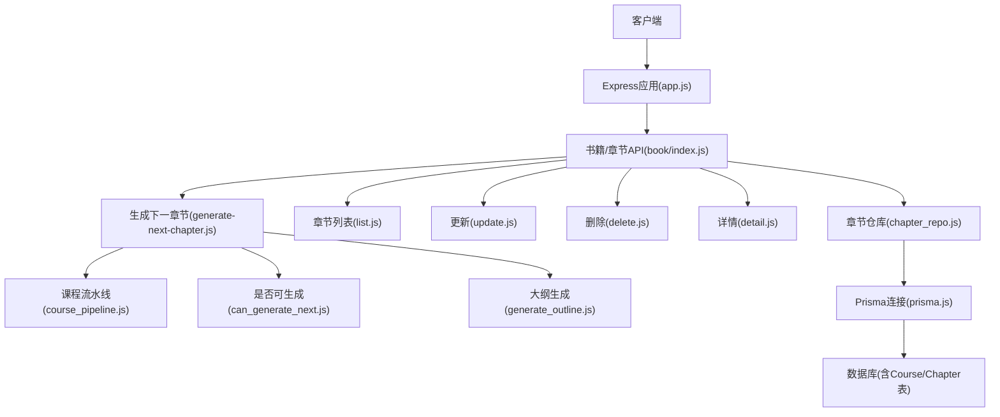
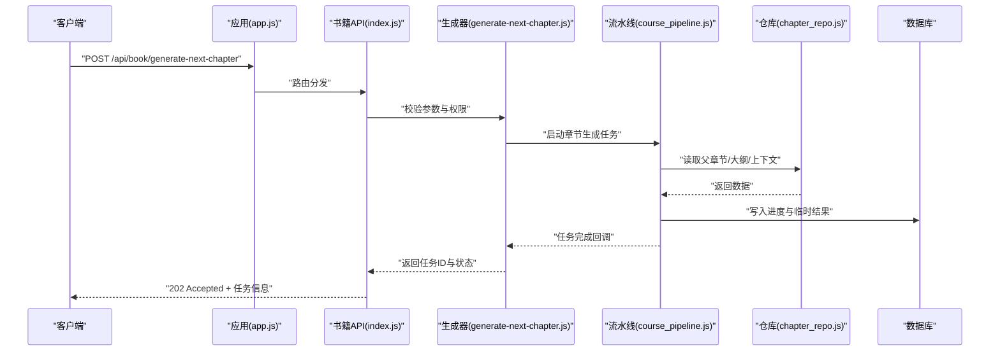
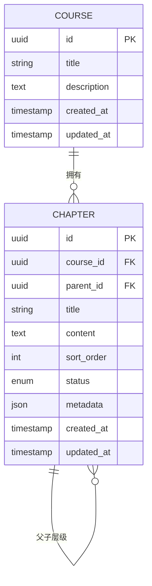
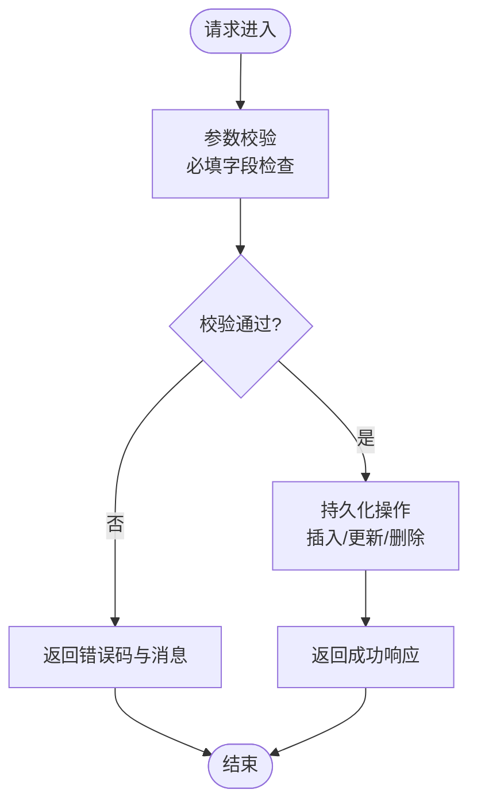
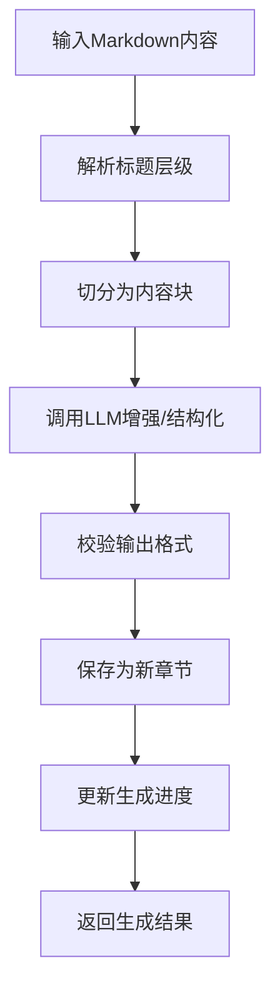
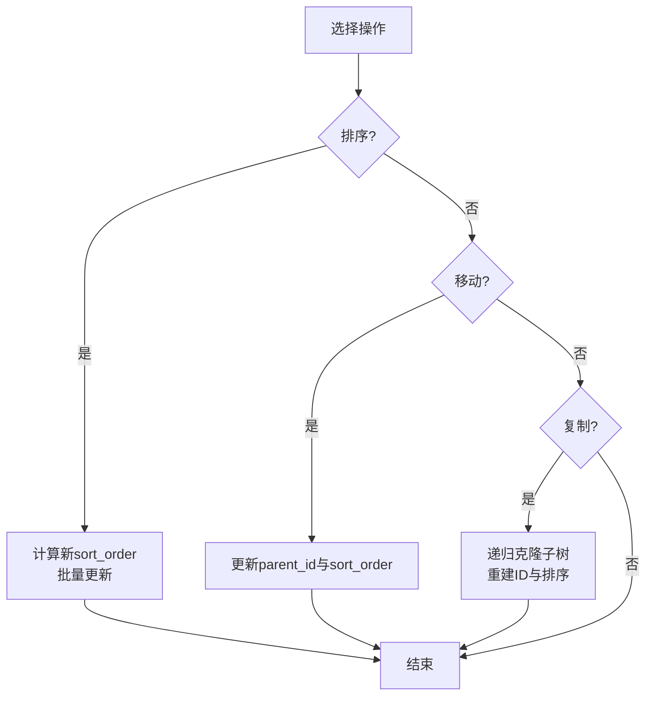
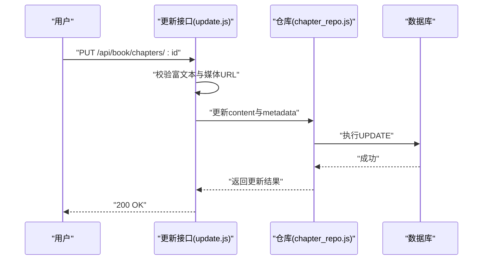
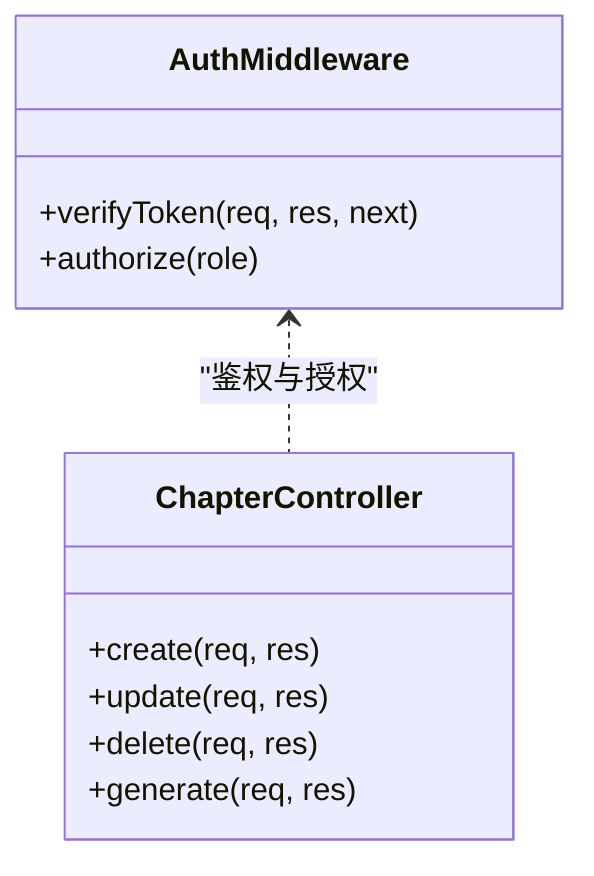
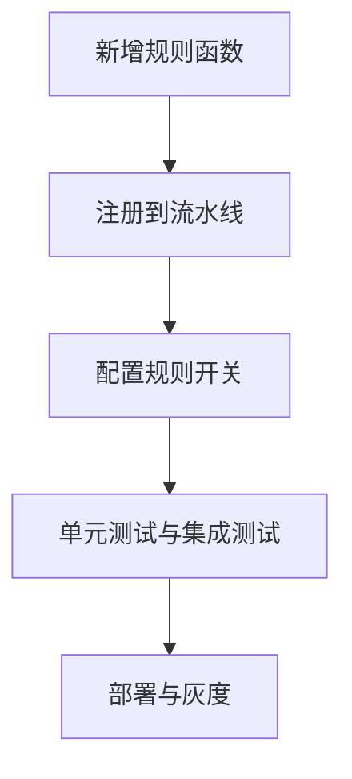
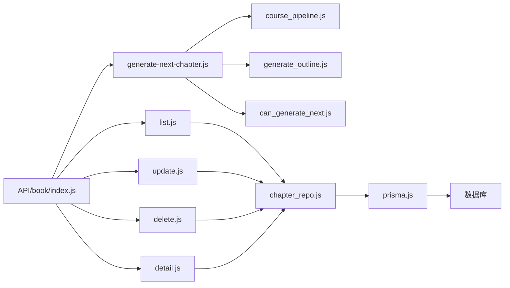

# 章节管理

<cite>
**本文引用的文件**   
- [app.js](file://node-jinmao/app.js)
- [API/book/index.js](file://node-jinmao/API/book/index.js)
- [API/book/generate-next-chapter.js](file://node-jinmao/API/book/generate-next-chapter.js)
- [API/book/list.js](file://node-jinmao/API/book/list.js)
- [API/book/update.js](file://node-jinmao/API/book/update.js)
- [API/book/delete.js](file://node-jinmao/API/book/delete.js)
- [API/book/detail.js](file://node-jinmao/API/book/detail.js)
- [utils/chapter_repo.js](file://node-jinmao/utils/repo/chapter_repo.js)
- [utils/prisma.js](file://node-jinmao/utils/prisma.js)
- [prisma/schema.prisma](file://node-jinmao/prisma/schema.prisma)
- [prisma/migrations/20260709105504_add_course_and_chapter/migration.sql](file://node-jinmao/prisma/migrations/20260709105504_add_course_and_chapter/migration.sql)
- [prisma/migrations/20260725_add_chapter_generation_progress/migration.sql](file://node-jinmao/prisma/migrations/20260725_add_chapter_generation_progress/migration.sql)
- [service/course_pipeline.js](file://node-jinmao/service/course_pipeline.js)
- [utils/can_generate_next.js](file://node-jinmao/utils/can_generate_next.js)
- [utils/generate_outline.js](file://node-jinmao/utils/generate_outline.js)
- [middleware/auth.js](file://node-jinmao/middleware/auth.js)
</cite>

## 目录
1. [简介](#简介)
2. [项目结构](#项目结构)
3. [核心组件](#核心组件)
4. [架构总览](#架构总览)
5. [详细组件分析](#详细组件分析)
6. [依赖关系分析](#依赖关系分析)
7. [性能考量](#性能考量)
8. [故障排查指南](#故障排查指南)
9. [结论](#结论)
10. [附录](#附录)

## 简介
本章节管理系统围绕“课程-章节”层级模型，提供完整的章节CRUD接口、基于Markdown的智能章节生成、章节排序与移动、复制、权限控制以及内容编辑能力。系统采用Node.js后端，Prisma作为ORM，数据库使用支持事务的关系型数据库，结合异步任务与流式处理，保障大规模章节生成的稳定性与可观测性。

## 项目结构
- API层：按业务域划分（book、course、quiz等），每个模块包含路由入口与具体处理器。
- 服务层：编排复杂流程（如课程流水线、章节生成）。
- 数据访问层：通过Prisma封装的仓库模块（chapter_repo）实现持久化操作。
- 工具层：通用能力（LLM客户端、大纲生成、权限校验、上传等）。
- 配置与迁移：Prisma schema与数据库迁移脚本。

**图表来源** 
- [app.js](file://node-jinmao/app.js)
- [API/book/index.js](file://node-jinmao/API/book/index.js)
- [API/book/generate-next-chapter.js](file://node-jinmao/API/book/generate-next-chapter.js)
- [API/book/list.js](file://node-jinmao/API/book/list.js)
- [API/book/update.js](file://node-jinmao/API/book/update.js)
- [API/book/delete.js](file://node-jinmao/API/book/delete.js)
- [API/book/detail.js](file://node-jinmao/API/book/detail.js)
- [service/course_pipeline.js](file://node-jinmao/service/course_pipeline.js)
- [utils/can_generate_next.js](file://node-jinmao/utils/can_generate_next.js)
- [utils/generate_outline.js](file://node-jinmao/utils/generate_outline.js)
- [utils/chapter_repo.js](file://node-jinmao/utils/repo/chapter_repo.js)
- [utils/prisma.js](file://node-jinmao/utils/prisma.js)

**章节来源**
- [app.js](file://node-jinmao/app.js)
- [API/book/index.js](file://node-jinmao/API/book/index.js)

## 核心组件
- 章节数据模型：Course与Chapter，具备父子层级、排序字段、状态与进度字段，支持富文本内容与多媒体引用。
- 章节仓库：封装增删改查、层级维护、排序调整、复制与批量操作。
- 章节生成：基于Markdown内容的大纲解析与智能切分，结合LLM进行内容增强与结构化输出。
- 权限控制：基于中间件的鉴权与角色授权，限制不同角色的章节读写与生成能力。

**章节来源**
- [prisma/schema.prisma](file://node-jinmao/prisma/schema.prisma)
- [utils/chapter_repo.js](file://node-jinmao/utils/repo/chapter_repo.js)
- [API/book/generate-next-chapter.js](file://node-jinmao/API/book/generate-next-chapter.js)
- [middleware/auth.js](file://node-jinmao/middleware/auth.js)

## 架构总览
系统以REST API暴露章节管理能力，调用链从路由到控制器再到服务与仓库，最终落库。章节生成链路引入异步任务与进度追踪，确保长耗时操作的可靠性。

**图表来源** 
- [app.js](file://node-jinmao/app.js)
- [API/book/index.js](file://node-jinmao/API/book/index.js)
- [API/book/generate-next-chapter.js](file://node-jinmao/API/book/generate-next-chapter.js)
- [service/course_pipeline.js](file://node-jinmao/service/course_pipeline.js)
- [utils/chapter_repo.js](file://node-jinmao/utils/repo/chapter_repo.js)

## 详细组件分析

### 数据模型与层级结构
- Course与Chapter存在一对多关系，Chapter支持parent_id指向父章节，形成树形结构。
- 关键字段包括：标题、内容（富文本）、排序权重、状态、创建/更新时间、生成进度等。
- 迁移脚本定义了表结构与约束，确保父子关系与完整性。

**图表来源** 
- [prisma/schema.prisma](file://node-jinmao/prisma/schema.prisma)
- [prisma/migrations/20260709105504_add_course_and_chapter/migration.sql](file://node-jinmao/prisma/migrations/20260709105504_add_course_and_chapter/migration.sql)

**章节来源**
- [prisma/schema.prisma](file://node-jinmao/prisma/schema.prisma)
- [prisma/migrations/20260709105504_add_course_and_chapter/migration.sql](file://node-jinmao/prisma/migrations/20260709105504_add_course_and_chapter/migration.sql)

### 章节CRUD接口
- 创建章节：接收course_id、parent_id、title、content等，校验后入库并返回新章节。
- 读取章节：支持按course_id、parent_id过滤，分页与排序。
- 更新章节：支持标题、内容、排序、状态等字段的增量更新。
- 删除章节：级联或软删除策略，需校验子章节与引用。

**图表来源** 
- [API/book/index.js](file://node-jinmao/API/book/index.js)
- [API/book/list.js](file://node-jinmao/API/book/list.js)
- [API/book/update.js](file://node-jinmao/API/book/update.js)
- [API/book/delete.js](file://node-jinmao/API/book/delete.js)
- [API/book/detail.js](file://node-jinmao/API/book/detail.js)

**章节来源**
- [API/book/index.js](file://node-jinmao/API/book/index.js)
- [API/book/list.js](file://node-jinmao/API/book/list.js)
- [API/book/update.js](file://node-jinmao/API/book/update.js)
- [API/book/delete.js](file://node-jinmao/API/book/delete.js)
- [API/book/detail.js](file://node-jinmao/API/book/detail.js)

### 智能章节生成算法
- 输入：父章节内容、课程大纲、Markdown片段、生成规则提示词。
- 处理：解析Markdown标题层级，切分内容块，调用LLM进行结构化增强，产出章节JSON。
- 输出：新建子章节，设置排序与状态，记录生成进度。

**图表来源** 
- [API/book/generate-next-chapter.js](file://node-jinmao/API/book/generate-next-chapter.js)
- [service/course_pipeline.js](file://node-jinmao/service/course_pipeline.js)
- [utils/generate_outline.js](file://node-jinmao/utils/generate_outline.js)
- [utils/can_generate_next.js](file://node-jinmao/utils/can_generate_next.js)

**章节来源**
- [API/book/generate-next-chapter.js](file://node-jinmao/API/book/generate-next-chapter.js)
- [service/course_pipeline.js](file://node-jinmao/service/course_pipeline.js)
- [utils/generate_outline.js](file://node-jinmao/utils/generate_outline.js)
- [utils/can_generate_next.js](file://node-jinmao/utils/can_generate_next.js)

### 章节排序、移动与复制
- 排序：通过sort_order字段调整顺序，支持批量重排。
- 移动：修改parent_id与sort_order，保持树形结构一致性。
- 复制：克隆章节及其子树，重新分配ID与排序，避免冲突。

**图表来源** 
- [utils/chapter_repo.js](file://node-jinmao/utils/repo/chapter_repo.js)

**章节来源**
- [utils/chapter_repo.js](file://node-jinmao/utils/repo/chapter_repo.js)

### 章节内容编辑（富文本与多媒体）
- 内容字段支持富文本HTML与媒体引用（图片、视频等）。
- 更新接口支持部分字段更新，保留历史版本（可选）。
- 建议对富文本内容进行安全过滤与尺寸校验。

**图表来源** 
- [API/book/update.js](file://node-jinmao/API/book/update.js)
- [utils/chapter_repo.js](file://node-jinmao/utils/repo/chapter_repo.js)

**章节来源**
- [API/book/update.js](file://node-jinmao/API/book/update.js)
- [utils/chapter_repo.js](file://node-jinmao/utils/repo/chapter_repo.js)

### 权限控制
- 中间件auth.js负责JWT校验与角色提取。
- 不同角色（管理员、教师、学生）对章节的读/写/生成权限进行细粒度控制。
- 建议在API层增加资源归属校验（course_id与用户关联）。

**图表来源** 
- [middleware/auth.js](file://node-jinmao/middleware/auth.js)
- [API/book/index.js](file://node-jinmao/API/book/index.js)

**章节来源**
- [middleware/auth.js](file://node-jinmao/middleware/auth.js)
- [API/book/index.js](file://node-jinmao/API/book/index.js)

### 扩展新的章节生成规则
- 在generate-outline或pipeline中新增规则处理器，定义输入输出契约。
- 通过配置项切换规则，支持A/B测试与灰度发布。
- 示例步骤：
  - 新增规则函数，接收Markdown片段与上下文。
  - 在流水线中注册该规则，按优先级执行。
  - 在API层暴露规则选择参数。

**图表来源** 
- [service/course_pipeline.js](file://node-jinmao/service/course_pipeline.js)
- [utils/generate_outline.js](file://node-jinmao/utils/generate_outline.js)

**章节来源**
- [service/course_pipeline.js](file://node-jinmao/service/course_pipeline.js)
- [utils/generate_outline.js](file://node-jinmao/utils/generate_outline.js)

## 依赖关系分析
- API层依赖仓库层与工具层，仓库层依赖Prisma与数据库。
- 章节生成依赖流水线、大纲生成与LLM客户端。
- 权限中间件贯穿所有受保护接口。

**图表来源** 
- [API/book/index.js](file://node-jinmao/API/book/index.js)
- [API/book/generate-next-chapter.js](file://node-jinmao/API/book/generate-next-chapter.js)
- [API/book/list.js](file://node-jinmao/API/book/list.js)
- [API/book/update.js](file://node-jinmao/API/book/update.js)
- [API/book/delete.js](file://node-jinmao/API/book/delete.js)
- [API/book/detail.js](file://node-jinmao/API/book/detail.js)
- [service/course_pipeline.js](file://node-jinmao/service/course_pipeline.js)
- [utils/generate_outline.js](file://node-jinmao/utils/generate_outline.js)
- [utils/can_generate_next.js](file://node-jinmao/utils/can_generate_next.js)
- [utils/chapter_repo.js](file://node-jinmao/utils/repo/chapter_repo.js)
- [utils/prisma.js](file://node-jinmao/utils/prisma.js)

**章节来源**
- [API/book/index.js](file://node-jinmao/API/book/index.js)
- [utils/chapter_repo.js](file://node-jinmao/utils/repo/chapter_repo.js)
- [utils/prisma.js](file://node-jinmao/utils/prisma.js)

## 性能考量
- 章节生成采用异步任务与进度追踪，避免阻塞主线程。
- 批量排序与移动建议使用事务，保证一致性。
- 富文本内容存储建议压缩与CDN缓存，减少带宽消耗。
- 查询接口增加索引（course_id、parent_id、sort_order）提升检索效率。

[本节为通用指导，无需特定文件来源]

## 故障排查指南
- 生成失败：检查LLM客户端配置、网络连通性与提示词有效性。
- 权限错误：确认JWT有效性与角色授权逻辑。
- 数据不一致：核查事务回滚与并发更新锁机制。
- 进度卡住：查看任务队列与重试策略。

**章节来源**
- [API/book/generate-next-chapter.js](file://node-jinmao/API/book/generate-next-chapter.js)
- [middleware/auth.js](file://node-jinmao/middleware/auth.js)
- [utils/chapter_repo.js](file://node-jinmao/utils/repo/chapter_repo.js)

## 结论
本章节管理系统提供了完善的CRUD、层级维护、智能生成、排序移动复制、富文本编辑与权限控制能力。通过模块化设计与清晰的依赖关系，系统具备良好的可扩展性与可维护性。建议在生产环境加强监控与日志采集，持续优化生成质量与性能。

[本节为总结性内容，无需特定文件来源]

## 附录
- 数据库迁移：参考migration.sql了解表结构与变更历史。
- 配置项：查看config目录下的提示词与外部服务配置。
- 前端对接：参考WEB/src/api目录中的接口调用示例。

**章节来源**
- [prisma/migrations/20260725_add_chapter_generation_progress/migration.sql](file://node-jinmao/prisma/migrations/20260725_add_chapter_generation_progress/migration.sql)
- [node-jinmao/config/prompt.json](file://node-jinmao/config/prompt.json)
- [WEB/src/api/books.js](file://WEB/src/api/books.js)