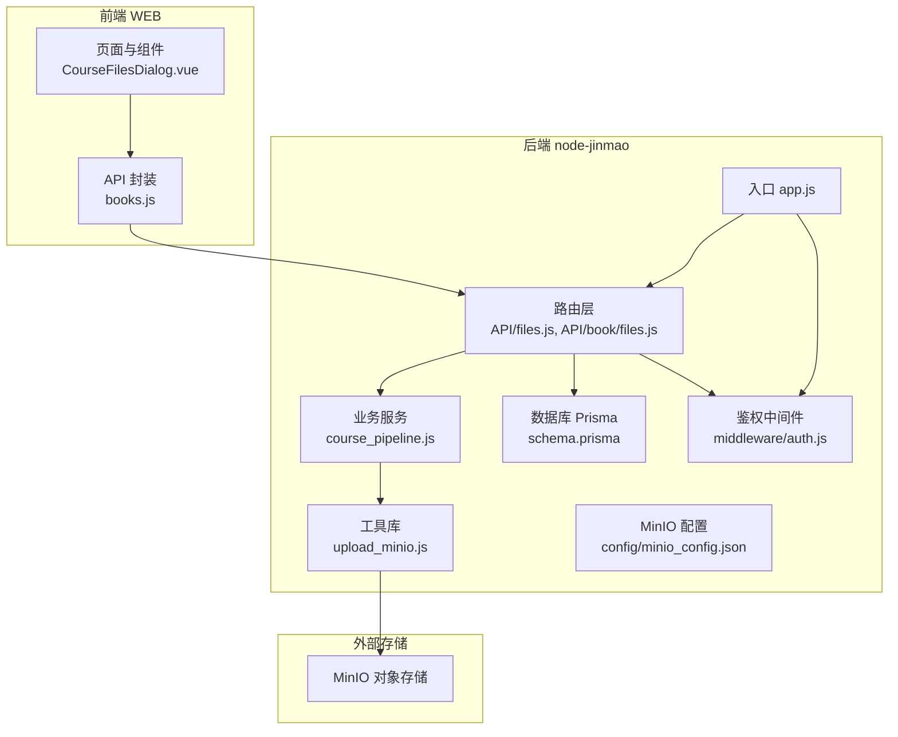
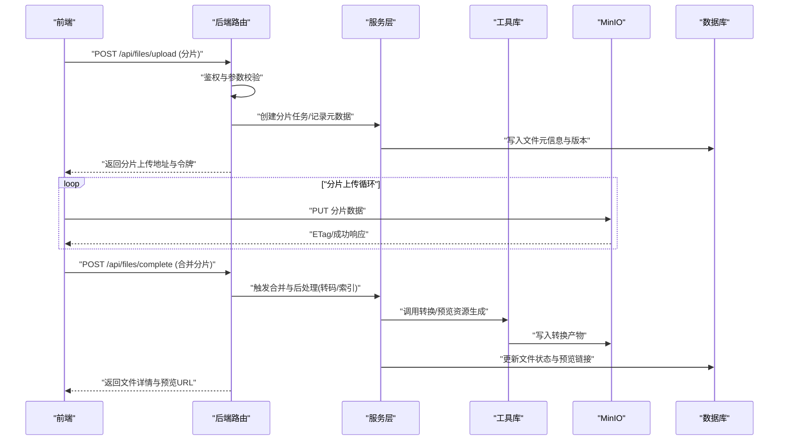
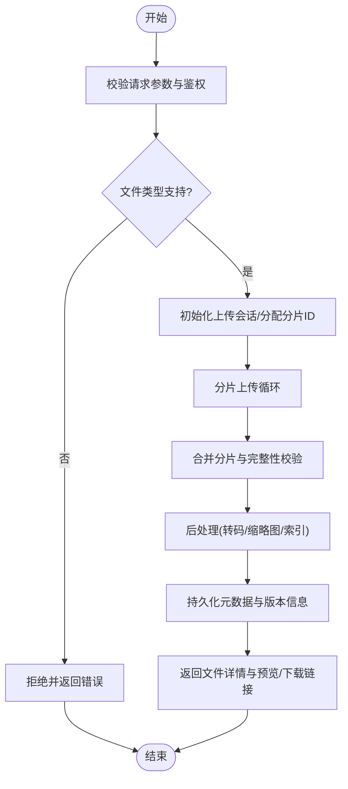
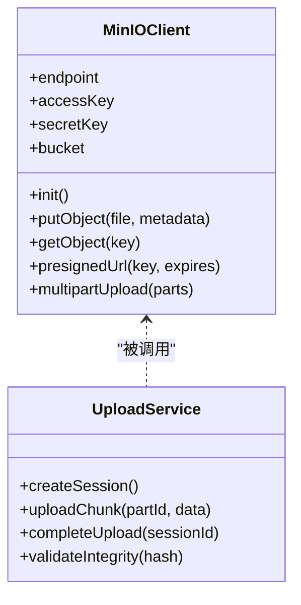
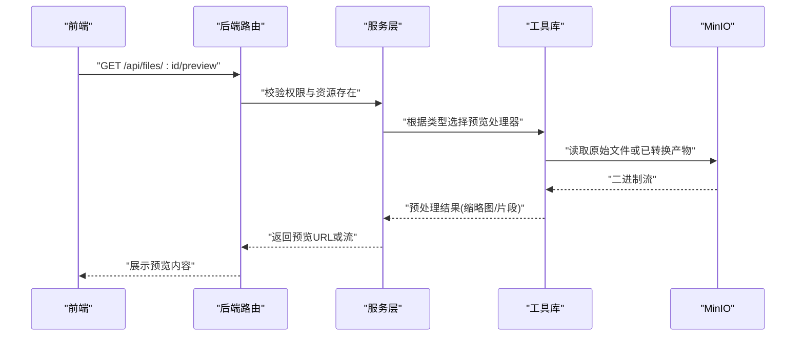
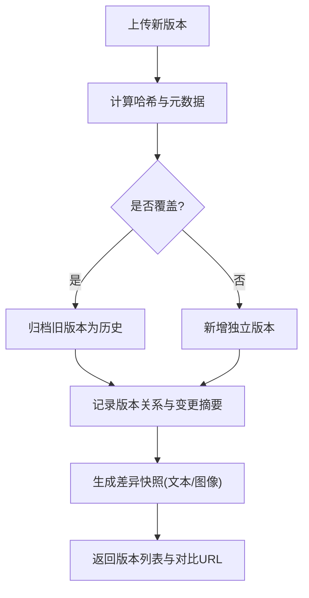
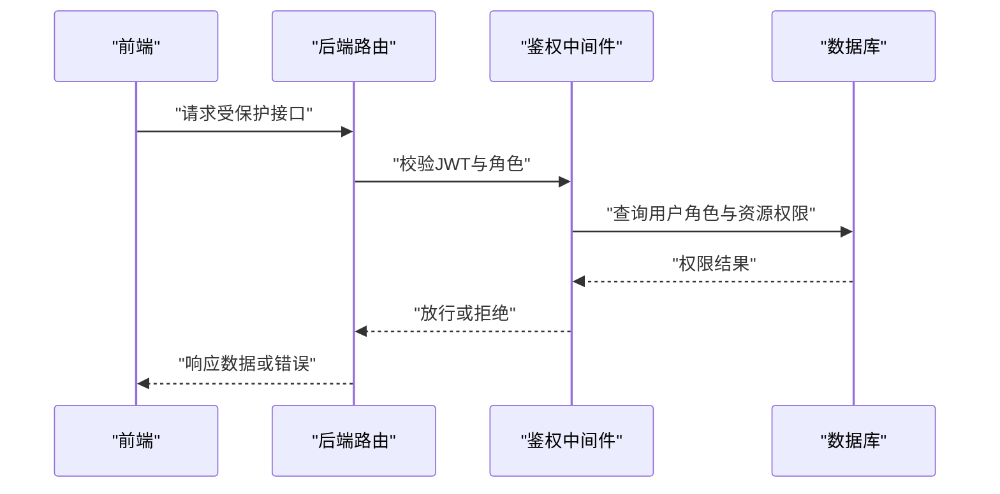
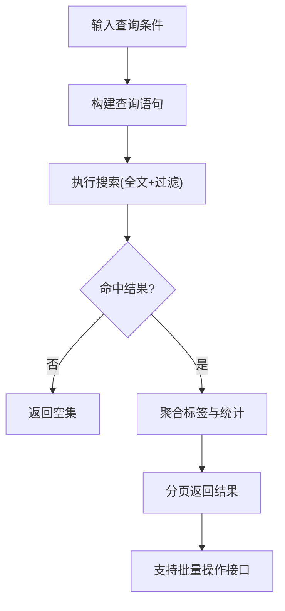
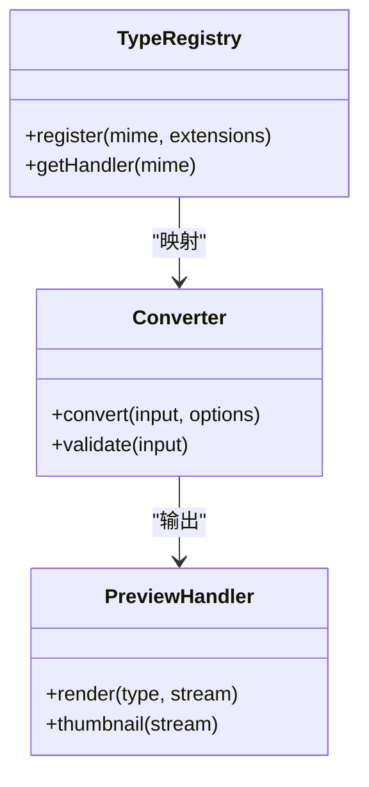
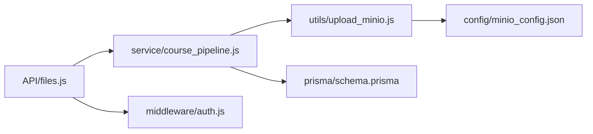

# 课件文件管理

<cite>
**本文引用的文件**   
- [app.js](file://node-jinmao/app.js)
- [API/files.js](file://node-jinmao/API/files.js)
- [utils/upload_minio.js](file://node-jinmao/utils/upload_minio.js)
- [config/minio_config.json](file://node-jinmao/config/minio_config.json)
- [API/book/files.js](file://node-jinmao/API/book/files.js)
- [service/course_pipeline.js](file://node-jinmao/service/course_pipeline.js)
- [prisma/schema.prisma](file://node-jinmao/prisma/schema.prisma)
- [middleware/auth.js](file://node-jinmao/middleware/auth.js)
- [前端 API: books.js](file://WEB/src/api/books.js)
- [前端组件: CourseFilesDialog.vue](file://WEB/src/components/CourseFilesDialog.vue)
- [测试脚本: minio-crud.js](file://test/code/minio-crud.js)
</cite>

## 目录
1. [简介](#简介)
2. [项目结构](#项目结构)
3. [核心组件](#核心组件)
4. [架构总览](#架构总览)
5. [详细组件分析](#详细组件分析)
6. [依赖关系分析](#依赖关系分析)
7. [性能考量](#性能考量)
8. [故障排查指南](#故障排查指南)
9. [结论](#结论)
10. [附录](#附录)

## 简介
本文件为“课件文件管理系统”的详细技术文档，面向开发者与运维人员。系统围绕课件（课程、章节、资料）的文件上传、下载、预览、版本控制、权限控制、搜索与分类等能力构建，后端基于 Node.js + Prisma + MinIO 对象存储，前端采用 Vue 3 + Vite。文档重点说明：
- 文件上传/下载接口实现与多格式处理转换
- MinIO 集成方式与大文件分片上传机制
- 在线预览（PDF、图片、视频）
- 文件版本控制、历史版本管理与差异对比
- 基于角色的访问控制（RBAC）
- 文件搜索与分类（标签、批量操作）
- 扩展新文件类型与自定义处理逻辑的代码示例路径

## 项目结构
系统由前后端两部分组成：
- 后端（node-jinmao）：Express 路由层、服务层、工具库、数据库模型与迁移、MinIO 配置与客户端封装
- 前端（WEB）：Vue 3 单页应用，包含课程与课件相关页面、对话框、API 调用封装与状态管理

**图表来源**
- [app.js](file://node-jinmao/app.js)
- [API/files.js](file://node-jinmao/API/files.js)
- [API/book/files.js](file://node-jinmao/API/book/files.js)
- [service/course_pipeline.js](file://node-jinmao/service/course_pipeline.js)
- [utils/upload_minio.js](file://node-jinmao/utils/upload_minio.js)
- [config/minio_config.json](file://node-jinmao/config/minio_config.json)
- [prisma/schema.prisma](file://node-jinmao/prisma/schema.prisma)
- [middleware/auth.js](file://node-jinmao/middleware/auth.js)
- [前端 API: books.js](file://WEB/src/api/books.js)
- [前端组件: CourseFilesDialog.vue](file://WEB/src/components/CourseFilesDialog.vue)

**章节来源**
- [app.js](file://node-jinmao/app.js)
- [API/files.js](file://node-jinmao/API/files.js)
- [API/book/files.js](file://node-jinmao/API/book/files.js)
- [service/course_pipeline.js](file://node-jinmao/service/course_pipeline.js)
- [utils/upload_minio.js](file://node-jinmao/utils/upload_minio.js)
- [config/minio_config.json](file://node-jinmao/config/minio_config.json)
- [prisma/schema.prisma](file://node-jinmao/prisma/schema.prisma)
- [middleware/auth.js](file://node-jinmao/middleware/auth.js)
- [前端 API: books.js](file://WEB/src/api/books.js)
- [前端组件: CourseFilesDialog.vue](file://WEB/src/components/CourseFilesDialog.vue)

## 核心组件
- 路由层
  - 通用文件接口：提供上传、下载、列表、删除等能力
  - 课程文件接口：针对课程与章节维度的文件管理
- 服务层
  - 课程流水线：编排课件生成、转换、索引、预览资源准备等流程
- 工具库
  - MinIO 上传封装：支持分片上传、断点续传、并发合并
- 数据层
  - Prisma Schema：定义用户、角色、课程、章节、文件、版本、标签等实体
- 鉴权中间件
  - 基于 JWT 的认证与授权校验，结合角色进行访问控制
- 前端
  - 课程文件对话框：拖拽上传、分片进度、预览、批量操作
  - API 封装：统一请求头、错误处理、分页与过滤参数

**章节来源**
- [API/files.js](file://node-jinmao/API/files.js)
- [API/book/files.js](file://node-jinmao/API/book/files.js)
- [service/course_pipeline.js](file://node-jinmao/service/course_pipeline.js)
- [utils/upload_minio.js](file://node-jinmao/utils/upload_minio.js)
- [prisma/schema.prisma](file://node-jinmao/prisma/schema.prisma)
- [middleware/auth.js](file://node-jinmao/middleware/auth.js)
- [前端 API: books.js](file://WEB/src/api/books.js)
- [前端组件: CourseFilesDialog.vue](file://WEB/src/components/CourseFilesDialog.vue)

## 架构总览
系统采用分层架构：前端通过 REST API 与后端交互；后端路由层负责参数校验与鉴权，服务层编排业务流程，工具层对接 MinIO 与外部转换服务；数据持久化使用 Prisma 与关系型数据库。

**图表来源**
- [API/files.js](file://node-jinmao/API/files.js)
- [API/book/files.js](file://node-jinmao/API/book/files.js)
- [service/course_pipeline.js](file://node-jinmao/service/course_pipeline.js)
- [utils/upload_minio.js](file://node-jinmao/utils/upload_minio.js)
- [config/minio_config.json](file://node-jinmao/config/minio_config.json)
- [prisma/schema.prisma](file://node-jinmao/prisma/schema.prisma)
- [middleware/auth.js](file://node-jinmao/middleware/auth.js)

## 详细组件分析

### 文件上传与下载接口
- 上传接口
  - 支持分片上传：前端按固定大小切分并并发上传，服务端记录分片状态，完成后合并
  - 大文件处理：流式写入、内存限制、超时与重试策略
  - 元数据管理：文件名、MIME、大小、哈希、所属课程/章节、上传者、时间戳
- 下载接口
  - 直链下载：从 MinIO 获取临时签名 URL
  - 流式下载：对大文件启用 Range 请求与断点续传
  - 权限校验：基于角色与资源归属判断是否允许下载

**图表来源**
- [API/files.js](file://node-jinmao/API/files.js)
- [utils/upload_minio.js](file://node-jinmao/utils/upload_minio.js)
- [service/course_pipeline.js](file://node-jinmao/service/course_pipeline.js)

**章节来源**
- [API/files.js](file://node-jinmao/API/files.js)
- [utils/upload_minio.js](file://node-jinmao/utils/upload_minio.js)

### MinIO 对象存储集成
- 配置项
  - 端点、端口、协议、AccessKey、SecretKey、Bucket 名称、安全策略
- 客户端封装
  - 初始化连接池、桶权限检查、预签名 URL 生成
  - 分片上传：PutObjectPart、CompleteMultipartUpload
  - 下载：GetObject、Range 支持
- 错误处理
  - 网络异常、权限不足、桶不存在、分片缺失等

**图表来源**
- [utils/upload_minio.js](file://node-jinmao/utils/upload_minio.js)
- [config/minio_config.json](file://node-jinmao/config/minio_config.json)

**章节来源**
- [utils/upload_minio.js](file://node-jinmao/utils/upload_minio.js)
- [config/minio_config.json](file://node-jinmao/config/minio_config.json)
- [测试脚本: minio-crud.js](file://test/code/minio-crud.js)

### 文件预览功能（PDF、图片、视频）
- PDF 预览
  - 直接渲染或转换为 HTML/Canvas
  - 生成缩略图与索引页码
- 图片预览
  - 支持常见格式（JPG/PNG/GIF/SVG/WebP）
  - 自动缩放与懒加载
- 视频预览
  - 支持 MP4/WebM，HLS/DASH 可选
  - 生成封面帧与时长元数据

**图表来源**
- [API/files.js](file://node-jinmao/API/files.js)
- [service/course_pipeline.js](file://node-jinmao/service/course_pipeline.js)
- [utils/upload_minio.js](file://node-jinmao/utils/upload_minio.js)

**章节来源**
- [API/files.js](file://node-jinmao/API/files.js)
- [service/course_pipeline.js](file://node-jinmao/service/course_pipeline.js)

### 文件版本控制与差异对比
- 版本策略
  - 每次覆盖上传生成新版本，保留历史版本
  - 版本号与变更摘要（commit message）
- 差异对比
  - 文本类（Markdown/代码）行级差异
  - PDF/图片：生成差异快照或关键帧对比
- 回滚与恢复
  - 指定版本恢复为新版本或替换当前版本

**图表来源**
- [API/book/files.js](file://node-jinmao/API/book/files.js)
- [prisma/schema.prisma](file://node-jinmao/prisma/schema.prisma)

**章节来源**
- [API/book/files.js](file://node-jinmao/API/book/files.js)
- [prisma/schema.prisma](file://node-jinmao/prisma/schema.prisma)

### 权限控制（基于角色的访问控制 RBAC）
- 角色模型
  - 管理员、教师、学生等角色
  - 资源维度：课程、章节、文件、标签
- 鉴权流程
  - JWT 解析与角色提取
  - 资源归属校验（如仅课程所有者可编辑）
  - 细粒度权限（读/写/删/分享）
- 中间件
  - 统一拦截鉴权，失败返回 401/403

**图表来源**
- [middleware/auth.js](file://node-jinmao/middleware/auth.js)
- [prisma/schema.prisma](file://node-jinmao/prisma/schema.prisma)

**章节来源**
- [middleware/auth.js](file://node-jinmao/middleware/auth.js)
- [prisma/schema.prisma](file://node-jinmao/prisma/schema.prisma)

### 文件搜索与分类（标签与批量操作）
- 搜索能力
  - 全文检索（文件名、描述、标签）
  - 过滤条件（课程、章节、类型、时间范围）
  - 排序与分页
- 分类与标签
  - 多标签关联，支持标签聚合与统计
- 批量操作
  - 批量移动、复制、删除、重命名、打标签

**图表来源**
- [API/files.js](file://node-jinmao/API/files.js)
- [API/book/files.js](file://node-jinmao/API/book/files.js)
- [prisma/schema.prisma](file://node-jinmao/prisma/schema.prisma)

**章节来源**
- [API/files.js](file://node-jinmao/API/files.js)
- [API/book/files.js](file://node-jinmao/API/book/files.js)
- [prisma/schema.prisma](file://node-jinmao/prisma/schema.prisma)

### 扩展新文件类型与自定义处理逻辑
- 步骤概览
  - 在类型注册表中声明新 MIME 与后缀
  - 实现转换器（如 PDF→HTML、视频→HLS）
  - 在预览处理器中接入新类型
  - 在路由与服务层增加对应处理分支
- 参考路径
  - 类型与转换：[service/course_pipeline.js](file://node-jinmao/service/course_pipeline.js)
  - 上传与分片：[utils/upload_minio.js](file://node-jinmao/utils/upload_minio.js)
  - 路由与校验：[API/files.js](file://node-jinmao/API/files.js)
  - 前端适配：[前端 API: books.js](file://WEB/src/api/books.js)、[前端组件: CourseFilesDialog.vue](file://WEB/src/components/CourseFilesDialog.vue)

**图表来源**
- [service/course_pipeline.js](file://node-jinmao/service/course_pipeline.js)
- [utils/upload_minio.js](file://node-jinmao/utils/upload_minio.js)
- [API/files.js](file://node-jinmao/API/files.js)
- [前端 API: books.js](file://WEB/src/api/books.js)
- [前端组件: CourseFilesDialog.vue](file://WEB/src/components/CourseFilesDialog.vue)

**章节来源**
- [service/course_pipeline.js](file://node-jinmao/service/course_pipeline.js)
- [utils/upload_minio.js](file://node-jinmao/utils/upload_minio.js)
- [API/files.js](file://node-jinmao/API/files.js)
- [前端 API: books.js](file://WEB/src/api/books.js)
- [前端组件: CourseFilesDialog.vue](file://WEB/src/components/CourseFilesDialog.vue)

## 依赖关系分析
- 模块耦合
  - 路由层依赖服务层与鉴权中间件
  - 服务层依赖工具库与数据库
  - 工具库依赖 MinIO 配置与客户端
- 外部依赖
  - MinIO 对象存储
  - 数据库（Prisma ORM）
  - 第三方转换服务（可选）

**图表来源**
- [API/files.js](file://node-jinmao/API/files.js)
- [service/course_pipeline.js](file://node-jinmao/service/course_pipeline.js)
- [utils/upload_minio.js](file://node-jinmao/utils/upload_minio.js)
- [config/minio_config.json](file://node-jinmao/config/minio_config.json)
- [prisma/schema.prisma](file://node-jinmao/prisma/schema.prisma)
- [middleware/auth.js](file://node-jinmao/middleware/auth.js)

**章节来源**
- [API/files.js](file://node-jinmao/API/files.js)
- [service/course_pipeline.js](file://node-jinmao/service/course_pipeline.js)
- [utils/upload_minio.js](file://node-jinmao/utils/upload_minio.js)
- [config/minio_config.json](file://node-jinmao/config/minio_config.json)
- [prisma/schema.prisma](file://node-jinmao/prisma/schema.prisma)
- [middleware/auth.js](file://node-jinmao/middleware/auth.js)

## 性能考量
- 上传性能
  - 合理分片大小（建议 5–10MB），并发数可调
  - 启用压缩与缓存（浏览器侧）
- 下载性能
  - 启用 CDN 与边缘缓存
  - 大文件使用 Range 请求与断点续传
- 预览性能
  - 按需生成缩略图与低清预览
  - 视频使用 HLS 分段与自适应码率
- 存储与索引
  - MinIO 桶分区与命名规范
  - 全文索引与标签聚合优化查询

## 故障排查指南
- 常见问题
  - 上传失败：检查网络、分片完整性、MinIO 权限
  - 预览空白：确认转换产物是否存在、MIME 是否正确
  - 权限错误：核对 JWT、角色与资源归属
- 调试手段
  - 查看日志与错误码
  - 使用测试脚本验证 MinIO 连通性
  - 前端 Network 面板检查请求与响应

**章节来源**
- [utils/upload_minio.js](file://node-jinmao/utils/upload_minio.js)
- [API/files.js](file://node-jinmao/API/files.js)
- [middleware/auth.js](file://node-jinmao/middleware/auth.js)
- [测试脚本: minio-crud.js](file://test/code/minio-crud.js)

## 结论
本系统以模块化与可扩展为核心设计目标，围绕 MinIO 对象存储构建了健壮的课件文件管理能力。通过分片上传、版本控制、权限控制与预览转换，满足教学场景中对课件的高效管理与在线学习需求。未来可进一步引入 AI 辅助标注、智能推荐与更丰富的媒体格式支持。

## 附录
- 部署与环境
  - 安装 MinIO 并配置 Bucket 与访问密钥
  - 配置数据库与 Prisma 迁移
  - 启动后端服务与前端开发服务器
- 参考文件
  - 入口与路由：[app.js](file://node-jinmao/app.js)、[API/files.js](file://node-jinmao/API/files.js)
  - 课程文件接口：[API/book/files.js](file://node-jinmao/API/book/files.js)
  - 上传与存储：[utils/upload_minio.js](file://node-jinmao/utils/upload_minio.js)、[config/minio_config.json](file://node-jinmao/config/minio_config.json)
  - 数据模型：[prisma/schema.prisma](file://node-jinmao/prisma/schema.prisma)
  - 鉴权中间件：[middleware/auth.js](file://node-jinmao/middleware/auth.js)
  - 前端集成：[前端 API: books.js](file://WEB/src/api/books.js)、[前端组件: CourseFilesDialog.vue](file://WEB/src/components/CourseFilesDialog.vue)
  - 测试脚本：[测试脚本: minio-crud.js](file://test/code/minio-crud.js)