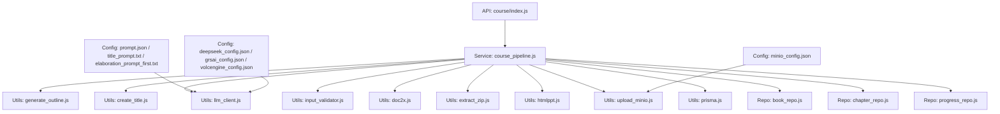
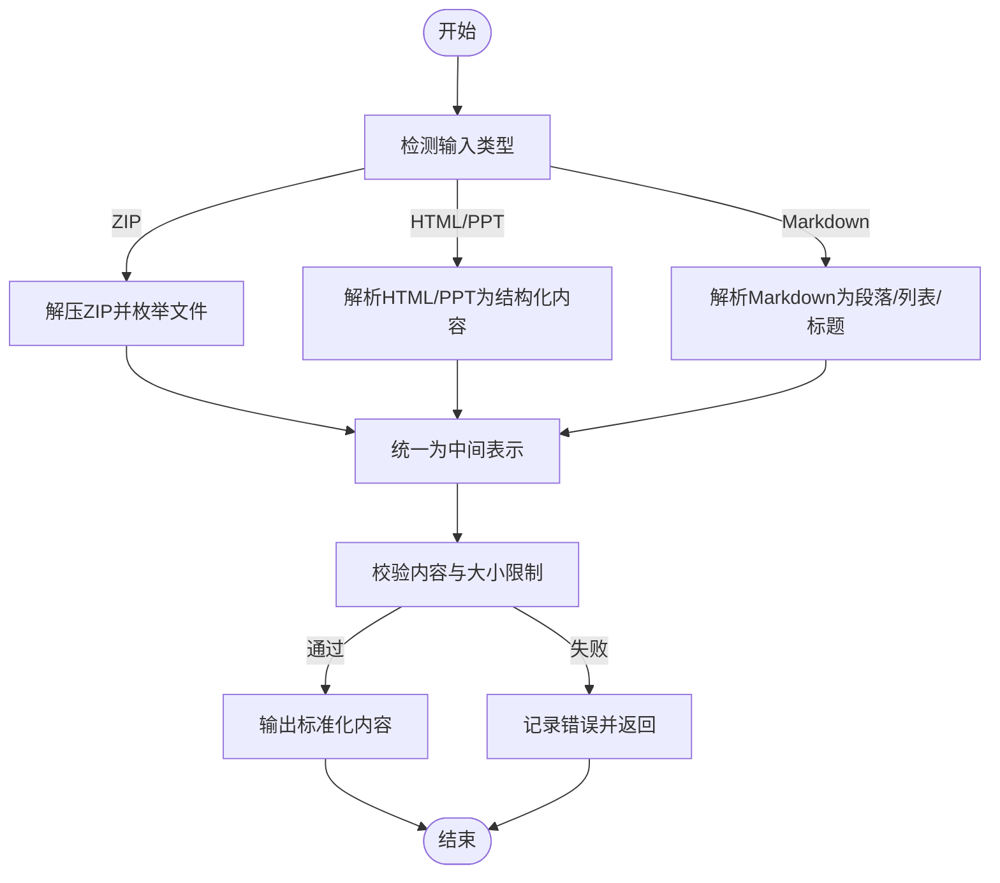
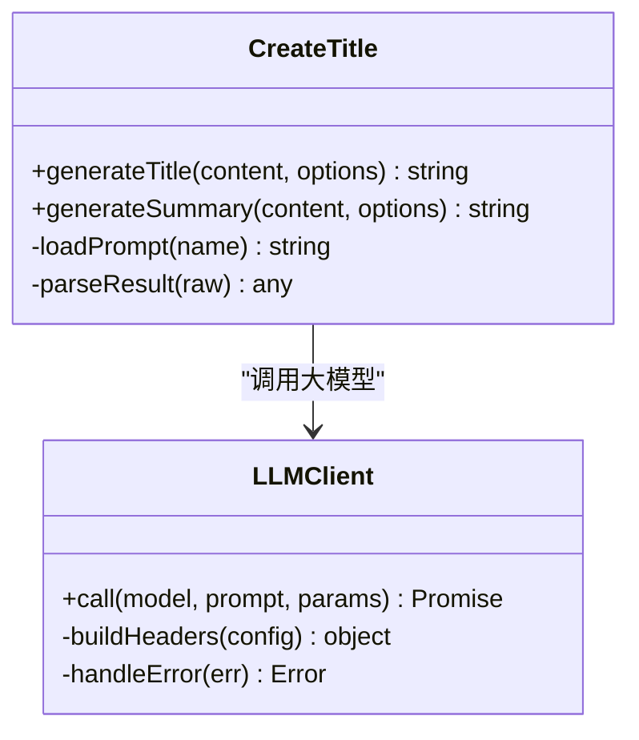
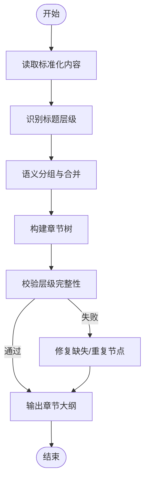
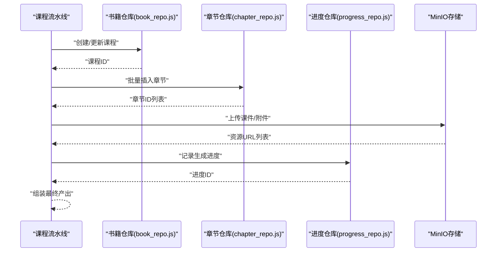
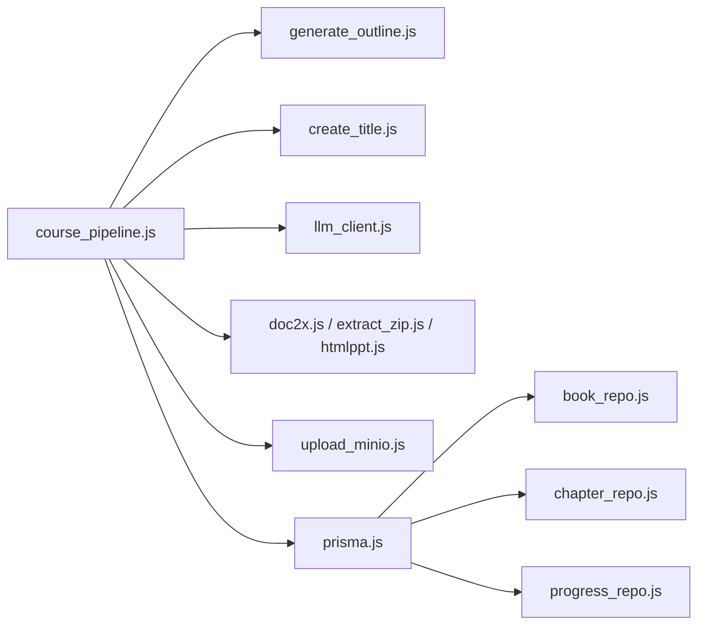

# 课程生成流水线

<cite>
**本文引用的文件**   
- [course_pipeline.js](file://node-jinmao/service/course_pipeline.js)
- [generate_outline.js](file://node-jinmao/utils/generate_outline.js)
- [create_title.js](file://node-jinmao/utils/create_title.js)
- [llm_client.js](file://node-jinmao/utils/llm_client.js)
- [input_validator.js](file://node-jinmao/utils/input_validator.js)
- [doc2x.js](file://node-jinmao/utils/doc2x.js)
- [extract_zip.js](file://node-jinmao/utils/extract_zip.js)
- [htmlppt.js](file://node-jinmao/utils/htmlppt.js)
- [upload_minio.js](file://node-jinmao/utils/upload_minio.js)
- [prisma.js](file://node-jinmao/utils/prisma.js)
- [book_repo.js](file://node-jinmao/utils/repo/book_repo.js)
- [chapter_repo.js](file://node-jinmao/utils/repo/chapter_repo.js)
- [progress_repo.js](file://node-jinmao/utils/repo/progress_repo.js)
- [index.js](file://node-jinmao/API/course/index.js)
- [slides.js](file://node-jinmao/API/course/slides.js)
- [schema.prisma](file://node-jinmao/prisma/schema.prisma)
- [prompt.json](file://node-jinmao/config/prompt.json)
- [title_prompt.txt](file://node-jinmao/config/title_prompt.txt)
- [elaboration_prompt_first.txt](file://node-jinmao/config/elaboration_prompt_first.txt)
- [deepseek_config.json](file://node-jinmao/config/deepseek_config.json)
- [grsai_config.json](file://node-jinmao/config/grsai_config.json)
- [volcengine_config.json](file://node-jinmao/config/volcengine_config.json)
- [minio_config.json](file://node-jinmao/config/minio_config.json)
</cite>

## 目录
1. [简介](#简介)
2. [项目结构](#项目结构)
3. [核心组件](#核心组件)
4. [架构总览](#架构总览)
5. [详细组件分析](#详细组件分析)
6. [依赖关系分析](#依赖关系分析)
7. [性能考虑](#性能考虑)
8. [故障排查指南](#故障排查指南)
9. [结论](#结论)
10. [附录](#附录)

## 简介
本文件面向“课程自动生成流水线”的完整实现，覆盖从内容输入到最终课程产出的全链路。重点包括：
- 多格式内容提取与解析（Markdown、ZIP、HTML/PPT 等）
- 智能标题生成与内容摘要优化（基于 LLM）
- 章节大纲自动构建与层次识别
- 可配置的流水线规则与输出格式
- 错误处理与重试机制，保障稳定性
- 扩展点说明与配置示例，便于新增处理步骤

## 项目结构
后端服务位于 node-jinmao 目录，课程生成相关代码集中在 service 与 utils 两个子目录：
- service/course_pipeline.js：编排课程生成的主流程
- utils/*：通用工具与能力封装（LLM 调用、文档解析、存储上传、数据库访问等）
- API/course/*：对外暴露的课程接口（创建、幻灯片导出等）
- config/*：提示词与第三方服务配置
- prisma/schema.prisma：课程、章节、进度等数据模型定义



图表来源 
- [index.js](file://node-jinmao/API/course/index.js)
- [course_pipeline.js](file://node-jinmao/service/course_pipeline.js)
- [generate_outline.js](file://node-jinmao/utils/generate_outline.js)
- [create_title.js](file://node-jinmao/utils/create_title.js)
- [llm_client.js](file://node-jinmao/utils/llm_client.js)
- [input_validator.js](file://node-jinmao/utils/input_validator.js)
- [doc2x.js](file://node-jinmao/utils/doc2x.js)
- [extract_zip.js](file://node-jinmao/utils/extract_zip.js)
- [htmlppt.js](file://node-jinmao/utils/htmlppt.js)
- [upload_minio.js](file://node-jinmao/utils/upload_minio.js)
- [prompt.json](file://node-jinmao/config/prompt.json)
- [title_prompt.txt](file://node-jinmao/config/title_prompt.txt)
- [elaboration_prompt_first.txt](file://node-jinmao/config/elaboration_prompt_first.txt)
- [deepseek_config.json](file://node-jinmao/config/deepseek_config.json)
- [grsai_config.json](file://node-jinmao/config/grsai_config.json)
- [volcengine_config.json](file://node-jinmao/config/volcengine_config.json)
- [minio_config.json](file://node-jinmao/config/minio_config.json)

章节来源
- [course_pipeline.js](file://node-jinmao/service/course_pipeline.js)
- [index.js](file://node-jinmao/API/course/index.js)
- [slides.js](file://node-jinmao/API/course/slides.js)

## 核心组件
- 课程流水线编排器：负责串联输入校验、内容提取、大纲生成、标题优化、内容展开、持久化与产物落盘等阶段
- 内容提取模块：支持 Markdown、ZIP 包、HTML/PPT 等多种格式的解析与标准化
- 智能标题与摘要：通过 LLM 客户端调用外部大模型，结合提示词模板生成高质量标题与内容摘要
- 大纲生成器：基于文本结构与语义理解，自动识别层级并构建章节大纲
- 存储与数据库：MinIO 对象存储用于课件/附件，Prisma 管理课程、章节、进度等结构化数据
- 配置中心：集中管理提示词与第三方服务配置，便于切换模型与调整策略

章节来源
- [course_pipeline.js](file://node-jinmao/service/course_pipeline.js)
- [generate_outline.js](file://node-jinmao/utils/generate_outline.js)
- [create_title.js](file://node-jinmao/utils/create_title.js)
- [llm_client.js](file://node-jinmao/utils/llm_client.js)
- [input_validator.js](file://node-jinmao/utils/input_validator.js)
- [doc2x.js](file://node-jinmao/utils/doc2x.js)
- [extract_zip.js](file://node-jinmao/utils/extract_zip.js)
- [htmlppt.js](file://node-jinmao/utils/htmlppt.js)
- [upload_minio.js](file://node-jinmao/utils/upload_minio.js)
- [prisma.js](file://node-jinmao/utils/prisma.js)
- [book_repo.js](file://node-jinmao/utils/repo/book_repo.js)
- [chapter_repo.js](file://node-jinmao/utils/repo/chapter_repo.js)
- [progress_repo.js](file://node-jinmao/utils/repo/progress_repo.js)
- [prompt.json](file://node-jinmao/config/prompt.json)
- [title_prompt.txt](file://node-jinmao/config/title_prompt.txt)
- [elaboration_prompt_first.txt](file://node-jinmao/config/elaboration_prompt_first.txt)
- [deepseek_config.json](file://node-jinmao/config/deepseek_config.json)
- [grsai_config.json](file://node-jinmao/config/grsai_config.json)
- [volcengine_config.json](file://node-jinmao/config/volcengine_config.json)
- [minio_config.json](file://node-jinmao/config/minio_config.json)

## 架构总览
课程生成流水线采用“编排器 + 能力模块”的分层架构。API 层接收请求后交由编排器统一调度；各能力模块职责单一、可插拔；配置与提示词集中管理；数据存储通过仓库模式抽象。

```mermaid
sequenceDiagram
participant Client as "客户端"
participant API as "课程API(index.js)"
participant Pipeline as "课程流水线(course_pipeline.js)"
participant Validator as "输入校验(input_validator.js)"
participant Extractor as "内容提取(doc2x/extract_zip/htmlppt)"
participant Outline as "大纲生成(generate_outline.js)"
participant Title as "标题优化(create_title.js)"
participant LLM as "LLM客户端(llm_client.js)"
participant Store as "存储(upload_minio.js)"
participant DB as "数据库(prisma.js + repos)"
Client->>API : "提交课程生成请求(文件/链接/参数)"
API->>Pipeline : "调用编排器"
Pipeline->>Validator : "校验输入与权限"
Validator-->>Pipeline : "校验结果"
Pipeline->>Extractor : "解析多格式内容"
Extractor-->>Pipeline : "标准化文本/资源"
Pipeline->>Outline : "生成章节大纲"
Outline-->>Pipeline : "章节结构"
Pipeline->>Title : "生成标题与摘要"
Title->>LLM : "调用大模型(提示词模板)"
LLM-->>Title : "返回标题/摘要"
Pipeline->>Store : "上传课件/附件"
Store-->>Pipeline : "返回资源URL"
Pipeline->>DB : "持久化课程/章节/进度"
DB-->>Pipeline : "保存成功"
Pipeline-->>API : "返回任务ID/状态"
API-->>Client : "异步结果/下载链接"
```

图表来源 
- [index.js](file://node-jinmao/API/course/index.js)
- [course_pipeline.js](file://node-jinmao/service/course_pipeline.js)
- [input_validator.js](file://node-jinmao/utils/input_validator.js)
- [doc2x.js](file://node-jinmao/utils/doc2x.js)
- [extract_zip.js](file://node-jinmao/utils/extract_zip.js)
- [htmlppt.js](file://node-jinmao/utils/htmlppt.js)
- [generate_outline.js](file://node-jinmao/utils/generate_outline.js)
- [create_title.js](file://node-jinmao/utils/create_title.js)
- [llm_client.js](file://node-jinmao/utils/llm_client.js)
- [upload_minio.js](file://node-jinmao/utils/upload_minio.js)
- [prisma.js](file://node-jinmao/utils/prisma.js)
- [book_repo.js](file://node-jinmao/utils/repo/book_repo.js)
- [chapter_repo.js](file://node-jinmao/utils/repo/chapter_repo.js)
- [progress_repo.js](file://node-jinmao/utils/repo/progress_repo.js)

## 详细组件分析

### 内容提取模块
- 支持的输入类型：Markdown 文本、ZIP 压缩包、HTML/PPT 页面
- 处理逻辑：
  - ZIP 解压与文件遍历，提取有效文档
  - HTML/PPT 转文本或结构化片段
  - 统一为中间表示（文本块、图片/附件引用、元数据）
- 异常处理：对损坏文件、编码问题、空内容等进行容错与跳过
- 扩展点：新增解析器时，注册到提取器的路由表即可接入



图表来源 
- [extract_zip.js](file://node-jinmao/utils/extract_zip.js)
- [htmlppt.js](file://node-jinmao/utils/htmlppt.js)
- [doc2x.js](file://node-jinmao/utils/doc2x.js)
- [input_validator.js](file://node-jinmao/utils/input_validator.js)

章节来源
- [extract_zip.js](file://node-jinmao/utils/extract_zip.js)
- [htmlppt.js](file://node-jinmao/utils/htmlppt.js)
- [doc2x.js](file://node-jinmao/utils/doc2x.js)
- [input_validator.js](file://node-jinmao/utils/input_validator.js)

### 智能标题生成与内容摘要
- 输入：标准化后的内容片段或全文摘要
- 处理：
  - 加载提示词模板（标题、摘要、首次展开等）
  - 调用 LLM 客户端，按模型配置发送请求
  - 解析返回结果，清洗与格式化
- 输出：课程标题、章节标题、内容摘要、关键知识点提炼
- 配置：支持切换不同 LLM 提供商与参数（温度、最大长度等）



图表来源 
- [create_title.js](file://node-jinmao/utils/create_title.js)
- [llm_client.js](file://node-jinmao/utils/llm_client.js)
- [prompt.json](file://node-jinmao/config/prompt.json)
- [title_prompt.txt](file://node-jinmao/config/title_prompt.txt)
- [elaboration_prompt_first.txt](file://node-jinmao/config/elaboration_prompt_first.txt)
- [deepseek_config.json](file://node-jinmao/config/deepseek_config.json)
- [grsai_config.json](file://node-jinmao/config/grsai_config.json)
- [volcengine_config.json](file://node-jinmao/config/volcengine_config.json)

章节来源
- [create_title.js](file://node-jinmao/utils/create_title.js)
- [llm_client.js](file://node-jinmao/utils/llm_client.js)
- [prompt.json](file://node-jinmao/config/prompt.json)
- [title_prompt.txt](file://node-jinmao/config/title_prompt.txt)
- [elaboration_prompt_first.txt](file://node-jinmao/config/elaboration_prompt_first.txt)
- [deepseek_config.json](file://node-jinmao/config/deepseek_config.json)
- [grsai_config.json](file://node-jinmao/config/grsai_config.json)
- [volcengine_config.json](file://node-jinmao/config/volcengine_config.json)

### 章节大纲自动生成
- 输入：标准化内容或初步标题
- 处理：
  - 识别标题层级（H1/H2/H3）与段落结构
  - 使用 LLM 辅助进行语义分组与层次重构
  - 输出章节树（名称、顺序、父级关系）
- 输出：可用于后续内容展开与课件生成的结构化大纲



图表来源 
- [generate_outline.js](file://node-jinmao/utils/generate_outline.js)

章节来源
- [generate_outline.js](file://node-jinmao/utils/generate_outline.js)

### 流水线编排与持久化
- 编排阶段：
  - 输入校验 → 内容提取 → 大纲生成 → 标题/摘要优化 → 内容展开 → 资源上传 → 数据持久化
- 持久化：
  - 课程、章节、进度信息写入数据库
  - 课件与附件上传至 MinIO，返回 URL
- 状态跟踪：
  - 生成任务状态、进度更新、错误码与消息



图表来源 
- [course_pipeline.js](file://node-jinmao/service/course_pipeline.js)
- [book_repo.js](file://node-jinmao/utils/repo/book_repo.js)
- [chapter_repo.js](file://node-jinmao/utils/repo/chapter_repo.js)
- [progress_repo.js](file://node-jinmao/utils/repo/progress_repo.js)
- [upload_minio.js](file://node-jinmao/utils/upload_minio.js)
- [prisma.js](file://node-jinmao/utils/prisma.js)
- [schema.prisma](file://node-jinmao/prisma/schema.prisma)

章节来源
- [course_pipeline.js](file://node-jinmao/service/course_pipeline.js)
- [book_repo.js](file://node-jinmao/utils/repo/book_repo.js)
- [chapter_repo.js](file://node-jinmao/utils/repo/chapter_repo.js)
- [progress_repo.js](file://node-jinmao/utils/repo/progress_repo.js)
- [upload_minio.js](file://node-jinmao/utils/upload_minio.js)
- [prisma.js](file://node-jinmao/utils/prisma.js)
- [schema.prisma](file://node-jinmao/prisma/schema.prisma)

### 配置与扩展点
- 配置项：
  - 提示词模板：prompt.json、title_prompt.txt、elaboration_prompt_first.txt
  - LLM 提供商：deepseek_config.json、grsai_config.json、volcengine_config.json
  - 存储配置：minio_config.json
- 扩展点：
  - 新增内容解析器：在提取器中注册新类型路由
  - 新增 LLM 模型：在客户端中增加模型适配与参数映射
  - 新增输出格式：在编排器末尾追加转换步骤，并更新持久化字段

章节来源
- [prompt.json](file://node-jinmao/config/prompt.json)
- [title_prompt.txt](file://node-jinmao/config/title_prompt.txt)
- [elaboration_prompt_first.txt](file://node-jinmao/config/elaboration_prompt_first.txt)
- [deepseek_config.json](file://node-jinmao/config/deepseek_config.json)
- [grsai_config.json](file://node-jinmao/config/grsai_config.json)
- [volcengine_config.json](file://node-jinmao/config/volcengine_config.json)
- [minio_config.json](file://node-jinmao/config/minio_config.json)

## 依赖关系分析
- 低耦合高内聚：每个工具模块职责单一，通过接口契约协作
- 外部依赖：
  - LLM 客户端依赖第三方模型服务
  - MinIO 依赖对象存储服务
  - Prisma 依赖数据库驱动与迁移
- 潜在循环依赖：通过仓库模式与配置注入避免直接耦合



图表来源 
- [course_pipeline.js](file://node-jinmao/service/course_pipeline.js)
- [generate_outline.js](file://node-jinmao/utils/generate_outline.js)
- [create_title.js](file://node-jinmao/utils/create_title.js)
- [llm_client.js](file://node-jinmao/utils/llm_client.js)
- [doc2x.js](file://node-jinmao/utils/doc2x.js)
- [extract_zip.js](file://node-jinmao/utils/extract_zip.js)
- [htmlppt.js](file://node-jinmao/utils/htmlppt.js)
- [upload_minio.js](file://node-jinmao/utils/upload_minio.js)
- [prisma.js](file://node-jinmao/utils/prisma.js)
- [book_repo.js](file://node-jinmao/utils/repo/book_repo.js)
- [chapter_repo.js](file://node-jinmao/utils/repo/chapter_repo.js)
- [progress_repo.js](file://node-jinmao/utils/repo/progress_repo.js)

章节来源
- [course_pipeline.js](file://node-jinmao/service/course_pipeline.js)
- [prisma.js](file://node-jinmao/utils/prisma.js)

## 性能考虑
- 并发与批处理：
  - 对大量章节或资源的处理建议分批执行，避免内存峰值
- 缓存策略：
  - 对相同内容的标题/摘要生成可增加缓存键，减少重复 LLM 调用
- 流式处理：
  - 大文件解析与上传可采用流式方式降低延迟
- 超时与限流：
  - 对 LLM 与 MinIO 调用设置合理超时与重试上限，防止雪崩

[本节为通用指导，不直接分析具体文件]

## 故障排查指南
- 常见错误：
  - 输入校验失败：检查文件格式、大小限制与权限
  - 内容提取失败：确认 ZIP 完整性、HTML/PPT 编码与依赖库
  - LLM 调用失败：核对模型配置、网络连通性与配额
  - 存储上传失败：检查 MinIO 配置、桶权限与路径
  - 数据库写入失败：核对连接串、迁移状态与约束
- 定位方法：
  - 查看流水线日志中的阶段标记与错误码
  - 检查临时文件与 MinIO 对象是否存在
  - 验证 Prisma 迁移与 schema 一致性

章节来源
- [input_validator.js](file://node-jinmao/utils/input_validator.js)
- [extract_zip.js](file://node-jinmao/utils/extract_zip.js)
- [htmlppt.js](file://node-jinmao/utils/htmlppt.js)
- [doc2x.js](file://node-jinmao/utils/doc2x.js)
- [llm_client.js](file://node-jinmao/utils/llm_client.js)
- [upload_minio.js](file://node-jinmao/utils/upload_minio.js)
- [prisma.js](file://node-jinmao/utils/prisma.js)

## 结论
课程生成流水线通过模块化设计与可配置化策略，实现了从多格式内容输入到结构化课程产出的自动化流程。借助 LLM 的智能标题与摘要能力，以及稳定的存储与数据库集成，系统具备良好的可扩展性与鲁棒性。通过合理的配置与扩展点，可快速适配新的内容源与输出格式，满足多样化教学场景需求。

[本节为总结性内容，不直接分析具体文件]

## 附录
- 配置示例要点：
  - 提示词模板：根据目标语言与风格定制标题与摘要模板
  - LLM 配置：选择合适模型与参数，平衡质量与成本
  - MinIO 配置：确保桶存在、读写权限正确
- 扩展步骤建议：
  - 新增解析器：在提取器中注册新类型路由与解析函数
  - 新增 LLM 模型：在客户端中增加模型适配与参数映射
  - 新增输出格式：在编排器末尾追加转换步骤，并更新持久化字段

[本节为补充说明，不直接分析具体文件]