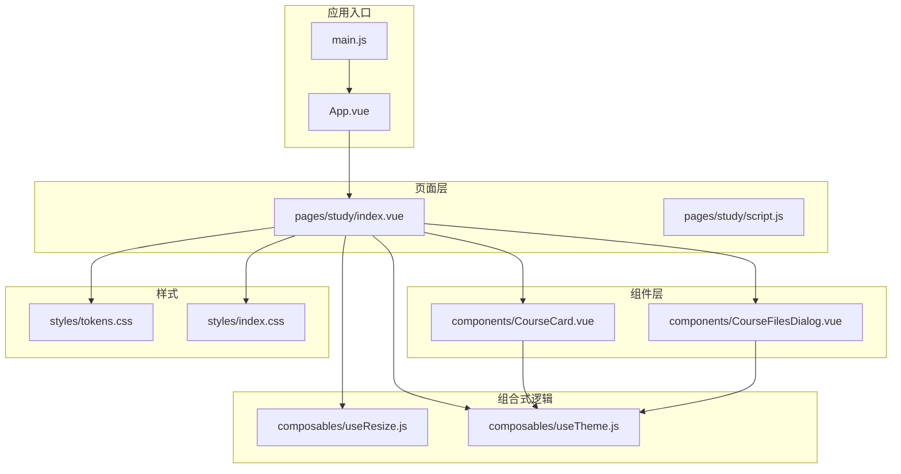
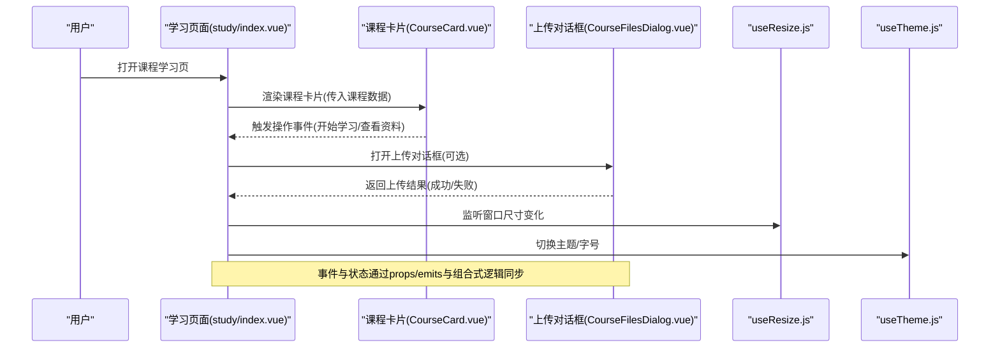
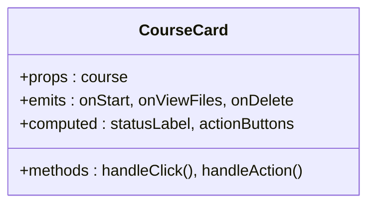
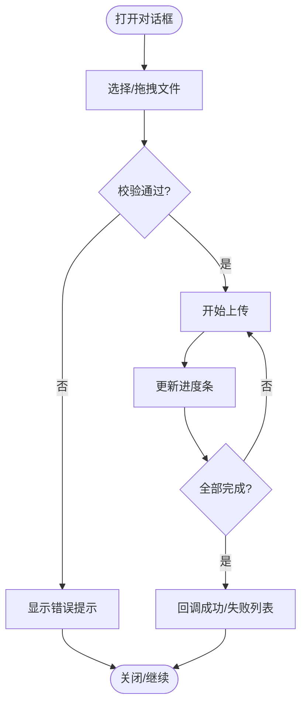
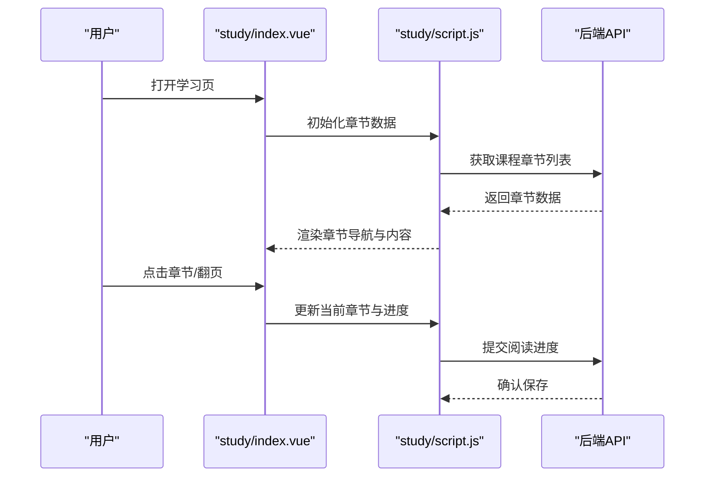
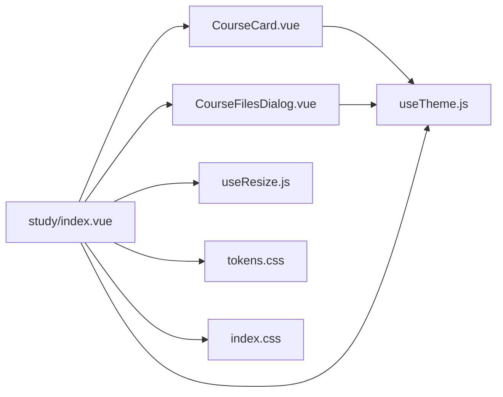

# 课程界面组件

<cite>
**本文引用的文件**   
- [CourseCard.vue](file://WEB/src/components/CourseCard.vue)
- [CourseFilesDialog.vue](file://WEB/src/components/CourseFilesDialog.vue)
- [study/index.vue](file://WEB/src/pages/study/index.vue)
- [study/script.js](file://WEB/src/pages/study/script.js)
- [useResize.js](file://WEB/src/composables/useResize.js)
- [useTheme.js](file://WEB/src/composables/useTheme.js)
- [index.css](file://WEB/src/styles/index.css)
- [tokens.css](file://WEB/src/styles/tokens.css)
- [App.vue](file://WEB/src/App.vue)
- [main.js](file://WEB/src/main.js)
</cite>

## 目录
1. [简介](#简介)
2. [项目结构](#项目结构)
3. [核心组件](#核心组件)
4. [架构总览](#架构总览)
5. [详细组件分析](#详细组件分析)
6. [依赖关系分析](#依赖关系分析)
7. [性能考量](#性能考量)
8. [故障排查指南](#故障排查指南)
9. [结论](#结论)
10. [附录](#附录)

## 简介
本文件面向“课程界面”相关的前端组件，聚焦以下目标：
- 课程卡片组件的设计与实现：课程信息展示、状态标识、操作按钮等。
- 课程上传对话框的实现：多文件选择、进度显示与错误处理。
- 课程学习界面：章节导航、内容展示、交互功能。
- 响应式设计：适配PC与移动端。
- 样式定制：主题切换与个性化设置。
- 组件间通信：事件传递与状态同步。
- 使用示例与最佳实践：如何组合各组件构建完整的课程界面。

## 项目结构
课程界面相关代码位于 WEB/src 下，关键目录与职责如下：
- components：可复用UI组件（课程卡片、上传对话框等）
- pages/study：课程学习页面（章节导航、内容渲染、交互）
- composables：组合式逻辑（响应式尺寸、主题）
- styles：全局样式与主题变量
- App.vue / main.js：应用入口与挂载点

图表来源
- [main.js](file://WEB/src/main.js)
- [App.vue](file://WEB/src/App.vue)
- [study/index.vue](file://WEB/src/pages/study/index.vue)
- [study/script.js](file://WEB/src/pages/study/script.js)
- [CourseCard.vue](file://WEB/src/components/CourseCard.vue)
- [CourseFilesDialog.vue](file://WEB/src/components/CourseFilesDialog.vue)
- [useResize.js](file://WEB/src/composables/useResize.js)
- [useTheme.js](file://WEB/src/composables/useTheme.js)
- [tokens.css](file://WEB/src/styles/tokens.css)
- [index.css](file://WEB/src/styles/index.css)

章节来源
- [main.js](file://WEB/src/main.js)
- [App.vue](file://WEB/src/App.vue)
- [study/index.vue](file://WEB/src/pages/study/index.vue)
- [study/script.js](file://WEB/src/pages/study/script.js)
- [CourseCard.vue](file://WEB/src/components/CourseCard.vue)
- [CourseFilesDialog.vue](file://WEB/src/components/CourseFilesDialog.vue)
- [useResize.js](file://WEB/src/composables/useResize.js)
- [useTheme.js](file://WEB/src/composables/useTheme.js)
- [tokens.css](file://WEB/src/styles/tokens.css)
- [index.css](file://WEB/src/styles/index.css)

## 核心组件
- 课程卡片（CourseCard.vue）
  - 负责展示课程封面、标题、描述、状态标签、操作按钮（如开始学习、查看资料）。
  - 支持点击跳转学习页或打开上传/资料管理对话框。
  - 通过 props 接收课程数据，通过 emits 向父级上报用户操作。
- 课程文件上传对话框（CourseFilesDialog.vue）
  - 支持多选文件、拖拽上传、预览文件名与大小。
  - 提供上传进度条、失败重试、批量取消等功能。
  - 与父组件通过事件同步上传结果（成功/失败列表）。
- 学习页面（study/index.vue + study/script.js）
  - 左侧章节导航，右侧内容区域；支持键盘翻页、滚动定位。
  - 集成进度记录、收藏、笔记等交互（由 script.js 驱动）。
  - 使用 useResize 自适应布局（侧边栏折叠/展开）。
  - 使用 useTheme 切换明暗主题与字体大小。

章节来源
- [CourseCard.vue](file://WEB/src/components/CourseCard.vue)
- [CourseFilesDialog.vue](file://WEB/src/components/CourseFilesDialog.vue)
- [study/index.vue](file://WEB/src/pages/study/index.vue)
- [study/script.js](file://WEB/src/pages/study/script.js)

## 架构总览
课程界面采用“页面-组件-组合式逻辑-样式”的分层架构：
- 页面层组织业务视图与路由跳转
- 组件层封装可复用的UI能力
- 组合式逻辑提供跨组件的响应式能力（尺寸、主题）
- 样式层通过 tokens 与全局样式统一视觉规范

图表来源
- [study/index.vue](file://WEB/src/pages/study/index.vue)
- [study/script.js](file://WEB/src/pages/study/script.js)
- [CourseCard.vue](file://WEB/src/components/CourseCard.vue)
- [CourseFilesDialog.vue](file://WEB/src/components/CourseFilesDialog.vue)
- [useResize.js](file://WEB/src/composables/useResize.js)
- [useTheme.js](file://WEB/src/composables/useTheme.js)

## 详细组件分析

### 课程卡片组件（CourseCard.vue）
- 设计要点
  - 信息展示：封面图、标题、副标题/描述、状态标签（如“进行中”“已完成”）。
  - 操作按钮：开始学习、查看资料、删除/编辑（根据权限控制）。
  - 交互行为：点击卡片进入学习页；按钮触发对应事件。
- 数据结构
  - 输入 props：课程对象（id、title、subtitle、cover、status、actions 等）。
  - 输出 events：onStart、onViewFiles、onDelete 等。
- 状态与样式
  - 状态标签颜色随 status 变化（进行中/已完成/未开始）。
  - 响应式布局：小屏单列，大屏多列网格。
- 可访问性
  - 按钮 aria-label、键盘可达、焦点可见。

图表来源
- [CourseCard.vue](file://WEB/src/components/CourseCard.vue)

章节来源
- [CourseCard.vue](file://WEB/src/components/CourseCard.vue)

### 课程文件上传对话框（CourseFilesDialog.vue）
- 设计要点
  - 多文件选择：支持拖拽、点击选择、限制类型与大小。
  - 进度显示：每个文件独立进度条，整体完成度汇总。
  - 错误处理：网络异常、格式不支持、大小超限提示与重试。
- 数据结构
  - 输入 props：courseId、maxSize、allowedTypes。
  - 输出 events：onSuccess(fileList)、onError(errors)。
- 交互流程
  - 选择文件 -> 校验 -> 分片/直传 -> 更新进度 -> 回调结果。
- 可访问性
  - 对话框焦点管理、ESC关闭、屏幕阅读器友好。

图表来源
- [CourseFilesDialog.vue](file://WEB/src/components/CourseFilesDialog.vue)

章节来源
- [CourseFilesDialog.vue](file://WEB/src/components/CourseFilesDialog.vue)

### 学习页面（study/index.vue + study/script.js）
- 页面结构
  - 顶部工具栏：返回、搜索、主题切换、设置。
  - 左侧章节导航：树形/列表结构，当前章节高亮，点击跳转。
  - 右侧内容区：富文本/图片/视频渲染，支持缩放、下载。
  - 底部进度条：显示当前章节进度、总进度。
- 交互功能
  - 键盘导航：方向键切换章节，空格翻页。
  - 笔记与收藏：悬浮面板，本地缓存+云端同步。
  - 响应式：移动端侧边栏收起为抽屉。
- 状态管理
  - 使用 script.js 维护章节列表、当前索引、阅读进度、收藏状态。
  - 与后端接口交互（加载章节、提交进度）。

图表来源
- [study/index.vue](file://WEB/src/pages/study/index.vue)
- [study/script.js](file://WEB/src/pages/study/script.js)

章节来源
- [study/index.vue](file://WEB/src/pages/study/index.vue)
- [study/script.js](file://WEB/src/pages/study/script.js)

### 响应式设计（useResize.js）
- 功能
  - 监听 window.resize，暴露 isMobile/isTablet 等断点状态。
  - 提供 hook 供页面/组件订阅尺寸变化，动态调整布局。
- 使用方式
  - 在页面中引入 useResize，根据 isMobile 切换侧边栏显隐。
  - 在组件中使用断点控制栅格列数与间距。

章节来源
- [useResize.js](file://WEB/src/composables/useResize.js)

### 主题系统（useTheme.js）
- 功能
  - 提供明/暗主题切换，持久化到 localStorage。
  - 暴露主题变量（颜色、字号、圆角），供 CSS 变量引用。
- 使用方式
  - 在 App.vue 根节点注入主题类名。
  - 在组件内调用 toggleTheme() 切换。

章节来源
- [useTheme.js](file://WEB/src/composables/useTheme.js)

### 样式与主题定制
- tokens.css：定义颜色、字体、间距、阴影等设计令牌。
- index.css：全局重置、基础布局、组件默认样式。
- 定制方案
  - 覆盖 tokens.css 中的 CSS 变量实现主题切换。
  - 使用 BEM 命名规范扩展组件样式，避免冲突。
  - 移动端优先，使用媒体查询增强大屏体验。

章节来源
- [tokens.css](file://WEB/src/styles/tokens.css)
- [index.css](file://WEB/src/styles/index.css)

## 依赖关系分析
- 页面依赖组件：study/index.vue 依赖 CourseCard.vue 与 CourseFilesDialog.vue。
- 组件依赖组合式逻辑：CourseCard.vue 与 CourseFilesDialog.vue 依赖 useTheme.js。
- 页面依赖组合式逻辑：study/index.vue 依赖 useResize.js 与 useTheme.js。
- 样式依赖：所有组件共享 tokens.css 与 index.css。

图表来源
- [study/index.vue](file://WEB/src/pages/study/index.vue)
- [CourseCard.vue](file://WEB/src/components/CourseCard.vue)
- [CourseFilesDialog.vue](file://WEB/src/components/CourseFilesDialog.vue)
- [useResize.js](file://WEB/src/composables/useResize.js)
- [useTheme.js](file://WEB/src/composables/useTheme.js)
- [tokens.css](file://WEB/src/styles/tokens.css)
- [index.css](file://WEB/src/styles/index.css)

章节来源
- [study/index.vue](file://WEB/src/pages/study/index.vue)
- [CourseCard.vue](file://WEB/src/components/CourseCard.vue)
- [CourseFilesDialog.vue](file://WEB/src/components/CourseFilesDialog.vue)
- [useResize.js](file://WEB/src/composables/useResize.js)
- [useTheme.js](file://WEB/src/composables/useTheme.js)
- [tokens.css](file://WEB/src/styles/tokens.css)
- [index.css](file://WEB/src/styles/index.css)

## 性能考量
- 懒加载章节内容：按需请求与渲染，减少首屏压力。
- 虚拟滚动：长列表章节导航使用虚拟滚动提升滚动性能。
- 图片优化：封面图与内容图使用 WebP、懒加载、占位图。
- 上传优化：分片上传、并发控制、断点续传。
- 主题切换：CSS 变量切换避免重排重绘。

[本节为通用指导，不直接分析具体文件]

## 故障排查指南
- 上传失败
  - 检查网络状态与文件大小限制。
  - 查看浏览器控制台错误日志，确认后端返回码。
  - 重试机制是否启用，错误消息是否清晰。
- 主题不生效
  - 确认 App.vue 根节点是否正确注入主题类名。
  - 检查 tokens.css 变量是否被覆盖。
- 响应式布局错乱
  - 检查 useResize.js 断点配置是否与媒体查询一致。
  - 移动端侧边栏是否被正确隐藏/显示。
- 章节无法跳转
  - 确认章节数据加载成功，当前索引更新正常。
  - 检查路由参数与页面状态同步。

章节来源
- [CourseFilesDialog.vue](file://WEB/src/components/CourseFilesDialog.vue)
- [useTheme.js](file://WEB/src/composables/useTheme.js)
- [useResize.js](file://WEB/src/composables/useResize.js)
- [study/script.js](file://WEB/src/pages/study/script.js)

## 结论
本课程界面组件体系以清晰的层次划分与组合式逻辑为核心，实现了课程卡片、上传对话框、学习页面的完整闭环。通过主题系统与响应式设计，兼顾了多端体验与个性化需求。建议在生产环境中进一步完善错误边界、性能监控与无障碍测试，以提升稳定性与可访问性。

[本节为总结，不直接分析具体文件]

## 附录
- 使用示例与最佳实践
  - 在页面中引入 CourseCard 与 CourseFilesDialog，通过 props 绑定课程数据与回调。
  - 使用 useResize 控制侧边栏显隐，使用 useTheme 提供主题切换按钮。
  - 学习页面中，将章节导航与内容区解耦，便于单独测试与复用。
  - 样式定制时，优先覆盖 tokens.css 变量，保持设计一致性。

[本节为补充说明，不直接分析具体文件]