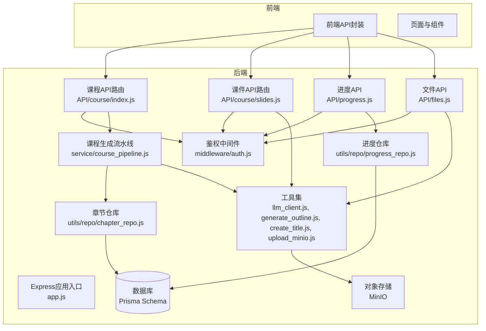
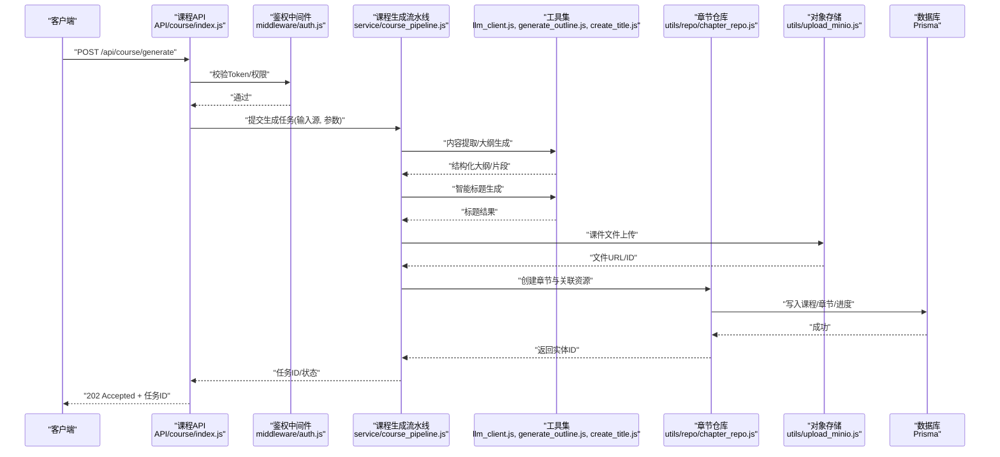
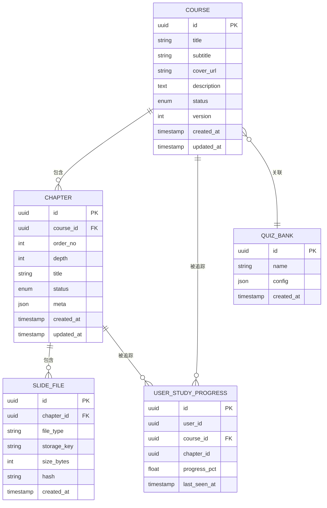
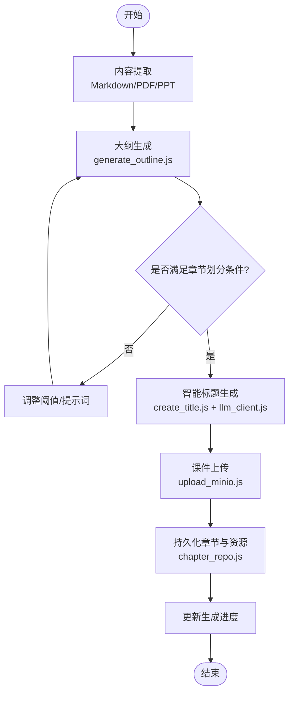
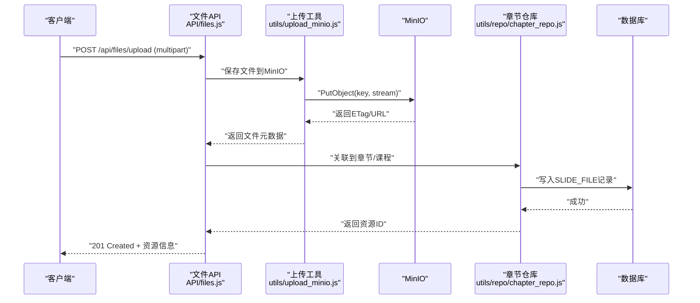
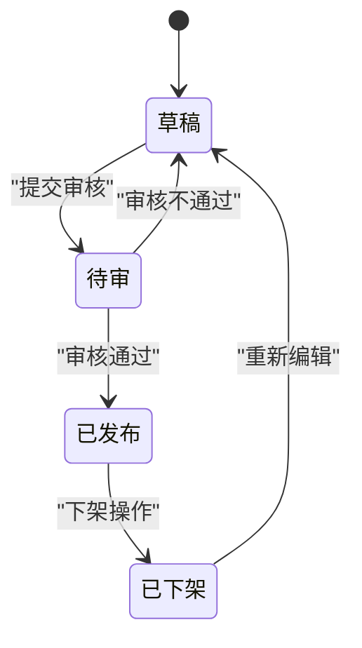
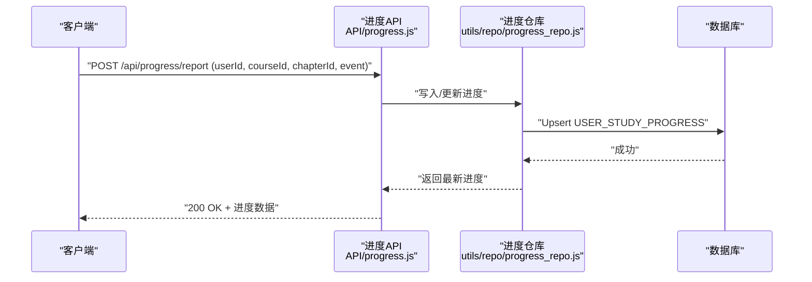
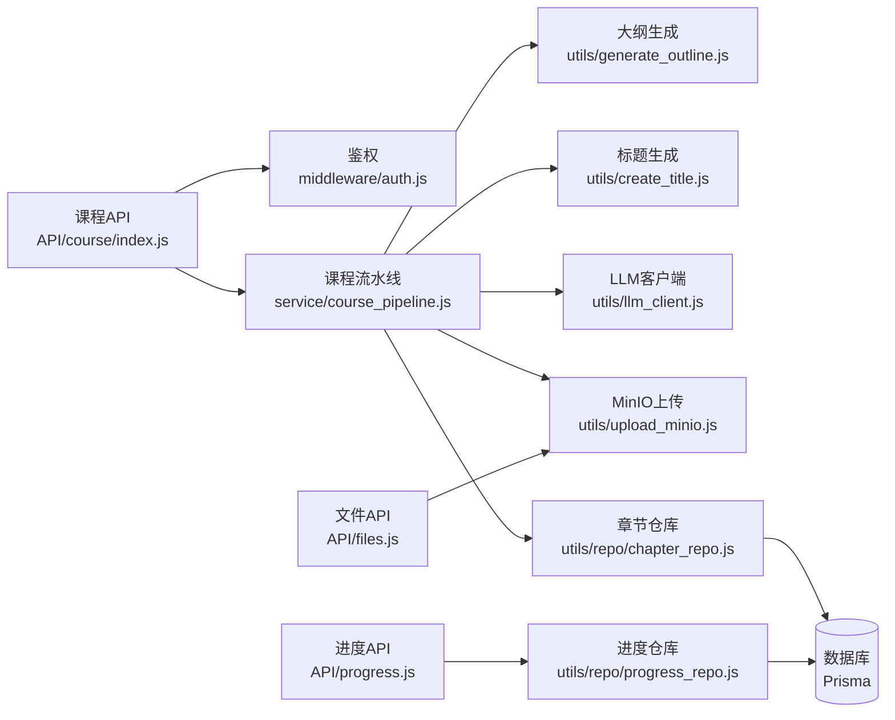

# 课程管理系统

<cite>
**本文引用的文件**   
- [app.js](file://node-jinmao/app.js)
- [course_pipeline.js](file://node-jinmao/service/course_pipeline.js)
- [index.js](file://node-jinmao/API/course/index.js)
- [slides.js](file://node-jinmao/API/course/slides.js)
- [schema.prisma](file://node-jinmao/prisma/schema.prisma)
- [chapter_repo.js](file://node-jinmao/utils/repo/chapter_repo.js)
- [progress_repo.js](file://node-jinmao/utils/repo/progress_repo.js)
- [upload_minio.js](file://node-jinmao/utils/upload_minio.js)
- [generate_outline.js](file://node-jinmao/utils/generate_outline.js)
- [create_title.js](file://node-jinmao/utils/create_title.js)
- [llm_client.js](file://node-jinmao/utils/llm_client.js)
- [auth.js](file://node-jinmao/middleware/auth.js)
- [progress.js](file://node-jinmao/API/progress.js)
- [files.js](file://node-jinmao/API/files.js)
- [md2quiz_prompt.md](file://node-jinmao/config/md2quiz_prompt.md)
- [title_prompt.txt](file://node-jinmao/config/title_prompt.txt)
</cite>

## 目录
1. [引言](#引言)
2. [项目结构](#项目结构)
3. [核心组件](#核心组件)
4. [架构总览](#架构总览)
5. [详细组件分析](#详细组件分析)
6. [依赖关系分析](#依赖关系分析)
7. [性能考量](#性能考量)
8. [故障排查指南](#故障排查指南)
9. [结论](#结论)
10. [附录](#附录)

## 引言
本文件系统性地梳理“课程管理系统”的课程结构设计、章节层级关系、课件文件管理机制，以及课程生成流水线的工作原理（内容提取、章节划分、智能标题生成等）。同时覆盖课程的CRUD接口、文件上传下载处理、版本控制机制；并提供扩展新课件格式与自定义课程生成规则的具体示例路径。最后说明课程与题库的关联关系、学习进度跟踪机制，以及课程的发布与审核流程。

## 项目结构
后端采用 Node.js + Express 风格的路由与服务分层：API层负责HTTP路由与鉴权，Service层实现业务编排，Utils提供通用工具（LLM调用、MinIO上传、大纲生成、标题生成等），Prisma Schema定义数据模型与迁移。前端位于 WEB 目录，通过 API 模块与后端交互。

图表来源
- [app.js:1-200](file://node-jinmao/app.js#L1-L200)
- [index.js:1-200](file://node-jinmao/API/course/index.js#L1-L200)
- [slides.js:1-200](file://node-jinmao/API/course/slides.js#L1-L200)
- [progress.js:1-200](file://node-jinmao/API/progress.js#L1-L200)
- [files.js:1-200](file://node-jinmao/API/files.js#L1-L200)
- [course_pipeline.js:1-200](file://node-jinmao/service/course_pipeline.js#L1-L200)
- [chapter_repo.js:1-200](file://node-jinmao/utils/repo/chapter_repo.js#L1-L200)
- [progress_repo.js:1-200](file://node-jinmao/utils/repo/progress_repo.js#L1-L200)
- [upload_minio.js:1-200](file://node-jinmao/utils/upload_minio.js#L1-L200)
- [generate_outline.js:1-200](file://node-jinmao/utils/generate_outline.js#L1-L200)
- [create_title.js:1-200](file://node-jinmao/utils/create_title.js#L1-L200)
- [llm_client.js:1-200](file://node-jinmao/utils/llm_client.js#L1-L200)

章节来源
- [app.js:1-200](file://node-jinmao/app.js#L1-L200)
- [schema.prisma:1-400](file://node-jinmao/prisma/schema.prisma#L1-L400)

## 核心组件
- 课程与章节数据模型：课程包含元信息（标题、副标题、封面、状态、版本等），章节为课程下的有序节点，支持层级结构与生成进度记录。
- 课程生成流水线：从输入材料（文档/Markdown/PPT等）进行内容提取、大纲生成、章节划分、智能标题生成、课件资源落盘与索引入库。
- 课件文件管理：统一通过 MinIO 对象存储，提供上传、下载、列表、删除等能力，并与课程/章节建立引用关系。
- 学习进度跟踪：记录用户观看/学习行为，支持按课程、章节维度统计完成度与最近学习时间。
- 题库关联：课程可关联题库或题目集合，用于课后练习与测评。

章节来源
- [schema.prisma:1-400](file://node-jinmao/prisma/schema.prisma#L1-L400)
- [course_pipeline.js:1-200](file://node-jinmao/service/course_pipeline.js#L1-L200)
- [upload_minio.js:1-200](file://node-jinmao/utils/upload_minio.js#L1-L200)
- [progress_repo.js:1-200](file://node-jinmao/utils/repo/progress_repo.js#L1-L200)

## 架构总览
系统以“API 路由 -> Service 编排 -> Repository/Utils -> 外部服务（DB/MinIO/LLM）”的分层架构组织。课程生成流水线作为核心编排器，串联内容解析、大纲生成、标题生成、文件上传与持久化。

图表来源
- [index.js:1-200](file://node-jinmao/API/course/index.js#L1-L200)
- [auth.js:1-200](file://node-jinmao/middleware/auth.js#L1-L200)
- [course_pipeline.js:1-200](file://node-jinmao/service/course_pipeline.js#L1-L200)
- [llm_client.js:1-200](file://node-jinmao/utils/llm_client.js#L1-L200)
- [generate_outline.js:1-200](file://node-jinmao/utils/generate_outline.js#L1-L200)
- [create_title.js:1-200](file://node-jinmao/utils/create_title.js#L1-L200)
- [upload_minio.js:1-200](file://node-jinmao/utils/upload_minio.js#L1-L200)
- [chapter_repo.js:1-200](file://node-jinmao/utils/repo/chapter_repo.js#L1-L200)
- [schema.prisma:1-400](file://node-jinmao/prisma/schema.prisma#L1-L400)

## 详细组件分析

### 课程与章节数据模型
- 课程实体：包含标题、副标题、封面、描述、状态（草稿/待审/已发布/已下架）、版本号、创建/更新时间等。
- 章节实体：属于某课程，具有顺序号、层级深度、标题、状态、生成进度字段（如当前步骤、错误信息、重试次数）。
- 课件资源：与章节关联，记录文件类型、存储位置（MinIO key）、大小、哈希等。
- 学习进度：记录用户ID、课程ID、章节ID、完成比例、最后学习时间等。
- 题库关联：课程可绑定题库ID或题目集合ID，便于课后练习。

图表来源
- [schema.prisma:1-400](file://node-jinmao/prisma/schema.prisma#L1-L400)

章节来源
- [schema.prisma:1-400](file://node-jinmao/prisma/schema.prisma#L1-L400)

### 课程生成流水线
流水线职责：
- 内容提取：支持 Markdown、PDF、PPT 等输入，转换为结构化文本片段。
- 章节划分：基于语义与层级规则切分内容，生成章节树。
- 智能标题生成：调用 LLM 根据章节内容生成标题与副标题。
- 课件资源处理：将图片、音频、视频等资源上传至 MinIO，并建立引用。
- 持久化与状态：写入章节与资源，更新生成进度，支持失败重试。

图表来源
- [course_pipeline.js:1-200](file://node-jinmao/service/course_pipeline.js#L1-L200)
- [generate_outline.js:1-200](file://node-jinmao/utils/generate_outline.js#L1-L200)
- [create_title.js:1-200](file://node-jinmao/utils/create_title.js#L1-L200)
- [llm_client.js:1-200](file://node-jinmao/utils/llm_client.js#L1-L200)
- [upload_minio.js:1-200](file://node-jinmao/utils/upload_minio.js#L1-L200)
- [chapter_repo.js:1-200](file://node-jinmao/utils/repo/chapter_repo.js#L1-L200)

章节来源
- [course_pipeline.js:1-200](file://node-jinmao/service/course_pipeline.js#L1-L200)
- [generate_outline.js:1-200](file://node-jinmao/utils/generate_outline.js#L1-L200)
- [create_title.js:1-200](file://node-jinmao/utils/create_title.js#L1-L200)
- [llm_client.js:1-200](file://node-jinmao/utils/llm_client.js#L1-L200)
- [upload_minio.js:1-200](file://node-jinmao/utils/upload_minio.js#L1-L200)
- [chapter_repo.js:1-200](file://node-jinmao/utils/repo/chapter_repo.js#L1-L200)

### 课件文件管理机制
- 上传：通过统一的上传接口接收文件，校验类型/大小，生成唯一 key，写入 MinIO，并返回访问 URL。
- 下载：根据 key 或 ID 获取文件流，设置合适的 Content-Type 与缓存策略。
- 列表：按课程/章节维度列出课件，支持分页与过滤。
- 删除：软删除或物理删除，清理引用与索引。

图表来源
- [files.js:1-200](file://node-jinmao/API/files.js#L1-L200)
- [upload_minio.js:1-200](file://node-jinmao/utils/upload_minio.js#L1-L200)
- [chapter_repo.js:1-200](file://node-jinmao/utils/repo/chapter_repo.js#L1-L200)
- [schema.prisma:1-400](file://node-jinmao/prisma/schema.prisma#L1-L400)

章节来源
- [files.js:1-200](file://node-jinmao/API/files.js#L1-L200)
- [upload_minio.js:1-200](file://node-jinmao/utils/upload_minio.js#L1-L200)
- [chapter_repo.js:1-200](file://node-jinmao/utils/repo/chapter_repo.js#L1-L200)

### 课程CRUD与发布审核流程
- 创建课程：填写基础信息，默认状态为草稿。
- 更新课程：修改元信息、封面、描述等。
- 删除课程：逻辑删除，保留审计记录。
- 发布/审核：草稿 -> 待审 -> 已发布/已下架，支持回滚与版本管理。

图表来源
- [index.js:1-200](file://node-jinmao/API/course/index.js#L1-L200)
- [schema.prisma:1-400](file://node-jinmao/prisma/schema.prisma#L1-L400)

章节来源
- [index.js:1-200](file://node-jinmao/API/course/index.js#L1-L200)
- [schema.prisma:1-400](file://node-jinmao/prisma/schema.prisma#L1-L400)

### 学习进度跟踪机制
- 记录点：进入课程、打开章节、播放媒体、完成测验等事件。
- 聚合：按课程/章节维度计算完成百分比，记录最近学习时间。
- 查询：提供用户维度的学习报告与课程维度学习统计。

图表来源
- [progress.js:1-200](file://node-jinmao/API/progress.js#L1-L200)
- [progress_repo.js:1-200](file://node-jinmao/utils/repo/progress_repo.js#L1-L200)
- [schema.prisma:1-400](file://node-jinmao/prisma/schema.prisma#L1-L400)

章节来源
- [progress.js:1-200](file://node-jinmao/API/progress.js#L1-L200)
- [progress_repo.js:1-200](file://node-jinmao/utils/repo/progress_repo.js#L1-L200)
- [schema.prisma:1-400](file://node-jinmao/prisma/schema.prisma#L1-L400)

### 课程与题库关联
- 关联方式：课程绑定题库ID或题目集合ID，支持多题库组合。
- 使用场景：课后练习、随堂测验、错题本导出。
- 数据一致性：课程变更时同步题库配置，确保题目与课程内容一致。

章节来源
- [schema.prisma:1-400](file://node-jinmao/prisma/schema.prisma#L1-L400)

### 扩展新课件格式支持与自定义课程生成规则
- 新增课件格式：在上传与解析层增加类型识别与处理器，注册到流水线的内容提取阶段。
- 自定义生成规则：调整大纲生成与章节划分的提示词与阈值，或通过插件式处理器注入新的切分策略。
- 示例参考路径：
  - 内容提取与大纲生成：[generate_outline.js:1-200](file://node-jinmao/utils/generate_outline.js#L1-L200)
  - 标题生成提示词：[title_prompt.txt:1-200](file://node-jinmao/config/title_prompt.txt#L1-L200)
  - 题库生成提示词（参考）：[md2quiz_prompt.md:1-200](file://node-jinmao/config/md2quiz_prompt.md#L1-L200)
  - LLM客户端调用：[llm_client.js:1-200](file://node-jinmao/utils/llm_client.js#L1-L200)
  - 课件上传：[upload_minio.js:1-200](file://node-jinmao/utils/upload_minio.js#L1-L200)
  - 章节仓库：[chapter_repo.js:1-200](file://node-jinmao/utils/repo/chapter_repo.js#L1-L200)

章节来源
- [generate_outline.js:1-200](file://node-jinmao/utils/generate_outline.js#L1-L200)
- [title_prompt.txt:1-200](file://node-jinmao/config/title_prompt.txt#L1-L200)
- [md2quiz_prompt.md:1-200](file://node-jinmao/config/md2quiz_prompt.md#L1-L200)
- [llm_client.js:1-200](file://node-jinmao/utils/llm_client.js#L1-L200)
- [upload_minio.js:1-200](file://node-jinmao/utils/upload_minio.js#L1-L200)
- [chapter_repo.js:1-200](file://node-jinmao/utils/repo/chapter_repo.js#L1-L200)

## 依赖关系分析
- API 层依赖鉴权中间件与业务服务。
- 课程生成流水线依赖大纲生成、标题生成、LLM客户端、MinIO上传与章节仓库。
- 进度与文件API分别依赖对应的仓库与工具。
- 数据模型由 Prisma Schema 统一管理，迁移脚本保证结构演进。

图表来源
- [index.js:1-200](file://node-jinmao/API/course/index.js#L1-L200)
- [auth.js:1-200](file://node-jinmao/middleware/auth.js#L1-L200)
- [course_pipeline.js:1-200](file://node-jinmao/service/course_pipeline.js#L1-L200)
- [generate_outline.js:1-200](file://node-jinmao/utils/generate_outline.js#L1-L200)
- [create_title.js:1-200](file://node-jinmao/utils/create_title.js#L1-L200)
- [llm_client.js:1-200](file://node-jinmao/utils/llm_client.js#L1-L200)
- [upload_minio.js:1-200](file://node-jinmao/utils/upload_minio.js#L1-L200)
- [chapter_repo.js:1-200](file://node-jinmao/utils/repo/chapter_repo.js#L1-L200)
- [progress.js:1-200](file://node-jinmao/API/progress.js#L1-L200)
- [progress_repo.js:1-200](file://node-jinmao/utils/repo/progress_repo.js#L1-L200)
- [schema.prisma:1-400](file://node-jinmao/prisma/schema.prisma#L1-L400)

章节来源
- [index.js:1-200](file://node-jinmao/API/course/index.js#L1-L200)
- [course_pipeline.js:1-200](file://node-jinmao/service/course_pipeline.js#L1-L200)
- [schema.prisma:1-400](file://node-jinmao/prisma/schema.prisma#L1-L400)

## 性能考量
- 异步任务：课程生成建议采用任务队列与后台执行，避免阻塞请求。
- 大文件处理：上传采用流式传输，限制并发与文件大小，启用断点续传。
- 缓存策略：对静态课件与封面图启用 CDN 与浏览器缓存。
- 数据库优化：为常用查询字段建立索引（课程ID、章节ID、用户ID、时间戳）。
- LLM调用：批量请求合并、超时重试、降级策略（本地模板回退）。

## 故障排查指南
- 鉴权失败：检查 Token 有效性、权限范围与中间件配置。
- 生成失败：查看章节生成进度与错误日志，确认输入内容与提示词质量。
- 上传失败：核对 MinIO 配置、网络连通性与存储空间配额。
- 进度异常：检查上报频率与去重逻辑，避免重复计数。
- 题库关联错误：核对课程与题库ID映射关系与版本一致性。

章节来源
- [auth.js:1-200](file://node-jinmao/middleware/auth.js#L1-L200)
- [course_pipeline.js:1-200](file://node-jinmao/service/course_pipeline.js#L1-L200)
- [upload_minio.js:1-200](file://node-jinmao/utils/upload_minio.js#L1-L200)
- [progress.js:1-200](file://node-jinmao/API/progress.js#L1-L200)

## 结论
本课程管理系统以清晰的分层架构与可扩展的流水线设计，支撑了从内容提取、章节划分、智能标题生成到课件管理与学习进度的完整闭环。通过统一的对象存储与完善的进度跟踪，系统具备良好的可维护性与扩展性。未来可进一步增强任务队列、缓存与监控能力，提升高并发场景下的稳定性与性能。

## 附录
- 相关配置文件与提示词：
  - 标题生成提示词：[title_prompt.txt:1-200](file://node-jinmao/config/title_prompt.txt#L1-L200)
  - 题库生成提示词（参考）：[md2quiz_prompt.md:1-200](file://node-jinmao/config/md2quiz_prompt.md#L1-L200)
- 前端API封装（参考）：
  - [books.js:1-200](file://WEB/src/api/books.js#L1-L200)
  - [progress.js:1-200](file://WEB/src/api/progress.js#L1-L200)
  - [quiz.js:1-200](file://WEB/src/api/quiz.js#L1-L200)