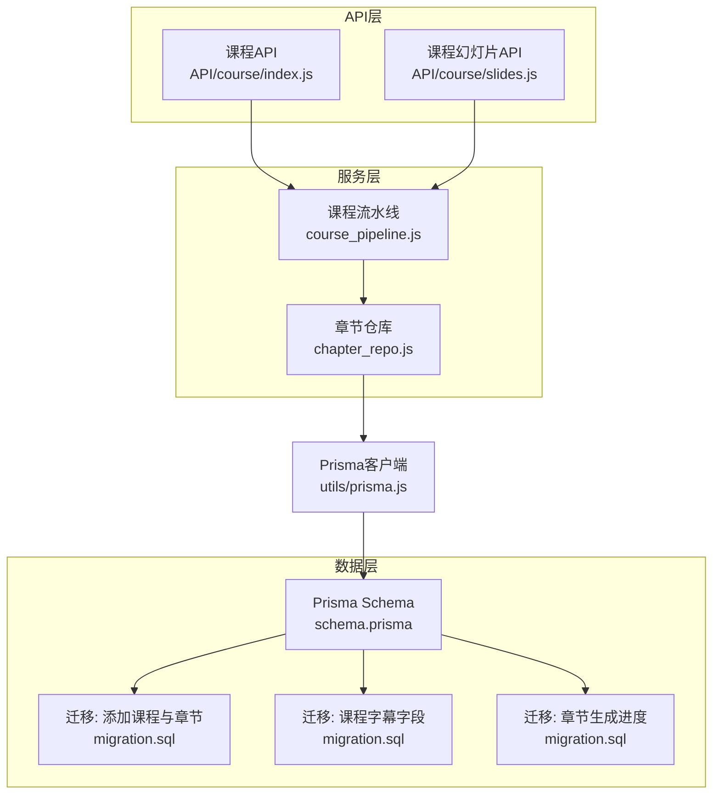
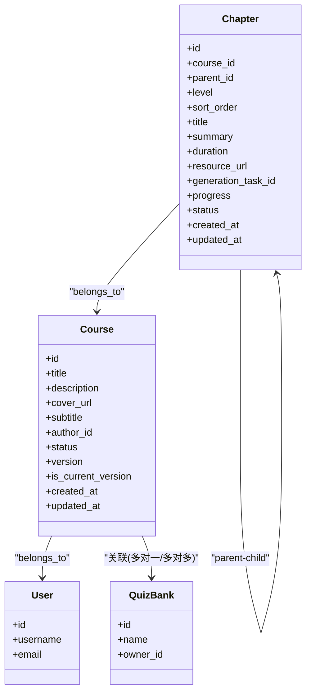
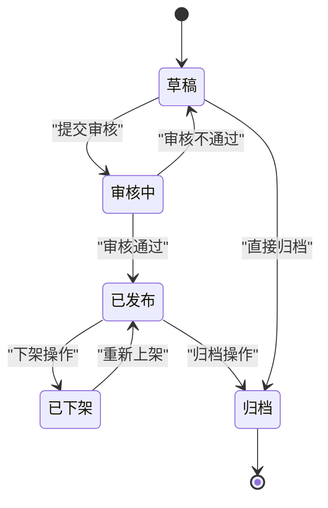
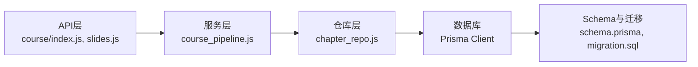

# 课程结构设计

<cite>
**本文引用的文件**   
- [schema.prisma](file://node-jinmao/prisma/schema.prisma)
- [20260709105504_add_course_and_chapter/migration.sql](file://node-jinmao/prisma/migrations/20260709105504_add_course_and_chapter/migration.sql)
- [20260709_add_subtitle_to_course/migration.sql](file://node-jinmao/prisma/migrations/20260709_add_subtitle_to_course/migration.sql)
- [20260725_add_chapter_generation_progress/migration.sql](file://node-jinmao/prisma/migrations/20260725_add_chapter_generation_progress/migration.sql)
- [course_pipeline.js](file://node-jinmao/service/course_pipeline.js)
- [chapter_repo.js](file://node-jinmao/utils/repo/chapter_repo.js)
- [index.js（课程API）](file://node-jinmao/API/course/index.js)
- [slides.js（课程幻灯片API）](file://node-jinmao/API/course/slides.js)
- [prisma.js](file://node-jinmao/utils/prisma.js)
</cite>

## 目录
1. [简介](#简介)
2. [项目结构](#项目结构)
3. [核心组件](#核心组件)
4. [架构总览](#架构总览)
5. [详细组件分析](#详细组件分析)
6. [依赖关系分析](#依赖关系分析)
7. [性能考虑](#性能考虑)
8. [故障排查指南](#故障排查指南)
9. [结论](#结论)
10. [附录](#附录)

## 简介
本文件围绕“课程结构设计”目标，系统梳理课程实体模型、章节层级关系、状态管理、版本控制与回滚策略，并给出基于Prisma的Course与Chapter表设计思路、字段类型选择与约束规则。同时说明课程与用户、题库的关联设计与外键约束，提供获取完整课程树形结构的查询示例，以及从草稿到发布的全生命周期状态流转图。

## 项目结构
本课程相关的数据模型定义位于 Prisma Schema 与迁移脚本中；业务逻辑分布在服务层与仓库层；API层暴露课程与章节相关的接口。关键路径如下：
- 数据模型与迁移：node-jinmao/prisma/schema.prisma 与 migrations 目录
- 课程生成与服务编排：service/course_pipeline.js
- 章节仓储与查询：utils/repo/chapter_repo.js
- API路由与控制器：API/course/index.js、API/course/slides.js
- Prisma客户端初始化：utils/prisma.js

图表来源
- [schema.prisma](file://node-jinmao/prisma/schema.prisma)
- [20260709105504_add_course_and_chapter/migration.sql](file://node-jinmao/prisma/migrations/20260709105504_add_course_and_chapter/migration.sql)
- [20260709_add_subtitle_to_course/migration.sql](file://node-jinmao/prisma/migrations/20260709_add_subtitle_to_course/migration.sql)
- [20260725_add_chapter_generation_progress/migration.sql](file://node-jinmao/prisma/migrations/20260725_add_chapter_generation_progress/migration.sql)
- [course_pipeline.js](file://node-jinmao/service/course_pipeline.js)
- [chapter_repo.js](file://node-jinmao/utils/repo/chapter_repo.js)
- [index.js（课程API）](file://node-jinmao/API/course/index.js)
- [slides.js（课程幻灯片API）](file://node-jinmao/API/course/slides.js)
- [prisma.js](file://node-jinmao/utils/prisma.js)

章节来源
- [schema.prisma](file://node-jinmao/prisma/schema.prisma)
- [course_pipeline.js](file://node-jinmao/service/course_pipeline.js)
- [chapter_repo.js](file://node-jinmao/utils/repo/chapter_repo.js)
- [index.js（课程API）](file://node-jinmao/API/course/index.js)
- [slides.js（课程幻灯片API）](file://node-jinmao/API/course/slides.js)
- [prisma.js](file://node-jinmao/utils/prisma.js)

## 核心组件
- 课程实体（Course）
  - 基本信息：标题、描述、封面、缩略图、字幕等
  - 元数据：作者/创建者、发布时间、排序权重、可见性
  - 状态管理：草稿、审核中、已发布、已下架、归档等
  - 版本控制：版本号、是否当前版本、历史版本标记
- 章节实体（Chapter）
  - 层级关系：父章节ID、层级深度、排序号
  - 内容信息：标题、摘要、时长、资源链接
  - 生成进度：生成任务ID、进度百分比、状态
  - 状态管理：草稿、生成中、已完成、失败等
- 关联关系
  - 课程与用户：多对一（课程 belongs to 用户）
  - 章节与课程：多对一（章节 belongs to 课程）
  - 章节与章节：自引用（父子层级）
  - 课程与题库：多对多或一对多（视具体实现），用于题目来源绑定
- 约束与索引
  - 唯一约束：课程标题+作者、章节标题+课程ID
  - 非空约束：必要字段如标题、创建时间
  - 外键约束：级联更新/删除策略（谨慎使用）

章节来源
- [schema.prisma](file://node-jinmao/prisma/schema.prisma)
- [20260709105504_add_course_and_chapter/migration.sql](file://node-jinmao/prisma/migrations/20260709105504_add_course_and_chapter/migration.sql)
- [20260709_add_subtitle_to_course/migration.sql](file://node-jinmao/prisma/migrations/20260709_add_subtitle_to_course/migration.sql)
- [20260725_add_chapter_generation_progress/migration.sql](file://node-jinmao/prisma/migrations/20260725_add_chapter_generation_progress/migration.sql)

## 架构总览
课程数据结构通过Prisma建模，迁移脚本确保数据库一致性；服务层编排课程生成与章节构建流程；仓库层封装CRUD与复杂查询；API层对外暴露课程与章节操作能力。

图表来源
- [schema.prisma](file://node-jinmao/prisma/schema.prisma)

## 详细组件分析

### 课程实体（Course）设计
- 字段类型与约束
  - id：主键，唯一标识
  - title：字符串，非空，建议唯一约束（按作者维度）
  - description：文本，可选
  - cover_url：字符串，封面地址
  - subtitle：字符串，字幕（由迁移新增）
  - author_id：外键，指向用户表
  - status：枚举，草稿/审核中/已发布/已下架/归档
  - version：字符串或整数，语义化版本号
  - is_current_version：布尔，标记当前生效版本
  - created_at/updated_at：时间戳
- 设计要点
  - 版本控制：通过version与is_current_version组合实现多版本并存与当前版本定位
  - 状态机：严格限制状态流转，避免非法跳转
  - 索引：author_id、status、version建立索引提升查询效率

章节来源
- [schema.prisma](file://node-jinmao/prisma/schema.prisma)
- [20260709_add_subtitle_to_course/migration.sql](file://node-jinmao/prisma/migrations/20260709_add_subtitle_to_course/migration.sql)

### 章节实体（Chapter）设计
- 字段类型与约束
  - id：主键
  - course_id：外键，指向课程
  - parent_id：自引用外键，表示父章节
  - level：整型，层级深度（根为0或1）
  - sort_order：整型，同层级排序
  - title：字符串，非空
  - summary：文本，可选
  - duration：整型或浮点，单位秒
  - resource_url：字符串，资源地址
  - generation_task_id：字符串，关联生成任务
  - progress：整型，0-100
  - status：枚举，草稿/生成中/已完成/失败
  - created_at/updated_at：时间戳
- 设计要点
  - 层级关系：parent_id与level共同维护树形结构，sort_order保证顺序
  - 生成进度：generation_task_id与progress支持异步生成与进度追踪
  - 约束：course_id、parent_id外键约束，必要时加唯一约束防止重复标题

章节来源
- [schema.prisma](file://node-jinmao/prisma/schema.prisma)
- [20260709105504_add_course_and_chapter/migration.sql](file://node-jinmao/prisma/migrations/20260709105504_add_course_and_chapter/migration.sql)
- [20260725_add_chapter_generation_progress/migration.sql](file://node-jinmao/prisma/migrations/20260725_add_chapter_generation_progress/migration.sql)

### 课程与用户、题库的关联关系
- 课程与用户：多对一，author_id外键约束，删除用户时需谨慎处理（软删除或保留课程）
- 课程与题库：根据业务需要，可为多对一（课程绑定单一题库）或多对多（课程关联多个题库）
- 外键与级联：建议使用RESTRICT或SET NULL，避免意外删除导致数据丢失

章节来源
- [schema.prisma](file://node-jinmao/prisma/schema.prisma)

### 课程状态流转图（草稿→发布全生命周期）

图表来源
- [schema.prisma](file://node-jinmao/prisma/schema.prisma)

### 章节生成进度与任务跟踪
- 字段：generation_task_id、progress、status
- 流程：创建章节→分配任务ID→异步生成→更新进度→完成或失败
- 查询：按course_id与status过滤，结合progress展示生成状态

章节来源
- [20260725_add_chapter_generation_progress/migration.sql](file://node-jinmao/prisma/migrations/20260725_add_chapter_generation_progress/migration.sql)

### 获取完整课程树形结构的查询示例
- 步骤
  - 加载课程基本信息
  - 加载所有章节并按parent_id组织成树
  - 合并章节树与课程信息返回前端
- 推荐实现
  - 在仓库层（chapter_repo.js）提供getCourseTree(courseId)方法
  - 使用Prisma的include或raw SQL递归查询（取决于数据库支持）
  - 前端按需渲染树形结构

章节来源
- [chapter_repo.js](file://node-jinmao/utils/repo/chapter_repo.js)
- [prisma.js](file://node-jinmao/utils/prisma.js)

### 课程版本控制机制与回滚策略
- 版本控制
  - 每次发布新版本时，递增version并设置is_current_version=true
  - 旧版本保持is_current_version=false，便于历史追溯
- 回滚策略
  - 将目标版本的is_current_version设为true，原当前版本设为false
  - 记录版本切换日志，支持审计与恢复
- 查询当前版本
  - 通过is_current_version=true快速定位

章节来源
- [schema.prisma](file://node-jinmao/prisma/schema.prisma)

### 课程API与服务编排
- API层
  - index.js：课程列表、详情、创建、更新、删除等
  - slides.js：课程幻灯片相关接口
- 服务层
  - course_pipeline.js：编排课程生成、章节构建、状态更新等流程
- 仓库层
  - chapter_repo.js：章节CRUD与树形查询

章节来源
- [index.js（课程API）](file://node-jinmao/API/course/index.js)
- [slides.js（课程幻灯片API）](file://node-jinmao/API/course/slides.js)
- [course_pipeline.js](file://node-jinmao/service/course_pipeline.js)
- [chapter_repo.js](file://node-jinmao/utils/repo/chapter_repo.js)

## 依赖关系分析
- 模块耦合
  - API层依赖服务层，服务层依赖仓库层，仓库层依赖Prisma客户端
  - 数据模型变更通过迁移脚本同步至数据库
- 外部依赖
  - Prisma客户端用于数据库访问
  - 可能集成对象存储（MinIO）用于资源文件管理

图表来源
- [index.js（课程API）](file://node-jinmao/API/course/index.js)
- [slides.js（课程幻灯片API）](file://node-jinmao/API/course/slides.js)
- [course_pipeline.js](file://node-jinmao/service/course_pipeline.js)
- [chapter_repo.js](file://node-jinmao/utils/repo/chapter_repo.js)
- [prisma.js](file://node-jinmao/utils/prisma.js)
- [schema.prisma](file://node-jinmao/prisma/schema.prisma)
- [20260709105504_add_course_and_chapter/migration.sql](file://node-jinmao/prisma/migrations/20260709105504_add_course_and_chapter/migration.sql)

章节来源
- [index.js（课程API）](file://node-jinmao/API/course/index.js)
- [slides.js（课程幻灯片API）](file://node-jinmao/API/course/slides.js)
- [course_pipeline.js](file://node-jinmao/service/course_pipeline.js)
- [chapter_repo.js](file://node-jinmao/utils/repo/chapter_repo.js)
- [prisma.js](file://node-jinmao/utils/prisma.js)
- [schema.prisma](file://node-jinmao/prisma/schema.prisma)
- [20260709105504_add_course_and_chapter/migration.sql](file://node-jinmao/prisma/migrations/20260709105504_add_course_and_chapter/migration.sql)

## 性能考虑
- 索引优化
  - 为course.author_id、course.status、chapter.course_id、chapter.parent_id建立索引
  - 高频查询字段如version、is_current_version可加复合索引
- 查询优化
  - 使用Prisma的include减少N+1查询
  - 树形结构查询可采用一次性加载后内存组装
- 异步处理
  - 章节生成采用任务队列，避免阻塞请求
  - 进度更新使用增量写入，减少锁竞争

[本节为通用指导，无需特定文件来源]

## 故障排查指南
- 常见问题
  - 外键约束冲突：检查删除/更新操作是否触发级联
  - 状态流转异常：校验状态机逻辑，确保只允许合法转换
  - 版本混乱：确认is_current_version唯一性与切换原子性
- 调试建议
  - 启用Prisma日志，观察SQL执行
  - 在仓库层增加详细日志，定位数据不一致问题
  - 使用迁移回滚验证Schema变更影响

章节来源
- [chapter_repo.js](file://node-jinmao/utils/repo/chapter_repo.js)
- [course_pipeline.js](file://node-jinmao/service/course_pipeline.js)

## 结论
本课程结构设计以Prisma为核心，清晰定义了Course与Chapter实体及其关联关系，支持层级化的章节管理与版本控制。通过服务层编排与仓库层封装，实现了可扩展的课程生成与查询能力。建议在后续迭代中完善状态机校验、索引优化与异步任务监控，以提升系统稳定性与性能。

[本节为总结性内容，无需特定文件来源]

## 附录
- 术语表
  - 课程：教学内容的集合，包含多个章节
  - 章节：课程的子单元，具有层级关系
  - 版本：课程的不同迭代快照
  - 状态：课程或章节的生命周期阶段
- 参考文件
  - schema.prisma：数据模型定义
  - migration.sql：数据库迁移脚本
  - course_pipeline.js：课程生成流水线
  - chapter_repo.js：章节仓储实现
  - API/course/*：课程相关接口

[本节为补充信息，无需特定文件来源]