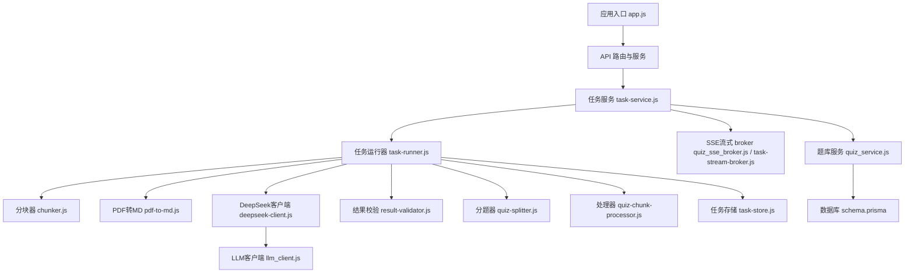
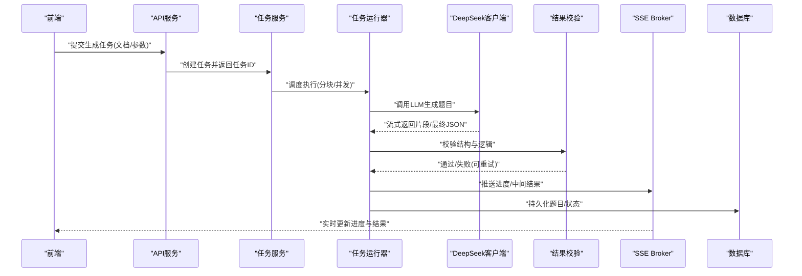
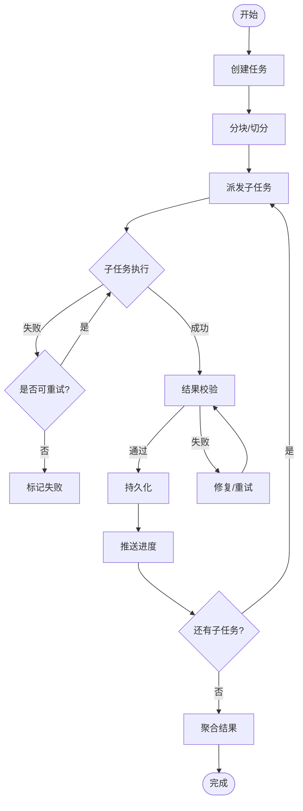
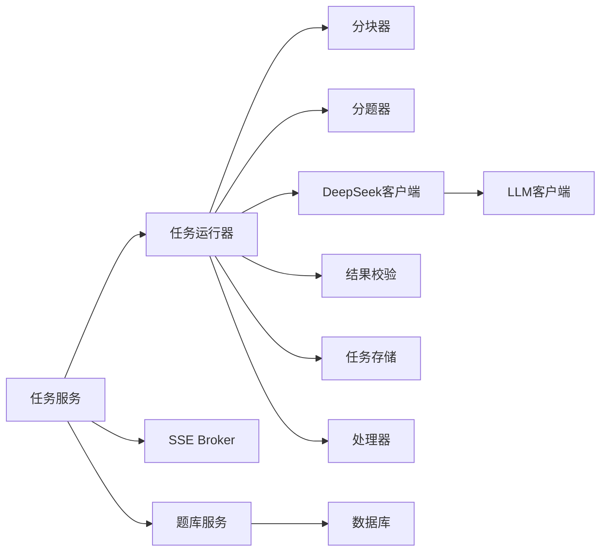

# AI辅助出题

<cite>
**本文引用的文件**   
- [app.js](file://node-jinmao/app.js)
- [deepseek_config.json](file://node-jinmao/config/deepseek_config.json)
- [md2quiz_prompt.md](file://node-jinmao/config/md2quiz_prompt.md)
- [quiz-format-prompt.md](file://node-jinmao/config/quiz-format-prompt.md)
- [quiz-split-prompt.md](file://node-jinmao/config/quiz-split-prompt.md)
- [prompt.json](file://node-jinmao/config/prompt.json)
- [chunker.js](file://node-jinmao/service/md2quiz/chunker.js)
- [deepseek-client.js](file://node-jinmao/service/md2quiz/deepseek-client.js)
- [pdf-to-md.js](file://node-jinmao/service/md2quiz/pdf-to-md.js)
- [quiz-chunk-processor.js](file://node-jinmao/service/md2quiz/quiz-chunk-processor.js)
- [quiz-splitter.js](file://node-jinmao/service/md2quiz/quiz-splitter.js)
- [result-validator.js](file://node-jinmao/service/md2quiz/result-validator.js)
- [task-runner.js](file://node-jinmao/service/md2quiz/task-runner.js)
- [task-service.js](file://node-jinmao/service/md2quiz/task-service.js)
- [task-store.js](file://node-jinmao/service/md2quiz/task-store.js)
- [task-stream-broker.js](file://node-jinmao/service/md2quiz/task-stream-broker.js)
- [types.js](file://node-jinmao/service/md2quiz/types.js)
- [quiz_service.js](file://node-jinmao/service/quiz_service.js)
- [quiz_sse_broker.js](file://node-jinmao/service/quiz_sse_broker.js)
- [llm_client.js](file://node-jinmao/utils/llm_client.js)
- [schema.prisma](file://node-jinmao/prisma/schema.prisma)
</cite>

## 目录
1. [简介](#简介)
2. [项目结构](#项目结构)
3. [核心组件](#核心组件)
4. [架构总览](#架构总览)
5. [详细组件分析](#详细组件分析)
6. [依赖关系分析](#依赖关系分析)
7. [性能考虑](#性能考虑)
8. [故障排查指南](#故障排查指南)
9. [结论](#结论)
10. [附录](#附录)

## 简介
本文件面向“AI辅助出题”功能，系统性阐述基于大语言模型的智能出题系统架构与实现要点。内容覆盖DeepSeek API集成、提示词工程、结果验证、任务调度（异步批量生成）、流式传输（实时进度与中间结果）、题目质量评估（语法检查、逻辑验证、难度评估）、提示词模板定制、错误重试与超时处理、资源管理等生产环境关键议题。读者无需深入代码细节即可理解整体设计思路与落地方案。

## 项目结构
后端服务以Node.js为核心，围绕“从文档到题库”的流水线组织：
- 配置层：集中管理模型配置、提示词模板与格式规范
- 数据层：Prisma数据库模型与迁移
- 服务层：PDF转Markdown、分块、调用LLM、结果校验、任务编排与持久化、SSE流式推送
- 工具层：通用LLM客户端封装、上传、鉴权等
- 入口层：应用启动与路由挂载

图表来源 
- [app.js](file://node-jinmao/app.js)
- [task-service.js](file://node-jinmao/service/md2quiz/task-service.js)
- [task-runner.js](file://node-jinmao/service/md2quiz/task-runner.js)
- [chunker.js](file://node-jinmao/service/md2quiz/chunker.js)
- [pdf-to-md.js](file://node-jinmao/service/md2quiz/pdf-to-md.js)
- [deepseek-client.js](file://node-jinmao/service/md2quiz/deepseek-client.js)
- [llm_client.js](file://node-jinmao/utils/llm_client.js)
- [result-validator.js](file://node-jinmao/service/md2quiz/result-validator.js)
- [quiz-splitter.js](file://node-jinmao/service/md2quiz/quiz-splitter.js)
- [quiz-chunk-processor.js](file://node-jinmao/service/md2quiz/quiz-chunk-processor.js)
- [task-store.js](file://node-jinmao/service/md2quiz/task-store.js)
- [quiz_sse_broker.js](file://node-jinmao/service/quiz_sse_broker.js)
- [task-stream-broker.js](file://node-jinmao/service/md2quiz/task-stream-broker.js)
- [quiz_service.js](file://node-jinmao/service/quiz_service.js)
- [schema.prisma](file://node-jinmao/prisma/schema.prisma)

章节来源
- [app.js](file://node-jinmao/app.js)
- [schema.prisma](file://node-jinmao/prisma/schema.prisma)

## 核心组件
- DeepSeek客户端：封装HTTP请求、鉴权、重试、超时、流式响应解析
- 提示词工程：集中管理多类提示词模板（生成、格式化、拆分）
- 分块与切分：将长文档切分为适合LLM处理的片段，并支持按题型/段落拆分
- 任务编排：创建任务、分配工作单元、并发控制、状态机流转、持久化
- 结果校验：对LLM输出进行结构化校验、语法与逻辑检查、难度评估
- 流式传输：通过SSE向客户端推送进度、中间结果与最终答案
- 题库服务：与数据库交互，持久化题目、报告、统计信息

章节来源
- [deepseek-client.js](file://node-jinmao/service/md2quiz/deepseek-client.js)
- [llm_client.js](file://node-jinmao/utils/llm_client.js)
- [md2quiz_prompt.md](file://node-jinmao/config/md2quiz_prompt.md)
- [quiz-format-prompt.md](file://node-jinmao/config/quiz-format-prompt.md)
- [quiz-split-prompt.md](file://node-jinmao/config/quiz-split-prompt.md)
- [prompt.json](file://node-jinmao/config/prompt.json)
- [chunker.js](file://node-jinmao/service/md2quiz/chunker.js)
- [quiz-splitter.js](file://node-jinmao/service/md2quiz/quiz-splitter.js)
- [task-service.js](file://node-jinmao/service/md2quiz/task-service.js)
- [task-runner.js](file://node-jinmao/service/md2quiz/task-runner.js)
- [task-store.js](file://node-jinmao/service/md2quiz/task-store.js)
- [result-validator.js](file://node-jinmao/service/md2quiz/result-validator.js)
- [quiz-chunk-processor.js](file://node-jinmao/service/md2quiz/quiz-chunk-processor.js)
- [quiz_sse_broker.js](file://node-jinmao/service/quiz_sse_broker.js)
- [task-stream-broker.js](file://node-jinmao/service/md2quiz/task-stream-broker.js)
- [quiz_service.js](file://node-jinmao/service/quiz_service.js)

## 架构总览
系统采用“任务驱动+流式反馈”的架构模式：
- 前端发起“生成题库”任务，后端返回任务ID
- 服务端将任务拆分为多个子任务（分块），并发执行
- 每个子任务调用DeepSeek生成题目，并进行结果校验
- 通过SSE实时推送进度、中间结果与最终汇总
- 最终结果持久化至数据库，并提供查询与导出能力

图表来源 
- [task-service.js](file://node-jinmao/service/md2quiz/task-service.js)
- [task-runner.js](file://node-jinmao/service/md2quiz/task-runner.js)
- [deepseek-client.js](file://node-jinmao/service/md2quiz/deepseek-client.js)
- [result-validator.js](file://node-jinmao/service/md2quiz/result-validator.js)
- [task-stream-broker.js](file://node-jinmao/service/md2quiz/task-stream-broker.js)
- [quiz_sse_broker.js](file://node-jinmao/service/quiz_sse_broker.js)
- [quiz_service.js](file://node-jinmao/service/quiz_service.js)
- [schema.prisma](file://node-jinmao/prisma/schema.prisma)

## 详细组件分析

### DeepSeek API集成与流式传输
- 职责：封装与DeepSeek的HTTP通信，支持鉴权、重试、超时、流式读取
- 关键点：
  - 使用流式接口获取增量token，降低首字延迟
  - 对网络异常、限流、超时进行指数退避重试
  - 将流式片段拼接为完整JSON，便于后续校验
- 建议：
  - 合理设置超时与最大重试次数，避免雪崩
  - 在流式阶段即推送进度事件，提升用户体验

章节来源
- [deepseek-client.js](file://node-jinmao/service/md2quiz/deepseek-client.js)
- [llm_client.js](file://node-jinmao/utils/llm_client.js)
- [deepseek_config.json](file://node-jinmao/config/deepseek_config.json)

### 提示词工程与模板管理
- 职责：统一管理各类提示词模板，确保输出稳定、结构化
- 模板分类：
  - 生成提示词：指导LLM根据知识点/段落生成题目
  - 格式化提示词：约束输出JSON结构、字段类型、枚举值
  - 拆分提示词：指导如何按题型或段落切分内容
- 最佳实践：
  - 明确输入上下文长度限制，避免截断
  - 提供示例输出，增强稳定性
  - 针对多题型分别优化提示词

章节来源
- [md2quiz_prompt.md](file://node-jinmao/config/md2quiz_prompt.md)
- [quiz-format-prompt.md](file://node-jinmao/config/quiz-format-prompt.md)
- [quiz-split-prompt.md](file://node-jinmao/config/quiz-split-prompt.md)
- [prompt.json](file://node-jinmao/config/prompt.json)

### 分块与切分策略
- 分块器：将长文本切分为固定大小或语义边界片段，适配LLM上下文窗口
- 分题器：根据题型规则与内容结构，进一步拆分出独立题目单元
- 目标：提高并行度、减少单次请求负载、提升成功率

章节来源
- [chunker.js](file://node-jinmao/service/md2quiz/chunker.js)
- [quiz-splitter.js](file://node-jinmao/service/md2quiz/quiz-splitter.js)

### 任务调度与状态机
- 任务服务：负责创建任务、分配子任务、监控进度、聚合结果
- 任务运行器：执行具体工作单元，协调LLM调用、校验、持久化
- 任务存储：维护任务状态、进度、错误信息，支持恢复与查询
- 状态流转：待处理→进行中→部分完成→完成/失败

图表来源 
- [task-service.js](file://node-jinmao/service/md2quiz/task-service.js)
- [task-runner.js](file://node-jinmao/service/md2quiz/task-runner.js)
- [task-store.js](file://node-jinmao/service/md2quiz/task-store.js)

章节来源
- [task-service.js](file://node-jinmao/service/md2quiz/task-service.js)
- [task-runner.js](file://node-jinmao/service/md2quiz/task-runner.js)
- [task-store.js](file://node-jinmao/service/md2quiz/task-store.js)

### 结果验证与质量评估
- 结构化校验：确保JSON字段齐全、类型正确、枚举合法
- 语法检查：检测语句通顺性、标点与格式一致性
- 逻辑验证：题干与选项自洽、答案唯一性、无歧义
- 难度评估：依据题型、知识点复杂度、干扰项设计等打分
- 回退策略：校验失败时触发修复提示或重新生成

章节来源
- [result-validator.js](file://node-jinmao/service/md2quiz/result-validator.js)
- [quiz-chunk-processor.js](file://node-jinmao/service/md2quiz/quiz-chunk-processor.js)

### 流式传输与实时反馈
- 机制：通过SSE持续推送事件，包含进度、中间结果、错误信息
- 前端体验：即时显示生成进度、逐步渲染题目、支持取消
- 可靠性：断线重连、事件去重、顺序保证

章节来源
- [task-stream-broker.js](file://node-jinmao/service/md2quiz/task-stream-broker.js)
- [quiz_sse_broker.js](file://node-jinmao/service/quiz_sse_broker.js)

### 题库服务与数据持久化
- 职责：题目CRUD、报告生成、统计分析、导入导出
- 模型：题目、课程、章节、用户学习记录、计费信息等
- 事务：批量插入、更新进度、回滚异常

章节来源
- [quiz_service.js](file://node-jinmao/service/quiz_service.js)
- [schema.prisma](file://node-jinmao/prisma/schema.prisma)

## 依赖关系分析
- 模块耦合：
  - 任务服务依赖运行器、存储、SSE Broker
  - 运行器依赖分块器、分题器、LLM客户端、校验器
  - LLM客户端依赖配置与网络库
- 外部依赖：
  - DeepSeek API：鉴权、限流、超时
  - 数据库：Prisma ORM、连接池
  - 文件处理：PDF转Markdown
- 潜在风险：
  - 循环依赖需避免
  - 外部API不稳定需降级与熔断

图表来源 
- [task-service.js](file://node-jinmao/service/md2quiz/task-service.js)
- [task-runner.js](file://node-jinmao/service/md2quiz/task-runner.js)
- [chunker.js](file://node-jinmao/service/md2quiz/chunker.js)
- [quiz-splitter.js](file://node-jinmao/service/md2quiz/quiz-splitter.js)
- [deepseek-client.js](file://node-jinmao/service/md2quiz/deepseek-client.js)
- [llm_client.js](file://node-jinmao/utils/llm_client.js)
- [result-validator.js](file://node-jinmao/service/md2quiz/result-validator.js)
- [task-store.js](file://node-jinmao/service/md2quiz/task-store.js)
- [quiz-chunk-processor.js](file://node-jinmao/service/md2quiz/quiz-chunk-processor.js)
- [quiz_sse_broker.js](file://node-jinmao/service/quiz_sse_broker.js)
- [task-stream-broker.js](file://node-jinmao/service/md2quiz/task-stream-broker.js)
- [quiz_service.js](file://node-jinmao/service/quiz_service.js)
- [schema.prisma](file://node-jinmao/prisma/schema.prisma)

章节来源
- [task-service.js](file://node-jinmao/service/md2quiz/task-service.js)
- [task-runner.js](file://node-jinmao/service/md2quiz/task-runner.js)
- [deepseek-client.js](file://node-jinmao/service/md2quiz/deepseek-client.js)
- [llm_client.js](file://node-jinmao/utils/llm_client.js)
- [result-validator.js](file://node-jinmao/service/md2quiz/result-validator.js)
- [task-store.js](file://node-jinmao/service/md2quiz/task-store.js)
- [quiz_sse_broker.js](file://node-jinmao/service/quiz_sse_broker.js)
- [task-stream-broker.js](file://node-jinmao/service/md2quiz/task-stream-broker.js)
- [quiz_service.js](file://node-jinmao/service/quiz_service.js)
- [schema.prisma](file://node-jinmao/prisma/schema.prisma)

## 性能考虑
- 并发控制：限制同时执行的子任务数，避免内存与CPU峰值
- 批处理：批量写入数据库，减少IO开销
- 缓存：对重复提示词与常见结果做短期缓存
- 流式优先：尽早返回首字节，提升感知速度
- 资源管理：连接池、文件句柄、临时文件清理
- 监控：指标采集（QPS、延迟、错误率）、日志分级、告警

[本节为通用指导，不直接分析具体文件]

## 故障排查指南
- 常见问题：
  - LLM超时/限流：检查配置、重试策略、退避算法
  - JSON解析失败：查看提示词与格式化约束，增加容错解析
  - 校验失败：定位字段缺失或逻辑矛盾，调整提示词或后处理
  - SSE中断：检查网络与代理，实现重连与事件幂等
- 诊断步骤：
  - 查看任务状态与错误堆栈
  - 抓取原始请求与响应
  - 复现最小用例，隔离问题模块
  - 启用调试日志与追踪ID

章节来源
- [task-store.js](file://node-jinmao/service/md2quiz/task-store.js)
- [task-runner.js](file://node-jinmao/service/md2quiz/task-runner.js)
- [result-validator.js](file://node-jinmao/service/md2quiz/result-validator.js)
- [task-stream-broker.js](file://node-jinmao/service/md2quiz/task-stream-broker.js)

## 结论
本系统以任务驱动为核心，结合流式传输与严格的结果校验，实现了高效、稳定的AI辅助出题流水线。通过模块化设计与清晰的依赖关系，既保证了可扩展性，也便于在生产环境中进行监控与调优。建议在后续迭代中持续优化提示词模板、增强质量评估维度，并完善监控与自愈能力。

[本节为总结性内容，不直接分析具体文件]

## 附录
- 提示词模板定制指南：
  - 明确输入范围与输出格式
  - 提供正反示例，强化约束
  - 针对多题型分别优化
  - 定期A/B测试效果
- 生产环境清单：
  - 环境变量与密钥管理
  - 超时与重试上限
  - 数据库连接池与索引
  - 日志与审计
  - 灰度发布与回滚

[本节为补充说明，不直接分析具体文件]