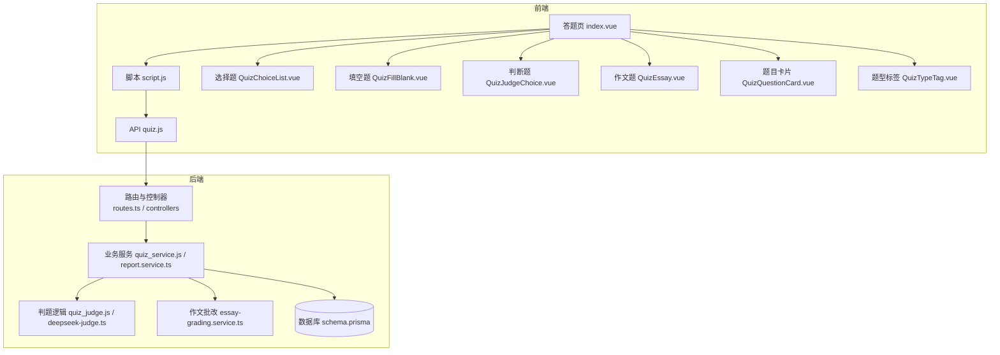
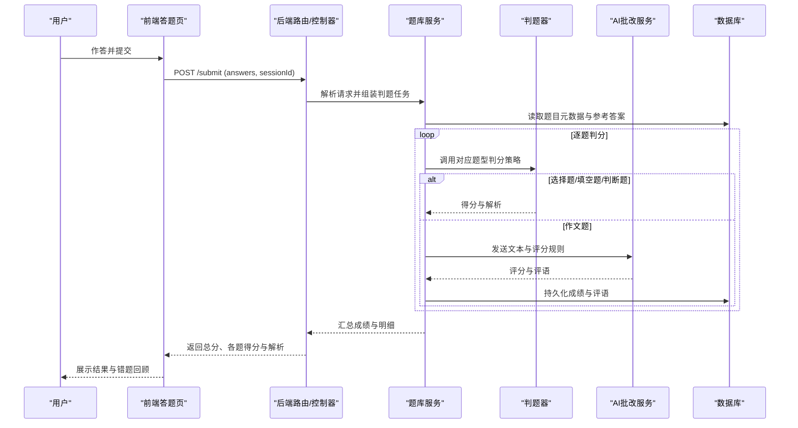
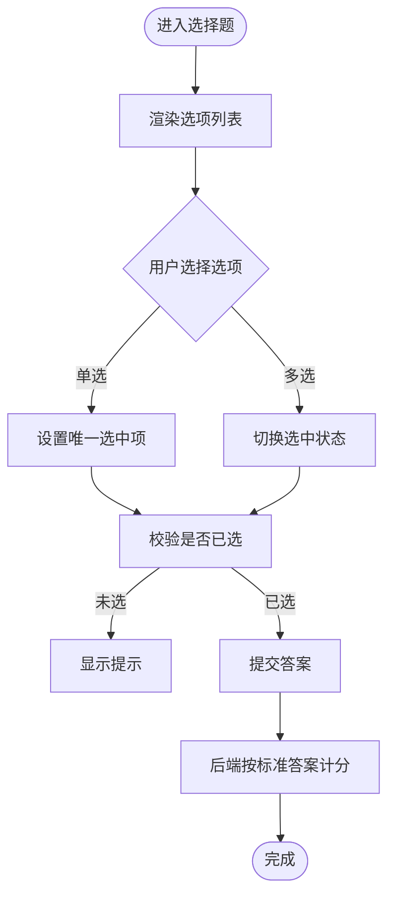
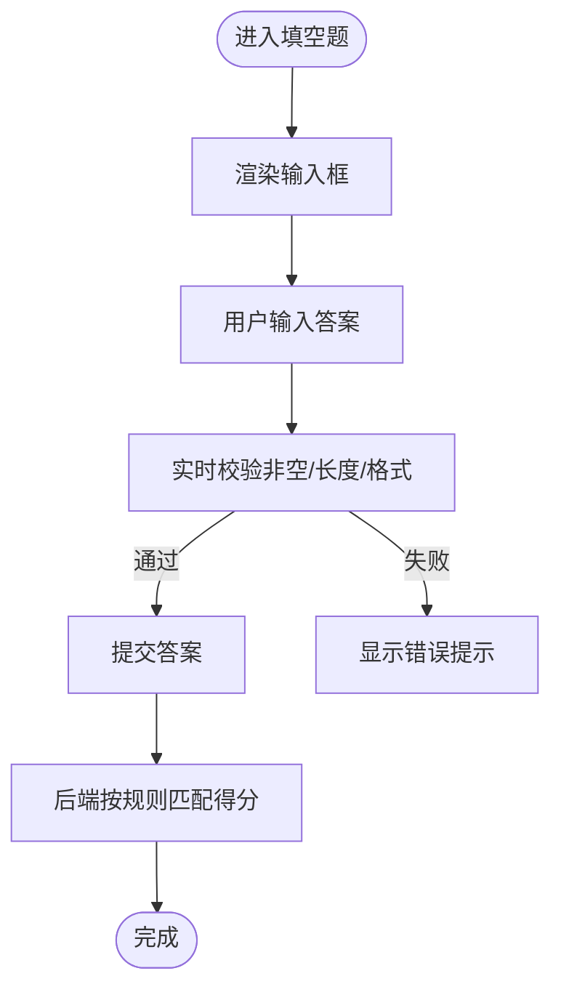
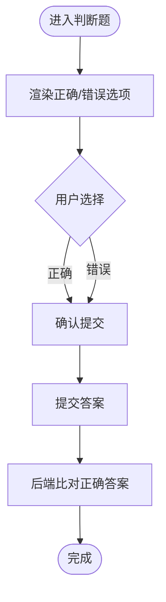
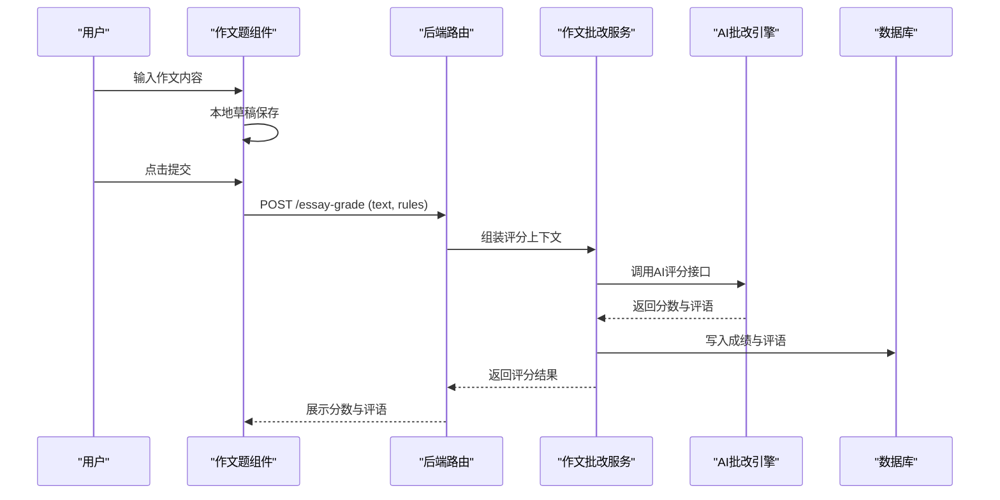
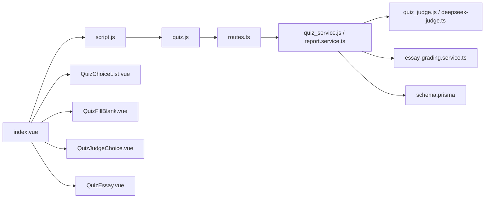

# 多题型支持

<cite>
**本文档引用的文件**   
- [QuizChoiceList.vue](file://WEB/src/components/quiz/QuizChoiceList.vue)
- [QuizFillBlank.vue](file://WEB/src/components/quiz/QuizFillBlank.vue)
- [QuizJudgeChoice.vue](file://WEB/src/components/quiz/QuizJudgeChoice.vue)
- [QuizEssay.vue](file://WEB/src/components/quiz/QuizEssay.vue)
- [QuizQuestionCard.vue](file://WEB/src/components/quiz/QuizQuestionCard.vue)
- [QuizTypeTag.vue](file://WEB/src/components/quiz/QuizTypeTag.vue)
- [script.js](file://WEB/src/pages/quiz/script.js)
- [index.vue](file://WEB/src/pages/quiz/index.vue)
- [quiz.js](file://WEB/src/api/quiz.js)
- [schema.prisma](file://node-jinmao/prisma/schema.prisma)
- [quiz_service.js](file://node-jinmao/service/quiz_service.js)
- [quiz_judge.js](file://node-jinmao/service/quiz_judge.js)
- [essay-grading.service.ts](file://test/金毛刷题/backend/src/modules/quiz/essay-grading.service.ts)
- [deepseek-judge.ts](file://test/金毛刷题/backend/src/modules/quiz/deepseek-judge.ts)
- [report.service.ts](file://test/金毛刷题/backend/src/modules/quiz/report.service.ts)
- [routes.ts](file://test/金毛刷题/backend/src/modules/quiz/routes.ts)
</cite>

## 目录
1. [简介](#简介)
2. [项目结构](#项目结构)
3. [核心组件](#核心组件)
4. [架构总览](#架构总览)
5. [详细组件分析](#详细组件分析)
6. [依赖关系分析](#依赖关系分析)
7. [性能考量](#性能考量)
8. [故障排查指南](#故障排查指南)
9. [结论](#结论)
10. [附录：扩展新题型完整指南](#附录扩展新题型完整指南)

## 简介
本文件面向“多题型支持”能力，系统性阐述系统如何统一承载选择题、填空题、判断题与作文题。内容覆盖前端UI组件设计（选项渲染、输入验证、答案提交）、后端判分算法（含作文题AI自动批改机制），以及扩展新题型的端到端步骤（前端组件、后端处理、数据库字段扩展）。文档以仓库现有实现为依据，提供可追溯的源码定位与图示说明，帮助读者快速理解并安全扩展。

## 项目结构
本项目采用前后端分离架构：
- 前端（Vue）位于 WEB 目录，包含题库答题相关页面与通用组件。
- 后端（Node/Express + Prisma）位于 node-jinmao 目录，提供题库、会话、报告等API；另有一个 TypeScript 版本的示例模块 test/金毛刷题/backend/src/modules/quiz 用于展示更完善的判题与AI批改流程。

图表来源
- [index.vue](file://WEB/src/pages/quiz/index.vue)
- [script.js](file://WEB/src/pages/quiz/script.js)
- [quiz.js](file://WEB/src/api/quiz.js)
- [routes.ts](file://test/金毛刷题/backend/src/modules/quiz/routes.ts)
- [quiz_service.js](file://node-jinmao/service/quiz_service.js)
- [quiz_judge.js](file://node-jinmao/service/quiz_judge.js)
- [essay-grading.service.ts](file://test/金毛刷题/backend/src/modules/quiz/essay-grading.service.ts)
- [deepseek-judge.ts](file://test/金毛刷题/backend/src/modules/quiz/deepseek-judge.ts)
- [schema.prisma](file://node-jinmao/prisma/schema.prisma)

章节来源
- [index.vue](file://WEB/src/pages/quiz/index.vue)
- [script.js](file://WEB/src/pages/quiz/script.js)
- [quiz.js](file://WEB/src/api/quiz.js)
- [schema.prisma](file://node-jinmao/prisma/schema.prisma)

## 核心组件
- 题型标签组件：统一渲染题型标识，便于用户识别当前题目类型。
- 题目卡片组件：封装题干、分值、提示、交互状态等公共逻辑。
- 四种题型组件：分别实现选项渲染、输入校验、答案收集与提交。
- 答题页与脚本：负责题目列表加载、进度管理、批量提交与结果回显。

章节来源
- [QuizTypeTag.vue](file://WEB/src/components/quiz/QuizTypeTag.vue)
- [QuizQuestionCard.vue](file://WEB/src/components/quiz/QuizQuestionCard.vue)
- [QuizChoiceList.vue](file://WEB/src/components/quiz/QuizChoiceList.vue)
- [QuizFillBlank.vue](file://WEB/src/components/quiz/QuizFillBlank.vue)
- [QuizJudgeChoice.vue](file://WEB/src/components/quiz/QuizJudgeChoice.vue)
- [QuizEssay.vue](file://WEB/src/components/quiz/QuizEssay.vue)
- [index.vue](file://WEB/src/pages/quiz/index.vue)
- [script.js](file://WEB/src/pages/quiz/script.js)

## 架构总览
整体数据流遵循“前端组件收集答案 → 统一提交接口 → 后端按题型分发判分 → 返回分数与解析”的模式。作文题通过AI服务进行语义评分与反馈生成。

图表来源
- [script.js](file://WEB/src/pages/quiz/script.js)
- [quiz.js](file://WEB/src/api/quiz.js)
- [routes.ts](file://test/金毛刷题/backend/src/modules/quiz/routes.ts)
- [quiz_service.js](file://node-jinmao/service/quiz_service.js)
- [quiz_judge.js](file://node-jinmao/service/quiz_judge.js)
- [essay-grading.service.ts](file://test/金毛刷题/backend/src/modules/quiz/essay-grading.service.ts)
- [deepseek-judge.ts](file://test/金毛刷题/backend/src/modules/quiz/deepseek-judge.ts)

## 详细组件分析

### 选择题（单选/多选）
- UI设计：选项列表渲染、选中态高亮、禁用态控制、错误提示。
- 交互逻辑：维护本地选择状态，支持清空与重置；提交前进行必填校验。
- 数据模型：选项数组、正确答案集合、用户答案集合。
- 提交与判分：后端根据标准答案计算匹配度，支持部分得分策略。

章节来源
- [QuizChoiceList.vue](file://WEB/src/components/quiz/QuizChoiceList.vue)
- [QuizQuestionCard.vue](file://WEB/src/components/quiz/QuizQuestionCard.vue)
- [script.js](file://WEB/src/pages/quiz/script.js)

### 填空题
- UI设计：单行或多行输入框，支持占位符与长度限制。
- 交互逻辑：实时校验（非空、格式、长度），提交前二次确认。
- 数据模型：期望答案数组或正则表达式，用户输入字符串。
- 判分策略：精确匹配或模糊匹配（忽略大小写、空格、同义词替换）。

章节来源
- [QuizFillBlank.vue](file://WEB/src/components/quiz/QuizFillBlank.vue)
- [QuizQuestionCard.vue](file://WEB/src/components/quiz/QuizQuestionCard.vue)
- [script.js](file://WEB/src/pages/quiz/script.js)

### 判断题
- UI设计：二元选项（正确/错误），简洁直观。
- 交互逻辑：强制二选一，禁止空白提交。
- 数据模型：布尔型正确答案，用户布尔选择。
- 判分策略：完全一致即得分，否则不得分。

章节来源
- [QuizJudgeChoice.vue](file://WEB/src/components/quiz/QuizJudgeChoice.vue)
- [QuizQuestionCard.vue](file://WEB/src/components/quiz/QuizQuestionCard.vue)
- [script.js](file://WEB/src/pages/quiz/script.js)

### 作文题（AI自动批改）
- UI设计：大文本编辑器，支持字数统计、保存草稿、提交按钮。
- 交互逻辑：本地草稿持久化，提交时发送全文与评分规则。
- 判分策略：调用AI服务进行语义评分、要点覆盖检查、语法纠错与建议。
- 结果展示：分数、评语、改进建议、关键词命中情况。

章节来源
- [QuizEssay.vue](file://WEB/src/components/quiz/QuizEssay.vue)
- [essay-grading.service.ts](file://test/金毛刷题/backend/src/modules/quiz/essay-grading.service.ts)
- [deepseek-judge.ts](file://test/金毛刷题/backend/src/modules/quiz/deepseek-judge.ts)
- [script.js](file://WEB/src/pages/quiz/script.js)

## 依赖关系分析
- 前端依赖：答题页依赖题型组件与API层；题型组件依赖题目卡片与题型标签。
- 后端依赖：路由层依赖服务层；服务层依赖判题器与AI批改服务；所有数据访问依赖Prisma模型。
- 外部依赖：AI批改服务（如DeepSeek）通过HTTP调用，需配置密钥与超时策略。

图表来源
- [index.vue](file://WEB/src/pages/quiz/index.vue)
- [script.js](file://WEB/src/pages/quiz/script.js)
- [quiz.js](file://WEB/src/api/quiz.js)
- [routes.ts](file://test/金毛刷题/backend/src/modules/quiz/routes.ts)
- [quiz_service.js](file://node-jinmao/service/quiz_service.js)
- [quiz_judge.js](file://node-jinmao/service/quiz_judge.js)
- [essay-grading.service.ts](file://test/金毛刷题/backend/src/modules/quiz/essay-grading.service.ts)
- [schema.prisma](file://node-jinmao/prisma/schema.prisma)

章节来源
- [routes.ts](file://test/金毛刷题/backend/src/modules/quiz/routes.ts)
- [quiz_service.js](file://node-jinmao/service/quiz_service.js)
- [quiz_judge.js](file://node-jinmao/service/quiz_judge.js)
- [essay-grading.service.ts](file://test/金毛刷题/backend/src/modules/quiz/essay-grading.service.ts)
- [schema.prisma](file://node-jinmao/prisma/schema.prisma)

## 性能考量
- 前端：
  - 大量题目时采用分页或懒加载，避免一次性渲染导致卡顿。
  - 输入校验使用防抖与节流，减少无效请求。
  - 作文题草稿本地存储，降低网络压力。
- 后端：
  - 判题任务异步化，避免阻塞主线程。
  - AI批改服务增加重试与超时熔断，提升稳定性。
  - 数据库查询优化索引，减少IO开销。
- 缓存：
  - 热点题目与参考答案可缓存，提高命中率。
  - 作文评分结果短期缓存，避免重复计算。

[本节为通用指导，不直接分析具体文件]

## 故障排查指南
- 前端常见问题：
  - 选项未选中导致提交失败：检查组件内校验逻辑与状态绑定。
  - 输入框校验误报：核对正则表达式与边界条件。
  - 作文提交失败：检查网络请求与AI服务响应码。
- 后端常见问题：
  - 判题结果为0分：核对参考答案格式与匹配策略。
  - AI批改超时：检查服务配置与并发限制。
  - 数据不一致：核对事务与幂等性处理。
- 调试建议：
  - 启用详细日志，记录关键步骤与异常堆栈。
  - 使用Mock数据隔离问题域，逐步定位根因。

章节来源
- [script.js](file://WEB/src/pages/quiz/script.js)
- [quiz.js](file://WEB/src/api/quiz.js)
- [quiz_service.js](file://node-jinmao/service/quiz_service.js)
- [quiz_judge.js](file://node-jinmao/service/quiz_judge.js)
- [essay-grading.service.ts](file://test/金毛刷题/backend/src/modules/quiz/essay-grading.service.ts)

## 结论
系统通过统一的前端组件与后端判题框架，实现了选择题、填空题、判断题与作文题的完整闭环。作文题借助AI服务实现智能评分与反馈，提升了用户体验与教学价值。扩展新题型只需遵循既定模式，即可快速集成。

[本节为总结性内容，不直接分析具体文件]

## 附录：扩展新题型完整指南
目标：新增一种自定义题型（例如“排序题”或“连线题”），涵盖前端组件、后端处理与数据库字段扩展。

步骤概览
- 前端开发
  - 新建题型组件：定义数据结构、渲染逻辑、交互行为与校验规则。
  - 集成到答题页：在题目卡片中根据题型枚举动态渲染对应组件。
  - 提交逻辑：将用户答案序列化为统一格式，随其他题目一并提交。
- 后端处理
  - 路由与控制器：接收新题型的答案字段，透传到服务层。
  - 服务层：新增判题策略，实现匹配算法与得分计算。
  - AI扩展（可选）：如需智能评分，接入AI服务并定义评分规则。
- 数据库扩展
  - 模型变更：在schema中添加必要字段（如排序答案、权重等）。
  - 迁移执行：生成并应用迁移脚本，确保数据一致性。
- 测试与发布
  - 单元测试：覆盖判题逻辑与边界条件。
  - 集成测试：模拟完整答题流程，验证端到端正确性。
  - 灰度发布：小范围验证后全量上线。

代码示例路径（参考现有实现）
- 前端组件模板：参见选择题、填空题、判断题、作文题组件的实现方式。
- 后端判题策略：参考 quiz_judge.js 与 deepseek-judge.ts 的策略模式。
- 作文批改服务：参考 essay-grading.service.ts 的服务结构与调用流程。
- 数据库模型：参考 schema.prisma 的实体定义与关联关系。

章节来源
- [QuizChoiceList.vue](file://WEB/src/components/quiz/QuizChoiceList.vue)
- [QuizFillBlank.vue](file://WEB/src/components/quiz/QuizFillBlank.vue)
- [QuizJudgeChoice.vue](file://WEB/src/components/quiz/QuizJudgeChoice.vue)
- [QuizEssay.vue](file://WEB/src/components/quiz/QuizEssay.vue)
- [quiz_judge.js](file://node-jinmao/service/quiz_judge.js)
- [deepseek-judge.ts](file://test/金毛刷题/backend/src/modules/quiz/deepseek-judge.ts)
- [essay-grading.service.ts](file://test/金毛刷题/backend/src/modules/quiz/essay-grading.service.ts)
- [schema.prisma](file://node-jinmao/prisma/schema.prisma)