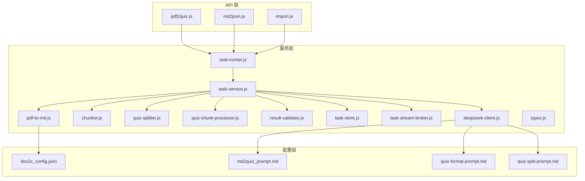
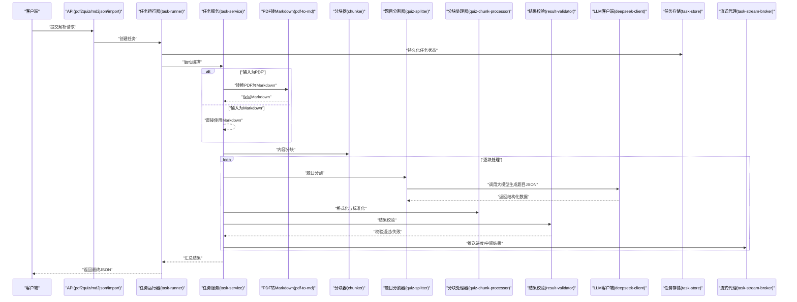
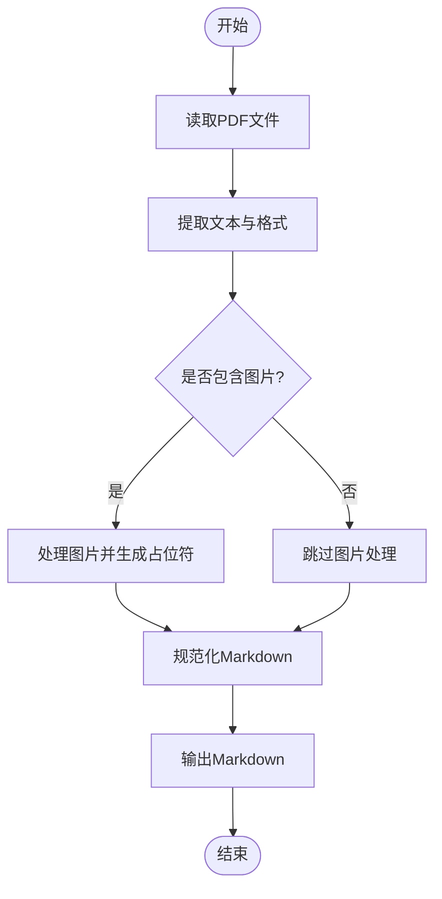
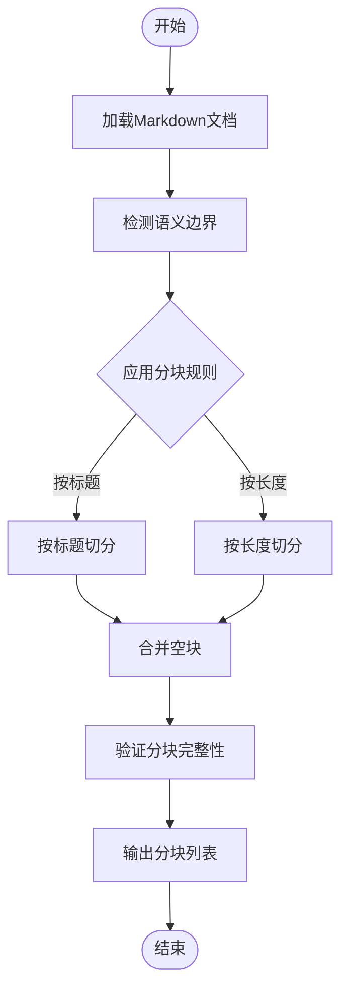
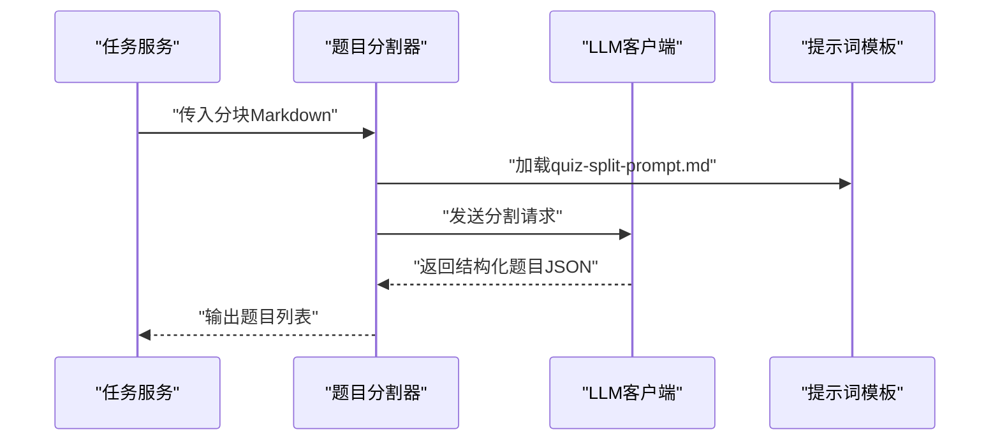
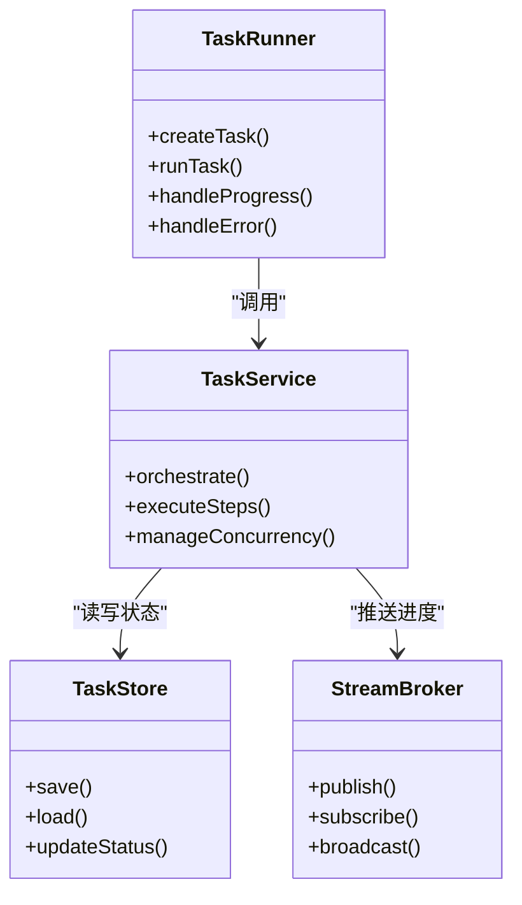
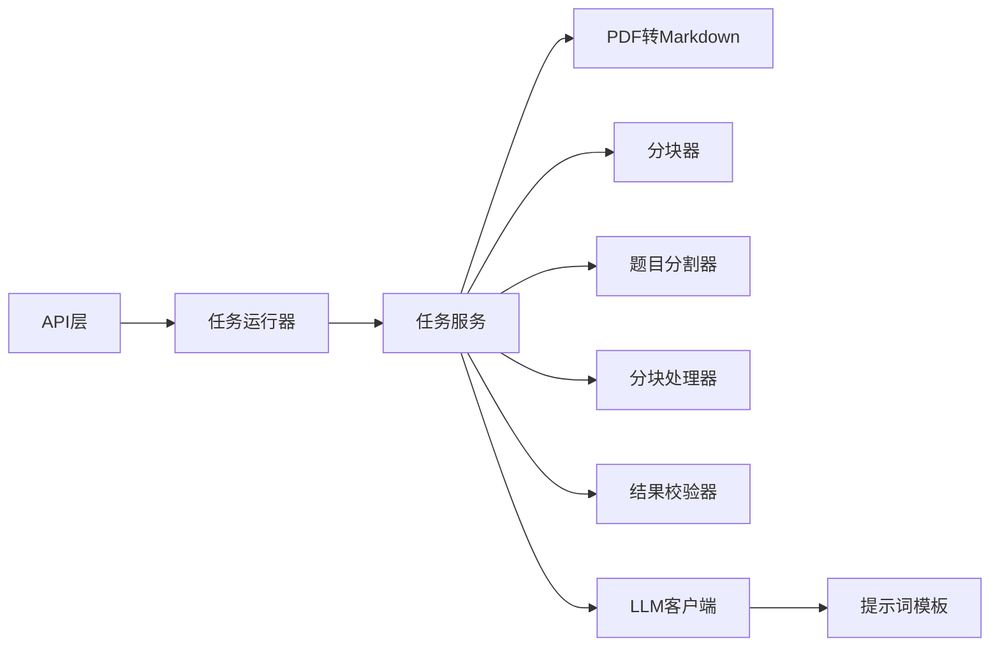

# 文档解析引擎

<cite>
**本文引用的文件**   
- [pdf2quiz.js](file://node-jinmao/API/quiz/pdf2quiz.js)
- [md2json.js](file://node-jinmao/API/quiz/md2json.js)
- [import.js](file://node-jinmao/API/quiz/import.js)
- [pdf-to-md.js](file://node-jinmao/service/md2quiz/pdf-to-md.js)
- [chunker.js](file://node-jinmao/service/md2quiz/chunker.js)
- [quiz-splitter.js](file://node-jinmao/service/md2quiz/quiz-splitter.js)
- [quiz-chunk-processor.js](file://node-jinmao/service/md2quiz/quiz-chunk-processor.js)
- [result-validator.js](file://node-jinmao/service/md2quiz/result-validator.js)
- [task-runner.js](file://node-jinmao/service/md2quiz/task-runner.js)
- [task-service.js](file://node-jinmao/service/md2quiz/task-service.js)
- [task-store.js](file://node-jinmao/service/md2quiz/task-store.js)
- [task-stream-broker.js](file://node-jinmao/service/md2quiz/task-stream-broker.js)
- [deepseek-client.js](file://node-jinmao/service/md2quiz/deepseek-client.js)
- [types.js](file://node-jinmao/service/md2quiz/types.js)
- [doc2x_config.json](file://node-jinmao/config/doc2x_config.json)
- [md2quiz_prompt.md](file://node-jinmao/config/md2quiz_prompt.md)
- [quiz-format-prompt.md](file://node-jinmao/config/quiz-format-prompt.md)
- [quiz-split-prompt.md](file://node-jinmao/config/quiz-split-prompt.md)
</cite>

## 目录
1. [简介](#简介)
2. [项目结构](#项目结构)
3. [核心组件](#核心组件)
4. [架构总览](#架构总览)
5. [详细组件分析](#详细组件分析)
6. [依赖关系分析](#依赖关系分析)
7. [性能考量](#性能考量)
8. [故障排查指南](#故障排查指南)
9. [结论](#结论)
10. [附录](#附录)

## 简介
本文件为“文档解析引擎”的综合技术文档，聚焦于将 Markdown 与 PDF 文档转换为结构化题目的完整实现。内容涵盖：
- PDF 转 Markdown 的处理流程（文本提取、格式保留、图片处理）
- 内容分块算法（长文档切分为可管理的章节）
- 题目分割策略（从连续文本中识别并提取独立题目单元）
- 配置选项说明（解析规则定制、分块大小调整、特殊格式处理）
- 错误处理与异常恢复机制（保障解析稳定性）

该引擎以 Node.js 服务为核心，结合 LLM 提示词与任务编排，提供高可用、可扩展的文档到题目的转换能力。

## 项目结构
本项目采用分层组织方式：
- API 层：对外暴露接口，负责请求路由与参数校验
- 服务层：业务逻辑编排，包含 PDF→Markdown、Markdown→题目、分块与拆分、结果校验等
- 配置层：提示词模板与外部服务配置
- 工具层：通用工具与类型定义

**图表来源** 
- [pdf2quiz.js](file://node-jinmao/API/quiz/pdf2quiz.js)
- [md2json.js](file://node-jinmao/API/quiz/md2json.js)
- [import.js](file://node-jinmao/API/quiz/import.js)
- [pdf-to-md.js](file://node-jinmao/service/md2quiz/pdf-to-md.js)
- [chunker.js](file://node-jinmao/service/md2quiz/chunker.js)
- [quiz-splitter.js](file://node-jinmao/service/md2quiz/quiz-splitter.js)
- [quiz-chunk-processor.js](file://node-jinmao/service/md2quiz/quiz-chunk-processor.js)
- [result-validator.js](file://node-jinmao/service/md2quiz/result-validator.js)
- [task-runner.js](file://node-jinmao/service/md2quiz/task-runner.js)
- [task-service.js](file://node-jinmao/service/md2quiz/task-service.js)
- [task-store.js](file://node-jinmao/service/md2quiz/task-store.js)
- [task-stream-broker.js](file://node-jinmao/service/md2quiz/task-stream-broker.js)
- [deepseek-client.js](file://node-jinmao/service/md2quiz/deepseek-client.js)
- [types.js](file://node-jinmao/service/md2quiz/types.js)
- [doc2x_config.json](file://node-jinmao/config/doc2x_config.json)
- [md2quiz_prompt.md](file://node-jinmao/config/md2quiz_prompt.md)
- [quiz-format-prompt.md](file://node-jinmao/config/quiz-format-prompt.md)
- [quiz-split-prompt.md](file://node-jinmao/config/quiz-split-prompt.md)

**章节来源**
- [pdf2quiz.js](file://node-jinmao/API/quiz/pdf2quiz.js)
- [md2json.js](file://node-jinmao/API/quiz/md2json.js)
- [import.js](file://node-jinmao/API/quiz/import.js)
- [pdf-to-md.js](file://node-jinmao/service/md2quiz/pdf-to-md.js)
- [chunker.js](file://node-jinmao/service/md2quiz/chunker.js)
- [quiz-splitter.js](file://node-jinmao/service/md2quiz/quiz-splitter.js)
- [quiz-chunk-processor.js](file://node-jinmao/service/md2quiz/quiz-chunk-processor.js)
- [result-validator.js](file://node-jinmao/service/md2quiz/result-validator.js)
- [task-runner.js](file://node-jinmao/service/md2quiz/task-runner.js)
- [task-service.js](file://node-jinmao/service/md2quiz/task-service.js)
- [task-store.js](file://node-jinmao/service/md2quiz/task-store.js)
- [task-stream-broker.js](file://node-jinmao/service/md2quiz/task-stream-broker.js)
- [deepseek-client.js](file://node-jinmao/service/md2quiz/deepseek-client.js)
- [types.js](file://node-jinmao/service/md2quiz/types.js)
- [doc2x_config.json](file://node-jinmao/config/doc2x_config.json)
- [md2quiz_prompt.md](file://node-jinmao/config/md2quiz_prompt.md)
- [quiz-format-prompt.md](file://node-jinmao/config/quiz-format-prompt.md)
- [quiz-split-prompt.md](file://node-jinmao/config/quiz-split-prompt.md)

## 核心组件
- PDF→Markdown 转换器：负责从 PDF 中提取文本、保留基础格式、处理图片占位与引用
- 内容分块器：按语义边界或固定长度对长文档进行切分，便于后续处理
- 题目分割器：基于提示词与规则，从 Markdown 文本中识别并抽取独立题目单元
- 分块处理器：对每个分块执行格式化、标准化与预处理
- 结果校验器：校验输出结构是否符合题目 JSON 规范
- 任务编排器：统一调度各步骤，支持并发、重试、进度上报与流式推送
- LLM 客户端：调用大模型完成智能分割与格式化
- 类型定义：统一的输入输出类型约束

**章节来源**
- [pdf-to-md.js](file://node-jinmao/service/md2quiz/pdf-to-md.js)
- [chunker.js](file://node-jinmao/service/md2quiz/chunker.js)
- [quiz-splitter.js](file://node-jinmao/service/md2quiz/quiz-splitter.js)
- [quiz-chunk-processor.js](file://node-jinmao/service/md2quiz/quiz-chunk-processor.js)
- [result-validator.js](file://node-jinmao/service/md2quiz/result-validator.js)
- [task-runner.js](file://node-jinmao/service/md2quiz/task-runner.js)
- [task-service.js](file://node-jinmao/service/md2quiz/task-service.js)
- [task-store.js](file://node-jinmao/service/md2quiz/task-store.js)
- [task-stream-broker.js](file://node-jinmao/service/md2quiz/task-stream-broker.js)
- [deepseek-client.js](file://node-jinmao/service/md2quiz/deepseek-client.js)
- [types.js](file://node-jinmao/service/md2quiz/types.js)

## 架构总览
整体流程如下：
- API 接收导入请求（PDF/Markdown）
- 任务编排器创建任务并持久化状态
- 若为 PDF，先转换为 Markdown；否则直接使用 Markdown
- 对内容进行分块，逐块进行题目分割与格式化
- 通过 LLM 生成结构化题目 JSON
- 校验结果并返回，同时通过流式通道推送进度

**图表来源** 
- [pdf2quiz.js](file://node-jinmao/API/quiz/pdf2quiz.js)
- [md2json.js](file://node-jinmao/API/quiz/md2json.js)
- [import.js](file://node-jinmao/API/quiz/import.js)
- [task-runner.js](file://node-jinmao/service/md2quiz/task-runner.js)
- [task-service.js](file://node-jinmao/service/md2quiz/task-service.js)
- [pdf-to-md.js](file://node-jinmao/service/md2quiz/pdf-to-md.js)
- [chunker.js](file://node-jinmao/service/md2quiz/chunker.js)
- [quiz-splitter.js](file://node-jinmao/service/md2quiz/quiz-splitter.js)
- [quiz-chunk-processor.js](file://node-jinmao/service/md2quiz/quiz-chunk-processor.js)
- [result-validator.js](file://node-jinmao/service/md2quiz/result-validator.js)
- [deepseek-client.js](file://node-jinmao/service/md2quiz/deepseek-client.js)
- [task-store.js](file://node-jinmao/service/md2quiz/task-store.js)
- [task-stream-broker.js](file://node-jinmao/service/md2quiz/task-stream-broker.js)

## 详细组件分析

### PDF→Markdown 转换器
职责：
- 读取 PDF 文件，提取文本与基础格式
- 处理图片：提取图片路径/占位符，建立引用映射
- 输出标准 Markdown，便于后续分块与分割

关键点：
- 文本提取需尽量保留标题层级、列表、表格等结构
- 图片处理应生成稳定的占位标记，避免破坏文本流
- 异常捕获与降级策略（如无法提取图片时跳过并记录）

**图表来源** 
- [pdf-to-md.js](file://node-jinmao/service/md2quiz/pdf-to-md.js)
- [doc2x_config.json](file://node-jinmao/config/doc2x_config.json)

**章节来源**
- [pdf-to-md.js](file://node-jinmao/service/md2quiz/pdf-to-md.js)
- [doc2x_config.json](file://node-jinmao/config/doc2x_config.json)

### 内容分块器
职责：
- 根据语义边界（标题、段落）或固定长度对长文档进行切分
- 保证每个分块具备相对完整的上下文，便于后续题目分割

关键点：
- 分块大小可调，平衡内存占用与处理效率
- 保持跨分块的连续性信息（如题号、题干延续）
- 空块过滤与合并策略

**图表来源** 
- [chunker.js](file://node-jinmao/service/md2quiz/chunker.js)

**章节来源**
- [chunker.js](file://node-jinmao/service/md2quiz/chunker.js)

### 题目分割器
职责：
- 基于提示词与大模型，从 Markdown 文本中识别并抽取独立题目单元
- 输出结构化 JSON，包含题干、选项、答案、题型等字段

关键点：
- 提示词模板驱动（quiz-split-prompt.md）
- 支持多种题型（选择、判断、填空、简答等）
- 容错与回退：当分割失败时尝试简化提示或重试

**图表来源** 
- [quiz-splitter.js](file://node-jinmao/service/md2quiz/quiz-splitter.js)
- [deepseek-client.js](file://node-jinmao/service/md2quiz/deepseek-client.js)
- [quiz-split-prompt.md](file://node-jinmao/config/quiz-split-prompt.md)

**章节来源**
- [quiz-splitter.js](file://node-jinmao/service/md2quiz/quiz-splitter.js)
- [deepseek-client.js](file://node-jinmao/service/md2quiz/deepseek-client.js)
- [quiz-split-prompt.md](file://node-jinmao/config/quiz-split-prompt.md)

### 分块处理器
职责：
- 对每个分块进行格式化、标准化与预处理
- 清理冗余字符、统一编码、修复断行与空格

关键点：
- 支持自定义清洗规则
- 与题目分割器协作，确保输入质量

**章节来源**
- [quiz-chunk-processor.js](file://node-jinmao/service/md2quiz/quiz-chunk-processor.js)

### 结果校验器
职责：
- 校验输出的题目 JSON 是否符合规范
- 检查必填字段、数据类型、取值范围等

关键点：
- 快速失败：发现严重错误立即返回
- 软校验：非关键问题记录警告但不中断

**章节来源**
- [result-validator.js](file://node-jinmao/service/md2quiz/result-validator.js)

### 任务编排器（运行器与服务）
职责：
- 统一调度 PDF→Markdown、分块、分割、格式化、校验等步骤
- 管理任务生命周期、并发控制、重试与进度上报

关键点：
- 支持异步任务与流式推送
- 持久化任务状态，便于恢复与查询

**图表来源** 
- [task-runner.js](file://node-jinmao/service/md2quiz/task-runner.js)
- [task-service.js](file://node-jinmao/service/md2quiz/task-service.js)
- [task-store.js](file://node-jinmao/service/md2quiz/task-store.js)
- [task-stream-broker.js](file://node-jinmao/service/md2quiz/task-stream-broker.js)

**章节来源**
- [task-runner.js](file://node-jinmao/service/md2quiz/task-runner.js)
- [task-service.js](file://node-jinmao/service/md2quiz/task-service.js)
- [task-store.js](file://node-jinmao/service/md2quiz/task-store.js)
- [task-stream-broker.js](file://node-jinmao/service/md2quiz/task-stream-broker.js)

### LLM 客户端
职责：
- 封装大模型调用逻辑，包括请求构建、响应解析、错误处理
- 支持多提示词模板（md2quiz_prompt.md、quiz-format-prompt.md、quiz-split-prompt.md）

关键点：
- 超时与重试机制
- 日志与监控

**章节来源**
- [deepseek-client.js](file://node-jinmao/service/md2quiz/deepseek-client.js)
- [md2quiz_prompt.md](file://node-jinmao/config/md2quiz_prompt.md)
- [quiz-format-prompt.md](file://node-jinmao/config/quiz-format-prompt.md)
- [quiz-split-prompt.md](file://node-jinmao/config/quiz-split-prompt.md)

### 类型定义
职责：
- 统一定义输入输出数据结构，确保模块间契约一致

关键点：
- 强类型约束，减少运行时错误
- 便于前端对接与测试

**章节来源**
- [types.js](file://node-jinmao/service/md2quiz/types.js)

## 依赖关系分析
- API 层依赖任务运行器，不直接耦合具体处理逻辑
- 服务层内部模块低耦合，通过明确接口交互
- 配置与提示词模板解耦，便于替换与扩展
- LLM 客户端作为外部依赖，具备容错与降级能力

**图表来源** 
- [pdf2quiz.js](file://node-jinmao/API/quiz/pdf2quiz.js)
- [md2json.js](file://node-jinmao/API/quiz/md2json.js)
- [import.js](file://node-jinmao/API/quiz/import.js)
- [task-runner.js](file://node-jinmao/service/md2quiz/task-runner.js)
- [task-service.js](file://node-jinmao/service/md2quiz/task-service.js)
- [pdf-to-md.js](file://node-jinmao/service/md2quiz/pdf-to-md.js)
- [chunker.js](file://node-jinmao/service/md2quiz/chunker.js)
- [quiz-splitter.js](file://node-jinmao/service/md2quiz/quiz-splitter.js)
- [quiz-chunk-processor.js](file://node-jinmao/service/md2quiz/quiz-chunk-processor.js)
- [result-validator.js](file://node-jinmao/service/md2quiz/result-validator.js)
- [deepseek-client.js](file://node-jinmao/service/md2quiz/deepseek-client.js)
- [md2quiz_prompt.md](file://node-jinmao/config/md2quiz_prompt.md)
- [quiz-format-prompt.md](file://node-jinmao/config/quiz-format-prompt.md)
- [quiz-split-prompt.md](file://node-jinmao/config/quiz-split-prompt.md)

**章节来源**
- [pdf2quiz.js](file://node-jinmao/API/quiz/pdf2quiz.js)
- [md2json.js](file://node-jinmao/API/quiz/md2json.js)
- [import.js](file://node-jinmao/API/quiz/import.js)
- [task-runner.js](file://node-jinmao/service/md2quiz/task-runner.js)
- [task-service.js](file://node-jinmao/service/md2quiz/task-service.js)
- [pdf-to-md.js](file://node-jinmao/service/md2quiz/pdf-to-md.js)
- [chunker.js](file://node-jinmao/service/md2quiz/chunker.js)
- [quiz-splitter.js](file://node-jinmao/service/md2quiz/quiz-splitter.js)
- [quiz-chunk-processor.js](file://node-jinmao/service/md2quiz/quiz-chunk-processor.js)
- [result-validator.js](file://node-jinmao/service/md2quiz/result-validator.js)
- [deepseek-client.js](file://node-jinmao/service/md2quiz/deepseek-client.js)
- [md2quiz_prompt.md](file://node-jinmao/config/md2quiz_prompt.md)
- [quiz-format-prompt.md](file://node-jinmao/config/quiz-format-prompt.md)
- [quiz-split-prompt.md](file://node-jinmao/config/quiz-split-prompt.md)

## 性能考量
- 分块大小调优：过大会导致内存峰值升高，过小会增加 LLM 调用次数
- 并发控制：限制并行任务数，避免资源争用
- 缓存策略：对重复分块或常见题型模式进行缓存
- I/O 优化：使用流式处理减少临时文件写入
- LLM 调用优化：批量请求、超时重试、降级提示词

[本节为通用指导，无需特定文件来源]

## 故障排查指南
常见问题与解决方案：
- PDF 文本提取失败：检查文件格式与加密状态，启用降级模式
- 图片处理异常：确认图片路径有效，必要时跳过并记录
- 分块不完整：调整分块规则，增加边界检测灵敏度
- 题目分割失败：检查提示词模板，尝试简化输入或重试
- 结果校验失败：核对输出结构，定位缺失字段或类型错误
- 任务中断：查看任务存储状态，利用流式代理恢复进度

**章节来源**
- [result-validator.js](file://node-jinmao/service/md2quiz/result-validator.js)
- [task-store.js](file://node-jinmao/service/md2quiz/task-store.js)
- [task-stream-broker.js](file://node-jinmao/service/md2quiz/task-stream-broker.js)

## 结论
本引擎通过模块化设计与清晰的职责划分，实现了从 PDF/Markdown 到结构化题目的端到端转换。借助提示词驱动的 LLM 能力与健壮的任务编排机制，系统在准确性、稳定性与可扩展性方面表现良好。建议在生产环境中结合监控与日志系统，持续优化分块策略与提示词模板，以提升整体解析质量与效率。

[本节为总结性内容，无需特定文件来源]

## 附录
- 配置项说明：
  - doc2x_config.json：PDF 转换相关配置（如字体、图片处理策略）
  - md2quiz_prompt.md：Markdown 转题目的通用提示词
  - quiz-format-prompt.md：题目格式化提示词
  - quiz-split-prompt.md：题目分割提示词
- 类型定义参考 types.js，确保前后端数据结构一致

**章节来源**
- [doc2x_config.json](file://node-jinmao/config/doc2x_config.json)
- [md2quiz_prompt.md](file://node-jinmao/config/md2quiz_prompt.md)
- [quiz-format-prompt.md](file://node-jinmao/config/quiz-format-prompt.md)
- [quiz-split-prompt.md](file://node-jinmao/config/quiz-split-prompt.md)
- [types.js](file://node-jinmao/service/md2quiz/types.js)