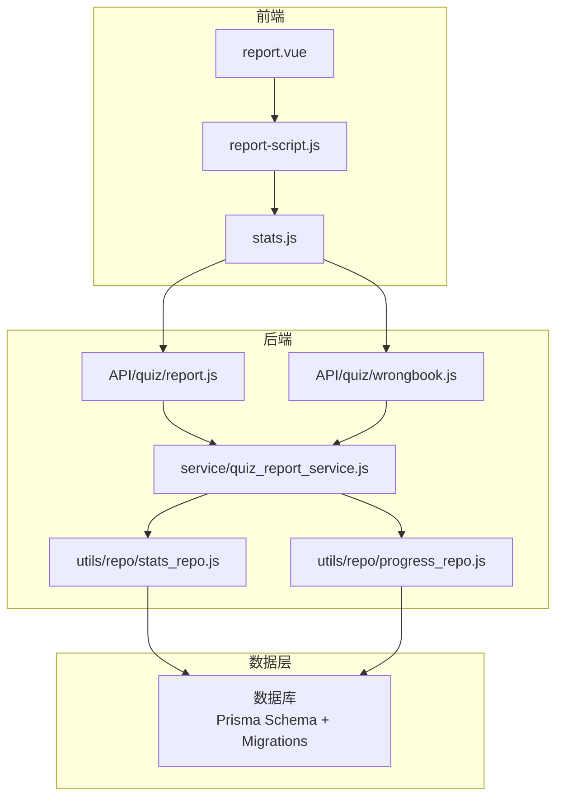
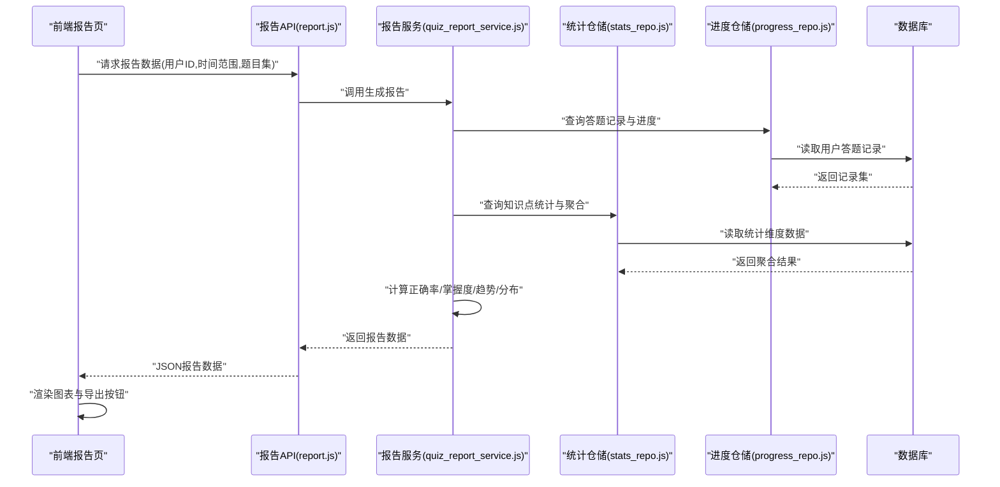
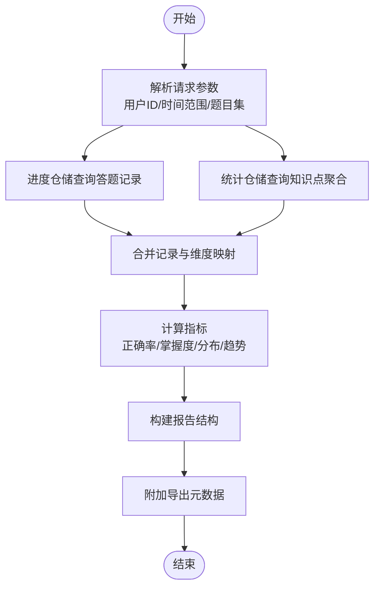
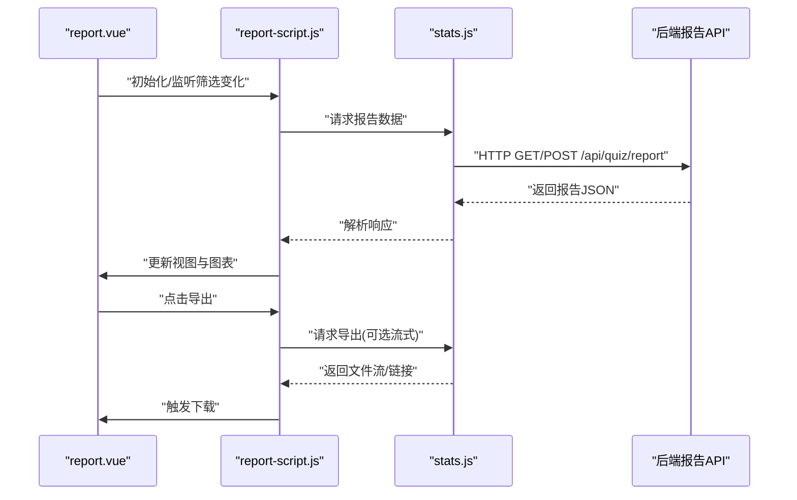
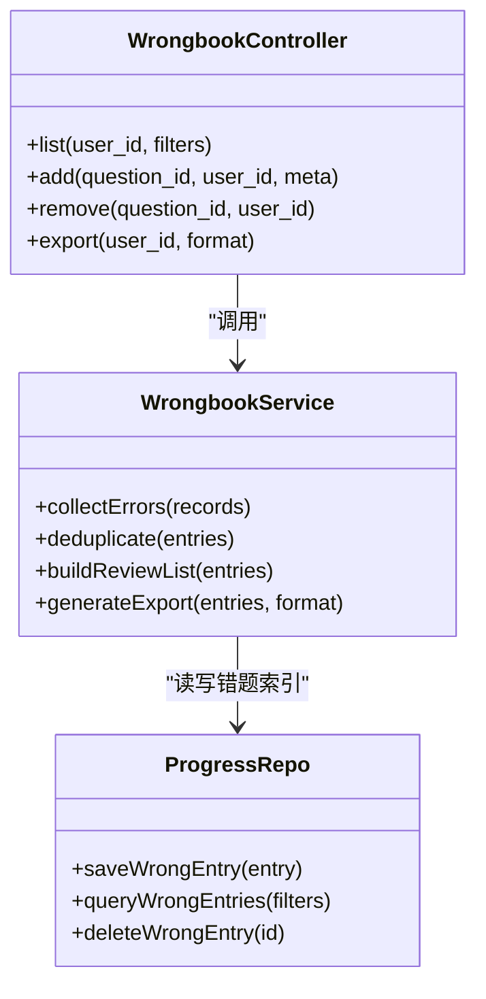
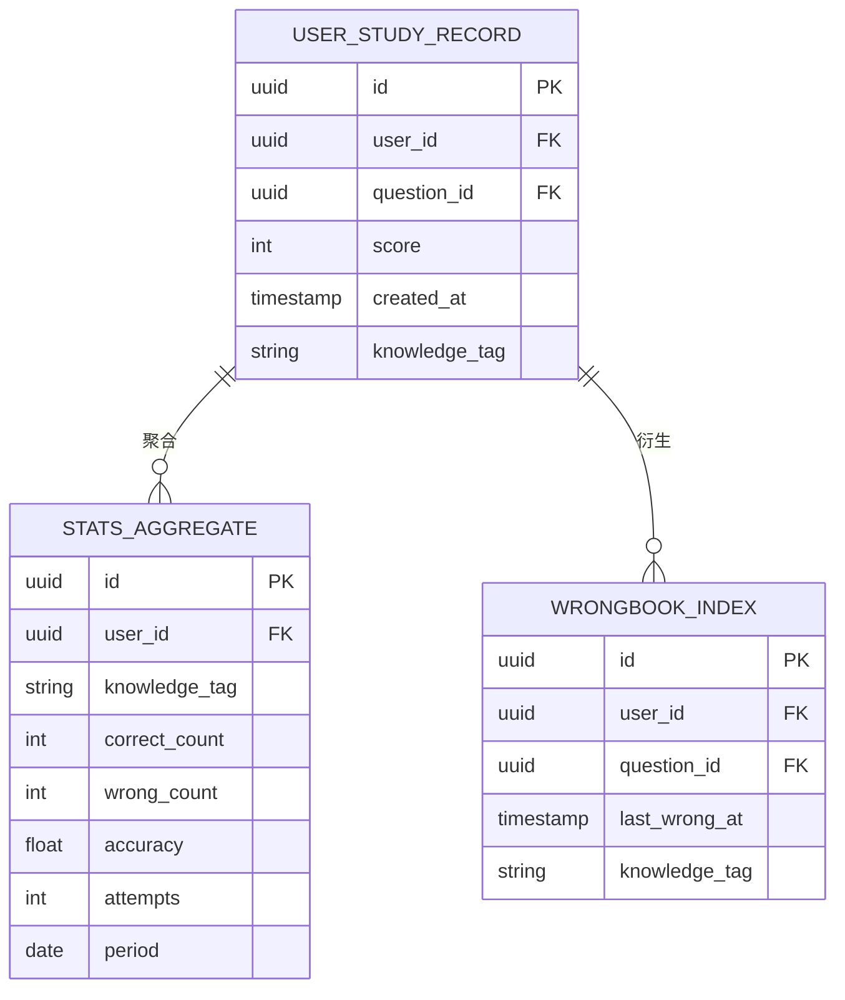
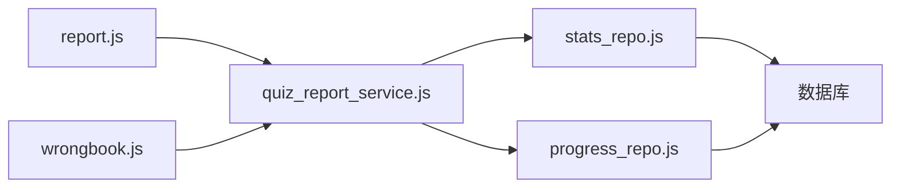

# 答题报告系统

<cite>
**本文档引用的文件**   
- [report.js](file://node-jinmao/API/quiz/report.js)
- [quiz_report_service.js](file://node-jinmao/service/quiz_report_service.js)
- [stats_repo.js](file://node-jinmao/utils/repo/stats_repo.js)
- [progress_repo.js](file://node-jinmao/utils/repo/progress_repo.js)
- [wrongbook.js](file://node-jinmao/API/quiz/wrongbook.js)
- [report-script.js](file://WEB/src/pages/quiz/report-script.js)
- [report.vue](file://WEB/src/pages/quiz/report.vue)
- [stats.js](file://WEB/src/api/stats.js)
- [schema.prisma](file://node-jinmao/prisma/schema.prisma)
- [20260724_add_user_study_record/migration.sql](file://node-jinmao/prisma/migrations/20260724_add_user_study_record/migration.sql)
</cite>

## 目录
1. [简介](#简介)
2. [项目结构](#项目结构)
3. [核心组件](#核心组件)
4. [架构总览](#架构总览)
5. [详细组件分析](#详细组件分析)
6. [依赖关系分析](#依赖关系分析)
7. [性能考量](#性能考量)
8. [故障排查指南](#故障排查指南)
9. [结论](#结论)
10. [附录](#附录)

## 简介
本文件面向“答题报告系统”的开发者与使用者，系统性阐述学习分析报告的生成机制、数据收集与处理流程、可视化图表实现、错题本自动整理原理以及报告导出能力。文档以代码仓库为依据，结合前后端关键模块，帮助读者快速理解从用户答题记录到可视化报告的完整链路，并给出可操作的优化建议与排错方法。

## 项目结构
围绕答题报告系统，前端位于 WEB 目录，后端服务位于 node-jinmao 目录。核心路径包括：
- 后端 API 层：API/quiz/report.js、API/quiz/wrongbook.js
- 后端服务层：service/quiz_report_service.js
- 数据访问层：utils/repo/stats_repo.js、utils/repo/progress_repo.js
- 数据库模型与迁移：prisma/schema.prisma、migrations/*
- 前端页面与脚本：WEB/src/pages/quiz/report.vue、report-script.js
- 前端 API 调用：WEB/src/api/stats.js

**图示来源** 
- [report.js](file://node-jinmao/API/quiz/report.js)
- [quiz_report_service.js](file://node-jinmao/service/quiz_report_service.js)
- [stats_repo.js](file://node-jinmao/utils/repo/stats_repo.js)
- [progress_repo.js](file://node-jinmao/utils/repo/progress_repo.js)
- [report.vue](file://WEB/src/pages/quiz/report.vue)
- [report-script.js](file://WEB/src/pages/quiz/report-script.js)
- [stats.js](file://WEB/src/api/stats.js)

**章节来源**
- [report.js](file://node-jinmao/API/quiz/report.js)
- [quiz_report_service.js](file://node-jinmao/service/quiz_report_service.js)
- [stats_repo.js](file://node-jinmao/utils/repo/stats_repo.js)
- [progress_repo.js](file://node-jinmao/utils/repo/progress_repo.js)
- [report.vue](file://WEB/src/pages/quiz/report.vue)
- [report-script.js](file://WEB/src/pages/quiz/report-script.js)
- [stats.js](file://WEB/src/api/stats.js)

## 核心组件
- 报告 API（report.js）：提供获取报告数据的接口，接收用户ID、时间范围、题目集合等参数，返回统计指标与明细。
- 报告服务（quiz_report_service.js）：聚合答题记录、正确率、知识点掌握度、成绩分布、进步趋势等计算逻辑，协调仓储层数据读取。
- 统计仓储（stats_repo.js）：封装对统计数据表的查询与聚合，如按知识点维度汇总正确率、错误次数等。
- 进度仓储（progress_repo.js）：封装对用户答题进度与历史记录的读写，支撑趋势分析与错题筛选。
- 前端报告页（report.vue、report-script.js）：渲染报告视图，发起统计请求，驱动图表展示。
- 错题本 API（wrongbook.js）：提供错题收集、去重、分页与导出能力。

**章节来源**
- [report.js](file://node-jinmao/API/quiz/report.js)
- [quiz_report_service.js](file://node-jinmao/service/quiz_report_service.js)
- [stats_repo.js](file://node-jinmao/utils/repo/stats_repo.js)
- [progress_repo.js](file://node-jinmao/utils/repo/progress_repo.js)
- [report.vue](file://WEB/src/pages/quiz/report.vue)
- [report-script.js](file://WEB/src/pages/quiz/report-script.js)
- [wrongbook.js](file://node-jinmao/API/quiz/wrongbook.js)

## 架构总览
报告系统的整体流程如下：
- 前端在报告页面触发“生成/刷新报告”动作，调用 stats API。
- 后端 report API 接收请求，校验参数后交由 quiz_report_service 进行计算。
- 服务层通过 stats_repo 与 progress_repo 读取用户答题记录、知识点标签、答案与评分信息。
- 服务层输出结构化报告数据（含统计指标、明细列表、趋势序列、雷达图维度）。
- 前端根据返回数据渲染图表（成绩分布、进步趋势、知识点雷达图等），并提供导出入口。

**图示来源** 
- [report.js](file://node-jinmao/API/quiz/report.js)
- [quiz_report_service.js](file://node-jinmao/service/quiz_report_service.js)
- [stats_repo.js](file://node-jinmao/utils/repo/stats_repo.js)
- [progress_repo.js](file://node-jinmao/utils/repo/progress_repo.js)

**章节来源**
- [report.js](file://node-jinmao/API/quiz/report.js)
- [quiz_report_service.js](file://node-jinmao/service/quiz_report_service.js)
- [stats_repo.js](file://node-jinmao/utils/repo/stats_repo.js)
- [progress_repo.js](file://node-jinmao/utils/repo/progress_repo.js)

## 详细组件分析

### 报告数据生成与服务编排
- 输入参数：用户标识、时间窗口、题目集合或课程/章节范围、是否包含错题过滤。
- 数据处理：
  - 从进度仓储拉取用户答题记录（题号、答案、得分、时间戳）。
  - 从统计仓储聚合知识点维度（正确数、错误数、尝试次数、平均用时）。
  - 计算指标：总体正确率、各知识点掌握度、成绩分布区间、趋势序列（按日/周/月）。
- 输出结构：
  - 概览指标（总分、正确率、完成度、用时）。
  - 明细列表（题目ID、类型、知识点、得分、状态）。
  - 图表数据（分布直方图、折线趋势、雷达维度值）。
  - 导出元数据（PDF/Excel所需字段与样式配置）。

**图示来源** 
- [quiz_report_service.js](file://node-jinmao/service/quiz_report_service.js)
- [stats_repo.js](file://node-jinmao/utils/repo/stats_repo.js)
- [progress_repo.js](file://node-jinmao/utils/repo/progress_repo.js)

**章节来源**
- [quiz_report_service.js](file://node-jinmao/service/quiz_report_service.js)
- [stats_repo.js](file://node-jinmao/utils/repo/stats_repo.js)
- [progress_repo.js](file://node-jinmao/utils/repo/progress_repo.js)

### 前端报告渲染与交互
- 页面职责：
  - 加载报告数据，展示概览卡片与图表。
  - 支持筛选（时间范围、知识点、题型）与刷新。
  - 提供导出按钮，触发 PDF/Excel 下载。
- 脚本职责：
  - 调用 stats API 获取数据。
  - 将数据转换为图表库所需格式。
  - 处理错误与空数据场景。

**图示来源** 
- [report.vue](file://WEB/src/pages/quiz/report.vue)
- [report-script.js](file://WEB/src/pages/quiz/report-script.js)
- [stats.js](file://WEB/src/api/stats.js)
- [report.js](file://node-jinmao/API/quiz/report.js)

**章节来源**
- [report.vue](file://WEB/src/pages/quiz/report.vue)
- [report-script.js](file://WEB/src/pages/quiz/report-script.js)
- [stats.js](file://WEB/src/api/stats.js)

### 错题本功能实现原理
- 收集策略：
  - 基于答题记录中“错误”标记或得分低于阈值判定为错题。
  - 按用户ID与题目ID去重，保留最近一次错误时间与知识点标签。
- 存储与检索：
  - 使用进度仓储写入错题索引，支持分页与条件筛选（知识点、题型、时间）。
  - 提供批量删除与复习模式的数据接口。
- 导出与复习：
  - 支持导出为 Excel/PDF，便于打印与离线复习。
  - 复习视图按知识点分组，显示题干、选项、正确答案与解析。

**图示来源** 
- [wrongbook.js](file://node-jinmao/API/quiz/wrongbook.js)
- [quiz_report_service.js](file://node-jinmao/service/quiz_report_service.js)
- [progress_repo.js](file://node-jinmao/utils/repo/progress_repo.js)

**章节来源**
- [wrongbook.js](file://node-jinmao/API/quiz/wrongbook.js)
- [quiz_report_service.js](file://node-jinmao/service/quiz_report_service.js)
- [progress_repo.js](file://node-jinmao/utils/repo/progress_repo.js)

### 数据模型与持久化
- 核心实体：
  - 用户学习记录：关联用户、题目、得分、时间戳、知识点标签。
  - 统计聚合表：按知识点/题型/日期维度汇总正确率、尝试次数、用时。
  - 错题索引：用户-题目-错误时间-知识点，支持去重与分页。
- 迁移与演进：
  - 通过 Prisma 管理 schema，migrations 保证版本一致性。
  - 新增字段与表需遵循迁移规范，避免破坏现有查询。

**图示来源** 
- [schema.prisma](file://node-jinmao/prisma/schema.prisma)
- [20260724_add_user_study_record/migration.sql](file://node-jinmao/prisma/migrations/20260724_add_user_study_record/migration.sql)

**章节来源**
- [schema.prisma](file://node-jinmao/prisma/schema.prisma)
- [20260724_add_user_study_record/migration.sql](file://node-jinmao/prisma/migrations/20260724_add_user_study_record/migration.sql)

## 依赖关系分析
- 耦合与内聚：
  - report API 仅负责参数校验与路由转发，业务逻辑集中在 service 层，保持高内聚低耦合。
  - repo 层屏蔽数据库细节，对外暴露统一查询接口，利于替换存储实现。
- 外部依赖：
  - 图表渲染依赖前端可视化库（如 ECharts/AntV）。
  - 导出依赖后端文件生成库（如 PDF/Excel 模板引擎）。
- 潜在循环依赖：
  - 确保 service 不直接依赖 API，repo 不依赖 service，避免环状引用。

**图示来源** 
- [report.js](file://node-jinmao/API/quiz/report.js)
- [wrongbook.js](file://node-jinmao/API/quiz/wrongbook.js)
- [quiz_report_service.js](file://node-jinmao/service/quiz_report_service.js)
- [stats_repo.js](file://node-jinmao/utils/repo/stats_repo.js)
- [progress_repo.js](file://node-jinmao/utils/repo/progress_repo.js)

**章节来源**
- [report.js](file://node-jinmao/API/quiz/report.js)
- [wrongbook.js](file://node-jinmao/API/quiz/wrongbook.js)
- [quiz_report_service.js](file://node-jinmao/service/quiz_report_service.js)
- [stats_repo.js](file://node-jinmao/utils/repo/stats_repo.js)
- [progress_repo.js](file://node-jinmao/utils/repo/progress_repo.js)

## 性能考量
- 查询优化：
  - 对常用筛选字段建立索引（user_id、knowledge_tag、created_at）。
  - 聚合查询尽量使用数据库侧 GROUP BY 与窗口函数，减少内存计算。
- 缓存策略：
  - 对热点用户的报告数据进行短时缓存（TTL 5-15分钟），降低重复计算压力。
  - 错题索引采用增量更新，避免全量重建。
- 异步与流式：
  - 大报告导出采用流式传输，避免一次性加载导致内存峰值。
  - 前端分片渲染图表数据，提升首屏速度。

[本节为通用指导，无需特定文件来源]

## 故障排查指南
- 常见错误：
  - 参数缺失或非法：检查用户ID、时间范围、题目集是否为空或格式错误。
  - 数据不一致：核对答题记录与知识点标签映射是否正确。
  - 导出失败：确认模板文件存在且权限正确，检查生成库依赖。
- 定位步骤：
  - 查看 API 日志与错误堆栈，确认异常位置。
  - 检查仓储层 SQL 执行计划与索引命中情况。
  - 前端控制台查看网络响应与图表渲染错误。

**章节来源**
- [report.js](file://node-jinmao/API/quiz/report.js)
- [quiz_report_service.js](file://node-jinmao/service/quiz_report_service.js)
- [stats_repo.js](file://node-jinmao/utils/repo/stats_repo.js)
- [progress_repo.js](file://node-jinmao/utils/repo/progress_repo.js)

## 结论
答题报告系统通过清晰的分层架构与模块化设计，实现了从数据采集、指标计算到可视化展示与导出的完整闭环。借助仓储层抽象与 Prisma 数据模型管理，系统在可扩展性与可维护性方面具备良好基础。未来可在缓存、异步导出与个性化定制方面持续优化，以满足更多用户群体的需求。

[本节为总结性内容，无需特定文件来源]

## 附录
- 可视化图表建议：
  - 成绩分布图：柱状图展示分数段人数或占比。
  - 进步趋势图：折线图展示正确率随时间的变化。
  - 知识点雷达图：多边形展示各知识点的掌握度对比。
- 个性化报告定制：
  - 支持选择展示维度（按课程/章节/知识点/题型）。
  - 支持自定义时间粒度（日/周/月/年）。
  - 支持导出模板选择（简洁版/详细版/教师版）。

[本节为概念性内容，无需特定文件来源]